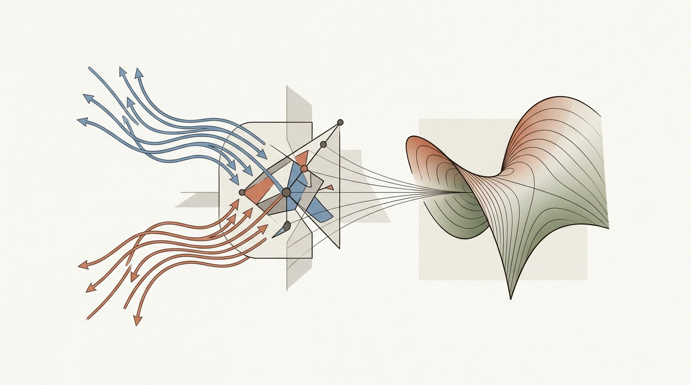
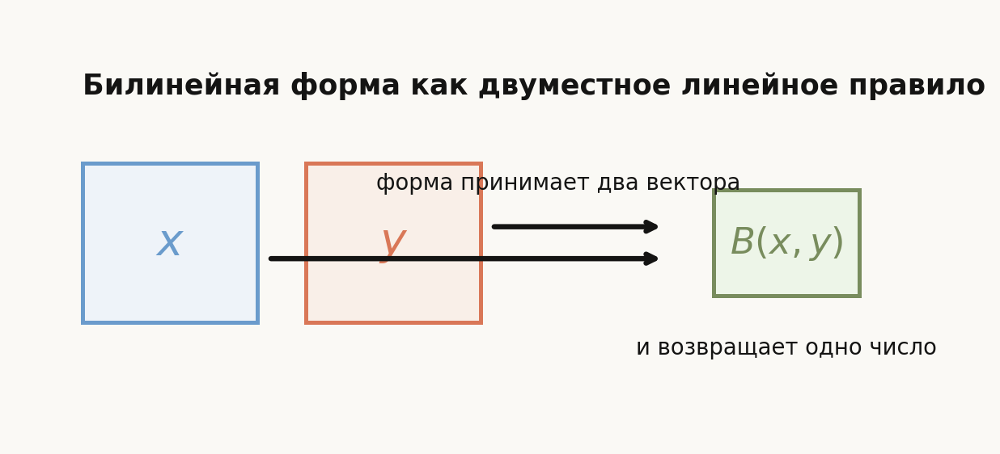
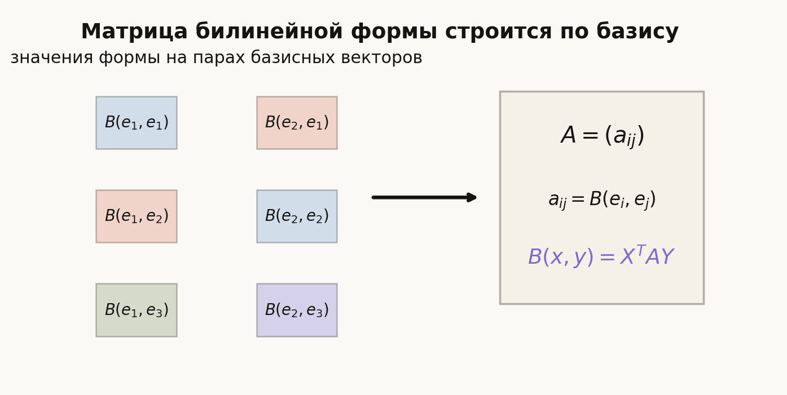
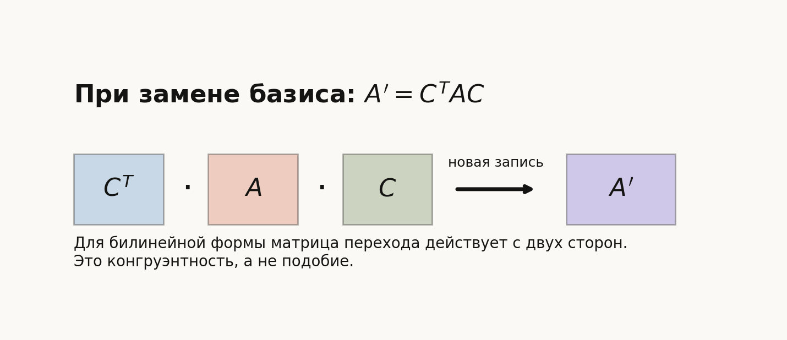
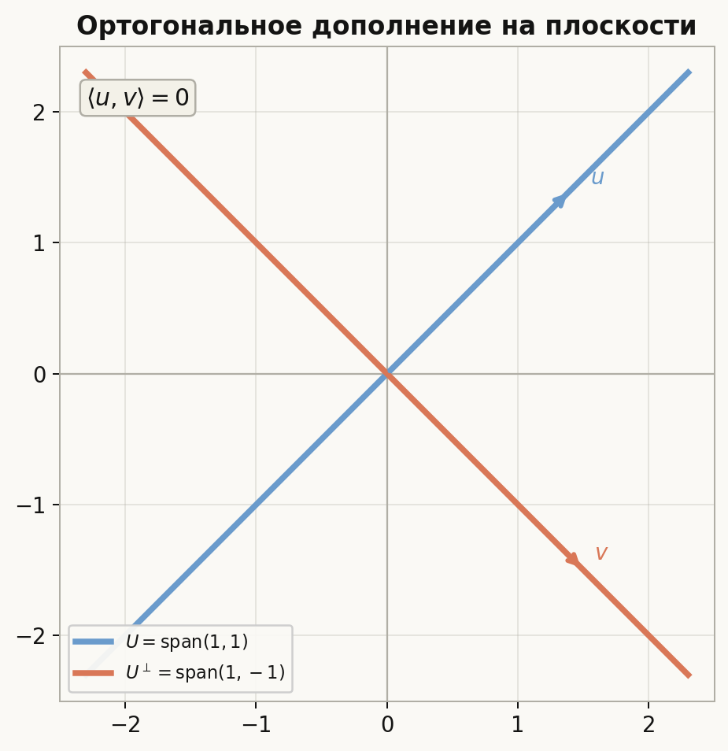
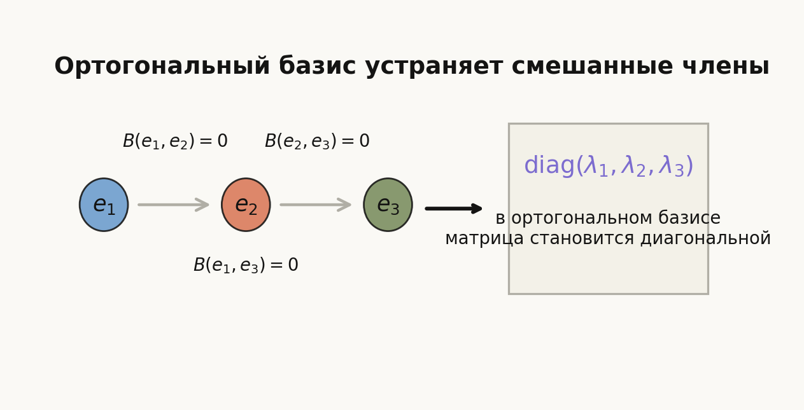
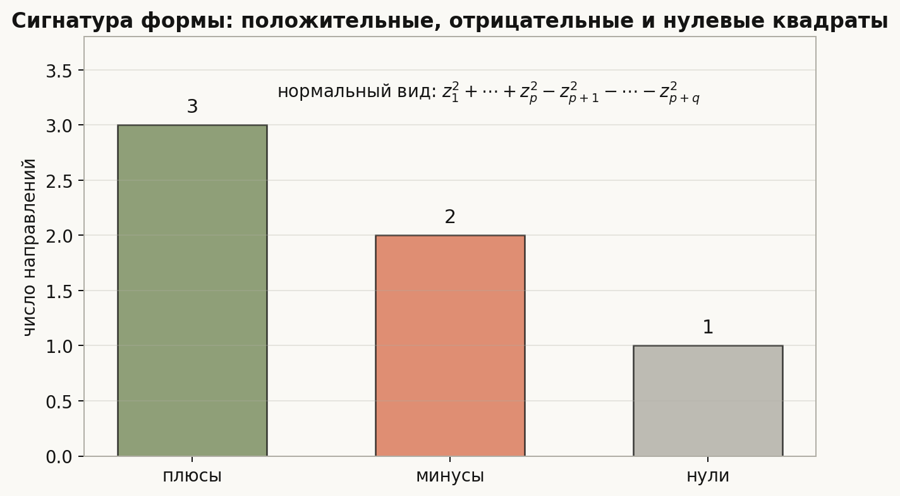
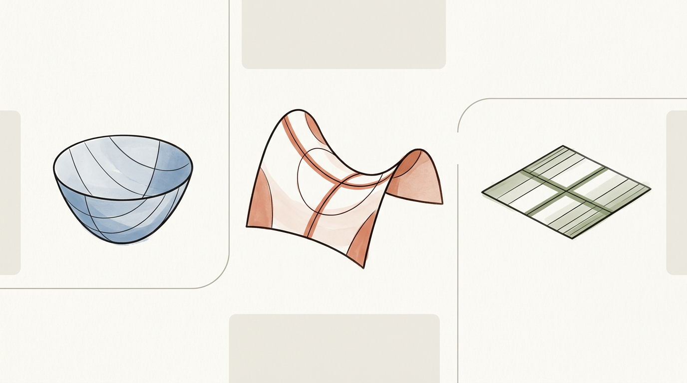

# Лекция: билинейные и квадратичные формы

## План

1. Зачем нужны билинейные и квадратичные формы
2. Билинейная функция: определение и примеры
3. Матрица билинейной формы в выбранном базисе
4. Изменение матрицы при замене базиса
5. Симметрические и кососимметрические формы
6. Квадратичная функция и её связь с билинейной
7. Ортогональность и ортогональное дополнение
8. Существование ортогонального базиса для симметрической билинейной формы
9. Приведение квадратичной формы к диагональному виду
10. Нормальный вид вещественной квадратичной функции
11. Закон инерции
12. Что важно для поступления в ШАД
13. Типичные ошибки
14. Итог
15. Вопросы для самопроверки

В прошлых лекциях матрица описывала линейный оператор: один вектор на входе, один вектор на выходе. В этой лекции матрица начинает описывать другой тип объекта: правило, которое берёт два вектора и возвращает число.

Главная линия лекции:
$$
\text{билинейная форма}\to \text{матрица формы}\to \text{конгруэнтность}\to \text{квадратичная форма}\to \text{инерция}.
$$

---

## 1. Зачем нужны билинейные и квадратичные формы

В линейной алгебре часто нужно не просто складывать векторы и умножать их на числа, но и измерять, как два вектора взаимодействуют между собой.

Самый знакомый пример такого взаимодействия — скалярное произведение:
$$
\langle x,y\rangle=x_1y_1+\dots+x_ny_n.
$$

Оно зависит сразу от двух векторов и линейно по каждому из них. Именно это и приводит к понятию **билинейной формы**.

Если затем в этой форме подставить один и тот же вектор дважды, получится выражение вида
$$
B(x,x).
$$

Это уже **квадратичная форма**. Она отвечает не за взаимодействие двух разных векторов, а за "самооценку" одного вектора: знак, величину, направление роста и так далее.

Эти объекты возникают во многих темах:

- в скалярных произведениях и евклидовой геометрии;
- в исследовании экстремумов функций нескольких переменных через матрицу Гессе;
- в задачах на приведение уравнений второго порядка к простому виду;
- в критерии Сильвестра и вопросах положительной определённости;
- в описании ортогональности относительно произвольной симметрической формы.

Главная идея темы такая:

- билинейная форма кодируется матрицей;
- при замене базиса эта матрица меняется по закону
$$
A' = C^TAC;
$$
- симметрическую билинейную форму можно в подходящем базисе диагонализовать;
- для вещественных квадратичных форм знаки диагональных коэффициентов сводятся к инвариантам, которые описывает закон инерции.

---

## 2. Билинейная функция: определение и примеры

Пусть $V$ — векторное пространство над полем $\mathbb{R}$ или $\mathbb{C}$.

### Определение

Отображение
$$
B\colon V\times V\to \mathbb{F}
$$
называется **билинейной функцией** или **билинейной формой**, если оно линейно по каждому аргументу отдельно:

для любых $x,x',y,y'\in V$ и любых чисел $\alpha,\beta$ выполнено
$$
B(\alpha x+\beta x',y)=\alpha B(x,y)+\beta B(x',y),
$$
$$
B(x,\alpha y+\beta y')=\alpha B(x,y)+\beta B(x,y').
$$

Здесь $\mathbb{F}$ — то поле, над которым рассматривается пространство.

### Как это понимать

Форма $B(x,y)$:

- принимает на вход **два** вектора;
- возвращает **одно число**;
- ведёт себя линейно по первому аргументу;
- и независимо линейно по второму.

То есть билинейная форма — это "двуместная линейная функция".

### Примеры

#### 1. Обычное скалярное произведение на $\mathbb{R}^n$

$$
B(x,y)=x_1y_1+\dots+x_ny_n.
$$

Это симметрическая билинейная форма.

#### 2. Форма с матрицей

Если дана матрица $A\in M_n(\mathbb{R})$, то можно определить
$$
B(x,y)=x^TAy.
$$

Это билинейная форма на $\mathbb{R}^n$.

#### 3. Кососимметрический пример на $\mathbb{R}^2$

$$
B(x,y)=x_1y_2-x_2y_1.
$$

Эта форма не симметрична. Она меняет знак при перестановке аргументов.

### Почему любой такой вид естественен

В конечномерном пространстве любая билинейная форма в выбранном базисе записывается именно как
$$
B(x,y)=x^TAy.
$$

То есть матрица — это не частный трюк, а координатная запись любой билинейной формы.

---

## 3. Матрица билинейной формы в выбранном базисе

Пусть $V$ — конечномерное пространство, и
$$
e=(e_1,\dots,e_n)
$$
— базис в $V$.

### Как строится матрица

Для билинейной формы $B$ определим числа
$$
a_{ij}=B(e_i,e_j).
$$

Из них составляется матрица
$$
A=(a_{ij})_{i,j=1}^n.
$$

Она называется **матрицей билинейной формы $B$ в базисе $e$**.

### Формула в координатах

Если
$$
x=\sum_{i=1}^n x_ie_i,\qquad y=\sum_{j=1}^n y_je_j,
$$
то по билинейности
$$
\begin{aligned}
B(x,y)
&=B\left(\sum_i x_ie_i,\sum_j y_je_j\right) \\
&=\sum_{i,j}x_iy_jB(e_i,e_j) \\
&=\sum_{i,j}x_ia_{ij}y_j.
\end{aligned}
$$

В матричном виде это записывается так:
$$
B(x,y)=X^TAY,
$$
где $X$ и $Y$ — столбцы координат векторов $x$ и $y$ в базисе $e$.

### Что означают строки и столбцы

- индекс $i$ отвечает первому аргументу;
- индекс $j$ отвечает второму аргументу;
- элемент $a_{ij}$ — это значение формы на паре базисных векторов $(e_i,e_j)$.

Поэтому матрица формы не "придумывается", а просто считывается со значений формы на базисе.

### Пример

Пусть на $\mathbb{R}^2$ задана форма
$$
B(x,y)=2x_1y_1+3x_1y_2-x_2y_1+4x_2y_2.
$$

Тогда в стандартном базисе её матрица равна
$$
A=\begin{pmatrix}
2 & 3\\
-1 & 4
\end{pmatrix},
$$
потому что
$$
B(x,y)=
\begin{pmatrix}
x_1 & x_2
\end{pmatrix}
\begin{pmatrix}
2 & 3\\
-1 & 4
\end{pmatrix}
\begin{pmatrix}
y_1\\
y_2
\end{pmatrix}.
$$

---

## 4. Изменение матрицы при замене базиса

Это одна из главных формул темы.

Пусть:

- $A$ — матрица билинейной формы $B$ в старом базисе $e$;
- $e'$ — новый базис;
- $C$ — матрица перехода от новых координат к старым.

Это означает, что если столбец координат вектора $x$ в новом базисе равен $X'$, то в старом базисе
$$
X=CX'.
$$

Аналогично для второго вектора:
$$
Y=CY'.
$$

Здесь важно помнить соглашение о направлении: $C$ переводит **новые координаты в старые**. Это тот же тип матрицы перехода, который использовался в лекции о линейных отображениях, но теперь она применяется сразу к обоим аргументам формы.

### Вывод формулы

Имеем
$$
B(x,y)=X^TAY=(CX')^TA(CY').
$$

Так как
$$
(CX')^T=(X')^TC^T,
$$
получаем
$$
B(x,y)=(X')^TC^TACY'.
$$

Левая матрица $C^T$ появляется не “по правилу запоминания”, а потому что первый столбец координат стоит в формуле транспонированным. Для первого аргумента замена базиса превращается в $(CX')^T=(X')^TC^T$, для второго остаётся $CY'$.

Значит, матрица формы в новом базисе равна
$$
A'=C^TAC.
$$

### Почему здесь не похожесть, а конгруэнтность

Для линейных операторов при замене базиса возникает формула
$$
A'=C^{-1}AC.
$$

Для билинейной формы формула другая:
$$
A'=C^TAC.
$$

Это очень важно:

- у оператора один вектор подаётся на вход и один получается на выходе;
- у билинейной формы на вход подаются **два** вектора;
- поэтому матрица перехода появляется сразу с двух сторон.

Смысл формул тоже разный. Подобие $C^{-1}AC$ сохраняет оператор как преобразование пространства, а конгруэнтность $C^TAC$ сохраняет числовые значения формы $B(x,y)$ при другой координатной записи тех же векторов.

Такое преобразование называется **конгруэнтностью матриц**.

### Пример

Пусть
$$
A=\begin{pmatrix}
2 & 1\\
1 & 3
\end{pmatrix},
\qquad
C=\begin{pmatrix}
1 & 1\\
0 & 1
\end{pmatrix}.
$$

Тогда
$$
C^T=
\begin{pmatrix}
1 & 0\\
1 & 1
\end{pmatrix},
$$
и
$$
A'=C^TAC=
\begin{pmatrix}
2 & 3\\
3 & 7
\end{pmatrix}.
$$

Смысл в том, что сама форма не изменилась, изменилась только её координатная запись.

---

## 5. Симметрические и кососимметрические формы

### Симметрическая форма

Билинейная форма $B$ называется **симметрической**, если
$$
B(x,y)=B(y,x)
$$
для всех $x,y\in V$.

В матричной записи это эквивалентно условию
$$
A^T=A.
$$

Действительно,
$$
B(y,x)=Y^TAX=X^TA^TY.
$$

Чтобы это совпадало с $X^TAY$ для всех $X,Y$, нужно и достаточно, чтобы $A=A^T$.

### Кососимметрическая форма

Форма называется **кососимметрической**, если
$$
B(x,y)=-B(y,x)
$$
для всех $x,y$.

Тогда её матрица удовлетворяет
$$
A^T=-A.
$$

На диагонали такой матрицы стоят нули:
$$
a_{ii}=-a_{ii}\quad \Rightarrow\quad a_{ii}=0.
$$

### Почему в этой теме особенно важны симметрические формы

Именно симметрические билинейные формы связаны с квадратичными формами:
$$
q(x)=B(x,x).
$$

Именно для них есть удобная теория ортогональных дополнений, ортогональных базисов, диагонального вида и закона инерции.

---

## 6. Квадратичная функция и её связь с билинейной

### Определение квадратичной формы

Функция
$$
q\colon V\to \mathbb{F}
$$
называется **квадратичной**, если в выбранном базисе она имеет вид
$$
q(x)=X^TAX
$$
для некоторой матрицы $A$.

В этой записи $x$ — это вектор пространства, а $X$ — столбец его координат в выбранном базисе. Сама квадратичная форма не обязана быть “привязана” к этому базису; при замене базиса меняется только матрица.

В координатах это выражение состоит из одночленов второй степени:
$$
q(x_1,\dots,x_n)=\sum_{i,j}a_{ij}x_ix_j.
$$

### Пример

На $\mathbb{R}^2$ функция
$$
q(x_1,x_2)=2x_1^2+4x_1x_2+3x_2^2
$$
является квадратичной формой.

Её можно записать как
$$
q(x)=X^TAX,
$$
где
$$
A=\begin{pmatrix}
2 & 2\\
2 & 3
\end{pmatrix}.
$$

Действительно,
$$
\begin{pmatrix}
x_1 & x_2
\end{pmatrix}
\begin{pmatrix}
2 & 2\\
2 & 3
\end{pmatrix}
\begin{pmatrix}
x_1\\
x_2
\end{pmatrix}
=2x_1^2+4x_1x_2+3x_2^2.
$$

### Связь с симметрической билинейной формой

Если $B$ — симметрическая билинейная форма, то
$$
q(x)=B(x,x)
$$
является квадратичной формой.

Обратно, над полями характеристики не $2$ всякая квадратичная форма однозначно восстанавливает симметрическую билинейную форму по **поляризационной формуле**:
$$
B(x,y)=\frac{1}{2}\bigl(q(x+y)-q(x)-q(y)\bigr).
$$

Эквивалентная симметрическая формула:
$$
B(x,y)=\frac{1}{4}\bigl(q(x+y)-q(x-y)\bigr).
$$

### Почему это важно

Это означает, что для вещественных и комплексных пространств симметрические билинейные формы и квадратичные формы — по существу два языка описания одного и того же объекта:

- билинейная форма удобна для ортогональности и матриц;
- квадратичная форма удобна для анализа знака и геометрии поверхностей второго порядка.

### Симметрическая часть матрицы

Если записать квадратичную форму как
$$
q(x)=X^TAX,
$$
то на самом деле имеет значение только симметрическая часть матрицы:
$$
\frac{A+A^T}{2}.
$$

Антисимметрическая часть не влияет на $X^TAX$, потому что
$$
X^T(A-A^T)X=0.
$$

Поэтому квадратичную форму всегда можно считать заданной симметрической матрицей.

На практике это значит: если в задаче дана несимметричная матрица $A$ в выражении $X^TAX$, её сначала можно заменить на $\frac{A+A^T}{2}$, а уже потом применять методы для симметрических форм.

---

## 7. Ортогональность и ортогональное дополнение

Пусть $B$ — симметрическая билинейная форма на $V$.

### Ортогональность

Векторы $x$ и $y$ называются **ортогональными относительно формы $B$**, если
$$
B(x,y)=0.
$$

Это обобщает обычное скалярное произведение, но здесь возможны новые явления:

- ненулевой вектор может оказаться ортогональным самому себе;
- форма может быть вырожденной;
- ортогональность зависит от выбранной формы, а не только от пространства.

### Ортогональное дополнение

Для подпространства $U\subseteq V$ его **ортогональным дополнением** называется множество
$$
U^\perp=\{v\in V\mid B(v,u)=0\ \text{для всех}\ u\in U\}.
$$

### Почему это подпространство

Если $v_1,v_2\in U^\perp$, то для любого $u\in U$ имеем
$$
B(v_1,u)=0,\qquad B(v_2,u)=0.
$$

Тогда
$$
B(\alpha v_1+\beta v_2,u)=\alpha B(v_1,u)+\beta B(v_2,u)=0.
$$

Значит,
$$
\alpha v_1+\beta v_2\in U^\perp.
$$

Следовательно, $U^\perp$ — подпространство.

### Пример в $\mathbb{R}^2$

Возьмём обычное скалярное произведение
$$
B(x,y)=x_1y_1+x_2y_2.
$$

Пусть
$$
U=\operatorname{span}(1,1).
$$

Тогда вектор $v=(a,b)$ лежит в $U^\perp$, если
$$
B((a,b),(1,1))=a+b=0.
$$

Значит,
$$
U^\perp=\operatorname{span}(1,-1).
$$

### Важное замечание

Если форма невырождена, то выполняются хорошие размерностные свойства, например
$$
\dim U+\dim U^\perp=\dim V.
$$

Если форма вырождена, это уже может нарушаться.

---

## 8. Существование ортогонального базиса для симметрической билинейной формы

Это центральный структурный факт темы.

### Формулировка

Пусть $V$ — конечномерное пространство над $\mathbb{R}$ или $\mathbb{C}$, и $B$ — симметрическая билинейная форма на $V$. Тогда в пространстве $V$ существует базис
$$
e_1,\dots,e_n,
$$
в котором
$$
B(e_i,e_j)=0\qquad \text{при } i\ne j.
$$

Такой базис называется **ортогональным** относительно формы $B$.

### Идея доказательства

Доказательство идёт по индукции по размерности.

#### Случай 1. Форма тождественно нулевая

Тогда любой базис уже ортогонален.

#### Случай 2. Существует вектор $v$ такой, что $B(v,v)\ne 0$

Тогда рассматриваем подпространство
$$
\langle v\rangle^\perp.
$$

Оно имеет коразмерность $1$. На нём форма снова симметрична, и по индукции там есть ортогональный базис. Добавив в начало вектор $v$, получим ортогональный базис всего пространства.

#### Почему коразмерность равна $1$

Если $B(v,v)\ne 0$, то линейный функционал
$$
u\mapsto B(u,v)
$$
ненулевой, значит его ядро имеет размерность на единицу меньше.

#### Случай 3. Для всех $v$ выполнено $B(v,v)=0$

Тогда над полем характеристики не $2$ форма обязана быть нулевой. Действительно, из симметричности:
$$
0=B(x+y,x+y)=B(x,x)+2B(x,y)+B(y,y)=2B(x,y).
$$

Значит,
$$
B(x,y)=0
$$
для всех $x,y$.

### Следствие

В ортогональном базисе матрица симметрической билинейной формы диагональна:
$$
A=\operatorname{diag}(\lambda_1,\dots,\lambda_n).
$$

Это и есть алгебраический смысл существования ортогонального базиса.

---

## 9. Приведение квадратичной формы к диагональному виду

Пусть квадратичная форма в некотором базисе имеет вид
$$
q(x)=X^TAX,
$$
где $A=A^T$.

### Что означает диагональный вид

В подходящем базисе квадратичная форма записывается так:
$$
q(y)=\lambda_1 y_1^2+\dots+\lambda_n y_n^2.
$$

То есть смешанные члены вида $y_iy_j$ при $i\ne j$ исчезают.

### Почему это эквивалентно ортогональному базису

Если базис ортогонален, то
$$
B(e_i,e_j)=0\qquad (i\ne j).
$$

Значит, матрица формы диагональна, а квадратичная форма распадается в сумму квадратов по координатам.

И наоборот: если в каком-то базисе матрица формы диагональна, то разные базисные направления не взаимодействуют друг с другом относительно $B$. Поэтому диагонализация формы — это не просто упрощение записи, а поиск независимых направлений для квадратичного выражения.

### Пример через выделение полного квадрата

Рассмотрим
$$
q(x_1,x_2)=x_1^2+4x_1x_2+3x_2^2.
$$

Выделим полный квадрат:
$$
q(x_1,x_2)=(x_1+2x_2)^2-x_2^2.
$$

Если ввести новые координаты
$$
y_1=x_1+2x_2,\qquad y_2=x_2,
$$
то форма принимает вид
$$
q=y_1^2-y_2^2.
$$

Это уже диагональная запись.

Обратите внимание: здесь меняются координаты, а не сама функция $q$. Мы просто перешли к переменным, в которых смешанный член $4x_1x_2$ “поглощён” полным квадратом.

### Геометрический смысл

Смешанные члены показывают, что координатные оси выбраны "не вдоль естественных направлений" формы. Замена базиса подбирает направления, в которых форма ведёт себя независимо.

---

## 10. Нормальный вид вещественной квадратичной функции

Теперь предположим, что пространство вещественное.

### Нормировка диагональных коэффициентов

После диагонализации имеем
$$
q(y)=\lambda_1 y_1^2+\dots+\lambda_n y_n^2.
$$

Если $\lambda_i>0$, можно заменить координату
$$
z_i=\sqrt{\lambda_i}\,y_i.
$$

Если $\lambda_i<0$, можно написать
$$
\lambda_i y_i^2=-\bigl(\sqrt{|\lambda_i|}y_i\bigr)^2.
$$

Если $\lambda_i=0$, соответствующий член остаётся нулевым.

Значит, после ещё одной замены координат любая вещественная квадратичная форма приводится к виду
$$
q(z)=z_1^2+\dots+z_p^2-z_{p+1}^2-\dots-z_{p+q}^2,
$$
а оставшиеся переменные, если есть, вообще не входят в выражение.

Более полно:
$$
q(z)=z_1^2+\dots+z_p^2-z_{p+1}^2-\dots-z_{p+q}^2+0\cdot z_{p+q+1}^2+\dots+0\cdot z_n^2.
$$

Это и есть **нормальный вид вещественной квадратичной формы**.

### Что значат числа $p,q,r$

Если
$$
r=n-p-q,
$$
то:

- $p$ — число положительных квадратов;
- $q$ — число отрицательных квадратов;
- $r$ — число нулевых квадратов.

Эти числа очень важны: они не зависят от того, каким именно способом форма приведена к нормальному виду.

### Примеры

#### 1. Положительно определённая форма

$$
q=x_1^2+2x_2^2+5x_3^2
$$
имеет нормальный вид
$$
z_1^2+z_2^2+z_3^2.
$$

Здесь $p=3$, $q=0$, $r=0$.

#### 2. Неопределённая форма

$$
q=x_1^2-x_2^2
$$
уже находится в нормальном виде.

Здесь $p=1$, $q=1$, $r=0$.

#### 3. Вырожденная форма

$$
q=x_1^2
$$
в $\mathbb{R}^3$ имеет вид
$$
z_1^2+0\cdot z_2^2+0\cdot z_3^2.
$$

Здесь $p=1$, $q=0$, $r=2$.

---

## 11. Закон инерции

Это главный инвариантный результат темы.

### Формулировка

Пусть вещественная квадратичная форма приведена к нормальному виду. Тогда числа

- положительных квадратов $p$;
- отрицательных квадратов $q$;
- нулевых квадратов $r$

не зависят от выбора базиса.

Это утверждение называется **законом инерции**.

### Что это означает

Разные базисы могут менять конкретную формулу формы, но не могут изменить:

- сколько в ней "по-настоящему положительных" направлений;
- сколько "по-настоящему отрицательных";
- какова размерность ядра.

Поэтому тройка
$$
(p,q,r)
$$
является инвариантом квадратичной формы.

### Индексы инерции

Числа $p$ и $q$ называют **положительным** и **отрицательным индексами инерции**.

Иногда говорят просто о **сигнатуре** формы, имея в виду пару $(p,q)$ или тройку $(p,q,r)$ — в зависимости от соглашения.

### Почему это важно

Закон инерции позволяет классифицировать вещественные квадратичные формы с точностью до замены базиса.

Например:

- формы с сигнатурой $(n,0)$ — это положительно определённые формы;
- с сигнатурой $(0,n)$ — отрицательно определённые;
- с обеими ненулевыми частями — неопределённые формы;
- если $r>0$, форма вырождена.

### Связь с критерием Сильвестра

Критерий Сильвестра — это способ по матрице симметрической формы определить, что её сигнатура равна
$$
(n,0).
$$

То есть закон инерции даёт классификацию, а критерий Сильвестра — удобный вычислительный тест для специального случая положительной определённости.

### Геометрическая интуиция

Уравнение
$$
q(x)=1
$$
выглядит по-разному в зависимости от сигнатуры:

- при всех плюсах получается эллипсоидный тип;
- при смешанных знаках — гиперболоидный тип;
- при наличии нулей появляются цилиндрические направления.

Именно поэтому знак квадратов настолько важен.

---

## 12. Что важно для поступления в ШАД

Для этой темы полезно уметь уверенно делать следующее:

- давать определение билинейной формы и квадратичной формы;
- строить матрицу билинейной формы по базису;
- использовать формулу замены базиса
$$
A'=C^TAC;
$$
- понимать связь между симметрической билинейной формой и квадратичной формой;
- находить ортогональное дополнение к подпространству;
- понимать, почему для симметрической формы существует ортогональный базис;
- приводить квадратичную форму к диагональному или нормальному виду;
- различать положительно определённые, отрицательно определённые, неопределённые и вырожденные формы;
- знать смысл закона инерции и его связь с критерием Сильвестра.

На вступительных задачах особенно часто встречаются:

- приведение формы к сумме квадратов;
- исследование знака квадратичной формы;
- работа с параметрами в симметрической матрице;
- геометрический смысл уравнения второго порядка.

---

## 13. Типичные ошибки

- Путать формулы замены базиса для оператора и для билинейной формы:
  для оператора это $C^{-1}AC$, а для формы — $C^TAC$.
- Считать, что любая билинейная форма автоматически симметрична.
- Забывать, что квадратичная форма определяется только симметрической частью матрицы.
- Использовать свойства обычного скалярного произведения для произвольной вырожденной симметрической формы.
- Путать ортогональность относительно формы с обычной евклидовой ортогональностью.
- Считать, что диагональные коэффициенты после диагонализации определены однозначно; на самом деле однозначны только числа плюсов, минусов и нулей.
- Переносить критерий Сильвестра на нессимметричные матрицы.

---

## 14. Итог

Билинейная форма — это правило
$$
B(x,y),
$$
линейное по каждому аргументу. В выбранном базисе она записывается как
$$
B(x,y)=X^TAY.
$$

При замене базиса её матрица меняется по формуле
$$
A'=C^TAC.
$$

Если форма симметрична, то связанная с ней квадратичная форма
$$
q(x)=B(x,x)
$$
может быть приведена к диагональному виду, а над $\mathbb{R}$ — к нормальному виду
$$
z_1^2+\dots+z_p^2-z_{p+1}^2-\dots-z_{p+q}^2.
$$

Закон инерции утверждает, что числа положительных, отрицательных и нулевых квадратов являются инвариантами формы. Именно они дают её основную классификацию.

Следующая лекция рассматривает важный частный случай: симметрическая билинейная форма, которая ещё и положительно определена. Тогда она становится скалярным произведением, а пространство получает длины, углы, проекции и ортонормированные базисы.

---

## 15. Вопросы для самопроверки

1. Что такое билинейная форма?
2. Как по базису построить её матрицу?
3. Почему любая билинейная форма в координатах имеет вид $X^TAY$?
4. Как меняется матрица билинейной формы при замене базиса?
5. Чем симметрическая билинейная форма отличается от кососимметрической?
6. Как из симметрической билинейной формы получается квадратичная форма?
7. Как восстановить симметрическую билинейную форму по квадратичной?
8. Что такое ортогональное дополнение $U^\perp$?
9. Почему для симметрической билинейной формы существует ортогональный базис?
10. Что означает нормальный вид вещественной квадратичной формы?
11. Какие числа называются индексами инерции?
12. В чём состоит закон инерции?
