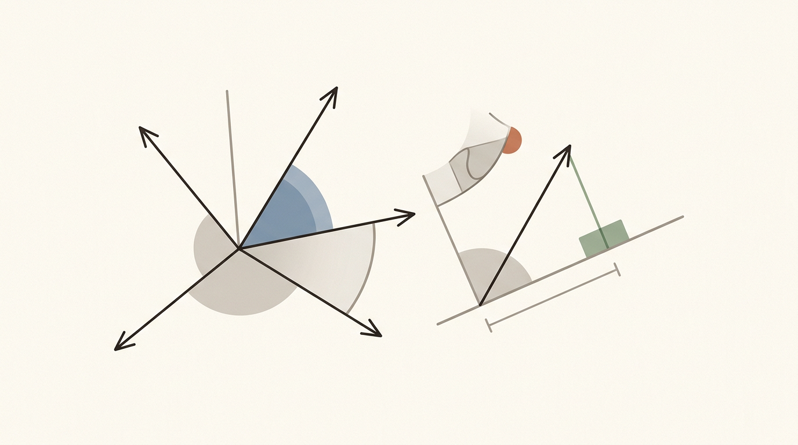
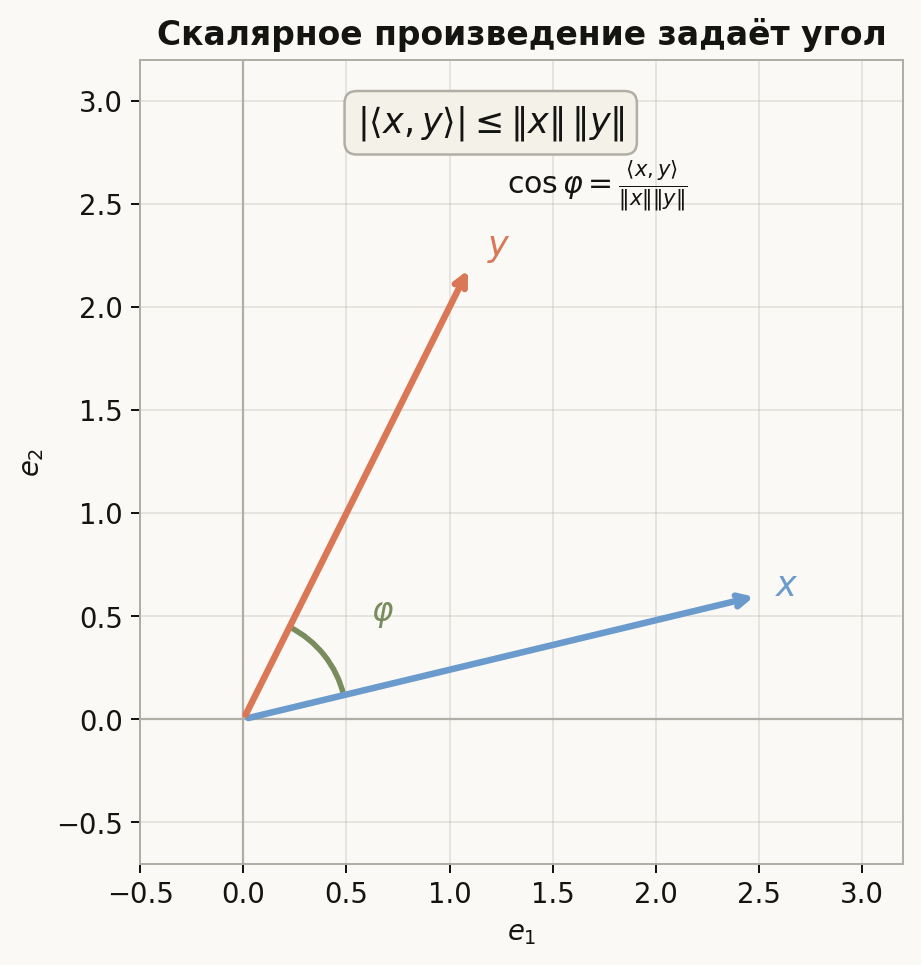
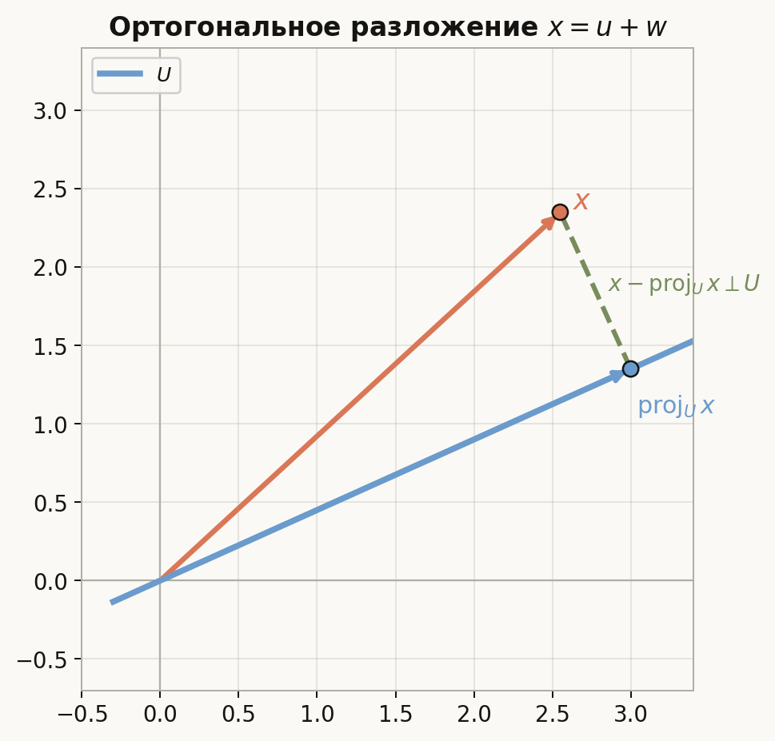
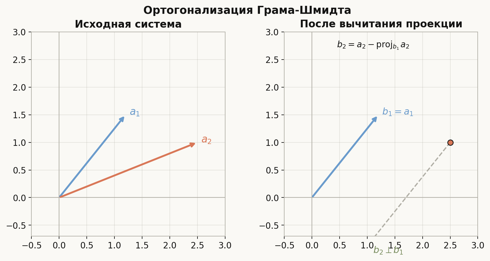
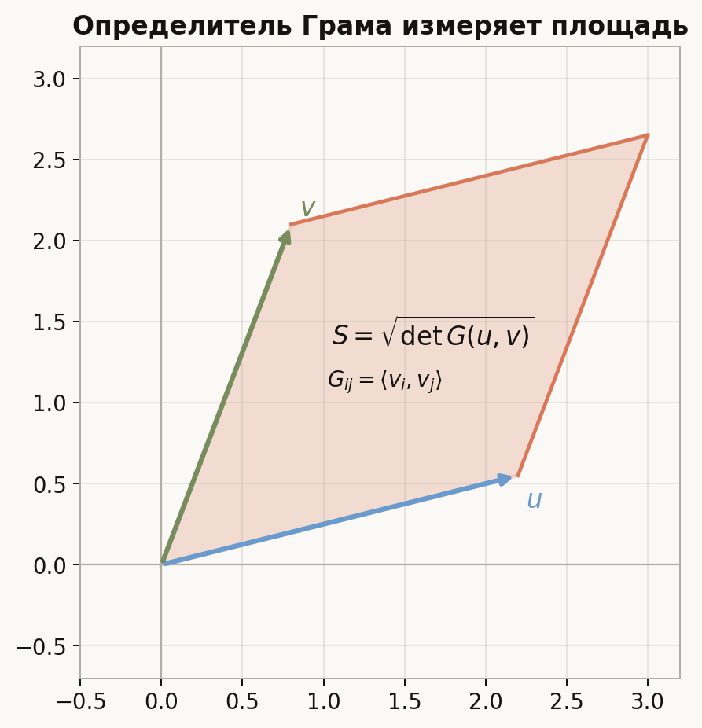
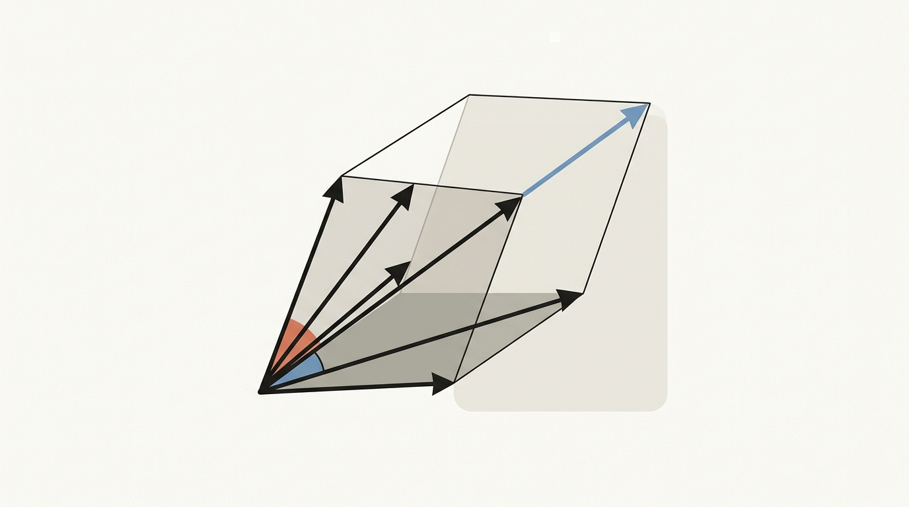
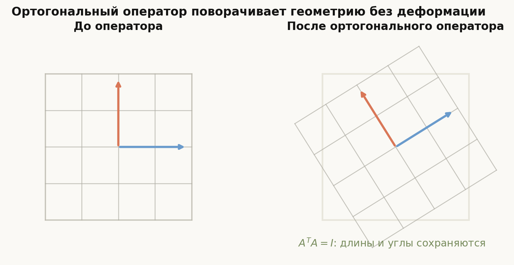

# Лекция: евклидовы пространства

## План

1. Зачем нужны евклидовы пространства
2. Скалярное произведение
3. Норма, расстояние и угол
4. Неравенство Коши-Буняковского
5. Ортогональность и ортогональное дополнение
6. Ортонормированные базисы
7. Проекция на подпространство
8. Ортогонализация Грама-Шмидта
9. Матрица Грама
10. Площади, объёмы и определитель Грама
11. Уравнения прямых, плоскостей и поверхностей
12. Ортогональные операторы
13. Что важно для поступления в ШАД
14. Типичные ошибки
15. Итог
16. Вопросы для самопроверки

---

## 1. Зачем нужны евклидовы пространства

Векторное пространство само по себе умеет складывать векторы и умножать их на числа. Но в нём ещё нет длины, расстояния, угла и перпендикулярности.

Например, в произвольном векторном пространстве выражения
$$
\|x\|,\qquad \rho(x,y),\qquad \angle(x,y)
$$
не имеют смысла, пока мы не зададим дополнительную структуру.

Эта структура — **скалярное произведение**. Оно позволяет перенести привычную геометрию из $\mathbb{R}^2$ и $\mathbb{R}^3$ в любое конечномерное вещественное пространство.

Главная идея темы:

- скалярное произведение задаёт длины и углы;
- ортонормированный базис делает вычисления особенно простыми;
- любой базис можно ортогонализовать методом Грама-Шмидта;
- ортогональные операторы сохраняют скалярное произведение, длины и углы;
- площади и объёмы удобно вычислять через матрицу Грама.

---

## 2. Скалярное произведение

Пусть $V$ — вещественное векторное пространство.

### Определение

**Скалярным произведением** на $V$ называется отображение
$$
\langle\cdot,\cdot\rangle\colon V\times V\to\mathbb{R},
$$
которое для любых $x,y,z\in V$ и $\lambda\in\mathbb{R}$ удовлетворяет условиям:

1. $\langle x,y\rangle=\langle y,x\rangle$;
2. $\langle \lambda x+y,z\rangle=\lambda\langle x,z\rangle+\langle y,z\rangle$;
3. $\langle x,x\rangle\ge 0$;
4. $\langle x,x\rangle=0$ тогда и только тогда, когда $x=0$.

Второе условие вместе с симметричностью означает билинейность: скалярное произведение линейно по каждому аргументу.

### Евклидово пространство

Вещественное векторное пространство со скалярным произведением называется **евклидовым пространством**.

### Стандартный пример

В $\mathbb{R}^n$ стандартное скалярное произведение задаётся формулой
$$
\langle x,y\rangle=x_1y_1+\dots+x_ny_n.
$$

Для него
$$
\langle x,x\rangle=x_1^2+\dots+x_n^2,
$$
и это число равно нулю только при $x=0$.

### Скалярное произведение с матрицей

Пусть $A$ — симметрическая положительно определённая матрица. Тогда
$$
\langle x,y\rangle_A=x^TAy
$$
задаёт скалярное произведение на $\mathbb{R}^n$.

Симметричность матрицы отвечает условию
$$
\langle x,y\rangle_A=\langle y,x\rangle_A,
$$
а положительная определённость отвечает условию
$$
\langle x,x\rangle_A>0
$$
для всех ненулевых $x$.

---

## 3. Норма, расстояние и угол

Пусть $V$ — евклидово пространство.

### Норма

Длина вектора $x$ определяется формулой
$$
\|x\|=\sqrt{\langle x,x\rangle}.
$$

Из свойств скалярного произведения следуют свойства нормы:

1. $\|x\|\ge 0$;
2. $\|x\|=0$ тогда и только тогда, когда $x=0$;
3. $\|\lambda x\|=|\lambda|\|x\|$;
4. $\|x+y\|\le \|x\|+\|y\|$.

Последнее свойство называется неравенством треугольника.

### Расстояние

Расстояние между векторами $x$ и $y$ задаётся так:
$$
\rho(x,y)=\|x-y\|.
$$

В стандартном $\mathbb{R}^n$ это обычная евклидова метрика:
$$
\rho(x,y)=\sqrt{(x_1-y_1)^2+\dots+(x_n-y_n)^2}.
$$

### Угол

Если $x\ne 0$ и $y\ne 0$, угол между ними определяется формулой
$$
\cos\varphi=\frac{\langle x,y\rangle}{\|x\|\|y\|}.
$$

Корректность этой формулы обеспечивается неравенством Коши-Буняковского:
$$
|\langle x,y\rangle|\le \|x\|\|y\|.
$$

---

## 4. Неравенство Коши-Буняковского

### Формулировка

Для любых векторов $x,y$ евклидова пространства выполнено
$$
|\langle x,y\rangle|\le \|x\|\|y\|.
$$

Равенство достигается тогда и только тогда, когда $x$ и $y$ линейно зависимы.

### Доказательство

Если $y=0$, всё очевидно. Пусть $y\ne 0$.

Рассмотрим вектор
$$
z=x-\frac{\langle x,y\rangle}{\langle y,y\rangle}y.
$$

Так как $\langle z,z\rangle\ge 0$, получаем:
$$
\left\langle
x-\frac{\langle x,y\rangle}{\langle y,y\rangle}y,
x-\frac{\langle x,y\rangle}{\langle y,y\rangle}y
\right\rangle\ge 0.
$$

Раскрывая скобки, имеем
$$
\langle x,x\rangle-\frac{\langle x,y\rangle^2}{\langle y,y\rangle}\ge 0.
$$

Следовательно,
$$
\langle x,y\rangle^2\le \langle x,x\rangle\langle y,y\rangle.
$$

После извлечения корня получаем
$$
|\langle x,y\rangle|\le \|x\|\|y\|.
$$

Равенство возможно тогда и только тогда, когда $z=0$, то есть когда $x$ выражается через $y$.

---

## 5. Ортогональность и ортогональное дополнение

### Ортогональные векторы

Векторы $x$ и $y$ называются **ортогональными**, если
$$
\langle x,y\rangle=0.
$$

Обозначение:
$$
x\perp y.
$$

Нулевой вектор ортогонален любому вектору.

### Ортогональное дополнение

Пусть $U$ — подпространство евклидова пространства $V$.

**Ортогональным дополнением** к $U$ называется множество
$$
U^\perp=\{v\in V:\langle v,u\rangle=0\ \text{для всех }u\in U\}.
$$

Это подпространство в $V$.

### Основные свойства

Если $V$ конечномерно, то:
$$
\dim U+\dim U^\perp=\dim V.
$$

Кроме того,
$$
V=U\oplus U^\perp.
$$

Это означает, что любой вектор $v\in V$ единственным образом раскладывается в сумму
$$
v=u+w,
$$
где $u\in U$, $w\in U^\perp$.

---

## 6. Ортонормированные базисы

### Определение

Система векторов $e_1,\dots,e_k$ называется **ортогональной**, если
$$
\langle e_i,e_j\rangle=0
$$
при $i\ne j$.

Она называется **ортонормированной**, если дополнительно
$$
\|e_i\|=1
$$
для всех $i$.

Иначе говоря,
$$
\langle e_i,e_j\rangle=
\begin{cases}
1,& i=j,\\
0,& i\ne j.
\end{cases}
$$

### Почему это удобно

Если $e_1,\dots,e_n$ — ортонормированный базис и
$$
x=x_1e_1+\dots+x_ne_n,
$$
то координаты находятся по формуле
$$
x_i=\langle x,e_i\rangle.
$$

Действительно,
$$
\langle x,e_i\rangle
=\left\langle\sum_{j=1}^n x_je_j,e_i\right\rangle
=\sum_{j=1}^n x_j\langle e_j,e_i\rangle
=x_i.
$$

В ортонормированном базисе скалярное произведение имеет стандартный вид:
$$
\langle x,y\rangle=x_1y_1+\dots+x_ny_n.
$$

---

## 7. Проекция на подпространство

Пусть $U$ — подпространство евклидова пространства $V$, и пусть
$$
e_1,\dots,e_k
$$
— ортонормированный базис в $U$.

Тогда ортогональная проекция вектора $x$ на $U$ равна
$$
\operatorname{proj}_U x
=\sum_{i=1}^k\langle x,e_i\rangle e_i.
$$

Вектор
$$
x-\operatorname{proj}_U x
$$
ортогонален всему подпространству $U$.

### Частный случай: проекция на прямую

Если $U=\operatorname{span}(a)$ и $a\ne 0$, то
$$
\operatorname{proj}_U x
=\frac{\langle x,a\rangle}{\langle a,a\rangle}a.
$$

### Расстояние до подпространства

Расстояние от $x$ до $U$ равно
$$
\rho(x,U)=\|x-\operatorname{proj}_U x\|.
$$

Это полезно в задачах на расстояние от точки до прямой или плоскости.

---

## 8. Ортогонализация Грама-Шмидта

Пусть $a_1,\dots,a_k$ — линейно независимая система векторов евклидова пространства.

Метод Грама-Шмидта строит из неё ортогональную систему $b_1,\dots,b_k$ с теми же линейными оболочками:
$$
\operatorname{span}(b_1,\dots,b_m)=\operatorname{span}(a_1,\dots,a_m)
$$
для каждого $m=1,\dots,k$.

### Алгоритм

Первый вектор:
$$
b_1=a_1.
$$

Далее из $a_m$ вычитаются проекции на уже построенные направления:
$$
b_m
=a_m-\sum_{i=1}^{m-1}
\frac{\langle a_m,b_i\rangle}{\langle b_i,b_i\rangle}b_i.
$$

Если нужна ортонормированная система, после этого нормируем:
$$
e_m=\frac{b_m}{\|b_m\|}.
$$

### Пример

В $\mathbb{R}^2$ со стандартным скалярным произведением возьмём
$$
a_1=(1,1),\qquad a_2=(1,0).
$$

Тогда
$$
b_1=a_1=(1,1).
$$

Второй вектор:
$$
b_2=a_2-\frac{\langle a_2,b_1\rangle}{\langle b_1,b_1\rangle}b_1
=(1,0)-\frac{1}{2}(1,1)
=\left(\frac12,-\frac12\right).
$$

Проверим:
$$
\langle b_1,b_2\rangle
=1\cdot\frac12+1\cdot\left(-\frac12\right)=0.
$$

Нормируя, получаем
$$
e_1=\frac{1}{\sqrt2}(1,1),
\qquad
e_2=\frac{1}{\sqrt2}(1,-1).
$$

---

## 9. Матрица Грама

Пусть $v_1,\dots,v_k$ — векторы евклидова пространства.

**Матрицей Грама** этой системы называется матрица
$$
G(v_1,\dots,v_k)=
\begin{pmatrix}
\langle v_1,v_1\rangle & \langle v_1,v_2\rangle & \dots & \langle v_1,v_k\rangle\\
\langle v_2,v_1\rangle & \langle v_2,v_2\rangle & \dots & \langle v_2,v_k\rangle\\
\vdots & \vdots & \ddots & \vdots\\
\langle v_k,v_1\rangle & \langle v_k,v_2\rangle & \dots & \langle v_k,v_k\rangle
\end{pmatrix}.
$$

### Ключевой критерий

Векторы $v_1,\dots,v_k$ линейно независимы тогда и только тогда, когда
$$
\det G(v_1,\dots,v_k)>0.
$$

Если система линейно зависима, то
$$
\det G(v_1,\dots,v_k)=0.
$$

### Почему это верно

Для любых чисел $c_1,\dots,c_k$ имеем
$$
\left\|\sum_{i=1}^k c_iv_i\right\|^2
=
\sum_{i,j=1}^k c_ic_j\langle v_i,v_j\rangle
=c^TGc.
$$

Если $v_1,\dots,v_k$ линейно независимы, то сумма $\sum c_iv_i$ равна нулю только при $c=0$. Значит, квадратичная форма $c^TGc$ положительно определена, и $\det G>0$.

Если векторы зависимы, существует ненулевой $c$, для которого $\sum c_iv_i=0$. Тогда $c^TGc=0$, и матрица Грама вырождена.

---

## 10. Площади, объёмы и определитель Грама

Пусть $v_1,\dots,v_k$ — векторы евклидова пространства. Они натягивают $k$-мерный параллелепипед.

Его $k$-мерный объём равен
$$
V_k=\sqrt{\det G(v_1,\dots,v_k)}.
$$

### Площадь параллелограмма

Для двух векторов $u,v$ площадь параллелограмма равна
$$
S=\sqrt{
\begin{vmatrix}
\langle u,u\rangle & \langle u,v\rangle\\
\langle v,u\rangle & \langle v,v\rangle
\end{vmatrix}
}
=\sqrt{\|u\|^2\|v\|^2-\langle u,v\rangle^2}.
$$

В $\mathbb{R}^3$ это совпадает с формулой
$$
S=\|u\times v\|.
$$

### Объём параллелепипеда

Для трёх векторов $u,v,w$ объём равен
$$
V=\sqrt{\det G(u,v,w)}.
$$

В $\mathbb{R}^3$ это также равно
$$
V=|\det(u,v,w)|.
$$

Если векторы записаны столбцами матрицы $A$, то при стандартном скалярном произведении
$$
G=A^TA.
$$

Тогда
$$
\det G=\det(A^TA)=(\det A)^2
$$
для квадратной матрицы $A$.

### Площадь параметризованной поверхности

Если поверхность в $\mathbb{R}^3$ задана параметрически:
$$
r=r(u,v),
$$
то векторы
$$
r_u=\frac{\partial r}{\partial u},\qquad
r_v=\frac{\partial r}{\partial v}
$$
натягивают малый касательный параллелограмм.

Его площадь равна
$$
\sqrt{\det G(r_u,r_v)}\,du\,dv.
$$

Поэтому площадь поверхности вычисляется формулой
$$
S=\iint_D \sqrt{\det G(r_u,r_v)}\,du\,dv.
$$

В $\mathbb{R}^3$ это то же самое, что
$$
S=\iint_D \|r_u\times r_v\|\,du\,dv.
$$

Для плоского параллелограмма эта формула сводится к уже известному выражению
$$
S=\sqrt{\det G(u,v)}.
$$

---

## 11. Уравнения прямых, плоскостей и поверхностей

Евклидова структура позволяет записывать геометрические объекты через расстояния, скалярные произведения и ортогональность.

### Прямая на плоскости

Прямая с нормальным вектором $n=(A,B)$ имеет уравнение
$$
Ax+By+C=0.
$$

Вектор $n$ ортогонален любому направляющему вектору этой прямой.

Расстояние от точки $p=(x_0,y_0)$ до прямой равно
$$
\frac{|Ax_0+By_0+C|}{\sqrt{A^2+B^2}}.
$$

### Плоскость в $\mathbb{R}^3$

Плоскость с нормальным вектором $n=(A,B,C)$ имеет уравнение
$$
Ax+By+Cz+D=0.
$$

Расстояние от точки $p=(x_0,y_0,z_0)$ до плоскости:
$$
\frac{|Ax_0+By_0+Cz_0+D|}{\sqrt{A^2+B^2+C^2}}.
$$

### Сфера

Сфера с центром $a$ и радиусом $R$ задаётся уравнением
$$
\|x-a\|^2=R^2.
$$

В координатах $\mathbb{R}^n$:
$$
(x_1-a_1)^2+\dots+(x_n-a_n)^2=R^2.
$$

### Квадрики

Уравнение поверхности второго порядка часто имеет вид
$$
x^TAx+2b^Tx+c=0,
$$
где $A$ — симметрическая матрица.

После ортогональной замены координат симметрическую матрицу можно диагонализовать, и уравнение принимает более простой вид. Так появляются канонические уравнения эллипсоидов, гиперболоидов, параболоидов и других квадрик.

На вступительном уровне чаще всего важно уметь:

- распознать нормальный вектор прямой или плоскости;
- посчитать расстояние до прямой или плоскости;
- выразить площадь или объём через определитель;
- понять, как ортогональная замена координат сохраняет длины и углы.

---

## 12. Ортогональные операторы

Пусть $V$ — евклидово пространство.

### Определение

Линейный оператор $T\colon V\to V$ называется **ортогональным**, если для любых $x,y\in V$
$$
\langle Tx,Ty\rangle=\langle x,y\rangle.
$$

То есть оператор сохраняет скалярное произведение.

### Что он сохраняет

Из определения сразу следуют сохранение длин:
$$
\|Tx\|^2=\langle Tx,Tx\rangle=\langle x,x\rangle=\|x\|^2,
$$
и сохранение углов:
$$
\cos\angle(Tx,Ty)=\cos\angle(x,y).
$$

### Матрица ортогонального оператора

В ортонормированном базисе матрица ортогонального оператора удовлетворяет условию
$$
A^TA=I.
$$

Эквивалентно:
$$
A^{-1}=A^T.
$$

Столбцы такой матрицы образуют ортонормированный базис.

### Определитель ортогональной матрицы

Из равенства $A^TA=I$ получаем
$$
\det(A^TA)=\det I=1.
$$

Но
$$
\det(A^TA)=\det A^T\det A=(\det A)^2.
$$

Следовательно,
$$
\det A=\pm 1.
$$

Ортогональные операторы с определителем $1$ сохраняют ориентацию, а с определителем $-1$ меняют ориентацию.

### Примеры

Поворот плоскости на угол $\alpha$:
$$
A=
\begin{pmatrix}
\cos\alpha & -\sin\alpha\\
\sin\alpha & \cos\alpha
\end{pmatrix}.
$$

Отражение относительно оси $Ox$:
$$
A=
\begin{pmatrix}
1 & 0\\
0 & -1
\end{pmatrix}.
$$

Обе матрицы ортогональны, но первая имеет определитель $1$, а вторая — $-1$.

---

## 13. Что важно для поступления в ШАД

Для вступительного экзамена важно уверенно владеть следующими навыками:

1. Проверять, задаёт ли формула скалярное произведение.
2. Вычислять нормы, расстояния, углы.
3. Применять неравенство Коши-Буняковского и понимать случай равенства.
4. Находить ортогональные дополнения как решения систем линейных уравнений.
5. Строить ортогональный и ортонормированный базис методом Грама-Шмидта.
6. Вычислять ортогональные проекции и расстояния до подпространств.
7. Работать с матрицей Грама.
8. Вычислять площади и объёмы через определитель Грама.
9. Проверять ортогональность матрицы по условию $A^TA=I$.
10. Использовать факт, что ортогональные операторы сохраняют длины, углы и скалярные произведения.

---

## 14. Типичные ошибки

### Ошибка 1. Путать ортогональность и линейную независимость

Ненулевые попарно ортогональные векторы всегда линейно независимы. Но линейно независимые векторы не обязаны быть ортогональными.

### Ошибка 2. Забывать нормировать базис

Ортогональный базис не обязательно ортонормированный. Формула
$$
x_i=\langle x,e_i\rangle
$$
верна только для ортонормированного базиса.

Если базис ортогональный, но не нормированный, то
$$
x_i=\frac{\langle x,e_i\rangle}{\langle e_i,e_i\rangle}.
$$

### Ошибка 3. Считать любую симметрическую форму скалярным произведением

Скалярное произведение должно быть не только симметричным и билинейным, но и положительно определённым.

Например,
$$
B(x,y)=x_1y_1-x_2y_2
$$
не является скалярным произведением на $\mathbb{R}^2$, потому что
$$
B((0,1),(0,1))=-1.
$$

### Ошибка 4. Неверно применять Грама-Шмидта

На шаге $m$ нужно вычитать проекции на все уже построенные ортогональные векторы:
$$
b_1,\dots,b_{m-1}.
$$

Вычитание только одной проекции обычно не даёт ортогональной системы.

### Ошибка 5. Проверять ортогональность матрицы по строкам, но забывать о базисе

Условие $A^TA=I$ относится к матрице оператора в ортонормированном базисе. В произвольном базисе формула будет другой и будет содержать матрицу Грама.

---

## 15. Итог

Евклидово пространство — это вещественное векторное пространство со скалярным произведением.

Скалярное произведение позволяет определить:

- длину: $\|x\|=\sqrt{\langle x,x\rangle}$;
- расстояние: $\rho(x,y)=\|x-y\|$;
- угол: $\cos\varphi=\frac{\langle x,y\rangle}{\|x\|\|y\|}$;
- ортогональность: $\langle x,y\rangle=0$.

В ортонормированном базисе вычисления принимают самый простой вид. Метод Грама-Шмидта позволяет получить такой базис из любого линейно независимого набора.

Матрица Грама связывает линейную независимость, площади и объёмы:
$$
V_k=\sqrt{\det G}.
$$

Ортогональные операторы — это линейные преобразования, сохраняющие евклидову геометрию. В ортонормированном базисе их матрицы удовлетворяют условию
$$
A^TA=I.
$$

---

## 16. Вопросы для самопроверки

1. Какие свойства должна иметь билинейная форма, чтобы быть скалярным произведением?
2. Почему формула для угла корректна?
3. Когда в неравенстве Коши-Буняковского достигается равенство?
4. Почему ненулевые попарно ортогональные векторы линейно независимы?
5. Как найти ортогональное дополнение к подпространству, заданному базисом?
6. Чем ортогональный базис отличается от ортонормированного?
7. Как выглядит формула проекции на прямую?
8. В чём идея метода Грама-Шмидта?
9. Как по матрице Грама понять, линейно независимы ли векторы?
10. Почему площадь параллелограмма равна корню из определителя матрицы Грама?
11. Как проверить, что матрица ортогональна?
12. Почему определитель ортогональной матрицы равен $\pm 1$?
