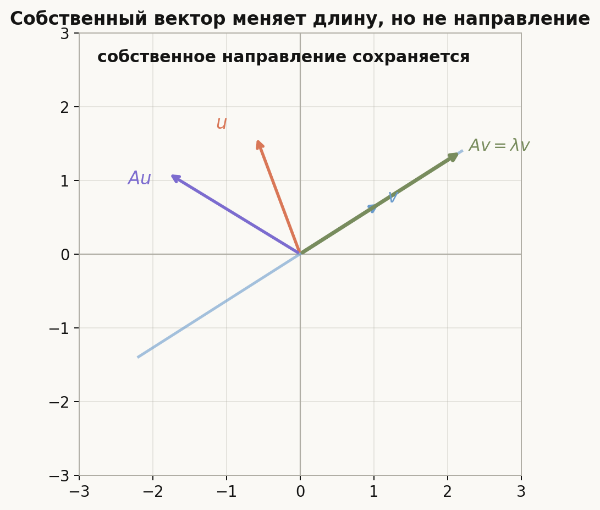
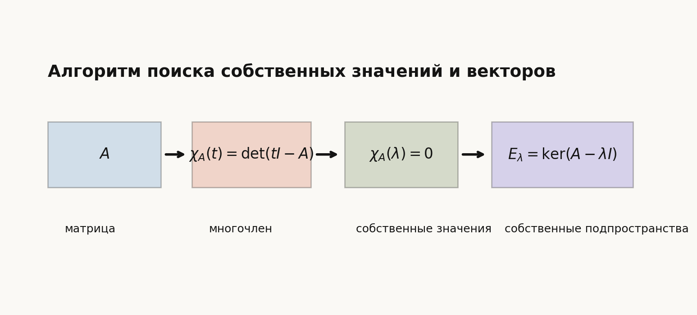
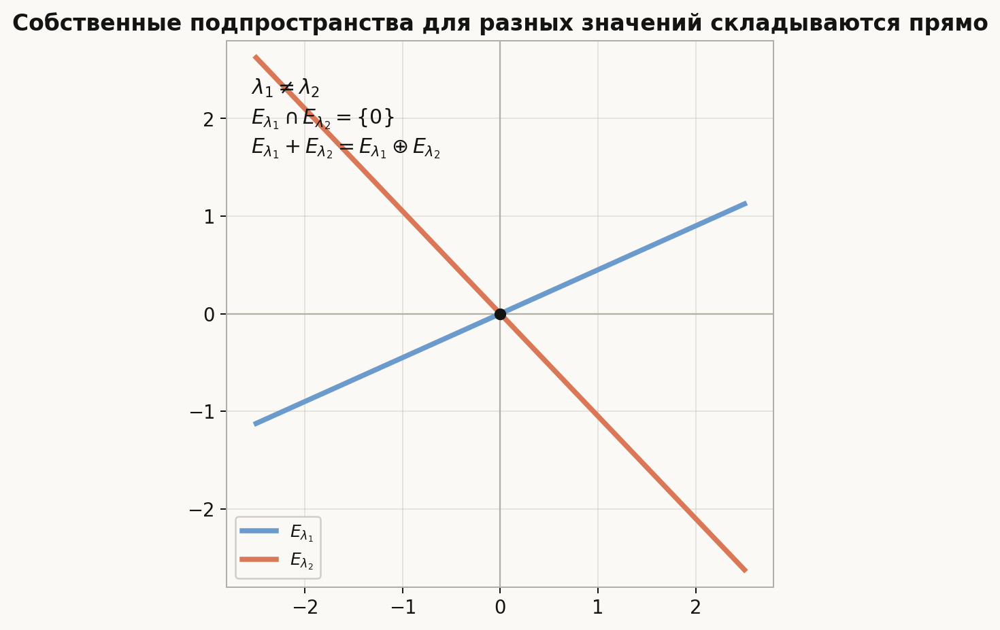
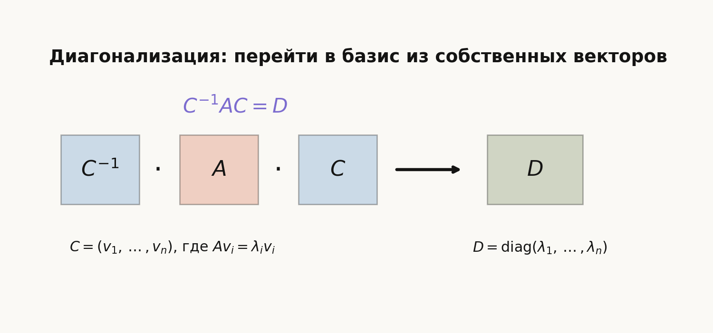
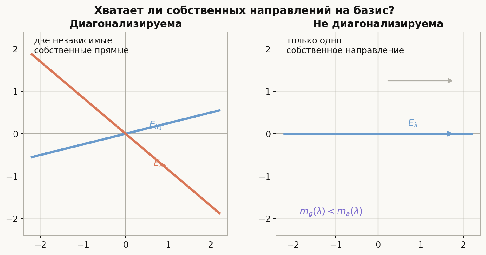

# Лекция: собственные векторы, собственные значения и диагонализируемость

## План

1. Зачем нужны собственные векторы
2. Определение собственного значения и собственного вектора
3. Собственное подпространство
4. Характеристический многочлен
5. Как находить собственные значения и собственные векторы
6. Линейная независимость собственных подпространств
7. Диагонализация оператора
8. Условие диагонализируемости
9. Алгебраическая и геометрическая кратности
10. Простые достаточные условия диагонализируемости
11. Примеры: диагонализируемая и недиагонализируемая матрицы
12. Что важно для поступления в ШАД
13. Типичные ошибки
14. Итог
15. Вопросы для самопроверки

---

## 1. Зачем нужны собственные векторы

Линейный оператор обычно меняет вектор сложно: может повернуть, растянуть, сжать, отразить и смешать координаты.

Но иногда есть особые направления, на которых оператор действует совсем просто: он не меняет направление, а только умножает вектор на число.

Если такое направление найдено, поведение оператора на нём понятно полностью:
$$
v\mapsto \lambda v.
$$

Именно поэтому собственные векторы полезны:

- они дают простые инвариантные направления;
- помогают считать степени матриц;
- позволяют упростить матрицу оператора заменой базиса;
- лежат в основе диагонализации и жордановой формы;
- часто описывают устойчивые направления в динамических системах и главные направления в геометрии.

Главная цель темы — понять, когда из собственных векторов можно составить базис. Тогда матрица оператора станет диагональной.

---

## 2. Определение собственного значения и собственного вектора

Пусть $V$ — векторное пространство над полем $\mathbb{F}$, а
$$
\varphi\colon V\to V
$$
— линейный оператор.

### Определение

Ненулевой вектор $v\in V$ называется **собственным вектором** оператора $\varphi$, если существует число $\lambda\in\mathbb{F}$ такое, что
$$
\varphi(v)=\lambda v.
$$

Число $\lambda$ называется **собственным значением**, соответствующим собственному вектору $v$.

### Важная деталь

Собственный вектор по определению не может быть нулевым.

Нулевой вектор удовлетворяет равенству
$$
\varphi(0)=\lambda\cdot 0
$$
для любого $\lambda$, поэтому если бы его разрешили считать собственным, определение потеряло бы смысл.

### Матрица

Если оператор задан матрицей $A$, то условие собственного вектора записывается так:
$$
Av=\lambda v.
$$

Эквивалентно:
$$
(A-\lambda I)v=0.
$$

Значит, собственный вектор — это ненулевое решение однородной системы
$$
(A-\lambda I)x=0.
$$

---

## 3. Собственное подпространство

Пусть $\lambda$ — собственное значение оператора $\varphi$.

Множество
$$
E_\lambda=\{v\in V:\varphi(v)=\lambda v\}
$$
содержит нулевой вектор и все собственные векторы с собственным значением $\lambda$.

Так как условие можно переписать как
$$
(\varphi-\lambda E)v=0,
$$
получаем
$$
E_\lambda=\ker(\varphi-\lambda E).
$$

### Почему это подпространство

Ядро линейного отображения является подпространством. Значит, $E_\lambda$ — подпространство.

Если $u,w\in E_\lambda$, то
$$
\varphi(u+w)=\varphi(u)+\varphi(w)=\lambda u+\lambda w=\lambda(u+w).
$$

Если $\alpha\in\mathbb{F}$, то
$$
\varphi(\alpha u)=\alpha\varphi(u)=\alpha\lambda u=\lambda(\alpha u).
$$

### Геометрический смысл

Собственное подпространство — это весь набор направлений, на которых оператор действует как умножение на одно и то же число $\lambda$.

---

## 4. Характеристический многочлен

Чтобы найти собственные значения матрицы $A\in M_n(\mathbb{F})$, нужно понять, при каких $\lambda$ система
$$
(A-\lambda I)x=0
$$
имеет ненулевое решение.

Однородная система имеет ненулевые решения тогда и только тогда, когда её матрица вырождена:
$$
\det(A-\lambda I)=0.
$$

### Определение

**Характеристическим многочленом** матрицы $A$ называется
$$
\chi_A(t)=\det(tI-A).
$$

Собственные значения — это корни характеристического многочлена:
$$
\chi_A(\lambda)=0.
$$

В литературе также встречается вариант $\det(A-tI)$. Он отличается от $\det(tI-A)$ множителем $(-1)^n$, поэтому корни остаются теми же.

### Инвариантность

Если матрицы $A$ и $B$ подобны:
$$
B=C^{-1}AC,
$$
то
$$
\chi_B(t)=\chi_A(t).
$$

Действительно,
$$
\det(tI-C^{-1}AC)
=\det(C^{-1}(tI-A)C)
=\det(C^{-1})\det(tI-A)\det C
=\det(tI-A).
$$

Значит, характеристический многочлен зависит от оператора, а не от выбранного базиса.

---

## 5. Как находить собственные значения и собственные векторы

Для матрицы $A$ алгоритм такой:

1. Найти характеристический многочлен
   $$
   \chi_A(t)=\det(tI-A).
   $$

2. Найти его корни. Это собственные значения.

3. Для каждого собственного значения $\lambda$ решить систему
   $$
   (A-\lambda I)x=0.
   $$

4. Найти базис ядра. Ненулевые векторы из этого ядра — собственные векторы.

### Пример

Пусть
$$
A=
\begin{pmatrix}
2 & 1\\
0 & 3
\end{pmatrix}.
$$

Характеристический многочлен:
$$
\chi_A(t)=
\det
\begin{pmatrix}
t-2 & -1\\
0 & t-3
\end{pmatrix}
=(t-2)(t-3).
$$

Собственные значения:
$$
\lambda_1=2,\qquad \lambda_2=3.
$$

Для $\lambda=2$:
$$
A-2I=
\begin{pmatrix}
0 & 1\\
0 & 1
\end{pmatrix}.
$$

Система даёт $x_2=0$, значит
$$
E_2=\operatorname{span}\{(1,0)\}.
$$

Для $\lambda=3$:
$$
A-3I=
\begin{pmatrix}
-1 & 1\\
0 & 0
\end{pmatrix}.
$$

Получаем $x_2=x_1$, значит
$$
E_3=\operatorname{span}\{(1,1)\}.
$$

---

## 6. Линейная независимость собственных подпространств

### Теорема

Собственные векторы, отвечающие попарно различным собственным значениям, линейно независимы.

Более точно: если
$$
\lambda_1,\dots,\lambda_k
$$
попарно различны, а $v_i$ — собственный вектор с собственным значением $\lambda_i$, то система
$$
v_1,\dots,v_k
$$
линейно независима.

### Доказательство

Докажем индукцией по $k$.

При $k=1$ утверждение очевидно: собственный вектор ненулевой.

Пусть
$$
\alpha_1v_1+\dots+\alpha_kv_k=0.
$$

Применим оператор $\varphi$:
$$
\alpha_1\lambda_1v_1+\dots+\alpha_k\lambda_kv_k=0.
$$

Умножим первое равенство на $\lambda_k$:
$$
\alpha_1\lambda_kv_1+\dots+\alpha_k\lambda_kv_k=0.
$$

Вычтем:
$$
\alpha_1(\lambda_1-\lambda_k)v_1+\dots+\alpha_{k-1}(\lambda_{k-1}-\lambda_k)v_{k-1}=0.
$$

По предположению индукции векторы $v_1,\dots,v_{k-1}$ линейно независимы. Значит,
$$
\alpha_i(\lambda_i-\lambda_k)=0
$$
для всех $i<k$.

Так как $\lambda_i\ne\lambda_k$, получаем
$$
\alpha_1=\dots=\alpha_{k-1}=0.
$$

Из исходного равенства остаётся
$$
\alpha_kv_k=0.
$$

Так как $v_k\ne 0$, то $\alpha_k=0$.

Следовательно, все коэффициенты равны нулю.

### Следствие

Сумма собственных подпространств, отвечающих различным собственным значениям, является прямой:
$$
E_{\lambda_1}+\dots+E_{\lambda_k}=E_{\lambda_1}\oplus\dots\oplus E_{\lambda_k}.
$$

---

## 7. Диагонализация оператора

Линейный оператор $\varphi$ называется **диагонализируемым**, если существует базис пространства, в котором его матрица диагональна.

Иначе говоря, для матрицы $A$ существует обратимая матрица $C$ такая, что
$$
C^{-1}AC=D,
$$
где $D$ — диагональная матрица.

Эквивалентно:
$$
A=CDC^{-1}.
$$

### Почему собственный базис даёт диагональную матрицу

Пусть $v_1,\dots,v_n$ — базис из собственных векторов:
$$
Av_i=\lambda_i v_i.
$$

Тогда в этом базисе оператор действует так:
$$
v_i\mapsto \lambda_i v_i.
$$

Значит, матрица оператора в базисе $v_1,\dots,v_n$ равна
$$
D=
\begin{pmatrix}
\lambda_1 & 0 & \dots & 0\\
0 & \lambda_2 & \dots & 0\\
\vdots & \vdots & \ddots & \vdots\\
0 & 0 & \dots & \lambda_n
\end{pmatrix}.
$$

Если $C$ — матрица, столбцами которой являются $v_1,\dots,v_n$, то
$$
AC=CD.
$$

Отсюда
$$
A=CDC^{-1}.
$$

---

## 8. Условие диагонализируемости

Пусть $V$ — конечномерное пространство размерности $n$.

### Главный критерий

Оператор $\varphi$ диагонализируем тогда и только тогда, когда в $V$ существует базис из собственных векторов.

Эквивалентно:
$$
\sum_{\lambda}\dim E_\lambda=n,
$$
где сумма берётся по всем различным собственным значениям оператора.

### Почему это верно

Если оператор диагонализируем, то в диагональном базисе каждый базисный вектор является собственным.

Обратно, если есть базис из собственных векторов, то в этом базисе матрица оператора диагональна.

Условие
$$
\sum_{\lambda}\dim E_\lambda=n
$$
означает, что собственных векторов хватает на базис. Прямая сумма обеспечивается линейной независимостью собственных подпространств для разных $\lambda$.

---

## 9. Алгебраическая и геометрическая кратности

Пусть $\lambda$ — собственное значение матрицы $A$.

### Алгебраическая кратность

**Алгебраическая кратность** $\lambda$ — это кратность $\lambda$ как корня характеристического многочлена.

Обозначим её $m_a(\lambda)$.

### Геометрическая кратность

**Геометрическая кратность** $\lambda$ — это размерность собственного подпространства:
$$
m_g(\lambda)=\dim E_\lambda=\dim\ker(A-\lambda I).
$$

### Важное неравенство

Всегда выполнено
$$
1\le m_g(\lambda)\le m_a(\lambda).
$$

Первая часть означает, что для собственного значения есть хотя бы один собственный вектор.

Вторая часть говорит, что собственных направлений для данного $\lambda$ не может быть больше, чем кратность этого корня в характеристическом многочлене.

### Критерий через кратности

Если характеристический многочлен раскладывается на линейные множители, то оператор диагонализируем тогда и только тогда, когда для каждого собственного значения
$$
m_g(\lambda)=m_a(\lambda).
$$

---

## 10. Простые достаточные условия диагонализируемости

### Разные собственные значения

Если матрица $n\times n$ имеет $n$ различных собственных значений, то она диагонализируема.

Действительно, для каждого собственного значения можно выбрать собственный вектор. По теореме о линейной независимости собственных векторов с разными собственными значениями получаем $n$ линейно независимых векторов.

### Симметрические матрицы

Вещественная симметрическая матрица диагонализируема в ортонормированном базисе.

Этот факт относится к спектральной теореме. Для вступительного экзамена часто достаточно помнить:

- у симметрической матрицы все собственные значения вещественные;
- собственные векторы, отвечающие разным собственным значениям, ортогональны;
- можно выбрать ортонормированный базис из собственных векторов.

### Диагональная матрица

Диагональная матрица уже диагонализирована. Стандартные базисные векторы являются собственными:
$$
Ae_i=a_{ii}e_i.
$$

---

## 11. Примеры: диагонализируемая и недиагонализируемая матрицы

### Диагонализируемая матрица

Пусть
$$
A=
\begin{pmatrix}
2 & 1\\
0 & 3
\end{pmatrix}.
$$

Мы уже нашли:
$$
E_2=\operatorname{span}\{(1,0)\},
\qquad
E_3=\operatorname{span}\{(1,1)\}.
$$

Собственных векторов два, они линейно независимы. Значит, матрица диагонализируема.

Берём
$$
C=
\begin{pmatrix}
1 & 1\\
0 & 1
\end{pmatrix},
\qquad
D=
\begin{pmatrix}
2 & 0\\
0 & 3
\end{pmatrix}.
$$

Тогда
$$
A=CDC^{-1}.
$$

### Недиагонализируемая матрица

Пусть
$$
B=
\begin{pmatrix}
2 & 1\\
0 & 2
\end{pmatrix}.
$$

Характеристический многочлен:
$$
\chi_B(t)=(t-2)^2.
$$

Единственное собственное значение $\lambda=2$ имеет алгебраическую кратность $2$.

Но
$$
B-2I=
\begin{pmatrix}
0 & 1\\
0 & 0
\end{pmatrix}.
$$

Из системы $(B-2I)x=0$ получаем $x_2=0$, поэтому
$$
E_2=\operatorname{span}\{(1,0)\}.
$$

Геометрическая кратность равна $1$, а алгебраическая — $2$. Собственных векторов не хватает на базис, значит, матрица не диагонализируема.

---

## 12. Что важно для поступления в ШАД

Нужно уметь:

1. Записывать определение собственного значения и собственного вектора.
2. Переходить от $Av=\lambda v$ к системе $(A-\lambda I)v=0$.
3. Находить характеристический многочлен матрицы.
4. Находить собственные значения как корни характеристического многочлена.
5. Для каждого $\lambda$ находить базис $E_\lambda$.
6. Доказывать линейную независимость собственных векторов для разных собственных значений.
7. Проверять диагонализируемость по сумме размерностей собственных подпространств.
8. Различать алгебраическую и геометрическую кратности.
9. Строить разложение $A=CDC^{-1}$, если матрица диагонализируема.
10. Видеть типичный жорданов блок как пример недиагонализируемой матрицы.

---

## 13. Типичные ошибки

### Ошибка 1. Считать нулевой вектор собственным

Собственный вектор всегда ненулевой. Нуль входит в собственное подпространство, но не является собственным вектором.

### Ошибка 2. Смешивать собственное значение и собственный вектор

Собственное значение — число $\lambda$, собственный вектор — ненулевой вектор $v$.

Они связаны равенством
$$
Av=\lambda v.
$$

### Ошибка 3. Искать собственные векторы до собственных значений

Обычно сначала находят $\lambda$ из уравнения
$$
\det(A-\lambda I)=0,
$$
а потом решают систему
$$
(A-\lambda I)x=0.
$$

### Ошибка 4. Думать, что кратного корня достаточно для нескольких собственных векторов

Если $\lambda$ имеет алгебраическую кратность $2$, это не гарантирует два линейно независимых собственных вектора.

Нужно считать
$$
\dim\ker(A-\lambda I).
$$

### Ошибка 5. Неверно составлять матрицу перехода

В разложении
$$
A=CDC^{-1}
$$
столбцы $C$ — это собственные векторы в том же порядке, в каком соответствующие собственные значения стоят на диагонали $D$.

---

## 14. Итог

Собственный вектор — это ненулевой вектор, который оператор не выводит из его прямой:
$$
Av=\lambda v.
$$

Собственные значения находятся из характеристического уравнения:
$$
\det(tI-A)=0.
$$

Собственное подпространство:
$$
E_\lambda=\ker(A-\lambda I).
$$

Собственные подпространства для разных собственных значений складываются прямо. Поэтому оператор диагонализируем тогда и только тогда, когда собственных векторов хватает на базис:
$$
\sum_\lambda \dim E_\lambda=n.
$$

Если характеристический многочлен раскладывается на линейные множители, то диагонализируемость эквивалентна равенствам
$$
m_g(\lambda)=m_a(\lambda)
$$
для всех собственных значений.

---

## 15. Вопросы для самопроверки

1. Почему нулевой вектор не считают собственным?
2. Как из равенства $Av=\lambda v$ получить систему для поиска собственных векторов?
3. Что такое характеристический многочлен?
4. Почему собственные значения являются корнями характеристического многочлена?
5. Что такое собственное подпространство?
6. Почему $E_\lambda$ является подпространством?
7. Почему собственные векторы с разными собственными значениями линейно независимы?
8. Что значит диагонализировать матрицу?
9. Как построить матрицы $C$ и $D$ в разложении $A=CDC^{-1}$?
10. Чем алгебраическая кратность отличается от геометрической?
11. Как проверить диагонализируемость через собственные подпространства?
12. Почему матрица $\begin{pmatrix}2&1\\0&2\end{pmatrix}$ не диагонализируема?
