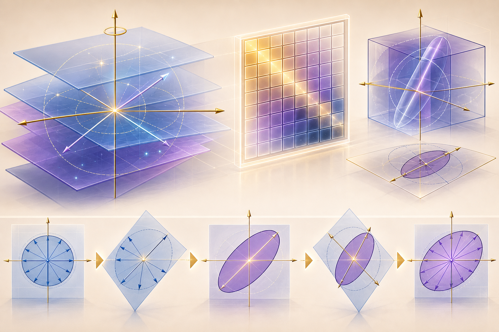
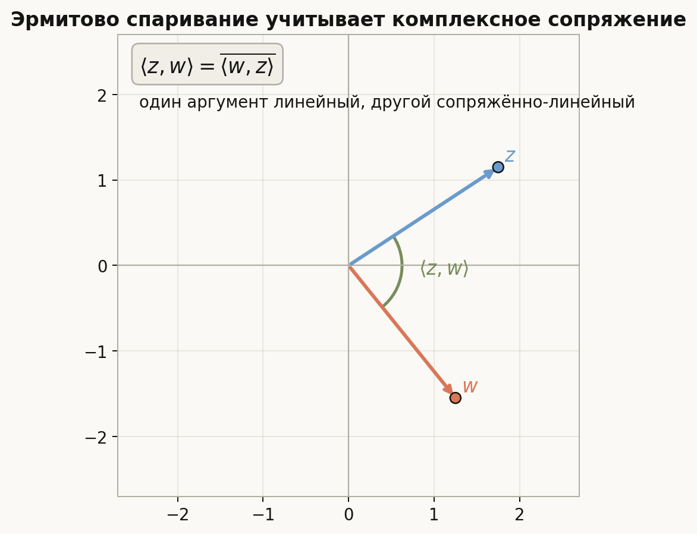
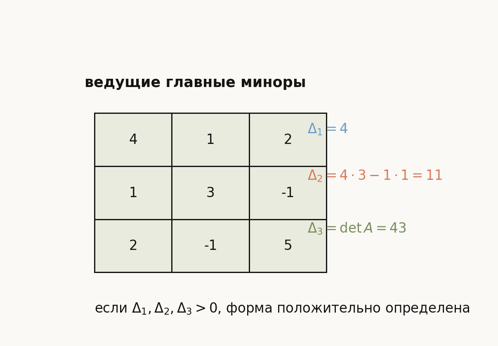
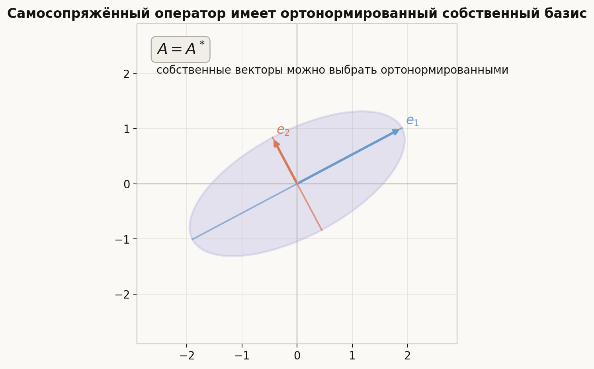
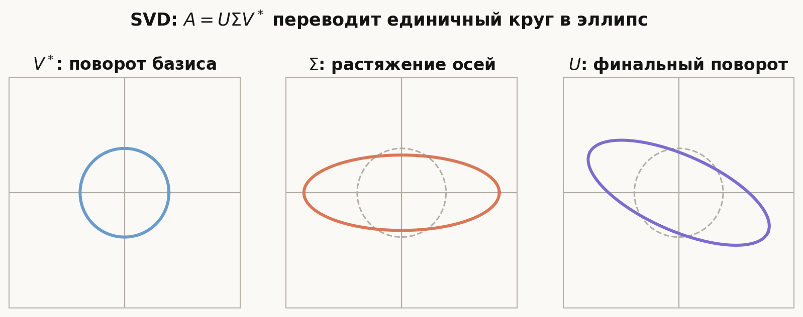

# Лекция: комплексные пространства, эрмитовы формы и SVD

## План

1. Зачем нужны комплексные пространства с эрмитовой геометрией
2. Комплексные векторные пространства
3. Полуторалинейные формы
4. Эрмитовы и косоэрмитовы формы
5. Квадратичные формы над комплексными пространствами
6. Матрица эрмитовой формы и замена базиса
7. Положительная определённость
8. Метод Якоби
9. Критерий Сильвестра
10. Эрмитово векторное пространство
11. Сопряжённый оператор
12. Самосопряжённые операторы
13. Нормальные и унитарные операторы
14. Сингулярное разложение
15. Что важно для поступления в ШАД
16. Типичные ошибки
17. Итог
18. Вопросы для самопроверки

---

## 1. Зачем нужны комплексные пространства с эрмитовой геометрией

Над вещественными пространствами скалярное произведение было симметрической билинейной формой:
$$
\langle x,y\rangle=\langle y,x\rangle.
$$

Над комплексными пространствами такая формула уже плохо согласуется с положительностью. Если взять обычное билинейное выражение
$$
x_1y_1+\dots+x_ny_n,
$$
то для $x=(i,0,\dots,0)$ получится $\langle x,x\rangle=i^2=-1$, а длина не должна иметь отрицательный квадрат.

Поэтому в комплексной геометрии появляется комплексное сопряжение:
$$
\langle x,y\rangle=x_1\overline{y_1}+\dots+x_n\overline{y_n}
$$
или, в другой распространённой конвенции,
$$
\langle x,y\rangle=\overline{x_1}y_1+\dots+\overline{x_n}y_n.
$$

В этой лекции будем использовать конвенцию: **форма линейна по первому аргументу и сопряжённо-линейна по второму**. Тогда стандартное эрмитово произведение на $\mathbb{C}^n$ записывается так:
$$
\langle x,y\rangle=x^T\overline{y}.
$$

Важно не смешивать конвенции. В этой лекции:
$$
\langle \alpha x+\beta z,y\rangle=\alpha\langle x,y\rangle+\beta\langle z,y\rangle,
$$
$$
\langle x,\alpha y+\beta z\rangle=\overline{\alpha}\langle x,y\rangle+\overline{\beta}\langle x,z\rangle.
$$

Главная идея темы:

- комплексная геометрия требует полуторалинейности, а не билинейности;
- эрмитовы формы являются комплексным аналогом симметрических вещественных форм;
- положительная определённость проверяется через главные миноры;
- самосопряжённые операторы имеют вещественные собственные значения и ортонормированный собственный базис;
- SVD показывает любой линейный оператор как унитарный поворот, диагональное растяжение и ещё один унитарный поворот.

---

## 2. Комплексные векторные пространства

Комплексное векторное пространство — это векторное пространство над полем $\mathbb{C}$.

Это означает, что векторы можно складывать и умножать на комплексные числа. Например, $\mathbb{C}^n$ состоит из столбцов
$$
x=
\begin{pmatrix}
x_1\\
\vdots\\
x_n
\end{pmatrix},
\qquad x_i\in\mathbb{C}.
$$

### Связь с вещественным пространством

Любое комплексное пространство размерности $n$ можно рассматривать как вещественное пространство размерности $2n$, потому что каждую координату $z=a+bi$ можно заменить парой $(a,b)$.

Например:
$$
\mathbb{C}^n\cong\mathbb{R}^{2n}
$$
как вещественные пространства.

Но как комплексные пространства они устроены богаче: разрешено умножение на $i$, и линейность должна сохраняться относительно всех комплексных чисел.

### Комплексная линейность

Отображение $A\colon V\to W$ называется комплексно-линейным, если
$$
A(\alpha x+\beta y)=\alpha A x+\beta A y
$$
для любых $\alpha,\beta\in\mathbb{C}$.

Это сильнее, чем вещественная линейность. Например, комплексно-линейное отображение обязано удовлетворять
$$
A(ix)=iA(x).
$$

---

## 3. Полуторалинейные формы

Пусть $V$ — комплексное векторное пространство.

### Определение

Отображение
$$
H\colon V\times V\to\mathbb{C}
$$
называется **полуторалинейной формой**, если оно линейно по первому аргументу и сопряжённо-линейно по второму:
$$
H(\alpha x+\beta z,y)=\alpha H(x,y)+\beta H(z,y),
$$
$$
H(x,\alpha y+\beta z)=\overline{\alpha}H(x,y)+\overline{\beta}H(x,z).
$$

Слово "полуторалинейная" означает: одна линейность обычная, другая — с комплексным сопряжением.

### Стандартный пример

На $\mathbb{C}^n$ можно задать
$$
H(x,y)=x_1\overline{y_1}+\dots+x_n\overline{y_n}.
$$

Тогда
$$
H(\alpha x,y)=\alpha H(x,y),
$$
но
$$
H(x,\alpha y)=\overline{\alpha}H(x,y).
$$

Именно это даёт
$$
H(x,x)=|x_1|^2+\dots+|x_n|^2\ge 0.
$$

---

## 4. Эрмитовы и косоэрмитовы формы

### Эрмитова форма

Полуторалинейная форма $H$ называется **эрмитовой**, если
$$
H(x,y)=\overline{H(y,x)}
$$
для любых $x,y\in V$.

Это комплексный аналог симметрической билинейной формы.

Из этого сразу следует, что
$$
H(x,x)=\overline{H(x,x)}.
$$

Значит, $H(x,x)$ — вещественное число.

### Косоэрмитова форма

Полуторалинейная форма $K$ называется **косоэрмитовой**, если
$$
K(x,y)=-\overline{K(y,x)}.
$$

Тогда
$$
K(x,x)=-\overline{K(x,x)}.
$$

Следовательно, $K(x,x)$ является чисто мнимым числом.

### Пример

Запись через координаты легко испортить, если смешать аргументы. Например, выражение с $\overline{x_1}$ уже не будет линейным по первому аргументу. Поэтому надёжнее задавать форму через матрицу.

При нашей конвенции координатная запись полуторалинейной формы имеет вид
$$
H(x,y)=x^T A\overline{y}.
$$

Тогда форма эрмитова тогда и только тогда, когда
$$
A=\overline{A}^{\,T}.
$$

То есть $A=A^*$, где $A^*$ — сопряжённо-транспонированная матрица.

Косоэрмитова форма соответствует условию
$$
A=-A^*.
$$

---

## 5. Квадратичные формы над комплексными пространствами

Для эрмитовой формы $H$ выражение
$$
Q(x)=H(x,x)
$$
называется связанной с ней **квадратичной формой**.

Над $\mathbb{C}$ важно помнить:

- $Q(x)$ вещественна, если $H$ эрмитова;
- $Q(\alpha x)=|\alpha|^2Q(x)$, а не $\alpha^2Q(x)$;
- эрмитову форму можно восстановить по $Q$ с помощью поляризационной формулы.

### Поляризационная формула

При нашей конвенции линейности по первому аргументу:
$$
H(x,y)=\frac14\left(Q(x+y)-Q(x-y)+iQ(x+iy)-iQ(x-iy)\right).
$$

Эта формула показывает, что эрмитова форма и её квадратичная форма содержат одну и ту же информацию.

### Пример

Пусть
$$
H(x,y)=2x_1\overline{y_1}+(1+i)x_1\overline{y_2}+(1-i)x_2\overline{y_1}+3x_2\overline{y_2}.
$$

Тогда
$$
Q(x)=2|x_1|^2+3|x_2|^2+(1+i)x_1\overline{x_2}+(1-i)x_2\overline{x_1}.
$$

Последние два слагаемых взаимно сопряжены, поэтому их сумма вещественна.

---

## 6. Матрица эрмитовой формы и замена базиса

Пусть $e=(e_1,\dots,e_n)$ — базис комплексного пространства $V$.

Матрица полуторалинейной формы $H$ в базисе $e$ определяется так:
$$
a_{ij}=H(e_i,e_j).
$$

Если $X$ и $Y$ — столбцы координат $x$ и $y$ в базисе $e$, то
$$
H(x,y)=X^T A\overline{Y}.
$$

### Замена базиса

Пусть новый базис $f$ связан со старым базисом $e$ матрицей $C$: столбцы $C$ — координаты новых базисных векторов в старом базисе. Тогда
$$
X=CX',
\qquad
Y=CY'.
$$

Подставим:
$$
\begin{aligned}
H(x,y)
&=(CX')^T A\overline{CY'}\\
&=(X')^T C^T A\overline{C}\,\overline{Y'}.
\end{aligned}
$$

Значит, матрица формы в новом базисе равна
$$
A'=C^T A\overline{C}.
$$

Если используется противоположная конвенция скалярного произведения, формула записывается как $A'=C^*AC$. Смысл тот же: для эрмитовых форм замена базиса является комплексным аналогом конгруэнтности.

---

## 7. Положительная определённость

Эрмитова форма $H$ называется:

- **положительно определённой**, если $H(x,x)>0$ для всех $x\ne 0$;
- **неотрицательно определённой**, если $H(x,x)\ge 0$ для всех $x$;
- **отрицательно определённой**, если $H(x,x)<0$ для всех $x\ne 0$;
- **неопределённой**, если $H(x,x)$ принимает и положительные, и отрицательные значения.

В матричной форме это означает:
$$
Q(x)=x^TA\overline{x}.
$$

Для эрмитовой матрицы $A$ значение $x^TA\overline{x}$ вещественно.

### Пример

Матрица
$$
A=
\begin{pmatrix}
2 & i\\
-i & 3
\end{pmatrix}
$$
эрмитова, потому что $A=A^*$.

Для $x=(x_1,x_2)$:
$$
Q(x)=2|x_1|^2+3|x_2|^2+ix_1\overline{x_2}-ix_2\overline{x_1}.
$$

Смешанные слагаемые взаимно сопряжены, поэтому сумма вещественна.

---

## 8. Метод Якоби

Метод Якоби приводит эрмитову форму к диагональному виду с помощью последовательного выделения квадратов.

Для эрмитовой матрицы $A$ рассмотрим ведущие главные миноры:
$$
\Delta_k=
\det A_k,
$$
где $A_k$ — левый верхний блок размера $k\times k$.

Если
$$
\Delta_1,\Delta_2,\dots,\Delta_n
$$
не равны нулю, то существует базис, в котором форма имеет диагональную матрицу
$$
\operatorname{diag}\left(
\Delta_1,
\frac{\Delta_2}{\Delta_1},
\frac{\Delta_3}{\Delta_2},
\dots,
\frac{\Delta_n}{\Delta_{n-1}}
\right).
$$

Это и есть диагональный вид, получаемый методом Якоби.

### Смысл формулы

Метод Якоби — это аналог метода Гаусса для квадратичных форм. Каждый шаг выделяет один квадрат и уменьшает размер оставшейся формы.

Если все ведущие миноры ненулевые, процесс идёт без перестановок. Если какой-то ведущий минор равен нулю, метод может требовать предварительной замены базиса.

### Пример

Пусть
$$
A=
\begin{pmatrix}
2 & 1+i\\
1-i & 3
\end{pmatrix}.
$$

Тогда
$$
\Delta_1=2,
\qquad
\Delta_2=2\cdot 3-(1+i)(1-i)=6-2=4.
$$

По методу Якоби форма приводится к диагонали
$$
\operatorname{diag}\left(2,\frac42\right)=\operatorname{diag}(2,2).
$$

---

## 9. Критерий Сильвестра

### Формулировка

Эрмитова форма с матрицей $A$ положительно определена тогда и только тогда, когда все её ведущие главные миноры положительны:
$$
\Delta_1>0,\quad \Delta_2>0,\quad \dots,\quad \Delta_n>0.
$$

Это комплексная версия критерия Сильвестра.

### Почему это следует из метода Якоби

Если все $\Delta_k>0$, то диагональные коэффициенты в методе Якоби равны
$$
\Delta_1,\quad \frac{\Delta_2}{\Delta_1},\quad \dots,\quad \frac{\Delta_n}{\Delta_{n-1}},
$$
и все они положительны. Значит, в подходящем базисе
$$
Q(x)=d_1|x_1|^2+\dots+d_n|x_n|^2,
\qquad d_i>0.
$$

Такая форма положительно определена.

Обратно, если форма положительно определена, то её ограничение на подпространство, порождённое первыми $k$ базисными векторами, тоже положительно определено. Поэтому каждый ведущий блок $A_k$ положительно определён, и его определитель положителен.

---

## 10. Эрмитово векторное пространство

**Эрмитово векторное пространство** — это комплексное векторное пространство с положительно определённым эрмитовым скалярным произведением.

В нём определяются:
$$
\|x\|=\sqrt{\langle x,x\rangle},
$$
$$
\rho(x,y)=\|x-y\|,
$$
$$
x\perp y \quad \Longleftrightarrow \quad \langle x,y\rangle=0.
$$

### Неравенство Коши-Буняковского

В эрмитовом пространстве выполнено:
$$
|\langle x,y\rangle|\le \|x\|\|y\|.
$$

Равенство достигается тогда и только тогда, когда $x$ и $y$ линейно зависимы.

### Ортонормированный базис

Базис $e_1,\dots,e_n$ называется ортонормированным, если
$$
\langle e_i,e_j\rangle=
\begin{cases}
1, & i=j,\\
0, & i\ne j.
\end{cases}
$$

В ортонормированном базисе скалярное произведение имеет стандартный вид:
$$
\langle x,y\rangle=x_1\overline{y_1}+\dots+x_n\overline{y_n}.
$$

Как и в евклидовом случае, из любого базиса можно получить ортонормированный базис методом Грама-Шмидта, только проекции записываются с комплексным сопряжением.

---

## 11. Сопряжённый оператор

Пусть $A\colon V\to V$ — линейный оператор в эрмитовом пространстве.

Оператор $A^*$ называется **сопряжённым** к $A$, если
$$
\langle Ax,y\rangle=\langle x,A^*y\rangle
$$
для всех $x,y\in V$.

В конечномерном эрмитовом пространстве такой оператор существует и единственен.

### Матрица сопряжённого оператора

В ортонормированном базисе матрица $A^*$ равна сопряжённо-транспонированной матрице:
$$
[A^*]=\overline{[A]}^{\,T}.
$$

Именно поэтому одно и то же обозначение $A^*$ используется и для оператора, и для матрицы.

### Свойства

Для операторов выполнены формулы:
$$
(A+B)^*=A^*+B^*,
$$
$$
(\lambda A)^*=\overline{\lambda}A^*,
$$
$$
(AB)^*=B^*A^*,
$$
$$
(A^*)^*=A.
$$

---

## 12. Самосопряжённые операторы

Оператор $A$ называется **самосопряжённым**, если
$$
A=A^*.
$$

В ортонормированном базисе его матрица эрмитова:
$$
A=\overline{A}^{\,T}.
$$

### Главные свойства

#### Все собственные значения самосопряжённого оператора вещественны

Действительно, если $Av=\lambda v$ и $v\ne 0$, то
$$
\lambda\langle v,v\rangle
=\langle \lambda v,v\rangle
=\langle Av,v\rangle
=\langle v,Av\rangle
=\langle v,\lambda v\rangle
=\overline{\lambda}\langle v,v\rangle.
$$

Так как $\langle v,v\rangle>0$, получаем $\lambda=\overline{\lambda}$.

#### Собственные векторы, отвечающие разным собственным значениям, ортогональны

Пусть $Av=\lambda v$, $Aw=\mu w$ и $\lambda\ne\mu$. Тогда
$$
\lambda\langle v,w\rangle
=\langle Av,w\rangle
=\langle v,Aw\rangle
=\overline{\mu}\langle v,w\rangle.
$$

Так как $\mu$ вещественно, получаем $(\lambda-\mu)\langle v,w\rangle=0$, значит $\langle v,w\rangle=0$.

#### Существует ортонормированный собственный базис

В конечномерном комплексном эрмитовом пространстве самосопряжённый оператор имеет ортонормированный базис из собственных векторов.

Это спектральная теорема для самосопряжённых операторов.

---

## 13. Нормальные и унитарные операторы

Оператор $A$ называется **нормальным**, если
$$
AA^*=A^*A.
$$

Самосопряжённые операторы нормальны. Унитарные операторы тоже нормальны.

### Унитарный оператор

Оператор $U$ называется **унитарным**, если
$$
U^*U=UU^*=I.
$$

Эквивалентно:
$$
\langle Ux,Uy\rangle=\langle x,y\rangle.
$$

То есть унитарный оператор сохраняет длины, углы и ортогональность.

В ортонормированном базисе матрица унитарного оператора удовлетворяет
$$
U^*U=I.
$$

Столбцы такой матрицы образуют ортонормированную систему.

### Спектральная теорема для нормальных операторов

Нормальный оператор над комплексным эрмитовым пространством диагонализируется в ортонормированном базисе:
$$
A=UDU^*,
$$
где $U$ унитарна, а $D$ диагональна.

Для самосопряжённого оператора диагональные элементы $D$ вещественны.

---

## 14. Сингулярное разложение

SVD применяется не только к квадратным матрицам. Пусть
$$
A\in M_{m\times n}(\mathbb{C}).
$$

Тогда существуют унитарные матрицы $U\in M_m(\mathbb{C})$, $V\in M_n(\mathbb{C})$ и прямоугольная диагональная матрица $\Sigma$ такие, что
$$
A=U\Sigma V^*.
$$

Диагональные элементы $\Sigma$ неотрицательны:
$$
\sigma_1\ge\sigma_2\ge\dots\ge 0.
$$

Они называются **сингулярными числами** матрицы $A$.

### Как SVD связано с самосопряжёнными операторами

Матрица
$$
A^*A
$$
эрмитова и неотрицательно определена, потому что
$$
\langle A^*Ax,x\rangle=\langle Ax,Ax\rangle=\|Ax\|^2\ge 0.
$$

По спектральной теореме для $A^*A$ существует ортонормированный базис из собственных векторов:
$$
A^*Av_i=\lambda_i v_i,
\qquad \lambda_i\ge 0.
$$

Сингулярные числа равны
$$
\sigma_i=\sqrt{\lambda_i}.
$$

Если $\sigma_i>0$, то
$$
u_i=\frac{Av_i}{\sigma_i}
$$
образуют ортонормированную систему в $\mathbb{C}^m$.

Эта конструкция и даёт разложение
$$
A=U\Sigma V^*.
$$

### Геометрический смысл

SVD говорит:

- $V^*$ выбирает правильные ортонормированные направления во входном пространстве;
- $\Sigma$ растягивает эти направления с коэффициентами $\sigma_i$;
- $U$ переносит результат в выходное пространство с сохранением углов и длин.

Для матрицы $2\times 2$ единичная окружность переходит в эллипс. Длины полуосей этого эллипса равны сингулярным числам.

---

## 15. Что важно для поступления в ШАД

Нужно уверенно уметь:

- отличать билинейность от полуторалинейности;
- проверять, является ли матрица эрмитовой или косоэрмитовой;
- записывать эрмитову форму по матрице и матрицу по форме;
- проверять положительную определённость по критерию Сильвестра;
- применять метод Якоби в простых случаях;
- понимать определение сопряжённого и самосопряжённого оператора;
- доказывать вещественность собственных значений самосопряжённого оператора;
- пользоваться ортогональностью собственных векторов;
- находить сингулярные числа через собственные значения $A^*A$;
- понимать геометрический смысл SVD.

---

## 16. Типичные ошибки

1. Забывают комплексное сопряжение во втором аргументе и пишут $x^Ty$ вместо $x^T\overline{y}$.

2. Смешивают две конвенции скалярного произведения. Важно заранее выбрать, по какому аргументу форма линейна.

3. Проверяют эрмитовость как обычную симметричность $A=A^T$. Над $\mathbb{C}$ нужно проверять $A=A^*$.

4. Считают, что $Q(\alpha x)=\alpha^2Q(x)$. Для эрмитовых форм верно $Q(\alpha x)=|\alpha|^2Q(x)$.

5. Применяют критерий Сильвестра к неэрмитовой матрице. Сначала нужно убедиться, что форма эрмитова.

6. Путают собственные значения матрицы $A$ и сингулярные числа. Сингулярные числа всегда неотрицательны и находятся через $A^*A$.

7. Думают, что SVD требует квадратной матрицы. На самом деле SVD существует для любой комплексной или вещественной матрицы.

---

## 17. Итог

Комплексная линейная алгебра отличается от вещественной тем, что положительная геометрия требует комплексного сопряжения. Поэтому вместо симметрических билинейных форм появляются эрмитовы полуторалинейные формы.

Эрмитовы формы кодируются эрмитовыми матрицами. Положительная определённость проверяется критерием Сильвестра, а метод Якоби даёт диагональный вид через ведущие главные миноры.

В эрмитовых пространствах сопряжённый оператор играет роль транспонированного оператора из евклидовой геометрии. Самосопряжённые операторы особенно важны: у них вещественный спектр и ортонормированный собственный базис.

SVD завершает картину: даже если оператор не самосопряжённый и не квадратный, его можно разложить на унитарные преобразования и диагональное неотрицательное растяжение.

---

## 18. Вопросы для самопроверки

1. Почему над $\mathbb{C}$ обычная билинейная форма $x^Ty$ не подходит на роль скалярного произведения?
2. Чем полуторалинейная форма отличается от билинейной?
3. Какое условие на матрицу соответствует эрмитовой форме?
4. Почему $H(x,x)$ вещественно для эрмитовой формы?
5. Как меняется матрица эрмитовой формы при замене базиса?
6. Сформулируйте критерий Сильвестра для эрмитовой формы.
7. Что даёт метод Якоби?
8. Как определяется сопряжённый оператор?
9. Почему собственные значения самосопряжённого оператора вещественны?
10. Как найти сингулярные числа матрицы через $A^*A$?
