# Лекция: Комплексные векторные пространства, эрмитовы формы, самосопряжённые операторы и SVD

## План

1. Мотивация
2. Комплексные векторные пространства
3. Линейные и полуторалинейные формы
4. Квадратичные и эрмитовы формы
5. Косоэрмитовы формы
6. Метод Лагранжа и метод Якоби
7. Закон инерции и критерий Сильвестра
8. Эрмитово векторное пространство
9. Операторы в евклидовом и эрмитовом пространствах. Нормальные операторы
10. Самосопряжённые операторы и спектральная теорема
11. Сингулярное разложение (SVD) и связь с ML
12. Примеры вычислений
13. Типичные ошибки
14. Что важно для поступления в ШАД
15. Итоги
16. Вопросы для самопроверки

---

## 1. Мотивация

Вещественные евклидовы пространства удобны, когда речь идёт о длинах, углах и ортогональности. Но во многих задачах естественно возникают **комплексные** пространства: в спектральной теории, Фурье-анализе, квантовой механике, численных методах, теории сигналов.

При переходе к комплексным пространствам привычное скалярное произведение нужно заменить на более тонкий объект — **эрмитову полуторалинейную форму**. Именно она позволяет корректно определить длину, ортогональность и сопряжённые операторы.

Эта тема важна, потому что в ней встречаются сразу несколько фундаментальных идей:

- комплексная линейная алгебра;
- эрмитовы формы и эрмитовы пространства;
- самосопряжённые операторы;
- положительная определённость и критерии;
- канонические формы квадратичных объектов;
- сингулярное разложение как универсальный инструмент работы с матрицами.

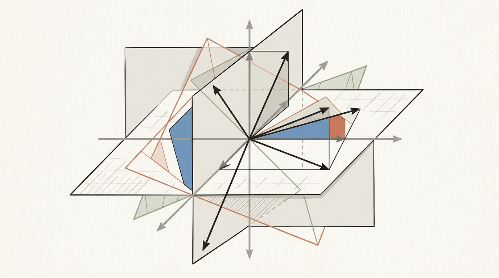

---

## 2. Комплексные векторные пространства

### Определение

**Комплексным векторным пространством** называется множество $V$ с операциями сложения и умножения на числа из $\mathbb{C}$, удовлетворяющее обычным аксиомам линейного пространства.

То есть теперь скаляры принадлежат не $\mathbb{R}$, а $\mathbb{C}$.

### Пример 1

Пространство $\mathbb{C}^n$ с покоординатными операциями — базовый пример комплексного векторного пространства.

### Пример 2

Пространство многочленов с комплексными коэффициентами:
$$
\mathbb{C}[x].
$$

### Важное замечание

Если $V$ — комплексное пространство, то оно автоматически является и вещественным пространством, если ограничить умножение на скаляры только вещественными числами. Но размерность при этом меняется: если $\dim_{\mathbb{C}}V=n$, то
$$
\dim_{\mathbb{R}}V=2n.
$$

### Почему это важно

Во многих вопросах надо чётко понимать, над каким полем рассматривается пространство:

- линейная независимость;
- базис;
- размерность;
- собственные значения;
- диагонализация.

Например, матрица может не иметь собственных значений над $\mathbb{R}$, но иметь их над $\mathbb{C}$.

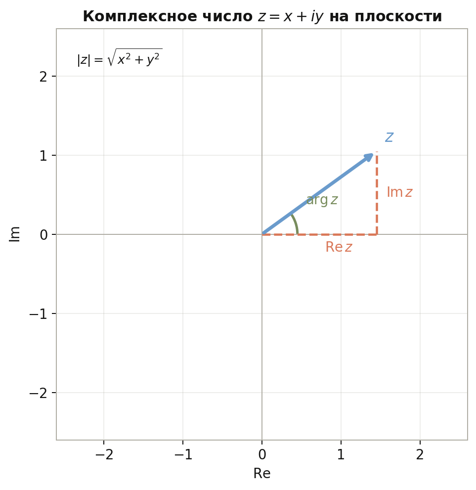

---

## 3. Линейные и полуторалинейные формы

### Линейная форма

**Линейная форма** на пространстве $V$ — это линейное отображение
$$
f\colon V\to \mathbb{C}.
$$

### Билинейная форма

На вещественных пространствах часто рассматривают билинейные формы
$$
B\colon V\times V\to \mathbb{R},
$$
линейные по каждому аргументу.

Но в комплексном случае напрямую использовать билинейность неудобно: если попытаться определить длину через $B(x,x)$, она может вести себя плохо относительно умножения на комплексный скаляр.

### Полуторалинейная форма

**Полуторалинейной формой** на комплексном пространстве называется отображение
$$
B\colon V\times V\to \mathbb{C},
$$
которое линейно по одному аргументу и сопряжённо-линейно по другому.

Обычно принимают соглашение:

- по первому аргументу форма линейна;
- по второму — сопряжённо-линейна.

То есть
$$
B(\alpha x_1+\beta x_2,y)=\alpha B(x_1,y)+\beta B(x_2,y),
$$
$$
B(x,\alpha y_1+\beta y_2)=\overline{\alpha}B(x,y_1)+\overline{\beta}B(x,y_2).
$$

Иногда в разных курсах соглашение меняют местами. Важно не само соглашение, а последовательность в его использовании.

### Пример

В $\mathbb{C}^n$ стандартная форма:
$$
\langle x,y\rangle=x_1\overline{y_1}+\dots+x_n\overline{y_n}.
$$

Она линейна по первому аргументу и сопряжённо-линейна по второму.

### Почему нельзя брать просто $x_1y_1+\dots+x_ny_n$

Если взять билинейную форму
$$
x_1y_1+\dots+x_ny_n,
$$
то для длины получится
$$
B(ix,ix)=i^2B(x,x)=-B(x,x),
$$
то есть квадрат длины может изменить знак. Это неприемлемо.

Именно поэтому в комплексной геометрии появляется сопряжение.

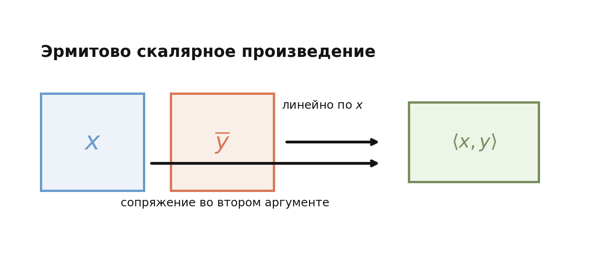

---

## 4. Квадратичные формы и эрмитовы формы

### Квадратичная форма

На вещественном пространстве **квадратичная форма** — это функция вида
$$
Q(x)=B(x,x),
$$
где $B$ — симметрическая билинейная форма.

В координатах:
$$
Q(x)=x^TAx,
$$
где $A=A^T$.

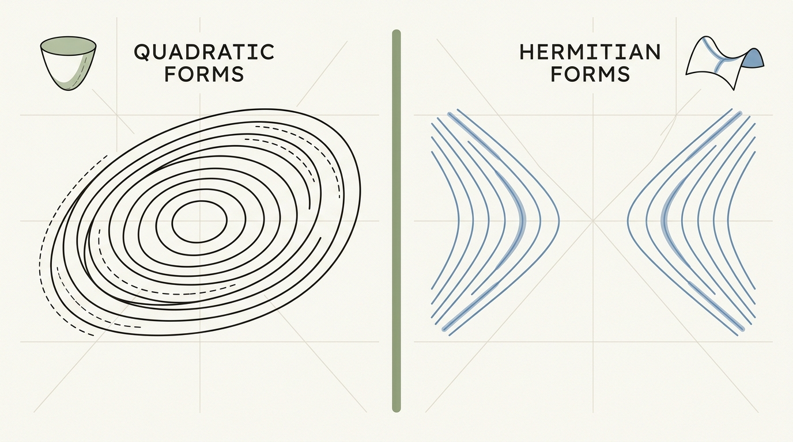

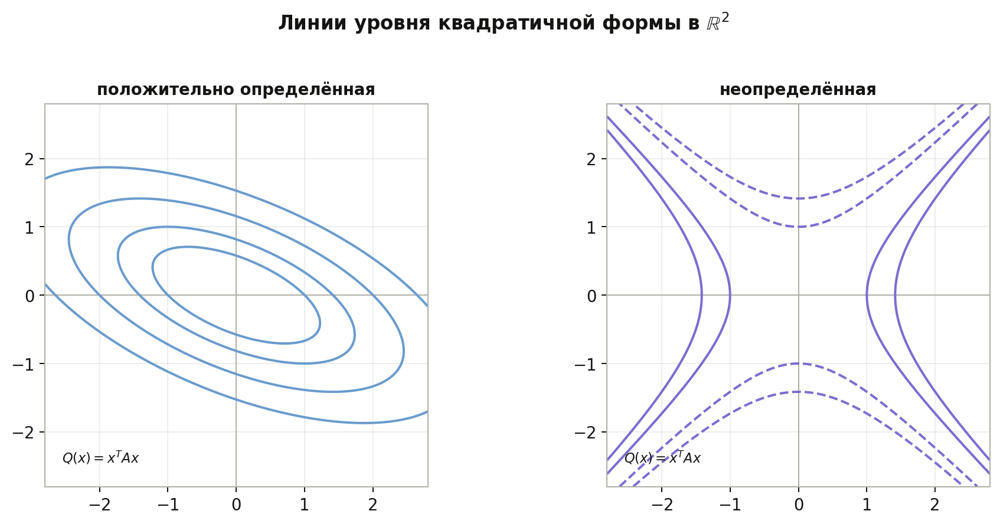

### Пример

В $\mathbb{R}^2$
$$
Q(x,y)=x^2+2xy+3y^2.
$$

Ей соответствует матрица
$$
A=
\begin{pmatrix}
1 & 1\\
1 & 3
\end{pmatrix}.
$$

### Эрмитова форма

На комплексном пространстве аналогом симметрической билинейной формы является **эрмитова форма**.

### Определение

Полуторалинейная форма $H$ называется **эрмитовой**, если
$$
H(x,y)=\overline{H(y,x)}
$$
для любых $x,y\in V$.

### Следствие

Для любого $x$ число $H(x,x)$ вещественно, потому что
$$
H(x,x)=\overline{H(x,x)}.
$$

### Матрица эрмитовой формы

В координатах эрмитова форма имеет вид
$$
H(x,y)=x^*Ay,
$$
где $x^*$ — сопряжённо-транспонированный вектор-строка, а матрица $A$ удовлетворяет
$$
A^*=A.
$$

Такие матрицы называются **эрмитовыми**.

### Пример

Матрица
$$
A=
\begin{pmatrix}
2 & 1+i\\
1-i & 3
\end{pmatrix}
$$
эрмитова, потому что
$$
A^*=
\begin{pmatrix}
2 & 1+i\\
1-i & 3
\end{pmatrix}
=A.
$$

### Положительная определённость

Эрмитова форма называется **положительно определённой**, если
$$
H(x,x)>0
$$
для любого $x\ne 0$.

Именно такая форма играет роль скалярного произведения в комплексном случае.

### Поляризационное тождество

В вещественном случае симметрическая билинейная форма однозначно восстанавливается по квадратичной: $B(x,y)=\tfrac12\bigl(Q(x+y)-Q(x)-Q(y)\bigr)$. В комплексном случае верно сильнее: эрмитова форма $H$ полностью определяется значениями $H(x,x)$. А именно,
$$
H(x,y)=\tfrac{1}{4}\Bigl[H(x{+}y,x{+}y)-H(x{-}y,x{-}y)+i\,H(x{+}iy,x{+}iy)-i\,H(x{-}iy,x{-}iy)\Bigr].
$$

Эта формула называется **поляризационным тождеством**. Её следствие: «квадратичная часть» $x\mapsto H(x,x)$ — это уже вся форма, а не только её диагональ.

---

## 5. Косоэрмитовы формы

### Определение

Полуторалинейная форма $K$ называется **косоэрмитовой**, если
$$
K(x,y)=-\overline{K(y,x)}.
$$

### Следствие

Для любого $x$ имеем
$$
K(x,x)=-\overline{K(x,x)}.
$$

Значит, число $K(x,x)$ является чисто мнимым или нулём.

### Матрица

В координатах косоэрмитовой форме соответствует матрица $A$, для которой
$$
A^*=-A.
$$

Такие матрицы называются **косоэрмитовыми**.

### Пример (не косоэрмитова)

Матрица
$$
A=
\begin{pmatrix}
1 & i\\
i & -1
\end{pmatrix}
$$
не является косоэрмитовой. Проверка:
$$
A^*=
\begin{pmatrix}
1 & -i\\
-i & -1
\end{pmatrix},
\qquad
-A=
\begin{pmatrix}
-1 & -i\\
-i & 1
\end{pmatrix}.
$$
Уже диагональные элементы $A$ вещественны, тогда как у косоэрмитовой матрицы они обязаны быть чисто мнимыми или нулём.

### Пример (косоэрмитова)

$$
A=
\begin{pmatrix}
i & 0\\
0 & -2i
\end{pmatrix},
\qquad
A^*=
\begin{pmatrix}
-i & 0\\
0 & 2i
\end{pmatrix}
=-A.
$$

### Замечание

Если $H$ эрмитова, то форма $iH$ косоэрмитова. И наоборот, если $K$ косоэрмитова, то $-iK$ эрмитова.

---

## 6. Метод Лагранжа и метод Якоби

### Задача

Пусть дана вещественная квадратичная форма
$$
Q(x)=x^TAx,
$$
где $A=A^T$. Хотим привести её к диагональному виду заменой переменных. Есть два классических способа: **алгоритм Лагранжа** (последовательное выделение квадратов) и **формула Якоби** (через отношения главных угловых миноров).

### Главные угловые миноры

Пусть $A$ — квадратная матрица порядка $n$. **Главным угловым минором** порядка $k$ (иногда говорят **ведущий главный минор**) называется определитель левого верхнего блока размера $k\times k$:

$$
\Delta_k=\det\begin{pmatrix}a_{11} & \cdots & a_{1k}\\ \vdots & \ddots & \vdots\\ a_{k1} & \cdots & a_{kk}\end{pmatrix}.
$$

По соглашению $\Delta_0=1$. В частности, $\Delta_1=a_{11}$, а $\Delta_n=\det A$.

Слово «угловой» значит, что берётся подматрица, примыкающая к левому верхнему углу $A$. В лекции про определители уже встречались **миноры** элементов и произвольных подматриц; здесь фиксируется особый набор — только такие «угловые» блоки.

### Метод Лагранжа: алгоритм выделения квадратов

Алгоритм Лагранжа — это пошаговая процедура, которая всегда (без условий на миноры) приводит вещественную квадратичную форму к сумме квадратов невырожденной заменой переменных. На каждом шаге выбирается переменная, входящая в форму с ненулевым квадратом, и от неё «отщепляется» полный квадрат; если квадратов нет вовсе, делается предварительная замена $x_i=u+v$, $x_j=u-v$.

Например, для формы
$$
Q(x,y)=x^2+4xy+3y^2
$$
выделим квадрат:
$$
Q(x,y)=(x+2y)^2-y^2.
$$
Замена $u=x+2y$, $v=y$ даёт $Q=u^2-v^2$ — это и есть результат метода Лагранжа.

### Метод Якоби: формула через миноры

В отличие от Лагранжа, **метод Якоби** — это не алгоритм, а **формула**: при условии $\Delta_k\ne 0$ для всех $k=1,\dots,n$ существует невырожденная замена переменных $u_1,\dots,u_n$, в которой форма принимает вид
$$
Q=\frac{\Delta_1}{\Delta_0}\,u_1^2+\frac{\Delta_2}{\Delta_1}\,u_2^2+\cdots+\frac{\Delta_n}{\Delta_{n-1}}\,u_n^2,
$$
где $\Delta_0=1$. Диагональные коэффициенты — это **отношения соседних главных угловых миноров**.

### Сравнение методов на одном примере

Применим формулу Якоби к форме $Q(x,y)=x^2+4xy+3y^2$ из примера выше. Матрица
$$
A=\begin{pmatrix}1&2\\2&3\end{pmatrix},\qquad
\Delta_0=1,\quad \Delta_1=1,\quad \Delta_2=\det A=-1.
$$

Все $\Delta_k\ne 0$, формула применима:
$$
\lambda_1=\frac{\Delta_1}{\Delta_0}=1,\qquad \lambda_2=\frac{\Delta_2}{\Delta_1}=-1.
$$

Получаем $Q=u^2-v^2$. Результат **совпадает** с алгоритмом Лагранжа, но отношения миноров дали коэффициенты сразу, без выделения квадратов.

Замечание: $\lambda_2=-1<0$ означает, что форма не положительно определена ($\Delta_2<0$), хотя $\Delta_1>0$.

### Почему это полезно

Из формулы Якоби сразу видно: знаки $\lambda_k$ совпадают со знаками отношений $\Delta_k/\Delta_{k-1}$. Отсюда мгновенно следует критерий Сильвестра для положительной определённости (см. §7).

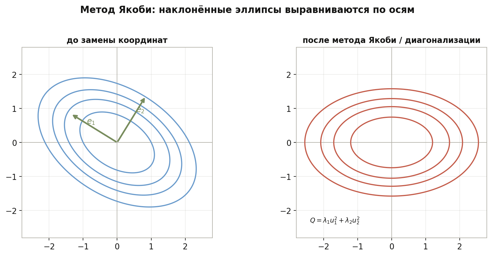

---

## 7. Закон инерции и критерий Сильвестра

### Закон инерции Сильвестра

Привести квадратичную форму к диагональному виду можно многими способами (метод Лагранжа, метод Якоби, ортогональное приведение). Диагональные коэффициенты при этом могут получаться разными — но их **знаки** инвариантны.

**Закон инерции.** Для любой вещественной квадратичной формы $Q$ числа
- $n_+$ — количество положительных диагональных коэффициентов,
- $n_-$ — количество отрицательных,
- $n_0$ — количество нулевых,

не зависят от выбора невырожденной замены переменных, приводящей $Q$ к диагональному виду. Тройка $(n_+, n_-, n_0)$ называется **сигнатурой** формы, а пара $(n_+, n_-)$ — её **инерционными индексами**.

В частности: $n_++n_-=\operatorname{rk}A$ (ранг формы), $n_++n_-+n_0=n$. Аналогичный закон верен и для эрмитовых форм.

### Формулировка для вещественной квадратичной формы

Пусть $Q(x)=x^TAx$, где $A=A^T$. Тогда форма положительно определена тогда и только тогда, когда все главные угловые миноры положительны:
$$
\Delta_1>0,\quad \Delta_2>0,\quad \dots,\quad \Delta_n>0.
$$

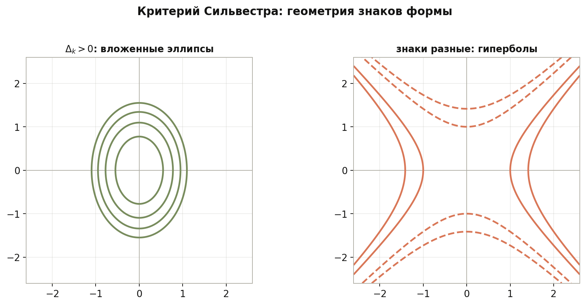

### Формулировка для отрицательной определённости

Форма отрицательно определена тогда и только тогда, когда знаки угловых миноров чередуются:
$$
\Delta_1<0,\quad \Delta_2>0,\quad \Delta_3<0,\quad \dots
$$

### Пример 1. Положительная определённость ($3\times 3$)

Пусть
$$
A=
\begin{pmatrix}
2 & 1 & 0\\
1 & 3 & 1\\
0 & 1 & 4
\end{pmatrix}.
$$

Симметричная матрица задаёт форму
$$
Q(x_1,x_2,x_3)=2x_1^2+3x_2^2+4x_3^2+2x_1x_2+2x_2x_3.
$$

Считаем главные угловые миноры:

$$
\Delta_1=\det(2)=2>0,
$$

$$
\Delta_2=
\det
\begin{pmatrix}
2 & 1\\
1 & 3
\end{pmatrix}
=6-1=5>0,
$$

$$
\Delta_3=\det A
=2\cdot(12-1)-1\cdot(4-0)
=22-4=18>0.
$$

Все $\Delta_k>0$, поэтому $Q$ **положительно определена** (линии уровня $Q=c$ при $c>0$ — эллипсоиды).

### Пример 2. Отрицательная определённость ($3\times 3$)

Возьмём ту же матрицу и умножим её на $-1$:
$$
B=-A=
\begin{pmatrix}
-2 & -1 & 0\\
-1 & -3 & -1\\
0 & -1 & -4
\end{pmatrix}.
$$

Для ведущего блока порядка $k$ из $B$ имеем $\det(-A_k)=(-1)^k\det(A_k)$, где $A_k$ — левый верхний блок $A$. Отсюда:

$$
\Delta_1^{(B)}=\det(-2)=-2<0,
$$

$$
\Delta_2^{(B)}=
\det
\begin{pmatrix}
-2 & -1\\
-1 & -3
\end{pmatrix}
=(-1)^2\cdot 5=5>0,
$$

$$
\Delta_3^{(B)}=\det B=(-1)^3\cdot 18=-18<0.
$$

Знаки миноров чередуются: «минус, плюс, минус». Значит, форма $Q_B(x)=x^TBx=-Q(x)$ **отрицательно определена**: $Q_B(x)<0$ при всех $x\ne 0$.

Эквивалентная проверка: матрица $A$ положительно определена, поэтому $-A$ отрицательно определена.

### Замечание про комплексный случай

Для эрмитовой матрицы положительная определённость также проверяется по главным угловым минорам: если $A=A^*$, то матрица положительно определена тогда и только тогда, когда все её главные угловые миноры положительны.

---

## 8. Эрмитово векторное пространство

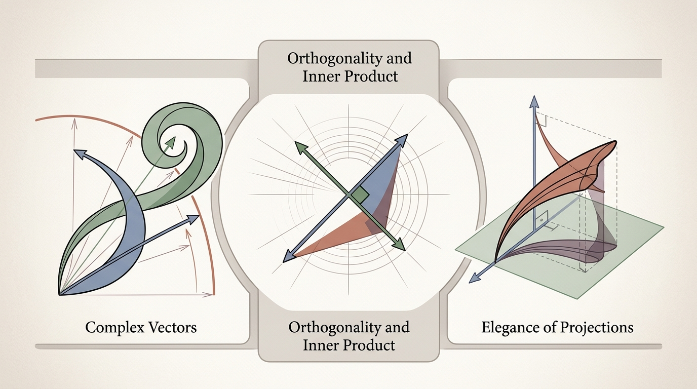

### Определение

**Эрмитовым пространством** называется комплексное линейное пространство $V$, на котором задано положительно определённое эрмитово скалярное произведение
$$
\langle x,y\rangle.
$$

Обычно выполняются свойства:

1. $\langle \alpha x_1+\beta x_2,y\rangle=\alpha\langle x_1,y\rangle+\beta\langle x_2,y\rangle$;
2. $\langle x,\alpha y_1+\beta y_2\rangle=\overline{\alpha}\langle x,y_1\rangle+\overline{\beta}\langle x,y_2\rangle$;
3. $\langle x,y\rangle=\overline{\langle y,x\rangle}$;
4. $\langle x,x\rangle>0$ при $x\ne 0$.

### Норма

Норма определяется так:
$$
\|x\|=\sqrt{\langle x,x\rangle}.
$$

### Ортогональность

Векторы $x$ и $y$ называются ортогональными, если
$$
\langle x,y\rangle=0.
$$

### Неравенство Коши–Буняковского

Для любых $x,y\in V$:
$$
|\langle x,y\rangle|\le \|x\|\,\|y\|.
$$

Равенство достигается тогда и только тогда, когда векторы $x$ и $y$ **линейно зависимы** (т. е. один из них является скалярным кратным другого, в комплексном смысле). Доказывается аналогично вещественному случаю, но с учётом сопряжения.

### Ортонормированный базис

Базис $e_1,\dots,e_n$ называется ортонормированным, если
$$
\langle e_i,e_j\rangle=
\begin{cases}
1,& i=j,\\
0,& i\ne j.
\end{cases}
$$

### Разложение по ортонормированному базису

Если $e_1,\dots,e_n$ — ортонормированный базис, то
$$
x=\sum_{k=1}^n \langle x,e_k\rangle e_k.
$$

### Важный факт

В конечномерном эрмитовом пространстве всегда существует ортонормированный базис. Он строится методом Грама–Шмидта, который работает и в комплексном случае.

---

## 9. Операторы в евклидовом и эрмитовом пространствах. Нормальные операторы

### Сопряжённый оператор

Пусть $V$ — евклидово или эрмитово пространство, и $A\colon V\to V$ — линейный оператор.

**Сопряжённым** к $A$ называется оператор $A^*$, для которого
$$
\langle Ax,y\rangle=\langle x,A^*y\rangle
$$
для всех $x,y\in V$.

### Координатная форма

- в вещественном евклидовом пространстве в ортонормированном базисе матрица сопряжённого оператора равна $A^T$;
- в эрмитовом пространстве в ортонормированном базисе матрица сопряжённого оператора равна $A^*$, то есть сопряжённо-транспонированной матрице.

### Нормальный оператор

Оператор называется **нормальным**, если
$$
AA^*=A^*A.
$$

К нормальным относятся:

- самосопряжённые операторы;
- унитарные операторы;
- кососамосопряжённые операторы.

### Унитарный оператор

Оператор $U$ в эрмитовом пространстве называется **унитарным**, если
$$
U^*U=UU^*=I.
$$

Он сохраняет эрмитово скалярное произведение, а значит, и нормы, и углы.

В вещественном случае аналог — **ортогональный оператор** ($O^TO=I$).

### Унитарная и ортогональная группы

Множество всех унитарных матриц размера $n\times n$ образует группу относительно умножения — это **унитарная группа** $U(n)$. Её вещественный аналог — **ортогональная группа** $O(n)$. Геометрически элементы $U(n)$ и $O(n)$ — это в точности преобразования, сохраняющие соответствующее скалярное произведение (то есть «жёсткие движения с фиксированной точкой»: повороты и отражения).

### Спектральная теорема для нормальных операторов

В конечномерном эрмитовом пространстве оператор $A$ **унитарно диагонализуем** (то есть в некотором ортонормированном базисе его матрица диагональна) тогда и только тогда, когда $A$ **нормален**:
$$
AA^*=A^*A.
$$

Следствия для разных классов:

- самосопряжённый ($A^*=A$): спектр вещественный;
- унитарный ($A^*=A^{-1}$): спектр на единичной окружности, $|\lambda|=1$;
- кососамосопряжённый ($A^*=-A$): спектр чисто мнимый.

В вещественном случае верно более слабое утверждение: только симметрические операторы диагонализуемы ортогонально; для ортогональных и кососимметрических получается блочно-диагональный вид с блоками $2\times 2$.

---

## 10. Самосопряжённые операторы и спектральная теорема

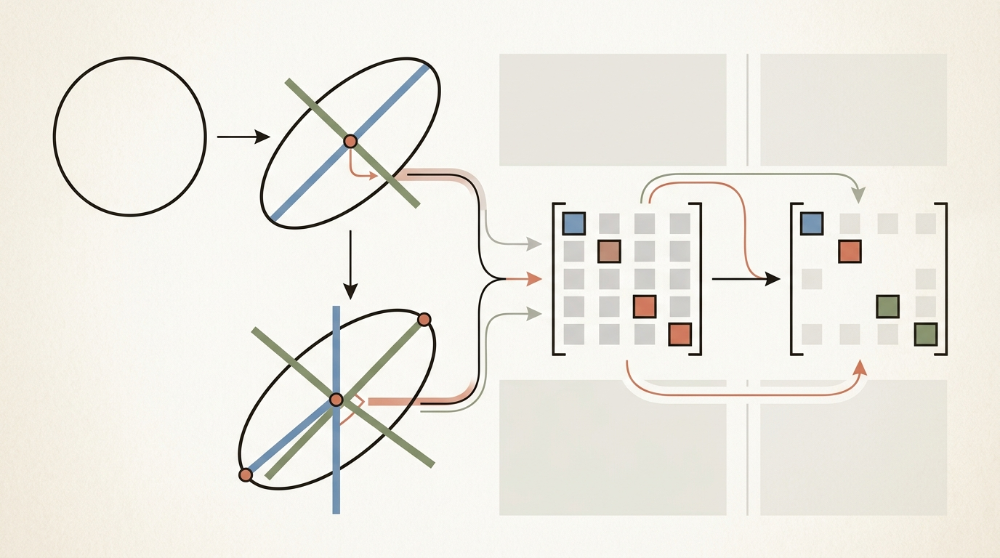

### Определение

Оператор $A$ называется **самосопряжённым**, если
$$
A^*=A.
$$

В матричной форме:

- в вещественном случае это симметрическая матрица $A^T=A$;
- в комплексном случае это эрмитова матрица $A^*=A$.

### Свойства

#### Собственные значения вещественны

Если $Ax=\lambda x$, $x\ne 0$ и $A=A^*$, то
$$
\lambda\in \mathbb{R}.
$$

**Доказательство.**
С одной стороны,
$$
\langle Ax,x\rangle=\langle \lambda x,x\rangle=\lambda\langle x,x\rangle.
$$

С другой стороны, по определению сопряжённого оператора и условию $A^*=A$:
$$
\langle Ax,x\rangle=\langle x,A^*x\rangle=\langle x,Ax\rangle=\langle x,\lambda x\rangle=\overline{\lambda}\langle x,x\rangle
$$
(в последнем равенстве использована сопряжённая линейность по второму аргументу).

Так как $\langle x,x\rangle>0$, получаем
$$
\lambda=\overline{\lambda},
$$
то есть $\lambda\in\mathbb{R}$.

#### Собственные векторы, отвечающие разным собственным значениям, ортогональны

Пусть
$$
Ax=\lambda x,\qquad Ay=\mu y,\qquad \lambda\ne \mu.
$$

Тогда
$$
\langle Ax,y\rangle=\lambda\langle x,y\rangle,
$$
а также
$$
\langle Ax,y\rangle=\langle x,Ay\rangle=\mu\langle x,y\rangle.
$$

Следовательно,
$$
(\lambda-\mu)\langle x,y\rangle=0,
$$
значит,
$$
\langle x,y\rangle=0.
$$

### Спектральная теорема

Для самосопряжённого оператора в конечномерном евклидовом или эрмитовом пространстве существует ортонормированный базис из собственных векторов.

Следовательно, матрица такого оператора в подходящем ортонормированном базисе диагональна.

Это один из важнейших фактов всей темы.

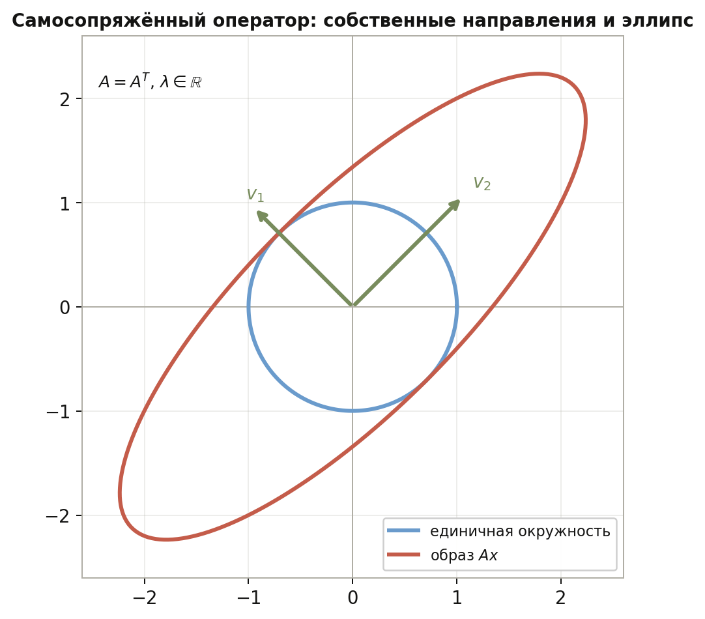

### Пример. Диагонализация эрмитовой матрицы $2\times 2$

Рассмотрим
$$
A=\begin{pmatrix}2 & i\\ -i & 2\end{pmatrix}.
$$
Матрица эрмитова: $A^*=A$.

**Шаг 1. Собственные значения.** Характеристический многочлен:
$$
\det(A-\lambda I)=(2-\lambda)^2-(i)(-i)=(2-\lambda)^2-1=0,
$$
откуда $\lambda_1=3$, $\lambda_2=1$ — оба вещественные, как и обещает спектральная теорема.

**Шаг 2. Собственные векторы.** Для $\lambda_1=3$:
$$
(A-3I)v=\begin{pmatrix}-1 & i\\ -i & -1\end{pmatrix}v=0\;\Rightarrow\; v_1=\begin{pmatrix}i\\ 1\end{pmatrix}.
$$
Для $\lambda_2=1$:
$$
(A-I)v=\begin{pmatrix}1 & i\\ -i & 1\end{pmatrix}v=0\;\Rightarrow\; v_2=\begin{pmatrix}-i\\ 1\end{pmatrix}.
$$

**Шаг 3. Ортогональность и нормировка.** Проверка ортогональности в эрмитовом смысле:
$$
\langle v_1,v_2\rangle=i\cdot\overline{(-i)}+1\cdot\overline{1}=i\cdot i+1=0.\quad\checkmark
$$
Нормы: $\|v_1\|^2=\|v_2\|^2=2$. Ортонормированные собственные векторы:
$$
e_1=\frac{1}{\sqrt{2}}\begin{pmatrix}i\\ 1\end{pmatrix},\qquad
e_2=\frac{1}{\sqrt{2}}\begin{pmatrix}-i\\ 1\end{pmatrix}.
$$

**Шаг 4. Разложение.** В базисе $(e_1,e_2)$ матрица оператора диагональна:
$$
U^*AU=\begin{pmatrix}3 & 0\\ 0 & 1\end{pmatrix},\qquad
U=\frac{1}{\sqrt{2}}\begin{pmatrix}i & -i\\ 1 & 1\end{pmatrix}.
$$
Здесь $U$ унитарна ($U^*U=I$).

---

## 11. Сингулярное разложение (SVD)

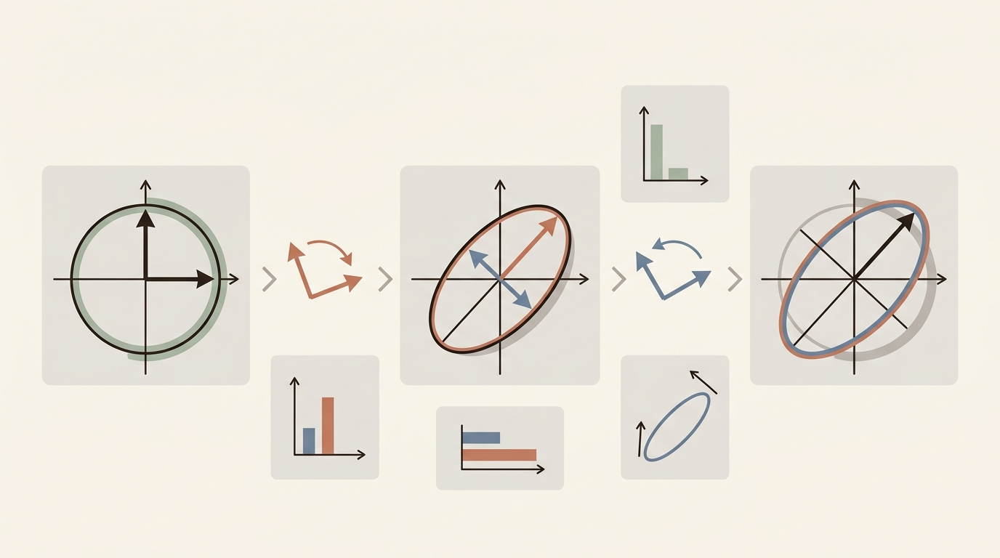

SVD — мост между «любой матрицей» и «хорошими» самосопряжёнными задачами. Для курса машинного обучения это один из главных инструментов: понижение размерности, устойчивые вычисления, сжатие данных и анализ матриц признаков.

### Формулировка

Для любой матрицы $A\in \mathbb{C}^{m\times n}$ существует разложение
$$
A=U\Sigma V^*,
$$
где:

- $U\in \mathbb{C}^{m\times m}$ — унитарная матрица (столбцы — **левые сингулярные векторы**);
- $V\in \mathbb{C}^{n\times n}$ — унитарная матрица (столбцы — **правые сингулярные векторы**);
- $\Sigma\in\mathbb{C}^{m\times n}$ — диагональная (прямоугольная) матрица с неотрицательными **сингулярными числами** на диагонали:
  $$
  \sigma_1\ge \sigma_2\ge \cdots \ge \sigma_r>0,\qquad \sigma_{r+1}=\cdots=0,
  $$
  где $r=\operatorname{rk}A$.

В вещественном случае $V^*$ — это обычная транспонированная $V^T$.

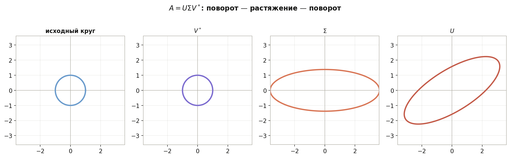

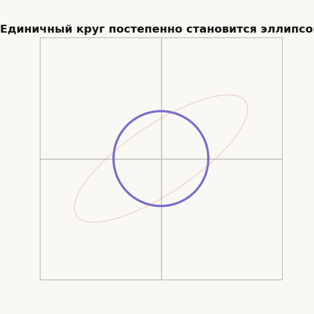

### Компактная форма

Если $r=\operatorname{rk}A$, достаточно хранить только «живую» часть:
$$
A=U_r\Sigma_r V_r^*,
$$
где $U_r\in\mathbb{C}^{m\times r}$, $\Sigma_r\in\mathbb{R}^{r\times r}$ — диагональ с $\sigma_1,\ldots,\sigma_r$, $V_r\in\mathbb{C}^{n\times r}$. Столбцы $U_r$ и $V_r$ ортонормированы. Это **компактное SVD** — именно его обычно считает численное ПО.

### Откуда берётся SVD (линейная алгебра)

Рассматривают эрмитову матрицу
$$
A^*A.
$$

Она положительно полуопределена. Пусть $v_1,\ldots,v_n$ — ортонормированный базис из собственных векторов $A^*A$, а $\lambda_1\ge\cdots\ge\lambda_n\ge 0$ — собственные значения. Положим
$$
\sigma_k=\sqrt{\lambda_k}.
$$

Правые сингулярные векторы — это $v_k$. Левые сингулярные векторы при $\sigma_k>0$ задаются формулой
$$
u_k=\frac{1}{\sigma_k}\,Av_k.
$$

Столбцы $U$ получают дополнение до ортонормированного базиса в $\mathbb{C}^m$ (если $m>n$), столбцы $V$ уже готовы.

**Схема вычисления (для понимания, не для ручного счёта больших матриц):**

1. Найти собственные пары $A^*A$.
2. Выписать $\sigma_k=\sqrt{\lambda_k}$ и $V$.
3. Получить ненулевые $u_k=\sigma_k^{-1}Av_k$.
4. Собрать $U$, $\Sigma$, проверить $A=U\Sigma V^*$.

Аналогично можно стартовать с $AA^*$ (размер $m\times m$) — удобно, если $m\ll n$.

### Геометрический смысл

Действие $A$ на вектор $x$:

1. $V^*$ — поворот (унитарное преобразование) в $\mathbb{C}^n$, переход в «сингулярный» базис;
2. $\Sigma$ — растяжения вдоль взаимно ортогональных осей ($\sigma_k$ — коэффициенты);
3. $U$ — поворот в $\mathbb{C}^m$.

Единичная сфера переходит в эллипсоид; полуоси эллипсоида равны $\sigma_k$. Чем больше $\sigma_1/\sigma_r$, тем «вытянутее» действие $A$ в доминирующем направлении.

### Пример 1. Диагональная матрица

$$
A=
\begin{pmatrix}
3 & 0\\
0 & 1
\end{pmatrix}
\quad\Rightarrow\quad
\sigma_1=3,\ \sigma_2=1,\quad
A=I\Sigma I.
$$

### Пример 2. Построение SVD для $2\times 2$

$$
A=
\begin{pmatrix}
1 & 1\\
0 & 2
\end{pmatrix}.
$$

Тогда
$$
A^TA=
\begin{pmatrix}
1 & 1\\
1 & 5
\end{pmatrix}.
$$

Собственные значения: $\lambda_1=3+\sqrt{5}$, $\lambda_2=3-\sqrt{5}$, откуда
$$
\sigma_1=\sqrt{3+\sqrt{5}},\qquad \sigma_2=\sqrt{3-\sqrt{5}}.
$$

Один из ортонормированных собственных векторов $A^TA$, отвечающий $\lambda_1$, даёт столбец $v_1$ матрицы $V$; затем $u_1=\sigma_1^{-1}Av_1$. Вторую пару $(u_2,v_2)$ получают аналогично (векторы ортогональны). В итоге $A=U\Sigma V^T$ с вещественными $U,V$.

Числа не «круглые», зато видна полная цепочка: $A^TA\to\sigma_k\to u_k$.

### Связь с рангом, ядром и образом

$$
\operatorname{rk}A=r=\#\{\sigma_k>0\}.
$$

- $\operatorname{Im}A=\operatorname{Lin}\{u_1,\ldots,u_r\}$ — первые $r$ столбцов $U$;
- $\ker A=\operatorname{Lin}\{v_{r+1},\ldots,v_n\}$ — последние $n-r$ столбцов $V$ (если $\sigma_k=0$).

### Нормы и теорема Экарта–Янга

**Спектральная норма** (операторная):
$$
\|A\|_2=\sigma_1.
$$

**Норма Фробениуса:**
$$
\|A\|_F^2=\sum_{i,j}|a_{ij}|^2=\operatorname{tr}(A^*A)=\sigma_1^2+\cdots+\sigma_r^2.
$$

**Связь с определителем.** Для квадратной $n\times n$ матрицы
$$
|\det A|=\sigma_1\sigma_2\cdots\sigma_n.
$$
В частности, $A$ невырождена ⇔ все $\sigma_k>0$.

**Усечённое SVD** ранга $k$:
$$
A_k=U_k\Sigma_k V_k^*=\sum_{i=1}^k \sigma_i\,u_i v_i^*
$$
(сумма ранговых одномерных матриц).

**Теорема Экарта–Янга.** Среди всех матриц ранга $\le k$ матрица $A_k$ минимизирует $\|A-B\|_F$ и $\|A-B\|_2$. То есть усечение SVD — строго наилучшее низкоранговое приближение фиксированного ранга.

### Псевдообратная матрица

Для $A=U\Sigma V^*$ **псевдообратная по Муру–Пенроузу**:
$$
A^+=V\Sigma^+ U^*,
$$
где $\Sigma^+$ получается заменой каждого $\sigma_k>0$ на $1/\sigma_k$, а нулевых $\sigma_k$ — на $0$. В компактной форме $A^+=V_r\Sigma_r^{-1}U_r^*$.

Если система $Ax=b$ переопределена или недоопределена, **нормальное псевдорешение** МНК:
$$
x^*=A^+b
$$
(при подходящей постановке — минимальная по норме среди решений).

### Когда SVD совпадает с диагонализацией

Если $A$ **нормальна** ($AA^*=A^*A$), в том числе если $A$ самосопряжена или унитарна, то $U$ и $V$ можно выбрать согласованными с диагонализацией. Для произвольной несимметричной матрицы собственные значения $A$ и сингулярные числа — разные объекты.

---

### Применения в машинном обучении и анализе данных

#### Матрица данных и PCA

Пусть строки матрицы $X\in\mathbb{R}^{N\times d}$ — объекты (наблюдения), столбцы — признаки. После центрирования $\tilde X$ (вычитание среднего по столбцам) **метод главных компонент** — это SVD:
$$
\tilde X=U\Sigma V^T.
$$

- столбцы $V$ — направления главных компонент в пространстве признаков;
- $\sigma_i^2$ пропорциональны дисперсии вдоль $i$-й компоненты;
- проекция на первые $k$ компонент: $\tilde X_k=U_k\Sigma_k V_k^T$ — сжатое представление данных с минимальной ошибкой в смысле $\|\cdot\|_F$ среди всех $k$-мерных линейных проекций.

В ML это базовый **feature extraction**: уменьшение $d$ признаков, визуализация, предобработка перед обучением.

#### Понижение размерности и сжатие

Усечённое SVD хранит только $k(m+n+1)$ параметров вместо $mn$ — полезно для больших разреженных или плотных матриц (рекомендации, тексты, изображения как матрицы пикселей). Чем быстрее убывают $\sigma_i$, тем лучше низкоранговое приближение.

#### Рекомендательные системы

Матрица «пользователь × объект» (оценки, клики) часто **почти низкого ранга**: несколько скрытых факторов объясняют большую часть структуры. SVD (или его стохастические варианты) ищет латентные факторы пользователей и объектов — идея, лежащая в основе классического **latent factor** / matrix factorization.

#### Устойчивые вычисления

Явное образование $A^TA$ **ухудшает** численную устойчивость: условность $\kappa(A^TA)=\kappa(A)^2$. Современные алгоритмы SVD работают с $A$ напрямую (бидиагонализация). В практике ML при плохой обусловленности признаков полезно знать: МНК через SVD надёжнее, чем решение нормальных уравнений $A^TAx=A^Tb$.

#### МНК, регуляризация, переопределённые системы

- Линейная регрессия с большим числом коррелированных признаков — по сути работа с $X$ и $X^TX$; SVD $X$ объясняет, какие направления данных «слабые» ($\sigma_i$ малы).
- **Ридж**-регрессия ($\lambda I$) и усечение малых $\sigma_i$ в SVD связаны одной идеей: не доверять направлениям, где данные почти не меняются.
- **Усечённое SVD** в задаче ранга $k$ — детерминированный аналог «оставить $k$ главных факторов».

#### Кратко: другие контексты

- **LSA / тематическое моделирование** (классика NLP): SVD матрицы «термин–документ».
- **Сжатие изображений**: блок пикселей как матрица, хранить несколько сингулярных компонент.
- **Анализ весов нейросети**: спектр сингулярных значений матриц весов (низкий ранг, сжатие моделей) — продвинутая тема, но опирается на тот же язык.

---

### Что запомнить перед курсом ML

| Объект | Смысл |
|--------|--------|
| $\sigma_k$ | «Сила» $k$-го независимого линейного режима $A$ |
| $V$ | Направления в пространстве признаков / входа |
| $U$ | Направления в пространстве отклика / выхода |
| $A_k$ | Наилучшее приближение ранга $k$ |
| $A^+$ | Псевдорешение переопределённых систем |
| PCA | SVD центрированной матрицы данных |

---

## 12. Примеры вычислений

### Пример 1. Проверка эрмитовости формы

Пусть
$$
H(x,y)=x^*
\begin{pmatrix}
2 & i\\
-i & 3
\end{pmatrix}
y.
$$

Матрица
$$
A=
\begin{pmatrix}
2 & i\\
-i & 3
\end{pmatrix}
$$
удовлетворяет
$$
A^*=
\begin{pmatrix}
2 & i\\
-i & 3
\end{pmatrix}=A.
$$

Значит, форма эрмитова.

### Пример 2. Критерий Сильвестра

Для матрицы
$$
A=
\begin{pmatrix}
2 & 1\\
1 & 2
\end{pmatrix}
$$
имеем
$$
\Delta_1=2>0,\qquad \Delta_2=3>0.
$$

Следовательно, соответствующая квадратичная форма положительно определена.

### Пример 3. Самосопряжённость оператора

Матрица
$$
A=
\begin{pmatrix}
2 & 1-i\\
1+i & 4
\end{pmatrix}
$$
эрмитова, поскольку
$$
A^*=
\begin{pmatrix}
2 & 1-i\\
1+i & 4
\end{pmatrix}=A.
$$

Следовательно, оператор самосопряжён.

### Пример 4. Сингулярные числа простой матрицы

Пусть
$$
A=
\begin{pmatrix}
1 & 0\\
0 & 2\\
0 & 0
\end{pmatrix}.
$$

Тогда
$$
A^*A=
\begin{pmatrix}
1 & 0\\
0 & 4
\end{pmatrix}.
$$

Собственные значения матрицы $A^*A$ равны $1$ и $4$, значит, сингулярные числа матрицы $A$ равны
$$
1,\qquad 2.
$$

---

## 13. Типичные ошибки

### Ошибка 1

Путать билинейную и полуторалинейную формы.

В комплексном пространстве стандартное скалярное произведение не билинейно, а полуторалинейно.

### Ошибка 2

Забывать сопряжение во втором аргументе:
$$
\langle x,y\rangle \ne \sum x_iy_i,
\qquad
\langle x,y\rangle = \sum x_i\overline{y_i}.
$$

### Ошибка 3

Считать, что эрмитовость матрицы — это просто симметричность.

В комплексном случае нужно проверять
$$
A^*=A,
$$
а не $A^T=A$.

### Ошибка 4

Неверно выписывать сопряжённый оператор.

В ортонормированном базисе эрмитова пространства матрица сопряжённого оператора — это сопряжённо-транспонированная матрица, а не просто транспонированная.

### Ошибка 5

Смешивать собственные значения и сингулярные числа.

Сингулярные числа — это квадратные корни из собственных значений $A^*A$, а не собственные значения самой матрицы $A$.

### Ошибка 6

Применять критерий Сильвестра к матрице, которая не является симметрической или эрмитовой.

Критерий работает именно для таких матриц.

### Ошибка 7

Считать, что любая матрица диагонализуема ортонормированным базисом.

Это верно не для любой матрицы, а для нормальных операторов; в частности, для самосопряжённых.

### Ошибка 8

Путать PCA и «собственные векторы матрицы $X$».

Главные компоненты — это собственные векторы **ковариационной** (или $X^TX$ после центрирования), то есть связаны с $X^TX$, а полное SVD даёт $X=U\Sigma V^T$; направления признаков — столбцы $V$.

### Ошибка 9

Думать, что усечение SVD «просто выбросило несколько столбцов».

Отбрасываются **малые сингулярные значения** вместе с соответствующими парами $(u_i,v_i)$; это оптимальное по норме Фробениуса приближение фиксированного ранга, а не произвольное удаление координат.

---

## 14. Что важно для поступления в ШАД

- понимать разницу между вещественными и комплексными пространствами;
- знать определение полуторалинейной формы;
- уметь проверять, что форма эрмитова или косоэрмитова;
- понимать, как эрмитова форма задаётся матрицей;
- знать, что такое положительная определённость;
- уметь применять критерий Сильвестра;
- понимать идею метода Якоби на простых примерах;
- знать определение сопряжённого оператора;
- уметь проверять самосопряжённость матрицы;
- знать свойства самосопряжённых операторов;
- понимать формулировку, компактное SVD и связь с $A^*A$;
- уметь находить сингулярные числа в простых примерах;
- знать теорему Экарта–Янга и смысл усечённого SVD;
- понимать, как SVD связано с PCA и низкоранговым приближением данных.

---

## 15. Итоги

Комплексные векторные пространства требуют аккуратного обращения со скалярным произведением: обычная билинейность заменяется на полуторалинейность, а симметричность — на эрмитовость. Это приводит к понятию эрмитова пространства, в котором корректно определяются норма, ортогональность и сопряжённый оператор.

Квадратичные формы и эрмитовы формы описываются матрицами, а их положительная определённость может проверяться через критерий Сильвестра. Метод Якоби позволяет приводить квадратичные формы к диагональному виду.

Для операторов центральны понятия сопряжённости, самосопряжённости и унитарности. Самосопряжённые операторы обладают особенно хорошей спектральной теорией: у них вещественный спектр и ортонормированный базис из собственных векторов.

SVD завершает картину: любая матрица раскладывается в композицию унитарных преобразований и диагонального растяжения. Усечённое SVD даёт наилучшее низкоранговое приближение; для матрицы данных это язык PCA, сжатия признаков и устойчивого МНК — база для дальнейшего машинного обучения.

---

## 16. Вопросы для самопроверки

1. Что такое комплексное векторное пространство?
2. Чем полуторалинейная форма отличается от билинейной?
3. Почему в комплексном скалярном произведении необходимо сопряжение?
4. Что такое эрмитова форма?
5. Что такое косоэрмитова форма?
6. Как в координатах записывается эрмитова форма?
7. Что означает положительная определённость?
8. В чём состоит метод Якоби?
9. Сформулируйте критерий Сильвестра.
10. Что такое эрмитово пространство?
11. Как определяется сопряжённый оператор?
12. Что такое самосопряжённый оператор?
13. Почему собственные значения самосопряжённого оператора вещественны?
14. Что такое сингулярные числа и как они связаны с $A^*A$?
15. Как формулируется SVD и компактное SVD?
16. Что утверждает теорема Экарта–Янга?
17. Как SVD связано с PCA для центрированной матрицы данных?
18. Зачем в ML предпочитают SVD явному построению $A^TA$?