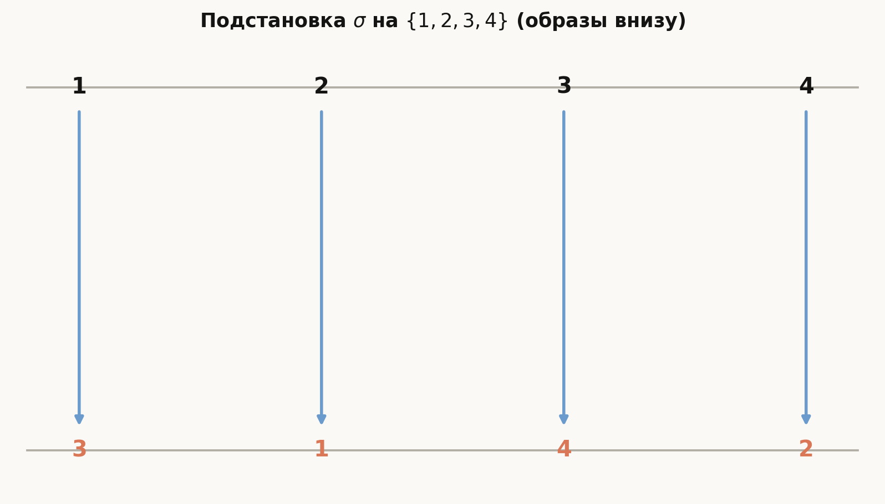
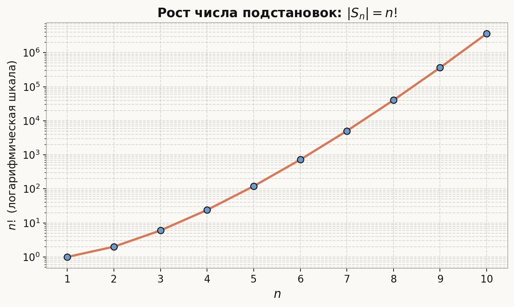
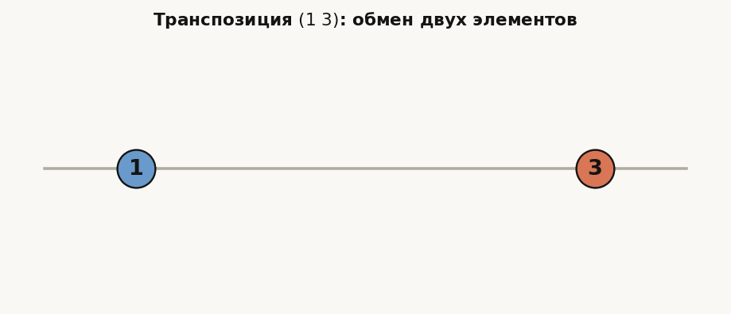
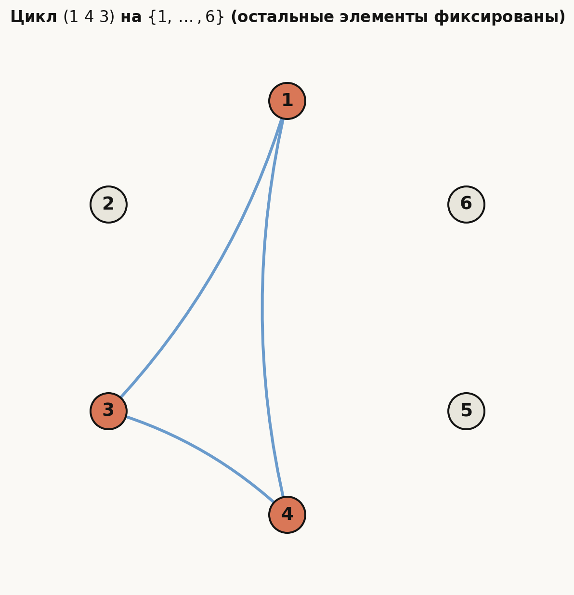
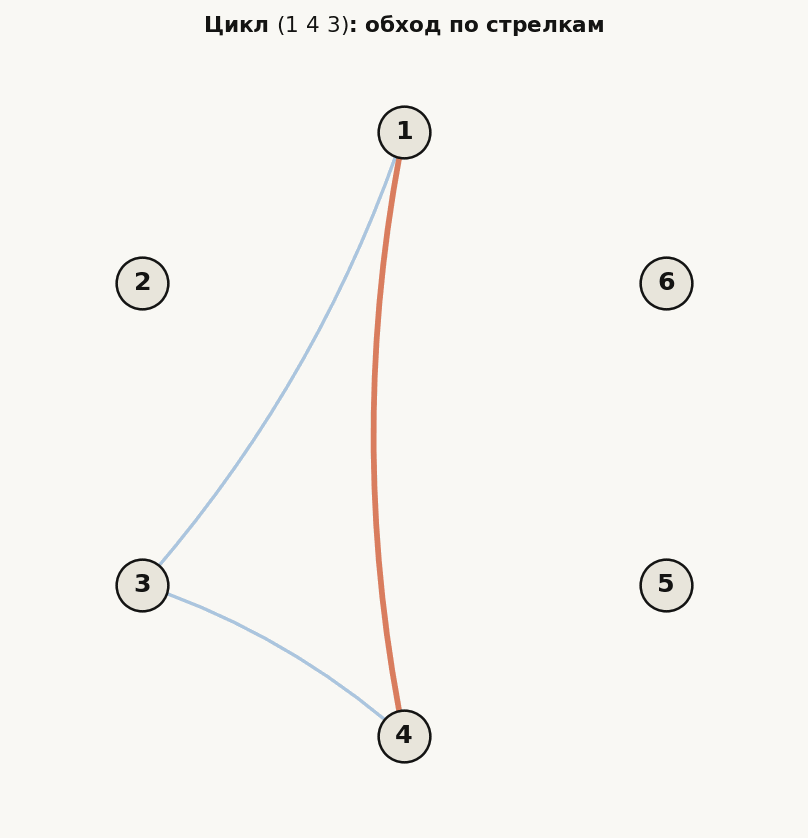
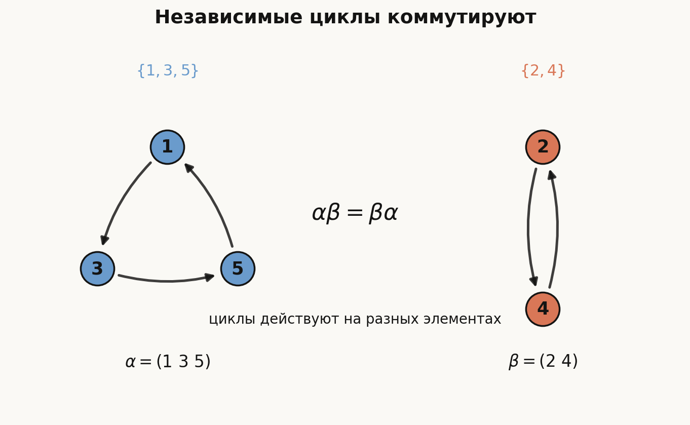
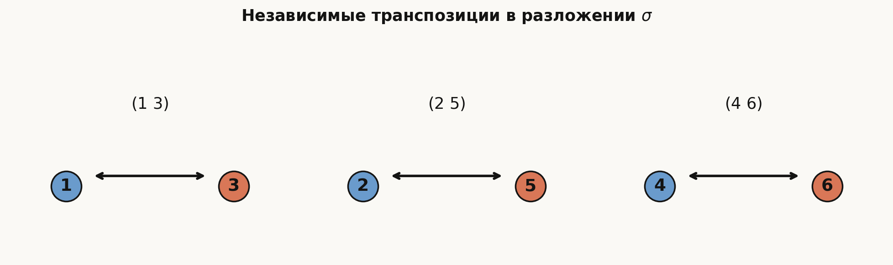

# Лекция: подстановки, их чётность, произведение, разложение на транспозиции и циклы, симметрические группы

## План

1. Подстановка как биекция конечного множества
2. Произведение подстановок: порядок композиции
3. Циклы и разложение на независимые циклы
4. Транспозиции и чётность
5. Симметрическая группа $S_n$ и группа $A_n$
6. Практическая схема решения задач

Эта лекция немного отличается от последующих тем линейной алгебры: здесь мы работаем не с векторами и матрицами, а с конечными биекциями. Но она нужна как стартовая алгебраическая модель: появляются композиция, обратный элемент, группа и знак подстановки. Знак подстановки позже войдёт в формулу определителя, поэтому тема не изолирована от дальнейшего курса.

---

## 1. Введение

Понятие **подстановки** является одним из центральных в алгебре, комбинаторике и теории групп. Оно возникает всякий раз, когда мы рассматриваем перестановку элементов некоторого конечного множества.

Например, если есть множество из $n$ элементов, то можно расположить их в некотором порядке, а затем поменять местами. Любое такое переупорядочение и есть подстановка.

Подстановки важны потому, что:

- описывают всевозможные перестановки конечного множества;
- образуют одну из самых важных групп — **симметрическую группу**;
- играют ключевую роль в определителях, теории уравнений, геометрии, комбинаторике и криптографии;
- позволяют наглядно изучать абстрактные свойства групп.

---

## 2. Определение подстановки

### 2.1. Подстановка как биекция

Пусть дано множество
$$
X = \{1,2,\dots,n\}.
$$

**Подстановкой степени $n$** называется всякое взаимно однозначное отображение множества $X$ на себя, то есть биекция
$$
\sigma: X \to X.
$$

Иначе говоря, подстановка каждому числу $i \in \{1,\dots,n\}$ ставит в соответствие некоторое число $\sigma(i)$ из того же множества, причем разные элементы переходят в разные.

### 2.2. Обозначение подстановки

Обычно подстановку записывают в виде двухстрочной таблицы:
$$
\sigma =
\begin{pmatrix}
1 & 2 & 3 & \dots & n \\
\sigma(1) & \sigma(2) & \sigma(3) & \dots & \sigma(n)
\end{pmatrix}.
$$

Например,
$$
\sigma =
\begin{pmatrix}
1 & 2 & 3 & 4 \\
3 & 1 & 4 & 2
\end{pmatrix}
$$
означает, что:
- $1 \mapsto 3$,
- $2 \mapsto 1$,
- $3 \mapsto 4$,
- $4 \mapsto 2$.

*Рис. 2. Та же подстановка «верхний ряд $\to$ нижний ряд».*

### 2.3. Подстановка как перестановка элементов

Иногда подстановку понимают как упорядочение чисел $1,2,\dots,n$. Например, запись
$$
(3,1,4,2)
$$
можно воспринимать как результат перестановки исходного набора $(1,2,3,4)$.

Но в алгебре более удобно понимать подстановку именно как отображение.

---

## 3. Число подстановок степени $n$

Сколько существует подстановок на множестве из $n$ элементов?

- для первого элемента можно выбрать образ $n$ способами;
- для второго — уже $n-1$ способами;
- для третьего — $n-2$ способами;
- и так далее;
- для последнего — $1$ способом.

Следовательно, число всех подстановок степени $n$ равно
$$
n! = n(n-1)(n-2)\cdots 2 \cdot 1.
$$

*Рис. 3. Число подстановок $|S_n| = n!$ растёт очень быстро.*

---

## 4. Произведение подстановок

### 4.1. Определение произведения

Пусть $\sigma$ и $\tau$ — две подстановки множества $\{1,\dots,n\}$.

Их **произведением** называется композиция отображений:
$$
\sigma\tau = \sigma \circ \tau,
$$
то есть
$$
(\sigma\tau)(i) = \sigma(\tau(i)).
$$

Это означает: сначала применяется подстановка $\tau$, затем $\sigma$.

### Важно
Порядок умножения имеет значение. Вообще говоря,
$$
\sigma\tau \ne \tau\sigma.
$$

То есть умножение подстановок обычно **не коммутативно**.

---

### 4.2. Пример произведения

Пусть
$$
\sigma =
\begin{pmatrix}
1 & 2 & 3 \\
2 & 3 & 1
\end{pmatrix},
\qquad
\tau =
\begin{pmatrix}
1 & 2 & 3 \\
3 & 1 & 2
\end{pmatrix}.
$$

Тогда:
- $\tau(1)=3$, $\sigma(3)=1$, значит $(\sigma\tau)(1)=1$;
- $\tau(2)=1$, $\sigma(1)=2$, значит $(\sigma\tau)(2)=2$;
- $\tau(3)=2$, $\sigma(2)=3$, значит $(\sigma\tau)(3)=3$.

Следовательно,
$$
\sigma\tau =
\begin{pmatrix}
1 & 2 & 3 \\
1 & 2 & 3
\end{pmatrix},
$$
то есть это тождественная подстановка.

---

## 5. Тождественная и обратная подстановки

### 5.1. Тождественная подстановка

**Тождественная подстановка** — это подстановка, которая каждый элемент оставляет на месте:
$$
e(i)=i \quad \text{для всех } i.
$$

Ее запись:
$$
e =
\begin{pmatrix}
1 & 2 & \dots & n \\
1 & 2 & \dots & n
\end{pmatrix}.
$$

Она играет роль единицы:
$$
e\sigma = \sigma e = \sigma.
$$

### 5.2. Обратная подстановка

Для каждой подстановки $\sigma$ существует **обратная** подстановка $\sigma^{-1}$, такая что
$$
\sigma\sigma^{-1}=\sigma^{-1}\sigma=e.
$$

Подстановка $\sigma^{-1}$ возвращает каждый элемент назад.

---

## 6. Транспозиции

### 6.1. Определение

**Транспозицией** называется подстановка, которая меняет местами два элемента, а все остальные оставляет неподвижными.

Например, транспозиция $(1\ 3)$ действует так:
- $1 \mapsto 3$,
- $3 \mapsto 1$,
- остальные элементы не меняются.

### 6.2. Пример

На множестве $\{1,2,3,4\}$ транспозиция $(2\ 4)$ имеет вид
$$
\begin{pmatrix}
1 & 2 & 3 & 4 \\
1 & 4 & 3 & 2
\end{pmatrix}.
$$

Транспозиции особенно важны, потому что любую подстановку можно представить как произведение транспозиций.

*Рис. 4. Наглядно: транспозиция меняет местами две метки.*

---

## 7. Разложение подстановки в циклы

### 7.1. Понятие цикла

**Циклом** называется подстановка, которая переводит:
$$
a_1 \mapsto a_2,\quad a_2 \mapsto a_3,\quad \dots,\quad a_{k-1} \mapsto a_k,\quad a_k \mapsto a_1,
$$
а все остальные элементы оставляет неподвижными.

Такой цикл записывают:
$$
(a_1\ a_2\ \dots\ a_k).
$$

Например, цикл
$$
(1\ 4\ 3)
$$
означает:
- $1 \mapsto 4$,
- $4 \mapsto 3$,
- $3 \mapsto 1$.

*Рис. 5–6. Цикл как ориентированный обход по вершинам.*

---

### 7.2. Независимые циклы

Два цикла называются **независимыми** или **непересекающимися**, если они не имеют общих элементов.

Например:
$$
(1\ 3\ 5) \quad \text{и} \quad (2\ 4)
$$
независимы.

Независимые циклы обладают важным свойством:
$$
\alpha\beta = \beta\alpha.
$$

То есть они коммутируют.

Почему? Если циклы действуют на разных элементах, то каждый из них не трогает элементы другого. Поэтому неважно, в каком порядке их применять: на своём наборе каждый цикл делает свою работу, а на чужом наборе ведёт себя как тождественная подстановка.

*Рис. 7. Непересекающиеся циклы можно применять в любом порядке.*

---

### 7.3. Теорема о разложении в независимые циклы

**Теорема.** Всякая подстановка конечного множества единственным образом, с точностью до порядка следования независимых циклов, раскладывается в произведение независимых циклов.

### Идея доказательства
Берем любой элемент $a$ и начинаем следить, куда он переходит:
$$
a,\ \sigma(a),\ \sigma^2(a),\ \dots
$$
Так как множество конечно, рано или поздно какой-то элемент повторится. Поскольку $\sigma$ — биекция, повторение может произойти только возвращением к исходному элементу. Получаем цикл.

Затем берем элемент, еще не вошедший в найденный цикл, и повторяем процесс. Так получаем набор независимых циклов.

Единственность вытекает из того, что орбита каждого элемента при действии подстановки определяется однозначно.

---

### 7.4. Циклический тип

**Циклический тип** подстановки — это набор длин независимых циклов в ее разложении.

Например, если
$$\sigma=(1\ 4\ 3)(2\ 5)(6),$$
то у $\sigma$ есть один цикл длины $3$, один цикл длины $2$ и одна неподвижная точка. Поэтому циклический тип равен
$$
(3,2,1).
$$

Обычно циклы длины $1$ можно не писать в самой подстановке, но в циклическом типе их учитывают, если важно работать именно в $S_n$.

---

### 7.5. Сопряжённые подстановки

Подстановки $\sigma,\tau\in S_n$ называются **сопряжёнными**, если существует такая подстановка $\pi\in S_n$, что
$$\tau=\pi\sigma\pi^{-1}.$$

Операция $\pi\sigma\pi^{-1}$ называется **сопряжением** подстановки $\sigma$ с помощью $\pi$.

Интуитивно сопряжение означает переименование элементов. Если
$$\sigma=(a_1\ a_2\ \dots\ a_k),$$
то
$$\pi\sigma\pi^{-1}=(\pi(a_1)\ \pi(a_2)\ \dots\ \pi(a_k)).$$

Поэтому сопряжение не меняет длины циклов, а только заменяет сами элементы внутри них. Значит сопряжённые подстановки имеют одинаковый циклический тип.

Верно и обратное: если две подстановки в $S_n$ имеют одинаковый циклический тип, то они сопряжены.

---

### 7.6. Пример разложения в циклы

Рассмотрим подстановку
$$
\sigma =
\begin{pmatrix}
1 & 2 & 3 & 4 & 5 & 6 \\
3 & 5 & 1 & 6 & 2 & 4
\end{pmatrix}.
$$

Проследим движения элементов:
- $1 \mapsto 3$, $3 \mapsto 1$, значит получаем цикл $(1\ 3)$;
- $2 \mapsto 5$, $5 \mapsto 2$, значит $(2\ 5)$;
- $4 \mapsto 6$, $6 \mapsto 4$, значит $(4\ 6)$.

Итак,
$$
\sigma = (1\ 3)(2\ 5)(4\ 6).
$$

Это разложение на независимые циклы.

*Рис. 8. Разложение $\sigma = (1\ 3)(2\ 5)(4\ 6)$.*

---

### 7.7. Порядок подстановки

**Порядком подстановки** $\sigma$ называется наименьшее натуральное число $m$, для которого
$$\sigma^m=e,$$
где $e$ — тождественная подстановка.

Иными словами, порядок показывает, сколько раз нужно применить подстановку, чтобы все элементы вернулись на свои места.

Если подстановка разложена в произведение независимых циклов, то ее порядок равен НОК длин этих циклов:
$$\operatorname{ord}(\sigma)=\operatorname{lcm}(k_1,k_2,\dots,k_r).$$

Например,
$$\sigma=(1\ 2\ 3)(4\ 5)$$
имеет порядок
$$\operatorname{ord}(\sigma)=\operatorname{lcm}(3,2)=6.$$

---

## 8. Разложение цикла в транспозиции

Любой цикл можно представить как произведение транспозиций.

Для цикла длины $k$ справедливо:
$$
(a_1\ a_2\ \dots\ a_k) = (a_1\ a_k)(a_1\ a_{k-1})\cdots(a_1\ a_2).
$$

### Пример
$$
(1\ 2\ 3\ 4) = (1\ 4)(1\ 3)(1\ 2).
$$

Отсюда следует важный вывод:

> Любая подстановка раскладывается в произведение транспозиций.

Потому что:
1. любая подстановка раскладывается в независимые циклы;
2. каждый цикл раскладывается в транспозиции.

---

## 9. Чётность подстановки

### 9.1. Определение чётности

Подстановка называется:

- **чётной**, если она раскладывается в произведение чётного числа транспозиций;
- **нечётной**, если она раскладывается в произведение нечётного числа транспозиций.

Естественно возникает вопрос: а не зависит ли это от способа разложения?

Например, вдруг одну и ту же подстановку можно представить и как произведение $4$ транспозиций, и как произведение $5$ транспозиций?

Оказывается, нет.

---

### 9.2. Теорема о корректности чётности

**Теорема.** Если подстановка разлагается в произведение транспозиций двумя способами, то числа транспозиций в этих разложениях имеют одинаковую чётность.

Следовательно, понятие чётности подстановки определено корректно.

### Идея доказательства
Один из стандартных способов доказательства использует понятие **инверсии** или знак подстановки.

---

## 10. Инверсии и знак подстановки

### 10.1. Инверсия

Пусть подстановка записана в виде последовательности
$$
(\sigma(1), \sigma(2), \dots, \sigma(n)).
$$

**Инверсией** называется пара индексов $(i,j)$, где
$$
i<j,\quad \sigma(i)>\sigma(j).
$$

Число инверсий обозначают через $N(\sigma)$.

### Пример
Пусть
$$
\sigma = (3,1,4,2).
$$

Рассмотрим пары:
- $(1,2)$: $3>1$ — инверсия;
- $(1,3)$: $3<4$ — нет;
- $(1,4)$: $3>2$ — инверсия;
- $(2,3)$: $1<4$ — нет;
- $(2,4)$: $1<2$ — нет;
- $(3,4)$: $4>2$ — инверсия.

Итак,
$$
N(\sigma)=3.
$$

Подстановка нечётна.

---

### 10.2. Связь с чётностью

Подстановка чётна тогда и только тогда, когда число ее инверсий чётно.

То есть:
$$
\operatorname{sgn}(\sigma)=(-1)^{N(\sigma)}.
$$

Здесь $\operatorname{sgn}(\sigma)$ — **знак подстановки**:
- $+1$ для чётной;
- $-1$ для нечётной.

---

### 10.3. Свойства знака

Для любых подстановок $\sigma$ и $\tau$:
$$
\operatorname{sgn}(\sigma\tau)=\operatorname{sgn}(\sigma)\operatorname{sgn}(\tau).
$$

Следствия:
- произведение двух чётных — чётная;
- произведение двух нечётных — чётная;
- произведение чётной и нечётной — нечётная.

---

## 11. Чётность цикла

Цикл длины $k$ раскладывается в $k-1$ транспозиций:
$$
(a_1\ a_2\ \dots\ a_k) = (a_1\ a_k)(a_1\ a_{k-1})\cdots(a_1\ a_2).
$$

Следовательно, его чётность определяется числом $k-1$:

- если $k$ нечётно, то $k-1$ чётно, цикл чётный;
- если $k$ чётно, то $k-1$ нечётно, цикл нечётный.

Итак:

- цикл нечётной длины — чётная подстановка;
- цикл чётной длины — нечётная подстановка.

Например:
- $(1\ 2)$ — нечётная;
- $(1\ 2\ 3)$ — чётная;
- $(1\ 2\ 3\ 4)$ — нечётная.

---

## 12. Симметрическая группа

### 12.1. Определение

Множество всех подстановок степени $n$ обозначается через
$$
S_n.
$$

С операцией композиции это множество образует группу, называемую **симметрической группой степени $n$**.

То есть
$$
S_n = \{\text{все биекции } \{1,\dots,n\} \to \{1,\dots,n\}\}.
$$

---

### 12.2. Почему это группа

Нужно проверить аксиомы группы:

1. **Замкнутость**: композиция двух подстановок снова является подстановкой.
2. **Ассоциативность**: композиция отображений ассоциативна:
   $$
   (\sigma\tau)\rho = \sigma(\tau\rho).
   $$
3. **Наличие единицы**: существует тождественная подстановка $e$.
4. **Наличие обратного элемента**: у каждой подстановки есть обратная.

Следовательно, $S_n$ — группа.

---

### 12.3. Порядок симметрической группы

Число элементов группы $S_n$ равно
$$
|S_n| = n!.
$$

---

### 12.4. Примеры

### Группа $S_1$
Содержит только одну подстановку:
$$
S_1 = \{e\}.
$$

### Группа $S_2$
Содержит две подстановки:
$$
S_2 = \{e, (1\ 2)\}.
$$

### Группа $S_3$
Содержит $6$ элементов:
- $e$,
- $(1\ 2)$,
- $(1\ 3)$,
- $(2\ 3)$,
- $(1\ 2\ 3)$,
- $(1\ 3\ 2)$.

Это первая неабелева симметрическая группа.

---

## 13. Почему $S_n$ обычно некоммутативна

Для $n \ge 3$ группа $S_n$ не является абелевой.

### Пример в $S_3$
Пусть
$$
\sigma = (1\ 2), \qquad \tau=(2\ 3).
$$

Тогда:
$$
\sigma\tau \ne \tau\sigma.
$$

Проверим:
- $(\sigma\tau)(1)=\sigma(\tau(1))=\sigma(1)=2$;
- $(\tau\sigma)(1)=\tau(\sigma(1))=\tau(2)=3$.

Результаты различны, значит
$$
\sigma\tau \ne \tau\sigma.
$$

---

## 14. Знак подстановки как гомоморфизм

Функция
$$
\operatorname{sgn}: S_n \to \{-1,1\}
$$
является гомоморфизмом групп.

Ее ядро состоит из всех чётных подстановок. Это множество образует подгруппу в $S_n$, называемую **знакопеременной** или **альтернирующей группой** и обозначаемую
$$
A_n.
$$

Поскольку ровно половина подстановок в $S_n$ чётные, имеем:
$$
|A_n|=\frac{n!}{2}, \quad n\ge2.
$$

---

### 14.1. Дополнительный блок: приёмы для задач повышенной сложности

<strong>Развернуть дополнительные приёмы</strong>

В задачах часто встречаются несколько стандартных идей.

### Инволюции

Подстановка $\sigma$ называется **инволюцией**, если
$$\sigma^2=e.$$

В разложении инволюции на независимые циклы могут быть только циклы длины $1$ и $2$. Поэтому любая инволюция — это произведение независимых транспозиций и неподвижных точек.

Если в $S_n$ нужно посчитать инволюции с ровно $k$ транспозициями, то:
- выбираем $2k$ элементов, которые будут участвовать в транспозициях;
- разбиваем их на $k$ неупорядоченных пар.

Число таких разбиений равно
$$
\frac{(2k)!}{2^k k!}.
$$

### Степени циклов

Степень цикла получается повторным применением этого цикла. Например:
$$
(a_1\ a_2\ a_3\ a_4)^2=(a_1\ a_3)(a_2\ a_4).
$$

Поэтому квадрат 4-цикла может дать произведение двух независимых транспозиций.

### Коммутант и центр

Говорят, что две подстановки $\sigma$ и $\tau$ **коммутируют**, если
$$\sigma\tau=\tau\sigma.$$

Для фиксированной подстановки $\tau$ множество всех подстановок, которые с ней коммутируют, называется **централизатором** или **коммутантом** элемента $\tau$:
$$
C_{S_n}(\tau)=\{\sigma\in S_n:\sigma\tau=\tau\sigma\}.
$$

Если $c=(1\ 2\ \dots\ n)$ — полный $n$-цикл, то с ним коммутируют ровно его степени:
$$
e,c,c^2,\dots,c^{n-1}.
$$

Если подстановка $\sigma$ коммутирует с транспозицией $(a\ b)$, то она переводит множество $\{a,b\}$ в себя:
$$
\sigma(\{a,b\})=\{a,b\}.
$$

**Центр группы** $S_n$ — это множество подстановок, которые коммутируют со всеми элементами $S_n$:
$$
Z(S_n)=\{\sigma\in S_n:\sigma\tau=\tau\sigma\ \text{для всех}\ \tau\in S_n\}.
$$

При $n\ge3$ центр симметрической группы тривиален:
$$
Z(S_n)=\{e\}.
$$

### Соседние транспозиции

Транспозиции вида
$$
(1\ 2),(2\ 3),\dots,(n-1\ n)
$$
называются **соседними**.

Они порождают всю группу $S_n$: любую транспозицию $(i\ j)$ при $i<j$ можно выразить через соседние:
$$
(i\ j)=(i\ i+1)(i+1\ i+2)\cdots(j-1\ j)\cdots(i+1\ i+2)(i\ i+1).
$$

А так как любая подстановка раскладывается в транспозиции, соседние транспозиции порождают все $S_n$.

### 3-циклы и группа $A_n$

Любая чётная подстановка раскладывается в произведение чётного числа транспозиций. Каждую пару транспозиций можно заменить 3-циклами:
$$
(a\ b)(b\ c)=(a\ b\ c),
$$
$$
(a\ b)(c\ d)=(a\ c\ b)(a\ c\ d).
$$

Следовательно, любая подстановка из $A_n$ представима в виде произведения 3-циклов.

### Индикаторы в комбинаторных ожиданиях

Если нужно посчитать среднее число объектов с некоторым свойством, удобно ввести индикаторы:
$$
X_i=
\begin{cases}
1,& \text{если объект } i \text{ имеет нужное свойство},\\
0,& \text{иначе}.
\end{cases}
$$

Тогда общее число таких объектов равно
$$
X=X_1+\dots+X_n,
$$
а по линейности математического ожидания:
$$
\mathbb E X=\mathbb E X_1+\dots+\mathbb E X_n.
$$

Например, для случайной равновероятной подстановки вероятность события $\sigma(i)=i$ равна $1/n$.

---

## 15. Практическая схема разложения подстановки

Чтобы разложить подстановку в циклы, удобно действовать так:

1. выбрать наименьший элемент, еще не вошедший в цикл;
2. проследить его образы:
   $$
   a \mapsto \sigma(a) \mapsto \sigma^2(a) \mapsto \dots
   $$
   пока не вернемся к $a$;
3. записать полученный цикл;
4. повторить для оставшихся элементов.

Чтобы затем разложить в транспозиции:
- каждый цикл длины $k$ заменить на $k-1$ транспозиций по формуле
  $$
  (a_1\ a_2\ \dots\ a_k) = (a_1\ a_k)\cdots(a_1\ a_2).
  $$

---

## 16. Подробный пример

Рассмотрим подстановку
$$
\sigma =
\begin{pmatrix}
1 & 2 & 3 & 4 & 5 \\
4 & 1 & 5 & 3 & 2
\end{pmatrix}.
$$

### 16.1. Разложение в циклы

Начинаем с $1$:
- $1 \mapsto 4$,
- $4 \mapsto 3$,
- $3 \mapsto 5$,
- $5 \mapsto 2$,
- $2 \mapsto 1$.

Получаем:
$$
\sigma = (1\ 4\ 3\ 5\ 2).
$$

Это цикл длины $5$.

### 16.2. Разложение в транспозиции

Используем формулу:
$$
(1\ 4\ 3\ 5\ 2) = (1\ 2)(1\ 5)(1\ 3)(1\ 4).
$$

Это произведение $4$ транспозиций.

### 16.3. Чётность

Так как число транспозиций равно $4$, подстановка чётная.

Или по общей формуле:
цикл длины $5$ имеет чётность
$$
(-1)^{5-1}=(-1)^4=1.
$$

---

## 17. Основные теоремы о подстановках

Соберем ключевые утверждения.

### Теорема 1
Любая подстановка раскладывается в произведение независимых циклов.

### Теорема 2
Это разложение единственно с точностью до порядка независимых циклов.

### Теорема 3
Любая подстановка раскладывается в произведение транспозиций.

### Теорема 4
Чётность числа транспозиций в разложении одной и той же подстановки всегда одинакова.

### Теорема 5
Множество всех подстановок степени $n$ образует группу $S_n$ порядка $n!$.

### Теорема 6
Чётные подстановки образуют подгруппу $A_n$ индекса $2$.

### Теорема 7
Инволюции в $S_n$ — это в точности произведения независимых транспозиций.

### Теорема 8
Соседние транспозиции $(1\ 2),(2\ 3),\dots,(n-1\ n)$ порождают $S_n$.

### Теорема 9
Любая подстановка из $A_n$ представима в виде произведения 3-циклов.

---

## 18. Геометрический и комбинаторный смысл

Подстановки можно понимать с разных точек зрения:

- **комбинаторно** — как способ переставить элементы;
- **алгебраически** — как элементы группы;
- **геометрически** — как симметрии конечного множества объектов;
- **аналитически** — как участники формулы определителя:
  $$
  \det A = \sum_{\sigma \in S_n} \operatorname{sgn}(\sigma)\, a_{1,\sigma(1)}a_{2,\sigma(2)}\cdots a_{n,\sigma(n)}.
  $$

Здесь знак подстановки определяет знак каждого слагаемого.

---

## 19. Типичные ошибки студентов

### Ошибка 1: путаница в порядке композиции
Если записано $\sigma\tau$, это обычно значит:
$$
(\sigma\tau)(x)=\sigma(\tau(x)).
$$
Сначала действует правая подстановка.

### Ошибка 2: неправильная запись цикла
Цикл $(1\ 2\ 3)$ — это не то же самое, что $(1\ 3\ 2)$.

### Ошибка 3: забывают про неподвижные элементы
Если элемент не входит в цикл, это значит, что он остается на месте.

### Ошибка 4: неверная чётность
Нужно помнить:
- транспозиция — всегда нечётная;
- цикл длины $k$ имеет знак
  $$
  (-1)^{k-1}.
  $$

### Ошибка 5: смешение независимых и произвольных циклов
Только независимые циклы можно свободно переставлять местами в произведении.

---

## 20. Краткое резюме

Подстановка — это биекция конечного множества на себя. Все подстановки степени $n$ образуют симметрическую группу $S_n$ порядка $n!$.

Любая подстановка:
- раскладывается в произведение независимых циклов;
- затем раскладывается в произведение транспозиций.

Порядок подстановки — это наименьшее $m\in\mathbb N$, для которого $\sigma^m=e$. Если подстановка разложена в независимые циклы, ее порядок равен НОК длин этих циклов.

Число транспозиций в таком разложении по модулю $2$ определяет чётность подстановки:
- чётная,
- нечётная.

Чётность можно также находить через число инверсий. Знак подстановки задает гомоморфизм
$$
\operatorname{sgn}: S_n \to \{-1,1\}.
$$

Ядро этого гомоморфизма — группа чётных подстановок $A_n$.

Инволюция — это подстановка $\sigma$, для которой $\sigma^2=e$; она состоит только из независимых транспозиций и неподвижных точек.

Коммутант фиксированной подстановки состоит из подстановок, которые с ней коммутируют. Центр $S_n$ состоит из подстановок, которые коммутируют со всеми элементами $S_n$.

Соседние транспозиции порождают $S_n$, а 3-циклы порождают $A_n$.

Следующая лекция переходит от конечных биекций к другому типу расширения алгебраического языка: к комплексным числам. Общая идея остаётся похожей: мы добавляем новые объекты и операции так, чтобы уравнения и преобразования становились удобнее.

---

## Интерактивная миссия

В миссии [Цех перестановок](../../interactive/#/algebra/substitutions/workshop)
можно руками делать транспозиции, собирать циклы и наблюдать, как меняется
чётность подстановки.

---

## 21. Очень краткий конспект для запоминания

<strong>Развернуть краткий конспект</strong>

- Подстановка степени $n$ — биекция множества $\{1,\dots,n\}$ на себя.
- Число подстановок: $n!$.
- Все подстановки образуют группу $S_n$.
- Любая подстановка единственным образом раскладывается в произведение независимых циклов.
- Циклический тип — это набор длин независимых циклов.
- Порядок подстановки — наименьшее $m\in\mathbb N$, для которого $\sigma^m=e$.
- По независимым циклам порядок равен НОК их длин.
- Любой цикл раскладывается в транспозиции:
  $$
  (a_1\ a_2\ \dots\ a_k)=(a_1\ a_k)\cdots(a_1\ a_2).
  $$
- Любая подстановка — произведение транспозиций.
- Чётность определяется чётностью числа транспозиций.
- Транспозиция нечётна.
- Цикл длины $k$ имеет знак $(-1)^{k-1}$.
- Чётные подстановки образуют группу $A_n$.
- Инволюция — это подстановка $\sigma^2=e$; она раскладывается в независимые транспозиции.
- Соседние транспозиции порождают $S_n$.
- 3-циклы порождают $A_n$.

---

## 22. Упражнения для самостоятельной работы

1. Разложить в независимые циклы подстановку
   $$
   \begin{pmatrix}
   1 & 2 & 3 & 4 & 5 & 6 \\
   2 & 4 & 1 & 6 & 5 & 3
   \end{pmatrix}.
   $$

2. Разложить в транспозиции цикл
   $$
   (1\ 3\ 5\ 2\ 4).
   $$

3. Определить чётность подстановки
   $$
   \begin{pmatrix}
   1 & 2 & 3 & 4 \\
   4 & 2 & 1 & 3
   \end{pmatrix}.
   $$

4. Найти число инверсий у подстановки
   $$
   (5,3,4,1,2).
   $$

5. Проверить, что в $S_3$ подстановки $(1\ 2)$ и $(2\ 3)$ не коммутируют.

---
