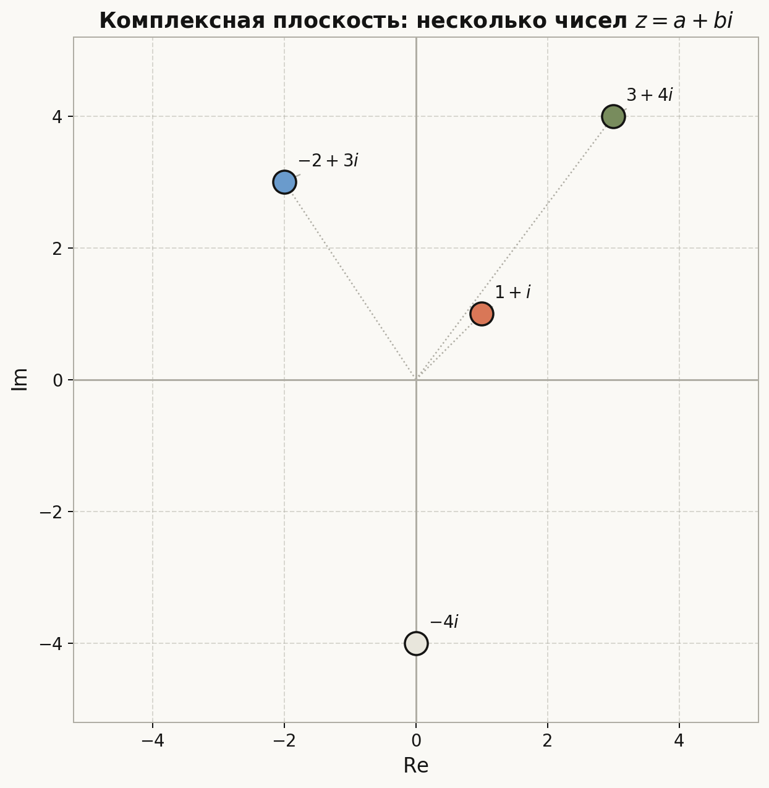
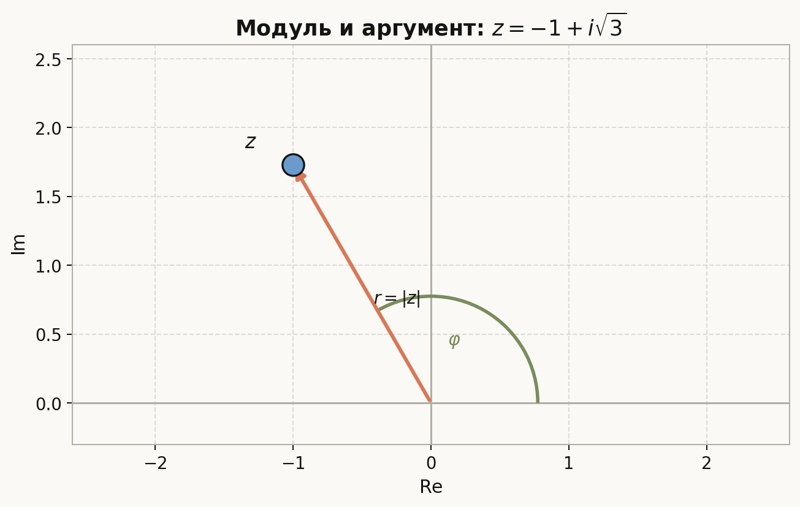
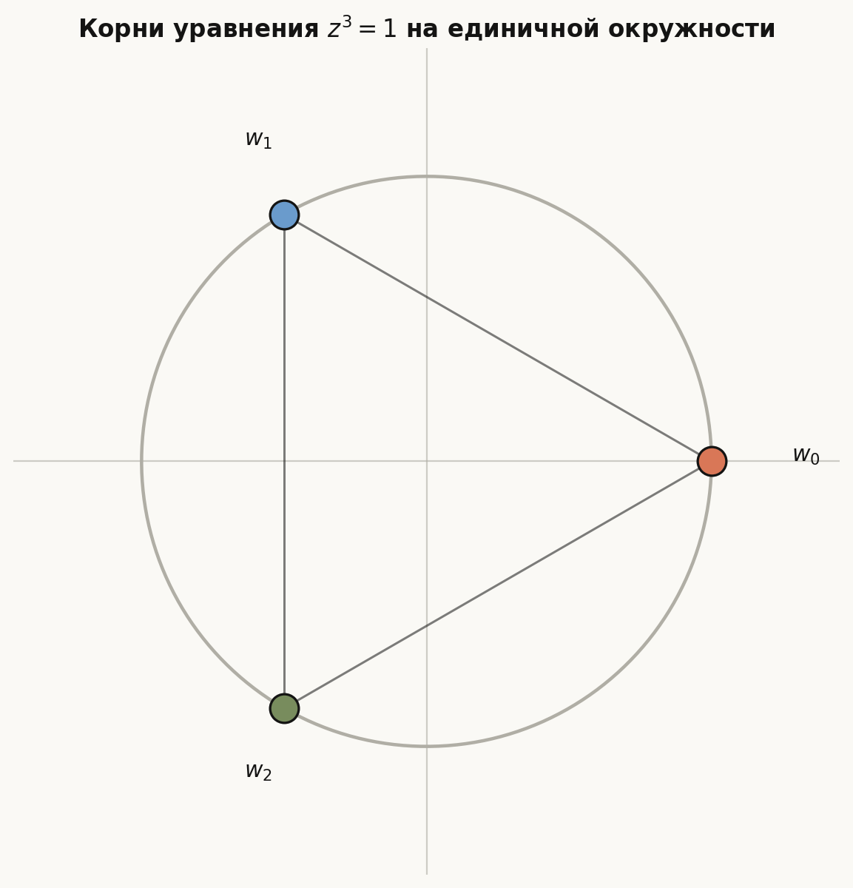
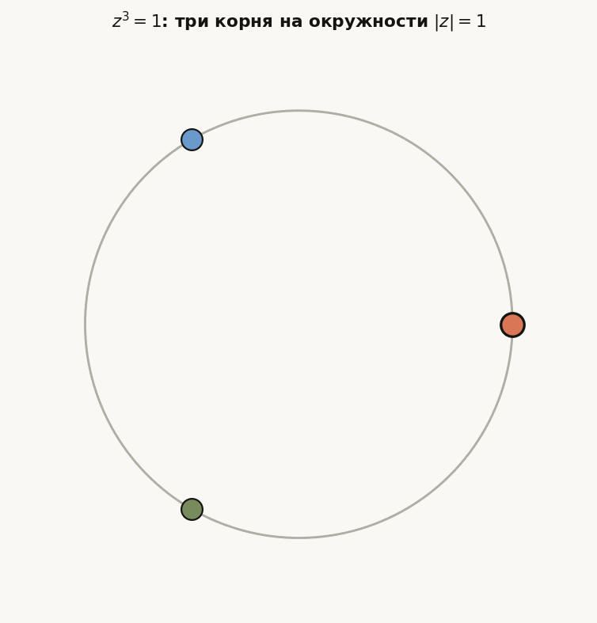
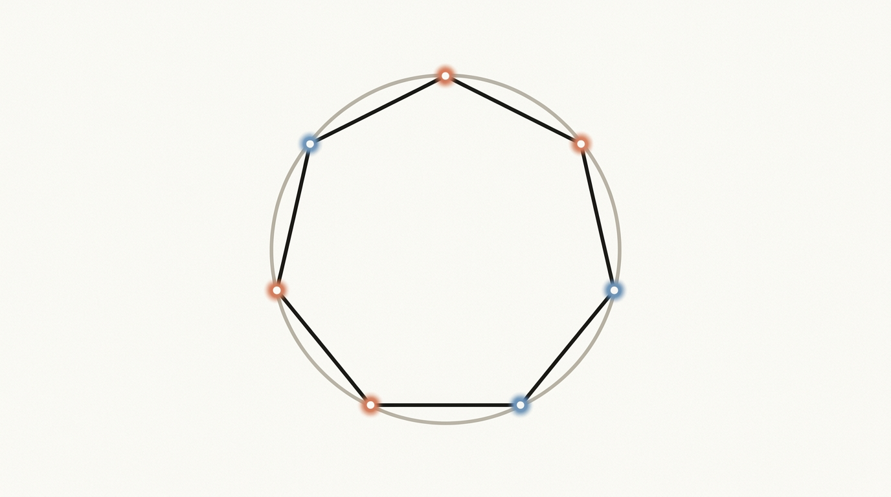

# Лекция: Комплексные числа

## 1. Зачем нужны комплексные числа

При решении уравнений вида

$$x^2+1=0$$

в множестве действительных чисел решения нет, потому что для любого действительного $x$ выполняется $x^2 \ge 0$, а значит $x^2=-1$ невозможно.

Чтобы сделать такие уравнения разрешимыми, вводят новое число $i$, для которого по определению

$$i^2=-1.$$

На основе этого строится множество **комплексных чисел**.

*Рис. 1. Визуальная метафора комплексной плоскости и фазы.*

---

## 2. Определение комплексного числа

Комплексным числом называется выражение вида

$$z=a+bi,$$

где:

- $a$ — действительная часть числа, $\operatorname{Re} z=a$;
- $b$ — мнимая часть числа, $\operatorname{Im} z=b$;
- $i$ — мнимая единица, $i^2=-1$.

### Примеры

- $3+2i$
- $-5-i$
- $4$ — это тоже комплексное число, у которого мнимая часть равна нулю
- $-7i$ — комплексное число с нулевой действительной частью

Если $a=0$, число называют **чисто мнимым**.  
Если $b=0$, число является **действительным**.

---

## 3. Равенство комплексных чисел

Два комплексных числа равны тогда и только тогда, когда равны их действительные и мнимые части:

$$a+bi=c+di \iff a=c \text{ и } b=d.$$

Например,

$$2-3i = x+yi \Rightarrow x=2,\ y=-3.$$

---

## 4. Действия над комплексными числами

Пусть

$$z_1=a+bi,\qquad z_2=c+di.$$

### Сложение

$$z_1+z_2=(a+c)+(b+d)i.$$

### Вычитание

$$z_1-z_2=(a-c)+(b-d)i.$$

### Умножение

$$z_1z_2=(a+bi)(c+di)=ac+adi+bci+bd i^2.$$

Так как $i^2=-1$, получаем

$$z_1z_2=(ac-bd)+(ad+bc)i.$$

### Деление

$$\frac{z_1}{z_2}=\frac{a+bi}{c+di}, \qquad z_2\ne 0.$$

Чтобы избавиться от мнимости в знаменателе, домножают числитель и знаменатель на число, сопряжённое знаменателю.

---

## 5. Сопряжённое комплексное число

Для числа

$$z=a+bi$$

сопряжённым называется число

$$\overline{z}=a-bi.$$

### Свойства сопряжения

- $$z\overline{z}=(a+bi)(a-bi)=a^2+b^2.$$
- $$\overline{z_1+z_2}=\overline{z_1}+\overline{z_2}.$$
- $$\overline{z_1z_2}=\overline{z_1}\,\overline{z_2}.$$

### Деление с помощью сопряжённого

$$\frac{a+bi}{c+di}=\frac{(a+bi)(c-di)}{(c+di)(c-di)}.$$

В знаменателе получаем

$$c^2+d^2,$$

поэтому

$$\frac{a+bi}{c+di}=\frac{(ac+bd)+(bc-ad)i}{c^2+d^2}.$$

---

## 6. Геометрическое изображение комплексных чисел

Каждому комплексному числу

$$z=a+bi$$

можно сопоставить точку на плоскости с координатами $(a,b)$.

Эта плоскость называется **комплексной плоскостью**:

- горизонтальная ось — действительная ось;
- вертикальная ось — мнимая ось.

Таким образом:

- числу $a+bi$ соответствует точка $(a,b)$;
- также его можно рассматривать как радиус-вектор из начала координат к точке $(a,b)$.

### Примеры

- $1+i$ — точка $(1,1)$
- $-2+3i$ — точка $(-2,3)$
- $-4i$ — точка $(0,-4)$

*Рис. 2. Действительная и мнимая оси; числа $a+bi$ как точки $(a,b)$.*

---

## 7. Модуль комплексного числа

Модулем комплексного числа $z=a+bi$ называется число

$$|z|=\sqrt{a^2+b^2}.$$

Геометрически это длина радиус-вектора, соединяющего начало координат с точкой $(a,b)$.

### Примеры

- Для $z=3+4i$:

$$|z|=\sqrt{3^2+4^2}=5.$$

- Для $z=-1+i$:

$$|z|=\sqrt{(-1)^2+1^2}=\sqrt{2}.$$

### Свойства модуля

- $$|z|\ge 0;$$
- $$|z|=0 \iff z=0;$$
- $$|z_1z_2|=|z_1||z_2|;$$
- $$\left|\frac{z_1}{z_2}\right|=\frac{|z_1|}{|z_2|}, \quad z_2\ne 0.$$

---

## 8. Аргумент комплексного числа

Для ненулевого комплексного числа $z=a+bi$ аргументом называется угол $\varphi$ между положительным направлением действительной оси и радиус-вектором числа.

Обозначают:

$$\arg z = \varphi.$$

Так как к одному и тому же направлению соответствуют углы, отличающиеся на $2\pi k$, то аргумент определён не единственным образом:

$$\arg z = \varphi + 2\pi k,\qquad k\in \mathbb{Z}.$$

Главное значение аргумента иногда обозначают как $\operatorname{Arg} z$.

### Связь с координатами

Если $z=a+bi$, $z\ne 0$, и $r=|z|$, то

$$\cos \varphi = \frac{a}{r},\qquad \sin \varphi = \frac{b}{r}.$$

*Рис. 3. Модуль $r=|z|$ и аргумент $\varphi$ на комплексной плоскости.*

---

## 9. Тригонометрическая форма комплексного числа

Пусть $z=a+bi$, $z\ne 0$. Тогда, если

$$r=|z|,\qquad \varphi=\arg z,$$

то число можно записать в виде

$$z=r(\cos \varphi+i\sin \varphi).$$

Это и есть **тригонометрическая форма** комплексного числа.

### Почему это верно

Так как

$$a=r\cos \varphi,\qquad b=r\sin \varphi,$$

то

$$z=a+bi=r\cos \varphi+i\,r\sin \varphi=r(\cos \varphi+i\sin \varphi).$$

### Пример

Пусть

$$z=1+i.$$

Тогда

$$r=|z|=\sqrt{2},$$

а аргумент можно взять

$$\varphi=\frac{\pi}{4}.$$

Следовательно,

$$z=\sqrt{2}\left(\cos \frac{\pi}{4}+i\sin \frac{\pi}{4}\right).$$

---

## 10. Переход от алгебраической формы к тригонометрической

Для числа

$$z=a+bi$$

нужно:

1. найти модуль:
   $$r=\sqrt{a^2+b^2};$$
2. найти аргумент $\varphi$ с учётом четверти;
3. записать:
   $$z=r(\cos \varphi+i\sin \varphi).$$

### Пример

Пусть

$$z=-1+i\sqrt{3}.$$

Тогда

$$r=\sqrt{(-1)^2+(\sqrt{3})^2}=\sqrt{1+3}=2.$$

Теперь найдём аргумент. Имеем

$$\cos \varphi=-\frac{1}{2},\qquad \sin \varphi=\frac{\sqrt{3}}{2}.$$

Это соответствует углу

$$\varphi=\frac{2\pi}{3}.$$

Следовательно,

$$z=2\left(\cos \frac{2\pi}{3}+i\sin \frac{2\pi}{3}\right).$$

---

## 11. Умножение и деление в тригонометрической форме

Пусть

$$z_1=r_1(\cos \varphi_1+i\sin \varphi_1),$$

$$z_2=r_2(\cos \varphi_2+i\sin \varphi_2).$$

Тогда:

### Умножение

$$z_1z_2=r_1r_2\left(\cos(\varphi_1+\varphi_2)+i\sin(\varphi_1+\varphi_2)\right).$$

То есть:

- модули перемножаются;
- аргументы складываются.

### Деление

$$\frac{z_1}{z_2}=\frac{r_1}{r_2}\left(\cos(\varphi_1-\varphi_2)+i\sin(\varphi_1-\varphi_2)\right), \qquad z_2\ne 0.$$

То есть:

- модули делятся;
- аргументы вычитаются.

---

## 12. Формула Муавра

Для любого натурального $n$:

$$\left(r(\cos \varphi+i\sin \varphi)\right)^n=r^n(\cos n\varphi+i\sin n\varphi).$$

В частности, если $r=1$, то

$$\left(\cos \varphi+i\sin \varphi\right)^n=\cos n\varphi+i\sin n\varphi.$$

Эта формула называется **формулой Муавра**.

## Пример

Вычислить

$$\left(\cos \frac{\pi}{6}+i\sin \frac{\pi}{6}\right)^3.$$

По формуле Муавра:

$$\left(\cos \frac{\pi}{6}+i\sin \frac{\pi}{6}\right)^3=\cos \frac{\pi}{2}+i\sin \frac{\pi}{2}=i.$$

---

## 13. Извлечение корня $n$-й степени из комплексного числа

Пусть нужно решить уравнение

$$w^n=z,$$

где

$$z=r(\cos \varphi+i\sin \varphi), \qquad r>0.$$

Ищем корни в виде

$$w=\rho(\cos \theta+i\sin \theta).$$

Тогда из равенства $w^n=z$ по формуле Муавра получаем:

- $$\rho^n=r,$$ значит
  $$\rho=\sqrt[n]{r};$$
- $$n\theta=\varphi+2\pi k,$$ откуда
  $$\theta=\frac{\varphi+2\pi k}{n}.$$

Следовательно, все корни имеют вид

$$
w_k=\sqrt[n]{r}\left(
\cos \frac{\varphi+2\pi k}{n}
+i\sin \frac{\varphi+2\pi k}{n}
\right),
$$

где

$$k=0,1,2,\dots,n-1.$$

### Важные свойства

- существует ровно $n$ различных корней;
- все они расположены на окружности радиуса $\sqrt[n]{r}$;
- соседние корни отличаются по аргументу на угол

$$\frac{2\pi}{n}.$$

То есть они являются вершинами правильного $n$-угольника.

---

## 14. Пример извлечения корня

Найти все корни уравнения

$$w^3=8.$$

Представим число $8$ в тригонометрической форме:

$$8=8(\cos 0+i\sin 0).$$

Тогда

$$\rho=\sqrt[3]{8}=2,$$

а аргументы корней:

$$\theta_k=\frac{0+2\pi k}{3},\qquad k=0,1,2.$$

Получаем:

- при $k=0$:
  $$w_0=2(\cos 0+i\sin 0)=2;$$
- при $k=1$:
  $$w_1=2\left(\cos \frac{2\pi}{3}+i\sin \frac{2\pi}{3}\right)=-1+i\sqrt{3};$$
- при $k=2$:
  $$w_2=2\left(\cos \frac{4\pi}{3}+i\sin \frac{4\pi}{3}\right)=-1-i\sqrt{3}.$$

---

## 15. Корни из единицы

**Корнями $n$-й степени из единицы** называются решения уравнения

$$z^n=1.$$

Так как

$$1=\cos 0+i\sin 0,$$

или в более общем виде

$$1=\cos 2\pi m+i\sin 2\pi m,\qquad m\in\mathbb{Z},$$

то все корни находятся по формуле:

$$
z_k=\cos \frac{2\pi k}{n}+i\sin \frac{2\pi k}{n},
\qquad k=0,1,2,\dots,n-1.
$$

### Свойства корней из единицы

- их ровно $n$;
- все они лежат на единичной окружности;
- они делят окружность на $n$ равных дуг;
- геометрически это вершины правильного $n$-угольника.

*Рис. 4. Три решения уравнения $z^3=1$ как вершины правильного треугольника.*

*Рис. 5. Те же корни $z^3=1$ наглядно на окружности $|z|=1$.*

*Рис. 6. Метафора равномерного распределения корней на единичной окружности.*

### Примеры

#### Корни второй степени из единицы

$$z^2=1$$

Решения:

$$z_0=1,\qquad z_1=-1.$$

#### Корни третьей степени из единицы

$$z^3=1$$

Решения:

$$z_0=1,$$

$$z_1=\cos \frac{2\pi}{3}+i\sin \frac{2\pi}{3}=-\frac{1}{2}+\frac{\sqrt{3}}{2}i,$$

$$z_2=\cos \frac{4\pi}{3}+i\sin \frac{4\pi}{3}=-\frac{1}{2}-\frac{\sqrt{3}}{2}i.$$

#### Корни четвёртой степени из единицы

$$z^4=1$$

Решения:

$$1,\ i,\ -1,\ -i.$$

---

## 16. Первообразные корни из единицы

Среди всех корней уравнения $z^n=1$ есть особые корни: **первообразные**.

Интуитивно это такие корни, из которых можно получить **все остальные корни** простым возведением в степень.

Иначе говоря, если $\zeta$ — первообразный корень, то числа

$$
\zeta,\ \zeta^2,\ \zeta^3,\ \dots,\ \zeta^n=1
$$

последовательно пробегают все $n$ различных корней из единицы и только после этого цикл замыкается.

### Формальное определение

Число $\zeta$ называется первообразным корнем $n$-й степени из единицы, если:

1. $\zeta^n=1$;
2. ни для какого меньшего натурального $m<n$ не выполняется $\zeta^m=1$.

То есть $1$ получается **впервые именно на $n$-м шаге**.

### Почему это удобно понимать именно так

Все корни уравнения $z^n=1$ имеют вид

$$
\zeta_k=e^{2\pi i k/n}
=\cos\frac{2\pi k}{n}+i\sin\frac{2\pi k}{n},
\quad k=0,1,\dots,n-1.
$$

Но не каждый из них является первообразным.

- Некоторые корни слишком рано возвращаются в $1$.
- Тогда их степени не успевают пройти все $n$ корней.
- Такие корни **не** являются первообразными.

### Как быстро проверить, первообразный корень или нет

Корень

$$
\zeta_k=e^{2\pi i k/n}
$$

является первообразным тогда и только тогда, когда числа $k$ и $n$ взаимно просты, то есть

$$
\gcd(k,n)=1.
$$

Здесь `gcd` — это НОД, наибольший общий делитель.

Например:

- $\gcd(1,6)=1$;
- $\gcd(5,6)=1$;
- $\gcd(2,6)=2$.

Значит для $n=6$ корни с $k=1$ и $k=5$ будут первообразными, а с $k=2$ — нет.

### Пример 1: корни четвёртой степени из единицы

Решаем уравнение

$$
z^4=1.
$$

Его корни:

$$
1,\ i,\ -1,\ -i.
$$

Проверим их:

- $i$ — первообразный, потому что
  $$i,\ i^2=-1,\ i^3=-i,\ i^4=1;$$
  здесь появились все 4 корня;
- $-i$ тоже первообразный;
- $-1$ не первообразный, потому что
  $$(-1)^2=1,$$
  то есть возврат к $1$ произошёл слишком рано;
- $1$ тоже не первообразный, так как
  $$1^1=1.$$

Итак, среди корней четвёртой степени из единицы первообразные: $i$ и $-i$.

### Пример 2: корни шестой степени из единицы

Все корни имеют вид

$$
\zeta_k=e^{2\pi i k/6},\qquad k=0,1,2,3,4,5.
$$

Первообразные соответствуют тем $k$, которые взаимно просты с $6$:

$$
k=1,\ 5.
$$

Значит первообразные корни:

$$
e^{2\pi i/6}
\quad \text{и} \quad
e^{10\pi i/6}=e^{5\pi i/3}.
$$

Остальные корни не являются первообразными, потому что их степени возвращаются к $1$ раньше.

### Сколько первообразных корней бывает

Число первообразных корней $n$-й степени из единицы равно

$$
\varphi(n),
$$

где $\varphi(n)$ — функция Эйлера, то есть количество чисел от $1$ до $n$, взаимно простых с $n$.

Например:

- $\varphi(4)=2$, поэтому первообразных корней четвёртой степени ровно 2;
- $\varphi(6)=2$, поэтому первообразных корней шестой степени тоже ровно 2.

### Главное, что нужно запомнить

- первообразный корень — это корень из единицы, степени которого порождают все остальные корни;
- для корней вида $\zeta_k=e^{2\pi i k/n}$ нужно проверять условие
  $$\gcd(k,n)=1;$$
- если НОД не равен $1$, то корень не первообразный.

---

## 17. Геометрический смысл операций

### Сложение

Сложение комплексных чисел соответствует сложению векторов на плоскости.

### Умножение

Если числа заданы в тригонометрической форме, то умножение означает:

- растяжение в $r_2$ раз по модулю;
- поворот на угол $\varphi_2$.

То есть умножение на комплексное число геометрически сочетает масштабирование и поворот.

### Умножение на $i$

Так как

$$i=\cos \frac{\pi}{2}+i\sin \frac{\pi}{2},$$

умножение на $i$ поворачивает любой вектор на угол $\frac{\pi}{2}$ против часовой стрелки.

---

## 18. Краткий алгоритм решения типовых задач

### 1. Перевести число в тригонометрическую форму

- найти $r=\sqrt{a^2+b^2}$;
- определить аргумент $\varphi$;
- записать $z=r(\cos\varphi+i\sin\varphi)$.

### 2. Возвести в степень

- воспользоваться формулой Муавра:
  $$z^n=r^n(\cos n\varphi+i\sin n\varphi).$$

### 3. Извлечь корень $n$-й степени

- вычислить $\sqrt[n]{r}$;
- найти аргументы
  $$\frac{\varphi+2\pi k}{n},\quad k=0,\dots,n-1;$$
- записать все $n$ корней.

### 4. Найти корни из единицы

- использовать формулу
  $$z_k=\cos \frac{2\pi k}{n}+i\sin \frac{2\pi k}{n},\quad k=0,\dots,n-1.$$

---

## 19. Итоги

Комплексные числа — это расширение множества действительных чисел, позволяющее решать уравнения, неразрешимые в $\mathbb{R}$.

Основные идеи темы:

- комплексное число имеет вид $z=a+bi$;
- на плоскости оно изображается точкой $(a,b)$;
- модуль и аргумент позволяют перейти к тригонометрической форме:
  $$z=r(\cos\varphi+i\sin\varphi);$$
- в тригонометрической форме удобно умножать, делить, возводить в степень и извлекать корни;
- корни из единицы имеют особенно простой и красивый геометрический смысл: это вершины правильного $n$-угольника на единичной окружности.

---

