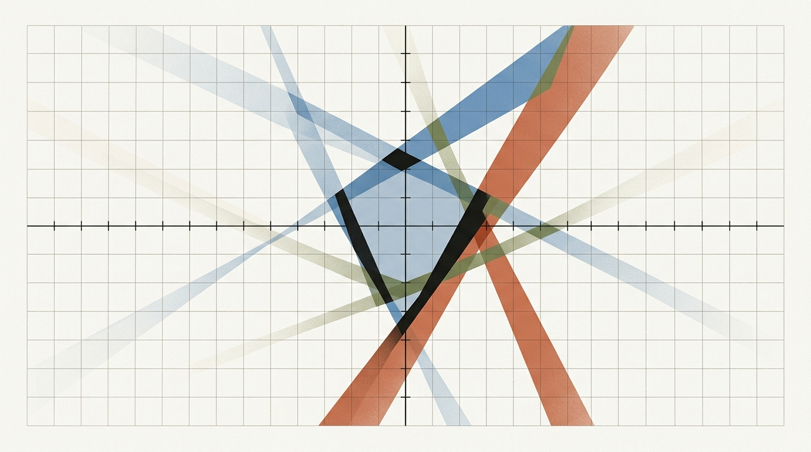
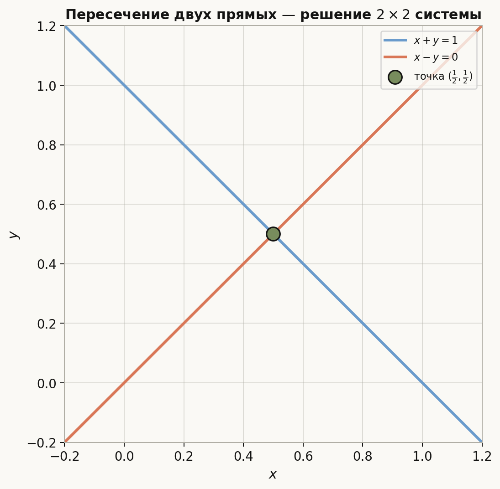
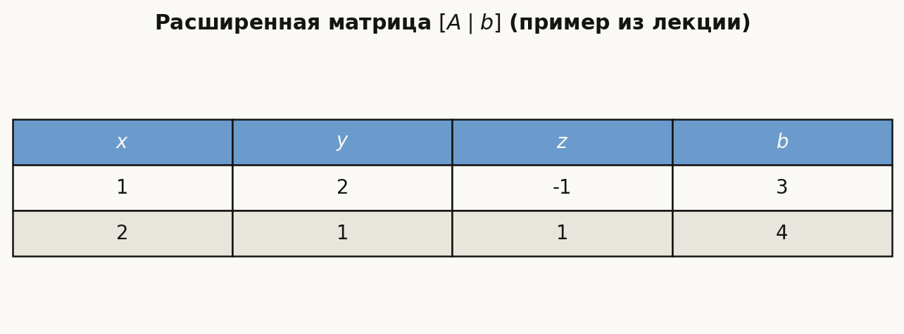
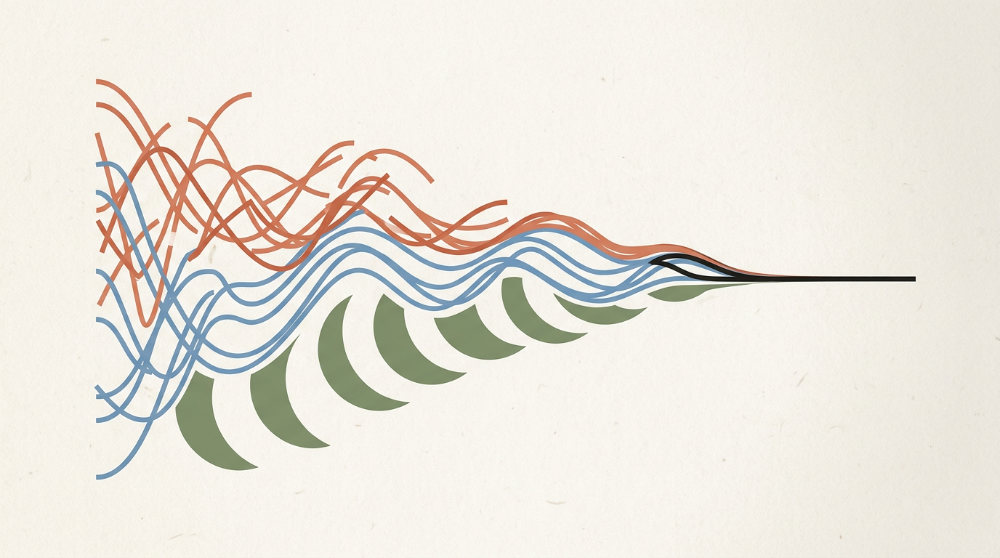
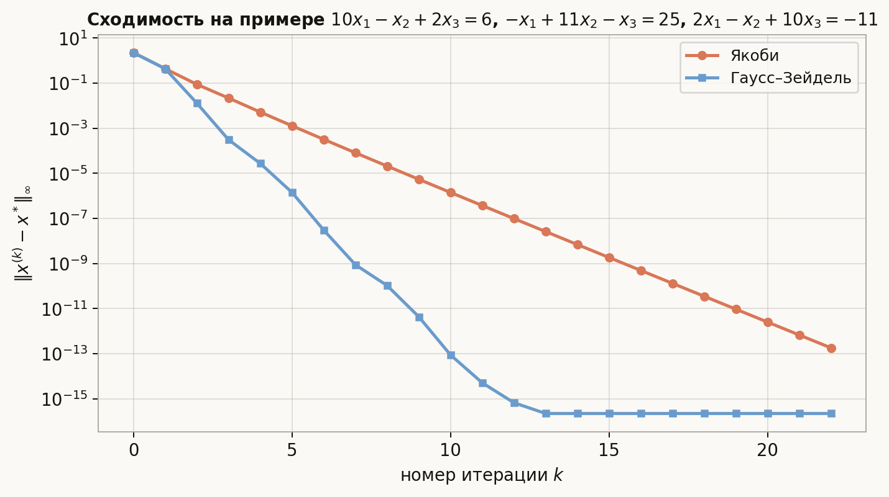
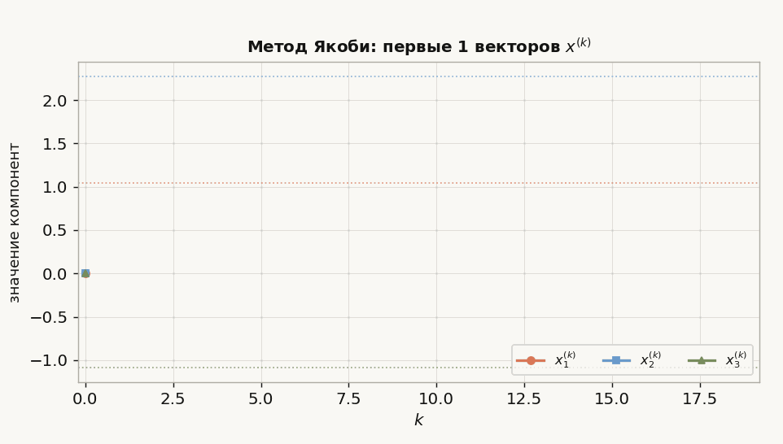

# Лекция: системы линейных уравнений, прямоугольные матрицы, ступенчатый вид, метод Гаусса, методы Якоби и Гаусса–Зейделя

## План лекции

1. Системы линейных уравнений и матричная запись  
2. Прямоугольные матрицы и геометрический смысл  
3. Элементарные преобразования строк  
4. Ступенчатый и приведённый ступенчатый вид  
5. Метод Гаусса  
6. Ранг матрицы и число решений  
7. Численные методы решения СЛАУ  
8. Метод Якоби  
9. Метод Гаусса–Зейделя  
10. Условия сходимости и сравнение методов  
11. Примеры

После первых двух лекций у нас есть два базовых навыка: аккуратно работать с операциями и записывать объекты координатами. Теперь эти навыки соединяются в линейной алгебре: система уравнений превращается в матрицу, а решение становится задачей о преобразовании строк без изменения множества решений.

Как читать эту длинную лекцию:

- разделы 1--7 — точное решение систем методом Гаусса;
- разделы 8--14 — прямоугольные системы, ранг и вычислительные аспекты;
- разделы 15--20 — итерационные методы Якоби и Гаусса--Зейделя;
- разделы 21--24 — сравнение методов, короткий алгоритмический конспект и итог.

*Рис. 1. Общая геометрическая идея лекции: линейные ограничения, матричная структура и выделенная точка решения.*

---

## 1. Системы линейных уравнений

Система линейных уравнений с $m$ уравнениями и $n$ неизвестными имеет вид

$$
\begin{cases}
a_{11}x_1 + a_{12}x_2 + \dots + a_{1n}x_n = b_1, \\
a_{21}x_1 + a_{22}x_2 + \dots + a_{2n}x_n = b_2, \\
\vdots \\
a_{m1}x_1 + a_{m2}x_2 + \dots + a_{mn}x_n = b_m.
\end{cases}
$$

В матричной форме это записывается как

$$
Ax = b,
$$

где:

- $A \in \mathbb{R}^{m \times n}$ — матрица коэффициентов,
- $x \in \mathbb{R}^n$ — вектор неизвестных,
- $b \in \mathbb{R}^m$ — вектор правой части.

### Важные случаи

- Если $m = n$, матрица $A$ квадратная.
- Если $m \ne n$, матрица прямоугольная.
- Если $b = 0$, система называется однородной:
  
$$
Ax = 0.
$$

Однородная система всегда имеет тривиальное решение $x = 0$.

---

## 2. Прямоугольные матрицы

Прямоугольная матрица — это матрица размера $m \times n$, где $m$ и $n$ не обязаны совпадать.

Примеры:

- $A \in \mathbb{R}^{3 \times 5}$ — 3 уравнения, 5 неизвестных;
- $A \in \mathbb{R}^{5 \times 3}$ — 5 уравнений, 3 неизвестных.

### Интерпретация

Матрица $A$ задаёт линейное отображение

$$
A: \mathbb{R}^n \to \mathbb{R}^m.
$$

Это важно:

- число столбцов $n$ — размерность пространства неизвестных;
- число строк $m$ — размерность пространства значений.

*Рис. 2. Геометрическая иллюстрация (пример с двумя уравнениями и двумя неизвестными).*

### Возможные ситуации

#### Недоопределённая система: $m < n$

Неизвестных больше, чем уравнений.  
Обычно либо решений бесконечно много, либо система несовместна.

#### Переопределённая система: $m > n$

Уравнений больше, чем неизвестных.  
Обычно система может быть несовместной, но при наличии зависимых уравнений решения могут существовать.

---

## 3. Расширенная матрица системы

Для системы $Ax=b$ вводят расширенную матрицу:

$$
[A \mid b].
$$

Например, система

$$
\begin{cases}
x + 2y - z = 3, \\
2x + y + z = 4
\end{cases}
$$

имеет расширенную матрицу

$$
\left[
\begin{array}{ccc|c}
1 & 2 & -1 & 3 \\
2 & 1 & 1 & 4
\end{array}
\right].
$$

Работать с системой удобно именно через расширенную матрицу.

*Рис. 3. Расширенная матрица $[A \mid b]$ в компактном виде.*

---

## 4. Элементарные преобразования строк

Основной инструмент метода Гаусса — элементарные преобразования строк. Они не меняют множество решений системы.

Допустимы три типа преобразований:

1. Перестановка двух строк.
2. Умножение строки на ненулевое число.
3. Прибавление к одной строке другой строки, умноженной на число.

Обозначения:

- $R_i \leftrightarrow R_j$
- $R_i \gets \lambda R_i$, где $\lambda \ne 0$
- $R_i \gets R_i + \lambda R_j$

### Почему это корректно?

Потому что каждое уравнение заменяется эквивалентным преобразованием системы.  
Например, если ко второму уравнению прибавить первое, умноженное на число, множество решений не изменится.

---

## 5. Ступенчатый вид матрицы

### Определение

Матрица находится в **ступенчатом виде**, если:

1. Все нулевые строки находятся внизу.
2. Первый ненулевой элемент каждой ненулевой строки расположен правее первого ненулевого элемента предыдущей строки.
3. Все элементы ниже каждого ведущего элемента равны нулю.

Первый ненулевой элемент строки называется **ведущим элементом** или **пивотом**.

Пример ступенчатой матрицы:

$$
\begin{pmatrix}
1 & 2 & 0 & 3 \\
0 & 1 & -4 & 2 \\
0 & 0 & 5 & -1 \\
0 & 0 & 0 & 0
\end{pmatrix}
$$

### Приведённый ступенчатый вид

Матрица находится в **приведённом ступенчатом виде**, если дополнительно:

1. Каждый ведущий элемент равен 1.
2. В столбце ведущего элемента все остальные элементы равны нулю.

Пример:

$$
\begin{pmatrix}
1 & 0 & 0 & 2 \\
0 & 1 & 0 & -1 \\
0 & 0 & 1 & 3 \\
0 & 0 & 0 & 0
\end{pmatrix}
$$

Такой вид особенно удобен для явного выписывания решений.

---

## 6. Метод Гаусса

Метод Гаусса — это алгоритм решения системы линейных уравнений путём последовательного исключения переменных.

Он состоит из двух стадий:

- **прямой ход**: приведение системы к ступенчатому виду;
- **обратный ход**: восстановление неизвестных снизу вверх.

---

## 7. Пример метода Гаусса

Решим систему

$$
\begin{cases}
x + y + z = 6, \\
2x - y + z = 3, \\
x + 2y - z = 3.
\end{cases}
$$

Расширенная матрица:

$$
\left[
\begin{array}{ccc|c}
1 & 1 & 1 & 6 \\
2 & -1 & 1 & 3 \\
1 & 2 & -1 & 3
\end{array}
\right]
$$

### Прямой ход

Обнулим элементы под первым ведущим элементом:

- $R_2 \gets R_2 - 2R_1$
- $R_3 \gets R_3 - R_1$

Получим

$$
\left[
\begin{array}{ccc|c}
1 & 1 & 1 & 6 \\
0 & -3 & -1 & -9 \\
0 & 1 & -2 & -3
\end{array}
\right]
$$

Теперь обнулим элемент под вторым ведущим элементом. Удобно сначала переставить строки:

- $R_2 \leftrightarrow R_3$

$$
\left[
\begin{array}{ccc|c}
1 & 1 & 1 & 6 \\
0 & 1 & -2 & -3 \\
0 & -3 & -1 & -9
\end{array}
\right]
$$

Теперь:

- $R_3 \gets R_3 + 3R_2$

$$
\left[
\begin{array}{ccc|c}
1 & 1 & 1 & 6 \\
0 & 1 & -2 & -3 \\
0 & 0 & -7 & -18
\end{array}
\right]
$$

Ступенчатый вид получен.

### Обратный ход

Из третьей строки:

$$
-7z = -18 \Rightarrow z = \frac{18}{7}.
$$

Из второй строки:

$$
y - 2z = -3 \Rightarrow y = -3 + 2\cdot \frac{18}{7} = \frac{15}{7}.
$$

Из первой строки:

$$
x + y + z = 6 \Rightarrow x = 6 - \frac{15}{7} - \frac{18}{7} = \frac{9}{7}.
$$

### Ответ

$$
x = \frac{9}{7}, \quad y = \frac{15}{7}, \quad z = \frac{18}{7}.
$$

---

## 8. Когда система имеет решение?

После приведения расширенной матрицы $[A \mid b]$ к ступенчатому виду возможны три случая.

### 1. Единственное решение

Если число ведущих элементов равно числу неизвестных.

### 2. Бесконечно много решений

Если есть свободные переменные, то есть число ведущих элементов меньше числа неизвестных, но противоречия нет.

### 3. Решений нет

Если появляется строка вида

$$
0x_1 + 0x_2 + \dots + 0x_n = c, \quad c \ne 0.
$$

То есть в матричном виде:

$$
\left[
\begin{array}{cccc|c}
0 & 0 & \dots & 0 & c
\end{array}
\right], \quad c \ne 0.
$$

Это противоречие, система несовместна.

---

## 9. Ранг матрицы

### Определение

**Рангом** матрицы называется число ведущих элементов в её ступенчатом виде, то есть число линейно независимых строк или столбцов.

Обозначается:

$$
\operatorname{rank}(A).
$$

### Критерий совместности

Система $Ax = b$ совместна тогда и только тогда, когда

$$
\operatorname{rank}(A) = \operatorname{rank}([A \mid b]).
$$

### Число решений

Если система совместна, то:

- при $\operatorname{rank}(A) = n$ решение единственно;
- при $\operatorname{rank}(A) < n$ есть свободные переменные и бесконечно много решений.

Здесь $n$ — число неизвестных.

---

## 10. Однородные системы

Для однородной системы

$$
Ax = 0
$$

всегда существует нулевое решение.

Если

$$
\operatorname{rank}(A) < n,
$$

то существуют и ненулевые решения.  
Их множество образует линейное подпространство размерности

$$
n - \operatorname{rank}(A).
$$

Это число называют **размерностью пространства решений** или **числом степеней свободы**.

---

## 11. Метод Гаусса для прямоугольных матриц

Метод Гаусса применяется не только к квадратным, но и к прямоугольным матрицам.

### Случай $m < n$

Переменных больше, чем уравнений. После исключения обычно остаются свободные переменные.

Пример:

$$
\begin{cases}
x_1 + x_2 + x_3 = 1, \\
2x_1 + 2x_2 + 2x_3 = 2.
\end{cases}
$$

Второе уравнение зависит от первого, значит фактически одно независимое уравнение:

$$
x_1 + x_2 + x_3 = 1.
$$

Можно выразить:

$$
x_1 = 1 - x_2 - x_3.
$$

Здесь $x_2$ и $x_3$ — свободные переменные.

### Случай $m > n$

Уравнений больше, чем неизвестных. Возможна несовместность.

Пример:

$$
\begin{cases}
x + y = 1, \\
x - y = 0, \\
2x = 1.
\end{cases}
$$

Такая система может оказаться как совместной, так и несовместной — это выясняется методом Гаусса.

---

## 12. Вычислительные аспекты метода Гаусса

Для квадратной системы размера $n \times n$ метод Гаусса требует порядка

$$
O(n^3)
$$

арифметических операций.

Это точный и универсальный метод для систем умеренного размера, но для очень больших разреженных систем часто используют итерационные методы.

### Выбор главного элемента

На практике важно избегать деления на очень маленькие числа. Поэтому применяют **частичный выбор главного элемента**:

- на текущем шаге выбирают строку, где в текущем столбце максимальный по модулю элемент;
- затем меняют её местами с текущей строкой.

Это повышает численную устойчивость алгоритма.

---

## 13. Итерационные методы решения СЛАУ

Для большой системы

$$
Ax = b
$$

часто используют итерационные методы: строится последовательность приближений

$$
x^{(0)}, x^{(1)}, x^{(2)}, \dots
$$

такая, что

$$
x^{(k)} \to x^*
$$

при $k \to \infty$, где $x^*$ — точное решение.

Преимущества:

- удобны для больших систем;
- хорошо работают с разреженными матрицами;
- можно остановиться, когда достигнута нужная точность.

Недостатки:

- не всегда сходятся;
- скорость сходимости зависит от матрицы.

*Рис. 4. Последовательности приближений Якоби и Гаусса-Зейделя стремятся к одной и той же точке решения.*

---

## 14. Разложение матрицы для итерационных методов

Пусть

$$
A = D + L + U,
$$

где:

- $D$ — диагональная часть матрицы,
- $L$ — нижняя треугольная часть без диагонали,
- $U$ — верхняя треугольная часть без диагонали.

То есть

$$
D = \operatorname{diag}(a_{11}, \dots, a_{nn}).
$$

---

## 15. Метод Якоби

### Идея

Из $i$-го уравнения системы

$$
a_{ii}x_i + \sum_{j \ne i} a_{ij}x_j = b_i
$$

выражаем $x_i$:

$$
x_i = \frac{1}{a_{ii}}\left(b_i - \sum_{j \ne i} a_{ij}x_j\right).
$$

Тогда итерационный процесс Якоби задаётся формулой

$$
x_i^{(k+1)} =
\frac{1}{a_{ii}}
\left(
b_i - \sum_{j \ne i} a_{ij}x_j^{(k)}
\right),
\quad i = 1,\dots,n.
$$

Главная особенность: все компоненты нового вектора $x^{(k+1)}$ вычисляются только через старый вектор $x^{(k)}$.

### Матричная форма

$$
x^{(k+1)} = -D^{-1}(L+U)x^{(k)} + D^{-1}b.
$$

Итерационная матрица:

$$
B_J = -D^{-1}(L+U).
$$

---

## 16. Пример метода Якоби

Рассмотрим систему

$$
\begin{cases}
10x_1 - x_2 + 2x_3 = 6, \\
-x_1 + 11x_2 - x_3 = 25, \\
2x_1 - x_2 + 10x_3 = -11.
\end{cases}
$$

Выразим переменные:

$$
x_1 = \frac{6 + x_2 - 2x_3}{10},
$$

$$
x_2 = \frac{25 + x_1 + x_3}{11},
$$

$$
x_3 = \frac{-11 - 2x_1 + x_2}{10}.
$$

Возьмём начальное приближение

$$
x^{(0)} = (0,0,0)^T.
$$

Тогда:

### Первая итерация

$$
x_1^{(1)} = \frac{6}{10} = 0.6,
$$

$$
x_2^{(1)} = \frac{25}{11} \approx 2.2727,
$$

$$
x_3^{(1)} = \frac{-11}{10} = -1.1.
$$

То есть

$$
x^{(1)} \approx (0.6,\, 2.2727,\, -1.1)^T.
$$

### Вторая итерация

$$
x_1^{(2)} = \frac{6 + 2.2727 - 2(-1.1)}{10} = \frac{10.4727}{10} \approx 1.0473,
$$

$$
x_2^{(2)} = \frac{25 + 0.6 - 1.1}{11} = \frac{24.5}{11} \approx 2.2273,
$$

$$
x_3^{(2)} = \frac{-11 - 2\cdot 0.6 + 2.2727}{10} = \frac{-9.9273}{10} \approx -0.9927.
$$

И так далее. Последовательность сходится к решению.

*Рис. 5. Норма ошибки $\|x^{(k)}-x^*\|_\infty$: тот же пример, те же начальные данные.*

*Рис. 6. Метод Якоби: как с ростом $k$ приближаются $x_1,x_2,x_3$ к точному решению.*

---

## 17. Метод Гаусса–Зейделя

Метод Гаусса–Зейделя похож на метод Якоби, но использует уже вычисленные на текущей итерации значения.

### Формула

$$
\begin{aligned}
x_i^{(k+1)} &= \frac{1}{a_{ii}}\Biggl(
b_i - \sum_{j=1}^{i-1} a_{ij}x_j^{(k+1)} - \sum_{j=i+1}^{n} a_{ij}x_j^{(k)}
\Biggr).
\end{aligned}
$$

То есть:

- для компонент с индексами меньше $i$ берутся уже новые значения,
- для компонент с индексами больше $i$ — старые значения.

### Матричная форма

$$
(D+L)x^{(k+1)} = -Ux^{(k)} + b,
$$

откуда

$$
x^{(k+1)} = -(D+L)^{-1}Ux^{(k)} + (D+L)^{-1}b.
$$

Итерационная матрица:

$$
B_{GS} = -(D+L)^{-1}U.
$$

---

## 18. Пример метода Гаусса–Зейделя

Возьмём ту же систему и начальное приближение:

$$
x^{(0)} = (0,0,0)^T.
$$

### Первая итерация

Сначала вычисляем $x_1^{(1)}$:

$$
x_1^{(1)} = \frac{6 + x_2^{(0)} - 2x_3^{(0)}}{10} = 0.6.
$$

Далее используем уже новое $x_1^{(1)}$:

$$
x_2^{(1)} = \frac{25 + x_1^{(1)} + x_3^{(0)}}{11}
= \frac{25.6}{11}
\approx 2.3273.
$$

Теперь используем новые $x_1^{(1)}$ и $x_2^{(1)}$:

$$
x_3^{(1)} = \frac{-11 - 2x_1^{(1)} + x_2^{(1)}}{10}
= \frac{-11 - 1.2 + 2.3273}{10}
\approx -0.9873.
$$

Получаем

$$
x^{(1)} \approx (0.6,\, 2.3273,\, -0.9873)^T.
$$

Обычно этот метод сходится быстрее, чем Якоби.

---

## 19. Условия сходимости

Итерационный метод

$$
x^{(k+1)} = Bx^{(k)} + c
$$

сходится для любого начального приближения тогда и только тогда, когда спектральный радиус матрицы $B$ удовлетворяет условию

$$
\rho(B) < 1.
$$

Здесь

$$
\rho(B) = \max_i |\lambda_i(B)|.
$$

Числа $\lambda_i(B)$ здесь называются собственными значениями матрицы $B$. Подробно они будут изучаться позже; в этой лекции достаточно понимать смысл условия: ошибка на каждом шаге умножается на матрицу $B$, и метод сходится, когда все независимые направления ошибки сжимаются по модулю.

Однако на практике это условие трудно проверять напрямую, поэтому используют более простые достаточные условия.

### Достаточное условие: диагональное преобладание

Если для всех $i$

$$
|a_{ii}| > \sum_{j \ne i} |a_{ij}|,
$$

то методы Якоби и Гаусса–Зейделя сходятся.

### Ещё один важный случай

Если матрица $A$ симметрична и положительно определена, то метод Гаусса–Зейделя сходится.

---

## 20. Критерии остановки итераций

На практике итерации останавливают, когда выполнено одно из условий:

### По разности соседних приближений

$$
\|x^{(k+1)} - x^{(k)}\| < \varepsilon.
$$

### По невязке

$$
\|Ax^{(k)} - b\| < \varepsilon.
$$

Обычно критерий по невязке надёжнее, потому что малое изменение между итерациями ещё не гарантирует близость к решению.

---

## 21. Сравнение методов

| Метод | Тип | Плюсы | Минусы |
|---|---|---|---|
| Метод Гаусса | Прямой | Даёт точное решение с учётом округления, универсален | $O(n^3)$, менее удобен для очень больших разреженных систем |
| Метод Якоби | Итерационный | Очень прост, легко распараллеливается | Может сходиться медленно или не сходиться |
| Метод Гаусса–Зейделя | Итерационный | Часто быстрее Якоби | Хуже распараллеливается, тоже не всегда сходится |

---

## 22. Связь с линейной алгеброй

Все рассмотренные методы опираются на фундаментальные понятия:

- линейная зависимость строк и столбцов;
- ранг матрицы;
- базис пространства решений;
- линейные отображения;
- разложение матриц.

Метод Гаусса не просто алгоритм вычисления — это способ исследовать структуру линейной системы.

---

## 23. Короткий алгоритмический конспект

<strong>Развернуть краткие шаги методов</strong>

### Метод Гаусса

1. Записать расширенную матрицу $[A \mid b]$.
2. На каждом столбце выбрать ведущий элемент.
3. Обнулить элементы ниже него.
4. Повторять до получения ступенчатого вида.
5. Проверить наличие противоречивых строк.
6. Выполнить обратный ход.

### Метод Якоби

1. Выразить каждую переменную через остальные.
2. Выбрать начальное приближение $x^{(0)}$.
3. На шаге $k+1$ все новые координаты вычислять только из $x^{(k)}$.
4. Повторять до выполнения критерия остановки.

### Метод Гаусса–Зейделя

1. Аналогично выбрать начальное приближение.
2. При вычислении $x_i^{(k+1)}$ сразу использовать уже найденные на этой итерации значения.
3. Повторять до достижения нужной точности.

---

## 24. Итоги

### Главное, что нужно запомнить

- Система линейных уравнений записывается как $Ax=b$.
- Метод Гаусса приводит систему к ступенчатому виду с помощью элементарных преобразований строк.
- Для прямоугольных матриц возможны:
  - отсутствие решений,
  - единственное решение,
  - бесконечно много решений.
- Критерий совместности:
  
$$
\operatorname{rank}(A)=\operatorname{rank}([A \mid b]).
$$

- Метод Якоби использует только значения предыдущей итерации.
- Метод Гаусса–Зейделя использует новые значения сразу и обычно работает быстрее.
- Диагональное преобладание — важное достаточное условие сходимости итерационных методов.

---

## 25. Вопросы для самопроверки

1. Что такое расширенная матрица системы?
2. Какие преобразования строк являются элементарными?
3. Чем ступенчатый вид отличается от приведённого ступенчатого?
4. Как по ступенчатому виду понять, совместна ли система?
5. Что такое ранг матрицы?
6. В чём разница между методами Якоби и Гаусса–Зейделя?
7. Почему диагональное преобладание полезно для итерационных методов?
8. Почему метод Гаусса–Зейделя обычно сходится быстрее метода Якоби?
