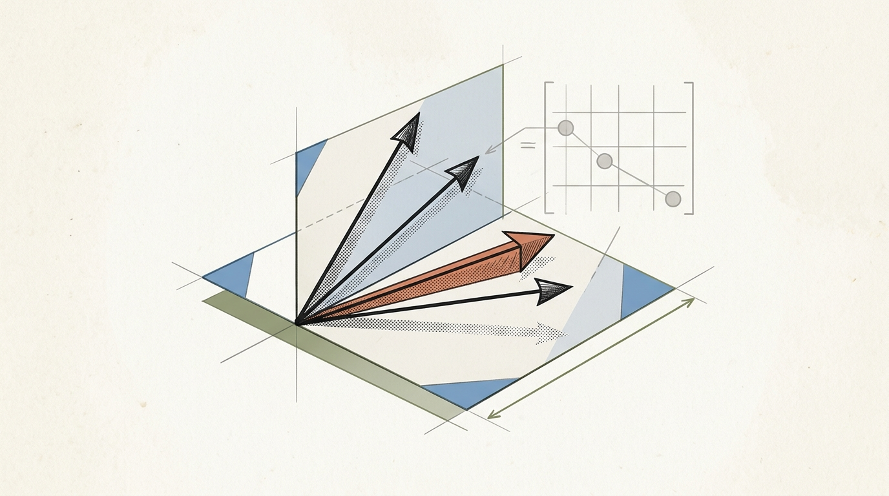
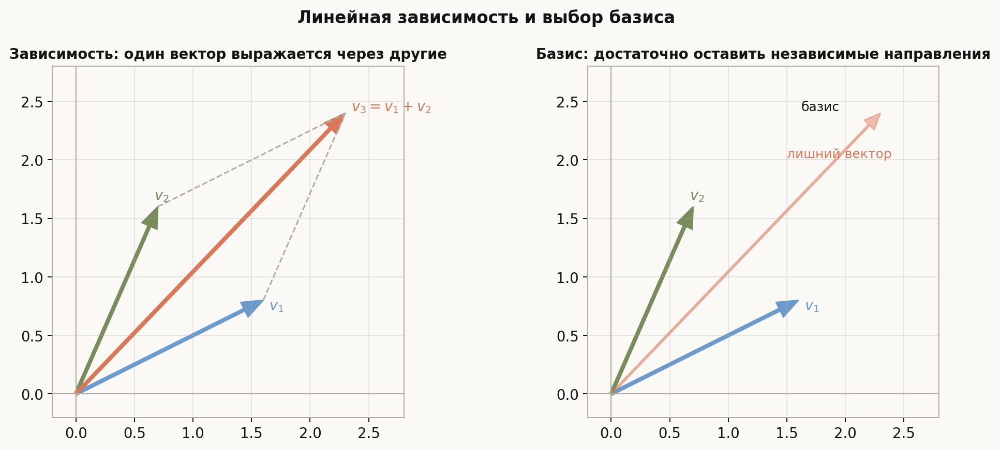
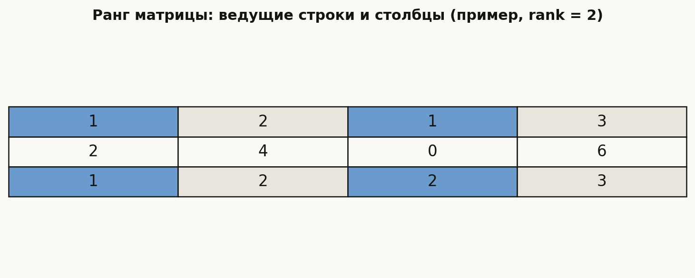
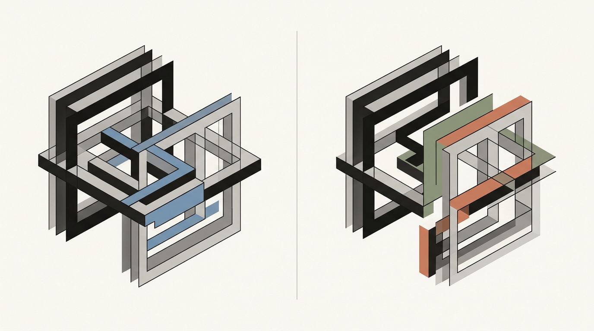
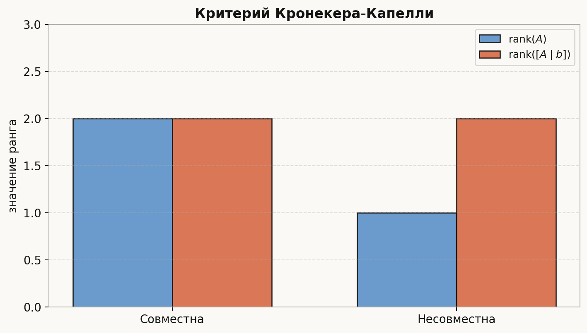
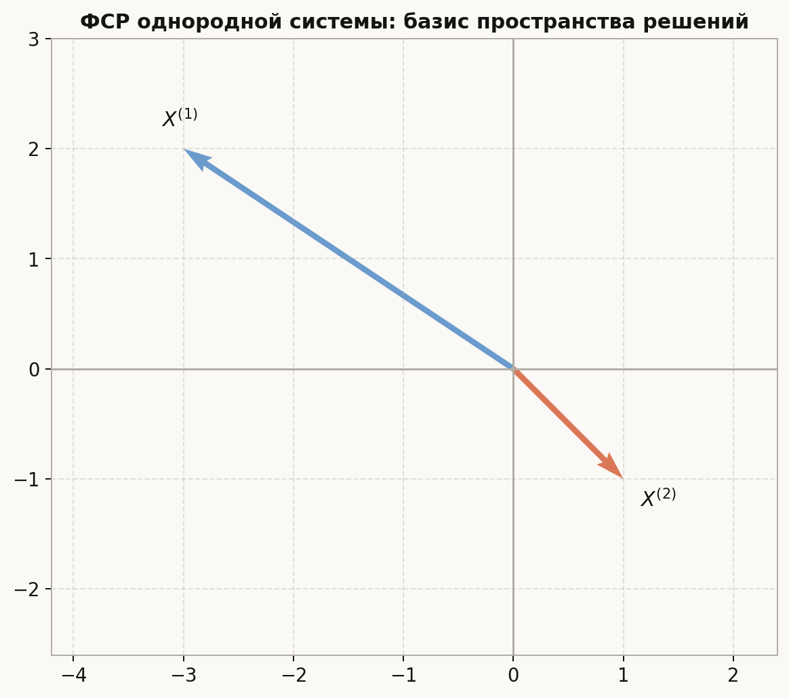
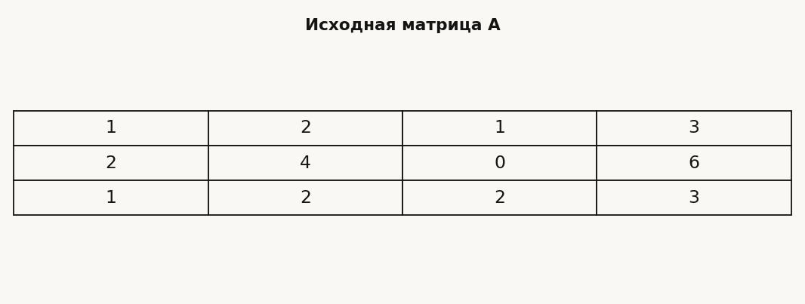

# Лекция: линейная зависимость и ранг. Базис, ранг матрицы, критерий Кронекера–Капелли, фундаментальная система решений

## План

1. Линейная зависимость и независимость векторов  
2. Линейная зависимость строк и столбцов матрицы  
3. Основная лемма о линейной зависимости  
4. Базис системы векторов  
5. Ранг системы строк и столбцов  
6. Ранг матрицы и равенство строчного и столбцового рангов  
7. Критерий совместности системы линейных уравнений  
8. Критерий единственности решения  
9. Однородные системы  
10. Фундаментальная система решений  
11. Алгоритм построения ФСР  
12. Примеры и задачи на понимание

В предыдущей лекции метод Гаусса был способом решать системы. Теперь мы смотрим на тот же процесс глубже: элементарные преобразования показывают, сколько в системе действительно независимой информации. Это число и называется рангом.

Главная линия лекции:

$$
\text{линейная зависимость}
\longrightarrow
\text{базис}
\longrightarrow
\text{ранг}
\longrightarrow
\text{число решений СЛАУ}.
$$

---

## 1. Линейная зависимость и независимость

Пусть даны векторы
$$
v_1, v_2, \dots, v_k
$$
в некотором линейном пространстве, например в $\mathbb{R}^n$.

### Определение

Векторы называются **линейно зависимыми**, если существуют такие числа
$$
\alpha_1, \alpha_2, \dots, \alpha_k,
$$
не все равные нулю, что
$$
\alpha_1 v_1 + \alpha_2 v_2 + \dots + \alpha_k v_k = 0.
$$

Если из равенства
$$
\alpha_1 v_1 + \dots + \alpha_k v_k = 0
$$
следует
$$
\alpha_1 = \alpha_2 = \dots = \alpha_k = 0,
$$
то векторы называются **линейно независимыми**.

### Интуитивный смысл

Линейная зависимость означает, что хотя бы один из векторов можно выразить через остальные.

Например, если
$$
v_3 = 2v_1 - v_2,
$$
то
$$
2v_1 - v_2 - v_3 = 0,
$$
и система векторов зависима.

Картинка показывает ключевую мысль: зависимый вектор не даёт нового направления. Его можно убрать, если цель — сохранить ту же линейную оболочку.

---

## 2. Линейная зависимость строк и столбцов матрицы

Пусть дана матрица
$$
A \in \mathbb{R}^{m \times n}.
$$

Её:

- строки можно рассматривать как векторы из $\mathbb{R}^n$;
- столбцы можно рассматривать как векторы из $\mathbb{R}^m$.

Поэтому можно отдельно говорить:

- о линейной зависимости строк;
- о линейной зависимости столбцов.

### Пример

Пусть
$$
A=
\begin{pmatrix}
1 & 2 & 3 \\
2 & 4 & 6 \\
1 & 1 & 0
\end{pmatrix}.
$$

Вторая строка равна удвоенной первой:
$$
(2,4,6)=2(1,2,3),
$$
значит строки линейно зависимы.

Столбцы здесь тоже можно исследовать отдельно:
$$
c_1=
\begin{pmatrix}
1\\2\\1
\end{pmatrix},
\quad
c_2=
\begin{pmatrix}
2\\4\\1
\end{pmatrix},
\quad
c_3=
\begin{pmatrix}
3\\6\\0
\end{pmatrix}.
$$

---

## 3. Основная лемма о линейной зависимости

Это одно из ключевых утверждений темы.

### Лемма

Система векторов
$$
v_1, v_2, \dots, v_k
$$
линейно зависима тогда и только тогда, когда хотя бы один из векторов выражается через предыдущие:
$$
v_j \in \operatorname{span}(v_1,\dots,v_{j-1})
$$
для некоторого $j$.

Часто формулировка даётся так:

> Если векторы $v_1,\dots,v_k$ линейно зависимы и $v_1 \ne 0$, то один из них выражается через предшествующие.

### Доказательство

#### Необходимость

Пусть система зависима. Тогда существуют коэффициенты
$$
\alpha_1,\dots,\alpha_k,
$$
не все нулевые, такие что
$$
\alpha_1 v_1 + \dots + \alpha_k v_k = 0.
$$

Возьмём наибольший индекс $j$, для которого
$$
\alpha_j \ne 0.
$$

Тогда
$$
\alpha_1 v_1 + \dots + \alpha_{j-1}v_{j-1} + \alpha_j v_j = 0,
$$
откуда
$$
v_j = -\frac{\alpha_1}{\alpha_j}v_1 - \dots - \frac{\alpha_{j-1}}{\alpha_j}v_{j-1}.
$$

Значит, $v_j$ выражается через предыдущие.

#### Достаточность

Если некоторый вектор выражается через предыдущие, например
$$
v_j = \beta_1 v_1 + \dots + \beta_{j-1}v_{j-1},
$$
то
$$
\beta_1 v_1 + \dots + \beta_{j-1}v_{j-1} - v_j = 0,
$$
где коэффициенты не все нулевые. Следовательно, система зависима.

### Значение леммы

Эта лемма позволяет:

- проверять линейную зависимость;
- строить базис из системы векторов;
- обосновывать метод последовательного отбора независимых векторов.

---

## 4. Следствия основной леммы

### Следствие 1

Если к линейно независимой системе добавить вектор, который не выражается через неё, то полученная система остаётся линейно независимой.

### Следствие 2

Если система порождает некоторое линейное подпространство, то из неё можно выбрать базис этого подпространства, отбрасывая векторы, выражающиеся через предыдущие.

### Следствие 3

Любая система векторов эквивалентна по линейной оболочке некоторой линейно независимой подсистеме.

Иными словами, среди порождающих векторов всегда можно удалить «лишние».

---

## 5. Базис системы векторов

### Определение

**Базисом** системы векторов или базисом линейной оболочки этих векторов называется такая подсистема, которая:

1. линейно независима;
2. порождает ту же линейную оболочку.

То есть если есть векторы
$$
v_1,\dots,v_k,
$$
то базисом их линейной оболочки является набор
$$
u_1,\dots,u_r,
$$
для которого
$$
\operatorname{span}(u_1,\dots,u_r)=\operatorname{span}(v_1,\dots,v_k),
$$
и векторы $u_1,\dots,u_r$ линейно независимы.

### Пример

Пусть
$$
v_1=(1,0,0),\quad
v_2=(0,1,0),\quad
v_3=(1,1,0),\quad
v_4=(2,1,0).
$$

Здесь
$$
v_3=v_1+v_2,\qquad v_4=2v_1+v_2.
$$

Значит, базисом линейной оболочки может служить система
$$
v_1,v_2.
$$

---

## 6. Ранг системы векторов

### Определение

**Рангом** системы векторов называется максимальное число линейно независимых векторов в этой системе.

Эквивалентно:

- это число векторов в любом базисе линейной оболочки данной системы;
- это размерность линейной оболочки.

Если дана система строк матрицы, можно говорить о ранге системы строк.  
Если дана система столбцов матрицы, можно говорить о ранге системы столбцов.

---

## 7. Ранг матрицы

### Определение

**Рангом матрицы** называется:

- ранг системы её строк;
- или, что эквивалентно, ранг системы её столбцов.

Обозначение:
$$
\operatorname{rank}(A).
$$

Интуитивно ранг — это число независимых направлений, которые реально присутствуют в матрице. Для системы уравнений это число независимых условий; для набора столбцов — размерность пространства, которое они порождают.

Фундаментальный факт линейной алгебры:

### Теорема
Ранг системы строк матрицы равен рангу системы её столбцов.

Это нетривиальное утверждение. Благодаря ему определение ранга матрицы корректно.

Неочевидность в том, что строки и столбцы живут в пространствах разных размерностей: строки в $\mathbb R^n$, столбцы в $\mathbb R^m$. Метод Гаусса связывает эти два взгляда: число ведущих строк совпадает с числом ведущих столбцов.

---

## 8. Почему ранг не меняется при элементарных преобразованиях строк

Элементарные преобразования строк:

1. перестановка строк;
2. умножение строки на ненулевое число;
3. прибавление к строке другой строки, умноженной на число.

Каждое такое преобразование не меняет линейную оболочку строк.  
Следовательно, не меняется и ранг системы строк.

Так как ранг матрицы можно вычислять по строкам, метод Гаусса позволяет находить ранг.

### Очень важное следствие

Ранг матрицы равен числу ненулевых строк в её ступенчатом виде.

Почему? Потому что:

- ненулевые строки ступенчатой матрицы линейно независимы;
- нулевые строки вклада не дают.

---

## 9. Базис строк и базис столбцов

После приведения матрицы к ступенчатому виду:

- ненулевые строки ступенчатой матрицы образуют базис пространства строк;
- столбцы с ведущими элементами указывают, какие столбцы исходной матрицы образуют базис пространства столбцов.

Это важное место, где часто ошибаются.

### Важно

Если вы приводите матрицу к ступенчатому виду элементарными преобразованиями строк, то:

- базис строк можно брать из **полученной** матрицы;
- базис столбцов нужно брать из **исходной** матрицы, но по номерам ведущих столбцов.

Причина простая: преобразования строк сохраняют линейные связи между строками, но сами столбцы при этом меняются. Поэтому ведущие столбцы ступенчатой матрицы показывают номера, а не заменяют исходные столбцы в ответе.

---

## 10. Пример нахождения ранга и базиса строк/столбцов

Рассмотрим матрицу
$$
A=
\begin{pmatrix}
1 & 2 & 1 & 3 \\
2 & 4 & 0 & 6 \\
1 & 2 & 2 & 3
\end{pmatrix}.
$$

Приведём её к ступенчатому виду.

Сделаем:
- $R_2 \gets R_2 - 2R_1$,
- $R_3 \gets R_3 - R_1$.

Получаем:
$$
\begin{pmatrix}
1 & 2 & 1 & 3 \\
0 & 0 & -2 & 0 \\
0 & 0 & 1 & 0
\end{pmatrix}.
$$

Теперь:
- $R_2 \leftrightarrow R_3$,
- $R_3 \gets R_3 + 2R_2$.

Имеем:
$$
\begin{pmatrix}
1 & 2 & 1 & 3 \\
0 & 0 & 1 & 0 \\
0 & 0 & 0 & 0
\end{pmatrix}.
$$

Отсюда видно:
$$
\operatorname{rank}(A)=2.
$$

### Базис пространства строк

Можно взять ненулевые строки ступенчатой матрицы:
$$
(1,2,1,3), \qquad (0,0,1,0).
$$

### Базис пространства столбцов

Ведущие столбцы — первый и третий.  
Значит, базис пространства столбцов нужно брать из **исходной** матрицы:
$$
\begin{pmatrix}
1\\2\\1
\end{pmatrix},
\qquad
\begin{pmatrix}
1\\0\\2
\end{pmatrix}.
$$

---

## 11. Миноры и ранг

Есть ещё один способ определить ранг.

### Определение

**Минором порядка $k$** называется определитель любой квадратной подматрицы размера $k \times k$.

### Теорема

Ранг матрицы равен максимальному порядку её ненулевого минора.

То есть
$$
\operatorname{rank}(A)=r
$$
тогда и только тогда, когда:

- существует ненулевой минор порядка $r$;
- все миноры порядка $r+1$ равны нулю.

Этот критерий полезен в теории, но в вычислениях чаще используют метод Гаусса.

---

## 12. Системы линейных уравнений и ранги

Рассмотрим систему
$$
Ax=b,
$$
где
$$
A \in \mathbb{R}^{m \times n}.
$$

Пусть
$$
[A\mid b]
$$
— расширенная матрица системы.

---

## 13. Критерий совместности: теорема Кронекера–Капелли

### Теорема

Система линейных уравнений
$$
Ax=b
$$
совместна тогда и только тогда, когда
$$
\operatorname{rank}(A)=\operatorname{rank}([A\mid b]).
$$

### Идея смысла

Система
$$
Ax=b
$$
означает, что столбец $b$ должен выражаться через столбцы матрицы $A$.

То есть $b$ должен лежать в линейной оболочке столбцов $A$.  
Если добавление столбца $b$ не увеличивает ранг, значит он уже выражается через столбцы $A$.

Полезно читать это так:

| Ситуация | Что означает |
|---|---|
| $\operatorname{rank}A=\operatorname{rank}(A\mid b)$ | правый столбец согласован с уравнениями, решение есть |
| $\operatorname{rank}A<\operatorname{rank}(A\mid b)$ | правый столбец добавляет противоречивое условие, решений нет |

Именно поэтому расширенная матрица из лекции 3 была не просто удобной записью: она позволяет увидеть, не появился ли новый независимый столбец при добавлении $b$.

### Почему это верно

- Если система совместна, то
  $$
  b = x_1 a_1 + \dots + x_n a_n,
  $$
  где $a_1,\dots,a_n$ — столбцы матрицы $A$. Значит, столбец $b$ лежит в их линейной оболочке, и ранг не увеличивается.
- Если ранги равны, то столбец $b$ линейно выражается через столбцы $A$, а значит существует решение.

---

## 14. Критерий определённости системы

Под **определённой** обычно понимают систему с единственным решением.

Пусть система
$$
Ax=b
$$
совместна, и число неизвестных равно $n$.

### Теорема

Система имеет единственное решение тогда и только тогда, когда
$$
\operatorname{rank}(A)=\operatorname{rank}([A\mid b])=n.
$$

### Почему?

Если ранг равен числу неизвестных, то нет свободных переменных.  
Значит, все переменные определяются однозначно.

### Если ранг меньше $n$

Тогда есть
$$
n-\operatorname{rank}(A)
$$
свободных переменных, и потому решений бесконечно много.

### Итого

Если система совместна, то:

- при
  $$
  \operatorname{rank}(A)=n
  $$
  решение единственно;
- при
  $$
  \operatorname{rank}(A)<n
  $$
  решений бесконечно много.

---

## 15. Однородные системы

Однородная система имеет вид
$$
Ax=0.
$$

Она всегда совместна, потому что
$$
x=0
$$
— решение.

### Когда есть нетривиальные решения?

Тогда и только тогда, когда
$$
\operatorname{rank}(A)<n,
$$
где $n$ — число неизвестных.

Потому что в этом случае есть свободные переменные.

### Размерность пространства решений

Множество решений однородной системы образует линейное подпространство пространства $\mathbb{R}^n$.

Его размерность равна
$$
n-\operatorname{rank}(A).
$$

Это число называется **дефектом** матрицы или размерностью ядра:
$$
\dim \ker A = n-\operatorname{rank}(A).
$$

Это частный случай теоремы о ранге и дефекте.

---

## 16. Фундаментальная система решений

### Определение

**Фундаментальная система решений** однородной системы
$$
Ax=0
$$
— это такой набор решений
$$
X^{(1)}, X^{(2)}, \dots, X^{(s)},
$$
который:

1. линейно независим;
2. любое решение системы выражается через них линейной комбинацией.

Иными словами, это базис пространства решений однородной системы.

### Число векторов в ФСР

Если
$$
A
$$
имеет $n$ столбцов и ранг
$$
r,
$$
то число векторов в фундаментальной системе решений равно
$$
n-r.
$$

---

## 17. Как строить ФСР

Пусть система
$$
Ax=0
$$
приведена методом Гаусса к ступенчатому виду.

### Шаг 1

Определить ведущие и свободные переменные.

### Шаг 2

Выразить ведущие переменные через свободные.

### Шаг 3

Поочерёдно присваивать свободным переменным значения:

- одной свободной переменной — $1$,
- остальным свободным переменным — $0$.

Для каждого такого выбора получается одно решение.

Эти решения и образуют фундаментальную систему решений.

---

## 18. Пример построения ФСР

Решим однородную систему
$$
\begin{cases}
x_1 + 2x_2 - x_3 + x_4 = 0, \\
2x_1 + 4x_2 - 2x_3 + 2x_4 = 0, \\
x_1 + x_2 + x_3 = 0.
\end{cases}
$$

Запишем матрицу:
$$
\left[
\begin{array}{cccc|c}
1 & 2 & -1 & 1 & 0 \\
2 & 4 & -2 & 2 & 0 \\
1 & 1 & 1 & 0 & 0
\end{array}
\right].
$$

Преобразуем:

- $R_2 \gets R_2 - 2R_1$,
- $R_3 \gets R_3 - R_1$.

Получаем:
$$
\left[
\begin{array}{cccc|c}
1 & 2 & -1 & 1 & 0 \\
0 & 0 & 0 & 0 & 0 \\
0 & -1 & 2 & -1 & 0
\end{array}
\right].
$$

Переставим строки:
$$
\left[
\begin{array}{cccc|c}
1 & 2 & -1 & 1 & 0 \\
0 & -1 & 2 & -1 & 0 \\
0 & 0 & 0 & 0 & 0
\end{array}
\right].
$$

Умножим вторую строку на $-1$:
$$
\left[
\begin{array}{cccc|c}
1 & 2 & -1 & 1 & 0 \\
0 & 1 & -2 & 1 & 0 \\
0 & 0 & 0 & 0 & 0
\end{array}
\right].
$$

Теперь выразим ведущие переменные.  
Ведущие: $x_1, x_2$.  
Свободные: $x_3, x_4$.

Из второй строки:
$$
x_2 - 2x_3 + x_4 = 0
\Rightarrow
x_2 = 2x_3 - x_4.
$$

Из первой строки:
$$
x_1 + 2x_2 - x_3 + x_4 = 0.
$$

Подставим $x_2$:
$$
\begin{aligned}
x_1 + 2(2x_3 - x_4) - x_3 + x_4 &= 0,\\
x_1 + 4x_3 - 2x_4 - x_3 + x_4 &= 0,\\
x_1 + 3x_3 - x_4 &= 0,\\
x_1 &= -3x_3 + x_4.
\end{aligned}
$$

Пусть
$$
x_3 = s,\qquad x_4 = t.
$$

Тогда
$$
x_1 = -3s + t,\qquad x_2 = 2s - t.
$$

Общее решение:
$$
x = (-3s+t,\;2s-t,\;s,\;t)^T = s\,(-3,\;2,\;1,\;0)^T + t\,(1,\;-1,\;0,\;1)^T.
$$

### ФСР

Следовательно, фундаментальная система решений:
$$
X^{(1)} = (-3,\;2,\;1,\;0)^T,\qquad X^{(2)} = (1,\;-1,\;0,\;1)^T.
$$

---

## 19. Почему решения ФСР линейно независимы

Векторы ФСР получаются так, что каждому свободному параметру соответствует свой «единичный» набор значений.

Если
$$
x = s_1 X^{(1)} + \dots + s_k X^{(k)} = 0,
$$
то все свободные параметры должны быть нулевыми, потому что каждый базисный вектор отвечает за одну независимую степень свободы. Поэтому векторы ФСР линейно независимы.

Более концептуально: ФСР — это базис пространства решений, а базис по определению линеен независим.

---

## 20. Связь с числом степеней свободы

Если в однородной системе $n$ неизвестных и ранг матрицы равен $r$, то:

- число ведущих переменных равно $r$;
- число свободных переменных равно $n-r$;
- размерность пространства решений равна $n-r$;
- число векторов в ФСР равно $n-r$.

Это одна из важнейших числовых связей во всей теме.

---

## 21. Неоднородная система и структура всех решений

Пусть система
$$
Ax=b
$$
совместна.

Если $x^{(0)}$ — какое-нибудь её частное решение, а $x_h$ — произвольное решение однородной системы
$$
Ax=0,
$$
то все решения неоднородной системы имеют вид
$$
x = x^{(0)} + x_h.
$$

Если известна ФСР однородной системы:
$$
X^{(1)},\dots,X^{(k)},
$$
то общее решение записывается как
$$
x = x^{(0)} + c_1X^{(1)} + \dots + c_kX^{(k)}.
$$

Это очень важный структурный факт.

---

## 22. Пример критерия Кронекера–Капелли

Рассмотрим систему
$$
\begin{cases}
x+y+z=1, \\
2x+2y+2z=2, \\
x+y+z=3.
\end{cases}
$$

Расширенная матрица:
$$
\left[
\begin{array}{ccc|c}
1&1&1&1\\
2&2&2&2\\
1&1&1&3
\end{array}
\right].
$$

Преобразуем:
- $R_2 \gets R_2 - 2R_1$,
- $R_3 \gets R_3 - R_1$.

Получаем:
$$
\left[
\begin{array}{ccc|c}
1&1&1&1\\
0&0&0&0\\
0&0&0&2
\end{array}
\right].
$$

Тогда:
$$
\operatorname{rank}(A)=1,
\qquad
\operatorname{rank}([A\mid b])=2.
$$

Ранги не равны, значит система несовместна.

---

## 23. Пример единственности решения через ранг

Пусть система с тремя неизвестными после метода Гаусса приводится к виду
$$
\left[
\begin{array}{ccc|c}
1&*&*&*\\
0&1&*&*\\
0&0&1&*
\end{array}
\right].
$$

Тогда
$$
\operatorname{rank}(A)=3,
\qquad
\operatorname{rank}([A\mid b])=3,
$$
а число неизвестных тоже равно $3$.

Следовательно, решение единственно.

Если же ступенчатый вид имеет только две ведущие строки, то ранг равен $2$, и при совместности будет одна свободная переменная, то есть бесконечно много решений.

---

## 24. Типичные ошибки

### Ошибка 1
Путать линейную зависимость строк и столбцов.

Хотя их ранги совпадают, сами системы строк и столбцов — разные наборы векторов в разных пространствах.

### Ошибка 2
Брать базис столбцов из ступенчатой матрицы после преобразований строк.

Правильно: индексы ведущих столбцов определяются по ступенчатому виду, но сами базисные столбцы берутся из исходной матрицы.

### Ошибка 3
Считать, что если система совместна и ранг меньше числа неизвестных, то решений «несколько».

На самом деле их **бесконечно много**, так как есть хотя бы одна свободная переменная.

### Ошибка 4
Путать ФСР с множеством всех решений.

ФСР — это не всё множество решений, а только базис пространства решений.

---

## 25. Алгоритмический конспект

<strong>Как найти ранг, базис и ФСР на практике</strong>

### Как найти ранг матрицы
1. Привести матрицу к ступенчатому виду.
2. Посчитать число ненулевых строк.

### Как найти базис пространства строк
1. Привести матрицу к ступенчатому виду.
2. Взять ненулевые строки ступенчатой матрицы.

### Как найти базис пространства столбцов
1. Привести матрицу к ступенчатому виду.
2. Найти ведущие столбцы.
3. Взять столбцы с этими номерами из исходной матрицы.

### Как проверить совместность системы
1. Вычислить $\operatorname{rank}(A)$.
2. Вычислить $\operatorname{rank}([A\mid b])$.
3. Сравнить их.

### Как понять число решений
- Если ранги не равны — решений нет.
- Если ранги равны и равны $n$ — решение единственно.
- Если ранги равны и меньше $n$ — решений бесконечно много.

### Как построить ФСР
1. Решить однородную систему методом Гаусса.
2. Выделить свободные переменные.
3. Поочерёдно положить одну свободную переменную равной $1$, остальные — $0$.
4. Полученные решения составят ФСР.

---

## 26. Итоги

### Что нужно уметь после этой лекции

- понимать, что такое линейная зависимость и независимость;
- применять основную лемму о линейной зависимости;
- находить базис системы векторов;
- вычислять ранг системы строк, столбцов и матрицы;
- находить базис пространства строк и столбцов;
- использовать критерий Кронекера–Капелли;
- определять число решений системы по рангам;
- строить фундаментальную систему решений однородной системы;
- записывать общее решение неоднородной системы через частное решение и ФСР.

### Главные формулы

Критерий совместности:
$$
\operatorname{rank}(A)=\operatorname{rank}([A\mid b]).
$$

Критерий единственности:
$$
\operatorname{rank}(A)=\operatorname{rank}([A\mid b])=n.
$$

Размерность пространства решений однородной системы:
$$
\dim \ker A = n-\operatorname{rank}(A).
$$

Общий вид решения однородной системы:
$$
x = c_1X^{(1)} + \dots + c_kX^{(k)}.
$$

Общий вид решения неоднородной совместной системы:
$$
x = x^{(0)} + c_1X^{(1)} + \dots + c_kX^{(k)}.
$$

Следующая лекция вводит определитель. Для квадратных матриц он даст быстрый числовой тест на тот же вопрос, который здесь решался через ранг: являются ли строки и столбцы независимыми и обратима ли матрица.

---

## 27. Вопросы для самопроверки

1. Что значит, что система векторов линейно зависима?  
2. Как формулируется основная лемма о линейной зависимости?  
3. Что такое базис системы векторов?  
4. Что такое ранг системы векторов?  
5. Почему можно говорить просто о ранге матрицы?  
6. Как найти базис пространства столбцов матрицы?  
7. В чём состоит критерий Кронекера–Капелли?  
8. Когда система имеет единственное решение?  
9. Что такое фундаментальная система решений?  
10. Сколько векторов содержит ФСР?  
