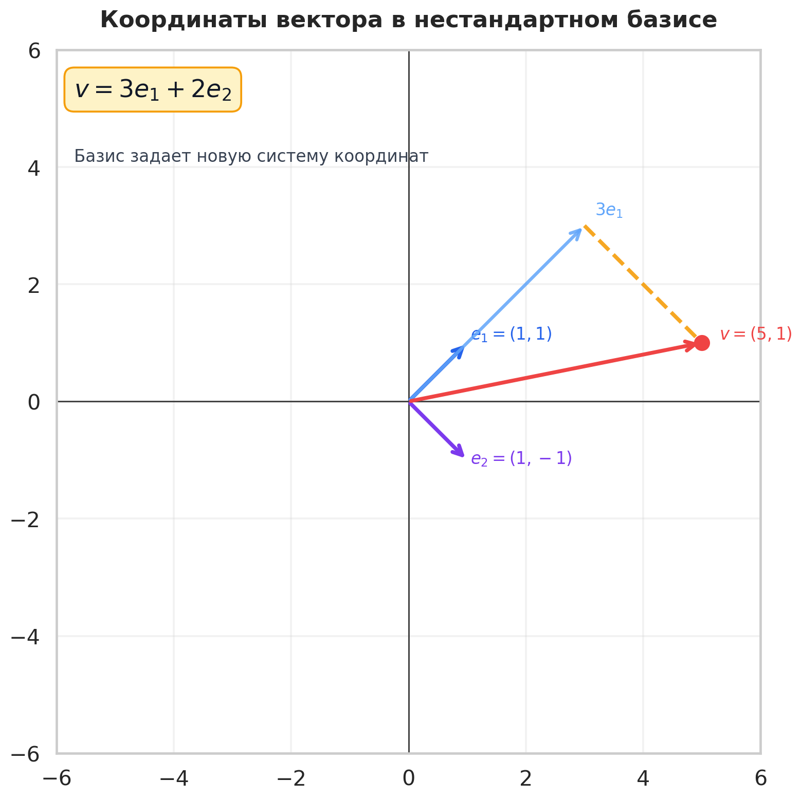
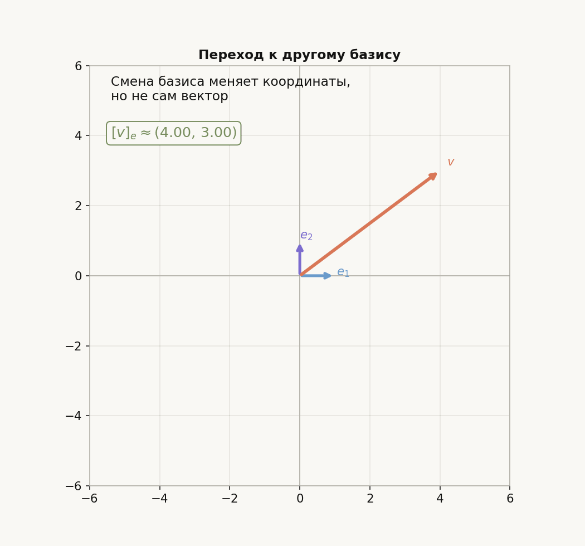
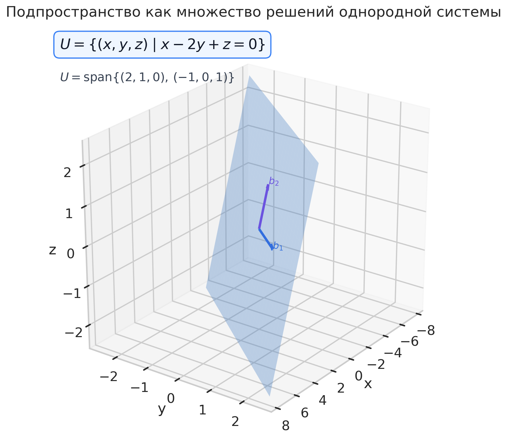
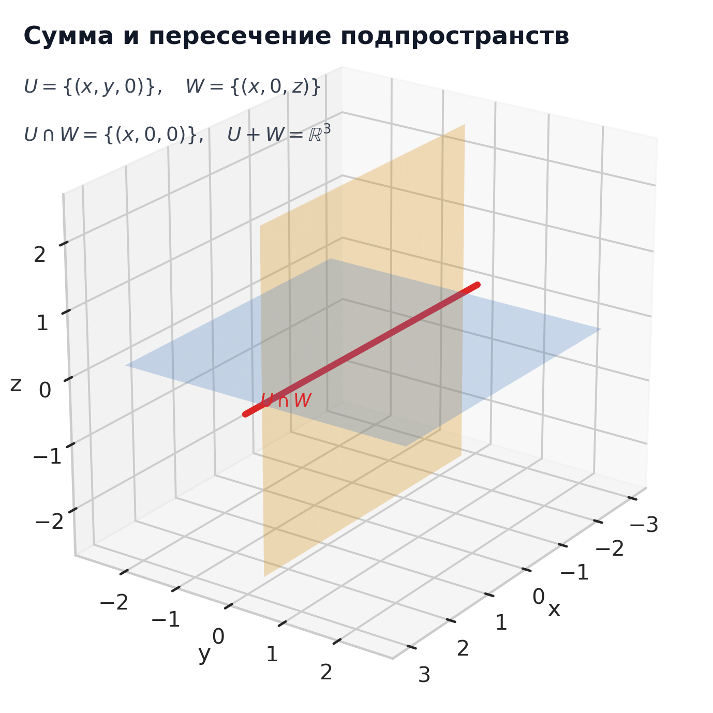
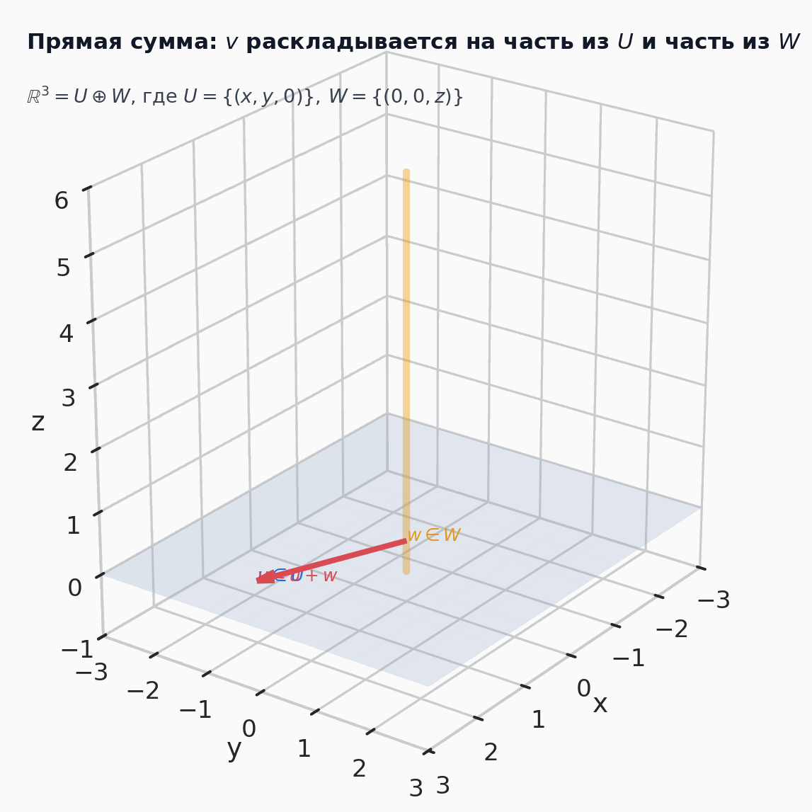

# Лекция: векторные пространства, базис, координаты, подпространства, сумма и прямая сумма

## План

1. Что такое векторное пространство  
2. Линейные комбинации и линейная оболочка  
3. Подпространства  
4. Линейная независимость, базис и размерность  
5. Координаты вектора в базисе  
6. Переход к другому базису и преобразование координат  
7. Подпространства как множества решений однородных систем  
8. Сумма и пересечение подпространств  
9. Формула $\dim(U+W)=\dim U+\dim W-\dim(U\cap W)$  
10. Линейная независимость подпространств  
11. Прямая сумма подпространств  
12. Как строить базис суммы и прямой суммы  
13. Типичные ошибки и итог

---

## 1. Что такое векторное пространство

Интуитивно векторное пространство — это множество объектов, которые можно:

- складывать;
- умножать на числа;
- делать это так, чтобы выполнялись привычные законы алгебры.

Обычно числа берутся из поля $\mathbb{R}$ или $\mathbb{C}$.

### Определение

Множество $V$ называется **векторным пространством** над полем $\mathbb{R}$, если:

1. для любых $u,v\in V$ определена сумма $u+v\in V$;
2. для любого $\lambda\in\mathbb{R}$ и любого $v\in V$ определено произведение $\lambda v\in V$;
3. выполнены стандартные аксиомы:
   - коммутативность и ассоциативность сложения;
   - существование нулевого вектора;
   - существование противоположного вектора;
   - дистрибутивность;
   - совместимость умножения на число;
   - равенство $1\cdot v=v$.

### Примеры

#### 1. Пространство $\mathbb{R}^n$

Это главный рабочий пример:
$$
\mathbb{R}^n=\{(x_1,\dots,x_n)\mid x_i\in\mathbb{R}\}.
$$

#### 2. Пространство матриц

Множество всех матриц размера $m\times n$ с вещественными элементами образует векторное пространство:
$$
M_{m\times n}(\mathbb{R}).
$$

#### 3. Пространство многочленов степени не выше $n$

$$
P_n=\{a_0+a_1x+\dots+a_nx^n\}.
$$

Это тоже векторное пространство.

#### 4. Пространство решений однородной системы

Если
$$
Ax=0,
$$
то множество всех решений этой системы образует подпространство в $\mathbb{R}^n$.

Это один из важнейших примеров для поступления в ШАД.

---

## 2. Линейные комбинации и линейная оболочка

Пусть даны векторы
$$
v_1,\dots,v_k\in V.
$$

### Линейная комбинация

Выражение вида
$$
\alpha_1v_1+\dots+\alpha_kv_k,
$$
где $\alpha_1,\dots,\alpha_k\in\mathbb{R}$, называется **линейной комбинацией** этих векторов.

### Линейная оболочка

Множество всех линейных комбинаций векторов
$$
v_1,\dots,v_k
$$
называется их **линейной оболочкой**:
$$
\operatorname{span}(v_1,\dots,v_k).
$$

Это наименьшее подпространство, содержащее данные векторы.

### Пример

Если
$$
v_1=(1,0),\qquad v_2=(0,1),
$$
то
$$
\operatorname{span}(v_1,v_2)=\mathbb{R}^2.
$$

Если же
$$
v_1=(1,2),\qquad v_2=(2,4),
$$
то
$$
\operatorname{span}(v_1,v_2)=\operatorname{span}(v_1),
$$
потому что $v_2=2v_1$.

---

## 3. Подпространства

### Определение

Подмножество $U\subseteq V$ называется **подпространством**, если:

1. $0\in U$;
2. вместе с любыми $u_1,u_2\in U$ оно содержит сумму $u_1+u_2$;
3. вместе с любым $u\in U$ и любым числом $\lambda$ оно содержит $\lambda u$.

То есть подпространство само является векторным пространством относительно тех же операций.

### Быстрый критерий

Чтобы проверить, что $U$ — подпространство, достаточно проверить:
$$
u_1,u_2\in U,\ \alpha,\beta\in\mathbb{R}
\quad \Longrightarrow \quad
\alpha u_1+\beta u_2\in U.
$$

### Примеры подпространств в $\mathbb{R}^3$

- прямая через начало координат;
- плоскость через начало координат;
- всё пространство $\mathbb{R}^3$;
- нулевое подпространство $\{0\}$.

### Примеры, которые не являются подпространствами

#### 1. Прямая, не проходящая через начало

Например,
$$
\{(x,y)\in\mathbb{R}^2\mid y=x+1\}
$$
не является подпространством, потому что не содержит нуль.

#### 2. Множество с нелинейным условием

$$
\{(x,y)\in\mathbb{R}^2\mid x^2+y^2=1\}
$$
не является подпространством, потому что не замкнуто ни относительно сложения, ни относительно умножения на число.

---

## 4. Линейная зависимость и независимость

Пусть
$$
v_1,\dots,v_k\in V.
$$

### Определение

Векторы называются **линейно зависимыми**, если существуют числа
$$
\alpha_1,\dots,\alpha_k,
$$
не все равные нулю, такие что
$$
\alpha_1v_1+\dots+\alpha_kv_k=0.
$$

Если из равенства
$$
\alpha_1v_1+\dots+\alpha_kv_k=0
$$
следует
$$
\alpha_1=\dots=\alpha_k=0,
$$
то векторы называются **линейно независимыми**.

### Смысл

Линейная зависимость означает, что хотя бы один из векторов выражается через остальные.

### Пример

Векторы
$$
(1,0),\qquad (0,1)
$$
линейно независимы в $\mathbb{R}^2$.

Векторы
$$
(1,2),\qquad (2,4)
$$
линейно зависимы, потому что
$$
(2,4)-2(1,2)=0.
$$

---

## 5. Базис

### Определение

Система векторов
$$
e_1,\dots,e_n
$$
называется **базисом** пространства $V$, если:

1. эти векторы линейно независимы;
2. они порождают всё пространство: $V=\operatorname{span}(e_1,\dots,e_n)$.

### Почему базис важен

Базис даёт «систему координат» в пространстве: любой вектор можно единственным образом разложить по базису.

### Пример

В стандартном пространстве $\mathbb{R}^3$ базисом является система
$$
e_1=(1,0,0),\qquad e_2=(0,1,0),\qquad e_3=(0,0,1).
$$

Но это не единственный базис. Например,
$$
u_1=(1,0,0),\qquad u_2=(1,1,0),\qquad u_3=(1,1,1)
$$
тоже образуют базис в $\mathbb{R}^3$.

---

## 6. Размерность

### Определение

Число векторов в любом базисе пространства $V$ называется его **размерностью** и обозначается
$$
\dim V.
$$

### Примеры

- $\dim \mathbb{R}^n=n$;
- $\dim P_n=n+1$;
- для плоскости через начало в $\mathbb{R}^3$ размерность равна $2$;
- для прямой через начало в $\mathbb{R}^3$ размерность равна $1$;
- $\dim\{0\}=0$.

### Важный факт

Во всяком конечномерном пространстве:

- любая линейно независимая система содержит не больше $\dim V$ векторов;
- любая порождающая система содержит не меньше $\dim V$ векторов;
- всякая линейно независимая система из $\dim V$ векторов уже является базисом;
- всякая порождающая система из $\dim V$ векторов уже является базисом.

---

## 7. Координаты вектора в базисе

Пусть
$$
e_1,\dots,e_n
$$
— базис пространства $V$.

Тогда любой вектор $v\in V$ единственным образом представляется в виде
$$
v=x_1e_1+\dots+x_ne_n.
$$

Числа
$$
x_1,\dots,x_n
$$
называются **координатами** вектора $v$ в базисе
$$
(e_1,\dots,e_n).
$$

Обозначение:
$$
[v]_e=
\begin{pmatrix}
x_1\\
\vdots\\
x_n
\end{pmatrix}.
$$

### Пример

Пусть в $\mathbb{R}^2$
$$
e_1=(1,1),\qquad e_2=(1,-1).
$$

Найдём координаты вектора
$$
v=(5,1).
$$

Ищем числа $x_1,x_2$:
$$
(5,1)=x_1(1,1)+x_2(1,-1).
$$

Это означает:
$$
\begin{cases}
x_1+x_2=5,\\
x_1-x_2=1.
\end{cases}
$$

Складываем:
$$
2x_1=6 \Rightarrow x_1=3.
$$

Тогда
$$
x_2=2.
$$

Значит,
$$
[v]_e=
\begin{pmatrix}
3\\
2
\end{pmatrix}.
$$

Ниже та же идея изображена геометрически: красный вектор фиксирован, а его координаты читаются по нестандартному базису.

---

## 8. Почему координаты определены однозначно

Пусть
$$
v=x_1e_1+\dots+x_ne_n=y_1e_1+\dots+y_ne_n.
$$

Вычтем одно разложение из другого:
$$
(x_1-y_1)e_1+\dots+(x_n-y_n)e_n=0.
$$

Так как базисные векторы линейно независимы, получаем
$$
x_1-y_1=\dots=x_n-y_n=0.
$$

Следовательно,
$$
x_i=y_i
$$
для всех $i$.

Именно линейная независимость обеспечивает единственность координат.

---

## 9. Матрица из базисных векторов

Пусть мы работаем в $\mathbb{R}^n$ и базис
$$
e_1,\dots,e_n
$$
задан столбцами.

Составим матрицу
$$
S=(e_1\ e_2\ \dots\ e_n).
$$

Если
$$
[v]_e=
\begin{pmatrix}
x_1\\
\vdots\\
x_n
\end{pmatrix},
$$
то
$$
v=S[v]_e.
$$

Если столбцы $S$ образуют базис, то матрица $S$ обратима, и потому
$$
[v]_e=S^{-1}v.
$$

Это важная формула для вычисления координат.

---

## 10. Переход к другому базису

Пусть в пространстве $V$ заданы два базиса:
$$
e=(e_1,\dots,e_n),\qquad f=(f_1,\dots,f_n).
$$

Тогда один и тот же вектор $v$ имеет две координатные записи:
$$
[v]_e,\qquad [v]_f.
$$

### Матрица перехода

Если столбцы матрицы $C_{e\leftarrow f}$ состоят из координат векторов базиса $f$ в базисе $e$, то
$$
[v]_e=C_{e\leftarrow f}[v]_f.
$$

А значит,
$$
[v]_f=C_{e\leftarrow f}^{-1}[v]_e.
$$

### Как это понимать

Матрица перехода не меняет сам вектор.  
Она меняет только его запись в разных координатных системах.

### Частный случай: переход от нового базиса к стандартному

Если базис
$$
f_1,\dots,f_n
$$
задан в стандартных координатах, то матрица
$$
S=(f_1\ \dots\ f_n)
$$
сразу удовлетворяет:
$$
v=S[v]_f.
$$

Значит,
$$
[v]_f=S^{-1}v.
$$

---

## 11. Пример перехода между базисами

Пусть в $\mathbb{R}^2$
$$
e_1=(1,0),\qquad e_2=(0,1)
$$
— стандартный базис, а
$$
f_1=(1,1),\qquad f_2=(1,-1).
$$

Тогда матрица перехода от координат в базисе $f$ к стандартным координатам равна
$$
S=
\begin{pmatrix}
1 & 1\\
1 & -1
\end{pmatrix}.
$$

Если
$$
[v]_f=
\begin{pmatrix}
a\\
b
\end{pmatrix},
$$
то
$$
\begin{aligned}
v&=
\begin{pmatrix}
1 & 1\\
1 & -1
\end{pmatrix}
\cdot
\begin{pmatrix}
a\\
b
\end{pmatrix}\\
&=
\begin{pmatrix}
a+b\\
a-b
\end{pmatrix}.
\end{aligned}
$$

Обратно:
$$
[v]_f=S^{-1}v.
$$

Так как
$$
\det S=-2\ne 0,
$$
имеем
$$
\begin{aligned}
S^{-1}
&=
\frac{1}{-2}
\begin{pmatrix}
-1 & -1\\
-1 & 1
\end{pmatrix}\\
&=
\begin{pmatrix}
\frac12 & \frac12\\
\frac12 & -\frac12
\end{pmatrix}.
\end{aligned}
$$

Следовательно,
$$
[v]_f=
\begin{pmatrix}
\frac12 & \frac12\\
\frac12 & -\frac12
\end{pmatrix}
\cdot v.
$$

Анимация ниже показывает главный смысл перехода к другому базису: сам вектор не меняется, меняется только система координат и числовая запись этого вектора.

---

## 12. Подпространства как множества решений однородных систем

Рассмотрим систему
$$
Ax=0.
$$

Множество её решений обозначают
$$
\ker A=\{x\in\mathbb{R}^n\mid Ax=0\}.
$$

### Теорема

Множество решений однородной системы является подпространством пространства $\mathbb{R}^n$.

### Доказательство

#### Нулевой вектор принадлежит множеству решений

$$
A0=0.
$$

#### Замкнутость относительно линейных комбинаций

Пусть
$$
Ax=0,\qquad Ay=0.
$$

Тогда для любых $\alpha,\beta\in\mathbb{R}$:
$$
A(\alpha x+\beta y)=\alpha Ax+\beta Ay=\alpha\cdot 0+\beta\cdot 0=0.
$$

Значит,
$$
\alpha x+\beta y\in\ker A.
$$

Итак, $\ker A$ — подпространство.

### Почему это важно

Это связывает теорию векторных пространств с системами линейных уравнений:

- решение однородной системы — это не просто набор векторов;
- это целое подпространство;
- у этого подпространства есть базис и размерность.

На картинке ниже подпространство решений изображено как плоскость в $\mathbb{R}^3$, натянутая на два базисных вектора.

---

## 13. Базис и размерность пространства решений

Пусть
$$
A\in\mathbb{R}^{m\times n}.
$$

Тогда пространство решений системы
$$
Ax=0
$$
имеет размерность
$$
\dim\ker A=n-\operatorname{rank}(A).
$$

Это одна из важнейших формул линейной алгебры.

### Смысл

- $n$ — число неизвестных;
- $\operatorname{rank}(A)$ — число независимых линейных ограничений;
- оставшееся число $n-\operatorname{rank}(A)$ равно числу степеней свободы.

### Пример

Если система в $\mathbb{R}^4$ имеет матрицу ранга $2$, то пространство её решений двумерно:
$$
\dim\ker A=4-2=2.
$$

---

## 14. Сумма подпространств

Пусть $U,W\subseteq V$ — подпространства.

### Определение

Их **суммой** называется множество
$$
U+W=\{u+w\mid u\in U,\ w\in W\}.
$$

### Теорема

Сумма $U+W$ тоже является подпространством.

### Почему

Если
$$
x=u_1+w_1,\qquad y=u_2+w_2,
$$
то
$$
\alpha x+\beta y=
(\alpha u_1+\beta u_2)+(\alpha w_1+\beta w_2),
$$
а так как $U$ и $W$ — подпространства, то обе скобки лежат в своих подпространствах.

Значит,
$$
\alpha x+\beta y\in U+W.
$$

### Пример

В $\mathbb{R}^3$ пусть:
$$
U=\operatorname{span}((1,0,0),(0,1,0)),
$$
$$
W=\operatorname{span}((0,0,1)).
$$

Тогда
$$
U+W=\mathbb{R}^3.
$$

---

## 15. Пересечение подпространств

### Определение

Пересечением $U$ и $W$ называется обычное пересечение множеств:
$$
U\cap W=\{v\in V\mid v\in U\ \text{и}\ v\in W\}.
$$

### Теорема

Пересечение двух подпространств — снова подпространство.

### Пример

Если в $\mathbb{R}^3$
$$
U=\{(x,y,0)\},
$$
$$
W=\{(x,0,z)\},
$$
то
$$
U\cap W=\{(x,0,0)\},
$$
то есть ось $Ox$.

---

## 16. Формула для размерностей суммы и пересечения

Для конечномерных подпространств $U$ и $W$ верна формула:
$$
\dim(U+W)=\dim U+\dim W-\dim(U\cap W).
$$

Это одно из центральных утверждений темы.

### Почему в формуле есть вычитание

Когда мы складываем
$$
\dim U+\dim W,
$$
векторы из пересечения считаются дважды:

- один раз как часть $U$;
- второй раз как часть $W$.

Поэтому надо вычесть
$$
\dim(U\cap W).
$$

На схеме ниже две плоскости дают сумму, а их общая красная прямая показывает пересечение, которое и нужно вычитать в формуле размерностей.

---

## 17. Доказательство формулы размерностей

Пусть
$$
z_1,\dots,z_k
$$
— базис пересечения
$$
U\cap W.
$$

Дополним его до базиса в $U$:
$$
z_1,\dots,z_k,u_1,\dots,u_p.
$$

И до базиса в $W$:
$$
z_1,\dots,z_k,w_1,\dots,w_q.
$$

Тогда:
$$
\dim U=k+p,\qquad \dim W=k+q.
$$

Покажем, что система
$$
z_1,\dots,z_k,u_1,\dots,u_p,w_1,\dots,w_q
$$
образует базис пространства $U+W$.

### Почему она порождает $U+W$

Любой вектор из $U+W$ имеет вид
$$
u+w,
$$
где
$$
u\in U,\qquad w\in W.
$$

Но $u$ раскладывается по базису пространства $U$, а $w$ — по базису пространства $W$. Значит, их сумма раскладывается по указанной системе.

### Почему она линейно независима

Если
$$
z+u+w=0,
$$
где
$$
z\in\operatorname{span}(z_1,\dots,z_k),\quad
u\in\operatorname{span}(u_1,\dots,u_p),\quad
w\in\operatorname{span}(w_1,\dots,w_q),
$$
то
$$
u=-(z+w).
$$

Правая часть лежит в $W$, а левая лежит в $U$, значит
$$
u\in U\cap W.
$$

Но в базисе $U$
$$
z_1,\dots,z_k,u_1,\dots,u_p
$$
вектор из пересечения не может иметь ненулевую часть по $u_1,\dots,u_p$. Следовательно,
$$
u=0.
$$

Аналогично
$$
w=0,\qquad z=0.
$$

Значит, система линейно независима.

Следовательно,
$$
\dim(U+W)=k+p+q.
$$

Теперь:
$$
\dim U+\dim W-\dim(U\cap W)
=(k+p)+(k+q)-k
=k+p+q.
$$

То есть
$$
\dim(U+W)=\dim U+\dim W-\dim(U\cap W).
$$

---

## 18. Линейная независимость подпространств

Подпространства
$$
U_1,\dots,U_m
$$
называются **линейно независимыми**, если из равенства
$$
u_1+\dots+u_m=0,\qquad u_i\in U_i,
$$
следует
$$
u_1=\dots=u_m=0.
$$

### Для двух подпространств

Подпространства $U$ и $W$ линейно независимы тогда и только тогда, когда
$$
U\cap W=\{0\}.
$$

### Доказательство для двух подпространств

#### Если $U$ и $W$ линейно независимы

Возьмём
$$
v\in U\cap W.
$$

Тогда
$$
v+(-v)=0,
$$
где
$$
v\in U,\qquad -v\in W.
$$

По линейной независимости подпространств получаем
$$
v=0.
$$

Значит,
$$
U\cap W=\{0\}.
$$

#### Если $U\cap W=\{0\}$

Пусть
$$
u+w=0,\qquad u\in U,\ w\in W.
$$

Тогда
$$
u=-w.
$$

Значит,
$$
u\in U\cap W.
$$

Но пересечение тривиально, значит
$$
u=0,\qquad w=0.
$$

Итак, подпространства линейно независимы.

---

## 19. Прямая сумма

### Определение

Сумма
$$
U+W
$$
называется **прямой суммой** и обозначается
$$
U\oplus W,
$$
если
$$
U\cap W=\{0\}.
$$

Эквивалентно: каждый вектор из $U+W$ представляется в виде
$$
u+w,\qquad u\in U,\ w\in W,
$$
**единственным образом**.

### Почему это эквивалентно

Если
$$
v=u_1+w_1=u_2+w_2,
$$
то
$$
(u_1-u_2)+(w_1-w_2)=0.
$$

Здесь
$$
u_1-u_2\in U,\qquad w_1-w_2\in W.
$$

Если сумма прямая, то
$$
u_1-u_2=0,\qquad w_1-w_2=0.
$$

Значит,
$$
u_1=u_2,\qquad w_1=w_2.
$$

То есть разложение единственно.

---

## 20. Размерность прямой суммы

Если
$$
V=U\oplus W,
$$
то из общей формулы сразу получаем:
$$
\dim V=\dim U+\dim W,
$$
потому что
$$
\dim(U\cap W)=0.
$$

### Более общий факт

Если подпространства
$$
U_1,\dots,U_m
$$
линейно независимы, то для их прямой суммы:
$$
\dim(U_1\oplus\dots\oplus U_m)
=\dim U_1+\dots+\dim U_m.
$$

---

## 21. Базис прямой суммы

Если:

- $u_1,\dots,u_p$ — базис подпространства $U$;
- $w_1,\dots,w_q$ — базис подпространства $W$;
- и $U\cap W=\{0\}$,

то объединение
$$
u_1,\dots,u_p,w_1,\dots,w_q
$$
образует базис пространства
$$
U\oplus W.
$$

### Почему

#### 1. Порождаемость

Любой вектор из $U\oplus W$ имеет вид
$$
u+w,
$$
где $u$ раскладывается по базису $U$, а $w$ — по базису $W$.

#### 2. Линейная независимость

Если
$$
\alpha_1u_1+\dots+\alpha_pu_p+\beta_1w_1+\dots+\beta_qw_q=0,
$$
то левая часть разбивается на сумму вектора из $U$ и вектора из $W$.

Так как сумма прямая, обе части должны быть нулевыми. А так как каждый набор базисен, все коэффициенты равны нулю.

---

## 22. Пример суммы, пересечения и прямой суммы

Рассмотрим в $\mathbb{R}^3$ подпространства:
$$
U=\operatorname{span}((1,0,0),(0,1,0)),
$$
$$
W=\operatorname{span}((0,0,1)).
$$

Тогда:

- $\dim U=2$;
- $\dim W=1$;
- $U\cap W=\{0\}$;
- значит $U+W=U\oplus W$;
- и $\dim(U+W)=2+1=3$.

Следовательно,
$$
U\oplus W=\mathbb{R}^3.
$$

Базисом этой прямой суммы служит объединение базисов:
$$
(1,0,0),\ (0,1,0),\ (0,0,1).
$$

В анимации видно разложение вектора на сумму компоненты из плоскости $U$ и компоненты из прямой $W$. Это и есть визуальный смысл прямой суммы.

---

## 23. Пример, когда сумма не является прямой

Пусть в $\mathbb{R}^3$
$$
U=\operatorname{span}((1,0,0),(0,1,0)),
$$
$$
W=\operatorname{span}((1,1,0)).
$$

Тогда
$$
W\subset U.
$$

Следовательно,
$$
U\cap W=W\ne\{0\}.
$$

Поэтому сумма не прямая:
$$
U+W=U,
$$
но
$$
U+W\ne U\oplus W.
$$

И действительно, представление вектора неоднозначно. Например,
$$
(1,1,0)\in U
$$
можно записать как:
$$
(1,1,0)+0
$$
и как
$$
0+(1,1,0).
$$

---

## 24. Как искать базис суммы подпространств на практике

Пусть заданы базисы:
$$
U=\operatorname{span}(u_1,\dots,u_p),\qquad
W=\operatorname{span}(w_1,\dots,w_q).
$$

### Алгоритм

1. Выписать вместе все векторы $u_1,\dots,u_p,w_1,\dots,w_q$.
2. Составить из них матрицу.
3. Методом Гаусса выделить линейно независимую подсистему.
4. Эта подсистема даст базис пространства $U+W$.

После этого:

- число выбранных векторов даст $\dim(U+W)$;
- если их оказалось ровно $\dim U+\dim W$, то сумма прямая;
- если меньше, то пересечение нетривиально.

---

## 25. Как искать пересечение подпространств

Если подпространства заданы через порождающие векторы:
$$
U=\operatorname{span}(u_1,\dots,u_p),\qquad
W=\operatorname{span}(w_1,\dots,w_q),
$$
то вектор $x$ лежит в пересечении тогда и только тогда, когда его можно представить и так, и так:
$$
x=\alpha_1u_1+\dots+\alpha_pu_p=\beta_1w_1+\dots+\beta_qw_q.
$$

Перенося всё в одну сторону, получаем однородную систему на коэффициенты:
$$
\alpha_1u_1+\dots+\alpha_pu_p-\beta_1w_1-\dots-\beta_qw_q=0.
$$

Решив её, можно найти все векторы пересечения.

### Альтернативный путь

Если известны
$$
\dim U,\qquad \dim W,\qquad \dim(U+W),
$$
то
$$
\dim(U\cap W)=\dim U+\dim W-\dim(U+W).
$$

---

## 26. Что особенно важно для поступления в ШАД

- чётко знать определения:
  - векторного пространства;
  - подпространства;
  - линейной оболочки;
  - базиса;
  - размерности;
  - прямой суммы;
- уверенно находить базис и размерность по набору векторов;
- уметь искать координаты вектора в нестандартном базисе;
- понимать, как строится матрица перехода между базисами;
- знать, что множество решений системы $Ax=0$ — подпространство;
- применять формулу $\dim(U+W)=\dim U+\dim W-\dim(U\cap W)$;
- различать обычную сумму и прямую сумму;
- уметь доказывать, что $U\oplus W$ эквивалентно условию $U\cap W=\{0\}$.

---

## 27. Типичные ошибки

### Ошибка 1

Считать, что любое множество векторов является подпространством.

Нужно обязательно проверять:

- наличие нуля;
- замкнутость относительно линейных комбинаций.

### Ошибка 2

Путать линейную оболочку и объединение.

Вообще
$$
\operatorname{span}(v_1,v_2)\ne \{v_1,v_2\}.
$$

Линейная оболочка обычно содержит бесконечно много векторов.

### Ошибка 3

Считать, что координаты зависят только от вектора.

На самом деле координаты зависят от **выбранного базиса**.

### Ошибка 4

Писать
$$
\dim(U+W)=\dim U+\dim W
$$
без дополнительного условия.

Это верно только для прямой суммы, то есть когда
$$
U\cap W=\{0\}.
$$

### Ошибка 5

Путать подпространства и аффинные множества.

Например, множество решений неоднородной системы
$$
Ax=b,\qquad b\ne 0,
$$
обычно не является подпространством.

### Ошибка 6

При поиске пересечения подпространств сравнивать только их базисные векторы.

Пересечение состоит не из общих «на глаз» векторов, а из всех векторов, которые можно представить через оба подпространства.

---

## 28. Итоги

### Основные понятия

- векторное пространство;
- подпространство;
- линейная оболочка;
- линейная независимость;
- базис;
- размерность;
- координаты;
- сумма, пересечение и прямая сумма подпространств.

### Главные формулы

Координаты в базисе:
$$
v=S[v]_e,\qquad [v]_e=S^{-1}v.
$$

Размерность ядра:
$$
\dim\ker A=n-\operatorname{rank}(A).
$$

Формула для суммы и пересечения:
$$
\dim(U+W)=\dim U+\dim W-\dim(U\cap W).
$$

Для прямой суммы:
$$
U\oplus W \iff U\cap W=\{0\},
$$
и тогда
$$
\dim(U\oplus W)=\dim U+\dim W.
$$

### Главная идея всей темы

Базис позволяет кодировать векторы координатами, а подпространства позволяют структурно описывать множество решений линейных уравнений.  
Сумма, пересечение и прямая сумма — это способы понять, как подпространства сочетаются друг с другом.

---

## 29. Вопросы для самопроверки

1. Что такое векторное пространство?  
2. Что такое линейная оболочка системы векторов?  
3. Как проверить, что множество является подпространством?  
4. Что значит, что векторы линейно независимы?  
5. Что такое базис и почему координаты в базисе единственны?  
6. Как найти координаты вектора в нестандартном базисе?  
7. Что такое матрица перехода между базисами?  
8. Почему множество решений системы $Ax=0$ является подпространством?  
9. Как связаны размерности $U$, $W$, $U+W$, $U\cap W$?  
10. Когда сумма подпространств является прямой?  
11. Как строится базис прямой суммы?  
12. Чем отличается подпространство от множества решений неоднородной системы?  

