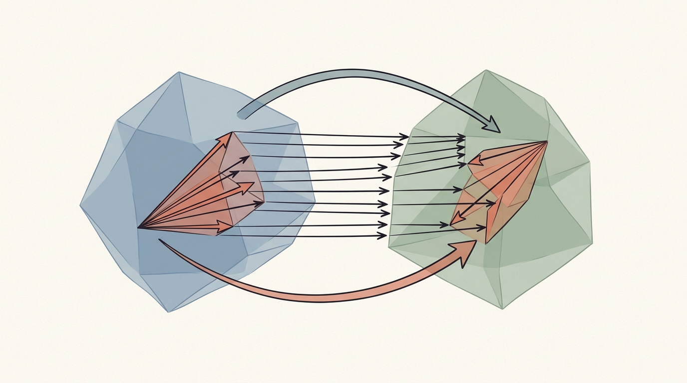
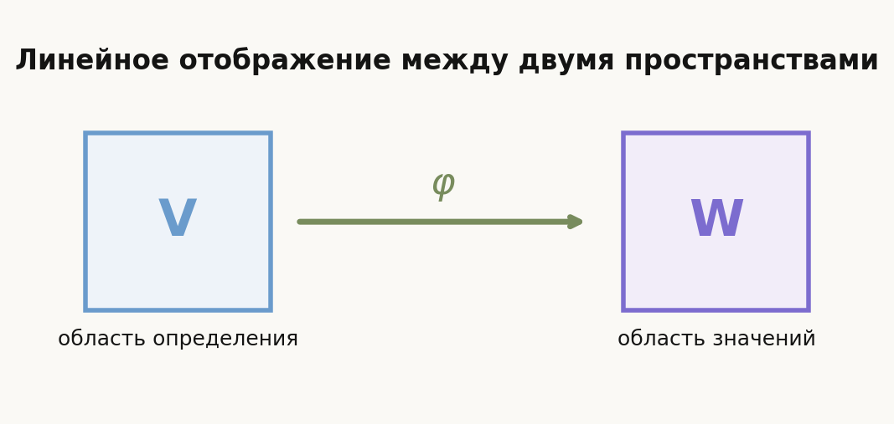
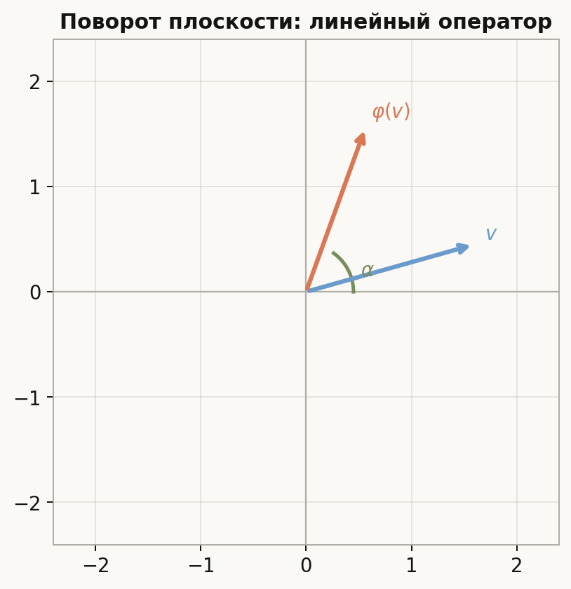
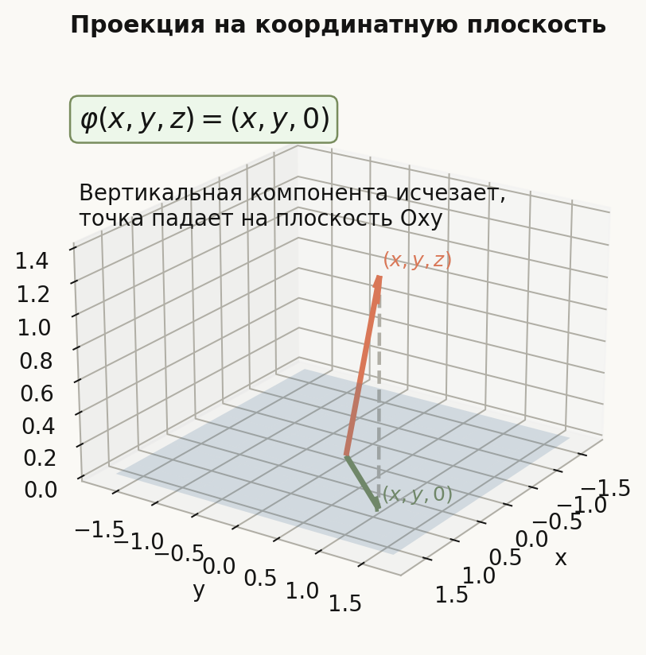
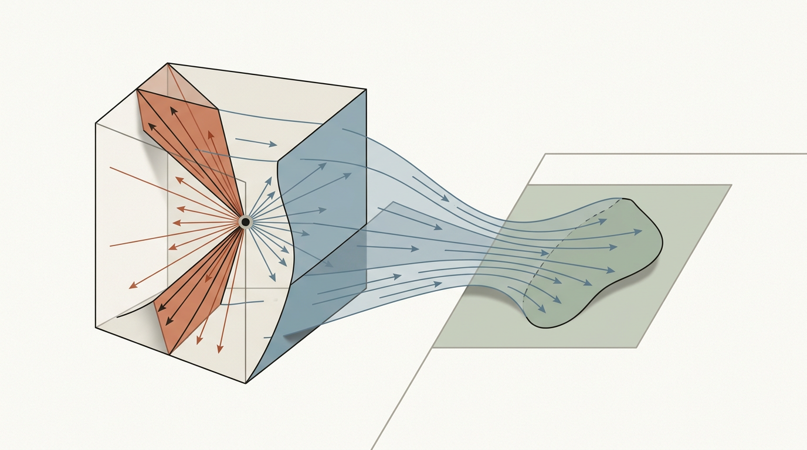
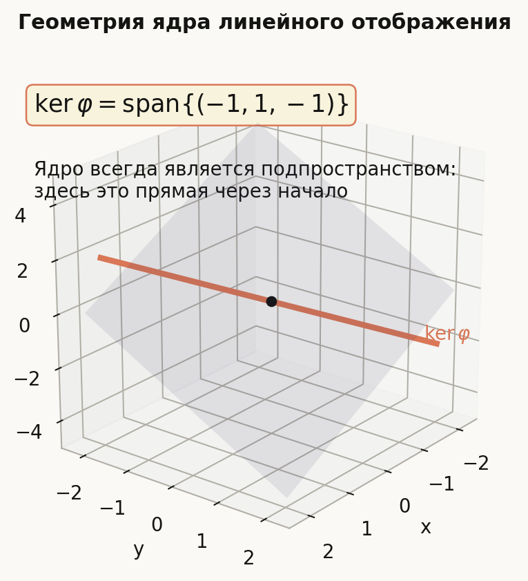
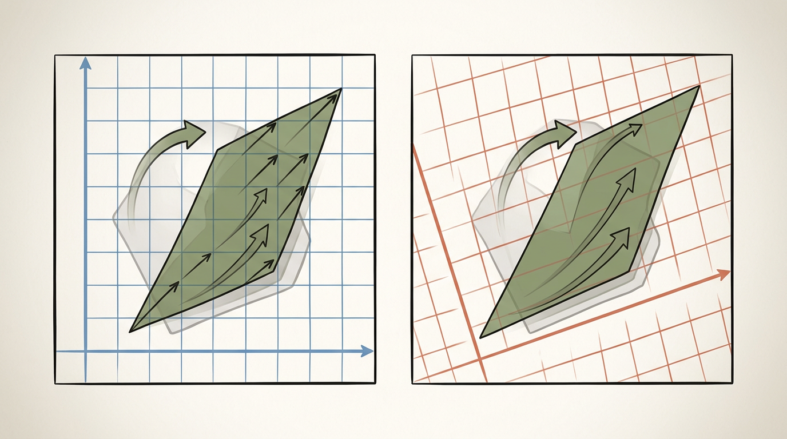
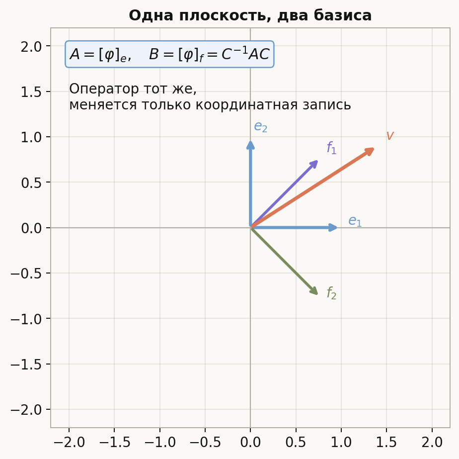

# Лекция: линейные отображения и линейные операторы

## План

1. Что такое линейное отображение
2. Примеры линейных отображений
3. Матрица линейного отображения в выбранных базисах
4. Действие отображения в координатах
5. Образ линейного отображения
6. Ядро линейного отображения
7. Теорема о связи размерностей образа и ядра
8. Примеры вычисления образа и ядра
9. Линейные операторы
10. Композиция и обратимость линейных операторов
11. Изменение матрицы оператора при замене базиса
12. Подобные матрицы и инварианты
13. Пример замены базиса для оператора
14. Сопряжённое пространство
15. Сопряжённый (двойственный) базис
16. Пример построения сопряжённого базиса
17. Что важно для поступления в ШАД
18. Типичные ошибки
19. Итог
20. Вопросы для самопроверки

---

## 1. Что такое линейное отображение

Пусть $V$ и $W$ — векторные пространства над одним и тем же полем (обычно $\mathbb{R}$ или $\mathbb{C}$).

### Определение

Отображение
$$
\varphi\colon V\to W
$$
называется **линейным**, если для любых $u,v\in V$ и любого числа $\lambda$ выполнено:

1. $\varphi(u+v)=\varphi(u)+\varphi(v)$ — аддитивность;
2. $\varphi(\lambda u)=\lambda\varphi(u)$ — однородность.

Эти два условия эквивалентны одному: для любых $u,v\in V$ и любых чисел $\alpha,\beta$
$$
\varphi(\alpha u+\beta v)=\alpha\varphi(u)+\beta\varphi(v).
$$

### Интуитивный смысл

Линейное отображение — это такое правило, которое:

- уважает сложение векторов;
- уважает умножение на число;
- переводит нулевой вектор в нулевой: $\varphi(0)=0$.

Последнее следует из однородности: $\varphi(0)=\varphi(0\cdot v)=0\cdot\varphi(v)=0$.

### Важное следствие

Линейное отображение полностью определяется своими значениями на базисе. Если известны
$$
\varphi(e_1),\dots,\varphi(e_n),
$$
то для любого $v=x_1e_1+\dots+x_ne_n$ имеем
$$
\varphi(v)=x_1\varphi(e_1)+\dots+x_n\varphi(e_n).
$$

**Заметка на рисунке.** Сама «линейность» — это не картинка, но полезно держать в голове, что у отображения есть **два** пространства: откуда берутся векторы ($V$) и куда они попадают ($W$). Матрица $A$ появится, когда в обоих пространствах выбраны базисы.

---

## 2. Примеры линейных отображений

#### 1. Нулевое отображение

$$
\varphi(v)=0
$$
для всех $v$. Линейно тривиально.

#### 2. Тождественное отображение

$$
\mathrm{id}(v)=v.
$$

#### 3. Умножение на число

$$
\varphi(v)=\lambda v.
$$

#### 4. Поворот плоскости на угол $\alpha$

На $\mathbb{R}^2$ поворот
$$
\varphi(x,y)=(x\cos\alpha-y\sin\alpha,\ x\sin\alpha+y\cos\alpha)
$$
линеен.

#### 5. Проектирование

Отображение
$$
\varphi(x,y,z)=(x,y,0)
$$
линейно. Это проекция на координатную плоскость.

#### 6. Дифференцирование

На пространстве многочленов $P_n$
$$
D(p)=p'
$$
линейно, поскольку $(p+q)'=p'+q'$ и $(\lambda p)'=\lambda p'$.

#### 7. Интегрирование на отрезке

$$
I(p)=\int_0^1 p(x)\,dx.
$$

#### 8. Отображение «не линейное»

$$
\varphi(x,y)=(x+1,y)
$$
не линейно: $\varphi(0,0)=(1,0)\ne 0$.

Любое аффинное «со сдвигом» отображение не линейно.

---

## 3. Матрица линейного отображения в выбранных базисах

Пусть:

- $V$ и $W$ — конечномерные пространства;
- $e=(e_1,\dots,e_n)$ — базис в $V$;
- $f=(f_1,\dots,f_m)$ — базис в $W$;
- $\varphi\colon V\to W$ — линейное отображение.

### Построение матрицы

Каждый вектор $\varphi(e_j)\in W$ раскладывается по базису $f$:
$$
\varphi(e_j)=a_{1j}f_1+a_{2j}f_2+\dots+a_{mj}f_m.
$$

Коэффициенты $a_{ij}$ записываются в столбец. Так получается матрица
$$
A=\begin{pmatrix}a_{11} & a_{12} & \dots & a_{1n}\\ a_{21} & a_{22} & \dots & a_{2n}\\ \vdots & \vdots & \ddots & \vdots\\ a_{m1} & a_{m2} & \dots & a_{mn}\end{pmatrix}\in\mathbb{R}^{m\times n}.
$$

Это **матрица отображения $\varphi$ в базисах $e$ и $f$**. Обозначение:
$$
A=[\varphi]_{f\leftarrow e}.
$$

### Ключевое правило

Столбцы матрицы $A$ — это координаты образов базисных векторов $\varphi(e_j)$ в базисе $f$.

Если базис в области определения один, а в области значений — другой, матрица прямоугольная размера $m\times n$.

---

## 4. Действие отображения в координатах

Пусть вектор $v\in V$ имеет координаты
$$
[v]_e=\begin{pmatrix}x_1\\ \vdots\\ x_n\end{pmatrix}
$$
в базисе $e$, а его образ $\varphi(v)\in W$ имеет координаты
$$
[\varphi(v)]_f
$$
в базисе $f$.

### Формула

$$
[\varphi(v)]_f=A\cdot[v]_e.
$$

### Почему это так

По линейности:
$$
\varphi(v)=\varphi(x_1e_1+\dots+x_ne_n)=x_1\varphi(e_1)+\dots+x_n\varphi(e_n).
$$

В координатах базиса $f$ это именно произведение матрицы $A$ на столбец $[v]_e$.

### Итог

Работа с линейным отображением в координатах сводится к умножению матрицы на столбец. Именно это делает матрицы основным инструментом линейной алгебры.

---

## 5. Образ линейного отображения

### Определение

**Образом** линейного отображения $\varphi\colon V\to W$ называется множество
$$
\operatorname{Im}\varphi=\{\varphi(v)\mid v\in V\}\subseteq W.
$$

Это множество всех векторов из $W$, которые вообще достижимы.

### Образ — подпространство $W$

Достаточно проверить замкнутость относительно линейных комбинаций. Если
$$
y_1=\varphi(v_1),\qquad y_2=\varphi(v_2),
$$
то
$$
\alpha y_1+\beta y_2=\varphi(\alpha v_1+\beta v_2)\in\operatorname{Im}\varphi.
$$

### Как найти образ через матрицу

Если $A=[\varphi]_{f\leftarrow e}$, то в координатах базиса $f$ имеем
$$
\operatorname{Im}\varphi=\operatorname{span}\big(\text{столбцы матрицы } A\big).
$$

Поэтому
$$
\dim\operatorname{Im}\varphi=\operatorname{rank}(A).
$$

Размерность образа называют **рангом отображения**:
$$
\operatorname{rk}\varphi=\dim\operatorname{Im}\varphi.
$$

---

## 6. Ядро линейного отображения

### Определение

**Ядром** линейного отображения $\varphi\colon V\to W$ называется множество
$$
\ker\varphi=\{v\in V\mid \varphi(v)=0\}\subseteq V.
$$

### Ядро — подпространство $V$

Если $\varphi(v_1)=0$ и $\varphi(v_2)=0$, то
$$
\varphi(\alpha v_1+\beta v_2)=\alpha\cdot 0+\beta\cdot 0=0.
$$

### Как найти ядро через матрицу

Вектор $v$ лежит в $\ker\varphi$ тогда и только тогда, когда его координаты $[v]_e$ удовлетворяют однородной системе
$$
A\cdot[v]_e=0.
$$

Значит, ядро — это пространство решений системы $Ax=0$, и
$$
\dim\ker\varphi=n-\operatorname{rank}(A),
$$
где $n=\dim V$.

Размерность ядра называют **дефектом** отображения:
$$
\operatorname{def}\varphi=\dim\ker\varphi.
$$

---

## 7. Теорема о связи размерностей образа и ядра

### Формулировка (теорема о ранге и дефекте)

Пусть $V$ конечномерно и $\varphi\colon V\to W$ линейно. Тогда
$$
\dim\ker\varphi+\dim\operatorname{Im}\varphi=\dim V.
$$

Короче:
$$
\operatorname{def}\varphi+\operatorname{rk}\varphi=\dim V.
$$

### Почему это верно

Возьмём базис ядра
$$
u_1,\dots,u_k,\qquad k=\dim\ker\varphi,
$$
и дополним его до базиса всего $V$:
$$
u_1,\dots,u_k,\ v_1,\dots,v_r,\qquad k+r=\dim V.
$$

Покажем, что векторы
$$
\varphi(v_1),\dots,\varphi(v_r)
$$
образуют базис пространства $\operatorname{Im}\varphi$.

#### Порождаемость

Любой вектор $y\in\operatorname{Im}\varphi$ имеет вид $y=\varphi(v)$, где $v\in V$. Разложим $v$ по построенному базису:
$$
v=\alpha_1u_1+\dots+\alpha_ku_k+\beta_1v_1+\dots+\beta_rv_r.
$$

Применим $\varphi$. Так как $\varphi(u_i)=0$, получим
$$
\varphi(v)=\beta_1\varphi(v_1)+\dots+\beta_r\varphi(v_r).
$$

Значит, $\varphi(v_1),\dots,\varphi(v_r)$ порождают $\operatorname{Im}\varphi$.

#### Линейная независимость

Пусть
$$
\beta_1\varphi(v_1)+\dots+\beta_r\varphi(v_r)=0.
$$

По линейности это означает
$$
\varphi(\beta_1v_1+\dots+\beta_rv_r)=0,
$$
то есть
$$
\beta_1v_1+\dots+\beta_rv_r\in\ker\varphi.
$$

Но ядро порождается $u_1,\dots,u_k$, поэтому
$$
\beta_1v_1+\dots+\beta_rv_r=\gamma_1u_1+\dots+\gamma_ku_k,
$$
откуда
$$
\beta_1v_1+\dots+\beta_rv_r-\gamma_1u_1-\dots-\gamma_ku_k=0.
$$

Но система $u_1,\dots,u_k,v_1,\dots,v_r$ — базис, значит все коэффициенты нулевые. В частности, все $\beta_j=0$.

Следовательно, векторы $\varphi(v_1),\dots,\varphi(v_r)$ линейно независимы и образуют базис $\operatorname{Im}\varphi$.

### Следствие: связь с рангом матрицы

Если $A\in\mathbb{R}^{m\times n}$ — матрица отображения в каких-то базисах, то
$$
\dim\ker\varphi=n-\operatorname{rank}(A),\qquad
\dim\operatorname{Im}\varphi=\operatorname{rank}(A),
$$
и сумма равна $n=\dim V$.

Иллюстрация ниже показывает геометрическую идею: часть направлений «схлопывается» в ядро, а оставшиеся направления формируют образ.

---

## 8. Примеры вычисления образа и ядра

### Пример 1

Пусть $\varphi\colon\mathbb{R}^3\to\mathbb{R}^2$ задано формулой
$$
\varphi(x,y,z)=(x+y,\ y+z).
$$

Матрица в стандартных базисах:
$$
A=\begin{pmatrix}1 & 1 & 0\\ 0 & 1 & 1\end{pmatrix}.
$$

#### Ранг

Строки матрицы линейно независимы (они не пропорциональны). Значит,
$$
\operatorname{rank}(A)=2.
$$

Поэтому
$$
\dim\operatorname{Im}\varphi=2,\qquad \operatorname{Im}\varphi=\mathbb{R}^2.
$$

#### Ядро

Решаем $Ax=0$:
$$
\begin{cases}x+y=0,\\ y+z=0.\end{cases}
$$

Отсюда $x=-y$, $z=-y$. Положим $y=t$:
$$
(x,y,z)=(-t,t,-t)=t(-1,1,-1).
$$

Значит,
$$
\ker\varphi=\operatorname{span}((-1,1,-1)),\qquad \dim\ker\varphi=1.
$$

[Интерактивная модель: ядро в $\mathbb{R}^3$](../../interactive/dist/index.html#/algebra/linear-maps/kernel)

**К рисунку.** Схема «псевдо-трёхмерная»; важен общий смысл: ядро — **подпространство** в $V$ (все векторы, уходящие в ноль), а плоскость $x+y=0$ на схеме — лишь вспомогательный фрагмент, напоминающий о структуре уравнений $Ax=0$ (само ядро в примере — прямая, а не эта плоскость).

Проверка теоремы о ранге и дефекте:
$$
1+2=3=\dim\mathbb{R}^3.
$$

### Пример 2

Пусть $D\colon P_3\to P_3$ — дифференцирование,
$$
D(a_0+a_1x+a_2x^2+a_3x^3)=a_1+2a_2x+3a_3x^2.
$$

В базисе $1,x,x^2,x^3$ матрица:
$$
A=\begin{pmatrix}0 & 1 & 0 & 0\\ 0 & 0 & 2 & 0\\ 0 & 0 & 0 & 3\\ 0 & 0 & 0 & 0\end{pmatrix}.
$$

- Ранг равен $3$, значит $\dim\operatorname{Im} D=3$.
- Ядро — многочлены, производная которых равна нулю, то есть константы. Значит, $\dim\ker D=1$.
- Проверка: $3+1=4=\dim P_3$.

---

## 9. Линейные операторы

### Определение

Линейное отображение $\varphi\colon V\to V$ (в том же пространстве) называется **линейным оператором** на $V$.

В этом случае удобно выбирать **один базис** $e=(e_1,\dots,e_n)$ сразу и в области определения, и в области значений. Тогда матрица оператора — квадратная размера $n\times n$:
$$
A=[\varphi]_e\in\mathbb{R}^{n\times n}.
$$

### Примеры

- тождественный оператор $\mathrm{id}$, его матрица $E$;
- нулевой оператор, матрица нулевая;
- поворот плоскости, проекция, симметрия;
- умножение многочлена на фиксированный многочлен малой степени, рассматриваемое на конечномерном пространстве.

### Обратимость

Оператор $\varphi$ обратим (является изоморфизмом $V\to V$) тогда и только тогда, когда его матрица обратима в одном (и тогда в любом) базисе, то есть
$$
\det A\ne 0.
$$

Равносильно: $\ker\varphi=\{0\}$ и $\operatorname{Im}\varphi=V$.

---

## 10. Композиция и обратимость

### Композиция линейных отображений

Если $\varphi\colon V\to W$ и $\psi\colon W\to U$ линейны, то композиция
$$
\psi\circ\varphi\colon V\to U,\qquad (\psi\circ\varphi)(v)=\psi(\varphi(v))
$$
тоже линейна.

### Матрица композиции

В согласованных базисах
$$
[\psi\circ\varphi]=[\psi]\cdot[\varphi].
$$

Это именно то, что даёт определение умножения матриц такую форму, какую оно имеет: «строка на столбец».

### Обратное отображение

Если $\varphi\colon V\to V$ обратим, то обратный оператор $\varphi^{-1}$ тоже линеен, и его матрица в том же базисе равна $A^{-1}$.

---

## 11. Изменение матрицы оператора при замене базиса

### Постановка

Пусть $\varphi\colon V\to V$ — линейный оператор, и в пространстве $V$ заданы два базиса:
$$
e=(e_1,\dots,e_n),\qquad f=(f_1,\dots,f_n).
$$

Пусть $C=C_{e\leftarrow f}$ — матрица перехода от базиса $f$ к базису $e$. Это значит: столбцы $C$ — координаты $f_j$ в базисе $e$, и
$$
[v]_e=C[v]_f.
$$

### Формула преобразования

Если $A=[\varphi]_e$ — матрица оператора в базисе $e$, а $B=[\varphi]_f$ — в базисе $f$, то
$$
B=C^{-1}AC.
$$

### Вывод формулы

Возьмём любой вектор $v$. По определению матрицы оператора:
$$
[\varphi(v)]_e=A[v]_e,\qquad [\varphi(v)]_f=B[v]_f.
$$

Переход через матрицу $C$:
$$
[v]_e=C[v]_f,\qquad [\varphi(v)]_e=C[\varphi(v)]_f.
$$

Подставим первое в $[\varphi(v)]_e=A[v]_e$:
$$
[\varphi(v)]_e=AC[v]_f.
$$

Но также
$$
[\varphi(v)]_e=C[\varphi(v)]_f=CB[v]_f.
$$

Сравнивая, получаем
$$
AC[v]_f=CB[v]_f
$$
для любого $[v]_f$. Значит,
$$
AC=CB,
$$
откуда
$$
B=C^{-1}AC.
$$

### Смысл

Матрицы $A$ и $B$ описывают **один и тот же** оператор. Они выглядят по-разному потому, что мы смотрим на оператор из разных «систем координат».

**К рисунку.** Сам плоский вектор (точка на плоскости) тот же; в новом базисе она «читается» с других осей, отсюда в числах — другая запись, а формула $B=C^{-1}AC$ учитывает **оба** согласования: координаты векторов (матрица $C$) и согласованное с ними сравнение образов (подставляется $C^{-1}AC$).

---

## 12. Подобные матрицы и инварианты

### Определение

Две матрицы $A,B\in\mathbb{R}^{n\times n}$ называются **подобными**, если существует обратимая $C$ такая, что
$$
B=C^{-1}AC.
$$

Обозначение: $A\sim B$.

### Подобие — это отношение эквивалентности

- рефлексивность: $A=E^{-1}AE$;
- симметричность: если $B=C^{-1}AC$, то $A=CBC^{-1}=(C^{-1})^{-1}B(C^{-1})$;
- транзитивность: композиция подобий — снова подобие.

### Инварианты подобия

Если $A\sim B$, то совпадают:

- определитель: $\det A=\det B$;
- след: $\operatorname{tr}A=\operatorname{tr}B$;
- ранг: $\operatorname{rank}(A)=\operatorname{rank}(B)$;
- характеристический многочлен;
- собственные значения с учётом кратностей.

Это потому, что всё перечисленное — характеристики самого оператора, а не его записи в конкретном базисе.

### Что **не** является инвариантом

- конкретные элементы матрицы;
- симметричность;
- треугольность.

Это свойства именно записи в базисе, и при замене базиса они могут исчезнуть или появиться.

---

## 13. Пример замены базиса для оператора

Пусть в $\mathbb{R}^2$ оператор $\varphi$ в стандартном базисе имеет матрицу
$$
A=\begin{pmatrix}2 & 1\\ 0 & 3\end{pmatrix}.
$$

Возьмём новый базис
$$
f_1=(1,1),\qquad f_2=(1,-1).
$$

Матрица перехода от $f$ к стандартному базису $e$:
$$
C=\begin{pmatrix}1 & 1\\ 1 & -1\end{pmatrix}.
$$

Найдём $C^{-1}$. Определитель $\det C=-2$, поэтому
$$
C^{-1}=\frac{1}{-2}\begin{pmatrix}-1 & -1\\ -1 & 1\end{pmatrix}=\begin{pmatrix}\tfrac{1}{2} & \tfrac{1}{2}\\ \tfrac{1}{2} & -\tfrac{1}{2}\end{pmatrix}.
$$

Матрица оператора в новом базисе:
$$
\begin{aligned}B&=C^{-1}AC\\ &=\begin{pmatrix}\tfrac{1}{2} & \tfrac{1}{2}\\ \tfrac{1}{2} & -\tfrac{1}{2}\end{pmatrix}\cdot\begin{pmatrix}2 & 1\\ 0 & 3\end{pmatrix}\cdot\begin{pmatrix}1 & 1\\ 1 & -1\end{pmatrix}.\end{aligned}
$$

Сначала $AC$:
$$
AC=\begin{pmatrix}2 & 1\\ 0 & 3\end{pmatrix}\cdot\begin{pmatrix}1 & 1\\ 1 & -1\end{pmatrix}=\begin{pmatrix}3 & 1\\ 3 & -3\end{pmatrix}.
$$

Теперь $C^{-1}(AC)$:
$$
B=\begin{pmatrix}\tfrac{1}{2} & \tfrac{1}{2}\\ \tfrac{1}{2} & -\tfrac{1}{2}\end{pmatrix}\cdot\begin{pmatrix}3 & 1\\ 3 & -3\end{pmatrix}=\begin{pmatrix}3 & -1\\ 0 & 2\end{pmatrix}.
$$

### Проверка инвариантов

- $\operatorname{tr}A=2+3=5$, $\operatorname{tr}B=3+2=5$;
- $\det A=6$, $\det B=6$.

Всё сходится.

---

## 14. Сопряжённое пространство

### Определение

**Сопряжённым** (или двойственным) пространством $V^{*}$ к конечномерному векторному пространству $V$ называется множество всех линейных отображений
$$
\ell\colon V\to\mathbb{R}.
$$

Такие отображения называют **линейными функционалами** или **ковекторами**.

### Интуиция

Пространство $V$ состоит из векторов, а пространство $V^{*}$ состоит не из векторов, а из **линейных способов сопоставить вектору число**.

Иначе говоря, элемент $\ell\in V^{*}$ — это не новая стрелка в пространстве, а «линейный датчик», который берёт вектор $v$ и возвращает число $\ell(v)$.

Главная разница такая:

- вектор $v\in V$ — это объект, который мы изучаем;
- функционал $\ell\in V^{*}$ — это правило, которое измеряет этот объект и выдаёт число.

Например, если $V=\mathbb{R}^2$, то функционалы могут быть такими:
$$
\ell_1(x,y)=x,\qquad \ell_2(x,y)=y,\qquad \ell_3(x,y)=2x-3y.
$$

Если взять вектор
$$
v=(3,5),
$$
то
$$
\ell_1(v)=3,\qquad \ell_2(v)=5,\qquad \ell_3(v)=2\cdot 3-3\cdot 5=-9.
$$

То есть один и тот же вектор можно «спрашивать» разными линейными способами, и все такие линейные числовые правила вместе как раз и образуют пространство $V^{*}$.

Линейные функционалы можно складывать и умножать на числа поточечно:
$$
(\ell_1+\ell_2)(v)=\ell_1(v)+\ell_2(v),\qquad
(\lambda\ell)(v)=\lambda\ell(v).
$$

Относительно этих операций $V^{*}$ — векторное пространство.

### Примеры

- Если $V=\mathbb{R}^n$, то каждый функционал имеет вид
$$
\ell(x_1,\dots,x_n)=a_1x_1+\dots+a_nx_n
$$
для некоторых $a_i\in\mathbb{R}$.
- На пространстве многочленов $P_n$ функционал $\ell(p)=p(0)$ линеен.
- Интеграл $\ell(p)=\int_0^1 p(x)\,dx$ на $P_n$ — линейный функционал.

### Размерность

Для конечномерного $V$
$$
\dim V^{*}=\dim V.
$$

Это следует из того, что задание функционала однозначно определяется его значениями на базисе.

---

## 15. Сопряжённый (двойственный) базис

### Определение

Пусть $e=(e_1,\dots,e_n)$ — базис $V$. **Сопряжённым базисом** $e^{*}=(e_1^{*},\dots,e_n^{*})$ пространства $V^{*}$ называется набор функционалов, определённых условиями
$$
e_i^{*}(e_j)=\delta_{ij}=\begin{cases}1,&i=j,\\ 0,&i\ne j.\end{cases}
$$

Иными словами, $e_i^{*}$ — это функционал, возвращающий $i$-ю координату вектора в базисе $e$.

### Интуиция

Пусть в пространстве $V$ выбран базис
$$
e_1,\dots,e_n.
$$

Тогда любой вектор $v\in V$ можно единственным образом разложить по этому базису:
$$
v=x_1e_1+\dots+x_ne_n.
$$

Сопряжённый базис $e_1^{*},\dots,e_n^{*}$ нужен для того, чтобы **считывать эти коэффициенты**:
$$
e_1^{*}(v)=x_1,\qquad e_2^{*}(v)=x_2,\qquad \dots,\qquad e_n^{*}(v)=x_n.
$$

То есть обычный базис говорит, **как собрать** вектор из базисных векторов, а сопряжённый базис говорит, **как извлечь** коэффициенты этой сборки.

Именно поэтому условие
$$
e_i^{*}(e_j)=\delta_{ij}
$$
естественно: базисный вектор $e_j$ имеет координаты
$$
(0,\dots,0,1,0,\dots,0),
$$
где единица стоит на $j$-м месте. Значит, функционал $e_i^{*}$ должен вернуть $1$ на $e_i$ и $0$ на всех остальных базисных векторах.

### Небольшой пример

Пусть в $\mathbb{R}^2$
$$
e_1=(1,1),\qquad e_2=(1,-1).
$$

Если вектор записан как
$$
v=3e_1+2e_2,
$$
то его координаты в базисе $e$ равны $(3,2)$, хотя в стандартных координатах сам вектор будет
$$
v=(5,1).
$$

Сопряжённые функционалы как раз и позволяют восстановить координаты в базисе $e$:
$$
e_1^{*}(v)=3,\qquad e_2^{*}(v)=2.
$$

Так что сопряжённый базис удобно понимать как набор «линейных считывателей координат».

### Почему это действительно базис

#### Линейная независимость

Пусть
$$
c_1e_1^{*}+\dots+c_ne_n^{*}=0
$$
(как функционал). Применим это к $e_j$:
$$
(c_1e_1^{*}+\dots+c_ne_n^{*})(e_j)=c_j\cdot 1=c_j.
$$

Значит, $c_j=0$ для всех $j$.

#### Порождаемость

Возьмём произвольный функционал $\ell\in V^{*}$ и обозначим $a_i=\ell(e_i)$. Тогда
$$
\ell=a_1e_1^{*}+\dots+a_ne_n^{*}.
$$

Проверяется применением обеих частей к базисному вектору $e_j$: получаем $\ell(e_j)=a_j$.

Следовательно, $e_1^{*},\dots,e_n^{*}$ — базис $V^{*}$.

### Как сопряжённый базис связан с матрицей перехода

Если в $V$ заданы два базиса $e$ и $f$ с матрицей перехода $C$ (столбцы $C$ — координаты $f_j$ в базисе $e$), то соответствующие сопряжённые базисы $e^{*}$ и $f^{*}$ связаны обратной транспонированной матрицей:
$$
[e^{*}]=C^{T}[f^{*}],
$$
эквивалентно
$$
[\ell]_{f^{*}}=C^{T}[\ell]_{e^{*}}.
$$

На практике это означает: при переходе векторов по матрице $C$ координаты функционалов в сопряжённом базисе преобразуются «обратно-транспонированно».

---

## 16. Пример построения сопряжённого базиса

Пусть в $\mathbb{R}^2$ задан базис
$$
e_1=(1,1),\qquad e_2=(1,-1).
$$

Ищем сопряжённые функционалы
$$
e_1^{*}(x,y)=a_1x+b_1y,\qquad e_2^{*}(x,y)=a_2x+b_2y.
$$

### Условия

$$
e_1^{*}(e_1)=1,\qquad e_1^{*}(e_2)=0,
$$
$$
e_2^{*}(e_1)=0,\qquad e_2^{*}(e_2)=1.
$$

### Уравнения для $e_1^{*}$

$$
\begin{cases}a_1+b_1=1,\\ a_1-b_1=0.\end{cases}
$$

Отсюда $a_1=b_1=\tfrac{1}{2}$. Значит,
$$
e_1^{*}(x,y)=\tfrac{1}{2} x+\tfrac{1}{2} y.
$$

### Уравнения для $e_2^{*}$

$$
\begin{cases}a_2+b_2=0,\\ a_2-b_2=1.\end{cases}
$$

Отсюда $a_2=\tfrac{1}{2}$, $b_2=-\tfrac{1}{2}$. Значит,
$$
e_2^{*}(x,y)=\tfrac{1}{2} x-\tfrac{1}{2} y.
$$

### Связь с матрицей

Матрица, у которой столбцы — это $e_1$ и $e_2$:
$$
S=\begin{pmatrix}1 & 1\\ 1 & -1\end{pmatrix}.
$$

Тогда
$$
S^{-1}=\begin{pmatrix}\tfrac{1}{2} & \tfrac{1}{2}\\ \tfrac{1}{2} & -\tfrac{1}{2}\end{pmatrix},
$$
и строки $S^{-1}$ — это в точности коэффициенты функционалов $e_1^{*}$ и $e_2^{*}$ в стандартном базисе.

Это общее правило: если $S$ — матрица, столбцы которой равны базисным векторам $e_j$ в стандартных координатах, то строки $S^{-1}$ — координаты сопряжённых функционалов $e_j^{*}$ в стандартных координатах.

---

## 17. Что важно для поступления в ШАД

- уметь проверять линейность отображения по определению;
- строить матрицу $A=[\varphi]_{f\leftarrow e}$: её столбцы — координаты $\varphi(e_j)$ в базисе $f$;
- переходить между геометрической и координатной формами: $[\varphi(v)]_f=A[v]_e$;
- находить $\operatorname{Im}\varphi$ и $\ker\varphi$ через ранг и систему $Ax=0$;
- знать и применять формулу
$$
\dim\ker\varphi+\dim\operatorname{Im}\varphi=\dim V;
$$
- знать формулу преобразования матрицы оператора
$$
B=C^{-1}AC;
$$
- различать инварианты (след, определитель, ранг, характеристический многочлен) и «косметические» свойства матрицы;
- уметь строить сопряжённый базис и понимать, что это функционалы-координаты.

---

## 18. Типичные ошибки

### Ошибка 1

Считать, что аффинное отображение со сдвигом линейно. Например, $\varphi(x)=x+c$ при $c\ne 0$ не линейно, потому что $\varphi(0)\ne 0$.

### Ошибка 2

Путать строки и столбцы при построении матрицы отображения. Правильное правило: **столбцы** матрицы $A$ — это координаты $\varphi(e_j)$ в базисе $f$.

### Ошибка 3

Применять формулу $\dim\ker+\dim\operatorname{Im}=\dim V$ не к той стороне. Сумма равна размерности **области определения** $V$, а не области значений $W$.

### Ошибка 4

При замене базиса путать $C^{-1}AC$ и $CAC^{-1}$. Правильный порядок зависит от того, какое из обозначений $C_{e\leftarrow f}$ или $C_{f\leftarrow e}$ используется. Для $C=C_{e\leftarrow f}$ верно $B=[\varphi]_f=C^{-1}AC$.

### Ошибка 5

Считать, что матрицу оператора можно менять «как матрицу билинейной формы» по правилу $C^{T}AC$. Это разные объекты. Для оператора: $B=C^{-1}AC$. Для формы — другое правило.

### Ошибка 6

Называть «сопряжённым базисом» координаты самих векторов, а не функционалов. Сопряжённый базис живёт в $V^{*}$, а не в $V$.

### Ошибка 7

При проверке равенства матриц разных записей оператора забывать проверить инварианты (след, определитель). Если они разные — записи точно не одного и того же оператора.

---

## 19. Итог

### Основные понятия

- линейное отображение $\varphi\colon V\to W$ и его матрица $A=[\varphi]_{f\leftarrow e}$;
- образ $\operatorname{Im}\varphi$ и ядро $\ker\varphi$;
- ранг и дефект отображения;
- линейный оператор $\varphi\colon V\to V$;
- подобие матриц и замена базиса;
- сопряжённое пространство $V^{*}$ и сопряжённый базис.

### Главные формулы

Действие в координатах:
$$
[\varphi(v)]_f=A\cdot[v]_e.
$$

Связь ядра, образа и размерности:
$$
\dim\ker\varphi+\dim\operatorname{Im}\varphi=\dim V.
$$

Через ранг матрицы:
$$
\dim\operatorname{Im}\varphi=\operatorname{rank}(A),\qquad
\dim\ker\varphi=n-\operatorname{rank}(A).
$$

Замена базиса для оператора:
$$
B=C^{-1}AC,
$$
где $C=C_{e\leftarrow f}$.

Сопряжённый базис задаётся условием:
$$
e_i^{*}(e_j)=\delta_{ij}.
$$

### Главная идея темы

Линейное отображение — это геометрический объект, а матрица — его запись в координатах. При замене базиса сам оператор не меняется, меняется только его числовая запись. Подобные матрицы — это «один и тот же» оператор в разных базисах, и их общие характеристики (след, определитель, ранг) отражают свойства самого оператора. Сопряжённое пространство даёт двойственный взгляд: вместо векторов мы смотрим на линейные функции на них.

---

## 20. Вопросы для самопроверки

1. Что такое линейное отображение? Как из двух условий аддитивности и однородности получить одно общее условие?
2. Почему линейное отображение полностью определяется своими значениями на базисе?
3. Как строится матрица линейного отображения в паре базисов?
4. Как через матрицу отображения найти образ и ядро?
5. Сформулируйте и докажите теорему о ранге и дефекте.
6. Чем линейный оператор отличается от линейного отображения?
7. Как меняется матрица оператора при замене базиса и почему именно $C^{-1}AC$?
8. Какие характеристики матрицы оператора являются инвариантами замены базиса?
9. Что такое сопряжённое пространство $V^{*}$ и почему $\dim V^{*}=\dim V$?
10. Как построить сопряжённый базис к данному базису в $\mathbb{R}^n$?
11. Почему строки матрицы $S^{-1}$ — это координаты сопряжённых функционалов?
12. Чем отличается правило $B=C^{-1}AC$ для оператора от правила $B=C^{T}AC$ для билинейной формы?
