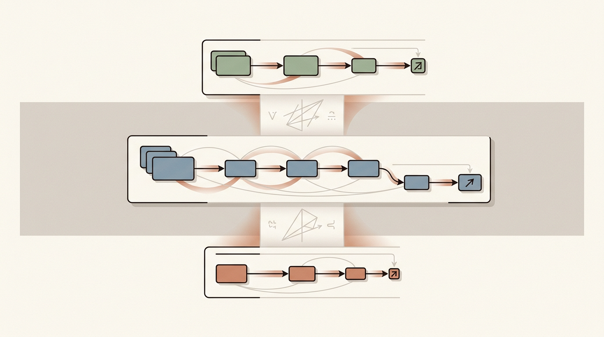
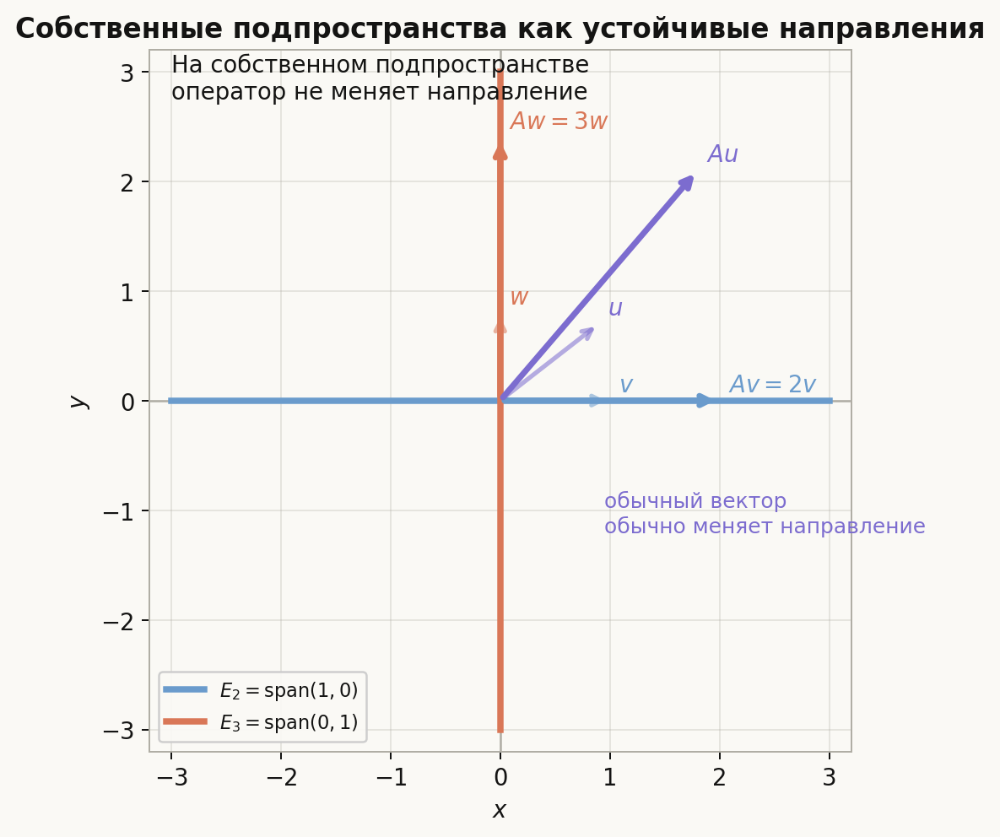
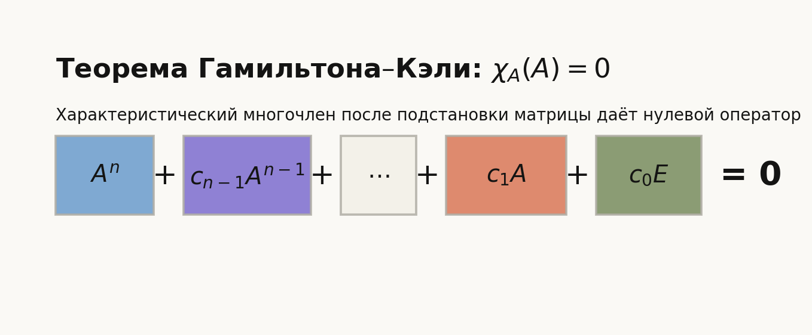
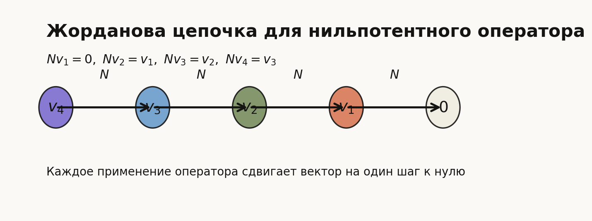
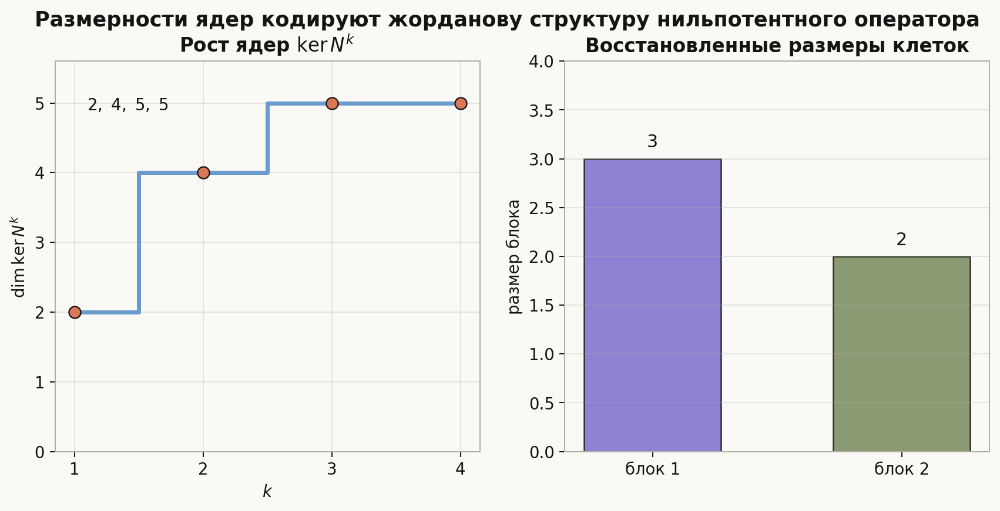
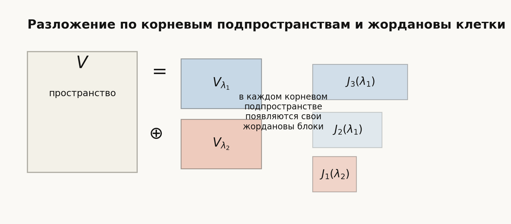

# Лекция: теорема Гамильтона–Кэли, нильпотентные операторы и жорданова форма

## План

0. Общий алгоритм нахождения собственных значений и векторов
1. Зачем нужна жорданова форма
2. Собственные значения, собственные векторы и диагонализация
3. Характеристический многочлен
4. Теорема Гамильтона–Кэли
5. Первые следствия теоремы Гамильтона–Кэли
6. Нильпотентный оператор
7. Характеристический многочлен нильпотентного оператора
8. Жорданов блок и жорданова цепочка
9. Почему нильпотентный оператор имеет жорданову форму
10. Единственность жордановой формы для нильпотентного оператора
11. Корневые подпространства
12. Разложение пространства в прямую сумму корневых подпространств
13. Жорданова форма общего оператора
14. Как восстанавливать размеры жордановых клеток
15. Что важно для поступления в ШАД
16. Типичные ошибки
17. Итог
18. Вопросы для самопроверки



---

## 0. Общий алгоритм нахождения собственных значений и векторов

Если дана матрица $A$, то общий алгоритм такой:

1. **Найти характеристический многочлен**
   $$
   \chi_A(\lambda)=\det(\lambda E-A).
   $$

2. **Найти собственные значения** как корни уравнения
   $$
   \chi_A(\lambda)=0.
   $$
   Для каждого корня сразу полезно отметить его **алгебраическую кратность**.

3. **Для каждого собственного значения $\lambda$ найти собственные векторы**:
   нужно решить однородную систему
   $$
   (A-\lambda E)x=0.
   $$
   Все её решения образуют собственное подпространство
   $$
   E_\lambda=\ker(A-\lambda E).
   $$

4. **Взять базис в каждом $E_\lambda$**. Базисные векторы и будут набором линейно независимых собственных векторов для данного $\lambda$.

5. **Проверить, хватает ли собственных векторов**. Если сумма размерностей всех собственных подпространств равна $n$ (размеру пространства), то из найденных собственных векторов можно составить базис, и матрица диагонализуема.

6. **Если собственных векторов не хватает**, то матрица не диагонализуется. Тогда нужно переходить к обобщённым собственным векторам и жордановой форме — именно этим мы и займёмся дальше в лекции.

Коротко:  
**собственные значения** ищутся из уравнения $\det(\lambda E-A)=0$, а **собственные векторы** для каждого найденного $\lambda$ ищутся как решения системы $(A-\lambda E)x=0$.

---

## 1. Зачем нужна жорданова форма

Для линейного оператора удобно иметь как можно более простой вид его матрицы. В лучшем случае оператор диагонализуется, то есть в подходящем базисе имеет диагональную матрицу. Тогда всё ясно:

- собственные значения стоят на диагонали;
- степени матрицы легко считать;
- поведение оператора прозрачно.

### Почему степени матриц так важны

Типичный пример: нужно найти $A^{100}$ или вычислить $A^n$ в общем виде. Для произвольной матрицы это трудно, но если удаётся диагонализировать $A = CDC^{-1}$, то
$$
A^k = (CDC^{-1})^k = C D^k C^{-1},
$$
и возведение в степень сводится к возведению чисел на диагонали $D$ в степень:
$$
D^k = \begin{pmatrix}\lambda_1^k & & \\ & \ddots & \\ & & \lambda_n^k\end{pmatrix}.
$$

Это вычисляется мгновенно. Именно поэтому диагонализация — главная цель.

Если диагонализировать не получается, жорданова форма даёт следующий по простоте вариант: на каждом жордановом блоке степень тоже вычисляется по явной формуле (см. раздел 8).

Но не всякий оператор диагонализуем. Тогда следующим естественным нормальным видом становится **жорданова форма**.

Идея жордановой формы такая:

- пространство раскладывается на простые инвариантные куски;
- на каждом куске оператор выглядит как "собственное значение плюс очень простой сдвиг";
- этот сдвиг как раз и задаётся нильпотентной частью.

Поэтому тема естественно состоит из трёх связанных сюжетов:

1. теорема Гамильтона–Кэли;
2. нильпотентные операторы;
3. жорданова форма сначала для нильпотентного, а потом и для общего оператора.

---

## 2. Собственные значения, собственные векторы и диагонализация

Перед жордановой формой нужно вспомнить главный язык линейных операторов: собственные векторы.

### Собственный вектор

Пусть $\varphi\colon V\to V$ — линейный оператор. Ненулевой вектор $v\in V$ называется **собственным вектором** оператора $\varphi$, если существует число $\lambda$ такое, что
$$
\varphi(v)=\lambda v.
$$

Число $\lambda$ называется **собственным значением**.

### Интуиция

Обычно оператор может менять и длину, и направление вектора. Собственный вектор — это особый вектор, направление которого оператор не меняет: он только растягивает, сжимает или меняет знак.

Если $v$ — собственный вектор с собственным значением $\lambda$, то действие оператора на прямой $\operatorname{span}(v)$ устроено очень просто:
$$
v\mapsto \lambda v.
$$

Именно поэтому собственные векторы так важны: они дают одномерные направления, на которых оператор уже понятен.

### Собственное подпространство

Для собственного значения $\lambda$ множество всех собственных векторов с этим значением вместе с нулём равно
$$
E_\lambda=\ker(\varphi-\lambda E).
$$

Это подпространство называется **собственным подпространством**.

### Почему это именно подпространство

Если $v$ и $w$ — собственные векторы с одним и тем же собственным значением $\lambda$, то
$$
\varphi(v)=\lambda v,\qquad \varphi(w)=\lambda w.
$$

Тогда для любых чисел $\alpha,\beta$:
$$
\varphi(\alpha v+\beta w)=\alpha\varphi(v)+\beta\varphi(w)=\lambda(\alpha v+\beta w).
$$

Значит, любая линейная комбинация таких векторов снова остаётся в том же собственном подпространстве.

Важно: собственное подпространство — это не один собственный вектор, а **все направления**, на которых оператор действует одинаково: умножает на одно и то же число $\lambda$.

### Пример: два собственных подпространства в плоскости

Рассмотрим оператор в $\mathbb{R}^2$ с матрицей
$$
A=\begin{pmatrix}2 & 0\\ 0 & 3\end{pmatrix}.
$$

Для вектора $(x,y)$ имеем
$$
A(x,y)=(2x,3y).
$$

Если $y=0$, то
$$
A(x,0)=(2x,0)=2(x,0).
$$

Значит, вся ось $Ox$ является собственным подпространством для $\lambda=2$:
$$
E_2=\operatorname{span}\{(1,0)\}.
$$

Если $x=0$, то
$$
A(0,y)=(0,3y)=3(0,y).
$$

Значит, вся ось $Oy$ является собственным подпространством для $\lambda=3$:
$$
E_3=\operatorname{span}\{(0,1)\}.
$$



На рисунке важно не то, что выбран один конкретный вектор на оси, а то, что **любая** точка на этой оси остаётся на той же оси после применения оператора.

### Диагонализация

Если в пространстве можно выбрать базис из собственных векторов оператора, то матрица оператора в этом базисе диагональна:
$$
\operatorname{diag}(\lambda_1,\dots,\lambda_n).
$$

В этом случае оператор называется **диагонализуемым**.

Диагонализация — это лучший возможный сценарий: всё пространство раскладывается в прямую сумму одномерных собственных направлений, и оператор действует на каждом направлении независимо.

### Когда диагонализация ломается

Проблема возникает, когда собственных векторов не хватает для базиса.

Например,
$$
A=\begin{pmatrix}2 & 1\\ 0 & 2\end{pmatrix}.
$$

Единственное собственное значение этой матрицы равно $2$. Найдём собственные векторы:
$$
A-2E=\begin{pmatrix}0 & 1\\ 0 & 0\end{pmatrix}.
$$

Условие $(A-2E)v=0$ даёт $v_2=0$, поэтому
$$
E_2=\operatorname{span}\{(1,0)\}.
$$

Собственное подпространство одномерно, а пространство двумерно. Значит, базис из собственных векторов выбрать нельзя, и оператор не диагонализуем.

### Алгебраическая и геометрическая кратности

У собственного значения есть две важные кратности.

**Алгебраическая кратность** — это кратность корня $\lambda$ в характеристическом многочлене.

**Геометрическая кратность** — это размерность собственного подпространства:
$$
\dim\ker(\varphi-\lambda E).
$$

Для диагонализации нужно, чтобы по каждому собственному значению хватало собственных векторов. Иначе говоря, геометрические кратности должны давать достаточно векторов для базиса.

### Зачем после этого нужна жорданова форма

Если собственных векторов хватает, мы получаем диагональную форму.

Если собственных векторов не хватает, жорданова форма предлагает замену: добавить к собственным векторам **присоединённые векторы**. Они уже не являются собственными, но образуют цепочки, которые позволяют построить почти диагональный базис.

Именно поэтому жордановы цепочки появляются не внезапно: они являются способом заменить недостающие собственные векторы.

---

## 3. Характеристический многочлен

Пусть $\varphi\colon V\to V$ — линейный оператор в конечномерном пространстве $V$, а $A$ — его матрица в некотором базисе.

### Определение

Характеристическим многочленом оператора $\varphi$ называется многочлен
$$
\chi_\varphi(\lambda)=\det(\lambda E-A).
$$

Если размерность пространства равна $n$, то $\chi_\varphi(\lambda)$ имеет степень $n$.

### Почему он важен

Его корни — это собственные значения оператора. Именно он будет главным объектом в теореме Гамильтона–Кэли и в построении жордановой формы.

### Пример

Если
$$
A=\begin{pmatrix}
2 & 1\\
0 & 2
\end{pmatrix},
$$
то
$$
\chi_A(\lambda)=\det\begin{pmatrix}
\lambda-2 & -1\\
0 & \lambda-2
\end{pmatrix}=(\lambda-2)^2.
$$

Значит, единственное собственное значение равно $2$ и имеет алгебраическую кратность $2$.

---

## 4. Теорема Гамильтона–Кэли

### Формулировка

Всякий линейный оператор удовлетворяет своему характеристическому многочлену:
$$
\chi_\varphi(\varphi)=0.
$$

В матричной записи:
$$
\chi_A(A)=0.
$$

Здесь важно понимать, что в многочлен $\chi_A(\lambda)$ вместо переменной $\lambda$ подставляется матрица $A$, а свободный член трактуется как кратный единичной матрице.

### Что это означает на практике

Если
$$
\chi_A(\lambda)=\lambda^n+c_{n-1}\lambda^{n-1}+\dots+c_1\lambda+c_0,
$$
то
$$
A^n+c_{n-1}A^{n-1}+\dots+c_1A+c_0E=0.
$$



### Пример

Для матрицы
$$
A=\begin{pmatrix}
2 & 1\\
0 & 2
\end{pmatrix}
$$
характеристический многочлен равен
$$
\chi_A(\lambda)=(\lambda-2)^2=\lambda^2-4\lambda+4.
$$

По теореме Гамильтона–Кэли имеем
$$
A^2-4A+4E=0.
$$

Это нетрудно проверить прямым вычислением:
$$
A^2=\begin{pmatrix}
4 & 4\\
0 & 4
\end{pmatrix},
$$
поэтому
$$
A^2-4A+4E=\begin{pmatrix}
4 & 4\\
0 & 4
\end{pmatrix}
-\begin{pmatrix}
8 & 4\\
0 & 8
\end{pmatrix}
+\begin{pmatrix}
4 & 0\\
0 & 4
\end{pmatrix}
=0.
$$

---

## 5. Первые следствия теоремы Гамильтона–Кэли

### 5.1. Высокие степени матрицы выражаются через меньшие

Если оператор действует в $n$-мерном пространстве, то всякая степень $A^m$ при $m\ge n$ выражается через
$$
E,\ A,\ A^2,\ \dots,\ A^{n-1}.
$$

Это полезно при вычислении степеней матриц и рекуррентных формул.

### 5.2. Формула для обратной матрицы

Если $A$ обратима, то из теоремы Гамильтона–Кэли можно выразить $A^{-1}$ как многочлен от $A$ степени не выше $n-1$.

Действительно, если
$$
\chi_A(\lambda)=\lambda^n+c_{n-1}\lambda^{n-1}+\dots+c_1\lambda+c_0
$$
и $c_0\ne 0$, то
$$
A^n+c_{n-1}A^{n-1}+\dots+c_1A+c_0E=0.
$$

Умножая на $A^{-1}$, получаем выражение для $A^{-1}$ через степени $A$.

### 5.3. Любой аннулирующий многочлен связан с жордановой структурой

Если многочлен $p$ такой, что
$$
p(A)=0,
$$
то из разложения $p$ на множители уже можно получить существенную информацию о собственных значениях, корневых подпространствах и жордановых клетках.

---

## 6. Нильпотентный оператор

### Определение

Оператор $N\colon V\to V$ называется **нильпотентным**, если существует натуральное число $m$ такое, что
$$
N^m=0.
$$

Минимальное такое $m$ называют индексом нильпотентности.

### Простейший пример

Матрица
$$
N=\begin{pmatrix}
0 & 1 & 0\\
0 & 0 & 1\\
0 & 0 & 0
\end{pmatrix}
$$
нильпотентна, потому что
$$
N^3=0,
$$
но
$$
N^2\ne 0.
$$

### Интуиция

Нильпотентный оператор с каждым применением "сдвигает" векторы вниз по цепочке, и через конечное число шагов все векторы попадают в нуль.

---

## 7. Характеристический многочлен нильпотентного оператора

Если оператор $N$ нильпотентен, то все его собственные значения равны нулю.

### Доказательство

Пусть
$$
Nv=\lambda v,\qquad v\ne 0.
$$

Тогда
$$
N^m v=\lambda^m v.
$$

Но так как $N^m=0$, получаем
$$
0=N^m v=\lambda^m v.
$$

Поскольку $v\ne 0$, отсюда следует
$$
\lambda^m=0,
$$
значит
$$
\lambda=0.
$$

Итак, единственное собственное значение нильпотентного оператора — это $0$.

Следовательно, если $\dim V=n$, то характеристический многочлен имеет вид
$$
\chi_N(\lambda)=\lambda^n.
$$

### Почему это важно

Это означает, что для нильпотентного оператора вся жорданова форма состоит только из клеток с нулём на диагонали.

---

## 8. Жорданов блок и жорданова цепочка

В предыдущем разделе мы увидели главную причину появления жордановой формы: собственных векторов может не хватить для диагонального базиса.

Жорданова форма предлагает следующий лучший вариант: оставить собственные векторы там, где они есть, и дополнить их присоединёнными векторами. Эти присоединённые векторы образуют цепочки, а каждая такая цепочка даёт один жорданов блок.

### Главная интуиция

Жорданова форма нужна, чтобы отделить в операторе две части:

- собственное значение $\lambda$, которое отвечает за "основное масштабирование";
- нильпотентный сдвиг, который отвечает за недиагонализуемость.

На одном жордановом блоке оператор действует примерно как
$$
\lambda E + \text{сдвиг вдоль цепочки}.
$$

То есть жорданова форма показывает не просто спектр оператора, а **как именно устроена его недиагонализуемость**.

### Жорданов блок

Жорданов блок размера $k$ с собственным значением $\lambda$ — это матрица
$$
J_k(\lambda)=
\begin{pmatrix}
\lambda & 1 & 0 & \dots & 0\\
0 & \lambda & 1 & \dots & 0\\
\vdots & \vdots & \vdots & \ddots & \vdots\\
0 & 0 & 0 & \dots & 1\\
0 & 0 & 0 & \dots & \lambda
\end{pmatrix}.
$$

Для нильпотентного оператора это просто блок
$$
J_k(0).
$$

### Ключевое разложение: $J_k(\lambda) = \lambda E + N$

Жорданов блок можно записать как сумму двух слагаемых:
$$
J_k(\lambda) = \lambda E + N,
$$
где $N$ — нильпотентная матрица сдвига (единицы прямо над главной диагональю):
$$
N = \begin{pmatrix}
0 & 1 & 0 & \dots & 0 \\
0 & 0 & 1 & \dots & 0 \\
\vdots & & & \ddots & \vdots \\
0 & 0 & 0 & \dots & 1 \\
0 & 0 & 0 & \dots & 0
\end{pmatrix}, \qquad N^k = 0.
$$

Матрицы $\lambda E$ и $N$ **коммутируют**: $\lambda E \cdot N = N \cdot \lambda E$. Поэтому к $(\lambda E + N)^m$ применяется формула бинома Ньютона:
$$
J_k(\lambda)^m = (\lambda E + N)^m = \sum_{i=0}^{m}\binom{m}{i}\lambda^{m-i}N^i.
$$

Поскольку $N^k = 0$, все слагаемые при $i \ge k$ равны нулю, и сумма обрывается:
$$
J_k(\lambda)^m = \sum_{i=0}^{\min(m,\,k-1)}\binom{m}{i}\lambda^{m-i}N^i.
$$

В явном виде матрица $J_k(\lambda)^m$ выглядит так:
$$
J_k(\lambda)^m =
\begin{pmatrix}
\lambda^m & \dbinom{m}{1}\lambda^{m-1} & \dbinom{m}{2}\lambda^{m-2} & \cdots \\[6pt]
0 & \lambda^m & \dbinom{m}{1}\lambda^{m-1} & \cdots \\[6pt]
0 & 0 & \lambda^m & \cdots \\
\vdots & & & \ddots
\end{pmatrix}.
$$

Это объясняет, почему жорданова форма практически полезна: на каждом блоке возведение в степень сводится к биномиальным коэффициентам и степеням одного числа $\lambda$. Именно поэтому $A^k$ вычисляется легко даже когда $A$ не диагонализуема.

### Как читать жорданов блок

Если бы над диагональю не было единиц, то это была бы просто диагональная матрица:
$$
\lambda E.
$$

Единицы над диагональю означают, что соседние базисные векторы связаны между собой, и оператор уже не действует независимо на каждом из них.

Поэтому один жорданов блок можно понимать так:

- на диагонали стоит собственное значение $\lambda$;
- над диагональю стоит минимальная "поправка", которая делает оператор недиагонализуемым;
- размер блока показывает, насколько длинна эта связь между векторами.

### Жорданова цепочка

Для собственного значения $\lambda$ жорданова цепочка длины $k$ — это набор векторов
$$
v_1,\dots,v_k,
$$
для которых
$$
(\varphi-\lambda E)v_1=0,
$$
$$
(\varphi-\lambda E)v_2=v_1,
$$
$$
(\varphi-\lambda E)v_3=v_2,
$$
и так далее,
$$
(\varphi-\lambda E)v_k=v_{k-1}.
$$

Для нильпотентного оператора это упрощается до
$$
Nv_1=0,\qquad Nv_2=v_1,\qquad \dots,\qquad Nv_k=v_{k-1}.
$$

### Конкретный пример цепочки

Возьмём нильпотентный оператор в $\mathbb{R}^3$ с матрицей
$$
N=\begin{pmatrix}0 & 1 & 0\\ 0 & 0 & 1\\ 0 & 0 & 0\end{pmatrix}.
$$

Применим $N$ к стандартным базисным векторам:
$$
Ne_1=\begin{pmatrix}0\\0\\0\end{pmatrix},\qquad Ne_2=\begin{pmatrix}1\\0\\0\end{pmatrix}=e_1,\qquad Ne_3=\begin{pmatrix}0\\1\\0\end{pmatrix}=e_2.
$$

Получили цепочку длины $3$:
$$
e_3 \;\xrightarrow{N}\; e_2 \;\xrightarrow{N}\; e_1 \;\xrightarrow{N}\; 0.
$$

Это и есть жорданова цепочка с $v_1=e_1, v_2=e_2, v_3=e_3$. Действие $N$ "сдвигает" каждый следующий вектор в предыдущий, а первый — в нуль. Матрица оператора в этом базисе и есть жорданов блок $J_3(0)$.

### Как это понимать без формализма

Вектор $v_1$ — это обычный собственный вектор:
$$
(\varphi-\lambda E)v_1=0.
$$

Вектор $v_2$ уже не собственный, но после применения оператора $\varphi-\lambda E$ он превращается в собственный:
$$
(\varphi-\lambda E)v_2=v_1.
$$

Вектор $v_3$ ещё на один шаг дальше: он не собственный, но после одного применения превращается в $v_2$, после второго — в $v_1$, а после третьего — в нуль.

Говорят, что вектор $v_j$ в цепочке имеет **высоту** $j$: это минимальное число применений оператора $\varphi - \lambda E$, которое переводит вектор в нуль. Таким образом:

- $v_1$ — высота $1$ (собственный вектор);
- $v_2$ — высота $2$;
- $v_j$ — высота $j$.

Именно поэтому жорданову цепочку удобно понимать как цепочку "почти собственных векторов":

- первый уже собственный;
- второй становится собственным после одного применения $\varphi-\lambda E$;
- третий — после двух;
- и так далее.

Для нильпотентного оператора это особенно наглядно: оператор просто сдвигает векторы по цепочке к нулю.



### Почему цепочка даёт блок

В базисе
$$
v_1,\dots,v_k
$$
матрица ограничения оператора на эту цепочку как раз и имеет жорданов вид.

Это очень важный момент: жорданов блок не берётся "из воздуха". Он возникает именно потому, что в пространстве удалось подобрать цепочку векторов, на которых оператор действует по простому правилу:

- почти как умножение на $\lambda$;
- плюс переход к предыдущему вектору цепочки.

Итак, жорданов блок — это просто матрическая запись действия оператора на одной жордановой цепочке.

---

## 9. Почему нильпотентный оператор имеет жорданову форму

Идея доказательства состоит в следующем.

### Шаг 1. Рассматриваем цепочку ядер

Для нильпотентного оператора $N$ имеем возрастающую цепочку подпространств:
$$
\ker N \subseteq \ker N^2 \subseteq \ker N^3 \subseteq \dots
$$

Так как пространство конечномерно, эта цепочка стабилизируется, а при нильпотентности в некоторый момент становится всем пространством:
$$
\ker N^m=V.
$$

### Шаг 2. Смотрим, сколько новых векторов появляется на каждом уровне

Разности размерностей
$$
\dim\ker N^k-\dim\ker N^{k-1}
$$
показывают, сколько цепочек имеют длину хотя бы $k$.

Это место часто кажется абстрактным, поэтому полезно проговорить смысл.

Если вектор лежит в $\ker N$, то он умирает за один шаг.  
Если вектор лежит в $\ker N^2$, но не лежит в $\ker N$, то он умирает за два шага.  
Если вектор лежит в $\ker N^3$, но не лежит в $\ker N^2$, то ему нужно три шага, и так далее.

Поэтому рост ядер показывает, сколько в пространстве есть длинных цепочек.

### Шаг 3. Строим базис из цепочек

Выбирают векторы "на верхушках" цепочек, а затем применяют к ним оператор:
$$
v,\ Nv,\ N^2v,\dots
$$

Так строится базис, в котором матрица нильпотентного оператора распадается в прямую сумму блоков
$$
J_{k_1}(0)\oplus J_{k_2}(0)\oplus \dots \oplus J_{k_s}(0).
$$

Именно это и есть жорданова форма нильпотентного оператора.

### Как читать запись $A \oplus B$ для матриц

Знак $\oplus$ здесь — это **не сумма матриц поэлементно**. Это компактная запись блочно-диагональной матрицы: блок $A$ ставится в левый верхний угол, блок $B$ — в правый нижний, а остальные клетки заполняются нулями:
$$
A \oplus B = \left(\begin{array}{c|c}
A & 0 \\
\hline
0 & B
\end{array}\right).
$$

Размер итоговой матрицы — это **сумма** размеров $A$ и $B$. Например, $J_2(0)\oplus J_1(0)$ — это матрица $3\times 3$, а не $2\times 2$:
$$
J_2(0)\oplus J_1(0)=
\left(\begin{array}{cc|c}
\color{#1565c0}0 & \color{#1565c0}1 & 0\\
\color{#1565c0}0 & \color{#1565c0}0 & 0\\
\hline
0 & 0 & \color{#c62828}0
\end{array}\right).
$$

Здесь синий блок $2\times 2$ — это $J_2(0)$, красная клетка $1\times 1$ — это $J_1(0)$. Все остальные позиции — нули.

Аналогично для трёх блоков $J_3(0)\oplus J_2(0)\oplus J_1(0)$ — это матрица $6\times 6$:
$$
\left(\begin{array}{ccc|cc|c}
\color{#1565c0}0 & \color{#1565c0}1 & \color{#1565c0}0 & 0 & 0 & 0\\
\color{#1565c0}0 & \color{#1565c0}0 & \color{#1565c0}1 & 0 & 0 & 0\\
\color{#1565c0}0 & \color{#1565c0}0 & \color{#1565c0}0 & 0 & 0 & 0\\
\hline
0 & 0 & 0 & \color{#2e7d32}0 & \color{#2e7d32}1 & 0\\
0 & 0 & 0 & \color{#2e7d32}0 & \color{#2e7d32}0 & 0\\
\hline
0 & 0 & 0 & 0 & 0 & \color{#c62828}0
\end{array}\right).
$$

> **Внимание: два смысла знака $\oplus$.**
>
> - $V = U \oplus W$ — прямая сумма **подпространств** (раздел 12). Это про векторные пространства.
> - $A \oplus B$ — блочно-диагональная сборка **матриц** (то, что мы только что обсудили).
>
> Это связанные, но разные вещи. Если оператор $\varphi$ переводит $U$ в $U$ и $W$ в $W$, то на $V = U \oplus W$ в подходящем базисе его матрица — ровно $A \oplus B$, где $A$ — действие $\varphi$ на $U$, а $B$ — на $W$.

### Пример: оператор с двумя цепочками

Чтобы шаги выше стали конкретными, разберём пример. Рассмотрим
$$
N=\begin{pmatrix}0 & 1 & 0\\ 0 & 0 & 0\\ 0 & 0 & 0\end{pmatrix}.
$$

**Шаг 1. Считаем ядра.**

Уравнение $Nv=0$ в координатах $v=(v_1,v_2,v_3)$ даёт $v_2=0$. Значит,
$$
\ker N=\operatorname{span}(e_1,e_3),\qquad \dim\ker N=2.
$$

Прямой проверкой $N^2=0$, поэтому
$$
\ker N^2=\mathbb{R}^3,\qquad \dim\ker N^2=3.
$$

**Шаг 2. Считаем разности.**

Положим $d_0=0,\; d_1=2,\; d_2=3$. Тогда:

- блоков длины $\ge 1$: $d_1-d_0=2$;
- блоков длины $\ge 2$: $d_2-d_1=1$;
- блоков длины $\ge 3$: $0$.

Вывод: один блок длины ровно $2$ и один блок длины ровно $1$.

**Шаг 3. Строим цепочки.**

Длинная цепочка должна стартовать с вектора высоты $2$ — то есть из $\ker N^2\setminus\ker N$. Возьмём $e_2$:
$$
e_2 \;\xrightarrow{N}\; e_1 \;\xrightarrow{N}\; 0.
$$

Получили цепочку длины $2$: векторы $v_1=e_1, v_2=e_2$.

Теперь дополняем базис вектором из $\ker N$, не лежащим на этой цепочке. Подходит $e_3$:
$$
e_3 \;\xrightarrow{N}\; 0.
$$

Это цепочка длины $1$: вектор $v_3=e_3$.

**Шаг 4. Проверяем результат.**

В базисе $(e_1,e_2,e_3)$ матрица $N$ выглядит как $J_2(0)\oplus J_1(0)$. Если выделить блоки:
$$
N=\left(\begin{array}{cc|c}
\color{#1565c0}0 & \color{#1565c0}1 & 0\\
\color{#1565c0}0 & \color{#1565c0}0 & 0\\
\hline
0 & 0 & \color{#c62828}0
\end{array}\right).
$$

Синий блок отвечает первой цепочке $(e_1,e_2)$, красный — второй цепочке $(e_3)$. Это совпадает с исходной матрицей — она уже была в жордановой форме в стандартном базисе. На этом мини-примере хорошо видно, как именно работают «верхушки цепочек» из шага 3 общего рассуждения: верхушки — это представители факторпространства $\ker N^k/\ker N^{k-1}$.

---

## 10. Единственность жордановой формы для нильпотентного оператора

Сама матрица жордановой формы зависит от порядка блоков, но **набор размеров блоков** определяется однозначно.

### Главная идея

Размерности ядер
$$
\dim\ker N,\qquad \dim\ker N^2,\qquad \dim\ker N^3,\dots
$$
однозначно восстанавливают числа жордановых блоков каждого размера.

### Связка: высота вектора и уровень ядра

Прежде чем выводить формулы, важно увидеть простую связь. Вектор $v$ имеет высоту $\le k$ ровно тогда, когда $N^k v=0$. Поэтому
$$
\ker N^k=\{v:\operatorname{ht}(v)\le k\}.
$$

Подняться с уровня $k-1$ на уровень $k$ — значит добавить векторы высоты ровно $k$:
$$
d_k-d_{k-1}=\#\{\text{векторов высоты ровно }k\text{ в любом цепочечном базисе}\}.
$$

А каждый такой вектор — это «$k$-я ступенька» какой-то цепочки. Цепочка имеет ступеньку $k$ тогда и только тогда, когда её длина не меньше $k$. Значит,
$$
d_k-d_{k-1}=\#\{\text{цепочек длины }\ge k\}.
$$

### Диаграмма Юнга

Эту картину удобно нарисовать. Каждый жорданов блок изображается как столбик из клеток: блок длины $k$ — столбик высоты $k$. Расставим столбики рядом по убыванию высоты. Получится «лестница», которая называется **диаграммой Юнга**.

Возьмём $J_3(0)\oplus J_2(0)\oplus J_1(0)$. Сама матрица с выделенными блоками выглядит так:
$$
\left(\begin{array}{ccc|cc|c}
\color{#1565c0}0 & \color{#1565c0}1 & \color{#1565c0}0 & 0 & 0 & 0\\
\color{#1565c0}0 & \color{#1565c0}0 & \color{#1565c0}1 & 0 & 0 & 0\\
\color{#1565c0}0 & \color{#1565c0}0 & \color{#1565c0}0 & 0 & 0 & 0\\
\hline
0 & 0 & 0 & \color{#2e7d32}0 & \color{#2e7d32}1 & 0\\
0 & 0 & 0 & \color{#2e7d32}0 & \color{#2e7d32}0 & 0\\
\hline
0 & 0 & 0 & 0 & 0 & \color{#c62828}0
\end{array}\right).
$$

А диаграмма Юнга для неё — три столбика клеток высотой $3, 2, 1$ (читать снизу вверх):

```
■                ← высота 3 (только синий блок)
■  ■             ← высота 2 (синий + зелёный)
■  ■  ■          ← высота 1 (синий + зелёный + красный)
─────────────
синий зелёный красный
длина:  3      2      1
```

Цвет столбика в диаграмме соответствует цвету блока в матрице: синий столбик высоты $3$ — это $J_3(0)$, зелёный высоты $2$ — это $J_2(0)$, красный высоты $1$ — это $J_1(0)$.

Свойства диаграммы:

- общее число клеток равно $\dim V$;
- $k$-я строка снизу — это все клетки высоты $\ge k$;
- длина $k$-й строки снизу = число столбиков высотой $\ge k$ = число блоков длины $\ge k$.

Теперь видно, что **строка $k$ диаграммы Юнга и есть приращение $d_k-d_{k-1}$**. Поэтому формулы получаются почти автоматически.

### Как это работает

Пусть
$$
d_k=\dim\ker N^k.
$$

Тогда:

- число блоков длины хотя бы $k$ равно $d_k-d_{k-1}$ (длина $k$-й строки диаграммы);
- число блоков длины ровно $k$ равно
$$
(d_k-d_{k-1})-(d_{k+1}-d_k)
$$
(разность длин соседних строк — это число столбиков, обрывающихся ровно на высоте $k$).



### Пример

Если
$$
\dim\ker N=2,\qquad \dim\ker N^2=4,\qquad \dim\ker N^3=5,
$$
а размерность пространства равна $5$, то:

- блоков длины хотя бы $1$ две штуки;
- блоков длины хотя бы $2$ тоже две;
- блоков длины хотя бы $3$ одна.

Значит, размеры блоков равны
$$
3 \text{ и } 2.
$$

Итак, жорданова форма нильпотентного оператора единственна с точностью до перестановки блоков.

---

## 11. Корневые подпространства

Пусть $\lambda$ — собственное значение оператора $\varphi$.

### Корневой вектор и его высота

Ненулевой вектор $v$ называется **корневым вектором** оператора $\varphi$ для собственного значения $\lambda$, если существует натуральное $p$ такое, что
$$
(\varphi - \lambda E)^p v = 0.
$$

**Высотой** корневого вектора $v$ называется наименьшее такое $p$:
$$
\operatorname{ht}(v) = \min\bigl\{p \in \mathbb{N} \mid (\varphi - \lambda E)^p v = 0\bigr\}.
$$

Примеры:
- собственный вектор — это корневой вектор высоты $1$;
- вектор высоты $2$ — не собственный, но $(\varphi-\lambda E)v$ уже собственный;
- вектор высоты $p$ — переходит в нуль ровно за $p$ применений оператора $\varphi - \lambda E$.

В жордановой цепочке $v_1, \dots, v_k$ вектор $v_j$ имеет высоту ровно $j$. Высота вектора показывает его положение в цепочке и длину цепочки, которой он принадлежит.

> **Терминология.** Корневой вектор высоты $\ge 2$ (то есть не собственный) часто называют **присоединённым вектором**. Это тот же объект — просто другое название для «нижних ступенек» цепочки, отличных от собственного вектора.

### Конкретный пример: вычисляем корневые векторы

Возьмём $A=\begin{pmatrix}2 & 1\\ 0 & 2\end{pmatrix}$ с единственным собственным значением $\lambda=2$. Тогда
$$
A-2E=\begin{pmatrix}0 & 1\\ 0 & 0\end{pmatrix},\qquad (A-2E)^2=\begin{pmatrix}0 & 0\\ 0 & 0\end{pmatrix}.
$$

Проверим высоты стандартных базисных векторов.

- $v_1=(1,0)^T$: 
$$
(A-2E)v_1=\begin{pmatrix}0\\0\end{pmatrix}.
$$
Это вектор **высоты $1$** — собственный.

- $v_2=(0,1)^T$:
$$
(A-2E)v_2=\begin{pmatrix}1\\0\end{pmatrix}=v_1\ne 0,\qquad (A-2E)^2 v_2=0.
$$
Это вектор **высоты $2$** — корневой, но не собственный.

Заметим: $(A-2E)v_2=v_1$ — то есть $(v_1,v_2)$ образует жорданову цепочку длины $2$. Корневое подпространство
$$
V_2=\ker(A-2E)^2=\mathbb{R}^2
$$
состоит из всех векторов высоты $\le 2$. В нашем случае это всё пространство.

### Определение

Подпространство
$$
V_\lambda=\ker(\varphi-\lambda E)^m
$$
при достаточно большом $m$ называется **корневым подпространством** для собственного значения $\lambda$.

В конечномерном пространстве достаточно взять $m=\dim V$, но обычно берут минимальное число, начиная с которого ядра стабилизируются.

### Почему оно важно

Если обычное собственное подпространство
$$
\ker(\varphi-\lambda E)
$$
содержит только собственные векторы, то корневое подпространство содержит все векторы, которые входят в жордановы цепочки для значения $\lambda$.

Именно поэтому корневое подпространство важнее простого собственного подпространства, когда оператор недиагонализуем.

Собственные векторы сами по себе видят только "чистые" направления. Но если есть жордановы клетки размера больше $1$, то в операторе есть ещё и присоединённые векторы, которые не являются собственными, но входят в цепочки. Они как раз и лежат в корневом подпространстве.

### Пример

Для матрицы
$$
A=\begin{pmatrix}
2 & 1\\
0 & 2
\end{pmatrix}
$$
собственное подпространство для $\lambda=2$ одномерно:
$$
\ker(A-2E)=\operatorname{span}\{(1,0)\},
$$
но корневое подпространство равно всему пространству:
$$
\ker(A-2E)^2=\mathbb{R}^2.
$$

Именно поэтому оператор не диагонализуется, но имеет жорданову клетку размера $2$.

---

## 12. Разложение пространства в прямую сумму корневых подпространств

Если характеристический многочлен раскладывается на линейные множители:
$$
\chi_\varphi(\lambda)=\prod_{i=1}^s (\lambda-\lambda_i)^{m_i},
$$
то пространство раскладывается в прямую сумму корневых подпространств:
$$
V=V_{\lambda_1}\oplus V_{\lambda_2}\oplus \dots \oplus V_{\lambda_s}.
$$

### Почему это так важно

Это позволяет изучать оператор по отдельности на каждом корневом подпространстве. А на каждом таком куске оператор имеет вид
$$
\varphi=\lambda E + N,
$$
где $N$ нильпотентен.

То есть общий оператор раскладывается на независимые части по собственным значениям, а вся сложность внутри каждой части сводится к нильпотентному случаю.

Это и есть главный стратегический смысл всей темы:

1. сначала отделяем разные собственные значения;
2. внутри каждого собственного значения изучаем только нильпотентную часть;
3. нильпотентная часть уже кодируется жордановыми цепочками.

Итак, общий случай сводится к нильпотентному.



---

## 13. Жорданова форма общего оператора

Теперь можно сформулировать общую картину.

### Формулировка

Если характеристический многочлен оператора над рассматриваемым полем раскладывается на линейные множители, то существует базис, в котором матрица оператора имеет блочно-диагональный вид:
$$
J=\operatorname{diag}\bigl(J_{k_1}(\lambda_1),\dots,J_{k_r}(\lambda_r)\bigr).
$$

Это и есть **жорданова форма** оператора.

### Что стоит на диагонали

На диагонали стоят собственные значения:

- одинаковые значения собираются в группы блоков;
- над диагональю внутри каждого блока стоят единицы;
- вне блоков стоят нули.

### Когда оператор диагонализуем

Оператор диагонализуем тогда и только тогда, когда все жордановы блоки имеют размер $1$.

То есть отсутствие блоков размера больше единицы эквивалентно диагонализуемости.

---

## 14. Как восстанавливать размеры жордановых клеток

Это один из самых полезных вычислительных сюжетов.

### 14.1. Для нильпотентного оператора

Нужно смотреть на размеры ядер:
$$
\dim\ker N,\qquad \dim\ker N^2,\qquad \dim\ker N^3,\dots
$$

Они дают число блоков длины хотя бы $k$.

### 14.2. Для фиксированного собственного значения $\lambda$

Нужно рассматривать оператор
$$
N_\lambda=\varphi-\lambda E
$$
на корневом подпространстве $V_\lambda$.

Тогда размеры блоков для значения $\lambda$ восстанавливаются по числам
$$
\dim\ker(\varphi-\lambda E),\qquad \dim\ker(\varphi-\lambda E)^2,\qquad \dots
$$

### Пример

Пусть для собственного значения $\lambda=3$ известно, что
$$
\dim\ker(A-3E)=2,\qquad \dim\ker(A-3E)^2=3,\qquad \dim\ker(A-3E)^3=4.
$$

Тогда:

- блоков длины хотя бы $1$ две;
- блоков длины хотя бы $2$ одна;
- блоков длины хотя бы $3$ одна.

Значит, для собственного значения $3$ имеются блоки размеров
$$
3 \text{ и } 1.
$$

### Почему это полезно

Во многих задачах ШАД не требуется полностью строить жорданов базис, но требуется определить возможную жорданову структуру. Именно размеры ядер степеней обычно дают самый короткий путь.

---

### Полный разобранный пример: матрица $3\times3$

Рассмотрим матрицу
$$
A=\begin{pmatrix}3 & 1 & 0\\-1 & 1 & 0\\ 0 & 0 & 2\end{pmatrix}.
$$

**Шаг 1. Характеристический многочлен.**

Матрица блочно-треугольная: верхний левый блок $\begin{pmatrix}3&1\\-1&1\end{pmatrix}$ и нижний правый $\begin{pmatrix}2\end{pmatrix}$.
$$
\chi_A(\lambda)=\det(\lambda E - A) = \bigl[(\lambda-3)(\lambda-1)+1\bigr]\cdot(\lambda-2)=(\lambda^2-4\lambda+4)(\lambda-2)=(\lambda-2)^3.
$$

Единственное собственное значение $\lambda=2$ с алгебраической кратностью $3$.

**Шаг 2. Размерность ядра $A-2E$.**

$$
A-2E=\begin{pmatrix}1 & 1 & 0\\-1 & -1 & 0\\ 0 & 0 & 0\end{pmatrix}.
$$

Строки попарно пропорциональны: ранг равен $1$. Поэтому
$$
d_1 = \dim\ker(A-2E) = 3 - 1 = 2.
$$

Геометрическая кратность $2$, алгебраическая кратность $3$ — они не совпадают, значит оператор не диагонализуем и есть жордановы блоки.

**Шаг 3. Размерность ядра $(A-2E)^2$.**

$$
(A-2E)^2 = (A-2E)\cdot(A-2E) = \begin{pmatrix}1&1&0\\-1&-1&0\\0&0&0\end{pmatrix}^2.
$$

Вычислим:
$$
\text{строка }1 \cdot (A-2E):\quad [1,1,0]\begin{pmatrix}1&1&0\\-1&-1&0\\0&0&0\end{pmatrix}=[0,0,0].
$$

Аналогично для остальных строк. Таким образом
$$
(A-2E)^2 = 0,
$$
и значит $d_2 = \dim\ker(A-2E)^2 = 3$.

**Шаг 4. Последовательность $d_k$ и размеры блоков.**

$$
d_0=0,\quad d_1=2,\quad d_2=3,\quad d_3=3,\dots
$$

- Блоков длины $\ge 1$: $d_1 - d_0 = 2$.
- Блоков длины $\ge 2$: $d_2 - d_1 = 1$.
- Блоков длины $\ge 3$: $d_3 - d_2 = 0$.

Отсюда:
- блоков длины ровно $1$: $2 - 1 = 1$;
- блоков длины ровно $2$: $1 - 0 = 1$.

**Жорданова форма:**
$$
J = \left(\begin{array}{cc|c}
\color{#1565c0}2 & \color{#1565c0}1 & 0\\
\color{#1565c0}0 & \color{#1565c0}2 & 0\\
\hline
0 & 0 & \color{#c62828}2
\end{array}\right) = J_2(2)\oplus J_1(2).
$$

Синий блок $2\times 2$ — это $J_2(2)$, красная клетка $1\times 1$ — это $J_1(2)$.

**Шаг 5. Строим жорданов базис и матрицу перехода $C$.**

До этого шага мы знали только *структуру* жордановой формы. Теперь нужно построить базис, в котором матрица $A$ её принимает. Этот базис состоит из **жордановых цепочек** — по одной на каждый блок.

*Цепочка длины $2$.* Нужен вектор $u$ высоты $2$: такой, что $(A-2E)u\ne 0$, но $(A-2E)^2 u = 0$. Поскольку в нашем примере $(A-2E)^2 = 0$ для всех векторов, достаточно взять любой $u\notin \ker(A-2E)$. Возьмём $u = e_1 = (1,0,0)^T$:
$$
(A-2E)u = \begin{pmatrix}1 & 1 & 0\\-1 & -1 & 0\\ 0 & 0 & 0\end{pmatrix}\begin{pmatrix}1\\0\\0\end{pmatrix} = \begin{pmatrix}1\\-1\\0\end{pmatrix}\ne 0.
$$

Получаем цепочку длины $2$: вектор высоты $1$ — это $v_1 = (1,-1,0)^T$, вектор высоты $2$ — $v_2 = u = (1,0,0)^T$.

*Цепочка длины $1$.* Нужен ещё один собственный вектор, линейно независимый с $v_1$. Решаем $(A-2E)w=0$: получаем $w_1 + w_2 = 0$, $w_3$ свободно. Помимо $v_1$ из этого ядра выходит ещё $w = (0,0,1)^T$. Это и будет одиночная цепочка.

*Собираем $C$.* Векторы базиса в порядке цепочек идут в столбцы:
$$
C=\bigl(\,\underbrace{v_1\ \big|\ v_2}_{\text{цепочка длины }2}\ \big|\ \underbrace{w}_{\text{цепочка длины }1}\,\bigr)
=\begin{pmatrix}1 & 1 & 0\\ -1 & 0 & 0\\ 0 & 0 & 1\end{pmatrix}.
$$

*Проверка $AC=CJ$.*
$$
AC = \begin{pmatrix}3 & 1 & 0\\-1 & 1 & 0\\ 0 & 0 & 2\end{pmatrix}\begin{pmatrix}1 & 1 & 0\\ -1 & 0 & 0\\ 0 & 0 & 1\end{pmatrix}
=\begin{pmatrix}2 & 3 & 0\\ -2 & -1 & 0\\ 0 & 0 & 2\end{pmatrix},
$$
$$
CJ = \begin{pmatrix}1 & 1 & 0\\ -1 & 0 & 0\\ 0 & 0 & 1\end{pmatrix}\begin{pmatrix}2 & 1 & 0\\ 0 & 2 & 0\\ 0 & 0 & 2\end{pmatrix}
=\begin{pmatrix}2 & 3 & 0\\ -2 & -1 & 0\\ 0 & 0 & 2\end{pmatrix}.
$$

Совпали — значит $A = CJC^{-1}$.

*Обратная матрица.* Нижний правый блок $C$ — единица, верхний левый имеет определитель $1$. Поэтому
$$
C^{-1}=\begin{pmatrix}0 & -1 & 0\\ 1 & 1 & 0\\ 0 & 0 & 1\end{pmatrix}.
$$

> **Замечание о неединственности.** Базис $C$ построен не однозначно: на каждом шаге был свободный выбор. Можно было взять $u = (0,1,0)^T$ — тогда $v_2$ оказался бы другим, и матрица $C$ изменилась бы. Но **жорданова форма $J$ та же самая**: однозначна именно она, а не базис.

**Шаг 6. Возведение в степень.**

Теперь $A^m = C J^m C^{-1}$, где $J^m = J_2(2)^m \oplus J_1(2)^m$.

По формуле раздела 8:
$$
J_2(2)^m = \begin{pmatrix}2^m & m\cdot 2^{m-1}\\ 0 & 2^m\end{pmatrix},\qquad J_1(2)^m = \bigl(2^m\bigr).
$$

Подставив $C$ и $C^{-1}$, получаем явное выражение для $A^m$ при любом $m$ — и это работает даже несмотря на то, что $A$ не диагонализуема.

---

## 15. Что важно для поступления в ШАД

- чётко помнить формулировку теоремы Гамильтона–Кэли;
- уметь подставлять матрицу в многочлен и понимать, что свободный член означает кратный единичной матрице;
- понимать связь между собственными векторами, собственными подпространствами и диагонализацией;
- различать алгебраическую и геометрическую кратности собственного значения;
- знать, что у нильпотентного оператора все собственные значения равны нулю;
- понимать, как выглядит жорданов блок и жорданова цепочка;
- уметь объяснить, почему нильпотентный оператор сводится к блокам $J_k(0)$;
- помнить, что размеры жордановых блоков восстанавливаются по ядрам степеней;
- различать собственное и корневое подпространства;
- понимать, что общий оператор раскладывается по корневым подпространствам;
- знать критерий диагонализуемости через размеры жордановых клеток.

---

## 16. Типичные ошибки

### Ошибка 1

Считать, что всякий оператор с одним собственным значением автоматически диагонализуем.

Это неверно: например, один жорданов блок размера больше $1$ уже разрушает диагонализуемость.

### Ошибка 2

Путать собственное подпространство
$$
\ker(\varphi-\lambda E)
$$
с корневым подпространством
$$
\ker(\varphi-\lambda E)^m.
$$

Первое обычно меньше второго.

### Ошибка 3

Считать, что жорданова форма определяется однозначно как матрица.

На самом деле однозначен только набор блоков с точностью до перестановки.

### Ошибка 4

Забывать, что теорема о существовании жордановой формы требует разложения характеристического многочлена на линейные множители над рассматриваемым полем.

### Ошибка 5

Неправильно читать информацию из ядер степеней. Число
$$
\dim\ker N^k-\dim\ker N^{k-1}
$$
даёт количество блоков длины хотя бы $k$, а не ровно $k$.

### Ошибка 6

Путать алгебраическую кратность собственного значения с размерностью собственного подпространства. Они совпадают не всегда.

### Ошибка 7

Думать, что если характеристический многочлен полностью раскладывается на линейные множители, то оператор автоматически диагонализуем.

Это неверно: разложение характеристического многочлена даёт собственные значения, но для диагонализации ещё нужны достаточно большие собственные подпространства.

---

## 17. Итог

Теорема Гамильтона–Кэли говорит, что оператор удовлетворяет своему характеристическому многочлену. Это даёт мощную алгебраическую связь между оператором и его спектральными свойствами.

Нильпотентные операторы являются базовым строительным блоком жордановой теории. Их поведение полностью описывается жордановыми цепочками и блоками с нулём на диагонали.

Для общего оператора пространство раскладывается в прямую сумму корневых подпространств, а на каждом таком подпространстве оператор выглядит как
$$
\lambda E + N,
$$
где $N$ нильпотентен.

Именно поэтому жорданова форма объединяет:

- собственные значения;
- размеры корневых подпространств;
- структуру недиагонализуемости.

---

## 18. Вопросы для самопроверки

1. Что такое характеристический многочлен оператора?
2. Что такое собственный вектор и собственное подпространство?
3. Чем алгебраическая кратность отличается от геометрической?
4. Почему нехватка собственных векторов мешает диагонализации?
5. Как формулируется теорема Гамильтона–Кэли?
6. Почему у нильпотентного оператора все собственные значения равны нулю?
7. Как выглядит жорданов блок $J_k(\lambda)$?
8. Что такое жорданова цепочка?
9. Чем корневое подпространство отличается от собственного?
10. Почему общий оператор можно изучать по отдельности на корневых подпространствах?
11. Когда оператор диагонализуем в терминах жордановой формы?
12. Как по размерам ядер $N^k$ восстановить размеры блоков нильпотентного оператора?
13. Почему жорданова форма единственна только с точностью до перестановки блоков?
