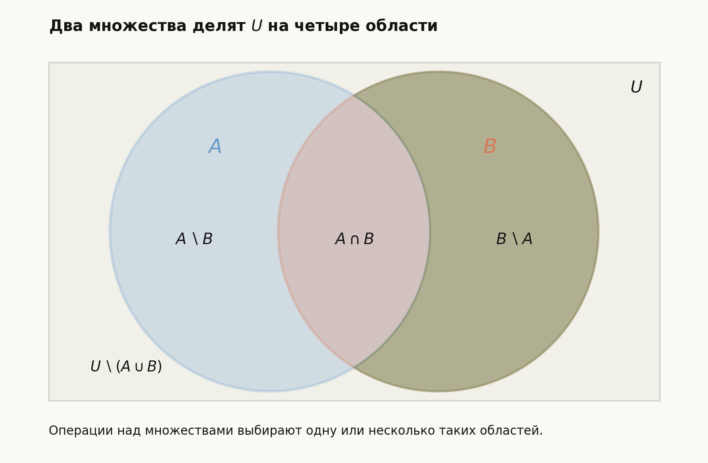
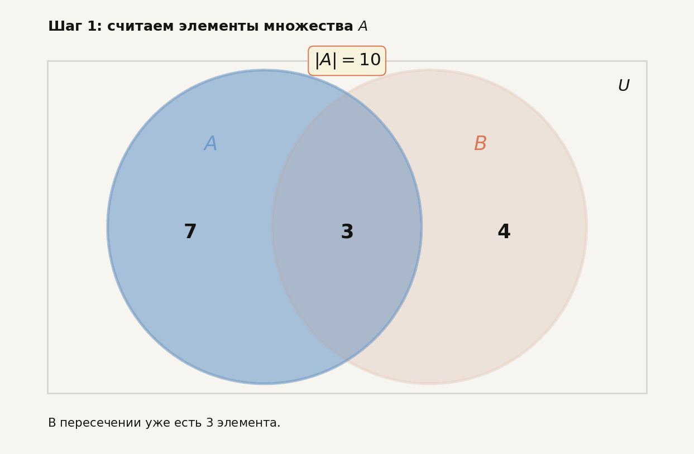

# Лекция: Множества. Круги Эйлера, операции на множествах. Формула включений и исключений. Примеры

## План

1. Что такое множество и зачем оно нужно
2. Способы задания множеств
3. Подмножества и равенство множеств
4. Основные операции над множествами
5. Круги Эйлера и визуальная интерпретация
6. Формула включений и исключений
7. Подробные примеры
8. Типичные ошибки
9. Что важно для поступления в ШАД
10. Итоги
11. Вопросы для самопроверки

*Рис. 1. Общая идея лекции: множества как области, их пересечения и аккуратный подсчёт без двойного учёта.*

---

## 1. Мотивация

Понятие множества — один из самых базовых языков математики.

Через множества удобно описывать:

- наборы объектов;
- множества решений уравнений;
- события в теории вероятностей;
- множества вершин, рёбер, функций, векторов;
- пересечения условий в комбинаторных и логических задачах.

На вступительных задачах тема важна по двум причинам:

- сама по себе, как основа аккуратных рассуждений;
- как язык для комбинаторики, вероятности, логики и линейной алгебры.

Особенно часто встречаются:

- операции объединения, пересечения и дополнения;
- работа с кругами Эйлера;
- подсчёт числа элементов объединения через формулу включений и исключений.

---

## 2. Что такое множество

### Определение

**Множество** — это совокупность объектов, рассматриваемых как единое целое.

Объекты, входящие в множество, называются **элементами** этого множества.

Если элемент $x$ принадлежит множеству $A$, пишут

$$
x\in A.
$$

Если не принадлежит, пишут

$$
x\notin A.
$$

### Примеры

- множество натуральных чисел: $\mathbb{N}$;
- множество целых чисел: $\mathbb{Z}$;
- множество рациональных чисел: $\mathbb{Q}$;
- множество вещественных чисел: $\mathbb{R}$;
- множество студентов в группе;
- множество решений уравнения $x^2=1$, то есть $\{-1,1\}$.

### Важное замечание

В множестве важен только факт принадлежности элемента, а не порядок записи и не число повторений.

Например,

$$
\{1,2,3\}=\{3,2,1\}=\{1,1,2,3\}.
$$

---

## 3. Способы задания множеств

## 3.1. Перечислением элементов

Например:

$$
A=\{1,2,3,4\}.
$$

Этот способ удобен, когда элементов немного.

## 3.2. Описанием свойства

Например:

$$
A=\{x\in \mathbb{Z}\mid 1\le x\le 4\}.
$$

Это читается так: множество всех целых $x$, для которых выполнено $1\le x\le 4$.

### Пример

Множество чётных целых чисел можно задать так:

$$
E=\{x\in \mathbb{Z}\mid x \text{ делится на } 2\}.
$$

---

## 4. Подмножества и равенство множеств

### Определение подмножества

Множество $A$ называется **подмножеством** множества $B$, если каждый элемент $A$ принадлежит $B$.

Обозначение:

$$
A\subseteq B.
$$

То есть

$$
A\subseteq B \iff \forall x \ (x\in A \Rightarrow x\in B).
$$

### Примеры

- $\{1,2\}\subseteq \{1,2,3\}$;
- множество чётных натуральных чисел является подмножеством множества натуральных чисел.

### Равенство множеств

Множества $A$ и $B$ равны, если они состоят из одних и тех же элементов.

Обозначение:

$$
A=B.
$$

Это эквивалентно двум включениям:

$$
A\subseteq B \quad \text{и} \quad B\subseteq A.
$$

### Пустое множество

Множество, не содержащее ни одного элемента, называется **пустым** и обозначается

$$
\varnothing.
$$

Пустое множество является подмножеством любого множества:

$$
\varnothing \subseteq A.
$$

---

## 5. Основные операции над множествами

Пусть $A$ и $B$ — множества.

## 5.1. Объединение

### Определение

**Объединение** множеств $A$ и $B$ — это множество всех элементов, которые принадлежат хотя бы одному из них:

$$
A\cup B=\{x\mid x\in A \text{ или } x\in B\}.
$$

### Пример

Если

$$
A=\{1,2,3\}, \quad B=\{3,4,5\},
$$

то

$$
A\cup B=\{1,2,3,4,5\}.
$$

---

## 5.2. Пересечение

### Определение

**Пересечение** множеств $A$ и $B$ — это множество всех элементов, принадлежащих обоим множествам:

$$
A\cap B=\{x\mid x\in A \text{ и } x\in B\}.
$$

### Пример

Для тех же множеств

$$
A=\{1,2,3\}, \quad B=\{3,4,5\}
$$

имеем

$$
A\cap B=\{3\}.
$$

---

## 5.3. Разность

### Определение

**Разность** множеств $A$ и $B$ — это множество элементов, которые принадлежат $A$, но не принадлежат $B$:

$$
A\setminus B=\{x\mid x\in A \text{ и } x\notin B\}.
$$

### Пример

Если

$$
A=\{1,2,3,4\}, \quad B=\{3,4,5\},
$$

то

$$
A\setminus B=\{1,2\}.
$$

---

## 5.4. Дополнение

Если фиксировано универсальное множество $U$, то **дополнением** множества $A$ называется множество всех элементов из $U$, не входящих в $A$:

$$
\overline{A}=U\setminus A.
$$

Иногда пишут также $A^c$.

### Пример

Если

$$
U=\{1,2,3,4,5,6\}, \quad A=\{2,4,6\},
$$

то

$$
\overline{A}=\{1,3,5\}.
$$

### Важное замечание

Дополнение всегда определяется **относительно универсального множества**.  
Без указания $U$ запись может быть неоднозначной.

---

## 5.5. Симметрическая разность

### Определение

**Симметрическая разность** множеств $A$ и $B$ — это элементы, принадлежащие ровно одному из множеств:

$$
A\triangle B=(A\setminus B)\cup (B\setminus A).
$$

Её можно записать и так:

$$
A\triangle B=(A\cup B)\setminus (A\cap B).
$$

### Пример

Если

$$
A=\{1,2,3\}, \quad B=\{3,4,5\},
$$

то

$$
A\triangle B=\{1,2,4,5\}.
$$

---

## 6. Свойства операций над множествами

Для множеств $A,B,C$ верны следующие свойства.

## 6.1. Коммутативность

$$
A\cup B=B\cup A,
$$

$$
A\cap B=B\cap A.
$$

## 6.2. Ассоциативность

$$
(A\cup B)\cup C=A\cup (B\cup C),
$$

$$
(A\cap B)\cap C=A\cap (B\cap C).
$$

## 6.3. Дистрибутивность

$$
A\cap (B\cup C)=(A\cap B)\cup (A\cap C),
$$

$$
A\cup (B\cap C)=(A\cup B)\cap (A\cup C).
$$

## 6.4. Идемпотентность

$$
A\cup A=A,
$$

$$
A\cap A=A.
$$

## 6.5. Свойства с пустым и универсальным множествами

$$
A\cup \varnothing=A,
$$

$$
A\cap \varnothing=\varnothing,
$$

$$
A\cup U=U,
$$

$$
A\cap U=A.
$$

## 6.6. Законы де Моргана

Если дополнение берётся относительно универсального множества $U$, то

$$
\overline{A\cup B}=\overline{A}\cap \overline{B},
$$

$$
\overline{A\cap B}=\overline{A}\cup \overline{B}.
$$

### Смысл

- “не $A$ и не $B$” — это дополнение к объединению;
- “не одновременно $A$ и $B$” — это дополнение к пересечению.

---

## 7. Круги Эйлера

Круги Эйлера — это наглядный способ изображать отношения между множествами.

Обычно:

- универсальное множество изображается прямоугольником;
- множества изображаются кругами или овалами внутри него.

Статическая схема ниже показывает базовую идею: два множества $A$ и $B$ делят универсальное множество $U$ на четыре непересекающиеся области.

## 7.1. Что можно увидеть на диаграмме

С помощью кругов Эйлера удобно иллюстрировать:

- включение $A\subseteq B$;
- пересечение $A\cap B$;
- объединение $A\cup B$;
- разность $A\setminus B$;
- дополнение $\overline{A}$;
- случаи, когда множества не пересекаются.

## 7.2. Пример интерпретации

Если два круга частично пересекаются, то:

- общая часть соответствует $A\cap B$;
- вся область обоих кругов соответствует $A\cup B$;
- часть круга $A$ вне пересечения соответствует $A\setminus B$.

## 7.3. Когда круги особенно полезны

Круги Эйлера полезны, когда задача содержит несколько условий:

- числа, делящиеся на $2$;
- числа, делящиеся на $3$;
- числа, удовлетворяющие обоим условиям.

Тогда диаграмма помогает избежать путаницы и переучёта.

---

## 8. Мощность конечного множества

Если множество $A$ конечно, то число его элементов обозначают через

$$
|A|.
$$

Например, если

$$
A=\{2,4,6,8\},
$$

то

$$
|A|=4.
$$

Для конечных множеств операции над множествами часто сопровождаются формулами для их мощностей.

---

## 9. Формула включений и исключений для двух множеств

### Теорема

Для любых конечных множеств $A$ и $B$ верно:

$$
|A\cup B|=|A|+|B|-|A\cap B|.
$$

### Почему это верно

Если просто сложить $|A|$ и $|B|$, то элементы пересечения $A\cap B$ будут посчитаны дважды:

- один раз как элементы множества $A$;
- второй раз как элементы множества $B$.

Поэтому нужно один раз вычесть размер пересечения.

Анимация ниже показывает этот переучёт: область $A\cap B$ сначала попадает в сумму дважды, а затем один раз вычитается.

### Пример

Пусть

$$
|A|=10,\quad |B|=7,\quad |A\cap B|=3.
$$

Тогда

$$
|A\cup B|=10+7-3=14.
$$

---

## 10. Формула включений и исключений для трёх множеств

### Теорема

Для любых конечных множеств $A$, $B$, $C$ верно:

$$
|A\cup B\cup C|
=
|A|+|B|+|C|
-|A\cap B|-|A\cap C|-|B\cap C|
+|A\cap B\cap C|.
$$

### Идея

- сначала складываем размеры всех трёх множеств;
- затем вычитаем попарные пересечения, потому что они были посчитаны дважды;
- но элементы тройного пересечения при этом вычлись слишком много раз, поэтому их надо добавить обратно.

### Важно

Знаки чередуются:

- сначала плюс суммы одиночных множеств;
- потом минус суммы попарных пересечений;
- потом плюс тройное пересечение.

Это и есть характерная структура формулы включений и исключений.

---

## 11. Общая идея формулы включений и исключений

Для большого числа множеств действует тот же принцип:

- складываем размеры одиночных множеств;
- вычитаем размеры всех попарных пересечений;
- добавляем размеры всех тройных пересечений;
- вычитаем размеры всех пересечений по $4$ множества;
- и так далее.

На уровне подготовки к вступительным задачам чаще всего нужны случаи для двух и трёх множеств, а также умение увидеть сам принцип.

---

## 12. Подробные примеры

## 12.1. Объединение двух множеств

В группе из $30$ студентов:

- $18$ изучают Python;
- $15$ изучают C++;
- $7$ изучают и Python, и C++.

Сколько студентов изучают хотя бы один из этих языков?

### Решение

Обозначим:

- $A$ — студенты, изучающие Python;
- $B$ — студенты, изучающие C++.

Тогда

$$
|A|=18,\quad |B|=15,\quad |A\cap B|=7.
$$

По формуле включений и исключений:

$$
|A\cup B|=18+15-7=26.
$$

### Ответ

$$
26.
$$

---

## 12.2. Сколько не изучают ни один язык

В тех же условиях найдём, сколько студентов не изучают ни Python, ни C++.

### Решение

Всего студентов $30$.

Хотя бы один язык изучают $26$ студентов.

Значит, ни один из двух языков не изучают

$$
30-26=4
$$

студента.

Если универсальное множество — это все студенты группы, то это просто дополнение к $A\cup B$.

### Ответ

$$
4.
$$

---

## 12.3. Делимость на $2$ или на $3$

Сколько чисел от $1$ до $100$ делятся на $2$ или на $3$?

### Решение

Обозначим:

- $A$ — числа от $1$ до $100$, делящиеся на $2$;
- $B$ — числа от $1$ до $100$, делящиеся на $3$.

Тогда:

$$
|A|=\left\lfloor \frac{100}{2}\right\rfloor=50,
$$

$$
|B|=\left\lfloor \frac{100}{3}\right\rfloor=33.
$$

Числа, делящиеся и на $2$, и на $3$, делятся на $6$, поэтому

$$
|A\cap B|=\left\lfloor \frac{100}{6}\right\rfloor=16.
$$

По формуле включений и исключений:

$$
|A\cup B|=50+33-16=67.
$$

### Ответ

$$
67.
$$

---

## 12.4. Делимость на $2$, $3$ или $5$

Сколько чисел от $1$ до $100$ делятся хотя бы на одно из чисел $2,3,5$?

### Решение

Обозначим:

- $A$ — числа, делящиеся на $2$;
- $B$ — числа, делящиеся на $3$;
- $C$ — числа, делящиеся на $5$.

Тогда

$$
|A|=50,\quad |B|=33,\quad |C|=20.
$$

Попарные пересечения:

- $A\cap B$ — делятся на $6$, значит $16$;
- $A\cap C$ — делятся на $10$, значит $10$;
- $B\cap C$ — делятся на $15$, значит $6$.

Тройное пересечение:

- $A\cap B\cap C$ — делятся на $\mathrm{lcm}(2,3,5)=30$, значит $3$.

Теперь применяем формулу:

$$
|A\cup B\cup C|
=
50+33+20-16-10-6+3.
$$

Считаем:

$$
50+33+20=103,
$$

$$
16+10+6=32,
$$

$$
103-32+3=74.
$$

### Ответ

$$
74.
$$

---

## 12.5. Пример на круги Эйлера

В классе $40$ учеников:

- $22$ занимаются математикой;
- $18$ занимаются информатикой;
- $9$ занимаются и математикой, и информатикой.

Сколько учеников занимается ровно одним из этих предметов?

### Решение

Обозначим:

- $A$ — занимаются математикой;
- $B$ — занимаются информатикой.

Тогда:

- только математикой занимаются $|A|-|A\cap B|=22-9=13$;
- только информатикой занимаются $|B|-|A\cap B|=18-9=9$.

Значит, ровно одним из предметов занимаются

$$
13+9=22
$$

ученика.

Можно также записать это как

$$
|A\triangle B|=|A|+|B|-2|A\cap B|.
$$

### Ответ

$$
22.
$$

---

## 13. Как обычно решать задачи на множества

Полезный рабочий алгоритм такой.

### Шаг 1. Ввести обозначения

Ясно назвать множества:

- $A$ — объекты с первым свойством;
- $B$ — объекты со вторым;
- $C$ — объекты с третьим.

### Шаг 2. Понять, что именно спрашивается

Например:

- хотя бы одно свойство — это объединение;
- оба свойства — это пересечение;
- только первое — это разность;
- ни одного свойства — это дополнение к объединению.

### Шаг 3. Проверить, нет ли переучёта

Если складываются мощности нескольких множеств, нужно понять, не посчитали ли пересечение дважды.

### Шаг 4. Применить формулу включений и исключений

Если задача на число элементов объединения, это обычно главный инструмент.

### Шаг 5. Проверить ответ на здравый смысл

Например:

- ответ не может быть больше размера универсального множества;
- ответ не может быть отрицательным;
- размер объединения не меньше каждого из множеств и не больше их суммы.

---

## 14. Типичные ошибки

### Ошибка 1. Путать объединение и пересечение

- “или” обычно соответствует объединению $A\cup B$;
- “и” обычно соответствует пересечению $A\cap B$.

Но в текстовых задачах надо читать условие внимательно: иногда “или” используется в нестрогом смысле.

### Ошибка 2. Забывать вычитать пересечение

Если просто написать

$$
|A\cup B|=|A|+|B|,
$$

то это верно только при $A\cap B=\varnothing$.

### Ошибка 3. Неправильно работать с дополнением

Дополнение надо брать относительно фиксированного универсального множества.

### Ошибка 4. Неверно интерпретировать “ровно одно”

“Ровно одно из двух свойств” — это не объединение, а симметрическая разность:

$$
A\triangle B.
$$

### Ошибка 5. Ошибка знака в формуле для трёх множеств

Нужно помнить чередование знаков:

$$
+,-,+.
$$

---

## 15. Что важно для поступления в ШАД

- Уметь свободно работать с обозначениями $A\cup B$, $A\cap B$, $A\setminus B$, $\overline{A}$.
- Видеть смысл операций на уровне слов:
  - “хотя бы одно”;
  - “оба”;
  - “только одно”;
  - “ни одного”.
- Знать формулу включений и исключений для двух и трёх множеств.
- Уметь применять её в задачах на делимость, кружки, языки, свойства чисел.
- Уметь пользоваться кругами Эйлера как инструментом понимания, а не как заменой строгому решению.
- Не терять универсальное множество, когда речь идёт о дополнении.

---

## 16. Итоги

В этой теме есть несколько ключевых идей.

1. **Множество** — это набор объектов, для которых важен только факт принадлежности.
2. Основные операции:
   - объединение $A\cup B$;
   - пересечение $A\cap B$;
   - разность $A\setminus B$;
   - дополнение $\overline{A}$;
   - симметрическая разность $A\triangle B$.
3. **Круги Эйлера** помогают визуально понять, как соотносятся множества.
4. При подсчёте мощности объединения нельзя забывать про переучёт элементов пересечения.
5. Для двух множеств:

$$
|A\cup B|=|A|+|B|-|A\cap B|.
$$

6. Для трёх множеств:

$$
|A\cup B\cup C|
=
|A|+|B|+|C|
-|A\cap B|-|A\cap C|-|B\cap C|
+|A\cap B\cap C|.
$$

Формула включений и исключений — один из самых полезных и часто используемых инструментов в дискретной математике и задачах на вступительных экзаменах.

---

## 17. Вопросы для самопроверки

1. Что значит запись $x\in A$ и $A\subseteq B$?
2. Когда два множества равны?
3. Чем отличаются объединение, пересечение и разность?
4. Почему дополнение нельзя понимать без универсального множества?
5. Каков смысл симметрической разности?
6. В чём смысл кругов Эйлера?
7. Почему формула $|A\cup B|=|A|+|B|$ вообще говоря неверна?
8. Сформулируйте формулу включений и исключений для двух множеств.
9. Сформулируйте формулу включений и исключений для трёх множеств.
10. Как по условию задачи понять, что нужно искать объединение, пересечение или дополнение?