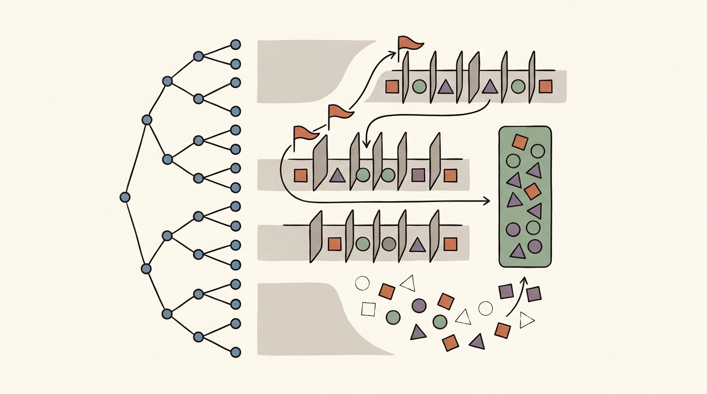
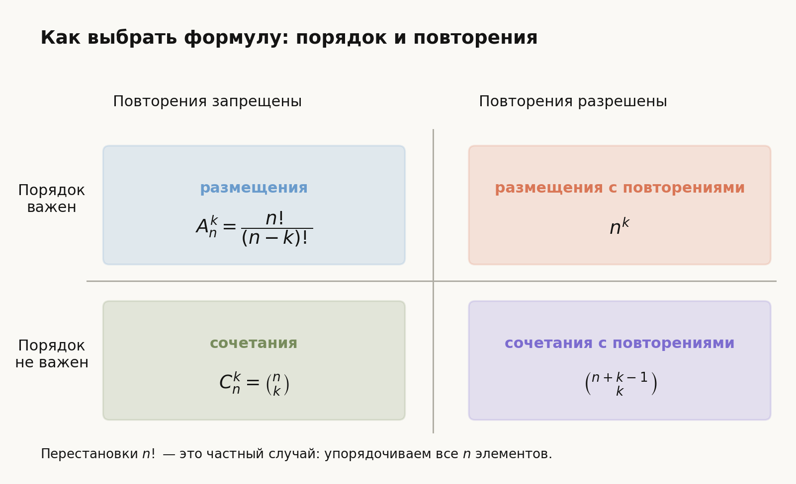
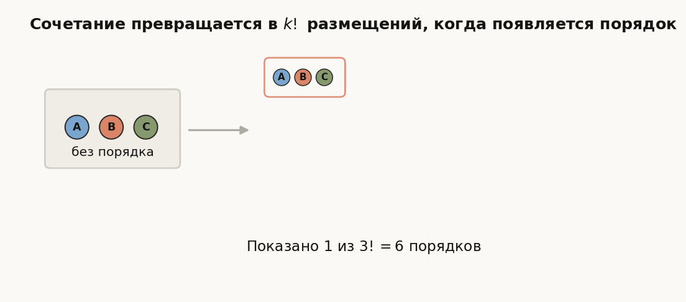
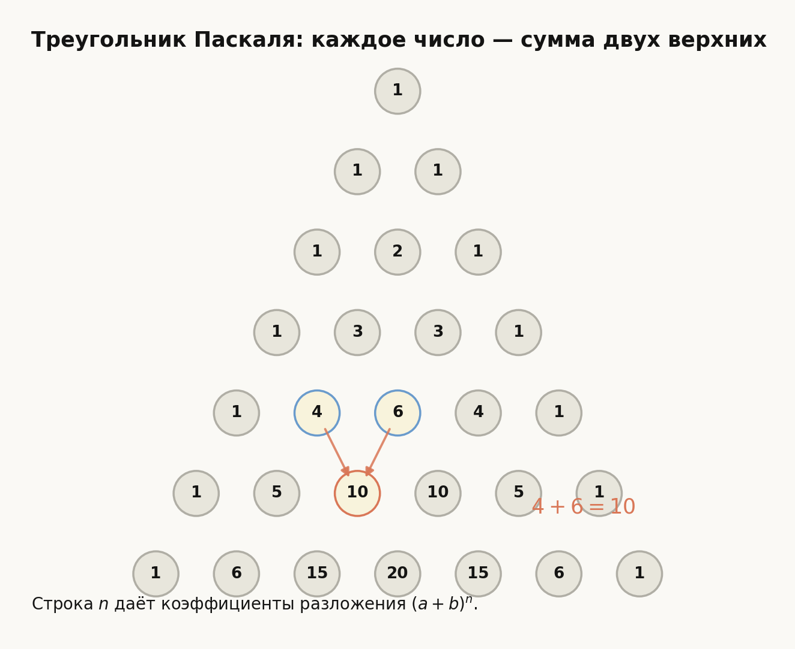
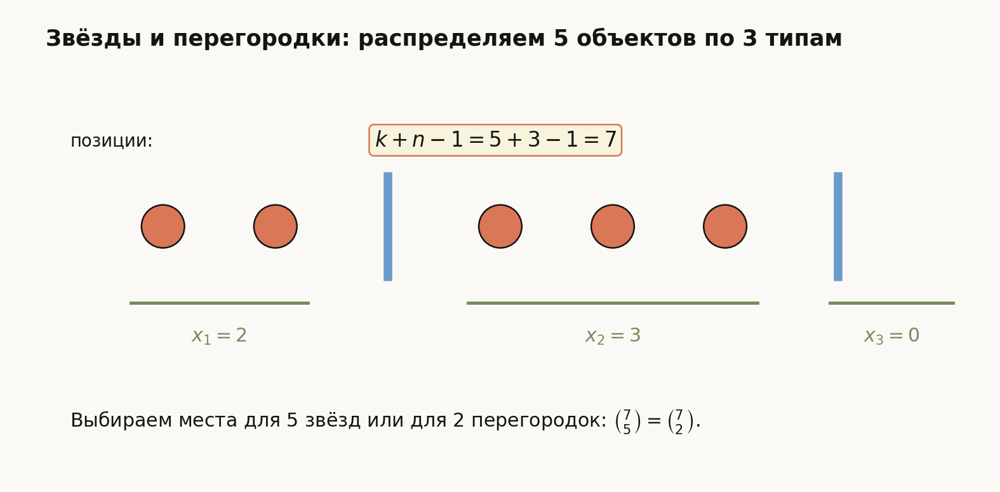

# Лекция: Размещения, перестановки и сочетания. Бином Ньютона. Треугольник Паскаля. Размещения, перестановки и сочетания с повторениями. Гипергеометрическая схема

## План

1. Мотивация и общая схема комбинаторного выбора
2. Перестановки
3. Размещения
4. Сочетания
5. Связи между основными комбинаторными числами
6. Бином Ньютона
7. Треугольник Паскаля
8. Размещения, перестановки и сочетания с повторениями
9. Гипергеометрическая схема
10. Подробные примеры
11. Типичные ошибки
12. Что важно для поступления в ШАД
13. Итоги
14. Вопросы для самопроверки



*Рис. 1. Общая идея лекции: выбор объектов, порядок, повторения и переход от комбинаторных формул к вероятностным схемам.*

---

## 1. Мотивация

В задачах по комбинаторике очень часто нужно ответить на один из трёх вопросов:

- сколько способов **упорядочить все** элементы;
- сколько способов **выбрать несколько и упорядочить их**;
- сколько способов **выбрать несколько без учёта порядка**.

Именно отсюда возникают три базовых объекта:

- **перестановки**;
- **размещения**;
- **сочетания**.

Дальше на этой базе строятся:

- биномиальные коэффициенты;
- бином Ньютона;
- треугольник Паскаля;
- модели случайного выбора без возвращения, в частности гипергеометрическая схема.

Эта тема очень важна для поступления в ШАД, потому что здесь проверяют не только знание формул, но и понимание:

- когда важен порядок;
- когда разрешены повторения;
- когда один и тот же объект считается несколько раз;
- как комбинаторика связывается с вероятностью.

---

## 2. Общая схема: что именно мы считаем

Перед применением любой формулы надо ответить на два вопроса.

### Вопрос 1. Важен ли порядок?

- если важен, то обычно это перестановки или размещения;
- если не важен, то обычно это сочетания.

### Вопрос 2. Разрешены ли повторения?

- если нет, формулы одни;
- если да, формулы другие.

Это главный фильтр, который позволяет быстро выбрать правильный инструмент.

Схема ниже показывает, как два вопроса — про порядок и повторения — приводят к разным формулам.



---

## 3. Перестановки

## 3.1. Определение

**Перестановка из $n$ элементов** — это любой способ упорядочить все $n$ различных элементов.

Число перестановок обозначают

$$
P_n=n!.
$$

Обычно пишут просто:

$$
n!.
$$

## 3.2. Почему это так

На первое место можно поставить любой из $n$ элементов.

После этого на второе место можно поставить любой из оставшихся $n-1$ элементов.

Далее:

- на третье место — $n-2$ вариантов;
- ...
- на последнее — $1$ вариант.

По правилу произведения получаем:

$$
n\cdot (n-1)\cdot (n-2)\cdots 1=n!.
$$

## 3.3. Пример

Сколькими способами можно расставить $5$ разных книг на полке?

Ответ:

$$
5!=120.
$$

---

## 4. Размещения без повторений

## 4.1. Определение

**Размещение из $n$ элементов по $k$** — это упорядоченный выбор $k$ различных элементов из $n$.

Число размещений обозначают $A_n^k$ и равно

$$
A_n^k=\frac{n!}{(n-k)!}.
$$

## 4.2. Почему это так

Нужно выбрать $k$ мест подряд:

- на первое место — $n$ вариантов;
- на второе — $n-1$;
- ...
- на $k$-е — $n-k+1$.

Значит,

$$
A_n^k=n(n-1)\cdots (n-k+1)=\frac{n!}{(n-k)!}.
$$

## 4.3. Пример

Сколько трёхбуквенных слов можно составить из букв $A,B,C,D,E$, если буквы не повторяются?

Это размещения из $5$ по $3$:

$$
A_5^3=5\cdot 4\cdot 3=60.
$$

---

## 5. Сочетания без повторений

## 5.1. Определение

**Сочетание из $n$ элементов по $k$** — это выбор $k$ элементов из $n$ без учёта порядка.

Число сочетаний обозначают

$$
C_n^k=\binom{n}{k}=\frac{n!}{k!(n-k)!}.
$$

## 5.2. Почему это так

Если сначала выбрать $k$ различных элементов и упорядочить их, то получим размещение.

Но каждый неупорядоченный набор из $k$ элементов можно упорядочить $k!$ способами.

Поэтому

$$
A_n^k=C_n^k\cdot k!.
$$

Отсюда

$$
C_n^k=\frac{A_n^k}{k!}=\frac{n!}{k!(n-k)!}.
$$

## 5.3. Пример

Сколькими способами можно выбрать $3$ человек из $10$?

$$
\binom{10}{3}=\frac{10!}{3!\cdot 7!}=120.
$$

---

## 6. Связь между перестановками, размещениями и сочетаниями

Эти формулы нужно хорошо видеть как части одной схемы.

### Перестановки

Упорядочиваем все $n$ элементов:

$$
P_n=n!.
$$

### Размещения

Выбираем и упорядочиваем $k$ элементов из $n$:

$$
A_n^k=\frac{n!}{(n-k)!}.
$$

### Сочетания

Выбираем $k$ элементов из $n$ без порядка:

$$
C_n^k=\binom{n}{k}=\frac{n!}{k!(n-k)!}.
$$

### Связь

$$
A_n^k=C_n^k\cdot k!.
$$

Смысл очень важен:

- сочетание отвечает за **выбор**;
- умножение на $k!$ добавляет **порядок**.

Анимация ниже показывает эту связь: один и тот же набор из трёх элементов становится шестью разными размещениями, когда появляется порядок.



---

## 7. Основные свойства биномиальных коэффициентов

Для биномиальных коэффициентов верны важные свойства.

## 7.1. Симметрия

$$
\binom{n}{k}=\binom{n}{n-k}.
$$

### Смысл

Выбрать $k$ элементов — это то же самое, что выбрать $n-k$ элементов, которые не взяли.

## 7.2. Краевые значения

$$
\binom{n}{0}=1,\quad \binom{n}{n}=1.
$$

Действительно:

- выбрать $0$ элементов можно одним способом;
- выбрать все $n$ элементов тоже можно одним способом.

## 7.3. Тождество Паскаля

$$
\binom{n}{k}=\binom{n-1}{k}+\binom{n-1}{k-1}.
$$

### Комбинаторное объяснение

Рассмотрим фиксированный элемент $x$.

Любое $k$-элементное подмножество либо:

- не содержит $x$ — таких $\binom{n-1}{k}$;
- содержит $x$ — тогда надо выбрать ещё $k-1$ элемент из остальных $n-1$, таких $\binom{n-1}{k-1}$.

Сумма этих двух чисел даёт $\binom{n}{k}$.

---

## 8. Бином Ньютона

## 8.1. Формулировка

Для любого натурального $n$:

$$
(a+b)^n=\sum_{k=0}^{n}\binom{n}{k}a^{n-k}b^k.
$$

То есть

$$
(a+b)^n=\binom{n}{0}a^n+\binom{n}{1}a^{n-1}b+\binom{n}{2}a^{n-2}b^2+\cdots+\binom{n}{n}b^n.
$$

## 8.2. Почему коэффициенты именно такие

В произведении

$$
(a+b)^n=(a+b)(a+b)\cdots(a+b)
$$

нужно из каждой скобки выбрать либо $a$, либо $b$.

Чтобы получить одночлен $a^{n-k}b^k$, нужно выбрать $b$ ровно в $k$ скобках, а $a$ — в остальных $n-k$.

Число способов выбрать эти $k$ скобок равно

$$
\binom{n}{k}.
$$

Именно поэтому коэффициент при $a^{n-k}b^k$ равен $\binom{n}{k}$.

## 8.3. Пример

Разложим

$$
(a+b)^4.
$$

Получаем:

$$
(a+b)^4=a^4+4a^3b+6a^2b^2+4ab^3+b^4.
$$

Потому что

$$
\binom{4}{0}=1,\quad \binom{4}{1}=4,\quad \binom{4}{2}=6,\quad \binom{4}{3}=4,\quad \binom{4}{4}=1.
$$

---

## 9. Треугольник Паскаля

## 9.1. Построение

Треугольник Паскаля строится так:

- по краям стоят единицы;
- каждое внутреннее число равно сумме двух чисел над ним.

Первые строки:

```text
                1
             1     1
          1     2     1
       1     3     3     1
    1     4     6     4     1
 1     5    10    10     5     1
```

Эта же идея изображена на схеме: внутренний элемент получается как сумма двух элементов над ним.



Числа в $n$-й строке — это коэффициенты

$$
\binom{n}{0},\binom{n}{1},\dots,\binom{n}{n}.
$$

## 9.2. Связь с тождеством Паскаля

Именно формула

$$
\binom{n}{k}=\binom{n-1}{k}+\binom{n-1}{k-1}
$$

объясняет, почему каждое внутреннее число равно сумме двух верхних.

## 9.3. Связь с биномом Ньютона

Коэффициенты в разложении $(a+b)^n$ — это элементы $n$-й строки треугольника Паскаля.

Например, строка

$$
1,\ 5,\ 10,\ 10,\ 5,\ 1
$$

соответствует разложению

$$
(a+b)^5.
$$

---

## 10. Перестановки с повторениями

Теперь рассмотрим ситуацию, когда среди элементов есть одинаковые.

## 10.1. Формула

Если всего имеется $n$ элементов, среди которых:

- $n_1$ одинаковых элементов первого типа;
- $n_2$ одинаковых элементов второго типа;
- ...
- $n_m$ одинаковых элементов $m$-го типа,

где

$$
n_1+n_2+\cdots+n_m=n,
$$

то число различных перестановок равно

$$
\frac{n!}{n_1!n_2!\cdots n_m!}.
$$

## 10.2. Почему это так

Если бы все элементы были различны, перестановок было бы $n!$.

Но перестановки одинаковых элементов между собой не создают нового расположения.

Поэтому нужно разделить на число внутренних перестановок одинаковых элементов:

$$
n_1!n_2!\cdots n_m!.
$$

## 10.3. Пример

Сколько различных перестановок букв в слове `MAMA`?

Здесь $4$ буквы, из них:

- $2$ буквы `M`;
- $2$ буквы `A`.

Поэтому число различных перестановок равно

$$
\frac{4!}{2!\cdot 2!}=6.
$$

---

## 11. Размещения с повторениями

## 11.1. Определение

**Размещения с повторениями из $n$ элементов по $k$** — это упорядоченные наборы длины $k$, в которых каждый элемент можно выбирать из $n$ вариантов, и повторения разрешены.

Число таких размещений равно

$$
n^k.
$$

## 11.2. Почему

На каждую из $k$ позиций можно поставить любой из $n$ элементов.

По правилу произведения:

$$
n\cdot n\cdots n=n^k.
$$

## 11.3. Пример

Сколько существует четырёхзначных кодов из цифр $0,\dots,9$?

Так как каждая позиция выбирается из $10$ вариантов и повторения разрешены, получаем

$$
10^4=10000.
$$

---

## 12. Сочетания с повторениями

## 12.1. Задача

Нужно выбрать $k$ элементов из $n$ типов, причём каждый тип можно брать несколько раз, а порядок не важен.

## 12.2. Формула

Число сочетаний с повторениями равно

$$
\binom{n+k-1}{k}.
$$

## 12.3. Интерпретация через “звёзды и перегородки”

Это число решений в неотрицательных целых числах уравнения

$$
x_1+x_2+\cdots+x_n=k,
$$

где $x_i$ — сколько раз выбран элемент $i$-го типа.

Нужно распределить $k$ одинаковых объектов по $n$ ящикам.

Это можно изобразить как:

- $k$ звёздочек;
- $n-1$ перегородок.

Например, для $k=5$ и $n=3$ одна запись со звёздами и перегородками кодирует распределение $x_1=2$, $x_2=3$, $x_3=0$.



Общее число позиций равно

$$
k+n-1.
$$

Нужно выбрать, где стоят $k$ звёздочек, или где стоят $n-1$ перегородок. Поэтому число вариантов:

$$
\binom{n+k-1}{k}=\binom{n+k-1}{n-1}.
$$

## 12.4. Пример

Сколькими способами можно выбрать $5$ пирожных из $3$ видов, если можно брать несколько пирожных одного вида?

Ответ:

$$
\binom{3+5-1}{5}=\binom{7}{5}=21.
$$

---

## 13. Сводная таблица формул

| Тип выбора | Повторения | Порядок | Число способов |
|---|---:|---:|---:|
| Перестановки всех $n$ элементов | нет | да | $n!$ |
| Размещения из $n$ по $k$ | нет | да | $\dfrac{n!}{(n-k)!}$ |
| Сочетания из $n$ по $k$ | нет | нет | $\dfrac{n!}{k!(n-k)!}$ |
| Размещения из $n$ по $k$ | да | да | $n^k$ |
| Сочетания из $n$ по $k$ | да | нет | $\binom{n+k-1}{k}$ |
| Перестановки с повторениями | одинаковые элементы есть | да | $\dfrac{n!}{n_1!\cdots n_m!}$ |

---

## 14. Гипергеометрическая схема

## 14.1. Постановка

Есть совокупность из $N$ объектов, среди которых:

- $M$ объектов обладают некоторым свойством;
- $N-M$ объектов этим свойством не обладают.

Из этих $N$ объектов случайно выбирают $n$ объектов **без возвращения**.

Пусть случайная величина $X$ — число выбранных объектов, обладающих свойством.

Тогда говорят, что $X$ имеет **гипергеометрическое распределение**.

## 14.2. Формула вероятности

Вероятность того, что среди выбранных $n$ объектов ровно $k$ обладают свойством, равна

$$
\mathbb{P}(X=k)=\frac{\binom{M}{k}\binom{N-M}{n-k}}{\binom{N}{n}}.
$$

## 14.3. Почему формула именно такая

Общее число способов выбрать $n$ объектов из $N$:

$$
\binom{N}{n}.
$$

Чтобы среди них было ровно $k$ “успешных” объектов, нужно:

- выбрать $k$ объектов из $M$ хороших;
- выбрать $n-k$ объектов из $N-M$ остальных.

Число благоприятных исходов:

$$
\binom{M}{k}\binom{N-M}{n-k}.
$$

Делим благоприятные исходы на общее число исходов и получаем формулу.

## 14.4. Ограничения на $k$

Число $k$ должно удовлетворять естественным условиям:

- $0\le k\le M$;
- $0\le n-k\le N-M$.

То есть реально возможные значения $k$ лежат в диапазоне

$$
\max(0,n-(N-M)) \le k \le \min(n,M).
$$

---

## 15. Примеры гипергеометрической схемы

## 15.1. Карты

Из колоды в $36$ карт, в которой $4$ туза, случайно выбирают $5$ карт. Найти вероятность того, что среди них ровно $2$ туза.

### Решение

Здесь:

- $N=36$;
- $M=4$;
- $n=5$;
- $k=2$.

По формуле:

$$
\mathbb{P}(X=2)=\frac{\binom{4}{2}\binom{32}{3}}{\binom{36}{5}}.
$$

Это и есть ответ.

## 15.2. Контроль качества

В партии из $20$ деталей есть $3$ бракованные. Случайно выбирают $4$ детали. Найти вероятность того, что среди них нет бракованных.

### Решение

Здесь:

- $N=20$;
- $M=3$ — бракованные;
- $n=4$;
- $k=0$.

Тогда

$$
\mathbb{P}(X=0)=\frac{\binom{3}{0}\binom{17}{4}}{\binom{20}{4}}=\frac{\binom{17}{4}}{\binom{20}{4}}.
$$

---

## 16. Подробные примеры на основные формулы

## 16.1. Выбрать и распределить роли

Из $8$ человек нужно выбрать председателя, секретаря и докладчика.

### Решение

Роли различны, значит порядок важен. Один человек не может занимать две роли.

Это размещения из $8$ по $3$:

$$
A_8^3=8\cdot 7\cdot 6=336.
$$

### Ответ

$$
336.
$$

---

## 16.2. Выбрать команду

Из $12$ человек нужно выбрать команду из $5$ человек.

### Решение

Порядок не важен, значит это сочетания:

$$
\binom{12}{5}=\frac{12!}{5!\cdot 7!}=792.
$$

### Ответ

$$
792.
$$

---

## 16.3. Слова с повторениями

Сколько пятибуквенных слов можно составить из алфавита из $4$ букв, если буквы могут повторяться?

### Решение

Каждая из $5$ позиций выбирается независимо из $4$ букв.

Значит, число слов равно

$$
4^5=1024.
$$

### Ответ

$$
1024.
$$

---

## 16.4. Перестановки с одинаковыми буквами

Сколько различных перестановок букв в слове `LEVEL`?

### Решение

В слове `LEVEL`:

- всего $5$ букв;
- буква `L` встречается $2$ раза;
- буква `E` встречается $2$ раза;
- буква `V` встречается $1$ раз.

Число различных перестановок:

$$
\frac{5!}{2!\cdot 2!}=30.
$$

### Ответ

$$
30.
$$

---

## 16.5. Коэффициент в биноме Ньютона

Найдите коэффициент при $x^3$ в выражении

$$
(2+x)^5.
$$

### Решение

Общий член разложения имеет вид

$$
\binom{5}{k}2^{5-k}x^k.
$$

Чтобы получить $x^3$, нужно взять $k=3$.

Тогда коэффициент равен

$$
\binom{5}{3}2^2=10\cdot 4=40.
$$

### Ответ

$$
40.
$$

---

## 17. Типичные ошибки

### Ошибка 1. Путать размещения и сочетания

Если порядок важен, это не сочетания.

Например:

- выбрать $3$ человек в команду — сочетания;
- выбрать президента, секретаря и казначея — размещения.

### Ошибка 2. Забывать про повторения

Формула зависит от того, можно ли выбирать один и тот же объект несколько раз.

### Ошибка 3. Делить или не делить на $k!$ без понимания

Переход от упорядоченного выбора к неупорядоченному обычно означает деление на $k!$.

Но это работает только когда все выбранные элементы различны.

### Ошибка 4. Неверно использовать формулу перестановок с повторениями

Если одинаковых элементов нет, делить ни на что не нужно.

### Ошибка 5. Путать биномиальные коэффициенты с коэффициентами многочлена без учёта множителей

В разложении $(2+x)^5$ коэффициент при $x^3$ — это не просто $\binom{5}{3}$, потому что нужно ещё учесть множитель $2^{2}$.

### Ошибка 6. Путать гипергеометрическую схему с биномиальной

Гипергеометрическая схема — это выбор **без возвращения**.

Если выбор делается с возвращением или испытания независимы, возникает уже биномиальная схема, а не гипергеометрическая.

---

## 18. Что важно для поступления в ШАД

- Очень быстро определять:
  - важен ли порядок;
  - разрешены ли повторения.
- Знать наизусть формулы:
  - $n!$;
  - $\dfrac{n!}{(n-k)!}$;
  - $\dfrac{n!}{k!(n-k)!}$;
  - $n^k$;
  - $\binom{n+k-1}{k}$.
- Понимать смысл биномиальных коэффициентов.
- Уметь пользоваться тождеством Паскаля и треугольником Паскаля.
- Уметь извлекать нужный коэффициент из бинома Ньютона.
- Уметь распознавать гипергеометрическую схему в вероятностных задачах.
- Не путать:
  - выбор с возвращением и без возвращения;
  - порядок и отсутствие порядка;
  - одинаковые и различимые объекты.

---

## 19. Итоги

В этой теме центральны несколько базовых конструкций.

1. **Перестановки**:
$$
n!.
$$

2. **Размещения без повторений**:
$$
A_n^k=\frac{n!}{(n-k)!}.
$$

3. **Сочетания без повторений**:
$$
\binom{n}{k}=\frac{n!}{k!(n-k)!}.
$$

4. **Размещения с повторениями**:
$$
n^k.
$$

5. **Сочетания с повторениями**:
$$
\binom{n+k-1}{k}.
$$

6. **Перестановки с повторениями**:
$$
\frac{n!}{n_1!\cdots n_m!}.
$$

7. **Бином Ньютона**:
$$
(a+b)^n=\sum_{k=0}^n \binom{n}{k}a^{n-k}b^k.
$$

8. **Треугольник Паскаля** кодирует биномиальные коэффициенты и тождество Паскаля.

9. **Гипергеометрическая схема** описывает случайный выбор без возвращения:
$$
\mathbb{P}(X=k)=\frac{\binom{M}{k}\binom{N-M}{n-k}}{\binom{N}{n}}.
$$

Главная мысль: почти любая задача этого раздела решается, если правильно ответить на три вопроса:

- что именно выбирается;
- важен ли порядок;
- разрешены ли повторения.

---

## 20. Вопросы для самопроверки

1. Чем перестановки отличаются от размещений?
2. Чем размещения отличаются от сочетаний?
3. Когда появляется формула $n^k$?
4. Когда применяется формула $\binom{n+k-1}{k}$?
5. Почему $\binom{n}{k}=\binom{n}{n-k}$?
6. Как комбинаторно объяснить тождество Паскаля?
7. Почему коэффициент при $a^{n-k}b^k$ в $(a+b)^n$ равен $\binom{n}{k}$?
8. Как связаны бином Ньютона и треугольник Паскаля?
9. В чём отличие гипергеометрической схемы от биномиальной?
10. Какие типичные ошибки возникают в задачах на выбор с повторениями и без повторений?