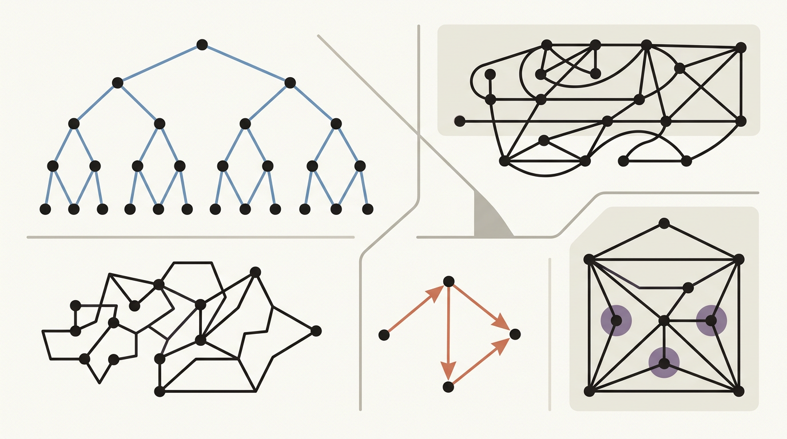
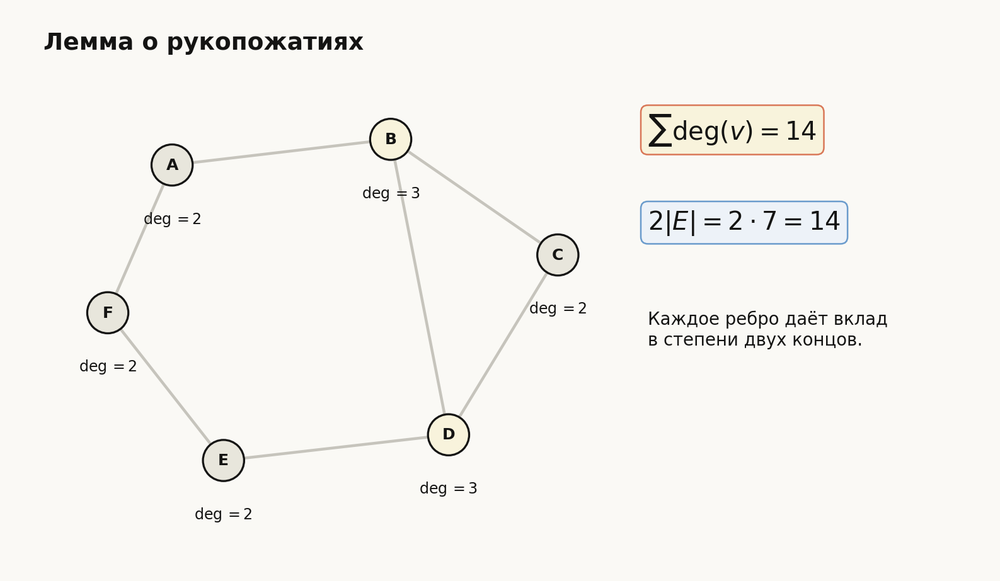
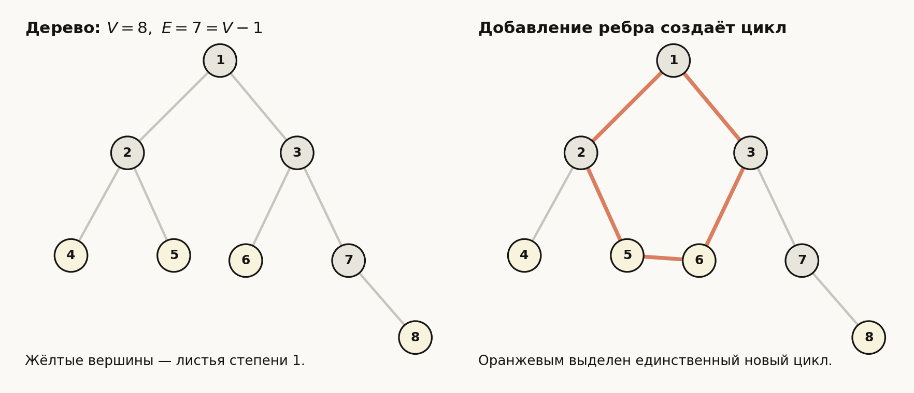
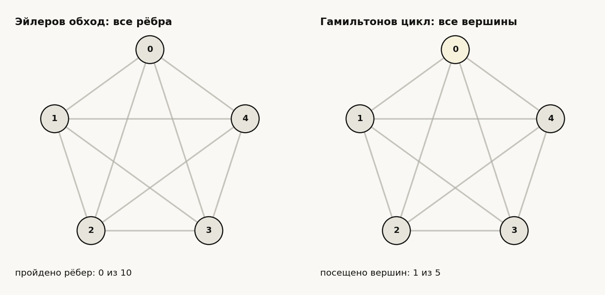
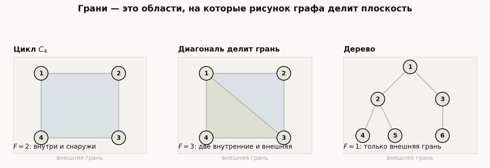
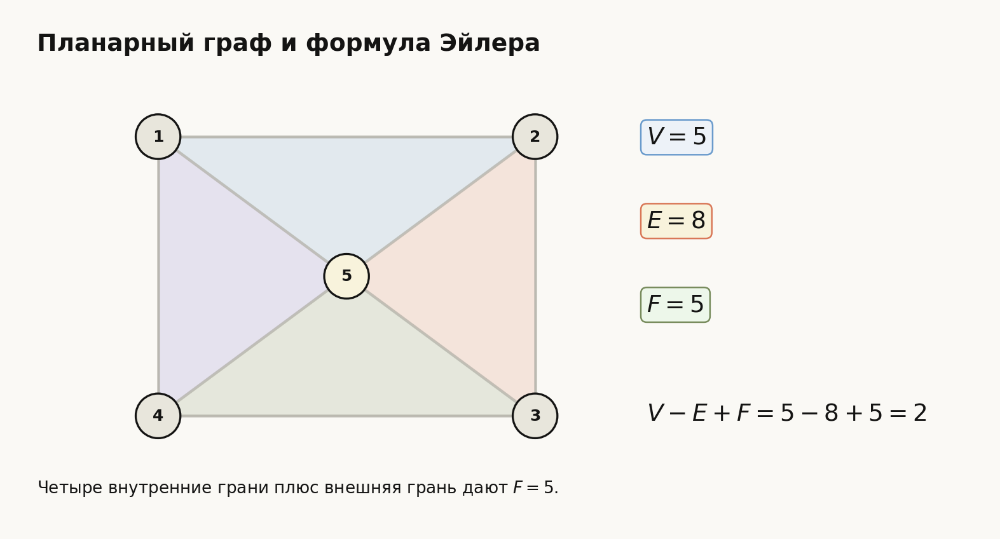
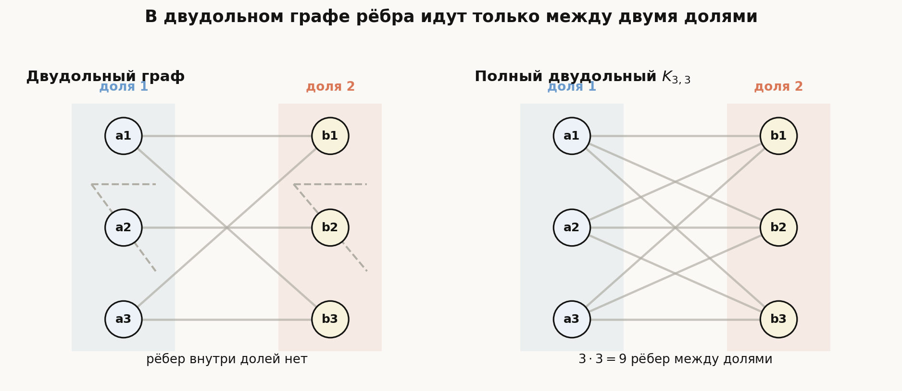
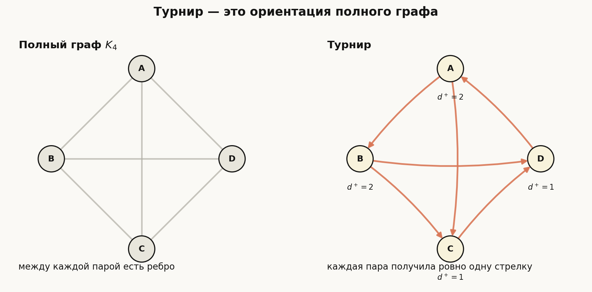
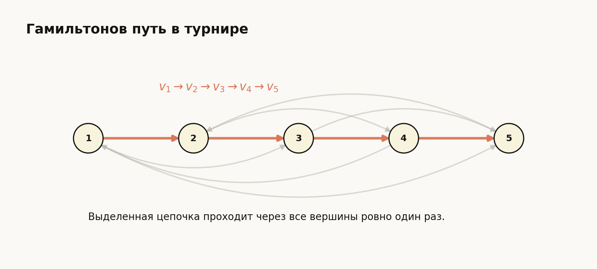

# Лекция: Графы. Лемма о рукопожатиях. Связность графов. Деревья и их свойства. Эйлеровы и гамильтоновы графы. Планарные графы, формула Эйлера. Ориентированные графы, турниры

## План

1. Что такое граф и зачем он нужен
2. Основные определения
3. Степени вершин и лемма о рукопожатиях
4. Связность графов
5. Деревья и их свойства
6. Эйлеровы графы
7. Гамильтоновы графы
8. Планарные графы и формула Эйлера
9. Ориентированные графы
10. Турниры
11. Подробные примеры
12. Типичные ошибки
13. Что важно для поступления в ШАД
14. Итоги
15. Вопросы для самопроверки

*Рис. 1. Общая идея лекции: вершины и рёбра, деревья, обходы, планарность и ориентированные связи.*

---

## 1. Мотивация

Графы — это один из самых удобных способов описывать систему объектов и связей между ними.

Примеры:

- города и дороги между ними;
- люди и знакомства;
- веб-страницы и ссылки;
- состояния алгоритма и переходы;
- задачи и зависимости между ними.

Для вступительных задач тема важна, потому что в ней соединяются:

- аккуратные определения;
- комбинаторика;
- доказательства существования;
- структурное мышление.

На базовом уровне особенно важны:

- степени вершин;
- связность;
- деревья;
- эйлеровы и гамильтоновы циклы;
- планарность;
- ориентированные графы и турниры.

---

## 2. Основные определения

## 2.1. Неориентированный граф

**Неориентированный граф** $G$ состоит из:

- множества вершин $V$;
- множества рёбер $E$.

Ребро соединяет две вершины и не имеет направления.

Обычно пишут:

$$
G=(V,E).
$$

Если ребро соединяет вершины $u$ и $v$, его записывают как

$$
uv \quad \text{или} \quad \{u,v\}.
$$

## 2.2. Вершины и рёбра

- вершины — это “точки”;
- рёбра — это “связи” между точками.

## 2.3. Смежность

Две вершины называются **смежными**, если они соединены ребром.

Два ребра называются смежными, если имеют общую вершину.

## 2.4. Степень вершины

**Степенью вершины** $v$ называется число рёбер, инцидентных этой вершине.

Обозначение:

$$
\deg(v).
$$

### Замечание

Петля, если она допускается, даёт вклад $2$ в степень вершины.  
Но в большинстве базовых задач рассматривают простые графы без петель и кратных рёбер.

## 2.5. Простой граф

**Простой граф** — это граф:

- без петель;
- без кратных рёбер.

Обычно на вступительных задачах по умолчанию речь идёт именно о простых графах, если не сказано обратное.

---

## 3. Лемма о рукопожатиях

## 3.1. Формулировка

В любом конечном неориентированном графе сумма степеней всех вершин равна удвоенному числу рёбер:

$$
\sum_{v\in V}\deg(v)=2|E|.
$$

Это и называется **леммой о рукопожатиях**.

## 3.2. Почему это верно

Каждое ребро имеет ровно два конца.

Значит, при суммировании степеней вершин каждое ребро учитывается ровно два раза — по одному разу с каждого конца.

Поэтому сумма степеней и равна $2|E|$.

Схема ниже показывает этот двойной счёт: каждое ребро добавляет единицу к степени каждого из двух своих концов.

## 3.3. Следствие: число вершин нечётной степени чётно

Так как сумма степеней всех вершин чётна, то число вершин с нечётной степенью должно быть чётным.

### Почему

Сумма чётного числа нечётных чисел — чётна, а сумма нечётного числа нечётных чисел — нечётна.

Но сумма степеней всегда чётна. Следовательно, нечётных степеней должно быть чётное число.

## 3.4. Пример

Может ли в графе быть ровно $3$ вершины нечётной степени?

Нет, не может, потому что число вершин нечётной степени всегда чётно.

---

## 4. Пути, циклы и связность

## 4.1. Путь

**Путь** — это последовательность вершин

$$
v_0,v_1,\dots,v_k,
$$

в которой каждые соседние вершины соединены ребром.

Длина пути — число рёбер в нём, то есть $k$.

## 4.2. Цикл

**Цикл** — это замкнутый путь, в котором:

- первая и последняя вершины совпадают;
- остальные вершины не повторяются.

## 4.3. Связность

Граф называется **связным**, если для любых двух его вершин существует путь, соединяющий их.

Если граф не связен, он распадается на несколько **компонент связности**.

## 4.4. Компоненты связности

Компонента связности — это максимальный связный подграф.

Интуитивно это отдельный “кусок” графа, внутри которого из любой вершины можно добраться до любой другой.

---

## 5. Деревья

## 5.1. Определение

**Дерево** — это связный граф без циклов.

Это один из важнейших классов графов.

## 5.2. Базовые свойства дерева

Для дерева с $n$ вершинами верны следующие утверждения:

1. число рёбер равно

$$
n-1;
$$

2. между любыми двумя вершинами существует ровно один простой путь;
3. удаление любого ребра нарушает связность;
4. добавление любого нового ребра создаёт ровно один цикл.

Эти свойства фактически эквивалентны определению дерева.

На схеме видно два базовых свойства дерева: у дерева $V-1$ рёбер, а добавление нового ребра создаёт цикл.

## 5.3. Почему в дереве $n-1$ ребро

Это фундаментальный факт.

### Идея доказательства по индукции

Если в дереве одна вершина, то рёбер $0$, и это равно $1-1$.

Предположим утверждение верным для дерева из $n-1$ вершин.

В любом дереве с $n\ge 2$ вершинами есть лист — вершина степени $1$.

Удалим этот лист вместе с инцидентным ребром. Получим дерево на $n-1$ вершине.

По предположению индукции в нём $n-2$ ребра. Возвращая удалённый лист и ребро, получаем $n-1$ ребро.

## 5.4. Лист

**Лист** — это вершина степени $1$.

### Важный факт

В любом дереве с хотя бы двумя вершинами есть хотя бы два листа.

### Почему

Рассмотрим самый длинный простой путь в дереве. Его концы не могут иметь степень больше $1$, иначе путь можно было бы продолжить. Значит, оба конца — листья.

---

## 6. Эйлеровы графы

## 6.1. Эйлеров путь и цикл

**Эйлеров путь** — это путь, проходящий по каждому ребру графа ровно один раз.

**Эйлеров цикл** — это замкнутый эйлеров путь.

## 6.2. Критерий существования эйлерова цикла

Связный граф имеет эйлеров цикл тогда и только тогда, когда степени всех его вершин чётны.

## 6.3. Критерий существования эйлерова пути

Связный граф имеет эйлеров путь, но не обязательно цикл, тогда и только тогда, когда в нём ровно $0$ или $2$ вершины нечётной степени.

- если нечётных вершин $0$, есть эйлеров цикл;
- если нечётных вершин $2$, есть эйлеров путь, начинающийся в одной нечётной вершине и заканчивающийся в другой.

## 6.4. Интуиция

Когда мы проходим через промежуточную вершину, то:

- по одному ребру входим;
- по другому выходим.

Значит, рёбра у такой вершины должны разбиваться на пары.

Именно поэтому в цикле все степени должны быть чётными.

---

## 7. Гамильтоновы графы

## 7.1. Гамильтонов путь и цикл

**Гамильтонов путь** — это путь, проходящий через каждую вершину ровно один раз.

**Гамильтонов цикл** — это цикл, проходящий через каждую вершину ровно один раз.

## 7.2. Разница между эйлеровыми и гамильтоновыми задачами

Это очень важно не путать.

- **Эйлеров** путь проходит по всем **рёбрам** ровно по одному разу.
- **Гамильтонов** путь проходит по всем **вершинам** ровно по одному разу.

Это принципиально разные задачи.

Анимация ниже подчёркивает различие: эйлеров обход следит за рёбрами, а гамильтонов — за вершинами.

## 7.3. Замечание

Для эйлеровых графов есть простой критерий через степени вершин.

Для гамильтоновых графов такого простого и полного критерия в общем случае нет.

Но есть достаточные признаки.

## 7.4. Пример достаточного условия Дирака

Если в простом графе с $n\ge 3$ вершинами степень каждой вершины не меньше

$$
\frac{n}{2},
$$

то граф гамильтонов.

На вступительном экзамене чаще требуется не доказательство этого критерия, а понимание самой разницы между эйлеровостью и гамильтоновостью и простые примеры.

---

## 8. Планарные графы

## 8.1. Определение

Граф называется **планарным**, если его можно изобразить на плоскости так, чтобы рёбра пересекались только в вершинах.

Важно: речь идёт не о конкретном рисунке, а о возможности нарисовать граф без лишних пересечений.

## 8.2. Грани

Если планарный граф нарисован на плоскости без пересечений рёбер, плоскость разбивается на области. Эти области называются **гранями**.

Важно: грань — это не обязательно треугольник. Это любая область, ограниченная рёбрами графа, а также одна неограниченная область снаружи рисунка.

Одна из граней всегда **внешняя**: она лежит “снаружи” всего графа и тоже считается при подсчёте $F$.

### Примеры

- Один цикл $C_4$ делит плоскость на две грани: внутреннюю и внешнюю.
- Если в квадрат добавить диагональ, внутренняя область разделится на две грани, поэтому вместе с внешней гранью получится $3$ грани.
- У дерева нет циклов, поэтому оно не замыкает внутренние области. У дерева есть только одна грань — внешняя.

Схема ниже показывает, что при добавлении ребра грань может разделиться на две, а у дерева внутренних граней нет.

---

## 9. Формула Эйлера для планарных графов

## 9.1. Формулировка

Для связного планарного графа:

$$
V-E+F=2,
$$

где:

- $V$ — число вершин;
- $E$ — число рёбер;
- $F$ — число граней.

Это и есть **формула Эйлера**.

Пример ниже показывает планарный граф с пятью вершинами, восемью рёбрами и пятью гранями, включая внешнюю грань.

## 9.2. Пример

У куба как графа:

- $V=8$;
- $E=12$;
- $F=6$.

Проверка:

$$
8-12+6=2.
$$

## 9.3. Идея доказательства

Можно постепенно удалять рёбра, не разрывая граф окончательно.

- если граф — дерево, то $E=V-1$, а грань одна, значит
  $$
  V-E+F=V-(V-1)+1=2;
  $$
- если граф имеет цикл, можно удалить ребро из цикла:
  - число вершин не изменится;
  - число рёбер уменьшится на $1$;
  - число граней тоже уменьшится на $1$;
  - значит величина $V-E+F$ сохраняется.

Дойдя до дерева, получаем формулу.

---

## 10. Следствия из формулы Эйлера

## 10.1. Оценка числа рёбер

Для простого связного планарного графа с $V\ge 3$:

$$
E\le 3V-6.
$$

### Почему

Каждая грань ограничена не менее чем тремя рёбрами.

С другой стороны, каждое ребро граничит не более чем с двумя гранями.

Поэтому

$$
3F\le 2E.
$$

Подставляем в формулу Эйлера:

$$
V-E+F=2.
$$

Из $F\le \frac{2E}{3}$ получаем:

$$
2=V-E+F \le V-E+\frac{2E}{3}=V-\frac{E}{3}.
$$

Значит,

$$
E\le 3V-6.
$$

## 10.2. Непланарность $K_5$

Для полного графа на $5$ вершинах:

$$
V=5,\quad E=10.
$$

Если бы он был планарным, то должно было бы выполняться

$$
E\le 3V-6=9.
$$

Но $10>9$, значит $K_5$ непланарен.

## 10.3. Непланарность $K_{3,3}$

### Что такое двудольный граф

**Двудольный граф** — это граф, вершины которого можно разбить на две группы так, что каждое ребро соединяет вершины из разных групп.

Рёбер внутри одной группы нет.

**Полный двудольный граф** $K_{m,n}$ — это граф, в котором:

- в первой группе $m$ вершин;
- во второй группе $n$ вершин;
- каждая вершина первой группы соединена с каждой вершиной второй группы.

Например, $K_{3,3}$ имеет две группы по $3$ вершины и

$$
3\cdot 3=9
$$

рёбер.

На схеме видно главное ограничение: рёбра идут только между двумя долями, а в полном двудольном графе соединены все пары вершин из разных долей.

Для полного двудольного графа $K_{3,3}$ более сильная оценка даёт непланарность:

в двудольном графе нет циклов длины $3$, поэтому каждая грань имеет длину хотя бы $4$, откуда для планарного двудольного графа:

$$
E\le 2V-4.
$$

Здесь:

$$
V=6,\quad E=9.
$$

Но

$$
2V-4=8,
$$

а значит $9>8$. Следовательно, $K_{3,3}$ непланарен.

---

## 11. Ориентированные графы

## 11.1. Определение

**Ориентированный граф** — это граф, в котором каждое ребро имеет направление.

Такие рёбра называют **дугами**.

Если дуга ведёт из вершины $u$ в вершину $v$, пишут

$$
u\to v.
$$

## 11.2. Полустепени исхода и захода

Для вершины $v$ определяют:

- **полустепень исхода** $d^+(v)$ — число дуг, выходящих из $v$;
- **полустепень захода** $d^-(v)$ — число дуг, входящих в $v$.

## 11.3. Аналог леммы о рукопожатиях

В любом конечном ориентированном графе:

$$
\sum_{v\in V} d^+(v)=\sum_{v\in V} d^-(v)=|E|.
$$

### Почему

Каждая дуга имеет:

- один начало;
- один конец.

Поэтому при суммировании исходящих степеней каждая дуга учитывается один раз. И при суммировании входящих — тоже один раз.

---

## 12. Ориентированные пути и связность

В ориентированных графах понятие связности бывает разным.

## 12.1. Ориентированный путь

Это последовательность вершин

$$
v_0\to v_1\to \cdots \to v_k,
$$

в которой каждая дуга направлена в нужную сторону.

## 12.2. Сильная связность

Ориентированный граф называется **сильно связным**, если из любой вершины можно добраться по ориентированному пути в любую другую.

## 12.3. Слабая связность

Ориентированный граф называется **слабо связным**, если после забывания ориентации его можно рассматривать как связный неориентированный граф.

---

## 13. Турниры

## 13.1. Определение

**Турнир** — это ориентированный граф, полученный из полного графа так, что между любой парой различных вершин проведена ровно одна дуга.

То есть для любых двух различных вершин $u$ и $v$ верно:

- либо $u\to v$,
- либо $v\to u$,

но не оба сразу.

Схема ниже показывает, что турнир получается из полного графа, когда каждому ребру выбирают одно из двух направлений.

## 13.2. Интерпретация

Турнир моделирует соревнование, где каждая пара участников сыграла матч, и ничьих нет.

Если $u\to v$, это означает, что $u$ победил $v$.

## 13.3. Число дуг в турнире

Если в турнире $n$ вершин, то дуг ровно

$$
\binom{n}{2}.
$$

Потому что каждая пара вершин даёт ровно одну дугу.

## 13.4. Сумма исходящих степеней

Так как каждая дуга даёт ровно одну единицу к чьей-то исходящей степени, то

$$
\sum_{v\in V} d^+(v)=\binom{n}{2}.
$$

## 13.5. Важный факт о турнирах

В любом турнире существует гамильтонов путь.

Это красивое и полезное утверждение.

На картинке ниже оранжевым выделен такой путь: он проходит через все вершины ровно один раз, хотя остальные дуги турнира могут быть направлены по-разному.

### Идея доказательства по индукции

Добавляем вершины по одной и вставляем новую вершину в подходящее место уже существующего гамильтонова пути.

На вступительном уровне полезно знать этот факт и понимать, что в турнирах из-за полной ориентированной структуры всегда есть длинные ориентированные пути.

---

## 14. Подробные примеры

## 14.1. Пример на лемму о рукопожатиях

В графе $7$ вершин, степени шести из них равны:

$$
1,2,2,3,4,4.
$$

Найдите степень седьмой вершины, если в графе $10$ рёбер.

### Решение

По лемме о рукопожатиях сумма степеней равна

$$
2E=2\cdot 10=20.
$$

Сумма известных степеней:

$$
1+2+2+3+4+4=16.
$$

Следовательно, степень седьмой вершины равна

$$
20-16=4.
$$

### Ответ

$$
4.
$$

---

## 14.2. Пример на деревья

В дереве $20$ вершин. Сколько в нём рёбер?

### Решение

У любого дерева с $n$ вершинами число рёбер равно

$$
n-1.
$$

Значит,

$$
20-1=19.
$$

### Ответ

$$
19.
$$

---

## 14.3. Пример на листья дерева

В дереве все вершины имеют степень $1$ или $3$. Докажите, что число листьев на $2$ больше числа вершин степени $3$.

### Решение

Пусть:

- $x$ — число вершин степени $1$;
- $y$ — число вершин степени $3$.

Тогда всего вершин

$$
x+y,
$$

а число рёбер в дереве равно

$$
x+y-1.
$$

Сумма степеней, с одной стороны:

$$
x+3y.
$$

С другой стороны, по лемме о рукопожатиях:

$$
2(x+y-1).
$$

Приравниваем:

$$
x+3y=2x+2y-2.
$$

Отсюда

$$
y=x-2,
$$

то есть

$$
x=y+2.
$$

### Ответ

Число листьев на $2$ больше числа вершин степени $3$.

---

## 14.4. Пример на эйлеровость

Имеет ли связный граф с степенями вершин

$$
2,2,4,4,6
$$

эйлеров цикл?

### Решение

Все степени чётны. Граф связен.

Значит, по критерию эйлеров цикл существует.

### Ответ

Да, имеет.

---

## 14.5. Пример на эйлеров путь

Имеет ли связный граф с степенями

$$
1,2,2,3,4
$$

эйлеров путь?

### Решение

Нечётные степени имеют две вершины:

- $1$;
- $3$.

Ровно две вершины нечётной степени означают существование эйлерова пути.

Но эйлерова цикла нет.

### Ответ

Эйлеров путь есть, эйлерова цикла нет.

---

## 14.6. Пример на формулу Эйлера

Связный планарный граф имеет $8$ вершин и $12$ рёбер. Сколько у него граней?

### Решение

По формуле Эйлера:

$$
V-E+F=2.
$$

Подставляем:

$$
8-12+F=2.
$$

Значит,

$$
F=6.
$$

### Ответ

$$
6.
$$

---

## 14.7. Пример на турниры

В турнире участвуют $8$ игроков. Сколько всего сыграно матчей?

### Решение

Каждая пара игроков играет ровно один матч.

Число пар из $8$ игроков равно

$$
\binom{8}{2}=28.
$$

### Ответ

$$
28.
$$

---

## 15. Типичные ошибки

### Ошибка 1. Путать эйлеровы и гамильтоновы пути

- эйлеров — по всем рёбрам;
- гамильтонов — по всем вершинам.

### Ошибка 2. Забывать условие связности в критерии эйлеровости

Одной чётности степеней недостаточно, если граф несвязен.

### Ошибка 3. Считать, что любой граф с $n-1$ ребром — дерево

Это неверно: нужен ещё критерий связности и отсутствия циклов.

### Ошибка 4. Неверно применять формулу Эйлера

Формула

$$
V-E+F=2
$$

верна для **связных** планарных графов.

### Ошибка 5. Путать планарность графа и конкретного рисунка

Если граф на одном рисунке пересекается, это ещё не значит, что он непланарен. Возможно, его можно перерисовать без пересечений.

### Ошибка 6. В ориентированных графах забывать направление пути

Наличие ребра между вершинами ещё не означает существование ориентированного пути в нужную сторону.

---

## 16. Что важно для поступления в ШАД

- Знать определения:
  - граф;
  - степень вершины;
  - путь;
  - цикл;
  - связность;
  - дерево;
  - планарность;
  - турнир.
- Уметь применять лемму о рукопожатиях.
- Помнить критерий эйлеровости.
- Знать базовые свойства деревьев:
  - $n-1$ ребро;
  - единственность пути;
  - наличие листьев.
- Уметь пользоваться формулой Эйлера и её следствиями.
- Чётко различать эйлеровы и гамильтоновы конструкции.
- Понимать, как в ориентированных графах считаются входящие и исходящие степени.
- Знать, что в любом турнире существует гамильтонов путь.

---

## 17. Итоги

В этой теме основные идеи такие.

1. **Лемма о рукопожатиях**:
$$
\sum_{v\in V}\deg(v)=2|E|.
$$

2. Число вершин нечётной степени всегда чётно.

3. **Связный граф** — это граф, в котором любые две вершины соединены путём.

4. **Дерево** — это связный граф без циклов. Для дерева с $n$ вершинами:
$$
E=n-1.
$$

5. **Эйлеров цикл** существует тогда и только тогда, когда граф связен и все степени вершин чётны.

6. **Эйлеров путь** существует тогда и только тогда, когда граф связен и имеет ровно $0$ или $2$ вершины нечётной степени.

7. **Гамильтонов** путь проходит по вершинам, а не по рёбрам.

8. Для связного планарного графа:
$$
V-E+F=2.
$$

9. Для простого планарного графа:
$$
E\le 3V-6.
$$

10. В ориентированном графе:
$$
\sum d^+(v)=\sum d^-(v)=|E|.
$$

11. **Турнир** — это ориентация полного графа, и в любом турнире есть гамильтонов путь.

---

## 18. Вопросы для самопроверки

1. Что такое степень вершины?
2. Почему сумма степеней всех вершин равна удвоенному числу рёбер?
3. Почему число вершин нечётной степени всегда чётно?
4. Что значит, что граф связен?
5. Почему у дерева с $n$ вершинами ровно $n-1$ ребро?
6. Чем эйлеров путь отличается от гамильтонова?
7. Когда в графе существует эйлеров цикл?
8. Что такое планарный граф?
9. Как формулируется формула Эйлера?
10. Что такое турнир и сколько в нём дуг?