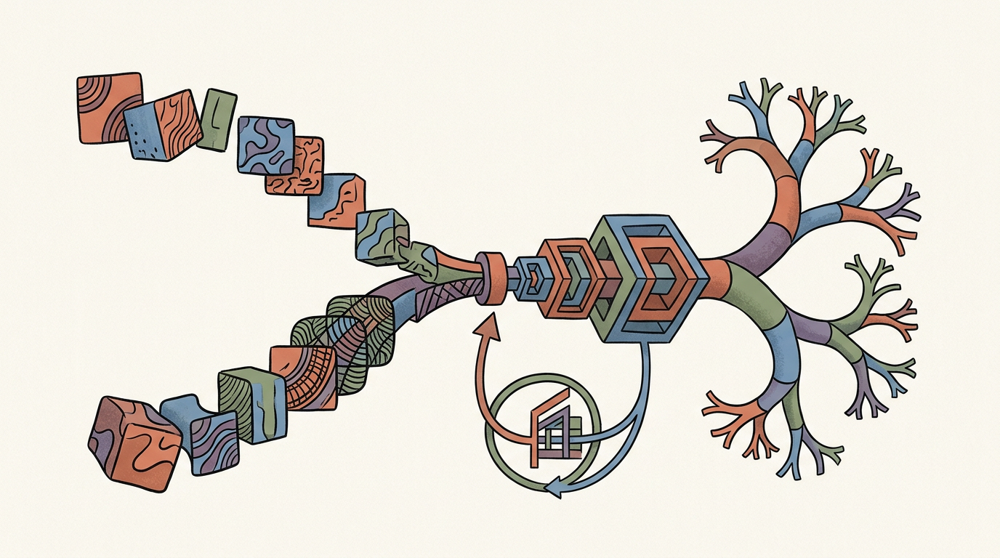
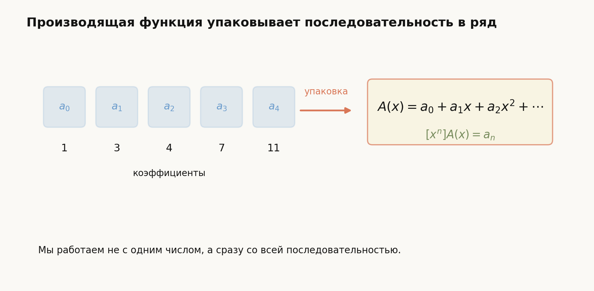
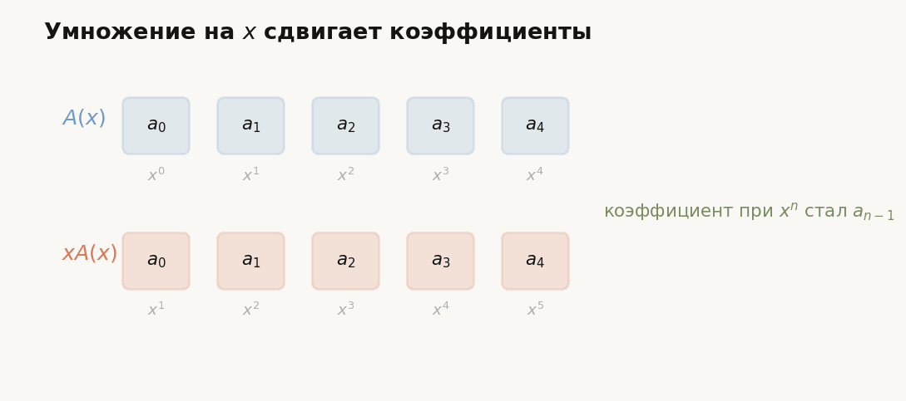
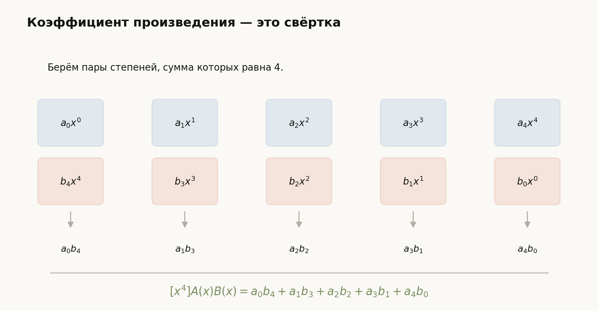
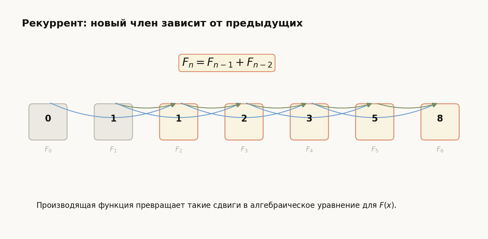

# Лекция: Производящие функции. Линейные рекурренты

## План

1. Мотивация
2. Что такое последовательность и зачем к ней привязывать функцию
3. Производящие функции: определение и первые примеры
4. Базовые операции с производящими функциями
5. Как производящие функции помогают решать комбинаторные задачи
6. Линейные рекуррентные соотношения
7. Решение линейных рекуррентов через характеристическое уравнение
8. Повторные корни характеристического уравнения
9. Связь линейных рекуррентов с производящими функциями
10. Подробные примеры
11. Типичные ошибки
12. Что важно для поступления в ШАД
13. Итоги
14. Вопросы для самопроверки

*Рис. 1. Общая идея лекции: последовательности упаковываются в алгебраические объекты, а рекурренты превращаются в уравнения.*

---

## 1. Мотивация

Во многих задачах возникает последовательность чисел:

- число способов что-то построить;
- число строк длины $n$ с ограничением;
- число путей;
- число разбиений;
- значения, заданные рекурсией.

Если считать каждое значение по отдельности, задача быстро становится громоздкой.  
Производящие функции позволяют “упаковать” всю последовательность в одну функцию, а затем работать уже с функцией как с алгебраическим объектом.

Именно поэтому производящие функции — один из самых красивых и мощных инструментов дискретной математики.

Вторая важная часть темы — **линейные рекурренты**.  
Очень многие последовательности задаются правилом вида:

$$
a_n = c_1 a_{n-1} + c_2 a_{n-2} + \cdots + c_k a_{n-k}.
$$

Классические примеры:

- числа Фибоначчи;
- число способов замостить полоску;
- число двоичных строк без соседних единиц;
- количество путей в простых графах и автоматах.

Для поступления в ШАД важно понимать обе стороны:

- как решать рекуррентные соотношения;
- как использовать производящие функции для вывода формул и подсчёта коэффициентов.

---

## 2. Последовательность как объект

Пусть дана последовательность

$$
a_0, a_1, a_2, a_3, \dots
$$

Её можно рассматривать как “список коэффициентов”.

Идея производящей функции очень проста: мы записываем эти коэффициенты в виде степенного ряда

$$
A(x) = a_0 + a_1 x + a_2 x^2 + a_3 x^3 + \cdots
$$

Эта функция и называется **обычной производящей функцией** последовательности $\{a_n\}$.

Схема ниже показывает главную идею: коэффициенты последовательности становятся коэффициентами при степенях $x$.

---

## 3. Производящие функции

## 3.1. Определение

**Обычной производящей функцией** последовательности $\{a_n\}_{n\ge 0}$ называется формальный степенной ряд

$$
A(x)=\sum_{n=0}^{\infty} a_n x^n.
$$

### Важное замечание

Здесь мы часто работаем с рядом **формально**, не обсуждая сходимость как в математическом анализе.  
Нас интересуют прежде всего коэффициенты при степенях $x$.

---

## 3.2. Первые примеры

### Пример 1. Последовательность из единиц

Если

$$
a_n=1 \quad \text{для всех } n\ge 0,
$$

то

$$
A(x)=1+x+x^2+x^3+\cdots
$$

Это геометрическая прогрессия, и формально

$$
A(x)=\frac{1}{1-x}.
$$

### Пример 2. Последовательность натуральных чисел

Если

$$
a_n=n,
$$

то

$$
A(x)=0+x+2x^2+3x^3+\cdots
$$

Известно, что

$$
\sum_{n=0}^{\infty} n x^n=\frac{x}{(1-x)^2}.
$$

### Пример 3. Степени двойки

Если

$$
a_n=2^n,
$$

то

$$
A(x)=1+2x+4x^2+8x^3+\cdots
$$

Это снова геометрическая прогрессия с знаменателем $2x$:

$$
A(x)=\frac{1}{1-2x}.
$$

---

## 4. Базовые операции с производящими функциями

Пусть

$$
A(x)=\sum_{n\ge 0} a_n x^n, \qquad B(x)=\sum_{n\ge 0} b_n x^n.
$$

## 4.1. Сложение

Тогда

$$
A(x)+B(x)=\sum_{n\ge 0}(a_n+b_n)x^n.
$$

То есть сложение производящих функций соответствует покоэффициентному сложению последовательностей.

---

## 4.2. Умножение на число

Если умножить ряд на константу $c$, получим

$$
cA(x)=\sum_{n\ge 0}(ca_n)x^n.
$$

---

## 4.3. Сдвиг

Если умножить производящую функцию на $x$, то все коэффициенты сдвигаются:

$$
xA(x)=a_0x+a_1x^2+a_2x^3+\cdots
$$

А значит, коэффициент при $x^n$ в $xA(x)$ равен $a_{n-1}$.

Это особенно важно при работе с рекуррентами.

Анимация ниже показывает этот сдвиг: после умножения на $x$ коэффициент $a_i$ переезжает от $x^i$ к $x^{i+1}$.

---

## 4.4. Произведение рядов

Произведение производящих функций:

$$
A(x)B(x)=\left(\sum_{n\ge 0} a_nx^n\right)\left(\sum_{n\ge 0} b_nx^n\right)
$$

имеет коэффициенты

$$
[x^n](A(x)B(x))=\sum_{k=0}^{n} a_k b_{n-k}.
$$

Здесь запись $[x^n]F(x)$ означает коэффициент при $x^n$ в разложении $F(x)$.

Эта сумма называется **свёрткой**.

Схема ниже показывает, почему в коэффициент при $x^n$ попадают все пары степеней, сумма которых равна $n$.

### Комбинаторный смысл

Если объект размера $n$ строится как комбинация:

- объекта размера $k$ первого типа;
- объекта размера $n-k$ второго типа,

то произведение производящих функций естественно кодирует такую сборку.

---

## 5. Стандартные полезные ряды

Эти формулы очень полезно помнить.

## 5.1. Геометрический ряд

$$
\frac{1}{1-x}=\sum_{n=0}^{\infty} x^n
$$

## 5.2. Ряд для натуральных чисел

$$
\frac{x}{(1-x)^2}=\sum_{n=0}^{\infty} nx^n
$$

## 5.3. Ряд для суммы единиц, начиная с индекса $m$

$$
x^m + x^{m+1} + x^{m+2} + \cdots = \frac{x^m}{1-x}
$$

## 5.4. Биномиальная форма

Для натурального $r$:

$$
\frac{1}{(1-x)^r}
=
\sum_{n=0}^{\infty} \binom{n+r-1}{r-1}x^n
$$

или эквивалентно

$$
\frac{1}{(1-x)^r}
=
\sum_{n=0}^{\infty} \binom{n+r-1}{n}x^n
$$

Эта формула очень часто возникает в задачах на сочетания с повторениями.

---

## 6. Комбинаторный смысл производящих функций

Производящая функция часто выглядит как “каталог вариантов”.

Если коэффициент при $x^n$ равен числу объектов размера $n$, то:

- сумма означает выбор одного из типов;
- произведение означает независимое объединение;
- степень означает выбор нескольких одинаково устроенных блоков.

---

## 7. Пример на комбинаторный подсчёт с помощью производящих функций

### Задача

Сколько решений в неотрицательных целых числах имеет уравнение

$$
x_1+x_2+x_3=n?
$$

### Решение

Каждая переменная $x_i$ может принимать значения

$$
0,1,2,\dots
$$

Значит, её производящая функция:

$$
1+x+x^2+x^3+\cdots = \frac{1}{1-x}.
$$

Для трёх независимых переменных получаем

$$
\left(\frac{1}{1-x}\right)^3=\frac{1}{(1-x)^3}.
$$

Коэффициент при $x^n$ равен числу решений. По стандартной формуле это

$$
\binom{n+2}{2}.
$$

### Ответ

$$
\binom{n+2}{2}.
$$

---

## 8. Линейные рекуррентные соотношения

## 8.1. Определение

Последовательность $\{a_n\}$ удовлетворяет **линейному рекуррентному соотношению порядка $k$**, если существуют константы $c_1,\dots,c_k$ такие, что для всех достаточно больших $n$:

$$
a_n=c_1a_{n-1}+c_2a_{n-2}+\cdots+c_ka_{n-k}.
$$

Если коэффициенты $c_1,\dots,c_k$ не зависят от $n$, то рекуррент называется линейным рекуррентом с постоянными коэффициентами.

---

## 8.2. Примеры

### Числа Фибоначчи

$$
F_n=F_{n-1}+F_{n-2}, \qquad F_0=0,\quad F_1=1.
$$

### Геометрическая прогрессия

$$
a_n=2a_{n-1}, \qquad a_0=1.
$$

### Последовательность

$$
a_n=3a_{n-1}-2a_{n-2}.
$$

---

## 9. Решение линейных рекуррентов через характеристическое уравнение

Это главный стандартный метод.

## 9.1. Идея

Пытаемся искать решение в виде

$$
a_n=r^n.
$$

Подставим в рекуррент

$$
a_n=c_1a_{n-1}+c_2a_{n-2}+\cdots+c_ka_{n-k}.
$$

Получаем:

$$
r^n=c_1r^{n-1}+c_2r^{n-2}+\cdots+c_kr^{n-k}.
$$

Если $r\ne 0$, делим на $r^{n-k}$:

$$
r^k=c_1r^{k-1}+c_2r^{k-2}+\cdots+c_k.
$$

То есть возникает **характеристическое уравнение**

$$
r^k-c_1r^{k-1}-c_2r^{k-2}-\cdots-c_k=0.
$$

---

## 9.2. Случай различных корней

Если характеристическое уравнение имеет различные корни

$$
r_1,r_2,\dots,r_k,
$$

то общее решение имеет вид

$$
a_n=A_1r_1^n+A_2r_2^n+\cdots+A_kr_k^n,
$$

где константы $A_1,\dots,A_k$ определяются из начальных условий.

---

## 10. Пример: числа Фибоначчи

Рекуррент:

$$
F_n=F_{n-1}+F_{n-2}.
$$

Ищем решение в виде $r^n$. Получаем характеристическое уравнение:

$$
r^2-r-1=0.
$$

Его корни:

$$
r_{1,2}=\frac{1\pm \sqrt{5}}{2}.
$$

Значит,

$$
F_n=A\left(\frac{1+\sqrt{5}}{2}\right)^n + B\left(\frac{1-\sqrt{5}}{2}\right)^n.
$$

Из начальных условий $F_0=0$, $F_1=1$ получаем формулу Бине:

$$
F_n=\frac{1}{\sqrt{5}}\left[\left(\frac{1+\sqrt{5}}{2}\right)^n-\left(\frac{1-\sqrt{5}}{2}\right)^n\right].
$$

---

## 11. Повторные корни характеристического уравнения

Если корень $r$ имеет кратность $m$, то в решении появляются множители $n$.

### Формула

Если $r$ — корень кратности $m$, то соответствующая часть общего решения имеет вид

$$
(A_0+A_1n+A_2n^2+\cdots+A_{m-1}n^{m-1})r^n.
$$

---

## 12. Пример с повторным корнем

Рассмотрим рекуррент

$$
a_n=2a_{n-1}-a_{n-2}.
$$

Характеристическое уравнение:

$$
r^2-2r+1=0,
$$

то есть

$$
(r-1)^2=0.
$$

Корень $r=1$ имеет кратность $2$, поэтому общее решение:

$$
a_n=A+Bn.
$$

---

## 13. Производящие функции и рекурренты

Теперь свяжем обе темы.

Если дана рекурсия, то производящая функция часто позволяет получить явную формулу.

---

## 13.1. Пример: производящая функция Фибоначчи

Пусть

$$
F_0=0,\quad F_1=1,\quad F_n=F_{n-1}+F_{n-2}\quad \text{при } n\ge 2.
$$

Рассмотрим производящую функцию

$$
F(x)=\sum_{n=0}^{\infty} F_n x^n.
$$

Тогда

$$
F(x)=F_0+F_1x+\sum_{n=2}^{\infty}F_nx^n.
$$

Используем рекурсию:

$$
\sum_{n=2}^{\infty}F_nx^n=\sum_{n=2}^{\infty}(F_{n-1}+F_{n-2})x^n.
$$

Разделим на две суммы:

$$
\sum_{n=2}^{\infty}F_{n-1}x^n+\sum_{n=2}^{\infty}F_{n-2}x^n.
$$

Перепишем:

$$
\sum_{n=2}^{\infty}F_{n-1}x^n=x\sum_{n=2}^{\infty}F_{n-1}x^{n-1}=x\sum_{m=1}^{\infty}F_mx^m=xF(x),
$$

так как $F_0=0$.

Аналогично:

$$
\sum_{n=2}^{\infty}F_{n-2}x^n=x^2\sum_{n=2}^{\infty}F_{n-2}x^{n-2}=x^2F(x).
$$

Поэтому

$$
F(x)=x+xF(x)+x^2F(x).
$$

Переносим:

$$
F(x)(1-x-x^2)=x.
$$

Следовательно,

$$
F(x)=\frac{x}{1-x-x^2}.
$$

Это производящая функция чисел Фибоначчи.

На схеме ниже видно, как рекуррент Фибоначчи использует два предыдущих члена; в производящей функции эти зависимости превращаются в сдвиги $xF(x)$ и $x^2F(x)$.

---

## 14. Как решать рекуррент через производящую функцию

Типичная схема такая.

1. Ввести производящую функцию:
   $$
   A(x)=\sum_{n\ge 0} a_nx^n.
   $$
2. Умножить рекуррент на $x^n$.
3. Просуммировать по всем $n$, начиная с нужного индекса.
4. Переписать полученные суммы через $A(x)$.
5. Решить алгебраическое уравнение для $A(x)$.
6. Разложить ответ в ряд или извлечь коэффициенты.

---

## 15. Подробные примеры

## 15.1. Рекуррент первого порядка

Пусть

$$
a_n=3a_{n-1},\qquad a_0=2.
$$

### Решение через здравый смысл

Очевидно,

$$
a_n=2\cdot 3^n.
$$

### Решение через характеристическое уравнение

Ищем $a_n=r^n$:

$$
r^n=3r^{n-1} \Rightarrow r=3.
$$

Общее решение:

$$
a_n=A3^n.
$$

Из $a_0=2$ получаем $A=2$, значит

$$
a_n=2\cdot 3^n.
$$

---

## 15.2. Рекуррент второго порядка

Пусть

$$
a_n=5a_{n-1}-6a_{n-2},\qquad a_0=1,\quad a_1=4.
$$

### Решение

Характеристическое уравнение:

$$
r^2-5r+6=0.
$$

Разложим:

$$
(r-2)(r-3)=0.
$$

Корни:

$$
r_1=2,\quad r_2=3.
$$

Значит,

$$
a_n=A2^n+B3^n.
$$

Используем начальные условия:

$$
a_0=A+B=1,
$$

$$
a_1=2A+3B=4.
$$

Из первого:

$$
A=1-B.
$$

Подставляем во второе:

$$
2(1-B)+3B=4,
$$

$$
2-2B+3B=4,
$$

$$
B=2.
$$

Тогда

$$
A=-1.
$$

Следовательно,

$$
a_n=-2^n+2\cdot 3^n.
$$

### Ответ

$$
a_n=2\cdot 3^n-2^n.
$$

---

## 15.3. Комбинаторная задача на рекуррент

Сколько существует двоичных строк длины $n$, в которых нет двух соседних единиц?

Обозначим это число через $a_n$.

### Построение рекуррента

Рассмотрим последнюю позицию.

- если строка оканчивается на $0$, то перед ней может быть любая допустимая строка длины $n-1$:
  $$
  a_{n-1};
  $$
- если строка оканчивается на $1$, то предпоследняя позиция обязана быть $0$, и перед ними стоит любая допустимая строка длины $n-2$:
  $$
  a_{n-2}.
  $$

Значит,

$$
a_n=a_{n-1}+a_{n-2}.
$$

Начальные условия:

$$
a_0=1,\qquad a_1=2.
$$

Таким образом, это почти числа Фибоначчи.

### Ответ

$$
a_n=F_{n+2},
$$

если использовать стандартные числа Фибоначчи с $F_0=0$, $F_1=1$.

---

## 15.4. Подсчёт через производящую функцию

Найдите число решений в неотрицательных целых числах уравнения

$$
x_1+x_2+x_3+x_4=7.
$$

### Решение

Для каждой переменной производящая функция:

$$
1+x+x^2+\cdots = \frac{1}{1-x}.
$$

Итого:

$$
\left(\frac{1}{1-x}\right)^4=\frac{1}{(1-x)^4}.
$$

Нужен коэффициент при $x^7$.

По стандартной формуле:

$$
[x^7]\frac{1}{(1-x)^4}=\binom{7+4-1}{4-1}=\binom{10}{3}=120.
$$

### Ответ

$$
120.
$$

---

## 15.5. Последовательность с повторным корнем

Пусть

$$
a_n=4a_{n-1}-4a_{n-2},\qquad a_0=1,\quad a_1=4.
$$

### Решение

Характеристическое уравнение:

$$
r^2-4r+4=0,
$$

то есть

$$
(r-2)^2=0.
$$

Корень $2$ кратный, значит

$$
a_n=(A+Bn)2^n.
$$

Из начальных условий:

$$
a_0=A=1.
$$

Далее:

$$
a_1=(1+B)2=4.
$$

Значит,

$$
1+B=2 \Rightarrow B=1.
$$

Итак,

$$
a_n=(n+1)2^n.
$$

### Ответ

$$
a_n=(n+1)2^n.
$$

---

## 16. Типичные ошибки

### Ошибка 1. Забывать начальные условия

Рекуррент сам по себе обычно не определяет последовательность однозначно.  
Нужны начальные значения.

### Ошибка 2. Неверно записывать характеристическое уравнение

Например, из

$$
a_n=5a_{n-1}-6a_{n-2}
$$

нужно получать

$$
r^2-5r+6=0,
$$

а не что-то со сбитыми знаками.

### Ошибка 3. Забывать множитель $n$ при кратном корне

Если корень повторяется, вид решения меняется.

### Ошибка 4. Ошибки со сдвигом в производящих функциях

Например,

$$
\sum_{n\ge 1} a_{n-1}x^n = xA(x),
$$

но нужно внимательно следить за начальными индексами.

### Ошибка 5. Путать аналитическую функцию и формальный ряд

В комбинаторике часто достаточно формальной работы с коэффициентами.

### Ошибка 6. Не извлекать коэффициент до конца

Получить рациональную функцию — это только полдела.  
Часто ещё нужно понять, чему равен коэффициент при $x^n$.

---

## 17. Что важно для поступления в ШАД

- Понимать, что производящая функция — это упаковка последовательности в степенной ряд.
- Уметь работать с геометрическим рядом:
  $$
  \frac{1}{1-x}.
  $$
- Знать стандартные разложения:
  $$
  \frac{1}{(1-x)^r}.
  $$
- Уметь составлять рекуррент по комбинаторному описанию объекта.
- Уметь решать линейные рекурренты через характеристическое уравнение.
- Понимать случай кратных корней.
- Уметь получать производящую функцию из рекурсии.
- Уметь извлекать коэффициенты из простых рациональных производящих функций.

---

## 18. Итоги

В этой теме есть две центральные идеи.

### 1. Производящие функции

Последовательность

$$
a_0,a_1,a_2,\dots
$$

упаковывается в ряд

$$
A(x)=\sum_{n\ge 0} a_nx^n.
$$

Дальше с последовательностью можно работать с помощью алгебры функций.

### 2. Линейные рекурренты

Если последовательность задаётся линейной рекурсией, то её можно исследовать:

- через характеристическое уравнение;
- через производящую функцию.

Основные формулы:

- геометрический ряд:
  $$
  \frac{1}{1-x}=\sum_{n\ge 0}x^n;
  $$
- биномиальное разложение:
  $$
  \frac{1}{(1-x)^r}=\sum_{n\ge 0}\binom{n+r-1}{r-1}x^n.
  $$

Для линейного рекуррента

$$
a_n=c_1a_{n-1}+\cdots+c_ka_{n-k}
$$

характеристическое уравнение:

$$
r^k-c_1r^{k-1}-\cdots-c_k=0.
$$

Если корни различны, то

$$
a_n=A_1r_1^n+\cdots+A_kr_k^n.
$$

Если есть кратный корень, появляются дополнительные множители $n,n^2,\dots$.

Главная идея всей темы:  
**мы заменяем трудную работу с последовательностью более удобной работой с алгебраическими объектами**.

---

## 19. Вопросы для самопроверки

1. Что такое обычная производящая функция последовательности?
2. Почему произведение производящих функций связано со свёрткой коэффициентов?
3. Чему равна производящая функция последовательности из единиц?
4. Какой коэффициент стоит при $x^n$ в $\dfrac{1}{(1-x)^3}$?
5. Что такое линейный рекуррент с постоянными коэффициентами?
6. Как строится характеристическое уравнение?
7. Как выглядит решение, если все корни различны?
8. Что меняется, если характеристический корень кратный?
9. Как получить производящую функцию из рекуррентного соотношения?
10. Чем полезны производящие функции в комбинаторике?