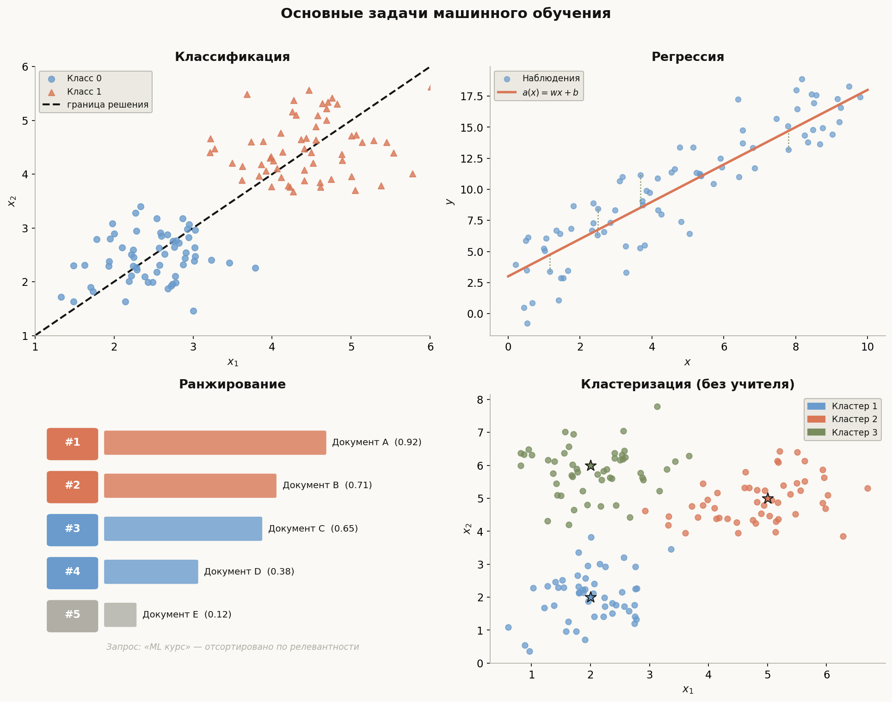
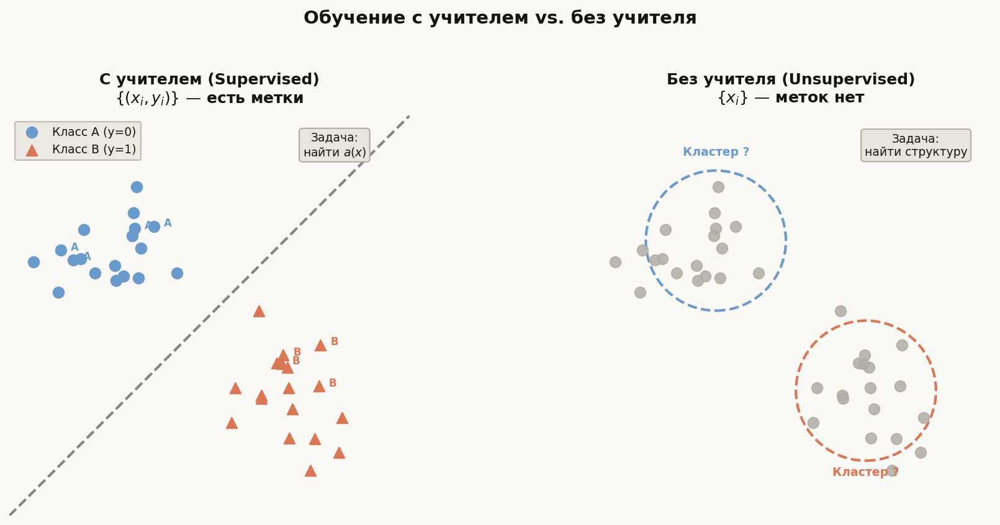
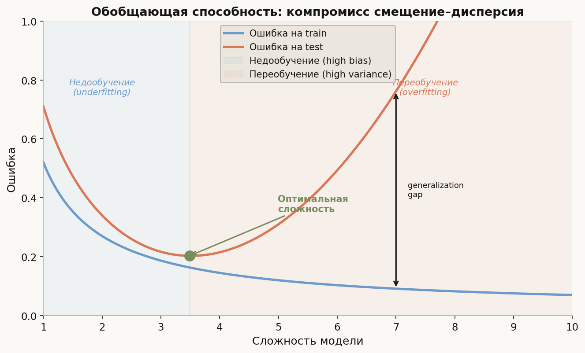

# Лекция 1. Основные задачи машинного обучения



## Зачем учить машины?

Представьте задачу: по 200 числовым признакам опухоли предсказать, злокачественная она или нет. Написать явные правила невозможно — их миллиарды, и они меняются от пациента к пациенту. Машинное обучение (МО) — это класс методов, при которых **алгоритм сам находит закономерности в данных**, вместо того чтобы их прописывать вручную.

Формально: есть пространство объектов $\mathcal{X}$, пространство ответов $\mathcal{Y}$, неизвестная зависимость $y^* : \mathcal{X} \to \mathcal{Y}$ и **обучающая выборка** $X^l = \{(x_i, y_i)\}_{i=1}^l$, где $y_i = y^*(x_i)$ — наблюдаемые ответы. Задача — найти алгоритм $a : \mathcal{X} \to \mathcal{Y}$, который **хорошо обобщается** на новые объекты.

---

## Главная формула лекции

$$a^* = \arg\min_{a \in \mathcal{A}} \, Q(a, X^l), \quad Q(a, X^l) = \frac{1}{l}\sum_{i=1}^{l} \mathcal{L}(a(x_i),\, y_i)$$

Здесь $\mathcal{L}(\hat y, y)$ — **функция потерь** (loss), $Q$ — **эмпирический риск**, $\mathcal{A}$ — семейство алгоритмов (модель). Минимизация $Q$ по $a$ — стержень всего обучения с учителем.

---

## 1. Четыре базовые задачи МО

### 1.1 Классификация

$\mathcal{Y} = \{1, \ldots, K\}$ — дискретное множество классов.  
- **Бинарная** ($K = 2$): спам / не спам, больной / здоровый.  
- **Многоклассовая** ($K > 2$): распознавание цифр (0–9), рубрикация новостей.

Типичные функции потерь: 0-1-потеря $\mathbf{1}[\hat y \ne y]$, логистическая потеря $\log(1 + e^{-y \cdot \hat y})$.

```python
from sklearn.datasets import load_iris
from sklearn.linear_model import LogisticRegression
from sklearn.model_selection import train_test_split
from sklearn.metrics import accuracy_score

X, y = load_iris(return_X_y=True)
X_train, X_test, y_train, y_test = train_test_split(X, y, test_size=0.2, random_state=42)

clf = LogisticRegression(max_iter=200)
clf.fit(X_train, y_train)
print(accuracy_score(y_test, clf.predict(X_test)))  # ~0.97
```

### 1.2 Регрессия

$\mathcal{Y} = \mathbb{R}$ (или $\mathbb{R}^d$) — непрерывный ответ.  
Примеры: прогноз стоимости квартиры, температуры завтра, времени доставки.

Типичная потеря: MSE $(\hat y - y)^2$, MAE $|\hat y - y|$.

```python
from sklearn.linear_model import LinearRegression
import numpy as np

rng = np.random.default_rng(0)
X = rng.uniform(0, 10, (100, 1))
y = 2 * X.ravel() + rng.normal(0, 1, 100)

reg = LinearRegression().fit(X, y)
print(f"w={reg.coef_[0]:.2f}, b={reg.intercept_:.2f}")  # ≈ w=2.0, b≈0
```

### 1.3 Ранжирование

$\mathcal{Y}$ — порядковая структура: нужно расположить объекты по убыванию релевантности. Задача поиска: дан запрос $q$ и 100 документов — выдать их в порядке от самого релевантного к наименее.

Потеря — попарное нарушение порядка: $\mathcal{L} = \sum_{i \succ j} \mathbf{1}[\hat s_i < \hat s_j]$ (NDCG, MRR, MAP).

```python
# Simplified pointwise ranking: predict relevance score per doc
# Real systems: LambdaMART, RankNet, ListNet
from sklearn.ensemble import GradientBoostingRegressor  # pointwise proxy

# query_doc_features: shape (n_docs, d)
# relevance_labels: 0=irrelevant, 1=partial, 2=highly relevant
# model.predict(q_d) -> score; sort by score descending
```

### 1.4 Кластеризация

$\mathcal{Y}$ — нет! Обучения без учителя: разделить объекты на **смысловые группы** без заранее данных меток.  
Примеры: сегментация клиентов, тематическая кластеризация документов.

```python
from sklearn.cluster import KMeans
from sklearn.datasets import make_blobs

X, _ = make_blobs(n_samples=300, centers=3, random_state=42)
km = KMeans(n_clusters=3, random_state=42, n_init="auto")
labels = km.fit_predict(X)
print(set(labels))  # {0, 1, 2}
```

---

## 2. Обучение с учителем и без учителя



| Парадигма | Данные | Задачи | Пример |
|---|---|---|---|
| **С учителем** (supervised) | $(x_i, y_i)$ — пары | Классификация, регрессия, ранжирование | Кредитный скоринг |
| **Без учителя** (unsupervised) | $x_i$ — без меток | Кластеризация, снижение размерности, генерация | Сегментация рынка |
| **Полуконтролируемое** (semi-supervised) | Много $x_i$, мало $(x_i, y_i)$ | Использует структуру нелабел. данных | Разметка медицинских снимков |
| **С подкреплением** (reinforcement) | Среда + награда | Управление, игры | AlphaGo, роботика |

На экзамене ШАД акцент на supervised и unsupervised — нужно уметь объяснить разницу и привести примеры.

---

## 3. Признаки, объекты, матрица «объект–признак»

**Объект** $x \in \mathcal{X}$ — описывается **вектором признаков** $x = (f_1, f_2, \ldots, f_d)$.  
Обучающая выборка — матрица $\mathbf{X} \in \mathbb{R}^{l \times d}$, вектор ответов $\mathbf{y} \in \mathcal{Y}^l$.

Типы признаков:
- **Вещественные** ($f_j \in \mathbb{R}$): рост, цена, площадь.
- **Бинарные** ($f_j \in \{0, 1\}$): есть ли гараж, подписан ли пользователь.
- **Категориальные** ($f_j \in \{a_1, \ldots, a_K\}$): страна, цвет, тип устройства.
- **Порядковые** (ordinal): рейтинг «плохо / хорошо / отлично».

```python
import pandas as pd

df = pd.DataFrame({
    "площадь": [45.0, 80.5, 30.0],       # вещественный
    "этаж": [3, 10, 1],                   # вещественный (или порядковый)
    "район": ["центр", "спальный", "центр"],  # категориальный
    "цена_млн": [6.5, 10.2, 4.1],         # целевой признак y
})
print(df.dtypes)
```

---

## 4. Обобщающая способность и разбивка на выборки

Цель МО — не просто минимизировать $Q$ на обучающей выборке, но хорошо работать на **новых** объектах. Это называется **обобщающей способностью** (generalization).

Для оценки выделяют:
- **Обучающую выборку** (train) — на ней обучается модель.
- **Валидационную** (validation) — для подбора гиперпараметров.
- **Тестовую** (test) — финальная честная оценка.

Если $Q_\text{train} \ll Q_\text{test}$ — модель **переобучилась** (overfit). Подробно разбирается в лекции 4.

```python
from sklearn.model_selection import train_test_split

X_train, X_test, y_train, y_test = train_test_split(
    X, y, test_size=0.2, random_state=42, stratify=y  # stratify для классификации
)
```



---

## 5. Выбор модели: bias-variance tradeoff (превью)

Простая модель (высокий bias, низкий variance) — недообучается.  
Сложная модель (низкий bias, высокий variance) — переобучается.  
Нужно найти баланс. Стратегия — перекрёстная проверка (CV, лекция 5).

---

## Типичные ошибки

1. **Утечка данных (data leakage)** — нормализация по всей выборке до разбивки на train/test. Статистики надо считать только по train, применять к test:
   ```python
   # НЕПРАВИЛЬНО: scaler.fit(X) затем train_test_split
   # ПРАВИЛЬНО:
   from sklearn.preprocessing import StandardScaler
   scaler = StandardScaler()
   X_train_sc = scaler.fit_transform(X_train)  # fit только на train
   X_test_sc  = scaler.transform(X_test)        # transform без fit
   ```

2. **Оценка на train вместо test** — радуетесь accuracy=1.0, а модель просто зазубрила обучающий набор.

3. **Смешение задач** — применение классификатора там, где нужна регрессия (например, предсказание цены как «дорого / дёшево» теряет информацию о величине ошибки).

4. **Игнорирование дисбаланса классов** — если 95% объектов класса 0, тривиальный классификатор «всегда 0» даёт accuracy=0.95, хотя это бесполезная модель.

5. **Несопоставимые масштабы признаков** — алгоритмы, чувствительные к расстоянию (KNN, SVM, нейросети), деградируют, если признаки не нормированы.

---

## Что важно для ШАД

- Уметь **формализовать** любую прикладную задачу: выбрать $\mathcal{X}$, $\mathcal{Y}$, $\mathcal{L}$.
- Знать разницу между **supervised** и **unsupervised** и уметь привести по 3 примера каждого.
- Понимать **матрицу «объект–признак»** и типы признаков.
- Объяснить, зачем нужна **тестовая выборка**, и почему нельзя использовать её при обучении.
- Знать, что такое **функция потерь** и как она связана с задачей.
- Понимать разницу между **классификацией** и **регрессией** на уровне $\mathcal{Y}$.

---

## Итог

Машинное обучение — это поиск алгоритма $a : \mathcal{X} \to \mathcal{Y}$, минимизирующего риск $Q(a, X^l) = \frac{1}{l}\sum \mathcal{L}(a(x_i), y_i)$. Четыре базовые задачи: **классификация** ($\mathcal{Y}$ дискретно), **регрессия** ($\mathcal{Y} \subseteq \mathbb{R}$), **ранжирование** (порядок объектов), **кластеризация** (без учителя). Ключевая идея — **обобщающая способность**: хорошая модель работает на новых данных, а не только на обучающих.

---

## Вопросы для повторения

1. Запишите формальную постановку задачи МО: что такое $\mathcal{X}$, $\mathcal{Y}$, $\mathcal{L}$, $Q$?
2. Чем классификация отличается от регрессии с точки зрения пространства ответов?
3. Что такое ранжирование? Приведите пример из поиска и из рекомендательных систем.
4. Чем кластеризация отличается от классификации?
5. Что такое «обучение с учителем»? В чём принципиальное отличие от обучения без учителя?
6. Для каких задач подходит полуконтролируемое обучение?
7. Зачем выделять отдельную тестовую выборку, если можно оценить модель на обучающей?
8. Что такое data leakage? Придумайте конкретный пример из реальной задачи.
9. Какую потерю $\mathcal{L}$ выбрать для классификации и для регрессии? Почему?
10. Объясните bias-variance tradeoff на интуитивном уровне: что происходит с ошибками при усложнении модели?
