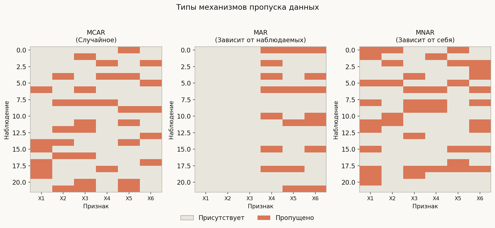
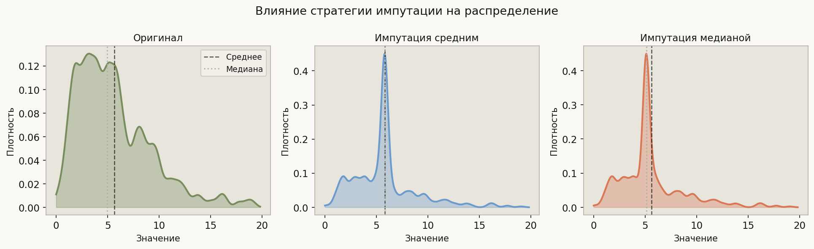
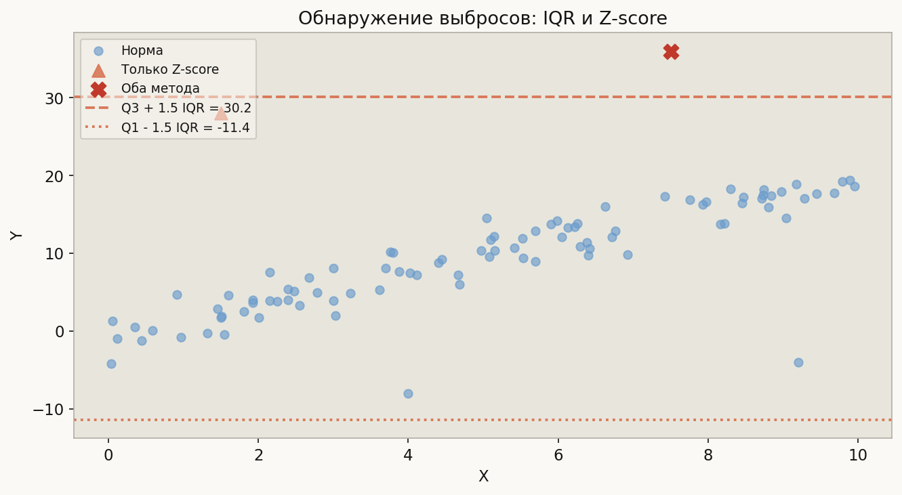

# Лекция 2. Предобработка и очистка данных. Работа с пропущенными значениями



Реальные датасеты редко приходят «чистыми»: в них встречаются пропуски, дубликаты, выбросы, несовместимые типы столбцов и перепутанные единицы измерения. Предобработка — первый и нередко самый трудоёмкий этап любого ML-проекта. Ошибки на этом этапе незаметно распространяются через весь пайплайн и искажают финальную модель: смещение (bias), внесённое неправильной импутацией, не устраняется никаким усложнением архитектуры. В этой лекции мы разбираем природу пропущенных значений и стратегии их обработки, методы обнаружения выбросов, масштабирование признаков и типичные ловушки очистки данных.

---

## 1. Типы пропущенных данных (MCAR / MAR / MNAR)

Пропуски делятся на три механизма. От механизма зависит, какой метод допустим и даёт несмещённые оценки.

| Тип | Расшифровка | Суть | Пример |
|-----|-------------|------|--------|
| **MCAR** | Missing Completely At Random | Пропуск не зависит ни от чего | Случайный сбой датчика |
| **MAR** | Missing At Random | Пропуск зависит от *наблюдаемых* переменных | Богатые реже сообщают доход, но возраст наблюдается |
| **MNAR** | Missing Not At Random | Пропуск зависит от *самого* значения | Депрессивные пациенты не заполняют опросники |

```python
import pandas as pd
import numpy as np

df = pd.DataFrame({
    'age':    [25, 30, np.nan, 45, np.nan],
    'income': [50, np.nan, 70, np.nan, 90],
    'score':  [3,  4,  5, np.nan, 2],
})

# Количество и доля пропусков по столбцам
print(df.isnull().sum())
print(df.isnull().mean() * 100)

# Паттерн пропусков: в каких строках что отсутствует
print(df.isnull())

# Little's MCAR test (mcar_test из pyreadr или statsmodels нет в sklearn;
# альтернатива — ручная проверка корреляции маски пропуска с другими признаками)
miss_mask = df['income'].isnull().astype(int)
corr_with_age = df['age'].corr(miss_mask)
print('Корреляция пропуска income с age:', round(corr_with_age, 3))
# Высокая корреляция => скорее MAR, чем MCAR
```

---

## 2. Стратегии импутации



### 2.1 Простые методы (SimpleImputer)

```python
from sklearn.impute import SimpleImputer

# Mean — только для MCAR, искажает дисперсию, не подходит при выбросах
imp_mean = SimpleImputer(strategy='mean')
X_mean = imp_mean.fit_transform(df[['age', 'income']])

# Median — устойчив к выбросам, лучше для скошенных распределений
imp_median = SimpleImputer(strategy='median')
X_median = imp_median.fit_transform(df[['age', 'income']])

# Most frequent — для категориальных и бинарных признаков
imp_mode = SimpleImputer(strategy='most_frequent')

# Constant — заменить специальным значением (пометить пропуск явно)
imp_const = SimpleImputer(strategy='constant', fill_value=-999)
```

### 2.2 KNN-импутация

```python
from sklearn.impute import KNNImputer

# k ближайших соседей по наблюдаемым признакам
# Хорош при MAR: использует корреляцию между признаками
imp_knn = KNNImputer(n_neighbors=5, weights='uniform')
X_knn = imp_knn.fit_transform(df[['age', 'income', 'score']])
```

Выбор `n_neighbors`: обычно 5–10; при малых датасетах используйте кросс-валидацию.

### 2.3 Итеративная импутация (MICE)

```python
from sklearn.experimental import enable_iterative_imputer  # noqa
from sklearn.impute import IterativeImputer
from sklearn.ensemble import RandomForestRegressor

# Каждый признак предсказывается по остальным; процедура итерируется
imp_iter = IterativeImputer(
    estimator=RandomForestRegressor(n_estimators=10, random_state=0),
    max_iter=10,
    random_state=0,
)
X_iter = imp_iter.fit_transform(df[['age', 'income', 'score']])
```

MICE (Multiple Imputation by Chained Equations) корректно обрабатывает MAR и при правильной настройке минимизирует смещение. Медленнее KNN, зато учитывает нелинейные зависимости.

### 2.4 Индикатор пропуска как признак

```python
from sklearn.impute import MissingIndicator
import numpy as np

# Добавить бинарный признак «было ли значение пропущено»
indicator = MissingIndicator()
miss_cols = indicator.fit_transform(df[['age', 'income']])

# Ручной вариант
df['income_was_missing'] = df['income'].isnull().astype(int)
# Затем импутируем
df['income'] = df['income'].fillna(df['income'].median())
```

Этот приём особенно важен при MNAR: сам факт пропуска несёт информацию для модели.

---

## Главная формула лекции

**Формула совокупной дисперсии при множественной импутации (Rubin, 1987):**

$$T = \bar{W} + \left(1 + \frac{1}{m}\right) B$$

где:
- $m$ — число вариантов импутации,
- $\bar{W} = \dfrac{1}{m}\displaystyle\sum_{i=1}^{m} W_i$ — средняя *внутри-импутационная* дисперсия (uncertainty of estimation given a complete dataset),
- $B = \dfrac{1}{m-1}\displaystyle\sum_{i=1}^{m}(\hat{\theta}_i - \bar{\theta})^2$ — *между-импутационная* дисперсия (uncertainty due to missing data).

**Интерпретация.** Первое слагаемое $\bar{W}$ — неопределённость, которая присутствовала бы даже без пропусков. Второе слагаемое $(1 + 1/m)\,B$ — дополнительная неопределённость, вызванная пропусками. При $m \to \infty$ коэффициент $(1 + 1/m) \to 1$, то есть дополнительный вклад от конечного числа импутаций исчезает.

**Следствия:**
- При MCAR: $B \approx 0$, простая однократная импутация средним даёт несмещённую оценку $\hat{\theta}$, но занижает стандартную ошибку.
- При MAR: $B > 0$, нужно $m \geq 5$ импутаций для честного доверительного интервала.
- При MNAR: ни один метод однократной импутации не устраняет смещения; необходимы чувствительностный анализ или специализированные модели.

---

## 3. Обнаружение и обработка выбросов



### 3.1 Метод IQR

```python
import pandas as pd

def iqr_bounds(series):
    q1 = series.quantile(0.25)
    q3 = series.quantile(0.75)
    iqr = q3 - q1
    return q1 - 1.5 * iqr, q3 + 1.5 * iqr

s = pd.Series([10, 12, 13, 14, 15, 16, 17, 200])
lower, upper = iqr_bounds(s)
print(f'Выбросы: {s[(s < lower) | (s > upper)].tolist()}')
# [200]
```

Метод IQR устойчив к выбросам по построению и не требует предположений о распределении.

### 3.2 Z-score

```python
from scipy import stats
import numpy as np

data = pd.Series([10, 12, 13, 14, 15, 16, 17, 200])
z = np.abs(stats.zscore(data))
print(data[z > 3])   # стандартный порог — 3 сигмы
# 7    200
```

Z-score чувствителен к самим выбросам: они раздувают стандартное отклонение и маскируют друг друга (эффект маскировки/masking).

### 3.3 Isolation Forest

```python
from sklearn.ensemble import IsolationForest
import numpy as np

X = np.array([[1], [2], [3], [4], [5], [100]])
iso = IsolationForest(contamination=0.15, random_state=0)
labels = iso.fit_predict(X)   # -1 = выброс, 1 = норма
print(labels)
# [ 1  1  1  1  1 -1]
```

Isolation Forest строит случайные деревья и измеряет, сколько разбиений нужно, чтобы изолировать точку. Аномальные точки изолируются быстрее. Не требует предположений о форме распределения, эффективен в многомерном случае.

### 3.4 Что делать с выбросами

```python
# 1. Удалить (если это ошибка ввода)
df_clean = df[~iqr_mask]

# 2. Заменить на граничное значение (winsorization / clipping)
lower_tr, upper_tr = df['income'].quantile([0.01, 0.99])
df['income_w'] = df['income'].clip(lower_tr, upper_tr)

# 3. Логарифмировать (если распределение log-normal)
df['income_log'] = np.log1p(df['income'])

# 4. Оставить и использовать устойчивый алгоритм (деревья)
```

---

## 4. Масштабирование признаков

Масштабирование необходимо для алгоритмов, чувствительных к расстоянию или градиентному спуску (KNN, SVM, PCA, нейросети, Ridge/Lasso).

```python
from sklearn.preprocessing import StandardScaler, MinMaxScaler, RobustScaler

# StandardScaler: z = (x - mu) / sigma
# Предполагает нормальное распределение, чувствителен к выбросам
std = StandardScaler()

# MinMaxScaler: x' = (x - x_min) / (x_max - x_min) -> [0, 1]
# Применяется для нейросетей и изображений; один выброс разрушает шкалу
mm = MinMaxScaler()

# RobustScaler: x' = (x - median) / IQR
# Устойчив к выбросам; лучший выбор для загрязнённых данных
rob = RobustScaler()

# КРИТИЧЕСКИ ВАЖНО: fit только на train, transform на test
X_train_scaled = rob.fit_transform(X_train)
X_test_scaled  = rob.transform(X_test)   # только transform, НЕ fit!
```

| Scaler | Формула | Когда использовать |
|--------|---------|-------------------|
| StandardScaler | $(x - \mu) / \sigma$ | Нормальное распределение, нет выбросов |
| MinMaxScaler | $(x - x_{min}) / (x_{max} - x_{min})$ | Нейросети, CNN, изображения |
| RobustScaler | $(x - Q_2) / IQR$ | Данные с выбросами, MNAR |

---

## 5. Дубликаты и преобразование типов

```python
import pandas as pd

# --- Дубликаты ---
print(df.duplicated().sum())                   # количество дублей
df = df.drop_duplicates()                      # удалить все полные дубли
df = df.drop_duplicates(subset=['user_id', 'event_date'])  # по ключам

# --- Типы данных ---
df.dtypes                                      # проверить типы
df['age'] = pd.to_numeric(df['age'], errors='coerce')   # str -> float, ошибки -> NaN
df['date'] = pd.to_datetime(df['date'], format='%Y-%m-%d')
df['category'] = df['category'].astype('category')      # экономия памяти

# Извлечение признаков из дат
df['day_of_week'] = df['date'].dt.dayofweek
df['month'] = df['date'].dt.month
```

---

## 6. Pandas Profiling Workflow

```python
# Быстрый разведочный анализ одной командой
# pip install ydata-profiling
from ydata_profiling import ProfileReport

profile = ProfileReport(df, title='EDA Report', explorative=True)
profile.to_file('eda_report.html')

# Что изучать в отчёте:
# 1. Процент пропусков по каждому столбцу
# 2. Корреляции признаков между собой и с таргетом
# 3. Предупреждения: high cardinality, constant columns, high correlation
# 4. Распределения: skewness, kurtosis, наличие пиков в местах импутации
```

---

## 7. Сборка Pipeline без утечки данных

```python
from sklearn.pipeline import Pipeline
from sklearn.impute import KNNImputer
from sklearn.preprocessing import RobustScaler
from sklearn.ensemble import GradientBoostingClassifier
from sklearn.model_selection import cross_val_score

pipe = Pipeline([
    ('imputer', KNNImputer(n_neighbors=5)),
    ('scaler',  RobustScaler()),
    ('model',   GradientBoostingClassifier(random_state=0)),
])

# cross_val_score применяет fit только к train-фолду внутри CV
scores = cross_val_score(pipe, X, y, cv=5, scoring='roc_auc')
print(scores.mean())
```

Pipeline гарантирует, что статистики (mean, IQR, kNN-соседи) вычисляются только по обучающей части каждого фолда.

---

## Типичные ошибки

### Ошибка 1: Fit скейлера на test-данных (data leakage)

```python
# НЕПРАВИЛЬНО — информация из test просачивается в train
scaler = StandardScaler()
X_train_s = scaler.fit_transform(X_train)
X_test_s  = scaler.fit_transform(X_test)   # fit на test — утечка!

# ПРАВИЛЬНО
scaler = StandardScaler()
X_train_s = scaler.fit_transform(X_train)
X_test_s  = scaler.transform(X_test)       # только transform
```

### Ошибка 2: Удаление строк без анализа механизма пропуска

```python
# НЕПРАВИЛЬНО — теряем до 40% данных при случайном пропуске
df_clean = df.dropna()

# ПРАВИЛЬНО — сначала оцениваем масштаб
missing_pct = df.isnull().mean()
cols_high_missing = missing_pct[missing_pct > 0.6].index
df = df.drop(columns=cols_high_missing)    # удалить столбцы с >60% пропусков
# Остальные пропуски — импутировать
imp = KNNImputer(n_neighbors=5)
df_imp = pd.DataFrame(imp.fit_transform(df), columns=df.columns)
```

### Ошибка 3: Mean-импутация при MNAR

При MNAR замена средним вносит систематическое смещение: среднее по наблюдаемым $\neq$ генеральное среднее. Правильно — добавить индикатор пропуска и/или использовать IterativeImputer.

```python
# ПРАВИЛЬНО при MNAR: добавить индикатор + импутировать
df['income_missing'] = df['income'].isnull().astype(int)
df['income'] = df['income'].fillna(df['income'].median())
# Теперь модель «знает», что значение было пропущено
```

### Ошибка 4: Масштабирование категориальных признаков

```python
# НЕПРАВИЛЬНО — масштабировать текстовые/категориальные признаки бессмысленно
X_scaled = scaler.fit_transform(df)   # если df содержит строки — ошибка

# ПРАВИЛЬНО — разделить числовые и категориальные
from sklearn.preprocessing import OrdinalEncoder
from sklearn.compose import ColumnTransformer

num_cols = ['age', 'income']
cat_cols = ['city', 'education']

preprocessor = ColumnTransformer([
    ('num', RobustScaler(), num_cols),
    ('cat', OrdinalEncoder(), cat_cols),
])
X_prepared = preprocessor.fit_transform(df)
```

### Ошибка 5: Клиппинг по тестовым статистикам

```python
# НЕПРАВИЛЬНО — вычисляем квантили по всем данным
lower = df['price'].quantile(0.01)
upper = df['price'].quantile(0.99)
df['price'] = df['price'].clip(lower, upper)   # и train, и test вместе

# ПРАВИЛЬНО — только по train, затем применяем к test
lower_tr = X_train['price'].quantile(0.01)
upper_tr = X_train['price'].quantile(0.99)
X_train['price'] = X_train['price'].clip(lower_tr, upper_tr)
X_test['price']  = X_test['price'].clip(lower_tr, upper_tr)
```

---

## Что важно для ШАД

- Знать три механизма пропуска (MCAR / MAR / MNAR) и уметь аргументировать, при каком из них простые методы дают несмещённые оценки.
- Уметь записать формулу Рубина $T = \bar{W} + (1 + 1/m)\,B$ и объяснить каждое слагаемое; знать, что при $m \to \infty$ коэффициент $(1 + 1/m) \to 1$.
- Знать разницу StandardScaler / MinMaxScaler / RobustScaler: когда выбросы разрушают масштабирование.
- Понимать, почему Pipeline из sklearn предотвращает data leakage при кросс-валидации.
- Isolation Forest: принцип работы через глубину изоляции, параметр `contamination`.
- IterativeImputer (MICE): итерационная схема, использование произвольного estimator, отличие от KNNImputer.
- При MNAR любая однократная импутация смещена; стандартная практика — добавлять бинарный индикатор пропуска.
- Практика: `df.isnull().mean()` и корреляция маски пропуска с другими столбцами — первые шаги диагностики.

---

## Итог

Предобработка данных — не вспомогательный шаг, а ключевая часть ML-пайплайна. Правильная классификация механизма пропусков (MCAR / MAR / MNAR) определяет допустимый класс методов импутации: при MCAR среднее несмещённо, при MAR нужен MICE, при MNAR необходим индикатор пропуска. Множественная импутация, описываемая формулой Рубина $T = \bar{W} + (1 + 1/m)\,B$, честно квантифицирует неопределённость, порождённую пропусками. Выбросы обнаруживаются методом IQR, Z-score или Isolation Forest и обрабатываются в зависимости от природы — ошибка ввода или редкое реальное событие. Масштабирование выполняется только после split на train/test, а весь пайплайн предобработки оборачивается в `sklearn.Pipeline`, чтобы исключить утечку данных при кросс-валидации.

---

## Вопросы для повторения

1. В чём принципиальное отличие MAR от MNAR? Приведите пример каждого типа в контексте медицинского датасета.
2. Почему при MCAR среднее по полным случаям даёт несмещённую оценку генерального среднего, а при MNAR — нет? Запишите формально через условное ожидание.
3. Запишите формулу Рубина для полной дисперсии при множественной импутации. Что происходит с ней при $m \to \infty$?
4. Чем RobustScaler отличается от StandardScaler? В каком случае RobustScaler даёт существенно лучший результат?
5. Как Isolation Forest обнаруживает выбросы? Почему «изолировать» аномалию проще, чем нормальный объект?
6. Что такое data leakage в контексте масштабирования, и как `sklearn.Pipeline` его предотвращает при кросс-валидации?
7. Объясните интуицию KNN-импутации: как алгоритм выбирает «донора» для пропущенного значения? Какую метрику расстояния он использует по умолчанию?
8. Почему добавление бинарного индикатора пропуска может улучшить качество модели при MNAR? Что именно «знает» модель благодаря этому признаку?
9. В каком случае лучше удалить столбец с пропусками, а не импутировать его? Назовите конкретный порог и обоснуйте.
10. Можно ли применять `IterativeImputer` к категориальным признакам? Если да — как? Если нет — почему?
