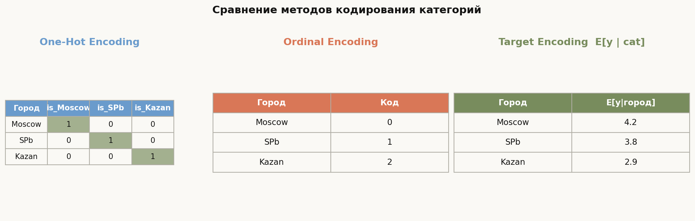
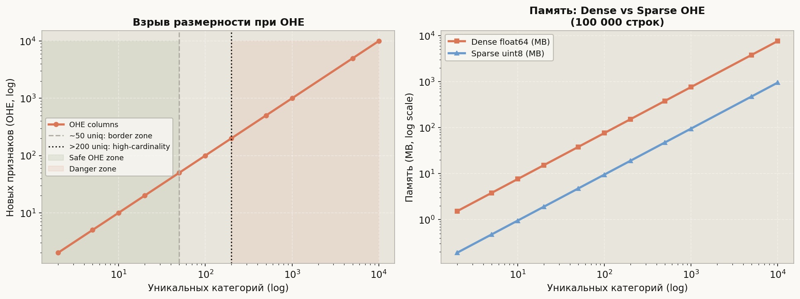
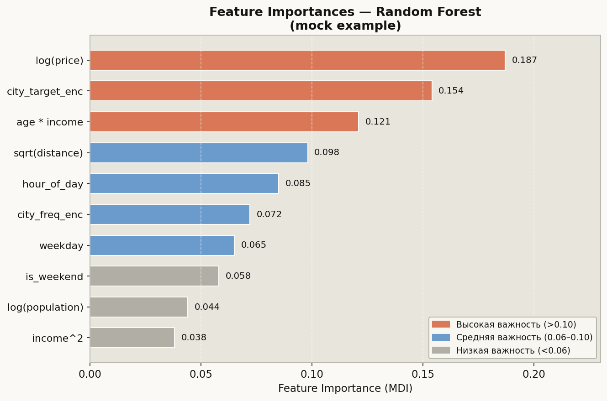

# Лекция 3. Feature Engineering и категориальные признаки


Реальные данные редко приходят в том виде, который нужен модели. Числа перекошены, категории записаны строками, даты лежат в одном столбце — и всё это нужно превратить в числовую матрицу признаков, с которой умеет работать sklearn или xgboost. **Feature Engineering** — это искусство и наука создания, преобразования и отбора признаков: именно здесь опытный специалист обгоняет автоматику, потому что он понимает предметную область. В этой лекции разберём полный арсенал: как рождать новые признаки из старых, как честно кодировать категории, как не утонуть в тысячах столбцов после One-Hot Encoding и как автоматически выбрать то, что действительно важно.

---

## 1. Создание признаков: трансформации и взаимодействия

### 1.1 Монотонные преобразования числовых признаков

Линейные модели и деревья с boosting'ом по-разному реагируют на распределение признаков. Для линейных моделей логарифм убирает правостороннюю асимметрию и делает связь более линейной:

```python
import pandas as pd
import numpy as np
from sklearn.preprocessing import FunctionTransformer

df = pd.DataFrame({'price': [100, 500, 2000, 8000, 50000]})

# log1p безопасен при нулях
df['log_price'] = np.log1p(df['price'])
df['sqrt_price'] = np.sqrt(df['price'])
df['cbrt_price'] = np.cbrt(df['price'])   # кубический корень для отрицательных

# В Pipeline:
log_transformer = FunctionTransformer(np.log1p, inverse_func=np.expm1)
```

**Когда применять:**
- `log1p` — цены, зарплаты, площади, счётчики (правостороннее распределение)
- `sqrt` — count-данные, расстояния
- `x^2` — когда связь U-образная (возраст и доход)
- `1/x` — для скоростей, времён ожидания

### 1.2 Polynomial Features и взаимодействия

```python
from sklearn.preprocessing import PolynomialFeatures

X = df[['age', 'income']].values

# degree=2: добавляет x1^2, x2^2, x1*x2
poly = PolynomialFeatures(degree=2, include_bias=False, interaction_only=False)
X_poly = poly.fit_transform(X)
print(poly.get_feature_names_out(['age', 'income']))
# ['age', 'income', 'age^2', 'age income', 'income^2']

# Только взаимодействия (без квадратов):
poly_inter = PolynomialFeatures(degree=2, interaction_only=True, include_bias=False)
X_inter = poly_inter.fit_transform(X)
```

Ручное создание взаимодействий (часто лучше автоматики, если есть гипотеза):

```python
df['price_per_sqm'] = df['price'] / (df['area'] + 1)
df['age_x_income'] = df['age'] * df['income']
df['high_income_senior'] = (df['age'] > 50).astype(int) * (df['income'] > 100_000).astype(int)
```

### 1.3 Агрегационные признаки (группировочная статистика)

```python
# Для каждого пользователя — статистики по его заказам:
order_stats = df.groupby('user_id')['order_amount'].agg(
    user_mean_order='mean',
    user_std_order='std',
    user_order_count='count',
    user_max_order='max',
).reset_index()

df = df.merge(order_stats, on='user_id', how='left')
```

---

## 2. Кодирование категориальных признаков



### 2.1 One-Hot Encoding (OHE)

Создаёт бинарный столбец для каждого уникального значения. Подходит при небольшом числе категорий (до ~50).

```python
import pandas as pd
from sklearn.preprocessing import OneHotEncoder
from sklearn.compose import ColumnTransformer

df = pd.DataFrame({'city': ['Moscow', 'SPb', 'Kazan', 'Moscow', 'SPb']})

# pandas вариант:
ohe_pd = pd.get_dummies(df['city'], prefix='city', dtype=int)

# sklearn вариант (предпочтителен в Pipeline):
enc = OneHotEncoder(sparse_output=True, handle_unknown='ignore', drop='first')
X_ohe = enc.fit_transform(df[['city']])
print(enc.get_feature_names_out())
```

`drop='first'` убирает одну категорию для избежания мультиколлинеарности (актуально для линейных моделей).

### 2.2 Ordinal Encoding

Присваивает каждой категории целочисленный код. Корректен только если категории **действительно упорядочены** (маленький → средний → большой).

```python
from sklearn.preprocessing import OrdinalEncoder

df_size = pd.DataFrame({'size': ['small', 'large', 'medium', 'small', 'large']})

enc_ord = OrdinalEncoder(categories=[['small', 'medium', 'large']])
df_size['size_code'] = enc_ord.fit_transform(df_size[['size']])
# small=0, medium=1, large=2
```

**Никогда** не используйте OrdinalEncoder для неупорядоченных категорий (город, цвет) — модель будет считать, что Moscow < SPb < Kazan как числа.

### 2.3 Target (Mean) Encoding

## Главная формула лекции

$$\hat{\mu}_c = E[y \mid \text{cat} = c] = \frac{\sum_{i: x_i = c} y_i}{|\{i : x_i = c\}|}$$

Сглаженная версия (Smoothed Target Encoding), устойчивая к редким категориям:

$$\hat{\mu}_c^{(\lambda)} = \frac{n_c \cdot \bar{y}_c + \lambda \cdot \bar{y}_{\text{global}}}{n_c + \lambda}$$

где $n_c$ — число объектов с категорией $c$, $\lambda$ — параметр сглаживания (обычно 10–30).

**Критически важно**: вычислять только на train-фолде, никогда на полном датасете — иначе лейбл-лик.

```python
from category_encoders import TargetEncoder

enc_te = TargetEncoder(smoothing=20)
df['city_target'] = enc_te.fit_transform(df['city'], df['target'])

# Вручную с CV-защитой (правильный способ):
from sklearn.model_selection import KFold

def target_encode_cv(train_df, col, target_col, n_splits=5, smoothing=20):
    global_mean = train_df[target_col].mean()
    encoded = train_df[col].copy().astype(float)
    kf = KFold(n_splits=n_splits, shuffle=True, random_state=42)
    for tr_idx, val_idx in kf.split(train_df):
        tr = train_df.iloc[tr_idx]
        stats = tr.groupby(col)[target_col].agg(['sum', 'count'])
        stats['encoded'] = (stats['sum'] + smoothing * global_mean) / (stats['count'] + smoothing)
        encoded.iloc[val_idx] = train_df.iloc[val_idx][col].map(stats['encoded']).fillna(global_mean)
    return encoded
```

### 2.4 Frequency (Count) Encoding

Заменяет категорию частотой её встречаемости в обучающей выборке:

```python
freq_map = df['city'].value_counts(normalize=True)   # доля
df['city_freq'] = df['city'].map(freq_map).fillna(0)

# Абсолютные счётчики:
count_map = df['city'].value_counts()
df['city_count'] = df['city'].map(count_map).fillna(0)
```

### 2.5 Binary Encoding и Hashing Trick

**Binary Encoding** — промежуточный вариант между OHE и Ordinal: присваивает код, затем записывает его в двоичном виде. Для $n$ категорий создаёт $\lceil \log_2 n \rceil$ столбцов:

```python
from category_encoders import BinaryEncoder

enc_bin = BinaryEncoder()
X_bin = enc_bin.fit_transform(df[['city']])
# 1000 городов -> 10 столбцов (2^10 = 1024)
```

**Hashing Trick** — без словаря, фиксированное число столбцов:

```python
from sklearn.feature_extraction import FeatureHasher

hasher = FeatureHasher(n_features=64, input_type='string')
X_hash = hasher.transform(df['city'].apply(lambda x: [x]))
```

---

## 3. Работа с высококардинальными признаками



При тысячах уникальных категорий OHE создаёт огромную разреженную матрицу. Стратегии:

### 3.1 Группировка редких категорий

```python
threshold = 50  # минимальное число появлений
counts = df['city'].value_counts()
rare_cities = counts[counts < threshold].index
df['city_grouped'] = df['city'].where(~df['city'].isin(rare_cities), other='OTHER')
```

### 3.2 Иерархические признаки

```python
# Из URL выделяем домен вместо полного адреса
df['domain'] = df['url'].str.extract(r'https?://([^/]+)')
df['tld'] = df['domain'].str.extract(r'\.(\w+)$')
```

### 3.3 Target / Frequency Encoding для высококардинальных

При 10 000 категорий Target Encoding сжимает их в 1 числовой столбец. Это и есть главное его преимущество перед OHE при высокой кардинальности.

---

## 4. Признаки из дат и времени

```python
df['timestamp'] = pd.to_datetime(df['timestamp'])

# Циклические признаки (sine/cosine encoding):
df['hour'] = df['timestamp'].dt.hour
df['hour_sin'] = np.sin(2 * np.pi * df['hour'] / 24)
df['hour_cos'] = np.cos(2 * np.pi * df['hour'] / 24)

df['month'] = df['timestamp'].dt.month
df['month_sin'] = np.sin(2 * np.pi * df['month'] / 12)
df['month_cos'] = np.cos(2 * np.pi * df['month'] / 12)

# Дискретные признаки:
df['dayofweek'] = df['timestamp'].dt.dayofweek
df['is_weekend'] = (df['dayofweek'] >= 5).astype(int)
df['is_holiday'] = df['timestamp'].dt.date.isin(holidays_list).astype(int)
df['quarter'] = df['timestamp'].dt.quarter

# Лаговые признаки (временной ряд):
df = df.sort_values('timestamp')
df['lag_1d'] = df['value'].shift(1)
df['lag_7d'] = df['value'].shift(7)
df['rolling_mean_7d'] = df['value'].rolling(7).mean()
```

Циклическое кодирование часа через `sin/cos` позволяет модели знать, что час 23 близок к часу 0.

---

## 5. TF-IDF для текстовых признаков

```python
from sklearn.feature_extraction.text import TfidfVectorizer
from sklearn.decomposition import TruncatedSVD
from sklearn.pipeline import Pipeline

corpus = df['description'].fillna('')

# Базовый TF-IDF:
tfidf = TfidfVectorizer(max_features=5000, ngram_range=(1, 2),
                         min_df=5, max_df=0.95, sublinear_tf=True)
X_tfidf = tfidf.fit_transform(corpus)

# Уменьшение размерности (LSA):
svd = TruncatedSVD(n_components=50, random_state=42)
X_lsa = svd.fit_transform(X_tfidf)

# В Pipeline:
text_pipe = Pipeline([
    ('tfidf', TfidfVectorizer(max_features=5000, sublinear_tf=True)),
    ('svd',   TruncatedSVD(n_components=50, random_state=42)),
])
X_text = text_pipe.fit_transform(corpus)
```

---

## 6. Отбор признаков (Feature Selection)



### 6.1 Variance Threshold

Удаляет признаки с нулевой (или слишком низкой) дисперсией:

```python
from sklearn.feature_selection import VarianceThreshold

sel = VarianceThreshold(threshold=0.01)   # убираем признаки, где >99% одно значение
X_filtered = sel.fit_transform(X)
```

### 6.2 Корреляционный фильтр

```python
import pandas as pd

corr_matrix = pd.DataFrame(X).corr().abs()
upper = corr_matrix.where(
    pd.DataFrame(
        data=[[i < j for j in range(corr_matrix.shape[1])]
              for i in range(corr_matrix.shape[0])],
        index=corr_matrix.index,
        columns=corr_matrix.columns
    )
)
to_drop = [col for col in upper.columns if any(upper[col] > 0.95)]
X_dropped = pd.DataFrame(X).drop(columns=to_drop)
```

### 6.3 Mutual Information

$$I(X; Y) = \sum_{x, y} p(x, y) \log \frac{p(x, y)}{p(x)\, p(y)}$$

MI = 0 означает независимость; чем больше — тем сильнее связь (нелинейная в том числе).

```python
from sklearn.feature_selection import mutual_info_classif, SelectKBest

mi_scores = mutual_info_classif(X, y, random_state=42)
selector = SelectKBest(mutual_info_classif, k=20)
X_selected = selector.fit_transform(X, y)

# Посмотреть топ-признаки:
feature_scores = pd.Series(mi_scores, index=feature_names).sort_values(ascending=False)
print(feature_scores.head(10))
```

### 6.4 RFECV — Recursive Feature Elimination with Cross-Validation

```python
from sklearn.feature_selection import RFECV
from sklearn.ensemble import RandomForestClassifier

estimator = RandomForestClassifier(n_estimators=100, random_state=42, n_jobs=-1)
rfecv = RFECV(estimator=estimator, step=1, cv=5, scoring='roc_auc', min_features_to_select=5)
rfecv.fit(X_train, y_train)

print(f'Optimal features: {rfecv.n_features_}')
X_train_rfe = rfecv.transform(X_train)
X_test_rfe  = rfecv.transform(X_test)
```

---

## Типичные ошибки

### Ошибка 1: Target Encoding без изоляции от целевой переменной (лейбл-лик)

```python
# НЕПРАВИЛЬНО — считаем статистику на всём датасете:
df['city_enc'] = df.groupby('city')['target'].transform('mean')
model.fit(df[features], df['target'])   # модель видит будущее!

# ПРАВИЛЬНО — только на train-части, с CV для стратегии вне выборки:
from sklearn.model_selection import cross_val_predict
from category_encoders import TargetEncoder

enc = TargetEncoder(smoothing=20)
# В Pipeline внутри кросс-валидации enc.fit работает только на tr-фолде
```

### Ошибка 2: OrdinalEncoder на неупорядоченных категориях

```python
# НЕПРАВИЛЬНО:
from sklearn.preprocessing import OrdinalEncoder
enc = OrdinalEncoder()
df['city_code'] = enc.fit_transform(df[['city']])
# Модель думает: Kazan(0) < Moscow(1) < SPb(2) — бессмысленно!

# ПРАВИЛЬНО: OneHotEncoder или TargetEncoder для номинальных переменных
```

### Ошибка 3: Применение PolynomialFeatures перед масштабированием

```python
# НЕПРАВИЛЬНО: poly до scaler даёт взрывной рост числовых значений
poly = PolynomialFeatures(degree=2)
X_poly = poly.fit_transform(X_raw)   # признаки 10^6 при масштабе ~1000

# ПРАВИЛЬНО: сначала StandardScaler, потом Poly
from sklearn.pipeline import Pipeline
from sklearn.preprocessing import StandardScaler

pipe = Pipeline([
    ('scaler', StandardScaler()),
    ('poly',   PolynomialFeatures(degree=2, include_bias=False)),
])
X_transformed = pipe.fit_transform(X_raw)
```

### Ошибка 4: Игнорирование редких категорий при OHE на test-данных

```python
# Если в test появился город, которого не было в train:
enc = OneHotEncoder(handle_unknown='ignore')   # ПРАВИЛЬНО: игнорируем неизвестные
# handle_unknown='error' (default) выбросит ошибку в production!

# Всегда передавайте handle_unknown='ignore' или заранее группируйте редкие:
enc = OneHotEncoder(handle_unknown='infrequent_if_exist', min_frequency=10)
```

### Ошибка 5: Не удалять мультиколлинеарные признаки перед линейной моделью

```python
# При полном OHE (без drop='first') матрица сингулярна:
enc = OneHotEncoder(drop=None)   # все K столбцов -> det(X'X) = 0

# ПРАВИЛЬНО для линейных моделей:
enc = OneHotEncoder(drop='first')          # убираем первую категорию
# или drop='if_binary' для бинарных признаков
```

---

## Что важно для ШАД

- **Feature Engineering — главный источник прироста** на реальных соревнованиях и задачах; AutoML ещё не умеет делать его с пониманием предметной области.
- **Target Encoding** — сильный метод, но требует строгой CV-дисциплины; без изоляции даёт иллюзорный прирост метрик.
- **OHE с drop='first'** обязателен перед линейными моделями; для деревьев `drop` не нужен.
- **Mutual Information** работает для нелинейных зависимостей; корреляция Пирсона — только для линейных.
- **Циклические признаки** (sin/cos) для часа/дня/месяца критичны в задачах предсказания временных рядов.
- **RFECV** надёжнее, чем просто importances, потому что учитывает взаимодействие признаков.
- **PolynomialFeatures(degree=2)** создаёт $O(n^2)$ признаков — при $n=1000$ исходных получится $\sim 500\,000$; используйте с умом.
- **Hashing Trick** (FeatureHasher) позволяет работать с категориями в online-режиме без словаря.
- **log1p** — стандартная трансформация для правостороннего распределения; не забывайте `expm1` при обратном преобразовании предсказаний.
- Все трансформации (`fit`) — **только на train**; на test применяется только `transform`.

---

## Итог

Feature Engineering — это центральный этап ML-пайплайна, где данные превращаются в признаки, понятные модели. Монотонные преобразования (`log`, `sqrt`) исправляют распределения; полиномиальные взаимодействия открывают нелинейности; правильное кодирование категорий (OHE, Target, Frequency) позволяет работать со строками; датовременные признаки с циклическим кодированием возвращают модели временную структуру; а отбор признаков через MI и RFECV убирает шум. Главная ловушка — утечка данных при Target Encoding и неправильный порядок `fit/transform`. Выстраивайте всё в sklearn Pipeline, и трансформации гарантированно применятся правильно.

---

## Вопросы для повторения

1. Почему `log1p(x)` предпочтительнее `log(x)` при наличии нулей в данных?
2. В чём разница между `PolynomialFeatures(interaction_only=True)` и `interaction_only=False`? Сколько признаков создаёт каждый вариант при $n=4$ исходных?
3. Почему Ordinal Encoding недопустим для номинальных (неупорядоченных) признаков? Приведите пример, где это даст плохую модель.
4. Запишите формулу сглаженного Target Encoding. Что происходит с кодом редкой категории при $n_c \to 0$?
5. В чём состоит утечка данных (data leakage) при наивном вычислении Target Encoding на всём датасете?
6. Почему при 5000 уникальных городов OHE создаёт проблему, а Target Encoding — нет?
7. Как циклическое `sin/cos`-кодирование часа суток решает проблему «разрыва» между 23:00 и 00:00?
8. Запишите формулу взаимной информации $I(X; Y)$. Чем она лучше корреляции Пирсона для отбора признаков?
9. Что такое RFECV и чем он отличается от простого использования `feature_importances_`?
10. В каком порядке нужно применять `StandardScaler` и `PolynomialFeatures` в пайплайне и почему?
11. Что означает параметр `handle_unknown='ignore'` в `OneHotEncoder`? Когда его нужно использовать?
12. Объясните Hashing Trick: как он позволяет обрабатывать категории без построения словаря?
