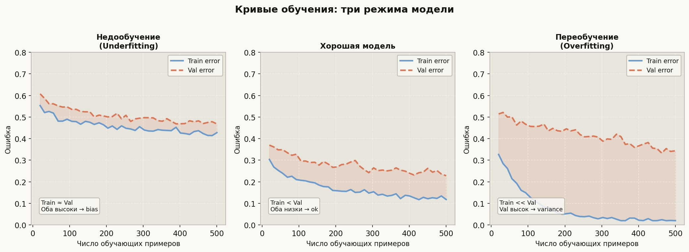
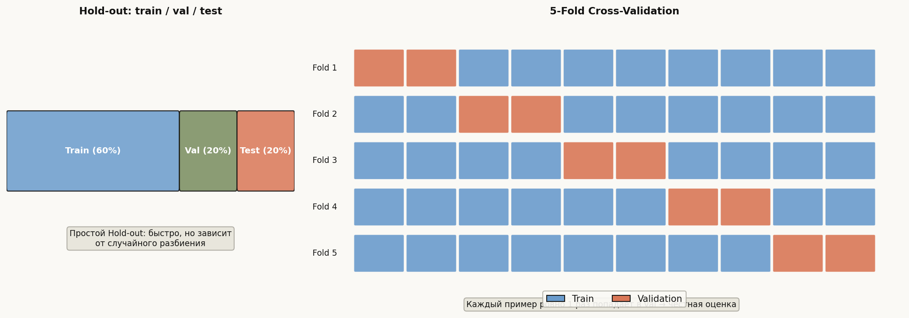
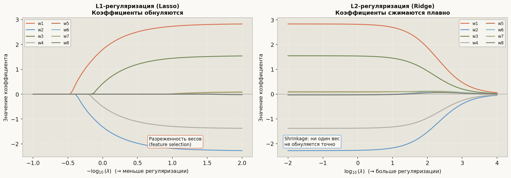

# Лекция 4. Переобучение и регуляризация


Любая достаточно мощная модель способна запомнить обучающую выборку наизусть — включая шум, случайные выбросы и артефакты конкретного набора данных. Результат впечатляет на train, но катастрофичен на новых примерах. Это переобучение (overfitting), и борьба с ним — одна из центральных тем машинного обучения. В этой лекции мы разберём, как его диагностировать по кривым обучения, как честно оценивать модель через кросс-валидацию, и как три семейства регуляризаторов — L1, L2, ElasticNet — ограничивают сложность модели через prior на веса. Финальный вывод лекции прост и глубок одновременно: лучшая модель — не та, что минимизирует ошибку на обучении, а та, что наилучшим образом обобщает.

---

## План

1. Диагностика: признаки переобучения и кривые обучения
2. train / val / test split и его ловушки
3. K-fold кросс-валидация: StratifiedKFold, LeaveOneOut
4. L2-регуляризация (Ridge): shrinkage и аналитическое решение
5. L1-регуляризация (Lasso): разреженность и геометрический смысл
6. ElasticNet: комбинация L1 + L2
7. Dropout и early stopping (нейросети)
8. Теоретический взгляд: Occam's razor, MDL, байесовский prior

---

## 1. Диагностика: признаки переобучения и кривые обучения

### 1.1 Главный признак: разрыв train / val

Переобучение проявляется как большой зазор между ошибкой на обучающей и валидационной выборке:

```python
from sklearn.linear_model import LinearRegression
from sklearn.preprocessing import PolynomialFeatures
from sklearn.pipeline import make_pipeline
from sklearn.metrics import mean_squared_error
import numpy as np

rng = np.random.default_rng(0)
X = rng.uniform(0, 1, (60, 1))
y = np.sin(2 * np.pi * X.ravel()) + rng.normal(0, 0.2, 60)

X_train, X_val = X[:40], X[40:]
y_train, y_val = y[:40], y[40:]

for deg in [1, 3, 10, 20]:
    model = make_pipeline(PolynomialFeatures(deg), LinearRegression())
    model.fit(X_train, y_train)
    mse_tr = mean_squared_error(y_train, model.predict(X_train))
    mse_vl = mean_squared_error(y_val,   model.predict(X_val))
    print(f"deg={deg:2d}  train_MSE={mse_tr:.4f}  val_MSE={mse_vl:.4f}  gap={mse_vl - mse_tr:.4f}")
```

Типичный вывод:
```
deg= 1  train_MSE=0.2081  val_MSE=0.2340  gap=0.0259
deg= 3  train_MSE=0.0412  val_MSE=0.0511  gap=0.0099
deg=10  train_MSE=0.0198  val_MSE=0.3871  gap=0.3673  ← переобучение
deg=20  train_MSE=0.0003  val_MSE=9.2140  gap=9.2137  ← катастрофа
```

### 1.2 Кривые обучения (Learning Curves)



Кривые обучения строят ошибку как функцию числа обучающих примеров — для обучающей и валидационной выборок. Три характерных паттерна:

| Паттерн | Train error | Val error | Диагноз | Лечение |
|---|---|---|---|---|
| Недообучение | Высокий | Высокий, близок к Train | High bias | Увеличить сложность модели |
| Хорошая подгонка | Низкий | Чуть выше Train, оба низкие | Баланс | Больше данных |
| Переобучение | Очень низкий | Намного выше Train | High variance | Регуляризация, больше данных |

```python
from sklearn.model_selection import learning_curve
from sklearn.svm import SVR
import matplotlib
matplotlib.use('Agg')
import matplotlib.pyplot as plt

train_sizes, train_scores, val_scores = learning_curve(
    SVR(kernel='rbf', C=10, gamma=0.1),
    X, y,
    cv=5,
    train_sizes=np.linspace(0.1, 1.0, 10),
    scoring='neg_mean_squared_error'
)

train_mean = -train_scores.mean(axis=1)
val_mean   = -val_scores.mean(axis=1)

fig, ax = plt.subplots(figsize=(8, 5))
ax.plot(train_sizes, train_mean, label='Train MSE')
ax.plot(train_sizes, val_mean,   label='Val MSE', linestyle='--')
ax.set_xlabel('Число обучающих примеров')
ax.set_ylabel('MSE')
ax.legend()
fig.savefig('learning_curve_svr.png', dpi=120, bbox_inches='tight')
plt.close(fig)
```

---

## 2. Train / Val / Test split и его ловушки

Стандартная схема:

```python
from sklearn.model_selection import train_test_split

# ПРАВИЛЬНО: сначала отсекаем test, потом val от train
X_trainval, X_test, y_trainval, y_test = train_test_split(
    X, y, test_size=0.20, random_state=42
)
X_train, X_val, y_train, y_val = train_test_split(
    X_trainval, y_trainval, test_size=0.25, random_state=42  # 0.25 * 0.80 = 0.20
)
print(f"train={len(X_train)}, val={len(X_val)}, test={len(X_test)}")
```

**Золотое правило:** тестовая выборка трогается ровно один раз — для финального отчёта. Любой подбор гиперпараметров по тесту приводит к data leakage.

---

## 3. K-fold кросс-валидация



### 3.1 Стандартный K-Fold

```python
from sklearn.model_selection import KFold, cross_val_score
from sklearn.linear_model import Ridge

kf = KFold(n_splits=5, shuffle=True, random_state=42)
scores = cross_val_score(Ridge(alpha=1.0), X_train, y_train,
                         cv=kf, scoring='neg_mean_squared_error')
print(f"CV MSE: {-scores.mean():.4f} ± {scores.std():.4f}")
```

### 3.2 StratifiedKFold — для классификации

Обычный KFold может случайно собрать fold, где редкий класс отсутствует. StratifiedKFold сохраняет пропорции классов:

```python
from sklearn.model_selection import StratifiedKFold
from sklearn.datasets import make_classification
from sklearn.linear_model import LogisticRegression

X_cls, y_cls = make_classification(n_samples=500, weights=[0.9, 0.1], random_state=0)
skf = StratifiedKFold(n_splits=5, shuffle=True, random_state=0)

scores = cross_val_score(LogisticRegression(max_iter=500), X_cls, y_cls,
                         cv=skf, scoring='roc_auc')
print(f"ROC-AUC: {scores.mean():.4f} ± {scores.std():.4f}")

# Проверяем баланс в каждом fold:
for fold_idx, (tr_idx, vl_idx) in enumerate(skf.split(X_cls, y_cls)):
    ratio = y_cls[vl_idx].mean()
    print(f"Fold {fold_idx+1}: positive rate in val = {ratio:.3f}")
```

### 3.3 LeaveOneOut

Используется при очень маленьких датасетах (n < 50). Каждый пример по очереди становится валидационным — итого n итераций:

```python
from sklearn.model_selection import LeaveOneOut

loo = LeaveOneOut()
# n_splits = len(X_small)
print(f"Число итераций LOO: {loo.get_n_splits(X_train)}")

scores_loo = cross_val_score(Ridge(alpha=1.0), X_train[:30], y_train[:30],
                              cv=loo, scoring='neg_mean_squared_error')
print(f"LOO MSE: {-scores_loo.mean():.4f}")
```

**Когда что выбирать:**

| Метод | Данных | Время | Смещение | Дисперсия |
|---|---|---|---|---|
| Hold-out | Много (>5k) | Быстро | Высокое | Низкое |
| 5–10-fold CV | Средне (500+) | Умеренно | Низкое | Умеренное |
| LOO | Мало (<50) | Медленно | Минимальное | Высокое |

---

## 4. Главная формула лекции

## Главная формула лекции

Регуляризованный функционал качества:

$$Q_\lambda(w) = \underbrace{\frac{1}{n}\sum_{i=1}^n \ell(y_i,\, \hat{y}_i)}_{\text{loss on data}} + \lambda \cdot \underbrace{R(w)}_{\text{regularizer}}$$

**L2 (Ridge):** $R(w) = \|w\|_2^2 = \sum_j w_j^2$

**L1 (Lasso):** $R(w) = \|w\|_1 = \sum_j |w_j|$

**ElasticNet:** $R(w) = \alpha \|w\|_1 + \frac{1-\alpha}{2}\|w\|_2^2$

Параметр $\lambda > 0$ управляет силой ограничения: при $\lambda \to 0$ получаем исходную задачу, при $\lambda \to \infty$ веса стремятся к нулю.

---

## 5. L2-регуляризация (Ridge)

### 5.1 Аналитическое решение

Для линейной регрессии с MSE-loss и L2-регуляризатором существует замкнутая формула:

$$\hat{w}_\text{Ridge} = (X^\top X + \lambda I)^{-1} X^\top y$$

Матрица $(X^\top X + \lambda I)$ всегда обратима при $\lambda > 0$, даже если $X^\top X$ вырождена (мультиколлинеарность).

```python
from sklearn.linear_model import Ridge, RidgeCV
import numpy as np

# Подбор alpha через CV автоматически
alphas = np.logspace(-3, 4, 50)
ridge_cv = RidgeCV(alphas=alphas, cv=5, scoring='neg_mean_squared_error')
ridge_cv.fit(X_train, y_train)
print(f"Best alpha: {ridge_cv.alpha_:.4f}")

ridge = Ridge(alpha=ridge_cv.alpha_)
ridge.fit(X_train, y_train)

from sklearn.metrics import mean_squared_error
mse_val = mean_squared_error(y_val, ridge.predict(X_val))
print(f"Val MSE (Ridge): {mse_val:.4f}")
```

### 5.2 Shrinkage: что происходит с коэффициентами

Ridge равномерно уменьшает все коэффициенты, но ни один не обнуляется точно. Геометрически: допустимая область — шар $\|w\|_2 \leq r$, гладкий, без углов → оптимум редко попадает в координатную ось.

```python
# Сравнение OLS vs Ridge при мультиколлинеарности
from sklearn.datasets import make_regression
from sklearn.linear_model import LinearRegression

X_col, y_col, true_w = make_regression(
    n_samples=100, n_features=5, n_informative=3,
    noise=5, coef=True, random_state=7
)
# Добавим коллинеарный признак
X_col = np.hstack([X_col, X_col[:, [0]] + np.random.normal(0, 0.01, (100, 1))])

ols = LinearRegression().fit(X_col, y_col)
rdg = Ridge(alpha=10.0).fit(X_col, y_col)

print("OLS  weights:", np.round(ols.coef_, 2))
print("Ridge weights:", np.round(rdg.coef_, 2))
# OLS: огромные нестабильные веса; Ridge: умеренные
```

---

## 6. L1-регуляризация (Lasso)



### 6.1 Разреженность весов

L1-регуляризатор имеет угловые точки на координатных осях — именно туда «притягивается» оптимум. Результат: часть весов обнуляется точно → автоматический отбор признаков.

```python
from sklearn.linear_model import Lasso, LassoCV

# Подбор alpha через CV
lasso_cv = LassoCV(cv=5, random_state=0, max_iter=10000)
lasso_cv.fit(X_train, y_train)
print(f"Best alpha: {lasso_cv.alpha_:.6f}")

lasso = Lasso(alpha=lasso_cv.alpha_, max_iter=10000)
lasso.fit(X_train, y_train)

n_zero = (lasso.coef_ == 0).sum()
print(f"Обнулено признаков: {n_zero} из {lasso.coef_.shape[0]}")
print(f"Ненулевые признаки: {np.where(lasso.coef_ != 0)[0]}")
```

### 6.2 Путь коэффициентов (Lasso path)

```python
from sklearn.linear_model import lasso_path

alphas, coefs, _ = lasso_path(X_train, y_train, n_alphas=100)
# coefs.shape = (n_features, n_alphas)
# При уменьшении alpha признаки последовательно "включаются"
```

### 6.3 Геометрический смысл

Lasso решает constrained задачу: минимизировать MSE при $\|w\|_1 \leq t$. Допустимая область — бриллиант (L1-шар) с угловыми точками на осях. Уровни функции потерь "цепляются" за угол → один из $w_j = 0$.

---

## 7. ElasticNet

ElasticNet объединяет L1 и L2, устраняя недостатки обоих:
- L1 нестабилен при коллинеарных признаках (выбирает один из группы произвольно)
- L2 не обнуляет коэффициенты

```python
from sklearn.linear_model import ElasticNet, ElasticNetCV

# l1_ratio: 1.0 = Lasso, 0.0 = Ridge, 0.5 = по умолчанию
en_cv = ElasticNetCV(
    l1_ratio=[0.1, 0.5, 0.7, 0.9, 0.95, 1.0],
    cv=5, random_state=0, max_iter=10000
)
en_cv.fit(X_train, y_train)
print(f"Best alpha={en_cv.alpha_:.5f}, l1_ratio={en_cv.l1_ratio_:.2f}")

en = ElasticNet(alpha=en_cv.alpha_, l1_ratio=en_cv.l1_ratio_, max_iter=10000)
en.fit(X_train, y_train)
mse_val = mean_squared_error(y_val, en.predict(X_val))
print(f"Val MSE (ElasticNet): {mse_val:.4f}")
```

**Сравнение трёх методов:**

```python
from sklearn.linear_model import Ridge, Lasso, ElasticNet
from sklearn.datasets import make_regression

X_r, y_r, _ = make_regression(n_samples=300, n_features=20, n_informative=5,
                                noise=10, random_state=0)
X_tr, X_vl, y_tr, y_vl = train_test_split(X_r, y_r, test_size=0.3, random_state=0)

for name, model in [
    ('Ridge',      Ridge(alpha=1.0)),
    ('Lasso',      Lasso(alpha=0.5, max_iter=5000)),
    ('ElasticNet', ElasticNet(alpha=0.5, l1_ratio=0.5, max_iter=5000)),
]:
    model.fit(X_tr, y_tr)
    mse = mean_squared_error(y_vl, model.predict(X_vl))
    n_zero = (model.coef_ == 0).sum()
    print(f"{name:12s}: Val MSE={mse:.2f}, zero coefs={n_zero}/20")
```

---

## 8. Dropout и early stopping (нейросети)

### 8.1 Early stopping

Останавливаем обучение до достижения минимума train loss — в точке минимума val loss:

```python
# Пример с sklearn MLP (демонстрация логики)
from sklearn.neural_network import MLPRegressor

mlp = MLPRegressor(
    hidden_layer_sizes=(100, 50),
    max_iter=1000,
    early_stopping=True,   # ← включает early stopping
    validation_fraction=0.1,
    n_iter_no_change=10,   # остановиться после 10 эпох без улучшения
    random_state=0
)
mlp.fit(X_train, y_train)
print(f"Обучено эпох: {mlp.n_iter_}")
print(f"Val MSE: {mean_squared_error(y_val, mlp.predict(X_val)):.4f}")
```

### 8.2 Dropout (логика)

Dropout случайно "выключает" нейроны в процессе обучения с вероятностью $p$. Это эквивалентно обучению экспоненциально большого ансамбля разреженных сетей. На инференсе все нейроны включены, веса масштабируются на $(1-p)$.

```python
# PyTorch-псевдокод (концептуально):
# import torch.nn as nn
# nn.Dropout(p=0.5)  — в train режиме обнуляет 50% нейронов
# В inference режиме (model.eval()) Dropout отключается автоматически
```

---

## 9. Теоретический взгляд: Occam's razor, MDL, байесовский prior

**Occam's razor (бритва Оккама):** из двух моделей с одинаковым качеством предпочитаем более простую. Регуляризация формализует это предпочтение.

**MDL (Minimum Description Length):** лучшая модель — та, что требует меньше бит для описания данных. Сложная модель "экономит" на описании ошибок, но тратит больше на описание самой себя.

**Байесовская интерпретация:** L2-регуляризация эквивалентна MAP-оценке при гауссовском приоре на веса $p(w) \propto \exp(-\lambda \|w\|_2^2)$. L1 — при лапласовском приоре $p(w) \propto \exp(-\lambda \|w\|_1)$.

```python
# Демонстрация: Ridge как MAP с гауссовским prior
# Q(w) = MSE + lambda * ||w||^2
# = -log P(y|X,w) - log P(w)   (с точностью до константы)
# где P(w) = N(0, 1/(2*lambda)*I)

# При lambda -> 0: MAP -> MLE (обычная регрессия)
# При lambda -> inf: w -> 0 (prior доминирует)
for alpha in [0.001, 0.1, 1.0, 10.0, 100.0]:
    w = Ridge(alpha=alpha).fit(X_train, y_train).coef_
    print(f"alpha={alpha:6.3f}: ||w||_2 = {np.linalg.norm(w):.3f}")
```

---

## Типичные ошибки

### Ошибка 1: подбор гиперпараметров по тестовой выборке

```python
# НЕПРАВИЛЬНО: test используется для подбора lambda
best_alpha, best_score = None, float('inf')
for alpha in [0.01, 0.1, 1.0, 10.0]:
    score = mean_squared_error(y_test, Ridge(alpha=alpha).fit(X_train, y_train).predict(X_test))
    if score < best_score:
        best_score, best_alpha = score, alpha
# Результат: завышенный оптимизм, test "загрязнён"

# ПРАВИЛЬНО: подбор по val или через CV
ridge_cv = RidgeCV(alphas=[0.01, 0.1, 1.0, 10.0], cv=5)
ridge_cv.fit(X_train, y_train)
final_score = mean_squared_error(y_test, ridge_cv.predict(X_test))
```

### Ошибка 2: масштабирование после разбиения (data leakage)

```python
from sklearn.preprocessing import StandardScaler

# НЕПРАВИЛЬНО: scaler видит val/test при fit
scaler = StandardScaler()
X_all_scaled = scaler.fit_transform(X)  # leakage!
X_tr, X_vl = X_all_scaled[:40], X_all_scaled[40:]

# ПРАВИЛЬНО: fit только на train
scaler = StandardScaler()
X_tr_scaled = scaler.fit_transform(X_train)
X_vl_scaled = scaler.transform(X_val)    # только transform
X_te_scaled = scaler.transform(X_test)   # только transform
```

### Ошибка 3: не масштабировать перед Ridge/Lasso

L1/L2 штрафуют $\|w\|$, но если признаки в разных шкалах, штраф несправедлив: признак с большим масштабом получает большой вес уже потому, что маленький.

```python
from sklearn.pipeline import Pipeline

# ПРАВИЛЬНО: StandardScaler внутри Pipeline
pipe = Pipeline([
    ('scaler', StandardScaler()),
    ('lasso',  Lasso(alpha=0.1, max_iter=10000)),
])
pipe.fit(X_train, y_train)
print(f"Val MSE: {mean_squared_error(y_val, pipe.predict(X_val)):.4f}")
```

### Ошибка 4: игнорировать стратификацию при дисбалансе классов

```python
from sklearn.model_selection import train_test_split

# НЕПРАВИЛЬНО: простое разбиение при дисбалансе 1:9
X_tr, X_vl, y_tr, y_vl = train_test_split(X_cls, y_cls, test_size=0.2)
print(f"Val positive rate: {y_vl.mean():.3f}")  # может быть 0.0 или 0.3 — случайно

# ПРАВИЛЬНО: stratify
X_tr, X_vl, y_tr, y_vl = train_test_split(X_cls, y_cls, test_size=0.2,
                                            stratify=y_cls, random_state=42)
print(f"Val positive rate: {y_vl.mean():.3f}")  # строго 0.10
```

### Ошибка 5: путать alpha в Ridge/Lasso с learning rate

В sklearn `alpha` — коэффициент регуляризации $\lambda$. Он не имеет отношения к learning rate в градиентном спуске. Большой `alpha` = сильная регуляризация = маленькие веса.

```python
# Ridge(alpha=1000) — очень сильная регуляризация, модель почти нулевая
# Ridge(alpha=0.001) — слабая регуляризация, почти OLS
# LassoCV и RidgeCV подберут alpha сами — предпочитайте их
```

---

## Что важно для ШАД

- Уметь объяснить, почему train error всегда ниже val error даже без переобучения
- Знать аналитическое решение Ridge: $\hat{w} = (X^\top X + \lambda I)^{-1} X^\top y$
- Понимать геометрию L1 (бриллиант) vs L2 (шар) и почему L1 даёт разреженность
- Уметь строить кривые обучения и диагностировать по ним bias vs variance
- Знать разницу KFold / StratifiedKFold / LOO и уметь выбрать нужный
- Понимать, что масштабирование обязательно перед L1/L2 и должно делаться только по train
- Уметь объяснить связь L2 с гауссовским prior (MAP-оценка)
- Понимать Bias-Variance Tradeoff: увеличение $\lambda$ снижает variance, но увеличивает bias

---

## Итог

Переобучение — неизбежный спутник мощных моделей, и главный инструмент борьбы с ним — регуляризация совместно с честной оценкой обобщающей способности. Разбиение на train/val/test защищает тестовую выборку от участия в обучении и подборе гиперпараметров; кросс-валидация даёт устойчивую оценку при ограниченных данных. L2-регуляризация (Ridge) равномерно уменьшает все веса и решает проблему мультиколлинеарности; L1-регуляризация (Lasso) обнуляет часть весов, выполняя автоматический отбор признаков; ElasticNet объединяет их достоинства. Все три метода имеют элегантную байесовскую интерпретацию как MAP-оценка с соответствующим prior. Финальная философия — Occam's razor: при равном качестве выбираем более простую модель, потому что простота обобщает.

---

## Вопросы для повторения

1. Почему train loss всегда меньше val loss, даже если переобучения нет?
2. Как выглядит кривая обучения при недообучении? Что нужно изменить?
3. Почему нельзя подбирать гиперпараметры по тестовой выборке?
4. В чём разница между KFold и StratifiedKFold? Когда обязательно использовать второй?
5. Выведите аналитическое решение Ridge-регрессии из условия $\nabla_w Q = 0$.
6. Почему L1-регуляризация даёт разреженные решения, а L2 — нет? Объясните геометрически.
7. Что произойдёт с коэффициентами Ridge, если $\lambda \to \infty$? Если $\lambda \to 0$?
8. Какой prior на веса соответствует L2-регуляризации? Запишите формулу.
9. В чём преимущество ElasticNet перед чистым Lasso при коллинеарных признаках?
10. Почему нужно масштабировать признаки перед применением Ridge или Lasso?
11. Что такое early stopping и почему он работает как регуляризация?
12. Сформулируйте Bias-Variance Tradeoff: как $\lambda$ влияет на bias и variance?
