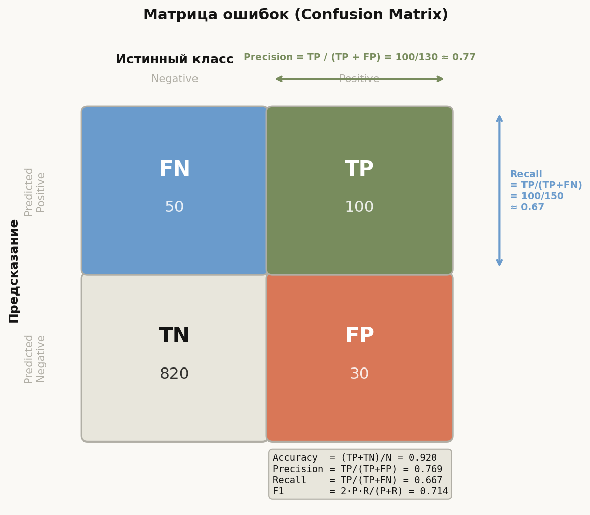
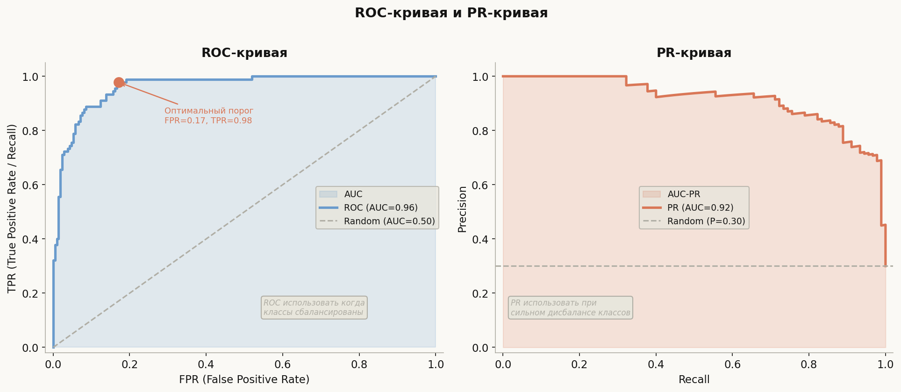
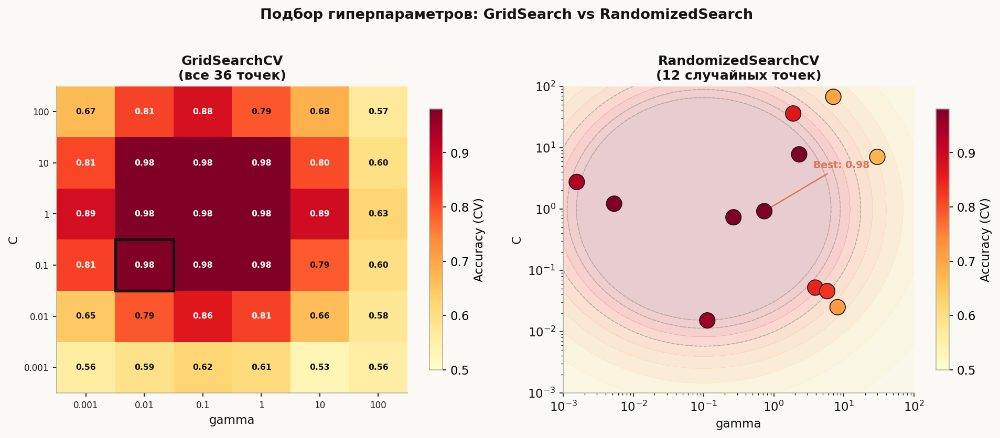

# Лекция 5. Сравнение моделей. Метрики классификации и регрессии


Обучить модель — лишь половина работы. Вторая половина — понять, **насколько хорошо она работает** и лучше ли она альтернатив. Без правильно выбранной метрики accuracy=0.99 может скрывать катастрофу (99% записей просто относятся к одному классу), а красивый RMSE — оказаться несравнимым между задачами. Эта лекция строит полный инструментарий: метрики классификации от простейших до F-beta, ROC- и PR-кривые, метрики регрессии, статистические тесты для честного сравнения и методологию подбора гиперпараметров без data leakage.

---

## Главная формула лекции

$$F_\beta = \frac{(1+\beta^2) \cdot P \cdot R}{\beta^2 \cdot P + R}, \qquad \text{AUC} = \int_0^1 \text{TPR}(t)\,d\,\text{FPR}(t)$$

$F_\beta$ объединяет precision и recall с весом $\beta$: при $\beta=1$ оба равноправны, при $\beta>1$ важнее recall, при $\beta<1$ — precision. AUC-ROC — площадь под кривой ROC, среднее TPR по всем возможным порогам.

---

## План

1. Матрица ошибок и базовые метрики классификации
2. F-beta, macro/micro/weighted averaging
3. ROC-кривая и AUC-ROC
4. PR-кривая и AUC-PR
5. Метрики регрессии
6. Статистическое сравнение моделей
7. GridSearchCV и RandomizedSearchCV
8. Bayesian optimization (Optuna)
9. Nested cross-validation

---

## 1. Матрица ошибок и базовые метрики



Для бинарной классификации все предсказания ложатся в одну из четырёх ячеек:

| | Predicted Negative | Predicted Positive |
|---|---|---|
| **Actual Negative** | TN | FP |
| **Actual Positive** | FN | TP |

- **TP** (True Positive) — правильно предсказан положительный класс.
- **TN** (True Negative) — правильно предсказан отрицательный.
- **FP** (False Positive) — ошибочно предсказан положительный (ошибка I рода).
- **FN** (False Negative) — ошибочно предсказан отрицательный (ошибка II рода).

### Производные метрики

$$\text{Accuracy} = \frac{TP + TN}{TP + TN + FP + FN}$$

$$\text{Precision} = \frac{TP}{TP + FP} \quad \text{(из тех, кого назвали позитивом, сколько правильно)}$$

$$\text{Recall} = \frac{TP}{TP + FN} \quad \text{(из реальных позитивов, сколько поймали)}$$

$$\text{Specificity} = \frac{TN}{TN + FP} \quad \text{(из реальных негативов, сколько правильно)}$$

```python
from sklearn.metrics import (
    confusion_matrix, accuracy_score,
    precision_score, recall_score, f1_score,
    classification_report
)
from sklearn.linear_model import LogisticRegression
from sklearn.datasets import make_classification
from sklearn.model_selection import train_test_split

X, y = make_classification(n_samples=1000, n_features=20,
                           weights=[0.9, 0.1], random_state=42)
X_tr, X_te, y_tr, y_te = train_test_split(X, y, test_size=0.2, random_state=42)

clf = LogisticRegression(max_iter=500)
clf.fit(X_tr, y_tr)
y_pred = clf.predict(X_te)

print(confusion_matrix(y_te, y_pred))
print(classification_report(y_te, y_pred))
# При дисбалансе 9:1 accuracy ~0.91 даже у тривиальной модели!
```

---

## 2. F-beta: управление компромиссом precision–recall

$$F_\beta = \frac{(1+\beta^2) \cdot P \cdot R}{\beta^2 \cdot P + R}$$

- $\beta = 1$: F1 — гармоническое среднее P и R.
- $\beta = 2$: F2 — recall в два раза важнее precision (пример: диагностика рака — пропустить больного хуже, чем ложная тревога).
- $\beta = 0.5$: F0.5 — precision важнее (пример: спам-фильтр — лучше пропустить спам, чем удалить важное письмо).

### Многоклассовое усреднение

| Стратегия | Что делает |
|---|---|
| `macro` | Среднее метрики по каждому классу без взвешивания |
| `weighted` | Взвешенное по числу объектов в каждом классе |
| `micro` | Суммирует TP/FP/FN по всем классам, затем считает метрику |

```python
from sklearn.metrics import fbeta_score, f1_score
import numpy as np

y_true = np.array([0, 0, 1, 1, 1, 2])
y_pred = np.array([0, 1, 0, 1, 1, 2])

# F2 — recall важнее
print(fbeta_score(y_true, y_pred, beta=2, average="macro"))

# F1 с различными стратегиями усреднения
for avg in ("macro", "micro", "weighted"):
    print(f"F1 {avg}: {f1_score(y_true, y_pred, average=avg):.3f}")
```

---

## 3. ROC-кривая и AUC-ROC



ROC (Receiver Operating Characteristic) строится так: для каждого порога $\tau \in [0,1]$ считается пара (FPR, TPR). При уменьшении $\tau$ порог снижается → больше объектов относим к классу 1 → TPR растёт, но и FPR растёт.

$$\text{AUC-ROC} = \int_0^1 \text{TPR}(t)\,d\,\text{FPR}(t)$$

**Интерпретация AUC-ROC**: вероятность того, что случайно выбранный положительный объект получит более высокий score, чем случайно выбранный отрицательный. AUC=0.5 — случайное угадывание, AUC=1.0 — идеальная модель.

### Выбор порога

Метод **Youden J**: $J = \text{TPR} - \text{FPR}$, выбирают $\tau^* = \arg\max_\tau J(\tau)$.

```python
from sklearn.metrics import roc_curve, auc
from sklearn.linear_model import LogisticRegression
import numpy as np

# clf уже обучен
y_scores = clf.predict_proba(X_te)[:, 1]

fpr, tpr, thresholds = roc_curve(y_te, y_scores)
roc_auc = auc(fpr, tpr)
print(f"AUC-ROC = {roc_auc:.3f}")

# Оптимальный порог по Youden J
j_scores = tpr - fpr
best_idx = np.argmax(j_scores)
best_threshold = thresholds[best_idx]
print(f"Optimal threshold: {best_threshold:.3f}  "
      f"(TPR={tpr[best_idx]:.2f}, FPR={fpr[best_idx]:.2f})")

# Применяем порог
y_pred_opt = (y_scores >= best_threshold).astype(int)
```

---

## 4. PR-кривая и AUC-PR

PR-кривая строится по тем же порогам: ось X — Recall, ось Y — Precision. Площадь под PR-кривой (AUC-PR, или Average Precision — AP) важна при **сильном дисбалансе классов**.

**Почему PR информативнее ROC при дисбалансе?** ROC-кривая опирается на TN (знаменатель FPR). При 1:100 дисбалансе TN велики, FPR кажется маленьким даже при многих FP. PR-кривая не использует TN — precision сразу "видит" лишние FP.

```python
from sklearn.metrics import precision_recall_curve, average_precision_score

precision, recall, _ = precision_recall_curve(y_te, y_scores)
ap = average_precision_score(y_te, y_scores)
print(f"Average Precision (AUC-PR) = {ap:.3f}")

# Для сравнения: random classifier baseline = prevalence
prevalence = y_te.mean()
print(f"Random baseline AP = {prevalence:.3f}")
```

**Когда использовать PR вместо ROC:**
- Сильный дисбаланс (< 5% позитивных).
- Важна именно точность нахождения позитивного класса (поиск аномалий, медицинская диагностика, детекция мошенничества).

---

## 5. Метрики регрессии

| Метрика | Формула | Особенности |
|---|---|---|
| MSE | $\frac{1}{n}\sum(\hat y_i - y_i)^2$ | Штрафует выбросы квадратично |
| RMSE | $\sqrt{\text{MSE}}$ | Единицы измерения совпадают с $y$ |
| MAE | $\frac{1}{n}\sum|\hat y_i - y_i|$ | Робастен к выбросам |
| MAPE | $\frac{100\%}{n}\sum\left|\frac{y_i-\hat y_i}{y_i}\right|$ | Относительная ошибка; нельзя при $y_i=0$ |
| R² | $1 - \frac{\sum(\hat y_i - y_i)^2}{\sum(\bar y - y_i)^2}$ | 1 = идеал, 0 = среднее, <0 = хуже среднего |

```python
from sklearn.metrics import (
    mean_squared_error, mean_absolute_error,
    mean_absolute_percentage_error, r2_score
)
import numpy as np

rng = np.random.default_rng(0)
y_true = rng.uniform(10, 100, 200)
y_pred = y_true + rng.normal(0, 8, 200)

mse  = mean_squared_error(y_true, y_pred)
rmse = np.sqrt(mse)
mae  = mean_absolute_error(y_true, y_pred)
mape = mean_absolute_percentage_error(y_true, y_pred) * 100
r2   = r2_score(y_true, y_pred)

print(f"MSE  = {mse:.2f}")
print(f"RMSE = {rmse:.2f}")
print(f"MAE  = {mae:.2f}")
print(f"MAPE = {mape:.1f}%")
print(f"R²   = {r2:.3f}")
```

### Когда что выбирать

- **RMSE**: когда большие ошибки особенно нежелательны (выброс → большой штраф).
- **MAE**: когда нужна интерпретируемость и устойчивость к выбросам.
- **MAPE**: когда важна относительная ошибка (финансовые прогнозы), но осторожно при $y_i \approx 0$.
- **R²**: для понимания доли объяснённой дисперсии; позволяет сравнивать модели на разных масштабах.

---

## 6. Статистическое сравнение моделей

Одно число метрики на одном тесте — ненадёжно. Нужно проверить, что разница не случайна.

### Paired t-тест (5×2 CV test)

Применим, когда сравниваются две модели. Разбиваем данные 5 раз на 50%/50%, обучаем обе модели, считаем разницы $d_i$ в метриках:

$$t = \frac{\bar d}{s_d / \sqrt{n}}, \qquad H_0: \bar d = 0$$

```python
from scipy import stats
import numpy as np
from sklearn.model_selection import cross_val_score, RepeatedKFold
from sklearn.linear_model import LogisticRegression
from sklearn.ensemble import RandomForestClassifier
from sklearn.datasets import make_classification

X, y = make_classification(n_samples=500, n_features=20, random_state=42)

cv = RepeatedKFold(n_splits=5, n_repeats=2, random_state=42)
scores_lr = cross_val_score(LogisticRegression(max_iter=500), X, y, cv=cv)
scores_rf = cross_val_score(RandomForestClassifier(n_estimators=100), X, y, cv=cv)

diff = scores_rf - scores_lr
t_stat, p_value = stats.ttest_rel(scores_rf, scores_lr)
print(f"Mean diff: {diff.mean():.4f}")
print(f"t={t_stat:.3f}, p={p_value:.4f}")
if p_value < 0.05:
    print("Разница статистически значима (p < 0.05)")
```

### Критерий Вилкоксона

Непараметрический аналог — не требует нормальности распределения ошибок:

```python
from scipy.stats import wilcoxon

stat, p = wilcoxon(scores_rf, scores_lr)
print(f"Wilcoxon: stat={stat:.1f}, p={p:.4f}")
```

### Поправка Бонферрони

При сравнении $k$ моделей вероятность случайной значимости растёт. Поправка: делим уровень значимости на число сравнений.

$$\alpha_{\text{adjusted}} = \frac{\alpha}{k(k-1)/2}$$

```python
from itertools import combinations

models = {"LR": scores_lr, "RF": scores_rf}
# Добавим ещё одну модель для примера
from sklearn.svm import SVC
scores_svm = cross_val_score(SVC(kernel="rbf"), X, y, cv=cv)
models["SVM"] = scores_svm

pairs = list(combinations(models.keys(), 2))
alpha = 0.05
alpha_bonf = alpha / len(pairs)
print(f"Bonferroni threshold: {alpha_bonf:.4f}")

for m1, m2 in pairs:
    _, p = stats.ttest_rel(models[m1], models[m2])
    sig = "ЗНАЧИМА" if p < alpha_bonf else "не значима"
    print(f"{m1} vs {m2}: p={p:.4f} → {sig}")
```

---

## 7. GridSearchCV и RandomizedSearchCV



### GridSearchCV

Перебирает **все** комбинации гиперпараметров в заданной сетке. Надёжен, но медленен при большом числе параметров (комбинаторный взрыв).

```python
from sklearn.model_selection import GridSearchCV
from sklearn.svm import SVC

param_grid = {
    "C":     [0.01, 0.1, 1, 10, 100],
    "gamma": [0.001, 0.01, 0.1, 1],
    "kernel": ["rbf"],
}

grid_search = GridSearchCV(
    SVC(), param_grid,
    cv=5, scoring="f1", n_jobs=-1, verbose=1
)
grid_search.fit(X_tr, y_tr)
print("Best params:", grid_search.best_params_)
print("Best CV F1:", grid_search.best_score_)
```

### RandomizedSearchCV

Случайно сэмплирует $n$ комбинаций из заданных распределений. При том же числе итераций **более эффективен** — каждый параметр исследуется в большем диапазоне. Хорошо работает, когда не все параметры одинаково важны.

```python
from sklearn.model_selection import RandomizedSearchCV
from scipy.stats import loguniform

param_dist = {
    "C":     loguniform(1e-3, 1e3),    # log-равномерное
    "gamma": loguniform(1e-4, 1e1),
    "kernel": ["rbf", "sigmoid"],
}

rand_search = RandomizedSearchCV(
    SVC(), param_dist,
    n_iter=50, cv=5, scoring="f1",
    n_jobs=-1, random_state=42
)
rand_search.fit(X_tr, y_tr)
print("Best params:", rand_search.best_params_)
print("Best CV F1:", rand_search.best_score_)
```

---

## 8. Bayesian optimization (Optuna)

Bayesian optimization строит суррогатную модель (Tree Parzen Estimator, Gaussian Process) поверхности качества и предлагает следующую точку для оценки, балансируя exploration и exploitation. Это позволяет найти хороший минимум за меньшее число итераций, чем случайный поиск.

```python
import optuna
from sklearn.ensemble import GradientBoostingClassifier
from sklearn.model_selection import cross_val_score

optuna.logging.set_verbosity(optuna.logging.WARNING)

def objective(trial):
    params = {
        "n_estimators":   trial.suggest_int("n_estimators", 50, 500),
        "max_depth":      trial.suggest_int("max_depth", 2, 8),
        "learning_rate":  trial.suggest_float("learning_rate", 1e-3, 0.3, log=True),
        "subsample":      trial.suggest_float("subsample", 0.5, 1.0),
        "min_samples_leaf": trial.suggest_int("min_samples_leaf", 1, 20),
    }
    clf_gb = GradientBoostingClassifier(**params, random_state=42)
    scores_cv = cross_val_score(clf_gb, X_tr, y_tr, cv=3, scoring="f1")
    return scores_cv.mean()

study = optuna.create_study(direction="maximize")
study.optimize(objective, n_trials=30)

print("Best trial:", study.best_trial.params)
print("Best F1:", study.best_value)
```

**Ключевые преимущества Optuna:**
- Автоматическая обрезка неудачных испытаний (Pruning).
- Поддержка условных гиперпараметров.
- Параллельное выполнение.

---

## 9. Nested cross-validation

Обычный GridSearchCV с оценкой на одном test-фолде приводит к **data leakage**: порог подобран именно под этот тест. Nested CV устраняет проблему:

- **Outer loop** (K фолдов): разбивка train/test для оценки обобщения.
- **Inner loop** (M фолдов): подбор гиперпараметров только на train-части outer.

```python
from sklearn.model_selection import cross_val_score, GridSearchCV, KFold
from sklearn.svm import SVC

param_grid_nested = {"C": [0.1, 1, 10], "gamma": [0.01, 0.1]}

inner_cv = KFold(n_splits=4, shuffle=True, random_state=1)
outer_cv = KFold(n_splits=5, shuffle=True, random_state=2)

# GridSearchCV — внутренний цикл (выбор модели)
clf_inner = GridSearchCV(SVC(kernel="rbf"), param_grid_nested,
                         cv=inner_cv, scoring="f1")

# cross_val_score — внешний цикл (честная оценка)
nested_scores = cross_val_score(clf_inner, X, y,
                                cv=outer_cv, scoring="f1")

print(f"Nested CV F1: {nested_scores.mean():.3f} ± {nested_scores.std():.3f}")
```

**Важно**: nested CV даёт оценку **методологии** (алгоритм + процедура выбора гиперпараметров), а не конкретных гиперпараметров. Финальную модель обучают на всех данных с лучшими параметрами из отдельного inner-поиска.

---

## Типичные ошибки

### Ошибка 1. Accuracy при дисбалансе классов

```python
# Датасет: 95% негативных, 5% позитивных
y_all_negative = np.zeros(200, dtype=int)
y_all_negative[:10] = 1  # 10 позитивных из 200

y_dumb = np.zeros(200, dtype=int)  # модель всегда предсказывает 0

print(accuracy_score(y_all_negative, y_dumb))  # 0.95 — ЛОЖНОЕ "хорошо"
print(f1_score(y_all_negative, y_dumb))         # 0.0  — правда

# Исправление: использовать F1/PR/AUC-ROC при дисбалансе
```

### Ошибка 2. Утечка данных при подборе гиперпараметров

```python
# НЕПРАВИЛЬНО: fit scaler ДО разбивки, потом GridSearch
from sklearn.preprocessing import StandardScaler

scaler_bad = StandardScaler()
X_scaled_bad = scaler_bad.fit_transform(X)   # тест уже "видел" scaler
X_tr_bad, X_te_bad, y_tr, y_te = train_test_split(X_scaled_bad, y, test_size=0.2)

# ПРАВИЛЬНО: scaler внутри Pipeline → GridSearchCV не видит тест
from sklearn.pipeline import Pipeline

pipe = Pipeline([
    ("scaler", StandardScaler()),
    ("svc", SVC(kernel="rbf")),
])
gs = GridSearchCV(pipe, {"svc__C": [0.1, 1, 10]}, cv=5, scoring="f1")
gs.fit(X_tr, y_tr)  # scaler.fit происходит внутри каждого CV-фолда
```

### Ошибка 3. Игнорирование порога при бинарной классификации

```python
from sklearn.metrics import precision_score, recall_score

# По умолчанию sklearn использует порог 0.5 — не всегда оптимально
y_scores = clf.predict_proba(X_te)[:, 1]

# Найти порог по F1
from sklearn.metrics import precision_recall_curve
precisions, recalls, thresholds_pr = precision_recall_curve(y_te, y_scores)
f1_scores_pr = 2 * precisions[:-1] * recalls[:-1] / (precisions[:-1] + recalls[:-1] + 1e-9)
best_thr_idx = np.argmax(f1_scores_pr)
best_thr = thresholds_pr[best_thr_idx]
print(f"Optimal threshold for F1: {best_thr:.3f}")

y_pred_best = (y_scores >= best_thr).astype(int)
print(f"F1 at 0.5:  {f1_score(y_te, clf.predict(X_te)):.3f}")
print(f"F1 optimal: {f1_score(y_te, y_pred_best):.3f}")
```

### Ошибка 4. Сравнение моделей без статистики — по одному числу

```python
# НЕПРАВИЛЬНО: "RF accuracy=0.84, LR accuracy=0.82, берём RF"
# Разница может быть случайной на конкретном разбиении.

# ПРАВИЛЬНО: RepeatedKFold + t-тест или Wilcoxon
cv_robust = RepeatedKFold(n_splits=5, n_repeats=10, random_state=0)
s1 = cross_val_score(LogisticRegression(max_iter=500), X, y, cv=cv_robust)
s2 = cross_val_score(RandomForestClassifier(n_estimators=100), X, y, cv=cv_robust)
_, p = stats.ttest_rel(s1, s2)
print(f"p={p:.4f} — {'значимо' if p < 0.05 else 'незначимо'}")
```

### Ошибка 5. Optimistic bias из-за повторного использования теста

```python
# НЕПРАВИЛЬНО: GridSearch → лучшие params → оценить на том же тесте
gs.fit(X_tr, y_tr)
# Тест "видел" результаты подбора — оценка оптимистична

# ПРАВИЛЬНО: nested CV или держать holdout-тест нетронутым до финала
nested_score = cross_val_score(GridSearchCV(SVC(), param_grid_nested, cv=3),
                               X, y, cv=5, scoring="f1")
print(f"Честная оценка: {nested_score.mean():.3f}")
```

---

## Что важно для ШАД

- Уметь выбрать метрику под задачу: F1 / AUC-ROC / AUC-PR при дисбалансе, RMSE vs MAE при выбросах.
- Знать формулы TP/FP/TN/FN и уметь строить confusion matrix вручную.
- Понимать, что ROC строится по порогу, AUC — площадь под ней, интерпретация как вероятности ранжирования.
- Знать разницу PR vs ROC: PR чувствительна к FP при редком позитивном классе.
- $F_\beta$ формула и смысл $\beta$: когда recall важнее precision и наоборот.
- Статистическое сравнение: t-тест, Wilcoxon, поправка Бонферрони при множественных тестах.
- GridSearch vs RandomizedSearch: когда что применять, логарифмическое распределение для C/gamma.
- Nested CV: зачем нужен, в чём отличие от обычного CV с GridSearch.
- Bayesian optimization (на уровне: суррогатная модель, TPE, преимущества перед random).

---

## Итог

Выбор метрики — это постановка задачи в числовом виде: при дисбалансе классов accuracy обманывает, F1 и AUC-PR честнее. ROC-кривая даёт целостный взгляд на качество модели при всех порогах, оптимальный порог выбирают по Youden J или по бизнес-ограничениям на precision/recall. В регрессии RMSE штрафует выбросы, MAE — робастнее, R² говорит о доле объяснённой дисперсии. Сравнивать модели нужно статистически — t-тест или Wilcoxon на результатах repeated cross-validation — иначе разница может оказаться случайной. Гиперпараметры ищут через GridSearch (надёжно, дорого), RandomizedSearch (эффективнее в больших пространствах) или Bayesian optimization (Optuna, быстрее всего). Ключевой методологический принцип — nested cross-validation: inner loop подбирает гиперпараметры, outer оценивает обобщение, так что тестовые данные никогда не влияют на выбор модели.

---

## Вопросы для повторения

1. Что такое TP, FP, TN, FN? Нарисуйте confusion matrix для задачи с 3 классами.
2. Почему accuracy — плохая метрика при дисбалансе 1:99? Приведите конкретный пример.
3. Выведите формулу F1 из общей формулы $F_\beta$ при $\beta=1$. Почему F1 — гармоническое, а не арифметическое среднее P и R?
4. Как строится ROC-кривая? Что значит AUC-ROC = 0.73?
5. В чём принципиальное отличие PR-кривой от ROC-кривой? Когда PR информативнее?
6. Что такое оптимальный порог? Как его выбрать по Youden J? Когда порог по умолчанию (0.5) неуместен?
7. В чём разница между MSE и MAE? Когда предпочесть MAE?
8. Почему MAPE нельзя использовать при $y_i$ близком к нулю?
9. Что проверяет t-тест при сравнении моделей? Почему нужна поправка Бонферрони при сравнении 5 моделей?
10. Чем RandomizedSearchCV лучше GridSearchCV при 6 гиперпараметрах с 10 значениями каждый?
11. Что такое nested cross-validation? В чём опасность оценивать модель на том же тесте, что использовался для GridSearch?
12. Как Optuna выбирает следующую точку для оценки? Чем это лучше случайного поиска?
