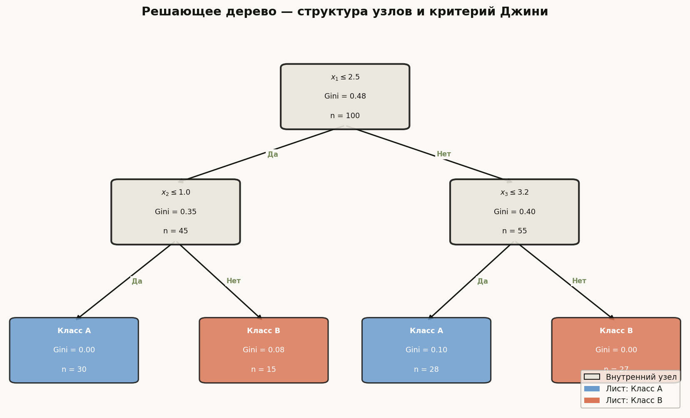
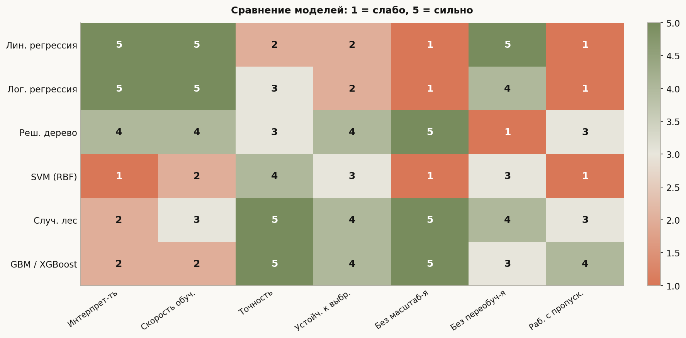
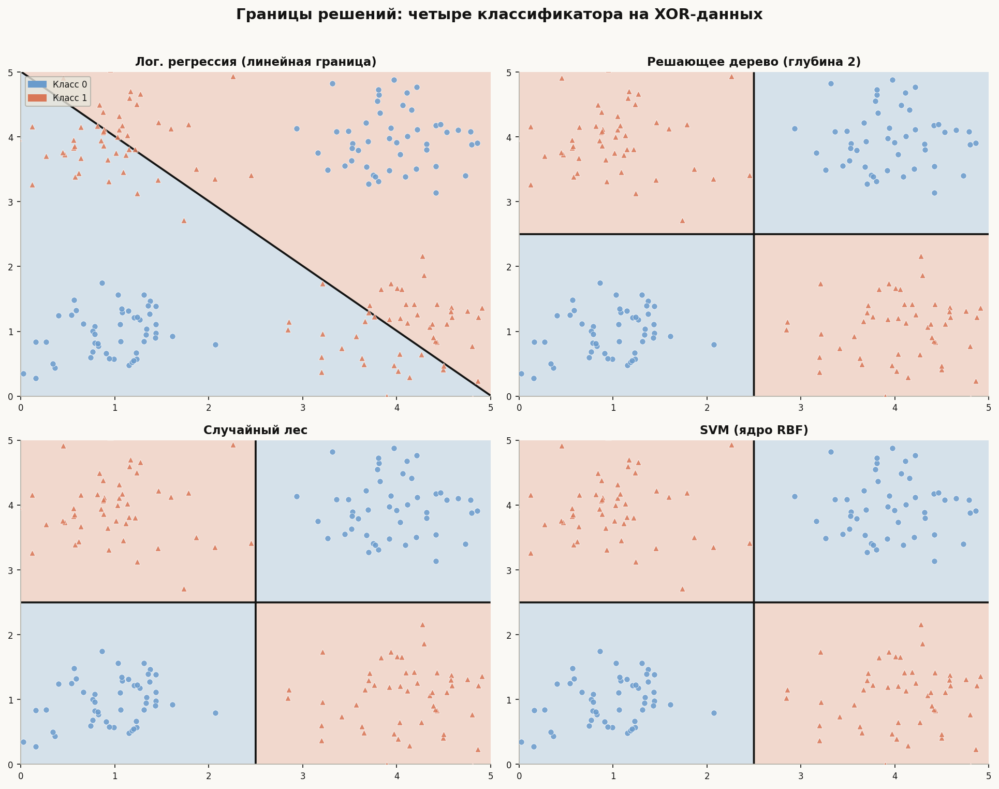

# Лекция 6: Основные модели классификации и регрессии


Машинное обучение устроено вокруг нескольких десятков семей алгоритмов, но в практике 90% задач закрываются пятью-шестью из них. Эта лекция строит понимание с нуля: от линейных моделей, которые можно решить в одно уравнение, до ансамблей, способных аппроксимировать любую функцию. Мы не просто перечислим методы — мы разберём, почему каждый из них устроен именно так, за счёт какой математики достигается решение, и в каких условиях он превзойдёт конкурентов. Главная линия лекции: *от простой гипотезы к сложной, от единственной модели к ансамблю*, — и понимание того, где на этом пути находится оптимум для вашей задачи.

## Главная формула лекции

**Логистическая регрессия** — базовый классификатор:

$$P(y = 1 \mid x) = \sigma(w \cdot x + b), \quad \sigma(z) = \frac{1}{1 + e^{-z}}$$

**Критерий Джини** — мера загрязнения узла дерева:

$$\text{Gini}(t) = 1 - \sum_{k=1}^{K} p_k^2$$

Чистый узел ($p_k = 1$ для одного класса): $\text{Gini} = 0$. Максимально загрязнённый (равные доли): $\text{Gini} = 1 - 1/K$.

## План

1. Линейная регрессия: normal equation и градиентный спуск
2. Логистическая регрессия: sigmoid, log-loss, softmax
3. SVM: максимизация зазора, kernel trick
4. Решающее дерево: критерии расщепления, построение, pruning
5. Random Forest: bagging + feature subsampling, OOB error
6. Gradient Boosting: последовательное добавление деревьев, shrinkage
7. Сравнение: когда какую модель выбирать

---

## 1. Линейная регрессия

**Задача.** Предсказать непрерывное значение $y \in \mathbb{R}$ по вектору признаков $x \in \mathbb{R}^d$. Модель:

$$\hat{y} = w^\top x + b = \sum_{j=1}^{d} w_j x_j + b$$

**Функция потерь** — среднеквадратичная ошибка (MSE):

$$\mathcal{L}(w, b) = \frac{1}{n} \sum_{i=1}^{n} (y_i - \hat{y}_i)^2$$

### 1.1 Аналитическое решение (Normal Equation)

Задача выпуклая и дифференцируемая. Приравняем градиент к нулю. Обозначим расширенную матрицу признаков $X \in \mathbb{R}^{n \times (d+1)}$ (добавлен столбец единиц для $b$):

$$\frac{\partial \mathcal{L}}{\partial w} = -\frac{2}{n} X^\top (y - Xw) = 0 \implies X^\top X w = X^\top y$$

**Normal Equation:**

$$w^* = (X^\top X)^{-1} X^\top y$$

Вычислительная сложность: $O(nd^2 + d^3)$. При больших $d$ (тысячи признаков) матрица $X^\top X$ становится гигантской — используют градиентный спуск.

### 1.2 Градиентный спуск

Итеративная процедура:

$$w_{t+1} = w_t - \eta \nabla_w \mathcal{L}(w_t)$$

где $\eta$ — learning rate (шаг). Для MSE:

$$\nabla_w \mathcal{L} = -\frac{2}{n} X^\top (y - Xw)$$

**SGD (стохастический):** на каждом шаге используется один случайный пример или мини-батч — быстрее, но шумнее.

### 1.3 Пример на Python

```python
import numpy as np
from sklearn.linear_model import LinearRegression, SGDRegressor
from sklearn.datasets import make_regression

X, y = make_regression(n_samples=200, n_features=5, noise=10, random_state=42)

# Аналитическое решение через sklearn
model_lr = LinearRegression()
model_lr.fit(X, y)
print(f"Коэффициенты: {model_lr.coef_}")
print(f"MSE (train): {np.mean((model_lr.predict(X) - y)**2):.2f}")

# Normal Equation вручную
X_b = np.c_[np.ones(len(X)), X]          # добавляем столбец единиц
w_star = np.linalg.pinv(X_b.T @ X_b) @ X_b.T @ y
print(f"Normal equation w0 (bias): {w_star[0]:.3f}")

# Градиентный спуск через sklearn
model_sgd = SGDRegressor(max_iter=1000, learning_rate="invscaling", random_state=42)
model_sgd.fit(X, y)
print(f"SGD MSE: {np.mean((model_sgd.predict(X) - y)**2):.2f}")
```

**Регуляризация:** Ridge (L2) добавляет штраф $\lambda \|w\|^2$ — сглаживает веса. Lasso (L1) добавляет $\lambda \|w\|_1$ — обнуляет малые веса (отбор признаков).

---

## 2. Логистическая регрессия

Для классификации нужен не непрерывный выход, а вероятность класса. Применяем **sigmoid** к линейной комбинации:

$$\sigma(z) = \frac{1}{1 + e^{-z}}, \quad \sigma: \mathbb{R} \to (0, 1)$$

Интерпретация: $P(y = 1 \mid x) = \sigma(w^\top x + b)$.

### 2.1 Log-loss (бинарная кросс-энтропия)

MSE плохо работает для классификации (насыщение градиентов). Используем:

$$\mathcal{L}(w) = -\frac{1}{n} \sum_{i=1}^{n} \left[ y_i \log \hat{p}_i + (1 - y_i) \log(1 - \hat{p}_i) \right]$$

где $\hat{p}_i = \sigma(w^\top x_i + b)$. Функция выпуклая, глобальный минимум гарантирован при линейно разделимых данных.

### 2.2 Softmax для многоклассовой классификации

При $K$ классах выход — вектор вероятностей:

$$P(y = k \mid x) = \frac{e^{w_k^\top x + b_k}}{\sum_{j=1}^{K} e^{w_j^\top x + b_j}}$$

Потеря — категориальная кросс-энтропия:

$$\mathcal{L} = -\frac{1}{n} \sum_{i=1}^{n} \sum_{k=1}^{K} \mathbf{1}[y_i = k] \log P(y = k \mid x_i)$$

### 2.3 Пример на Python

```python
from sklearn.linear_model import LogisticRegression
from sklearn.datasets import make_classification
from sklearn.model_selection import train_test_split
from sklearn.metrics import log_loss, accuracy_score
import numpy as np

X, y = make_classification(n_samples=500, n_features=10, random_state=42)
X_train, X_test, y_train, y_test = train_test_split(X, y, test_size=0.2, random_state=42)

# Бинарная классификация
model = LogisticRegression(C=1.0, max_iter=1000)
model.fit(X_train, y_train)
probs = model.predict_proba(X_test)
print(f"Accuracy: {accuracy_score(y_test, model.predict(X_test)):.3f}")
print(f"Log-loss: {log_loss(y_test, probs):.4f}")

# Ручной расчёт sigmoid
z = X_test[:3] @ model.coef_.T + model.intercept_
sigma = 1 / (1 + np.exp(-z))
print(f"P(y=1|x) первых 3 объектов: {sigma.ravel()[:3]}")

# Многоклассовая — iris (3 класса)
from sklearn.datasets import load_iris
iris = load_iris()
clf_multi = LogisticRegression(multi_class="multinomial", max_iter=300)
clf_multi.fit(iris.data, iris.target)
print(f"Softmax accuracy: {clf_multi.score(iris.data, iris.target):.3f}")
```

---

## 3. SVM: метод опорных векторов

**Идея:** найти гиперплоскость $w^\top x + b = 0$, которая разделяет классы с **максимальным зазором** (margin).

### 3.1 Максимизация зазора

Пусть $y_i \in \{-1, +1\}$. Условие правильной классификации с зазором:

$$y_i (w^\top x_i + b) \geq 1, \quad \forall i$$

Геометрический зазор равен $\frac{2}{\|w\|}$. Задача оптимизации:

$$\min_{w, b} \frac{1}{2} \|w\|^2 \quad \text{при} \quad y_i(w^\top x_i + b) \geq 1$$

Это выпуклая квадратичная задача с линейными ограничениями — решается через двойственную задачу Лагранжа.

### 3.2 Опорные векторы (Support Vectors)

**Опорные векторы** — это примеры, лежащие ровно на граничных гиперплоскостях ($y_i(w^\top x_i + b) = 1$). Только они влияют на положение разделяющей плоскости. Это делает SVM устойчивым к «далёким» точкам.

**Soft margin (C-SVM):** при нелинейно разделимых данных допускаем ошибки с штрафом $C$:

$$\min_{w, b, \xi} \frac{1}{2} \|w\|^2 + C \sum_i \xi_i$$

Большой $C$ — мало ошибок, но риск переобучения. Малый $C$ — широкий зазор, больше ошибок.

### 3.3 Kernel trick

Если данные нелинейно разделимы, переходим в пространство большей размерности через функцию $\phi(x)$, но вычисляем только скалярное произведение $K(x_i, x_j) = \phi(x_i)^\top \phi(x_j)$:

| Ядро | Формула | Применение |
|---|---|---|
| Линейное | $x_i^\top x_j$ | Линейно разделимые данные |
| Полиномиальное | $(x_i^\top x_j + c)^d$ | Текст, биология |
| RBF (Гауссово) | $\exp(-\gamma \|x_i - x_j\|^2)$ | Универсальное ядро |
| Сигмоидальное | $\tanh(\kappa x_i^\top x_j + \theta)$ | Нейросетевые аналоги |

**RBF** наиболее популярно: оно неявно переводит данные в бесконечномерное пространство.

### 3.4 Пример на Python

```python
from sklearn.svm import SVC
from sklearn.preprocessing import StandardScaler
from sklearn.pipeline import Pipeline
from sklearn.datasets import make_circles
from sklearn.model_selection import train_test_split

# Данные не линейно разделимы (два кольца)
X, y = make_circles(n_samples=300, noise=0.1, factor=0.4, random_state=42)
X_train, X_test, y_train, y_test = train_test_split(X, y, test_size=0.25, random_state=42)

# SVM требует масштабирования!
pipe = Pipeline([
    ("scaler", StandardScaler()),
    ("svm", SVC(kernel="rbf", C=1.0, gamma="scale", probability=True)),
])
pipe.fit(X_train, y_train)
print(f"RBF SVM accuracy: {pipe.score(X_test, y_test):.3f}")
print(f"Число support vectors: {pipe.named_steps['svm'].support_vectors_.shape[0]}")

# Сравнение ядер
for kernel in ["linear", "poly", "rbf"]:
    clf = Pipeline([("sc", StandardScaler()),
                    ("svm", SVC(kernel=kernel))])
    clf.fit(X_train, y_train)
    print(f"  {kernel}: {clf.score(X_test, y_test):.3f}")
```

---

## 4. Решающее дерево



Решающее дерево рекурсивно разбивает пространство признаков на прямоугольные области, в каждой из которых делает предсказание. Каждый внутренний узел проверяет одно условие вида $x_j \leq \theta$.

### 4.1 Критерии расщепления

**Gini (для классификации):**

$$\text{Gini}(t) = 1 - \sum_{k=1}^{K} p_k^2$$

**Entropy (Information Gain):**

$$H(t) = -\sum_{k=1}^{K} p_k \log_2 p_k$$

**MSE (для регрессии):**

$$\text{MSE}(t) = \frac{1}{n_t} \sum_{i \in t} (y_i - \bar{y}_t)^2$$

На каждом шаге выбираем разбиение $(j, \theta)$, минимизирующее взвешенный критерий дочерних узлов:

$$\Delta = \text{Imp}(\text{родитель}) - \frac{n_\text{лев}}{n} \text{Imp}(\text{лев}) - \frac{n_\text{прав}}{n} \text{Imp}(\text{прав})$$

Выбираем разбиение с максимальным $\Delta$ (информационным приростом).

**Разница Gini vs Entropy:** Gini чуть быстрее вычисляется (нет логарифма), Entropy чувствительнее к редким классам. На практике разница невелика.

### 4.2 Алгоритм построения (CART)

1. Начинаем с корневого узла, содержащего все объекты.
2. Для каждого признака $j$ и каждого порога $\theta$ (все уникальные значения) вычисляем $\Delta$.
3. Выбираем лучшее $(j^*, \theta^*)$, разбиваем узел.
4. Рекурсивно повторяем для дочерних узлов.
5. Останавливаемся при выполнении критерия остановки: `max_depth`, `min_samples_split`, `min_impurity_decrease`.

### 4.3 Pruning (обрезка)

Глубокое дерево переобучается. Два подхода:

- **Pre-pruning:** ограничиваем глубину или минимальное число объектов в узле во время построения.
- **Post-pruning (cost-complexity pruning):** строим полное дерево, затем итеративно удаляем листья, если это незначительно ухудшает качество на валидации. Параметр `ccp_alpha` в sklearn.

### 4.4 Пример на Python

```python
from sklearn.tree import DecisionTreeClassifier, export_text, plot_tree
from sklearn.datasets import load_iris
from sklearn.model_selection import cross_val_score
import matplotlib.pyplot as plt

iris = load_iris()
X, y = iris.data, iris.target

# Построение дерева
tree = DecisionTreeClassifier(max_depth=3, criterion="gini", random_state=42)
tree.fit(X, y)

# Текстовое представление
print(export_text(tree, feature_names=list(iris.feature_names)))

# CV-accuracy
scores = cross_val_score(tree, X, y, cv=5, scoring="accuracy")
print(f"CV accuracy: {scores.mean():.3f} ± {scores.std():.3f}")

# Cost-complexity pruning: выбор оптимального alpha
path = tree.cost_complexity_pruning_path(X, y)
alphas = path.ccp_alphas
print(f"Доступные ccp_alpha: {alphas[:5]}")
```

---

## 5. Random Forest: случайный лес

Одно дерево нестабильно — небольшое изменение данных меняет структуру дерева. Случайный лес исправляет это **усреднением** множества независимых деревьев.

### 5.1 Bagging (Bootstrap Aggregating)

Для каждого из $T$ деревьев:
1. Берём **bootstrap-выборку**: $n$ объектов из обучающей выборки **с возвращением** (примерно 63% уникальных объектов).
2. Обучаем дерево на этой выборке.
3. Итоговый прогноз: голосование (классификация) или среднее (регрессия).

**Feature subsampling:** при выборе каждого расщепления рассматриваем только случайное подмножество из $m$ признаков (по умолчанию $m = \sqrt{d}$ для классификации, $m = d/3$ для регрессии). Это де-коррелирует деревья.

### 5.2 Out-of-Bag (OOB) Error

Примерно 37% объектов не попадают в bootstrap-выборку для данного дерева. Их можно использовать для оценки качества без отдельного валидационного множества:

$$\text{OOB score} = \frac{1}{n} \sum_{i=1}^{n} \mathbf{1}[\hat{y}_i^{\text{OOB}} = y_i]$$

где $\hat{y}_i^{\text{OOB}}$ — предсказание по усреднению только тех деревьев, в обучении которых объект $i$ не участвовал.

### 5.3 Важность признаков

**Mean Decrease Impurity (MDI):** суммарный прирост информации по всем узлам, где используется признак $j$, усреднённый по всем деревьям.

**Permutation Importance:** качество резко падает, если перемешать значения признака $j$ в тестовой выборке — значит, признак важен.

### 5.4 Пример на Python

```python
from sklearn.ensemble import RandomForestClassifier
from sklearn.datasets import load_breast_cancer
from sklearn.model_selection import train_test_split
import pandas as pd

data = load_breast_cancer()
X, y = data.data, data.target
X_train, X_test, y_train, y_test = train_test_split(X, y, test_size=0.2, random_state=42)

rf = RandomForestClassifier(
    n_estimators=200,
    max_features="sqrt",   # feature subsampling
    oob_score=True,        # включить OOB оценку
    n_jobs=-1,
    random_state=42,
)
rf.fit(X_train, y_train)

print(f"Test accuracy: {rf.score(X_test, y_test):.3f}")
print(f"OOB score:     {rf.oob_score_:.3f}")  # без test set!

# Топ-5 важных признаков
importances = pd.Series(rf.feature_importances_, index=data.feature_names)
print(importances.sort_values(ascending=False).head())
```

---

## 6. Gradient Boosting

Там, где Random Forest обучает деревья **параллельно** (независимо), Gradient Boosting обучает их **последовательно**: каждое новое дерево исправляет ошибки предыдущего.

### 6.1 Алгоритм

Инициализируем: $F_0(x) = \bar{y}$ (среднее по всем объектам).

На каждом шаге $t = 1, \ldots, T$:

1. Вычисляем **псевдо-остатки** (градиент потери):

   $$r_i^{(t)} = -\frac{\partial \mathcal{L}(y_i, F(x_i))}{\partial F(x_i)}$$

   Для MSE: $r_i = y_i - F_{t-1}(x_i)$ (просто остатки регрессии).

2. Обучаем дерево $h_t$ на парах $(x_i, r_i^{(t)})$.

3. Обновляем ансамбль:

   $$F_t(x) = F_{t-1}(x) + \eta \cdot h_t(x)$$

где $\eta$ — **shrinkage** (learning rate, обычно 0.05–0.1). Малый $\eta$ требует больше деревьев, но даёт лучшее обобщение.

### 6.2 XGBoost, LightGBM, CatBoost

Современные реализации добавляют:
- **Регуляризацию** весов листьев (Ridge в дереве).
- **Гистограммное приближение**: вместо сортировки всех значений — бинирование в 256 бакетов (LightGBM).
- **Работу с категориальными** признаками нативно (CatBoost).
- **Раннюю остановку** по валидационной выборке.

### 6.3 Пример на Python

```python
from sklearn.ensemble import GradientBoostingClassifier
from sklearn.datasets import make_classification
from sklearn.model_selection import train_test_split
import numpy as np

X, y = make_classification(n_samples=1000, n_features=20, random_state=42)
X_train, X_test, y_train, y_test = train_test_split(X, y, test_size=0.2, random_state=42)

gbm = GradientBoostingClassifier(
    n_estimators=200,
    learning_rate=0.05,   # shrinkage
    max_depth=3,
    subsample=0.8,        # stochastic gradient boosting
    random_state=42,
)
gbm.fit(X_train, y_train)

# Кривая обучения по числу деревьев
train_scores = [gbm.score(X_train, y_train[:len(X_train)])
                for _ in range(1)]   # итоговый score
print(f"Train accuracy: {gbm.score(X_train, y_train):.3f}")
print(f"Test  accuracy: {gbm.score(X_test,  y_test):.3f}")

# XGBoost (если установлен)
# from xgboost import XGBClassifier
# xgb = XGBClassifier(n_estimators=200, learning_rate=0.05, max_depth=3,
#                     eval_metric="logloss", early_stopping_rounds=20)
# xgb.fit(X_train, y_train, eval_set=[(X_test, y_test)], verbose=False)
```

---

## 7. Сравнение моделей: когда что применять





На иллюстрации выше видно ключевое различие: **линейная регрессия / лог. регрессия** проводит прямую границу и не справляется с нелинейным XOR-паттерном. **Решающее дерево** строит ступенчатую ось-выровненную границу. **Случайный лес и SVM** создают плавные нелинейные области.

### Краткое руководство по выбору

| Ситуация | Рекомендуемая модель |
|---|---|
| Нужна интерпретируемость, данных мало | Лин./Лог. регрессия |
| Много категориальных признаков, пропуски | GBM (CatBoost) |
| Данные табличные, хочется лучшего качества | Random Forest → XGBoost |
| Текст, изображения (с базовыми признаками) | SVM с RBF или нейросети |
| Задача регрессии, линейные зависимости | Ridge/Lasso |
| Мало данных, много шума | SVM с мягким margin |
| Нужна скорость предсказания в продакшене | Лог. регрессия / Random Forest |

---

## Типичные ошибки

### Ошибка 1: Не масштабировать данные для SVM и лог. регрессии

```python
# ПЛОХО: SVM и лог. регрессия чувствительны к масштабу признаков
from sklearn.svm import SVC
model = SVC()
model.fit(X_train, y_train)   # признаки могут иметь разные диапазоны

# ХОРОШО: всегда оборачивать в Pipeline
from sklearn.pipeline import Pipeline
from sklearn.preprocessing import StandardScaler

pipe = Pipeline([("scaler", StandardScaler()), ("svm", SVC())])
pipe.fit(X_train, y_train)
# Scaler fitted только на X_train — нет data leakage!
```

### Ошибка 2: Не ограничивать глубину дерева — переобучение

```python
# ПЛОХО: глубокое дерево запоминает шум
tree = DecisionTreeClassifier()   # max_depth=None по умолчанию!
tree.fit(X_train, y_train)
print(tree.score(X_train, y_train))   # 1.000 — идеально на train
print(tree.score(X_test,  y_test))    # 0.72  — плохо на test

# ХОРОШО: ограничить через CV
from sklearn.model_selection import GridSearchCV
params = {"max_depth": [3, 5, 7, 10, None]}
gs = GridSearchCV(DecisionTreeClassifier(), params, cv=5, scoring="accuracy")
gs.fit(X_train, y_train)
print(f"Лучшая глубина: {gs.best_params_['max_depth']}")
```

### Ошибка 3: Утечка данных (data leakage) через Scaler вне Pipeline

```python
# ПЛОХО: scaler fitted на всей выборке, включая тест
from sklearn.preprocessing import StandardScaler
scaler = StandardScaler()
X_scaled = scaler.fit_transform(X)    # ← знает статистики тест-сета!
X_train_sc, X_test_sc = X_scaled[:800], X_scaled[800:]

# ХОРОШО: fit только на train, transform применять к обоим
X_train, X_test = X[:800], X[800:]
scaler = StandardScaler()
X_train_sc = scaler.fit_transform(X_train)
X_test_sc  = scaler.transform(X_test)   # не fit_transform!
```

### Ошибка 4: Игнорировать выбросы при линейной регрессии

```python
import numpy as np

# ПЛОХО: MSE квадратично штрафует выбросы, один выброс сдвигает модель
from sklearn.linear_model import LinearRegression
lr = LinearRegression().fit(X_train, y_train_with_outliers)

# ХОРОШО 1: Huber Loss (квадрат вблизи 0, линейный далеко)
from sklearn.linear_model import HuberRegressor
huber = HuberRegressor(epsilon=1.35).fit(X_train, y_train_with_outliers)

# ХОРОШО 2: удалить выбросы через IQR перед обучением
q1, q3 = np.percentile(y_train, [25, 75])
iqr = q3 - q1
mask = (y_train >= q1 - 1.5 * iqr) & (y_train <= q3 + 1.5 * iqr)
lr_clean = LinearRegression().fit(X_train[mask], y_train[mask])
```

### Ошибка 5: Не использовать OOB score и переобучать на validation set

```python
# ПЛОХО: подбирать гиперпараметры по одному validation set
# — постепенно подгоняемся под этот конкретный сплит

# ХОРОШО: использовать cross-validation или OOB для Random Forest
from sklearn.ensemble import RandomForestClassifier
rf = RandomForestClassifier(n_estimators=300, oob_score=True)
rf.fit(X_train, y_train)
# OOB — честная оценка без отдельного validation set
print(f"OOB accuracy: {rf.oob_score_:.3f}")
```

---

## Что важно для ШАД

- **Линейная регрессия:** уметь вывести normal equation из условия $\nabla \mathcal{L} = 0$; знать, когда $(X^\top X)$ вырождена.
- **Логистическая регрессия:** понимать, почему sigmoid, а не просто порог; связь с максимизацией правдоподобия.
- **Gini и Entropy:** уметь вычислить вручную и объяснить, что измеряет каждый критерий.
- **SVM:** объяснить идею максимального зазора, что такое опорные векторы; почему kernel trick не взрывает вычисления.
- **Bagging vs Boosting:** ключевое различие — параллельность и последовательность; откуда берётся снижение variance (bagging) и bias (boosting).
- **OOB error:** уметь объяснить, почему ~37% объектов не попадают в bootstrap-выборку ($\lim_{n\to\infty}(1 - 1/n)^n = e^{-1} \approx 0.368$).
- **Shrinkage в GBM:** понимать компромисс `learning_rate` vs `n_estimators`; при меньшем шаге нужно больше деревьев.
- **Когда что применять:** уметь обосновать выбор модели под конкретные условия — размер данных, тип признаков, требования к интерпретируемости.

---

## Итог

Линейные модели — быстрый и интерпретируемый базис, но жёстко ограничены линейными границами решений. Решающее дерево преодолевает это, разбивая пространство на прямоугольники, однако нестабильно и легко переобучается. Два главных семейства ансамблей решают проблему по-разному: **Random Forest** обучает деревья независимо на bootstrap-выборках и усредняет результат, снижая дисперсию без роста смещения; **Gradient Boosting** обучает деревья последовательно, каждое на остатках предыдущего, снижая смещение и давая наивысшую точность при правильной настройке. SVM занимает особую нишу — хорошо работает при ограниченном числе примеров и высокоразмерных данных, но требует масштабирования и трудно интерпретируем. Умение выбирать между этими семействами в зависимости от размера данных, типа признаков и требований к интерпретируемости — ключевой практический навык.

---

## Вопросы для повторения

1. Запишите normal equation. При каком условии она не даёт единственного решения и что делать в этом случае?
2. Почему для логистической регрессии используют log-loss, а не MSE? Приведите математическое объяснение.
3. Что такое опорные векторы? Почему удаление точек, не являющихся опорными, не меняет модель SVM?
4. Объясните kernel trick: почему вычисление $K(x_i, x_j) = \phi(x_i)^\top \phi(x_j)$ дешевле, чем явный переход в $\phi$-пространство для RBF?
5. Вычислите критерий Джини для узла с 60 объектами класса A и 40 класса B. Чему равен Gini, если все объекты одного класса?
6. Чем Pre-pruning отличается от Post-pruning? Когда предпочтителен каждый подход?
7. Объясните, почему ~37% объектов оказываются «out-of-bag» в каждом дереве Random Forest. (Подсказка: используйте предел.)
8. Что такое feature subsampling в Random Forest и зачем он нужен, если bagging уже де-коррелирует деревья?
9. В чём принципиальное отличие Gradient Boosting от Random Forest? Почему GBM даёт меньшее смещение, а RF — меньшую дисперсию?
10. Параметр `learning_rate=0.01` в GBM при `n_estimators=100` даёт плохой результат. Как изменить конфигурацию без потери качества?
