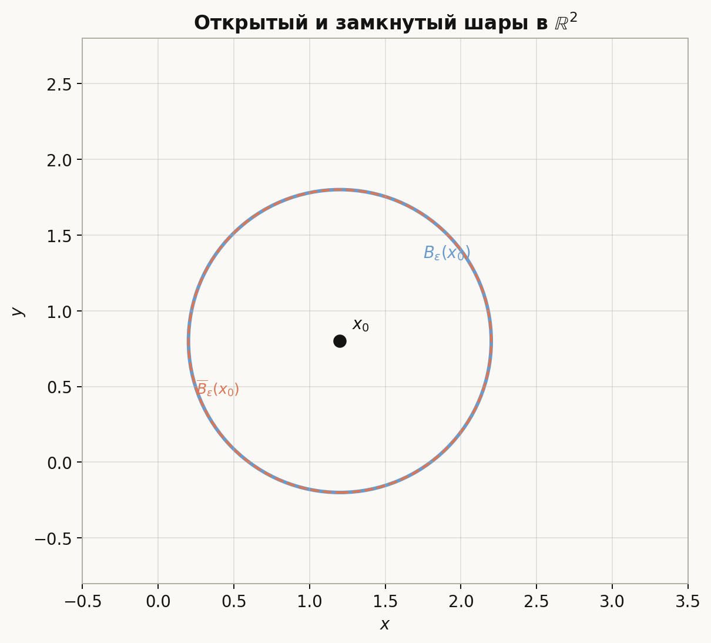
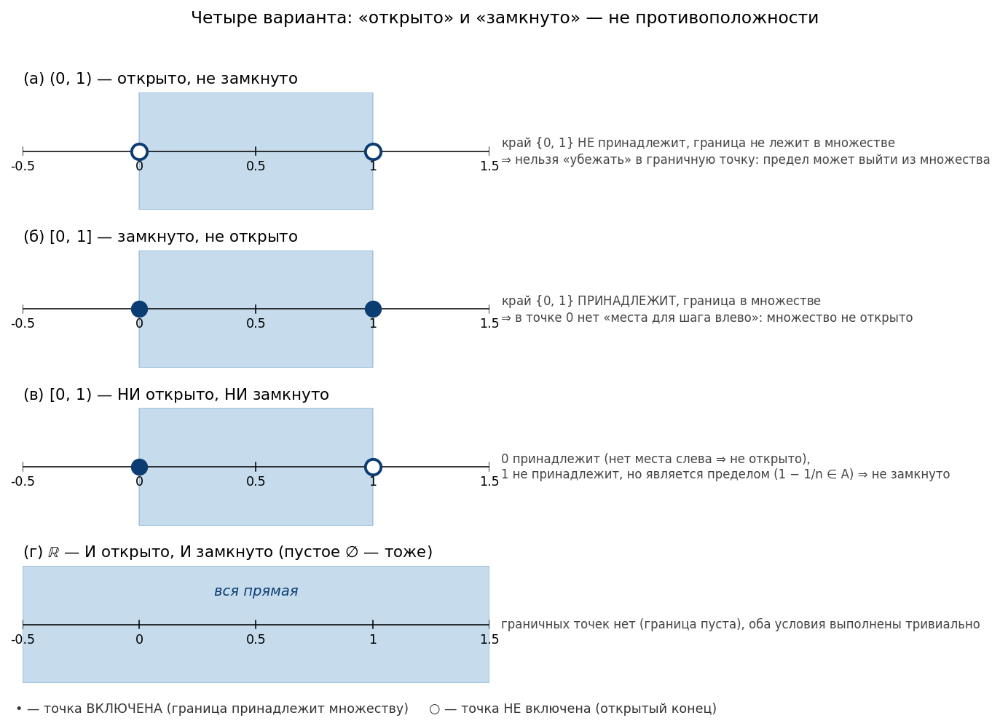
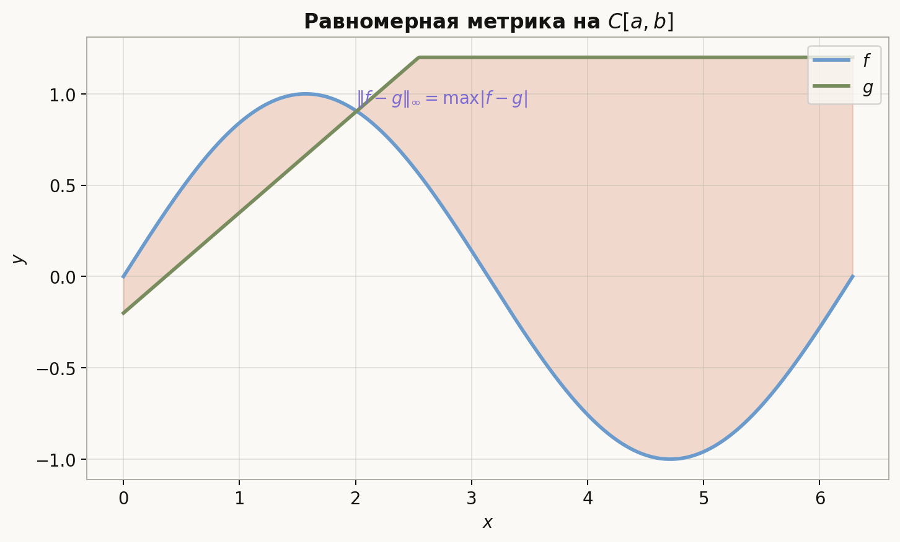
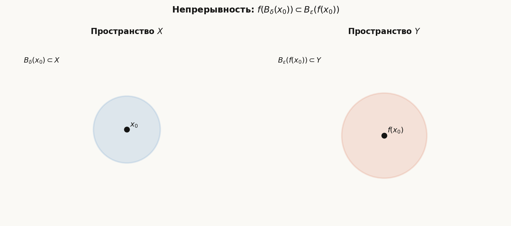
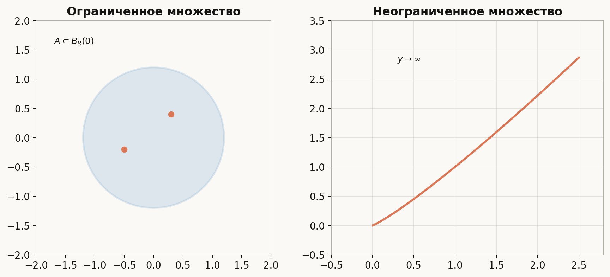

# Лекция: метрические и нормированные пространства, непрерывность, ограниченность

## План

1. Зачем нужны метрические пространства
2. Метрические пространства и аксиомы метрики
3. Шары, окрестности, открытые и замкнутые множества
4. Сходимость последовательностей
5. Нормированные пространства
6. Эквивалентные нормы
7. Непрерывность отображений
8. Ограниченные множества и отображения
9. Примеры в пространстве непрерывных функций
10. Типичные ошибки
11. Что важно для поступления в ШАД
12. Итог
13. Вопросы для самопроверки

---

## 1. Зачем нужны метрические пространства

В курсе анализа мы привыкли работать с $\mathbb{R}$ и $\mathbb{R}^n$, где «близость» задаётся модулем или нормой. Но во многих задачах важны не координаты, а **расстояние между объектами**:

- между двумя функциями на отрезке;
- между двумя последовательностями;
- между двумя векторами в бесконечномерном пространстве.

**Метрическое пространство** — это множество $X$ вместе с функцией расстояния $d(x,y)$, удовлетворяющей естественным аксиомам. Это позволяет говорить о сходимости, непрерывности и ограниченности в едином языке, не привязываясь к конкретной координатной системе.

Для поступления в ШАД достаточно уверенно владеть:

- метрикой и нормой на $\mathbb{R}^n$;
- пространством $C[a,b]$ с sup-нормой;
- определением непрерывности отображения между метрическими пространствами.

---

## 2. Метрические пространства

### Определение

**Метрическое пространство** — это пара $(X,d)$, где $X$ — множество, а $d:X\times X\to[0,+\infty)$ — **метрика**, то есть для всех $x,y,z\in X$ выполнено:

1. **Тождество неразличимых:** $d(x,y)=0 \Leftrightarrow x=y$.
2. **Симметрия:** $d(x,y)=d(y,x)$.
3. **Неравенство треугольника:** $d(x,z)\le d(x,y)+d(y,z)$.

Элементы $X$ часто называют **точками** пространства (даже если это функции или последовательности).

### Примеры

**Евклидово пространство.** На $\mathbb{R}^n$ метрика
$$
d(x,y)=\|x-y\|_2=\sqrt{\sum_{i=1}^n (x_i-y_i)^2}
$$
задаёт стандартное метрическое пространство.

**Метрика на $\mathbb{R}^n$ от произвольной нормы.** Если $\|\cdot\|$ — норма на $\mathbb{R}^n$, то
$$
d(x,y)=\|x-y\|
$$
— метрика.

**Пространство непрерывных функций.** Пусть $C[a,b]$ — множество непрерывных функций на $[a,b]$. **Равномерная (sup) метрика:**
$$
\rho(f,g)=\max_{x\in[a,b]}|f(x)-g(x)|.
$$
Именно она естественна, когда мы хотим, чтобы две функции были «близки везде на отрезке», а не только в одной точке.

**Дискретная метрика** (для иллюстрации аксиом):
$$
d(x,y)=
\begin{cases}
0, & x=y,\\
1, & x\ne y.
\end{cases}
$$

### Замечание

Одно и то же множество $X$ может быть снабжено разными метриками. Сходимость последовательностей зависит от выбора $d$.

### Пример: проверка аксиом для «манхэттенской» метрики

На $\mathbb{R}^2$ положим $d((x_1,y_1),(x_2,y_2))=|x_1-x_2|+|y_1-y_2|$. Это метрика, порождённая нормой $\|\cdot\|_1$. Неравенство треугольника следует из $|a+c|\le |a|+|c|$ по координатам:
$$
d((x_1,y_1),(x_3,y_3))\le d((x_1,y_1),(x_2,y_2))+d((x_2,y_2),(x_3,y_3)).
$$

---

## 3. Шары, окрестности, открытые и замкнутые множества

Пусть $(X,d)$ — метрическое пространство, $x_0\in X$, $\varepsilon>0$.

**Открытый шар** (окрестность) радиуса $\varepsilon$ с центром в $x_0$:
$$
B_\varepsilon(x_0)=\{x\in X:\ d(x,x_0)<\varepsilon\}.
$$

**Замкнутый шар:**
$$
\overline{B}_\varepsilon(x_0)=\{x\in X:\ d(x,x_0)\le \varepsilon\}.
$$

Множество $A\subset X$ называется **открытым**, если для каждой точки $a\in A$ существует $\varepsilon>0$ такое, что $B_\varepsilon(a)\subset A$.

Множество $F\subset X$ называется **замкнутым**, если его дополнение $X\setminus F$ открыто.

На $\mathbb{R}$ открытый интервал $(a,b)$ — открытое множество; отрезок $[a,b]$ — замкнутое.

### Интуиция: что значит «открыто» и «замкнуто»

Эти определения формальные, но за ними стоит простая картинка. Удобно держать в голове **два независимых** взгляда.

**Взгляд 1. Открытое — "вокруг каждой точки есть место для манёвра".**

Точка $a$ называется **внутренней** для $A$, если вокруг неё помещается целый маленький шар $B_\varepsilon(a)\subset A$ — то есть из $a$ можно шагнуть в любую сторону на $\varepsilon$ и остаться в $A$. Множество $A$ **открыто**, если **все** его точки — внутренние.

Образ: открытое множество — это «комната без порога». Где бы вы ни стояли внутри, у вас есть запас в любую сторону. На «край» (границу) изнутри нельзя попасть, не выходя.

На $\mathbb{R}$: у интервала $(0,1)$ вокруг любой точки $x\in(0,1)$ найдётся маленький отрезок целиком внутри — это и есть «место для манёвра». А у $[0,1]$ в точке $0$ такого запаса **нет**: любой шарик $(-\varepsilon,\varepsilon)$ содержит отрицательные числа, которые в $[0,1]$ не лежат. Поэтому $[0,1]$ не открыто.

**Взгляд 2. Замкнутое — "из множества нельзя сбежать пределом".**

Множество $F$ **замкнуто** тогда и только тогда, когда любая сходящаяся последовательность из $F$ имеет предел тоже в $F$:
$$
x_n\in F,\ x_n\to x \ \Rightarrow\ x\in F.
$$
(Это и есть та эквивалентная характеризация, см. ниже.)

Образ: замкнутое множество — это «ловушка для пределов». Куда бы вы ни шли изнутри, в пределе вы всё равно остаётесь внутри.

На $\mathbb{R}$: у $[0,1]$ предел любой сходящейся последовательности её точек обязан лежать в $[0,1]$ (как предел чисел, зажатых между $0$ и $1$). А у $(0,1)$ последовательность $1/n$ лежит внутри, но её предел $0$ — уже **снаружи**. Значит, $(0,1)$ не замкнуто.

**Объединяющий взгляд: всё дело в границе.**

У множества есть его **граница** $\partial A$ — точки, в любой окрестности которых одновременно есть точки $A$ и точки дополнения. Тогда:

- $A$ **открыто** ⟺ $A$ **не содержит ни одной** своей граничной точки;
- $A$ **замкнуто** ⟺ $A$ **содержит все** свои граничные точки.

Граница — это «пограничная полоса». Решение, кому она достанется, и определяет открытость/замкнутость.

### «Открыто» и «замкнуто» — НЕ противоположности

Это самое неинтуитивное место темы. У множества **четыре** возможных статуса, а не два:

- **(а) только открыто:** $(0,1)$. Граница $\{0,1\}$ не принадлежит — внутренних точек хватает на всё множество.
- **(б) только замкнуто:** $[0,1]$. Граница $\{0,1\}$ принадлежит — но в этих точках нет «места для шага».
- **(в) ни открыто, ни замкнуто:** $[0,1)$. Точка $0$ принадлежит, но «места слева» у неё нет (значит не открыто); точка $1$ — предел последовательности $1-1/n$ из множества, но сама не лежит в нём (значит не замкнуто).
- **(г) и открыто, и замкнуто:** само $\mathbb{R}$ и пустое $\varnothing$. У них **нет** граничных точек, поэтому формально и «все граничные точки принадлежат», и «ни одной не принадлежит».

Полезное правило: «не открыто» ≠ «замкнуто». Чтобы доказать замкнутость, нужно показать, что множество **содержит все свои пределы**, а не просто что оно «не открыто».

### Внутренность, замыкание, граница

- **Внутренность** $\operatorname{int}A$ — это множество всех **внутренних** точек $A$, то есть точек $a\in A$, для которых $B_\varepsilon(a)\subset A$ при некотором $\varepsilon>0$. Это наибольшее открытое множество, содержащееся в $A$.
- **Замыкание** $\overline{A}$ — это множество всех **предельных** точек, то есть точек $x\in X$, в любой окрестности которых есть точки из $A$. Это наименьшее замкнутое множество, содержащее $A$.
- **Граница** $\partial A=\overline{A}\setminus\operatorname{int}A$.

### Характеризация замкнутости через сходимость

В метрическом пространстве выполнено очень удобное эквивалентное описание:

> Множество $F\subset X$ замкнуто тогда и только тогда, когда для любой последовательности $x_n\in F$, имеющей предел $x\in X$, выполнено $x\in F$.

Иными словами: замкнутое множество «содержит свои пределы». Эту характеризацию часто используют на практике вместо проверки открытости дополнения.

### Пример

Множество $A=\{(x,y)\in\mathbb{R}^2:\ x^2+y^2<1\}$ — открытый диск. Его замыкание — замкнутый диск $x^2+y^2\le 1$, граница — окружность $x^2+y^2=1$.

---

## 4. Сходимость последовательностей

Последовательность $(x_n)$ в $(X,d)$ **сходится** к $x\in X$, если
$$
\lim_{n\to\infty} d(x_n,x)=0.
$$
Пишут $x_n\to x$ или $x_n\xrightarrow{d}x$.

### Фундаментальные последовательности

Последовательность $(x_n)$ называется **фундаментальной** (или **последовательностью Коши**), если
$$
\forall\varepsilon>0\ \exists N:\ \forall m,n\ge N\quad d(x_m,x_n)<\varepsilon.
$$

В **любом** метрическом пространстве всякая сходящаяся последовательность фундаментальна (доказательство — стандартное неравенство треугольника).

**Обратное верно не всегда.** Например, в $\mathbb{Q}$ с обычным расстоянием последовательность
$$
1,\ 1.4,\ 1.41,\ 1.414,\ \ldots
$$
фундаментальна, но не сходится в $\mathbb{Q}$ (её предел $\sqrt{2}$ — иррациональное число).

### Полные пространства

Метрическое пространство $(X,d)$ называется **полным**, если в нём всякая фундаментальная последовательность сходится. Только в полных пространствах справедлив **критерий Коши**:

> $(x_n)$ сходится $\Leftrightarrow$ $(x_n)$ фундаментальна.

Стандартные примеры полных пространств:

- $\mathbb{R}$ и $\mathbb{R}^n$ с любой нормой;
- $C[a,b]$ с sup-метрикой $\rho(f,g)=\max|f-g|$ (равномерный предел непрерывных функций непрерывен — это и есть полнота).

Полное нормированное пространство называется **банаховым**. Так, $\mathbb{R}^n$ и $C[a,b]$ — банаховы пространства.

На $\mathbb{R}^n$ с любой нормой сходимость по координатам эквивалентна сходимости в метрике, порождённой этой нормой (все нормы на $\mathbb{R}^n$ эквивалентны — см. §6).

**Пример 1 (поточечно, но не равномерно).** В $C[0,1]$ с $\rho(f,g)=\max|f-g|$ последовательность $f_n(x)=x^n$ **поточечно** стремится к функции
$$
f(x)=
\begin{cases}
0, & x\in[0,1),\\
1, & x=1,
\end{cases}
$$
но в метрике $\rho$ к $f$ **не** сходится: предел не лежит в $C[0,1]$, так как $f$ разрывна в $1$. Более того, $f_n$ **не** сходится и к нулевой функции в $\rho$, потому что
$$
\|f_n-0\|_\infty=\max_{[0,1]}x^n=1
$$
для всех $n$. Это типичная ловушка при переходе к функциональным рядам.

**Пример 2 (равномерная сходимость).** $g_n(x)=\frac{x}{n}$ сходится к нулевой функции в $C[0,1]$, поскольку
$$
\rho(g_n,0)=\max_{[0,1]}\frac{x}{n}=\frac{1}{n}\to 0.
$$

---

## 5. Нормированные пространства

### Определение

**Нормированное пространство** — это векторное пространство $V$ над полем $\mathbb{F}=\mathbb{R}$ (или $\mathbb{C}$) вместе с **нормой** $\|\cdot\|:V\to[0,+\infty)$, такой что для всех $x,y\in V$ и любого скаляра $\lambda\in\mathbb{F}$:

1. $\|x\|=0 \Leftrightarrow x=0$;
2. **Однородность:** $\|\lambda x\|=|\lambda|\cdot\|x\|$;
3. **Неравенство треугольника:** $\|x+y\|\le\|x\|+\|y\|$.

Каждая норма порождает метрику:
$$
d(x,y)=\|x-y\|.
$$
Значит, всякая нормированная плоскость — метрическое пространство.

### Стандартные нормы на $\mathbb{R}^n$

$$
\|x\|_1=\sum_{i=1}^n |x_i|,\qquad
\|x\|_2=\sqrt{\sum_{i=1}^n x_i^2},\qquad
\|x\|_\infty=\max_{1\le i\le n}|x_i|.
$$

### Пространство $C[a,b]$

$$
\|f\|_\infty=\max_{x\in[a,b]}|f(x)|,\qquad
\rho(f,g)=\|f-g\|_\infty.
$$

Семейство $\|x\|_p$ для произвольного $p\ge 1$ и его свойства будут обсуждаться в §6.

---

## 6. Эквивалентные нормы

Нормы $\|\cdot\|_a$ и $\|\cdot\|_b$ на конечномерном $V$ называются **эквивалентными**, если существуют константы $c,C>0$ такие, что для всех $x\in V$:
$$
c\|x\|_a\le \|x\|_b\le C\|x\|_a.
$$

**Теорема.** На $\mathbb{R}^n$ любые две нормы эквивалентны.

**Следствие.** На $\mathbb{R}^n$ сходимость последовательности не зависит от выбора нормы: $x_n\to x$ по $\|\cdot\|_2$ тогда и только тогда, когда $x_n\to x$ по $\|\cdot\|_\infty$.

### Идея доказательства эквивалентности норм на $\mathbb{R}^n$

На единичной сфере $\|x\|_2=1$ непрерывная функция $\|x\|_a$ достигает положительного минимума $c$ и максимума $C$. Для произвольного $x\ne 0$ положим $y=x/\|x\|_2$; тогда
$$
c\|x\|_2\le \|x\|_a\le C\|x\|_2.
$$
Отсюда и эквивалентность сходимости.

В бесконечномерных пространствах (например, $C[0,1]$) разные нормы могут задавать разную топологию — это уже более тонкая теория.

### Нормы $L^p$ на $\mathbb{R}^m$

Для вектора $x=(x_1,\ldots,x_m)$ и $p\ge 1$:
$$
\|x\|_p=\left(\sum_{i=1}^m |x_i|^p\right)^{1/p},\qquad
\|x\|_\infty=\max_i |x_i|.
$$
На экзамене достаточно уметь сравнить $\|x\|_1$, $\|x\|_2$, $\|x\|_\infty$ и знать, что на $\mathbb{R}^m$ они эквивалентны.

---

## 7. Непрерывность отображений

Пусть $(X,d_X)$ и $(Y,d_Y)$ — метрические пространства, $f:X\to Y$.

### Непрерывность в точке

Отображение $f$ **непрерывно в точке** $x_0\in X$, если
$$
\forall\varepsilon>0\ \exists\delta>0:\ \forall x\in X,\ d_X(x,x_0)<\delta
\Rightarrow d_Y(f(x),f(x_0))<\varepsilon.
$$

Это прямое обобщение $\varepsilon$–$\delta$ определения для функций $\mathbb{R}\to\mathbb{R}$.

### Непрерывность на множестве

$f$ **непрерывно на** $X$, если оно непрерывно в каждой точке $x_0\in X$.

**Эквивалентная формулировка через открытые множества:** $f$ непрерывно на $X$ тогда и только тогда, когда прообраз любого открытого $U\subset Y$ открыт в $X$:
$$
f^{-1}(U)=\{x\in X:\ f(x)\in U\}\ \text{открыт в } X.
$$
Это «топологическое» определение непрерывности — оно не упоминает $\varepsilon$ и $\delta$ и удобно тем, что из него мгновенно следует непрерывность композиции.

### Последовательностный критерий

$f$ непрерывно в $x_0$ тогда и только тогда, когда для любой последовательности $x_n\to x_0$ выполнено $f(x_n)\to f(x_0)$ (в метрике $Y$).

### Липшицевость

Если существует константа $L\ge 0$ такая, что
$$
d_Y(f(x),f(y))\le L\,d_X(x,y)\quad \forall x,y\in X,
$$
то $f$ называется **липшицевым**. Липшицевое отображение непрерывно (возьмите $\delta=\varepsilon/L$).

### Вычислительный пример

Пусть $f:\mathbb{R}^2\to\mathbb{R}$, $f(x,y)=3x-y^2$. Покажем непрерывность в $(2,1)$. При $|x-2|<\delta$, $|y-1|<\delta$:
$$
|f(x,y)-f(2,1)|\le 3|x-2|+|y^2-1|=3|x-2|+|y-1||y+1|.
$$
Если $\delta\le 1$, то $|y+1|\le 3$ и
$$
|f(x,y)-5|\le 3|x-2|+3|y-1|<6\delta.
$$
Для $\varepsilon>0$ достаточно $\delta=\min(1,\varepsilon/6)$.

### Непрерывность линейного отображения

Если $A:\mathbb{R}^n\to\mathbb{R}^m$ линейно, то оно непрерывно. В координатах это следует из непрерывности суммы и произведения. В метрической формулировке для любых выбранных норм на $\mathbb{R}^n$ и $\mathbb{R}^m$ найдётся константа $C\ge 0$ такая, что
$$
\|Ax-Ay\|_m=\|A(x-y)\|_m\le C\|x-y\|_n,
$$
то есть $A$ даже липшицево. Соответствующее наименьшее $C$ называется **операторной нормой** $\|A\|$.

---

## 8. Ограниченные множества и отображения

### Ограниченное множество

Множество $A\subset X$ **ограничено**, если оно содержится в некотором шаре:
$$
\exists x_0\in X,\ \exists R>0:\ A\subset B_R(x_0)=\{x:\ d(x,x_0)<R\}.
$$

На $\mathbb{R}$ множество ограничено тогда и только тогда, когда оно лежит в некотором отрезке $[-R,R]$.

### Ограниченное отображение

$f:X\to Y$ **ограничено**, если множество значений $f(X)=\{f(x):\ x\in X\}$ ограничено в $Y$.

### Связь с компактностью (на уровне отрезка)

На $\mathbb{R}$ замкнутый ограниченный отрезок $[a,b]$ **компактен**. Если $f:[a,b]\to\mathbb{R}$ непрерывно, то:

- $f$ ограничено на $[a,b]$;
- $f$ достигает на $[a,b]$ своего максимума и минимума.

Это теорема Вейерштрасса — мы уже видели её в курсе для функций одной переменной.

В общем виде: если $K\subset\mathbb{R}^n$ компактно (замкнуто и ограничено) и $f:K\to\mathbb{R}$ непрерывно, то $f$ ограничено и достигает своих $\max$ и $\min$ на $K$.

**Аналог для $C[a,b]$.** Если $f\in C[a,b]$, то $\|f\|_\infty<\infty$. Пространство $C[a,b]$ с sup-нормой — естественная среда для «хорошо ведущих себя» функций на отрезке.

### Теорема (связь непрерывности и ограниченности)

Если $f:X\to Y$ непрерывно и $X$ **компактно** (в курсе анализа: замкнуто и ограничено в $\mathbb{R}^n$, или отрезок $[a,b]$), то $f(X)$ ограничено в $Y$. Для $f:[a,b]\to\mathbb{R}$ это означает: непрерывная функция на отрезке ограничена — ключевой факт, который мы уже использовали при исследовании функций.

### Пример

$f(x)=\sin x$ на $\mathbb{R}$ непрерывна и **ограничена** ($|\sin x|\le 1$). Функция $g(x)=x$ на $\mathbb{R}$ непрерывна, но **не** ограничена. На любом отрезке $[a,b]$ непрерывная функция всегда ограничена — компактность области существенна.

---

## 9. Примеры в пространстве непрерывных функций

### Пример 1. Значение в точке

Определим $F:C[0,1]\to\mathbb{R}$ формулой $F(f)=f(1/2)$.

Пусть $f,g\in C[0,1]$. Тогда
$$
|F(f)-F(g)|=|f(1/2)-g(1/2)|\le \|f-g\|_\infty.
$$
Значит, $F$ **липшицево** (с константой $L=1$), а следовательно, **непрерывно**.

### Пример 2. Интеграл

$$
G(f)=\int_0^1 f(x)\,dx
$$
тоже непрерывно на $C[0,1]$:
$$
|G(f)-G(g)|\le \int_0^1 |f(x)-g(x)|\,dx\le \|f-g\|_\infty.
$$

### Пример 3. «Плохое» отображение

Отображение $H:C[0,1]\to\mathbb{R}$, $H(f)=f(0)\cdot f(1)$, непрерывно (проверьте через оценку $|H(f)-H(g)|$). Но отображение «взять производную в нуле» на $C[0,1]$ **не** является непрерывным в общем случае — это за пределами базового курса, но полезно помнить как контраст.

### Краткий чеклист на экзамене

1. Указать, **какие** пространства $(X,d_X)$, $(Y,d_Y)$ (или нормы) участвуют.
2. Для непрерывности в точке: выбрать $\varepsilon$, построить $\delta$ через оценку $d_Y(f(x),f(x_0))$.
3. Для $C[a,b]$: оценивать через $\|f-g\|_\infty$.
4. Для сходимости функций: уточнить — **поточечно** или в **sup-норме**.
5. Для ограниченности: указать **множество** (вся прямая или отрезок).

---

## 10. Типичные ошибки

- Путать **метрику** и **норму**: норма определена только на векторном пространстве, метрика — на любом множестве.
- Проверять непрерывность, не указав, **в каких** пространствах работаем ($X$, $Y$ и их метрики).
- Считать, что сходимость функций «в каждой точке» совпадает со сходимостью в $C[a,b]$ — это разные понятия.
- Говорить «$f$ ограничена», не уточнив **на каком** множестве: $f(x)=x$ неограничена на $\mathbb{R}$, но ограничена на $[0,1]$.
- Применять эквивалентность норм в **бесконечномерном** пространстве так же свободно, как на $\mathbb{R}^n$.
- Применять критерий Коши («Коши $\Rightarrow$ сходится») в **неполном** пространстве: эта импликация верна только в полных пространствах.

---

## 11. Что важно для поступления в ШАД

Нужно уметь:

- проверить аксиомы метрики на простых примерах;
- перейти от $\varepsilon$–$\delta$ к шарам $B_\delta(x_0)$;
- работать с $\|x\|_1,\|x\|_2,\|x\|_\infty$ и с $\|f\|_\infty$ на $C[a,b]$;
- доказать непрерывность простого функционала (значение в точке, интеграл, линейная комбинация координат);
- отличить ограниченность множества от ограниченности отображения;
- помнить, что на $\mathbb{R}^n$ выбор нормы не меняет сходимость.

---

## 12. Итог

**Метрическое пространство** $(X,d)$ обобщает понятие расстояния. **Нормированное пространство** даёт метрику $d(x,y)=\|x-y\|$. Сходимость, открытость и непрерывность формулируются через шары и $\varepsilon$–$\delta$ без координат.

Пространство $C[a,b]$ с sup-нормой — ключевой пример для анализа и для последующей теории рядов функций: «хорошая» сходимость там означает близость графиков на всём отрезке.

---

## 13. Вопросы для самопроверки

1. Сформулируйте три аксиомы метрики.
2. Чем отличается открытый шар от замкнутого?
3. Как норма порождает метрику?
4. Почему на $\mathbb{R}^n$ нормы $\|\cdot\|_1$ и $\|\cdot\|_\infty$ дают одну и ту же сходимость?
5. Запишите определение непрерывности $f:(X,d_X)\to(Y,d_Y)$ в точке $x_0$.
6. Что значит, что множество $A\subset X$ ограничено?
7. Почему $F(f)=f(1/2)$ непрерывно на $C[0,1]$?
8. Чем поточечная сходимость функций отличается от сходимости в $\|\cdot\|_\infty$?
9. Приведите пример метрики на $\mathbb{R}^n$, не совпадающей с $\|x-y\|_2$.
10. Как из непрерывности на компактном $[a,b]$ следует ограниченность $f$?
11. Что такое фундаментальная последовательность? Приведите пример фундаментальной, но не сходящейся последовательности.
12. Какое пространство называется полным? Почему $\mathbb{R}^n$ и $C[a,b]$ полны?
