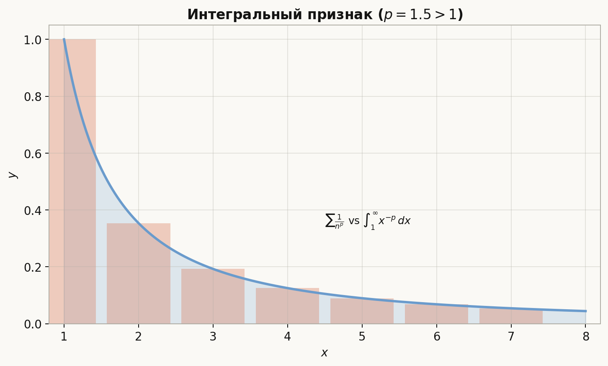
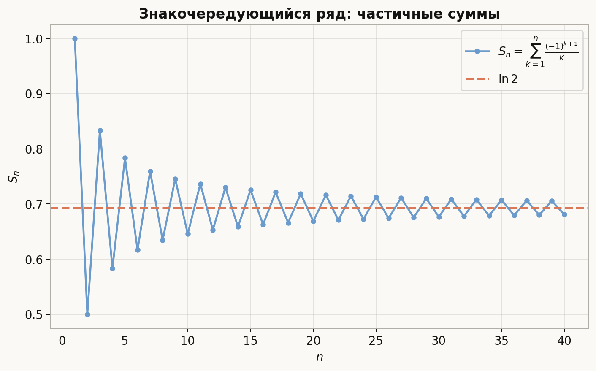
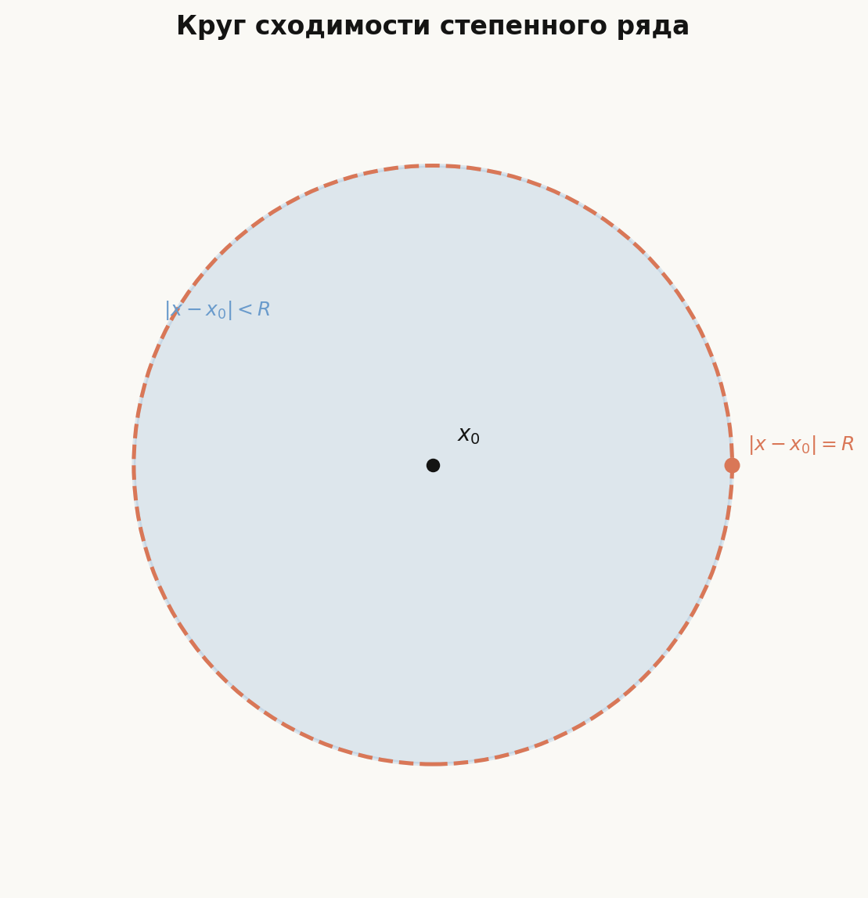
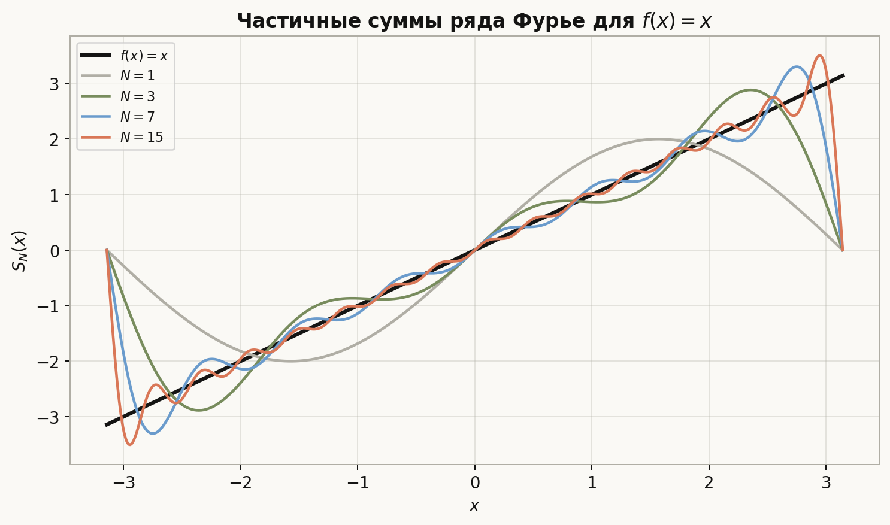
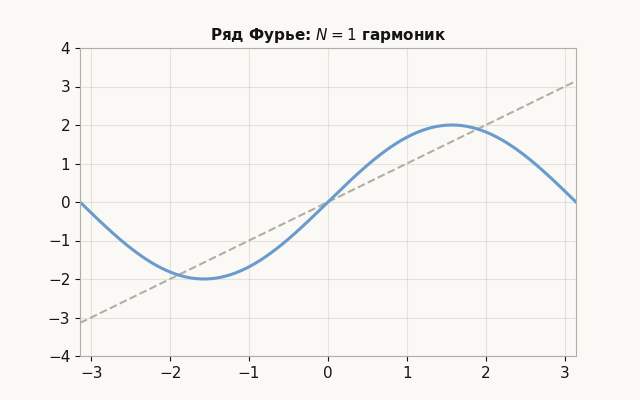
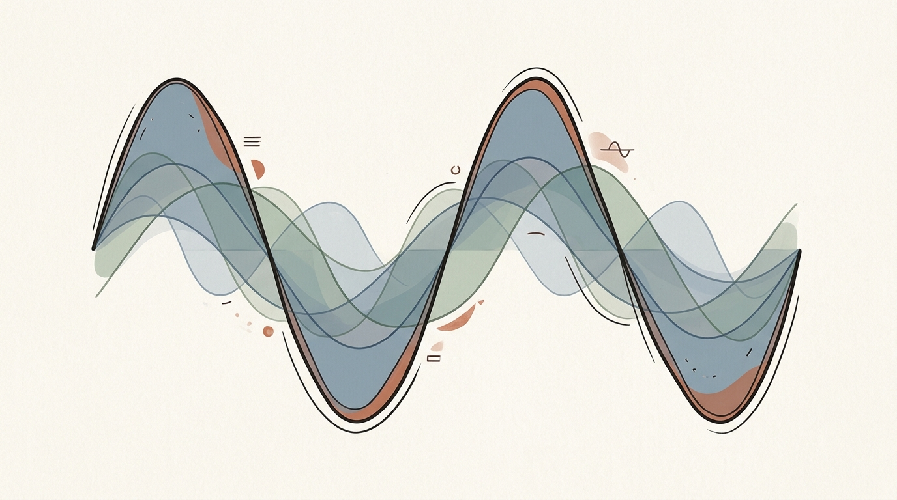

# Лекция: ряды, степенные ряды, ряды Фурье и преобразование Фурье

## План

1. Числовые ряды и частичные суммы
2. Необходимое условие сходимости
3. Гармонический и $p$-ряды
4. Признаки сравнения, Даламбера, Коши, интегральный, Лейбница
5. Абсолютная и условная сходимость
6. Признаки Абеля и Дирихле
7. Функциональные ряды
8. Степенные ряды, интервал и круг сходимости
9. Формула Коши–Адамара
10. Дифференцирование и интегрирование степенных рядов
11. Ряды Фурье
12. Интеграл Фурье и преобразование Фурье
13. Типичные ошибки
14. Что важно для поступления в ШАД
15. Итог
16. Вопросы для самопроверки

---

## 1. Числовые ряды

### Идея

Сложить *бесконечно много* чисел напрямую нельзя — операция сложения определена для двух (или конечного набора) слагаемых. Поэтому «бесконечная сумма» определяется через **предел**: складываем всё больше и больше слагаемых и смотрим, к чему стремится результат. Иногда результат конечен (ряд **сходится**), иногда нет (ряд **расходится**).

### Определение

Пусть задана последовательность $(a_n)_{n=1}^\infty$. **Частичная сумма** $n$-го порядка:
$$
S_n=\sum_{k=1}^n a_k.
$$

**Числовой ряд** $\sum_{n=1}^\infty a_n$ называется **сходящимся**, если существует конечный предел
$$
S=\lim_{n\to\infty} S_n.
$$
Число $S$ называют **суммой ряда**. Если предела нет или он бесконечен, ряд **расходится**.

**Пример (геометрический ряд).** При $|q|<1$:
$$
\sum_{n=0}^\infty q^n=\frac{1}{1-q}.
$$
Это **главный эталон**, к которому будут сводиться все признаки сходимости в духе «Даламбера» и «Коши»: если хвост ряда ведёт себя как геометрический с $|q|<1$, ряд сходится.

**Пример (телескопический).** При $a_n=\dfrac{1}{n(n+1)}=\dfrac{1}{n}-\dfrac{1}{n+1}$ соседние слагаемые сокращаются:
$$
S_n=\Bigl(1-\tfrac12\Bigr)+\Bigl(\tfrac12-\tfrac13\Bigr)+\cdots+\Bigl(\tfrac{1}{n}-\tfrac{1}{n+1}\Bigr)=1-\tfrac{1}{n+1}\to 1.
$$
Сумма ряда равна $1$. Так выглядит идеальная ситуация — мы получили $S$ в явном виде, не обращаясь к признакам.

---

## 2. Необходимое условие сходимости

Если $\sum a_n$ сходится, то
$$
a_n\to 0.
$$

**Почему.** Если $S_n\to S$, то $a_n=S_n-S_{n-1}\to S-S=0$.

**Как использовать на практике.** Это **первое, что нужно проверить**. Если $a_n\not\to 0$ — ряд сразу расходится, дальше можно не работать. Например, $\sum \dfrac{n}{n+1}$ расходится, потому что $\dfrac{n}{n+1}\to 1\ne 0$.

Обратное неверно: гармонический ряд $\sum\dfrac{1}{n}$ расходится, хотя $\dfrac{1}{n}\to 0$. То есть $a_n\to 0$ — необходимое, но **не достаточное** условие.

---

## 3. Гармонический и $p$-ряды

**Гармонический ряд:**
$$
\sum_{n=1}^\infty \frac{1}{n}
$$
расходится.

**Обобщённый гармонический ($p$-ряд):**
$$
\sum_{n=1}^\infty \frac{1}{n^p}.
$$
Сходится при $p>1$, расходится при $p\le 1$.

Эти ряды — эталон для признака сравнения.

### Почему расходится гармонический ряд (доказательство Орема)

Группируем слагаемые блоками длиной $1,2,4,8,\ldots$:
$$
1+\underbrace{\frac{1}{2}}_{=\,\frac{1}{2}}+\underbrace{\left(\frac{1}{3}+\frac{1}{4}\right)}_{\ge\,2\cdot\frac{1}{4}\,=\,\frac{1}{2}}+\underbrace{\left(\frac{1}{5}+\frac{1}{6}+\frac{1}{7}+\frac{1}{8}\right)}_{\ge\,4\cdot\frac{1}{8}\,=\,\frac{1}{2}}+\underbrace{\left(\frac{1}{9}+\cdots+\frac{1}{16}\right)}_{\ge\,8\cdot\frac{1}{16}\,=\,\frac{1}{2}}+\cdots
$$
В $k$-м блоке (по нумерации блоков, начиная с $k=1$ — это «$\frac{1}{2}$») содержится $2^{k-1}$ слагаемых, каждое $\ge \dfrac{1}{2^k}$, поэтому сумма блока $\ge\dfrac{1}{2}$. После $k$ блоков частичная сумма $\ge 1+\dfrac{k}{2}$ — растёт неограниченно. Значит ряд расходится.

**Скорость роста.** На самом деле $S_n\approx \ln n + \gamma$ (где $\gamma\approx 0{,}577$ — постоянная Эйлера), то есть ряд расходится крайне медленно, как логарифм.

**Картинка к интегральному признаку.** Каждое слагаемое $1/n^p$ — это площадь прямоугольника ширины $1$ и высоты $f(n)=n^{-p}$. Сумма всех прямоугольников зажата между двумя интегралами $\int_1^\infty f$ и $\int_0^\infty f$. Поэтому ряд и несобственный интеграл сходятся или расходятся одновременно (это формализуется ниже как **интегральный признак**).

---

## 4. Признаки сходимости

Все признаки ниже работают по одной идее: сравнить ряд с **геометрическим** (этот эталон сходится при $|q|<1$) или с **$p$-рядом**. Геометрия очень простая: если члены убывают быстрее геометрической прогрессии — сходимся; если медленнее, чем $1/n$, — обычно расходимся.

### Признак сравнения

Пусть $0\le a_n\le b_n$ начиная с некоторого $n$.

- Если $\sum b_n$ сходится, то $\sum a_n$ сходится («мажоранта» накрывает сверху).
- Если $\sum a_n$ расходится, то $\sum b_n$ расходится («миноранта» подпирает снизу).

**Предельный вариант:** если $a_n,b_n>0$ и $\lim\dfrac{a_n}{b_n}=L\in(0,+\infty)$, то ряды $\sum a_n$ и $\sum b_n$ ведут себя одинаково (оба сходятся или оба расходятся). Эта форма особенно удобна: она экономит арифметику — достаточно понять *асимптотику* $a_n$ и сравнить её с эталоном.

### Признак Даламбера

Пусть $a_n>0$ и существует
$$
\lim_{n\to\infty}\frac{a_{n+1}}{a_n}=L.
$$
- $L<1$ — ряд сходится;
- $L>1$ — расходится;
- $L=1$ — признак не решает вопрос.

**Интуиция.** Если отношение соседних членов *в пределе* меньше единицы, то начиная с некоторого момента ряд ведёт себя как геометрический с $q<1$ — отсюда и сходимость. Этот признак хорош для рядов с **факториалами** и **степенями вида $n^n$**, где отношение $a_{n+1}/a_n$ упрощается.

### Признак Коши (радикальный)

$$
\lim_{n\to\infty}\sqrt[n]{a_n}=L.
$$
Те же выводы: $L<1$ — сходимость, $L>1$ — расходимость, $L=1$ — неопределённость.

**Интуиция.** Если $\sqrt[n]{a_n}\to L$, то $a_n\sim L^n$, то есть ряд ведёт себя как геометрический со знаменателем $L$. Этот признак удобен, когда $a_n$ — целая $n$-я степень: $a_n=(\ldots)^n$ — корень даёт «прозрачное» выражение.

**Связь Даламбера и Коши.** Признак Коши **сильнее** Даламбера: если предел в Даламбере существует и равен $L$, то и в Коши тоже $L$, но не наоборот. Поэтому, если Даламбер «не сработал» (в смысле $L=1$ или предела нет), стоит попробовать Коши через $\limsup$.

### Интегральный признак

Если $a_n=f(n)$, где $f(x)$ положительна, монотонно убывает и непрерывна на $[1,+\infty)$, то
$$
\sum_{n=1}^\infty a_n \quad\text{и}\quad \int_1^\infty f(x)\,dx
$$
одновременно сходятся или расходятся.

### Признак Лейбница

Для знакочередующегося ряда $\sum(-1)^{n-1}b_n$ с $b_n>0$: если $b_n\searrow 0$ (монотонно убывает к нулю), ряд сходится.

**Интуиция (картинка).** Частичные суммы «качаются» вокруг искомой суммы $S$: чётные подсуммы $S_{2k}$ возрастают, нечётные $S_{2k+1}$ убывают, и расстояние между ними равно $b_{2k+1}\to 0$. Получается «вилка», стягивающаяся к $S$. Заодно ясна и **оценка остатка**: $|S-S_n|\le b_{n+1}$ — погрешность не превосходит первого отброшенного слагаемого.

### Примеры применения признаков

**Даламбер.** Для $\sum\frac{n!}{n^n}$ отношение $\dfrac{a_{n+1}}{a_n}=\left(\dfrac{n}{n+1}\right)^n\to\dfrac{1}{e}<1$, ряд сходится.

**Коши.** Для $\sum\left(\dfrac{2}{3}\right)^n$ имеем $\sqrt[n]{a_n}=\dfrac{2}{3}<1$.

**Сравнение.** Ряд $\sum\dfrac{1}{n^2+1}$ сходится, так как $\dfrac{1}{n^2+1}\le\dfrac{1}{n^2}$ и $\sum\dfrac{1}{n^2}$ сходится.

**Лейбниц.** Ряд $\sum\dfrac{(-1)^{n+1}}{n}$ сходится, но $\sum\dfrac{1}{n}$ расходится — сходимость условная.

---

## 5. Абсолютная и условная сходимость

Ряд $\sum a_n$ **сходится абсолютно**, если сходится $\sum|a_n|$.

Если $\sum a_n$ сходится, но $\sum|a_n|$ расходится, сходимость **условная**.

**Связь.** Абсолютная сходимость влечёт обычную: $|\sum a_n|\le \sum|a_n|$. Обратное неверно (знакочередующийся ряд $\sum (-1)^{n+1}/n$ сходится условно).

**Теорема Римана.** Если ряд сходится **условно**, то при подходящей перестановке слагаемых можно получить:
- сходящийся ряд с **любой наперёд заданной** суммой $S\in\mathbb{R}$;
- расходящийся ряд (хоть к $+\infty$, хоть к $-\infty$);
- ряд без предела вовсе.

**Почему это возможно (идея).** У условно сходящегося ряда сумма всех положительных слагаемых равна $+\infty$, а сумма всех отрицательных — $-\infty$. Чтобы попасть в любое $S$, мы поочерёдно «черпаем» из положительной кучи, пока не превысим $S$, потом из отрицательной, пока не опустимся ниже, и так далее. Слагаемые стремятся к нулю, поэтому колебания затухают, и сумма стабилизируется на $S$.

**Следствие.** Переставлять слагаемые можно безопасно **только при абсолютной сходимости** — там перестановка сохраняет сумму. Это резко отличает бесконечные суммы от конечных, где коммутативность очевидна.

---

## 6. Признаки Абеля и Дирихле

Пусть $\sum a_n$ — числовой ряд, $(b_n)$ — последовательность.

**Признак Абеля.** Если $\{b_n\}$ монотонна и ограничена, а $\sum a_n$ сходится, то $\sum a_n b_n$ сходится.

**Признак Дирихле.** Если $\{b_n\}$ монотонно стремится к $0$, а частичные суммы $A_n=\sum_{k=1}^n a_k$ ограничены, то $\sum a_n b_n$ сходится.

Знакочередующийся ряд с убывающими $b_n$ — частный случай.

### Пример (Дирихле)

Ряд $\sum_{n=1}^\infty \dfrac{\sin n}{n}$ сходится: частичные суммы $\sum_{k=1}^n\sin k$ ограничены (формула суммы синусов в прогрессии), а $b_n=\dfrac{1}{n}\searrow 0$.

### Пример (Абель)

Возьмём $\sum a_n=\sum\dfrac{(-1)^{n+1}}{\sqrt n}$ — он сходится по Лейбницу. Положим $b_n=\dfrac{n}{n+1}$ — последовательность монотонно возрастает и ограничена сверху единицей. Тогда $\sum a_n b_n=\sum\dfrac{(-1)^{n+1}\sqrt n}{n+1}$ сходится по признаку Абеля. Здесь ключевое отличие от Дирихле: $b_n$ **не стремится к нулю** ($b_n\to 1$), но монотонна и ограничена — этого достаточно при условии сходимости $\sum a_n$.

---

## 7. Функциональные ряды

**Функциональный ряд:**
$$
\sum_{n=1}^\infty u_n(x), \quad x\in E.
$$

**Поточечная сходимость:** для каждого $x\in E$ числовой ряд $\sum u_n(x)$ сходится. То есть **«для каждого $x$ свой $N$»**: скорость сходимости может зависеть от точки.

**Равномерная сходимость** на $E$: для любого $\varepsilon>0$ найдётся $N$ такое, что для всех $n\ge N$ и всех $x\in E$:
$$
\left|\sum_{k=n+1}^\infty u_k(x)\right|<\varepsilon.
$$
То есть **«один $N$ работает для всех $x$ сразу»** — хвост ряда меньше $\varepsilon$ равномерно по $x$.

**Зачем нужна равномерность.** Поточечный предел непрерывных функций может оказаться разрывным (классический пример: $f_n(x)=x^n$ на $[0,1]$ — предел разрывен в $x=1$). Равномерная сходимость **сохраняет непрерывность**, позволяет менять местами предел и интеграл, а при дополнительных условиях — дифференцировать почленно.

**Пример.** Ряд $\sum_{n=0}^\infty x^n$ сходится поточечно на $(-1,1)$ к $\dfrac{1}{1-x}$, но **не равномерно** на всём интервале: при $x\to 1^-$ сумма $\dfrac{1}{1-x}\to+\infty$, и никаким $N$ не «накрыть» хвост сразу для всех $x$. На отрезке $[-r,r]$ с $r<1$ сходимость уже равномерная — это типичная картина: равномерность есть на компакте *внутри* области сходимости.

### Критерий Вейерштрасса (достаточный)

Если $|u_n(x)|\le a_n$ для всех $x\in E$ и $\sum a_n$ сходится, то $\sum u_n(x)$ **равномерно** сходится на $E$. Это удобно, когда ряд мажорируется числовым.

**Пример.** $\sum\dfrac{x^n}{n^2}$ на $[-1,1]$: $|x^n/n^2|\le 1/n^2$, ряд мажорант сходится, значит сходимость равномерна на $[-1,1]$.

---

## 8. Степенные ряды

**Степенной ряд** в точке $x_0$:
$$
\sum_{n=0}^\infty c_n (x-x_0)^n.
$$

Это полиномы бесконечной степени. Самый знакомый пример — ряд Тейлора: $e^x=\sum\dfrac{x^n}{n!}$, $\sin x=\sum\dfrac{(-1)^n x^{2n+1}}{(2n+1)!}$ и т. д. На степенных рядах основано аналитическое продолжение функций и численные методы вычисления.

**Свойство симметрии.** Множество $x$, при которых ряд сходится, имеет вид интервала, симметричного относительно центра $x_0$: $(x_0-R,x_0+R)$ — **интервал сходимости** (концы могут как входить, так и нет, и решается отдельно).

В комплексной плоскости множество сходимости — **круг** $|z-z_0|<R$ (возможно, с точками на границе). Отсюда и название **«радиус» сходимости** — это буквально радиус круга в $\mathbb{C}$.

**Почему круг, а не произвольная фигура.** Лемма Абеля: если ряд сходится в точке $z_1\ne z_0$, то он сходится абсолютно при всех $z$ с $|z-z_0|<|z_1-z_0|$. То есть «сходимость в одной точке» гарантирует сходимость во всём меньшем круге. Поэтому область сходимости — это в точности круг (плюс, возможно, часть границы).

---

## 9. Формула Коши–Адамара

**Радиус сходимости** $R$ степенного ряда $\sum c_n(x-x_0)^n$:
$$
\frac{1}{R}=\limsup_{n\to\infty}\sqrt[n]{|c_n|}.
$$
Это **формула Коши–Адамара**. Договорённости на концах: $1/0=+\infty$ (ряд сходится на всей прямой), $1/(+\infty)=0$ (только в точке $x_0$).

**Почему $\limsup$, а не $\lim$.** Обычный предел $\sqrt[n]{|c_n|}$ может не существовать (например, у рядов с пропусками — где $c_n=0$ для половины индексов). $\limsup$ всегда определён и улавливает наибольшую скорость роста коэффициентов. Идея — та же, что и в признаке Коши для числовых рядов: применяя его к $|c_n(x-x_0)^n|$, получаем условие $|x-x_0|\cdot\limsup\sqrt[n]{|c_n|}<1$, то есть $|x-x_0|<1/\limsup\sqrt[n]{|c_n|}=R$.

**Удобный частный случай (Даламбер).** Если существует $L=\lim_{n\to\infty}\left|\dfrac{c_{n+1}}{c_n}\right|$, то $R=1/L$ (при $L\in(0,+\infty)$). Эта форма работает быстрее, когда коэффициенты содержат факториалы.

**Правило для границы.** Внутри $(x_0-R,x_0+R)$ ряд сходится абсолютно; вне — расходится. На концах интервала нужна **отдельная проверка** — там возможна любая ситуация: абсолютная сходимость, условная сходимость или расходимость.

### Вычисление радиуса: три типичных случая

1. **Ряд $\sum\dfrac{x^n}{n!}$.** $\left|\dfrac{c_{n+1}}{c_n}\right|=\dfrac{1}{n+1}\to 0$, значит $R=+\infty$. Это ряд экспоненты — сходится везде.

2. **Ряд $\sum n!\,x^n$.** $\left|\dfrac{c_{n+1}}{c_n}\right|=n+1\to+\infty$, поэтому $R=0$ (сходится только при $x=0$). Факториалы растут слишком быстро.

3. **Ряд $\sum x^n$.** $c_n=1$, $\limsup\sqrt[n]{|c_n|}=1$, $R=1$. Сумма внутри интервала: $\dfrac{1}{1-x}$.

**Пример с разбором концов.** $\sum\dfrac{x^n}{n}$: $R=1$ (Даламбер даёт $L=1$). При $x=1$ получаем гармонический ряд — расходится. При $x=-1$ — знакочередующий $\sum (-1)^n/n$ — сходится условно. Итого: область сходимости — это $[-1,1)$.

---

## 10. Дифференцирование и интегрирование степенных рядов

Внутри интервала сходимости $(x_0-R,x_0+R)$ степенной ряд можно дифференцировать и интегрировать **почленно**:

$$
\frac{d}{dx}\sum_{n=0}^\infty c_n(x-x_0)^n=\sum_{n=1}^\infty n c_n(x-x_0)^{n-1},
$$
$$
\int_{x_0}^x \sum_{n=0}^\infty c_n(t-x_0)^n\,dt=\sum_{n=0}^\infty \frac{c_n}{n+1}(x-x_0)^{n+1}.
$$

При этом **радиус сходимости не меняется**: $R$ один и тот же у исходного, продифференцированного и проинтегрированного рядов. Это потому, что $\sqrt[n]{n}\to 1$ и $\sqrt[n]{1/(n+1)}\to 1$ — лишние множители не влияют на $\limsup$. (На концах интервала поведение может, разумеется, поменяться.)

**Ряд Тейлора** функции $f$ в точке $x_0$:
$$
\sum_{n=0}^\infty \frac{f^{(n)}(x_0)}{n!}(x-x_0)^n.
$$
Если $f$ представляется этим рядом в окрестности $x_0$, она называется **аналитической**. Подробнее о формуле Тейлора — в лекции про производную и её приложения.

### Пример: получение новых рядов из геометрического

Стартуем с эталона: $\sum_{n=0}^\infty x^n=\dfrac{1}{1-x}$ при $|x|<1$.

**Дифференцирование** даёт
$$
\sum_{n=1}^\infty n x^{n-1}=\frac{1}{(1-x)^2}.
$$
**Интегрирование** $\sum x^n$ от $0$ до $x$:
$$
\sum_{n=0}^\infty\frac{x^{n+1}}{n+1}=-\ln(1-x),\quad |x|<1.
$$
**Замена** $x\to -x^2$ в геометрическом ряду даёт $\sum (-1)^n x^{2n}=\dfrac{1}{1+x^2}$; интегрирование даёт классический ряд для арктангенса:
$$
\arctan x=\sum_{n=0}^\infty \frac{(-1)^n x^{2n+1}}{2n+1},\quad |x|<1.
$$
В точке $x=1$ этот ряд сходится (Лейбниц) и даёт формулу Лейбница $\pi/4=1-1/3+1/5-\cdots$. Так разложения «производятся одно из другого» — без сложных вычислений производных.

---

## 11. Ряды Фурье

### Идея: разложение по гармоникам

Музыкальный звук рояля — это сложная периодическая волна, но ухо воспринимает её как сумму чистых синусоид: основной тон + обертоны. **Ряд Фурье** делает ровно это математически: представляет $2\pi$-периодическую функцию $f$ как сумму **базисных гармоник** $\cos(nx)$ и $\sin(nx)$ с подходящими коэффициентами. Низкие частоты ($n$ мало́) описывают «крупный рельеф» функции, высокие — мелкие детали и углы.

### Определения

Пусть $f$ — $2\pi$-периодическая функция, интегрируемая на $[-\pi,\pi]$.

**Коэффициенты Фурье:**
$$
a_n=\frac{1}{\pi}\int_{-\pi}^{\pi} f(x)\cos(nx)\,dx,\quad n\ge 0,
$$
$$
b_n=\frac{1}{\pi}\int_{-\pi}^{\pi} f(x)\sin(nx)\,dx,\quad n\ge 1.
$$

**Ряд Фурье:**
$$
\frac{a_0}{2}+\sum_{n=1}^\infty\bigl(a_n\cos(nx)+b_n\sin(nx)\bigr).
$$

Заметим: $a_0/2$ — это среднее значение $f$ на периоде. Остальные слагаемые описывают колебания вокруг среднего.

### Ортогональность — почему формулы именно такие

На $[-\pi,\pi]$ выполнены тождества:
$$
\int_{-\pi}^{\pi}\cos(mx)\cos(nx)\,dx=\pi\delta_{mn},\quad
\int_{-\pi}^{\pi}\sin(mx)\sin(nx)\,dx=\pi\delta_{mn},\quad
\int_{-\pi}^{\pi}\sin(mx)\cos(nx)\,dx=0.
$$
В пространстве функций со скалярным произведением $\langle f,g\rangle=\int_{-\pi}^{\pi} fg\,dx$ это означает: набор $\{1,\cos x,\sin x,\cos 2x,\sin 2x,\ldots\}$ — **ортогональный базис**. Формулы для $a_n,b_n$ — это в точности коэффициенты разложения $f$ по этому базису, аналог $\langle f,\cos(nx)\rangle/\|\cos(nx)\|^2$. Так же, как в $\mathbb{R}^n$ координаты вектора в ортогональном базисе вычисляются скалярным произведением.

### Симметрии

- $f$ **чётная** ($f(-x)=f(x)$): все $b_n=0$, ряд содержит только косинусы.
- $f$ **нечётная** ($f(-x)=-f(x)$): все $a_n=0$, ряд содержит только синусы.

Это сразу сокращает вдвое работу по вычислению коэффициентов.

### Сходимость (формулировка для экзамена)

Пусть $f$ — $2\pi$-периодическая, **кусочно непрерывна и кусочно непрерывно дифференцируема** на $[-\pi,\pi]$ (то есть на отрезке у $f$ конечное число точек разрыва первого рода, между ними $f$ непрерывно дифференцируема, а односторонние пределы $f$ и $f'$ существуют). Тогда ряд Фурье в каждой точке $x_0$ сходится к
$$
\frac{f(x_0+0)+f(x_0-0)}{2}.
$$
В точках непрерывности это просто $f(x_0)$; в точках скачка — среднее арифметическое односторонних пределов.

### Эффект Гиббса

При приближении частичной суммой $S_N$ функции со скачком вблизи разрыва возникает **«ушко»**: пик $S_N$ перескакивает истинное значение примерно на $9\%$ от величины скачка — и эта высота **не уменьшается** при $N\to\infty$ (хотя «ушко» сдвигается к точке разрыва). Это и есть **эффект Гиббса**. На анимации ниже это видно по ближайшему к $\pm\pi$ выбросу.

### Пример: пила $f(x)=x$

Для $f(x)=x$ на $(-\pi,\pi)$ (продолженной по периоду — получится «пилообразная» функция со скачками величины $2\pi$ в точках $x=\pm\pi$): функция нечётная, значит $a_n=0$, а
$$
b_n=\frac{2}{\pi}\int_0^\pi x\sin(nx)\,dx=\frac{2(-1)^{n+1}}{n}
$$
(интегрирование по частям). Получаем разложение
$$
x\sim 2\sum_{n=1}^\infty\frac{(-1)^{n+1}}{n}\sin(nx).
$$
В точках $x=\pm\pi$ — скачок, и ряд сходится к $\dfrac{(-\pi)+\pi}{2}=0$ (среднее односторонних пределов), хотя сама функция в этих точках в одностороннем смысле равна $\pm\pi$. Подставив $x=\pi/2$, получаем красивое тождество Лейбница:
$$
\frac{\pi}{4}=1-\frac{1}{3}+\frac{1}{5}-\frac{1}{7}+\cdots
$$

---

## 12. Интеграл Фурье и преобразование Фурье

### От периода к прямой

Ряд Фурье разлагает периодическую функцию по **дискретному** набору частот $n=1,2,3,\ldots$ (укладывающихся целое число раз на период). Если устремить период к бесконечности, дискретные частоты сгущаются и переходят в **непрерывный** параметр $\xi$. Сумма превращается в интеграл — так получается **преобразование Фурье**.

Для непериодических функций на всей прямой вводят **интеграл Фурье**. При подходящих условиях:
$$
f(x)=\int_0^\infty\bigl(A(\lambda)\cos\lambda x+B(\lambda)\sin\lambda x\bigr)\,d\lambda.
$$

В комплексной форме это удобнее записать через **преобразование Фурье** (используем «симметричное» соглашение с множителем $2\pi$ в экспоненте):
$$
\hat{f}(\xi)=\int_{-\infty}^{\infty} f(x)\,e^{-2\pi i\xi x}\,dx.
$$

**Обратное преобразование:**
$$
f(x)=\int_{-\infty}^{\infty} \hat{f}(\xi)\,e^{2\pi i\xi x}\,d\xi.
$$

### Что означает $\hat{f}(\xi)$

Аргумент $\xi$ — это **частота**: $\hat{f}(\xi)$ показывает, сколько «волны частоты $\xi$» содержится в сигнале $f$. Поэтому $f(x)$ называют сигналом во **временно́й** области (или «пространственной»), а $\hat{f}(\xi)$ — его представлением в **частотной** области. Эти два описания эквивалентны: по $\hat{f}$ можно восстановить $f$ через обратное преобразование.

Полезные интуитивные принципы:

- **Сдвиг ↔ модуляция:** сдвиг $f(x-a)$ умножает $\hat{f}(\xi)$ на $e^{-2\pi i\xi a}$ (фазовый множитель).
- **Растяжение ↔ сжатие:** $f(ax)$ переходит в $\dfrac{1}{|a|}\hat{f}(\xi/a)$. Чем у́же сигнал во времени — тем шире его спектр (и наоборот). Это математическая версия принципа неопределённости.
- **Свёртка ↔ произведение:** $\widehat{f*g}=\hat{f}\cdot\hat{g}$ — главное свойство, благодаря которому преобразование Фурье — рабочий инструмент в обработке сигналов и решении дифференциальных уравнений.

### Примеры

**Гауссиан** — собственная функция преобразования. Если $f(x)=e^{-\pi x^2}$, то
$$
\hat{f}(\xi)=e^{-\pi\xi^2}.
$$
Форма $e^{-\pi x^2}$ сохраняется — преобразование Фурье «не сдвигает» гауссиан. Это уникальное свойство (с точностью до растяжений).

**Прямоугольный импульс ↔ синк-функция.** Пусть $f(x)=1$ при $|x|\le a$ и $f(x)=0$ иначе ($a>0$). Тогда
$$
\hat{f}(\xi)=\int_{-a}^{a}e^{-2\pi i\xi x}\,dx=\frac{\sin(2\pi a\xi)}{\pi\xi}
$$
при $\xi\ne 0$ (и $\hat{f}(0)=2a$). Это классическая «функция $\mathrm{sinc}$» в частотной области. Чем уже импульс (меньше $a$), тем шире синк — иллюстрация принципа неопределённости.

**Двусторонняя экспонента.** Для $f(x)=e^{-|x|}$:
$$
\hat{f}(\xi)=\frac{2}{1+4\pi^2\xi^2}.
$$
Спектр — лоренцева кривая; быстрый «уголок» у $x=0$ требует широкого спектра высоких частот.

### Связь со спектральным анализом

Модуль $|\hat{f}(\xi)|$ — **амплитудный спектр**: «насколько громко» звучит частота $\xi$ в сигнале. Аргумент $\arg\hat{f}(\xi)$ — **фазовый спектр**: с каким сдвигом эта частота входит. На этой идее основаны JPEG (Фурье/косинус-разложение картинок), MP3 (отбрасывание неслышных частот), решение волнового и теплового уравнений, рентгеноструктурный анализ и масса других задач.

**Внимание к соглашениям.** В разных учебниках есть разные нормировки преобразования: с множителем $1/(2\pi)$ перед интегралом, с экспонентой $e^{-i\omega x}$ вместо $e^{-2\pi i\xi x}$ и т. п. Все они равноценны, но **формулы свойств** (в особенности обратного преобразования и Парсеваля) под них подстраиваются — обязательно фиксируйте соглашение перед вычислениями.

---

## 13. Типичные ошибки

- **Признак Даламбера при нулевых членах.** Если $a_n=0$ для части индексов, формула $a_{n+1}/a_n$ некорректна — нужно сгруппировать слагаемые или использовать Коши.
- **$L=1$ в Даламбере/Коши = «ничего не знаем».** Часто ошибочно интерпретируют как сходимость. Пример: $\sum 1/n$ и $\sum 1/n^2$ — обе с $L=1$, но первая расходится, а вторая сходится.
- **Перестановка в условно сходящемся ряду.** Теорема Римана: переставить можно к любой сумме. Менять порядок безопасно **только при абсолютной сходимости**.
- **Путать радиус и интервал сходимости.** Радиус $R$ — число; интервал — это $(x_0-R,x_0+R)$. Сходимость на концах **проверяется отдельно**.
- **Почленное дифференцирование без равномерной сходимости** ряда производных. Само по себе равномерной сходимости *исходного* ряда мало — нужна равномерная сходимость ряда из производных.
- **Подставлять $x=\pm\pi$ в ряд Фурье «как в формулу»** — в точках разрыва ряд сходится к среднему односторонних пределов, а не к значению функции.
- **Путать знаковые соглашения преобразования Фурье.** Разные учебники отличаются множителем $2\pi$ и знаком экспоненты — формулы свойств (Парсеваль, обратное, свёртка) меняются под выбранную нормировку.
- **Считать, что необходимое условие $a_n\to 0$ достаточно.** Это лишь *первый фильтр*: его выполнение не гарантирует сходимости (гармонический ряд — каноничный контрпример).

---

## 14. Что важно для поступления в ШАД

### Практический порядок исследования ряда

1. Проверить **необходимое условие** $a_n\to 0$. Если нет — расходимость.
2. Узнать **эталон**: геометрический, $p$-ряд, гармонический, знакочередующийся.
3. Для положительных $a_n$: **сравнение** или **предельное сравнение** с эталоном.
4. Если в ряде есть факториалы или степени $n^n$: **Даламбер**.
5. Если вид $\sqrt[n]{a_n}$ или $(\cdots)^n$: **Коши (радикальный)**.
6. Если $a_n=f(n)$ и $f$ убывает: **интегральный признак**.
7. Знакочередование + убывание модулей: **Лейбниц**.
8. «Нестандартный» знак или множитель $b_n$: **Дирихле** / **Абель**.
9. Для степенного ряда: **радиус** (Коши–Адамар), затем отдельно **концы** интервала.
10. Для ряда Фурье: чётность/нечётность, затем интегралы за половину периода.

Нужно уметь:

- распознать геометрический, $p$- и гармонический ряды;
- применить сравнение, Даламбера, Коши, интегральный признак, Лейбница;
- отличить абсолютную и условную сходимость;
- найти радиус сходимости (Коши–Адамар и/или Даламбер для $c_n$);
- продифференцировать или проинтегрировать степенной ряд внутри интервала;
- вычислить коэффициенты Фурье для простых $f$;
- знать определение преобразования Фурье и посчитать его для стандартного примера.

---

## 15. Итог

- **Числовой ряд** — это предел частичных сумм; «бесконечной суммы» как операции не бывает, есть только её предельный вариант.
- **Признаки сходимости** (сравнение, Даламбер, Коши, интегральный, Лейбниц, Дирихле, Абель) позволяют судить о ряде, не находя самой суммы. Все они так или иначе сводят дело к эталонам — геометрическому и $p$-ряду.
- **Абсолютная сходимость** означает «безопасную» бесконечную сумму: можно переставлять слагаемые, перегруппировывать. Условная сходимость (Риман) — нет.
- **Степенные ряды** сходятся в симметричной области — интервале на прямой, круге в комплексной плоскости. Радиус сходимости задаётся формулой Коши–Адамара через $\limsup\sqrt[n]{|c_n|}$.
- **Ряды Фурье** разлагают периодическую функцию по гармоникам $\sin nx,\cos nx$. Коэффициенты находятся через скалярное произведение с базисными функциями (ортогональность). В точках скачка ряд сходится к среднему односторонних пределов; вблизи скачка наблюдается эффект Гиббса.
- **Преобразование Фурье** — непрерывный аналог для функций на всей прямой. Это «вторая жизнь» сигнала в частотной области; ключевые свойства — переход свёртки в произведение и обратимость через обратное преобразование.

---

## 16. Вопросы для самопроверки

1. Сформулируйте необходимое условие сходимости ряда. Почему оно не достаточно?
2. При каких $p$ сходится $\sum 1/n^p$? Почему гармонический ряд расходится, хотя $1/n\to 0$?
3. Чем отличаются признаки Даламбера и Коши? Какой из них «сильнее»?
4. Когда знакочередующийся ряд сходится по Лейбницу? Как оценить остаток?
5. Что такое абсолютная и условная сходимость? Сформулируйте теорему Римана о перестановках.
6. Запишите формулу Коши–Адамара. Почему в ней $\limsup$, а не просто $\lim$?
7. Что происходит с радиусом сходимости при дифференцировании степенного ряда? А с поведением на концах интервала?
8. Как вычислить $a_n$ и $b_n$ в ряде Фурье? Как упрощается задача для чётной/нечётной функции?
9. К чему сходится ряд Фурье в точке разрыва? Что такое эффект Гиббса?
10. Запишите прямое и обратное преобразование Фурье в используемом здесь соглашении. Что происходит со спектром при сжатии сигнала?
