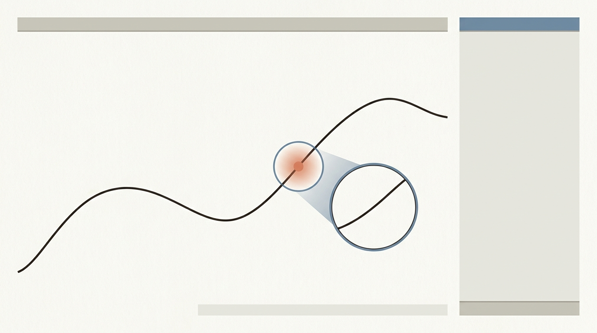
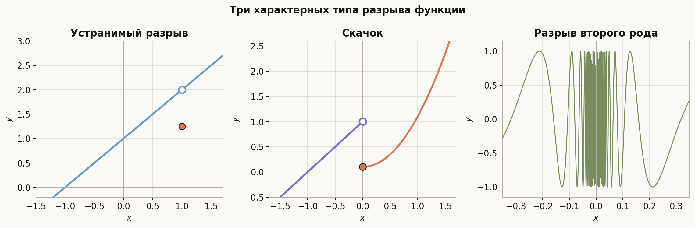
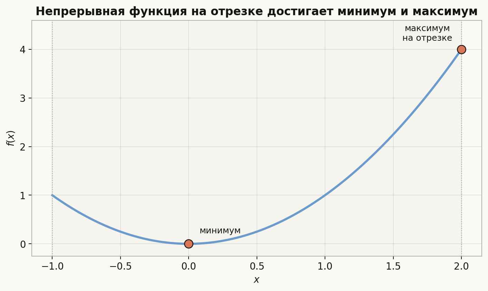
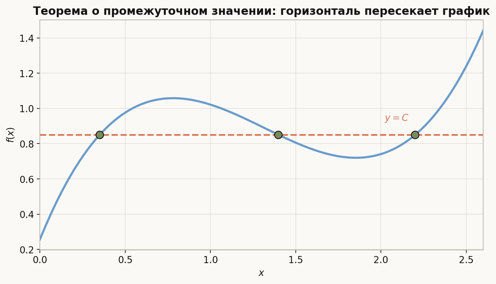
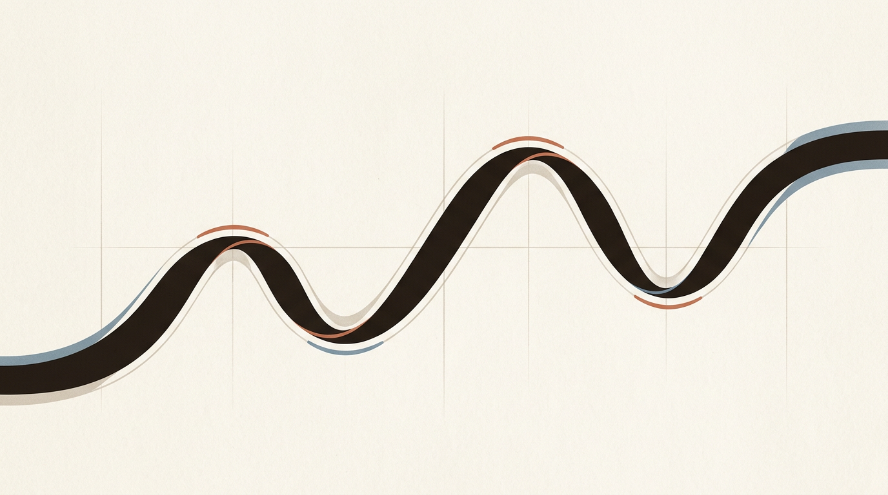

# Лекция: непрерывность функции в точке и свойства непрерывных функций на отрезке

## 1. Введение

Понятие непрерывности функции — одно из центральных в математическом анализе. Интуитивно непрерывная функция — это такая функция, график которой можно провести «не отрывая карандаша от бумаги». Однако в анализе требуется строгое определение.

Непрерывность важна потому, что именно для непрерывных функций справедливы фундаментальные свойства:

- функция не делает «скачков»;
- на отрезке она обязательно ограничена;
- на отрезке она достигает своих наибольшего и наименьшего значений;
- она принимает все промежуточные значения между значениями на концах отрезка.

В этой лекции мы рассмотрим:

- непрерывность функции в точке;
- одностороннюю непрерывность;
- свойства непрерывных функций на отрезке;
- теорему Коши о промежуточном значении.

---

## 2. Непрерывность функции в точке

### 2.1. Интуитивный смысл

Пусть дана функция $y = f(x)$ и точка $x_0$ из области определения функции.  
Говорят, что функция непрерывна в точке $x_0$, если при малом изменении аргумента $x$ значение функции $f(x)$ также изменяется мало, и при этом

$$
\lim_{x \to x_0} f(x) = f(x_0).
$$

То есть предел функции в точке существует и совпадает со значением функции в этой точке.

---

### 2.2. Определение через предел

Функция $f(x)$ называется **непрерывной в точке** $x_0$, если выполняются три условия:

1. функция определена в точке $x_0$, то есть существует $f(x_0)$;
2. существует предел $\lim_{x \to x_0} f(x)$;
3. этот предел равен значению функции в точке:

$$
\lim_{x \to x_0} f(x) = f(x_0).
$$

---

### 2.3. Определение по Коши ($\varepsilon$–$\delta$)

Функция $f$ непрерывна в точке $x_0$, если для любого $\varepsilon > 0$ существует такое $\delta > 0$, что из условия

$$
|x - x_0| < \delta
$$

следует

$$
|f(x) - f(x_0)| < \varepsilon.
$$

Смысл этого определения таков:

- насколько бы малое отклонение по значениям функции $\varepsilon$ мы ни задали,
- можно подобрать такое отклонение по аргументу $\delta$,
- что для всех $x$, достаточно близких к $x_0$, значения функции будут близки к $f(x_0)$.

---

### 2.4. Определение по Гейне

Функция $f$ непрерывна в точке $x_0$, если для любой последовательности $\{x_n\}$, такой что

$$
x_n \to x_0, \qquad x_n \ne x_0,
$$

имеем

$$
f(x_n) \to f(x_0).
$$

Это определение эквивалентно определению через $\varepsilon$ и $\delta$.

---

## 3. Точки разрыва

Если хотя бы одно из условий непрерывности нарушается, то функция имеет **разрыв** в точке $x_0$.

### Основные виды разрывов

#### 1. Устранимый разрыв

Если предел $\lim_{x \to x_0} f(x)$ существует, но

- либо функция не определена в $x_0$,
- либо значение $f(x_0)$ не равно этому пределу.

Тогда можно «исправить» функцию в одной точке и сделать её непрерывной.

**Пример:**

$$
f(x) = \frac{x^2 - 1}{x - 1}, \qquad x \ne 1.
$$

При $x \ne 1$:

$$
f(x) = x + 1.
$$

Следовательно,

$$
\lim_{x \to 1} f(x) = 2,
$$

но в точке $x=1$ функция не определена. Это устранимый разрыв.

---

#### 2. Разрыв первого рода

Если существуют конечные односторонние пределы

$$
\lim_{x \to x_0-0} f(x), \qquad \lim_{x \to x_0+0} f(x),
$$

но они не равны между собой.

Такой разрыв называется **скачком**.

---

#### 3. Разрыв второго рода

Если хотя бы один из односторонних пределов не существует или бесконечен.

Эта картинка полезна тем, что сразу разводит по геометрии три разных сценария: «дырка», скачок и неустранимое осциллирующее поведение.

---

## 4. Односторонняя непрерывность

Во многих задачах важно поведение функции только с одной стороны точки.

### 4.1. Непрерывность справа

Функция $f$ называется **непрерывной справа** в точке $x_0$, если

$$
\lim_{x \to x_0+0} f(x) = f(x_0).
$$

Это значит, что при приближении к $x_0$ справа значения функции стремятся к значению функции в точке.

---

### 4.2. Непрерывность слева

Функция $f$ называется **непрерывной слева** в точке $x_0$, если

$$
\lim_{x \to x_0-0} f(x) = f(x_0).
$$

---

### 4.3. Связь с обычной непрерывностью

Функция непрерывна в точке $x_0$ тогда и только тогда, когда она непрерывна:

- слева в точке $x_0$;
- справа в точке $x_0$,

и оба односторонних предела совпадают со значением функции:

$$
\lim_{x \to x_0-0} f(x) = \lim_{x \to x_0+0} f(x) = f(x_0).
$$

---

### 4.4. Особенность на концах отрезка

Если функция задана на отрезке $[a,b]$, то:

- в точке $a$ достаточно требовать непрерывность справа;
- в точке $b$ достаточно требовать непрерывность слева.

Это связано с тем, что вне отрезка функция может быть не определена.

---

### 4.5. Пример

Рассмотрим функцию

$$
f(x)=
\begin{cases}
x^2, & x \ge 0, \\
x+1, & x<0.
\end{cases}
$$

Проверим непрерывность в точке $x_0=0$.

Имеем:

$$
f(0)=0.
$$

Левый предел:

$$
\lim_{x\to 0-0} f(x)=\lim_{x\to 0-0}(x+1)=1.
$$

Правый предел:

$$
\lim_{x\to 0+0} f(x)=\lim_{x\to 0+0}x^2=0.
$$

Поскольку

$$
1 \ne 0,
$$

функция не непрерывна в точке $0$. Но справа она непрерывна, так как

$$
\lim_{x\to 0+0}f(x)=f(0)=0.
$$

---

## 5. Арифметические свойства непрерывных функций

Если функции $f$ и $g$ непрерывны в точке $x_0$, то в этой точке непрерывны также:

- сумма $f+g$;
- разность $f-g$;
- произведение $fg$;
- частное $\dfrac{f}{g}$, если $g(x_0)\ne 0$.

Кроме того, если функция $g$ непрерывна в точке $x_0$, а функция $f$ непрерывна в точке $g(x_0)$, то сложная функция

$$
y = f(g(x))
$$

непрерывна в точке $x_0$.

Из этого следует непрерывность всех элементарных функций в тех точках, где они определены.

---

## 6. Непрерывность на отрезке

Функция называется **непрерывной на отрезке** $[a,b]$, если:

- она непрерывна в каждой внутренней точке интервала $(a,b)$;
- непрерывна справа в точке $a$;
- непрерывна слева в точке $b$.

Именно для функций, непрерывных на отрезке, справедливы важнейшие теоремы.

---

# 7. Ограниченность непрерывной функции на отрезке

## Теорема Вейерштрасса об ограниченности

Если функция $f$ непрерывна на отрезке $[a,b]$, то она ограничена на этом отрезке, то есть существует число $M>0$ такое, что для всех $x \in [a,b]$ выполняется

$$
|f(x)| \le M.
$$

Или, в более общем виде, существуют числа $m$ и $M$, такие что

$$
m \le f(x) \le M \qquad \text{для всех } x \in [a,b].
$$

### Смысл теоремы

На конечном замкнутом промежутке непрерывная функция не может «убегать в бесконечность».

---

### Почему отрезок важен?

Если промежуток не замкнут или не ограничен, утверждение может быть неверным.

#### Пример 1: интервал $(0,1)$

Функция

$$
f(x)=\frac{1}{x}
$$

непрерывна на $(0,1)$, но не ограничена, так как при $x \to 0+0$

$$
f(x)\to +\infty.
$$

#### Пример 2: вся числовая ось

$$
f(x)=x
$$

непрерывна на $\mathbb{R}$, но не ограничена.

---

## Идея доказательства

Строгое доказательство опирается на свойство компактности отрезка $[a,b]$.  
Интуитивно отрезок не имеет «дыр» и «бесконечно удалённых» точек, а непрерывность не позволяет функции совершать скачки, поэтому значения функции не могут стать сколь угодно большими.

---

# 8. Достижение минимального и максимального значений

## Теорема Вейерштрасса о достижении экстремумов

Если функция $f$ непрерывна на отрезке $[a,b]$, то существуют такие точки $x_{\min}, x_{\max} \in [a,b]$, что

$$
f(x_{\min}) \le f(x) \le f(x_{\max}) \qquad \text{для всех } x \in [a,b].
$$

То есть функция на отрезке:

- достигает своего наименьшего значения;
- достигает своего наибольшего значения.

Эти значения обозначают:

$$
m = \min_{x \in [a,b]} f(x), \qquad M = \max_{x \in [a,b]} f(x).
$$

---

### Важное замечание

Речь идет не просто о существовании нижней и верхней грани, а именно о том, что найдутся точки, в которых эти значения принимаются.

---

### Пример 1

Рассмотрим функцию

$$
f(x)=x^2 \quad \text{на } [-1,2].
$$

Тогда:

- минимальное значение равно $0$ и достигается при $x=0$;
- максимальное значение равно $4$ и достигается при $x=2$.

---

### Пример 2

Функция

$$
f(x)=x \quad \text{на } (0,1)
$$

непрерывна, но на интервале $(0,1)$:

- не достигает минимума $0$;
- не достигает максимума $1$.

Это показывает, что замкнутость отрезка существенна.

Здесь важно видеть, что речь идёт не просто об оценках сверху и снизу, а о реальных точках графика, где минимум и максимум достигаются.

---

## Геометрический смысл

График непрерывной функции на отрезке имеет самую низкую и самую высокую точки.

---

# 9. Теорема Коши о промежуточном значении

## Формулировка

Если функция $f$ непрерывна на отрезке $[a,b]$, и число $C$ лежит между числами $f(a)$ и $f(b)$, то существует такая точка $c \in [a,b]$, что

$$
f(c)=C.
$$

Иначе говоря, если

$$
f(a) \le C \le f(b)
$$

или

$$
f(b) \le C \le f(a),
$$

то найдется $c \in [a,b]$ такое, что

$$
f(c)=C.
$$

---

## Смысл теоремы

Непрерывная функция, переходя от значения $f(a)$ к значению $f(b)$, обязана пройти через все промежуточные значения.

Она не может «перепрыгнуть» через какое-либо число.

---

## Геометрическая интерпретация

Если график непрерывной функции начинается в точке с ординатой $f(a)$ и заканчивается в точке с ординатой $f(b)$, то любая горизонтальная прямая

$$
y=C,
$$

где $C$ между $f(a)$ и $f(b)$, пересечет график хотя бы в одной точке.

Это наглядная форма теоремы Коши: непрерывная кривая не может перепрыгнуть через промежуточное значение.

---

## Частный случай

Если

$$
f(a)\cdot f(b)<0,
$$

то числа $f(a)$ и $f(b)$ имеют разные знаки. Тогда число $0$ лежит между ними, и по теореме Коши существует точка $c \in [a,b]$, для которой

$$
f(c)=0.
$$

Это означает, что непрерывная функция, меняющая знак на отрезке, обязательно имеет хотя бы один корень.

Этот факт часто называют **теоремой Больцано–Коши**.

---

## Пример 1

Рассмотрим функцию

$$
f(x)=x^3-x-2.
$$

Она непрерывна на всей числовой оси. Проверим значения в точках $1$ и $2$:

$$
f(1)=1-1-2=-2,
$$

$$
f(2)=8-2-2=4.
$$

Так как

$$
f(1)<0,\qquad f(2)>0,
$$

то по теореме Коши существует $c \in (1,2)$ такое, что

$$
f(c)=0.
$$

Следовательно, уравнение

$$
x^3-x-2=0
$$

имеет хотя бы один корень на интервале $(1,2)$.

---

## Пример 2

Пусть

$$
f(x)=\cos x
$$

на отрезке $\left[0,\pi\right]$.

Имеем:

$$
f(0)=1,\qquad f(\pi)=-1.
$$

Число $0$ лежит между $1$ и $-1$, значит существует $c \in [0,\pi]$, что

$$
\cos c=0.
$$

Действительно, $c=\frac{\pi}{2}$.

---

## Почему непрерывность существенна?

Без непрерывности теорема неверна.

Рассмотрим функцию

$$
f(x)=
\begin{cases}
-1, & x<0, \\
1, & x\ge 0.
\end{cases}
$$

На отрезке $[-1,1]$ имеем:

$$
f(-1)=-1,\qquad f(1)=1.
$$

Число $0$ лежит между $-1$ и $1$, но такого $c$, что

$$
f(c)=0,
$$

не существует.

Причина — разрыв функции в точке $0$.

---

# 10. Следствия и значение теоремы Коши

Из теоремы о промежуточном значении вытекают важные факты:

- непрерывная функция переводит отрезок в некоторый отрезок или интервал;
- если функция на отрезке принимает два значения, то она принимает и все значения между ними;
- можно доказывать существование корней уравнений;
- на теореме основан метод половинного деления для численного нахождения корней.

---

## Следствие

Если функция $f$ непрерывна на $[a,b]$, то множество её значений также является отрезком:

$$
f([a,b]) = [m,M]
$$

или, в более общем понимании, всем промежутком между минимальным и максимальным значениями.

Поскольку по теореме Вейерштрасса функция достигает $m$ и $M$, а по теореме Коши принимает все промежуточные значения, то её множество значений есть именно весь отрезок от $m$ до $M$.

---

# 11. Сводка основных утверждений

<strong>Краткий конспект</strong>

## Непрерывность в точке

Функция непрерывна в точке $x_0$, если

$$
\lim_{x \to x_0} f(x)=f(x_0).
$$

## Односторонняя непрерывность

- справа:

$$
\lim_{x \to x_0+0} f(x)=f(x_0);
$$

- слева:

$$
\lim_{x \to x_0-0} f(x)=f(x_0).
$$

## Если функция непрерывна на отрезке $[a,b]$, то она:

- ограничена;
- достигает минимума;
- достигает максимума;
- принимает все промежуточные значения между $f(a)$ и $f(b)$.

## Теорема Коши

Если $C$ между $f(a)$ и $f(b)$, то существует $c \in [a,b]$, такое что

$$
f(c)=C.
$$

## Важное следствие

Если

$$
f(a)\cdot f(b)<0,
$$

то существует $c \in [a,b]$, для которого

$$
f(c)=0.
$$

---

# 12. Заключение

Понятие непрерывности позволяет строго описать отсутствие разрывов у функции. Непрерывность в точке означает согласованность предельного поведения функции со значением в этой точке, а односторонняя непрерывность особенно важна на концах промежутков и для кусочно заданных функций.

Для функций, непрерывных на отрезке, справедливы важнейшие теоремы анализа:

- **теорема об ограниченности**;
- **теорема о достижении максимума и минимума**;
- **теорема Коши о промежуточном значении**.

Эти результаты имеют не только теоретическое, но и практическое значение: они используются при исследовании функций, решении уравнений, доказательстве существования решений и в численных методах.

