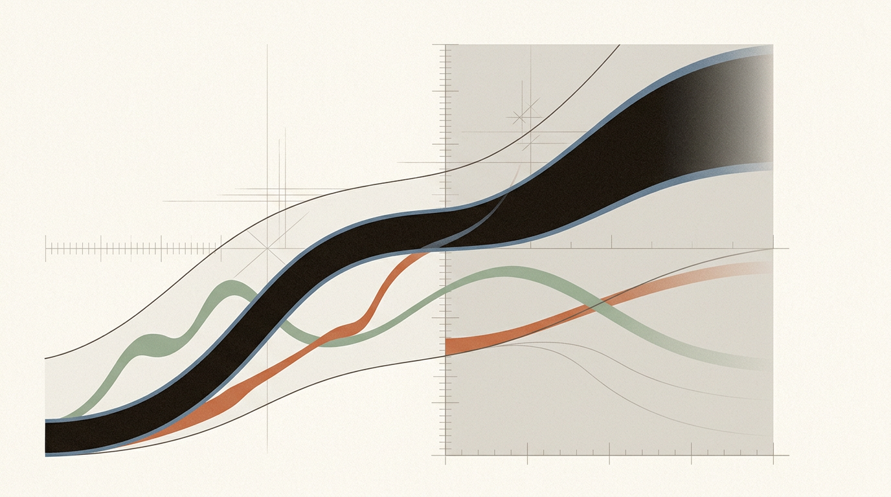
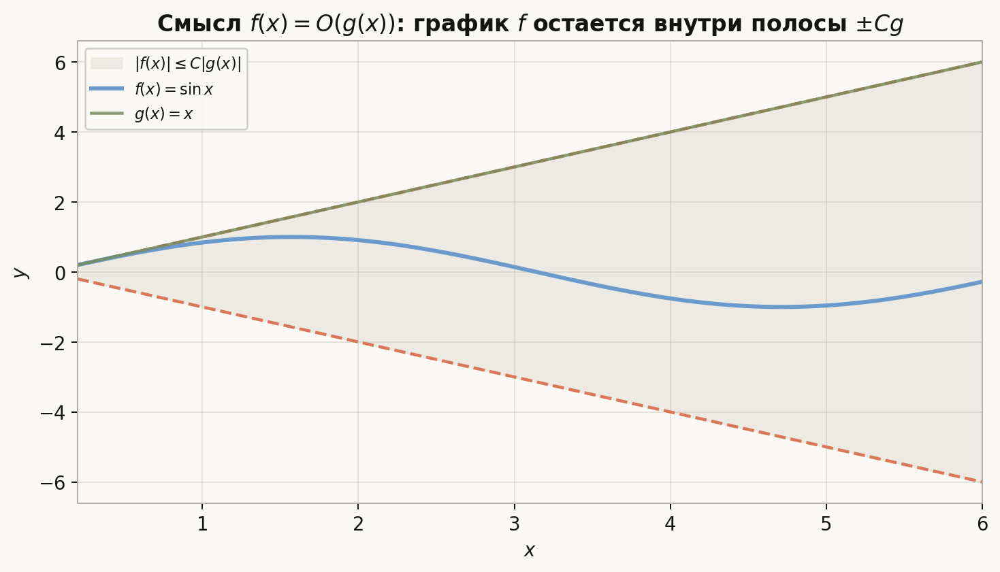
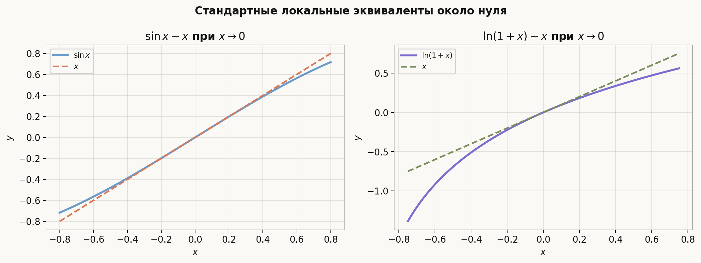
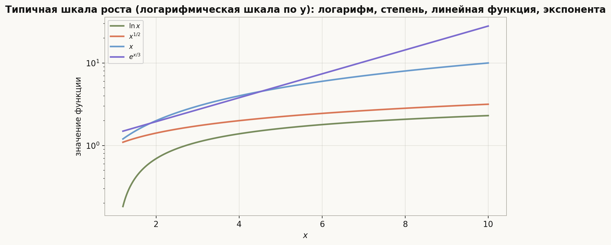
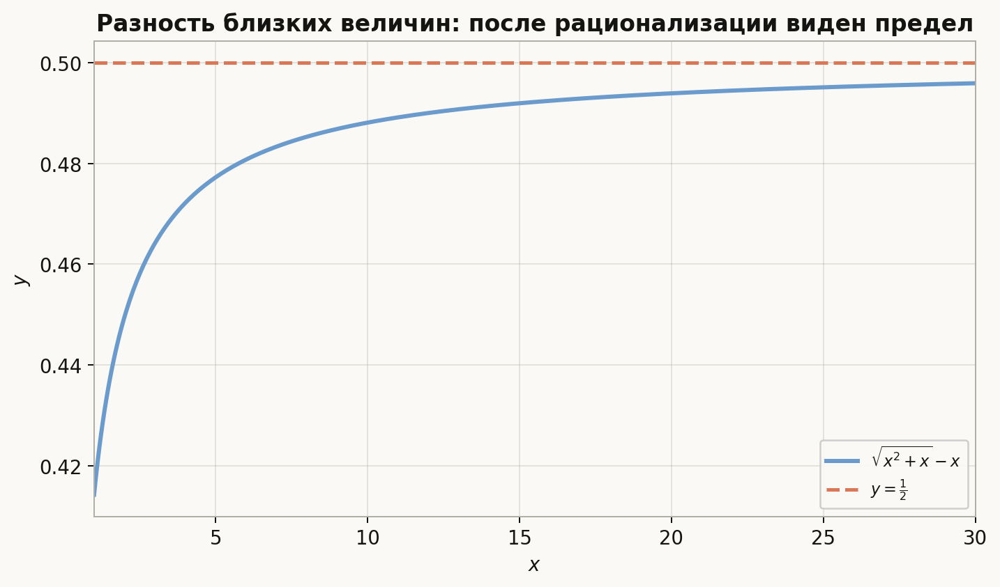

# Лекция: О-символика и асимптотические оценки

## План лекции

1. Зачем нужна асимптотика  
2. Определения $O$, $o$, $\Omega$, $\Theta$, $\sim$  
3. Связь с пределами  
4. Типичные примеры  
5. Арифметика асимптотик  
6. Стандартные шкалы роста  
7. Как искать главный член  
8. Типичные ошибки  
9. Примеры уровня вступительных задач

---

## 1. Зачем нужна асимптотика

Во многих задачах нас интересует не точное значение функции, а то, как она ведет себя:

- при $x \to \infty$;
- при $x \to 0$;
- около некоторой выделенной точки $x_0$.

Например:

- насколько быстро растет $x^2+3x+1$;
- насколько мала величина $\ln(1+x)$ при $x \to 0$;
- какой член является главным в выражении

$$
\sqrt{x^2+x}-x
$$

при больших $x$.

Асимптотическая символика позволяет формализовать фразы:

- "не больше по порядку";
- "существенно меньше";
- "одного порядка";
- "асимптотически эквивалентны".

Эти идеи важны и в анализе, и в теории алгоритмов.

---

## 2. Базовая установка

Пусть функции $f$ и $g$ определены в некоторой проколотой окрестности точки $a$ или при достаточно больших $x$. Обычно рассматривают:

- $x \to a$;
- $x \to 0$;
- $x \to \infty$.

Во всех определениях предполагается, что $g(x)\ne 0$ достаточно близко к рассматриваемой точке, если используется отношение $\frac{f(x)}{g(x)}$.

---

## 3. Символ $O$

### 3.1. Определение

Говорят, что

$$
f(x)=O(g(x)) \quad \text{при } x\to a,
$$

если существуют такие константы $C>0$ и $\delta>0$, что для всех $x$, удовлетворяющих $0<|x-a|<\delta$, выполнено

$$
|f(x)| \le C|g(x)|.
$$

При $x\to\infty$ определение записывается так: существуют $M>0$ и $C>0$, что для всех $x>M$

$$
|f(x)| \le C|g(x)|.
$$

Важно: в $O$ участвует **только верхняя** оценка. Никакого условия снизу не накладывается, поэтому $f$ может оказаться даже существенно меньше $g$.

### 3.2. Смысл

Запись $f=O(g)$ означает: функция $f$ по модулю растет не быстрее, чем $g$, с точностью до постоянного множителя.

Эта картинка переводит формальное определение в геометрический образ: график $f$ не обязан совпадать с $g$, но должен оставаться в полосе, заданной постоянным множителем от $g$.

### 3.3. Примеры

1. 

$$
x^2+3x+1 = O(x^2), \qquad x\to\infty.
$$

2. 

$$
\sin x = O(x), \qquad x\to 0,
$$

так как $\sin x \sim x$ при $x\to 0$.

3. 

$$
\ln x = O(x), \qquad x\to\infty,
$$

потому что логарифм растет медленнее любой положительной степени.

---

## 4. Символ $o$

### 4.1. Определение

Говорят, что

$$
f(x)=o(g(x)) \quad \text{при } x\to a,
$$

если

$$
\frac{f(x)}{g(x)} \to 0.
$$

Эквивалентно: для любого $\varepsilon>0$ существует окрестность точки $a$, в которой

$$
|f(x)| \le \varepsilon |g(x)|.
$$

### 4.2. Смысл

Запись $f=o(g)$ означает, что $f$ существенно меньше $g$ в рассматриваемом предельном переходе.

### 4.3. Примеры

1. 

$$
x = o(x^2), \qquad x\to\infty.
$$

Действительно,

$$
\frac{x}{x^2}=\frac{1}{x}\to 0.
$$

2. 

$$
x^2 = o(x), \qquad x\to 0.
$$

Действительно,

$$
\frac{x^2}{x}=x\to 0.
$$

3. 

$$
\ln x = o(x^\alpha), \qquad x\to\infty,
$$

для любого $\alpha>0$.

---

## 5. Символы $\Omega$ и $\Theta$

### 5.1. Символ $\Omega$

Говорят, что

$$
f(x)=\Omega(g(x)) \quad \text{при } x\to a,
$$

если существуют такие константы $c>0$ и $\delta>0$, что для всех $x$, удовлетворяющих $0<|x-a|<\delta$, выполнено

$$
|f(x)| \ge c|g(x)|.
$$

При $x\to\infty$ — существуют $c>0$ и $M>0$, что для всех $x>M$ верно $|f(x)|\ge c|g(x)|$.

$\Omega$ — это **зеркальный** аналог $O$: в $O$ оценивается верхняя граница, в $\Omega$ — нижняя. Запись $f=\Omega(g)$ означает, что $f$ растет **не медленнее**, чем $g$ (с точностью до постоянного множителя).

### 5.2. Символ $\Theta$

Говорят, что

$$
f(x)=\Theta(g(x)) \quad \text{при } x\to a,
$$

если одновременно

$$
f(x)=O(g(x)) \quad \text{и} \quad f(x)=\Omega(g(x)).
$$

Развернутая формулировка: существуют такие константы $0<c\le C$ и $\delta>0$, что для всех $x$ с $0<|x-a|<\delta$ выполнено

$$
c\,|g(x)|\le |f(x)|\le C\,|g(x)|.
$$

Это означает, что $f$ и $g$ имеют **в точности один и тот же** порядок роста: $|f|$ зажата между двумя положительно пропорциональными $|g|$.

### 5.3. Чем $\Theta$ отличается от $O$

Это место часто путают. Сравним определения **на одной картинке**:

| Запись | Что требуется |
|---|---|
| $f=O(g)$ | только **сверху**: $\;\;\,|f|\le C|g|$ |
| $f=\Omega(g)$ | только **снизу**: $\;\;\,|f|\ge c|g|$ |
| $f=\Theta(g)$ | **с двух сторон**: $\;c|g|\le|f|\le C|g|$ |

Ключевое отличие: $O$ — это **односторонняя** оценка (потолок), а $\Theta$ — **двусторонняя** (коридор). Поэтому $O$ допускает случай, когда $f$ намного меньше $g$, а $\Theta$ — нет.

**Иллюстрирующий пример.** При $x\to\infty$:

$$
1=O(x^2), \qquad \text{но} \qquad 1\ne \Theta(x^2).
$$

Действительно, $|1|\le 1\cdot|x^2|$ выполняется — поэтому $1=O(x^2)$. Но никакая константа $c>0$ не дает $1\ge c\cdot x^2$ для больших $x$, поэтому $\Theta$-оценки нет. Здесь $f$ — на много порядков **меньше** $g$, и $O$ это разрешает, а $\Theta$ запрещает.

### 5.4. Пример на $\Theta$

$$
x^2+3x+1 = \Theta(x^2), \qquad x\to\infty.
$$

Действительно, отношение

$$
\frac{x^2+3x+1}{x^2}=1+\frac{3}{x}+\frac{1}{x^2}\to 1.
$$

В частности оно ограничено сверху и снизу положительными константами при больших $x$, что и дает $\Theta(x^2)$. Более того, поскольку предел равен $1$, функция асимптотически эквивалентна $x^2$ (см. следующий раздел).

---

## 6. Асимптотическая эквивалентность

### 6.1. Определение

Говорят, что

$$
f(x)\sim g(x) \quad \text{при } x\to a,
$$

если

$$
\frac{f(x)}{g(x)} \to 1.
$$

### 6.2. Смысл

Это более сильное утверждение, чем $f=\Theta(g)$: главный член не просто того же порядка, а совпадает с точностью до относительной ошибки, стремящейся к нулю.

### 6.3. Эквивалентные формулировки

Если $g(x)\ne 0$ вблизи точки, то следующие условия эквивалентны:

1. 

$$
f(x)\sim g(x);
$$

2. 

$$
f(x)=g(x)\bigl(1+o(1)\bigr);
$$

3. 

$$
f(x)-g(x)=o(g(x)).
$$

### 6.4. Примеры

1. 

$$
x^2+3x+1 \sim x^2, \qquad x\to\infty.
$$

2. 

$$
\ln(1+x)\sim x, \qquad x\to 0.
$$

3. 

$$
\sin x \sim x, \qquad x\to 0.
$$

4. 

$$
1-\cos x \sim \frac{x^2}{2}, \qquad x\to 0.
$$

Это полезная картинка для интуиции слова «эквивалентность»: формулы различны, но в малой окрестности нуля графики ведут себя почти одинаково на правильном масштабе.

---

## 7. Связь между обозначениями

Между основными асимптотическими обозначениями есть простые связи:

1. Если

$$
f(x)=o(g(x)),
$$

то автоматически

$$
f(x)=O(g(x)).
$$

2. Если

$$
f(x)\sim g(x),
$$

то

$$
f(x)=\Theta(g(x)).
$$

3. Обратные утверждения, вообще говоря, неверны:

- из $f=O(g)$ не следует $f=o(g)$;
- из $f=\Theta(g)$ не следует $f\sim g$.

### Контрпример

Пусть

$$
f(x)=2x, \qquad g(x)=x, \qquad x\to\infty.
$$

Тогда

$$
f(x)=\Theta(g(x)),
$$

но

$$
\frac{f(x)}{g(x)}=2 \not\to 1,
$$

поэтому

$$
f(x)\not\sim g(x).
$$

---

## 8. Проверка через пределы

На практике многие утверждения проверяются просто по пределу отношения.

### 8.1. Для $o$

Чтобы показать

$$
f=o(g),
$$

достаточно вычислить

$$
\lim \frac{f}{g}=0.
$$

### 8.2. Для $\sim$

Чтобы показать

$$
f\sim g,
$$

достаточно вычислить

$$
\lim \frac{f}{g}=1.
$$

### 8.3. Для $\Theta$

Если функции положительны, то удобно показать, что отношение

$$
\frac{f(x)}{g(x)}
$$

ограничено сверху и снизу положительными константами.

Например, если существует конечный предел

$$
\frac{f(x)}{g(x)} \to L,
$$

где $0<L<\infty$, то автоматически

$$
f(x)\sim Lg(x),
$$

и, в частности,

$$
f(x)=\Theta(g(x)).
$$

---

## 9. Типичные примеры

### 9.1. Многочлен и его старший член

Если

$$
P(x)=a_nx^n+a_{n-1}x^{n-1}+\dots+a_0, \qquad a_n\ne 0,
$$

то при $x\to\infty$

$$
P(x)\sim a_nx^n.
$$

Это следует из деления на $x^n$:

$$
\frac{P(x)}{a_nx^n}=1+\frac{a_{n-1}}{a_n}\cdot\frac{1}{x}+\cdots+\frac{a_0}{a_n}\cdot\frac{1}{x^n}\to 1.
$$

### 9.2. Рациональная функция

Пусть

$$
R(x)=\frac{P(x)}{Q(x)}.
$$

Тогда поведение при $x\to\infty$ определяется степенями старших членов:

- если $\deg P<\deg Q$, то $R(x)\to 0$;
- если $\deg P=\deg Q$, то предел равен отношению старших коэффициентов;
- если $\deg P>\deg Q$, то функция растет по степенному закону.

### 9.3. Корни

Рассмотрим

$$
\sqrt{x^2+x}-x.
$$

Непосредственно выделить главный член неудобно. Рационализуем:

$$
\sqrt{x^2+x}-x=\frac{(x^2+x)-x^2}{\sqrt{x^2+x}+x}=\frac{x}{\sqrt{x^2+x}+x}.
$$

При $x\to\infty$ знаменатель эквивалентен $2x$, поэтому

$$
\sqrt{x^2+x}-x \sim \frac{x}{2x}=\frac12.
$$

Значит,

$$
\sqrt{x^2+x}-x \to \frac12.
$$

### 9.4. Логарифм и показательная функция

Для любого $\alpha>0$ и любого $c>1$ при $x\to\infty$ выполняется цепочка:

$$
\ln x = o(x^\alpha), \qquad x^\alpha = o(c^x).
$$

Идея: показательная функция растет быстрее любой степени, а любая степень быстрее логарифма.

---

## 10. Стандартные асимптотические эквиваленты

Эти формулы нужно знать очень хорошо.

При $x\to 0$:

1. 

$$
\sin x \sim x.
$$

2. 

$$
\tan x \sim x.
$$

3. 

$$
\arcsin x \sim x.
$$

4. 

$$
\ln(1+x)\sim x.
$$

5. 

$$
e^x-1 \sim x.
$$

6. 

$$
(1+x)^\alpha-1 \sim \alpha x
$$

для фиксированного $\alpha\in\mathbb{R}$.

7. 

$$
1-\cos x \sim \frac{x^2}{2}.
$$

Эти эквиваленты часто позволяют заменить сложную функцию на более простую, не меняя главного члена.

---

## 11. Арифметика асимптотик

### 11.1. Умножение на константу

Если

$$
f(x)=O(g(x)),
$$

то для любой константы $c$

$$
cf(x)=O(g(x)).
$$

Если

$$
f(x)\sim g(x),
$$

то

$$
cf(x)\sim cg(x).
$$

### 11.2. Сумма

Если

$$
f_1=O(g), \qquad f_2=O(g),
$$

то

$$
f_1+f_2=O(g).
$$

Если

$$
f=o(g), \qquad h=o(g),
$$

то

$$
f+h=o(g).
$$

### 11.3. Произведение

Если

$$
f_1=O(g_1), \qquad f_2=O(g_2),
$$

то

$$
f_1f_2=O(g_1g_2).
$$

Если

$$
f_1\sim g_1, \qquad f_2\sim g_2,
$$

то

$$
f_1f_2\sim g_1g_2.
$$

### 11.4. Деление

Если

$$
f_1\sim g_1, \qquad f_2\sim g_2,
$$

и $g_2(x)\ne 0$ вблизи точки, то

$$
\frac{f_1}{f_2}\sim \frac{g_1}{g_2}.
$$

### 11.5. Замена на эквивалентную

Если

$$
f(x)\sim g(x),
$$

то во многих задачах на предел можно заменить $f$ на $g$.

Но эту замену надо делать аккуратно: обычно она корректна в произведениях и частных, а в суммах и разностях можно потерять главный член.

### Пример опасной замены

Из

$$
\sin x \sim x
$$

не следует автоматически, что

$$
1-\sin x \sim 1-x
$$

в любом нужном контексте полезным образом. Особенно опасны вычитания близких по величине членов.

---

## 12. Как искать главный член

### 12.1. У многочленов

Оставить старший член.

### 12.2. У дробей

Вынести старшую степень в числителе и знаменателе.

### 12.3. У выражений с корнями

Часто помогает рационализация:

$$
\sqrt{A}-\sqrt{B}=\frac{A-B}{\sqrt{A}+\sqrt{B}}.
$$

### 12.4. У выражений вида $1+$ малое

Использовать стандартные эквиваленты:

$$
\ln(1+x)\sim x, \qquad e^x-1\sim x.
$$

### 12.5. У сложных произведений

Разбить на множители и для каждого найти асимптотику отдельно.

---

## 13. Шкалы роста

Нужно хорошо чувствовать типичный порядок роста при $x\to\infty$:

$$
\ln x \ll x^\alpha \ll x^\beta \ll c^x
$$

при

$$
0<\alpha<\beta, \qquad c>1.
$$

Здесь символ $\ll$ можно понимать как $o$:

$$
\ln x = o(x^\alpha), \qquad x^\alpha=o(x^\beta), \qquad x^\beta=o(c^x).
$$

Это одна из самых важных и часто используемых шкал.

Такой график помогает быстро удерживать в памяти основную иерархию: логарифм растет медленнее степеней, а экспонента обгоняет любые степенные функции.

---

## 14. Типичные ошибки

### 14.1. Путаница между $O$ и $o$

Из

$$
f=O(g)
$$

не следует

$$
f=o(g).
$$

Например,

$$
x=O(x),
$$

но

$$
x\ne o(x).
$$

### 14.2. Путаница между $\Theta$ и $\sim$

Из

$$
f=\Theta(g)
$$

не следует

$$
f\sim g.
$$

Например, $2x=\Theta(x)$ при $x\to\infty$ (отношение постоянно равно $2$, значит оно зажато между $1$ и $3$), но $\frac{2x}{x}=2\not\to 1$, поэтому $2x\not\sim x$. Запись $\Theta$ говорит лишь о **порядке** роста и допускает любой ненулевой постоянный множитель; $\sim$ требует, чтобы этот множитель был равен $1$.

### 14.3. Некорректная замена в сумме

Если два больших члена почти сокращаются, то замена каждого на эквивалентный может потерять точную асимптотику разности.

Классический пример:

$$
\sqrt{x^2+x}-x.
$$

Оба слагаемых порядка $x$, но их разность имеет конечный предел. Нужна рационализация, а не грубая замена.

Здесь особенно хорошо видно, почему в разностях близких величин нельзя бездумно заменять каждое слагаемое на его главный член.

### 14.4. Игнорирование знака и области определения

При работе с отношением $\frac{f}{g}$ нужно следить, что $g(x)\ne 0$ в нужной окрестности.

---

## 15. Примеры

### Пример 1

Найти главный член при $x\to\infty$:

$$
3x^5-7x^2+1.
$$

Решение:

$$
3x^5-7x^2+1 \sim 3x^5.
$$

### Пример 2

Исследовать:

$$
\frac{\ln x}{\sqrt{x}}, \qquad x\to\infty.
$$

Поскольку

$$
\ln x=o(x^\alpha)
$$

для любого $\alpha>0$, то при $\alpha=\frac12$ получаем

$$
\ln x=o(\sqrt{x}),
$$

то есть

$$
\frac{\ln x}{\sqrt{x}}\to 0.
$$

### Пример 3

Найти эквивалент:

$$
\ln(1+2x), \qquad x\to 0.
$$

Так как

$$
\ln(1+t)\sim t \quad \text{при } t\to 0,
$$

и $t=2x$, то

$$
\ln(1+2x)\sim 2x.
$$

### Пример 4

Найти предел:

$$
\lim_{x\to 0}\frac{e^x-1-\sin x}{x}.
$$

Используем эквиваленты:

$$
e^x-1\sim x, \qquad \sin x\sim x.
$$

Но здесь происходит вычитание двух близких выражений, поэтому одной грубой замены мало. Нужно более тонкое разложение:

$$
e^x-1 = x+o(x), \qquad \sin x = x+o(x),
$$

и потому

$$
e^x-1-\sin x=o(x).
$$

Следовательно,

$$
\frac{e^x-1-\sin x}{x}\to 0.
$$

Этот пример показывает, что формула $f\sim g$ полезна, но надо понимать структуру выражения.

---

## 16. Что особенно важно для поступления в ШАД

На вступительных задачах от абитуриента обычно ждут, что он умеет:

- строго пользоваться определениями $O$ и $o$;
- быстро сравнивать скорости роста;
- выделять главный член;
- правильно работать с разностями близких величин;
- доказывать утверждения и строить контрпримеры;
- не путать сильные и слабые формы асимптотической близости.

Часто хорошие задачи устроены так, что формула сама по себе проста, но нужно выбрать правильный прием:

- разделить на старшую степень;
- рационализовать;
- воспользоваться стандартным эквивалентом;
- ввести вспомогательную функцию;
- доказать невозможность через контрпример.

---

## 17. Краткие итоги

<strong>Главное, что нужно запомнить</strong>

-

$$
f=O(g)
$$

означает ограниченность отношения $\frac{f}{g}$ по модулю сверху: $|f|\le C|g|$ — **только верхняя** оценка.

-

$$
f=\Omega(g)
$$

означает оценку снизу: $|f|\ge c|g|$ для некоторого $c>0$ — **только нижняя** оценка.

-

$$
f=\Theta(g)
$$

означает одновременно $O$ и $\Omega$: $c|g|\le|f|\le C|g|$ — **двустороннее** заключение в коридор, тот же порядок роста.

- 

$$
f=o(g)
$$

означает

$$
\frac{f}{g}\to 0.
$$

- 

$$
f\sim g
$$

означает

$$
\frac{f}{g}\to 1.
$$

- Из

$$
f=o(g)
$$

следует

$$
f=O(g),
$$

но не наоборот.

- Из

$$
f\sim g
$$

следует

$$
f=\Theta(g),
$$

но не наоборот.

- Для многочлена главный член задается старшей степенью.

- Для разности близких корней часто нужна рационализация.

- Нужно помнить стандартные эквиваленты:

$$
\sin x \sim x,\quad \ln(1+x)\sim x,\quad e^x-1\sim x,\quad 1-\cos x\sim \frac{x^2}{2}.
$$

---

## 18. Заключение

О-символика и асимптотические оценки дают язык для сравнения функций по скорости роста и для выделения главного члена в сложных выражениях. Эта тема лежит на границе между строгим анализом и прикладным мышлением: с одной стороны, здесь важны определения и доказательства, с другой — умение быстро распознавать структуру выражения и выбирать правильную технику.

Для сильного уровня владения темой нужно не только знать обозначения, но и уверенно различать:

- что можно заменить на эквивалентное выражение;
- где этого делать нельзя без дополнительного анализа;
- какой член действительно определяет асимптотику.

