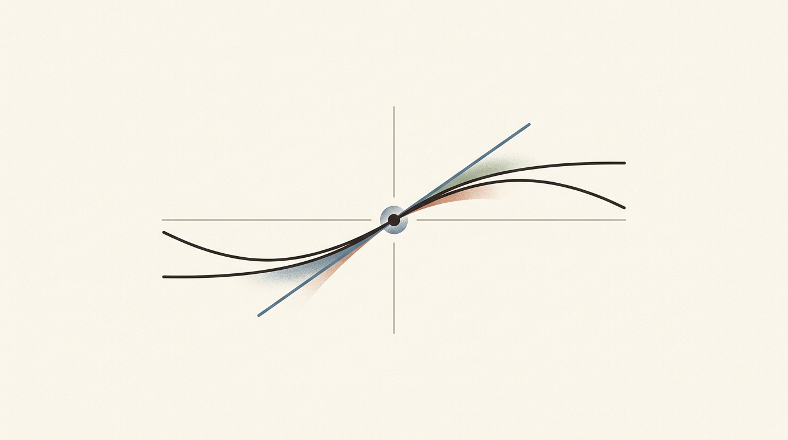
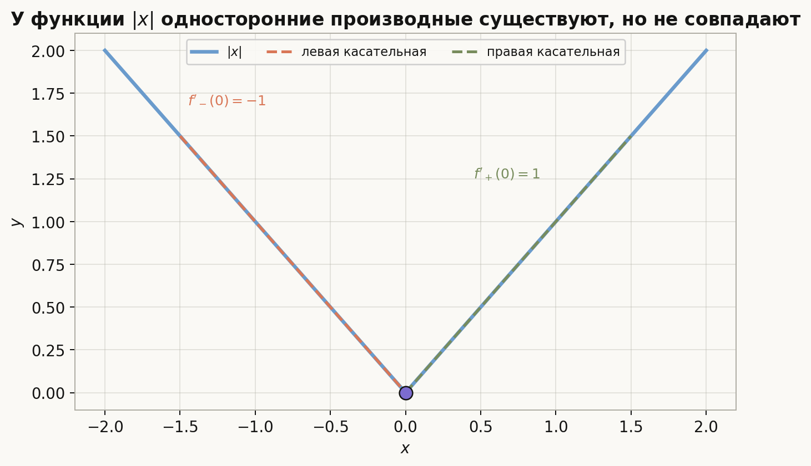
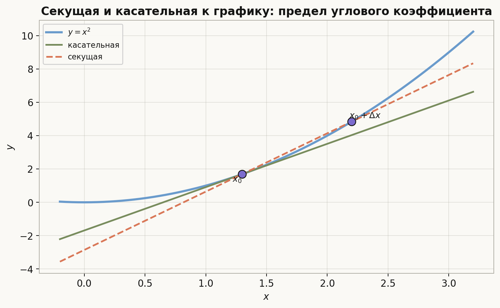
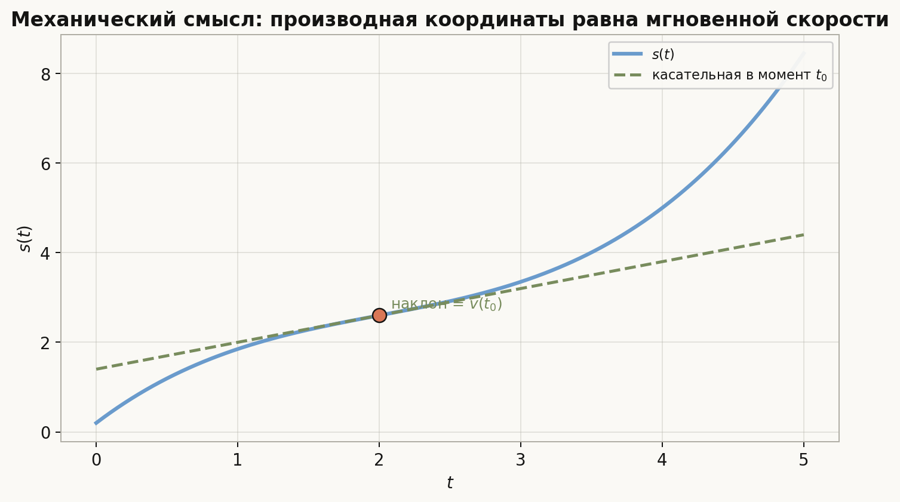
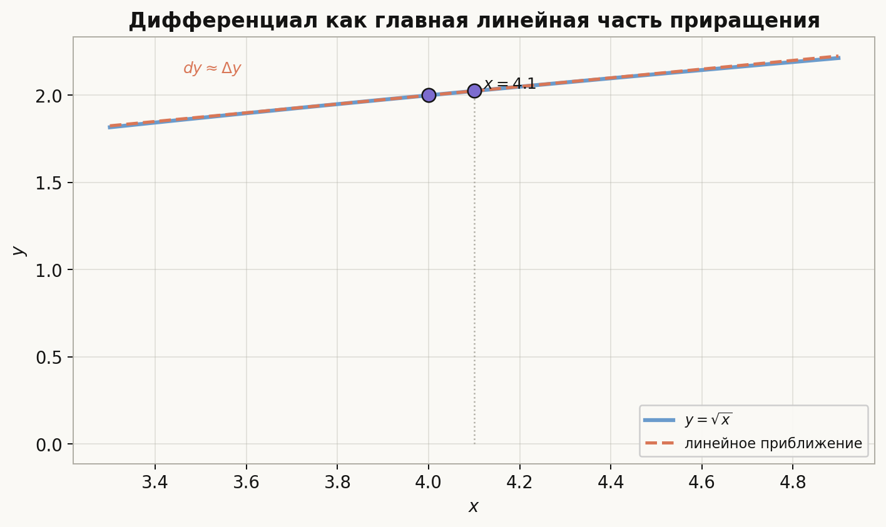
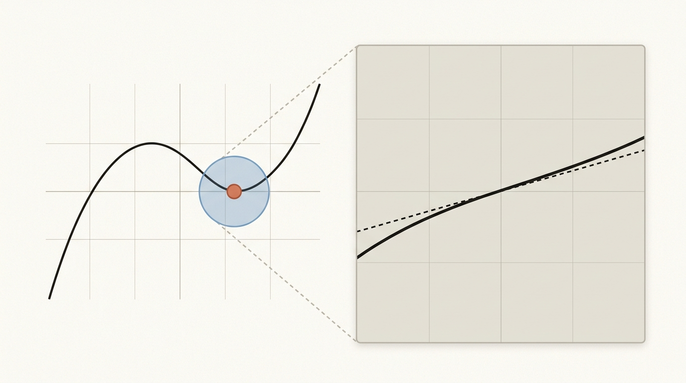

# Лекция: производная функции одной переменной

## План лекции

1. Интуиция производной  
2. Определение производной  
3. Односторонние производные  
4. Дифференцируемость и непрерывность  
5. Геометрический смысл производной  
6. Механический смысл производной  
7. Дифференциал  
8. Свойства производной  
9. Производные элементарных функций  
10. Производная сложной функции  
11. Производные высших порядков  
12. Типичные примеры и ошибки

---

## 1. Зачем нужна производная

Производная описывает скорость изменения функции. Если функция $y=f(x)$ меняется при изменении аргумента $x$, то производная в точке показывает:

- насколько быстро меняется значение функции;
- в какую сторону идет изменение;
- каков наклон касательной к графику;
- какова мгновенная скорость в задачах движения.

Именно поэтому производная является одним из центральных понятий анализа.

---

## 2. Приращение аргумента и функции

Пусть задана функция $y=f(x)$ и фиксирована точка $x_0$.

Если аргумент получает приращение $\Delta x$, то есть переходит из $x_0$ в $x_0+\Delta x$, то функция получает приращение

$$
\Delta y=f(x_0+\Delta x)-f(x_0).
$$

В анализе важно понять, как ведет себя отношение

$$
\frac{\Delta y}{\Delta x}=\frac{f(x_0+\Delta x)-f(x_0)}{\Delta x}
$$

при $\Delta x\to 0$.

Это и приводит к определению производной.

---

## 3. Определение производной

### 3.1. Определение

Функция $f$ называется **дифференцируемой** в точке $x_0$, если существует конечный предел

$$
f'(x_0)=\lim_{\Delta x\to 0}\frac{f(x_0+\Delta x)-f(x_0)}{\Delta x}.
$$

Этот предел называется **производной функции** в точке $x_0$.

Эквивалентная запись:

$$
f'(x_0)=\lim_{x\to x_0}\frac{f(x)-f(x_0)}{x-x_0}.
$$

### 3.2. Смысл

Производная есть предел средних скоростей изменения функции. Если этот предел существует, то можно говорить о мгновенной скорости изменения.

### 3.3. Обозначения

Используются обозначения:

$$
f'(x), \qquad y', \qquad \frac{dy}{dx}, \qquad Df(x).
$$

---

## 4. Пример вычисления по определению

Пусть $f(x)=x^2$. Найдем производную в точке $x$:

$$
f'(x)=\lim_{\Delta x\to 0}\frac{(x+\Delta x)^2-x^2}{\Delta x}.
$$

Раскрываем скобки:

$$
(x+\Delta x)^2-x^2=2x\Delta x+(\Delta x)^2.
$$

Тогда

$$
f'(x)=\lim_{\Delta x\to 0}\frac{2x\Delta x+(\Delta x)^2}{\Delta x}=\lim_{\Delta x\to 0}(2x+\Delta x)=2x.
$$

Значит,

$$
(x^2)'=2x.
$$

---

## 5. Односторонние производные

Иногда полезно рассматривать предел только с одной стороны.

### 5.1. Правая производная

Правая производная в точке $x_0$ определяется так:

$$
f'_+(x_0)=\lim_{\Delta x\to +0}\frac{f(x_0+\Delta x)-f(x_0)}{\Delta x}.
$$

### 5.2. Левая производная

Левая производная в точке $x_0$ определяется так:

$$
f'_-(x_0)=\lim_{\Delta x\to -0}\frac{f(x_0+\Delta x)-f(x_0)}{\Delta x}.
$$

### 5.3. Связь с обычной производной

Производная $f'(x_0)$ существует тогда и только тогда, когда существуют обе односторонние производные и они равны:

$$
f'_-(x_0)=f'_+(x_0).
$$

### 5.4. Пример

Для функции $f(x)=|x|$ в точке $0$ имеем:

$$
f'_+(0)=1, \qquad f'_-(0)=-1.
$$

Они не совпадают, значит производная в точке $0$ не существует.

Это хороший пример того, почему одной непрерывности недостаточно: график непрерывен, но в вершине нет единственной касательной.

---

## 6. Дифференцируемость и непрерывность

### 6.1. Важный факт

Если функция дифференцируема в точке $x_0$, то она непрерывна в этой точке.

### 6.2. Почему это верно

Из существования производной следует, что

$$
\frac{f(x_0+\Delta x)-f(x_0)}{\Delta x}\to f'(x_0).
$$

Значит,

$$
f(x_0+\Delta x)-f(x_0)=\Delta x\left(f'(x_0)+o(1)\right).
$$

Так как $\Delta x\to 0$, правая часть стремится к нулю. Следовательно,

$$
f(x_0+\Delta x)\to f(x_0),
$$

то есть функция непрерывна в точке $x_0$.

### 6.3. Обратное неверно

Непрерывность не влечет дифференцируемость.

Пример:

$$
f(x)=|x|
$$

непрерывна в нуле, но не дифференцируема в нуле.

---

## 7. Дифференцируемость в терминах линейного приближения

Существование производной эквивалентно представлению

$$
f(x_0+\Delta x)-f(x_0)=f'(x_0)\Delta x+o(\Delta x), \qquad \Delta x\to 0.
$$

Это означает: при малых $\Delta x$ приращение функции почти линейно, а главный линейный член равен $f'(x_0)\Delta x$.

Именно отсюда возникает понятие дифференциала.

---

## 8. Геометрический смысл производной

Пусть функция имеет график $y=f(x)$. Возьмем две точки графика:

- $(x_0,f(x_0))$;
- $(x_0+\Delta x,f(x_0+\Delta x))$.

Прямая, проходящая через них, называется секущей. Ее угловой коэффициент равен

$$
\frac{f(x_0+\Delta x)-f(x_0)}{\Delta x}.
$$

Если при $\Delta x\to 0$ секущая стремится к некоторому предельному положению, то получается касательная. Ее угловой коэффициент равен производной:

$$
k=f'(x_0).
$$

Следовательно:

- производная положительна, если касательная поднимается вправо;
- производная отрицательна, если касательная опускается вправо;
- производная равна нулю, если касательная горизонтальна.

Картинка полезна тем, что связывает формулу предела со знакомым геометрическим объектом: производная появляется как предел угловых коэффициентов секущих.

### Уравнение касательной

Если $f$ дифференцируема в точке $x_0$, то касательная к графику имеет уравнение

$$
y-f(x_0)=f'(x_0)(x-x_0).
$$

---

## 9. Механический смысл производной

Пусть материальная точка движется по прямой, и ее координата в момент времени $t$ равна $s(t)$.

Тогда средняя скорость на промежутке от $t$ до $t+\Delta t$ равна

$$
\frac{s(t+\Delta t)-s(t)}{\Delta t}.
$$

Если существует предел при $\Delta t\to 0$, то он называется мгновенной скоростью:

$$
v(t)=s'(t).
$$

Производная скорости называется ускорением:

$$
a(t)=v'(t)=s''(t).
$$

Таким образом:

- первая производная координаты есть скорость;
- вторая производная координаты есть ускорение.

Здесь удобно видеть, что механический смысл производной не отдельная тема, а тот же наклон касательной, только теперь график описывает движение во времени.

---

## 10. Дифференциал

Если функция дифференцируема в точке $x$, то ее **дифференциал** определяется формулой

$$
dy=f'(x)\,dx.
$$

Здесь $dx$ рассматривается как приращение аргумента, а $dy$ как главная линейная часть приращения функции.

При малых $dx$ имеем приближение

$$
\Delta y \approx dy=f'(x)\,dx.
$$

### Пример

Пусть $y=\sqrt{x}$. Тогда

$$
dy=\frac{1}{2\sqrt{x}}\,dx.
$$

При $x=4$ и $dx=0.1$ получаем

$$
dy\approx \frac{1}{4}\cdot 0.1=0.025.
$$

Отсюда

$$
\sqrt{4.1}\approx 2+0.025=2.025.
$$

Эта иллюстрация показывает, почему дифференциал удобен на практике: рядом с точкой график заменяется касательной, и вычисление сложной функции сводится к линейной поправке.

---

## 11. Свойства производной

Пусть функции $f$ и $g$ дифференцируемы в точке $x$.

### 11.1. Производная суммы

$$
(f+g)'=f'+g'.
$$

### 11.2. Производная разности

$$
(f-g)'=f'-g'.
$$

### 11.3. Производная произведения

$$
(fg)'=f'g+fg'.
$$

### 11.4. Производная частного

Если $g(x)\ne 0$, то

$$
\left(\frac{f}{g}\right)'=\frac{f'g-fg'}{g^2}.
$$

### 11.5. Производная произведения на константу

$$
(cf)'=cf'.
$$

---

## 12. Производная сложной функции

Если функция $u=g(x)$ дифференцируема в точке $x$, а функция $y=f(u)$ дифференцируема в точке $u=g(x)$, то сложная функция $f(g(x))$ дифференцируема, и

$$
(f(g(x)))'=f'(g(x))\cdot g'(x).
$$

Это правило называется **правилом цепочки**.

### Примеры

1. Если $f(x)=\sin(x^2)$, то

$$
f'(x)=\cos(x^2)\cdot 2x.
$$

2. Если $f(x)=\ln(1+x^2)$, то

$$
f'(x)=\frac{2x}{1+x^2}.
$$

---

## 13. Производные элементарных функций

Ниже основные формулы, которые нужно знать наизусть.

### 13.1. Степенная функция

Для натурального $n$:

$$
(x^n)'=nx^{n-1}.
$$

Более общо:

$$
(x^\alpha)'=\alpha x^{\alpha-1}
$$

там, где выражение определено.

### 13.2. Показательная функция

$$
(e^x)'=e^x.
$$

Для $a>0$, $a\ne 1$:

$$
(a^x)'=a^x\ln a.
$$

### 13.3. Логарифм

$$
(\ln x)'=\frac{1}{x}, \qquad x>0.
$$

Для $a>0$, $a\ne 1$:

$$
(\log_a x)'=\frac{1}{x\ln a}.
$$

### 13.4. Тригонометрические функции

$$
(\sin x)'=\cos x, \qquad (\cos x)'=-\sin x.
$$

$$
(\tan x)'=\frac{1}{\cos^2 x}, \qquad (\cot x)'=-\frac{1}{\sin^2 x}.
$$

### 13.5. Обратные тригонометрические функции

$$
(\arcsin x)'=\frac{1}{\sqrt{1-x^2}}, \qquad |x|<1.
$$

$$
(\arccos x)'=-\frac{1}{\sqrt{1-x^2}}, \qquad |x|<1.
$$

$$
(\arctan x)'=\frac{1}{1+x^2}.
$$

---

## 14. Производные высших порядков

Если производная $f'(x)$ сама дифференцируема, то ее производная называется второй производной:

$$
f''(x)=(f'(x))'.
$$

Аналогично определяются третья, четвертая и более высокие производные:

$$
f^{(n)}(x).
$$

### Примеры

1. Для $f(x)=x^3$:

$$
f'(x)=3x^2, \qquad f''(x)=6x, \qquad f'''(x)=6.
$$

2. Для $f(x)=e^x$:

$$
f^{(n)}(x)=e^x
$$

для любого $n$.

3. Для $f(x)=\sin x$:

$$
f'(x)=\cos x, \quad f''(x)=-\sin x, \quad f'''(x)=-\cos x, \quad f^{(4)}(x)=\sin x.
$$

Производные идут по циклу длины $4$.

---

## 15. Типичные примеры

### Пример 1

Найти производную:

$$
f(x)=x^3-2x+5.
$$

Тогда

$$
f'(x)=3x^2-2.
$$

### Пример 2

Найти производную:

$$
f(x)=\frac{x^2+1}{x}.
$$

Можно упростить:

$$
f(x)=x+\frac{1}{x}.
$$

Тогда

$$
f'(x)=1-\frac{1}{x^2}.
$$

### Пример 3

Найти производную:

$$
f(x)=\sin(3x).
$$

По правилу цепочки:

$$
f'(x)=3\cos(3x).
$$

### Пример 4

Найти вторую производную:

$$
f(x)=x^2e^x.
$$

Сначала

$$
f'(x)=2xe^x+x^2e^x=e^x(x^2+2x).
$$

Еще раз дифференцируем:

$$
f''(x)=e^x(x^2+2x)+e^x(2x+2)=e^x(x^2+4x+2).
$$

---

## 16. Типичные ошибки

### 16.1. Путать непрерывность и дифференцируемость

Из дифференцируемости следует непрерывность, но не наоборот.

### 16.2. Забывать правило цепочки

Например,

$$
(\sin(x^2))'\ne \cos(x^2),
$$

а

$$
(\sin(x^2))'=2x\cos(x^2).
$$

### 16.3. Ошибаться в производной частного

Нельзя писать

$$
\left(\frac{f}{g}\right)'=\frac{f'}{g'}.
$$

Правильная формула:

$$
\left(\frac{f}{g}\right)'=\frac{f'g-fg'}{g^2}.
$$

### 16.4. Игнорировать область определения

Например, формула

$$
(\ln x)'=\frac{1}{x}
$$

верна только при $x>0$.

---

## 17. Что особенно важно для поступления в ШАД

На вступительных задачах по этой теме обычно нужно уметь:

- вычислять производную по определению хотя бы в простых случаях;
- работать с односторонними производными;
- доказывать, что дифференцируемость влечет непрерывность;
- уверенно применять правила суммы, произведения, частного и композиции;
- находить касательную;
- использовать дифференциал для приближенных вычислений;
- считать высшие производные;
- аккуратно исследовать дифференцируемость в особых точках.

Особенно ценится не механическое знание формул, а понимание того, откуда они берутся и когда применимы.

---

## 18. Краткие итоги

<strong>Главное, что нужно запомнить</strong>

- Производная определяется формулой

$$
f'(x_0)=\lim_{\Delta x\to 0}\frac{f(x_0+\Delta x)-f(x_0)}{\Delta x}.
$$

- Если функция дифференцируема в точке, то она непрерывна в этой точке.

- Геометрически производная — это угловой коэффициент касательной.

- Механически производная координаты по времени — это скорость.

- Дифференциал есть главная линейная часть приращения:

$$
dy=f'(x)\,dx.
$$

- Основные правила:

$$
(f+g)'=f'+g', \quad (fg)'=f'g+fg', \quad \left(\frac{f}{g}\right)'=\frac{f'g-fg'}{g^2}.
$$

- Для сложной функции:

$$
(f(g(x)))'=f'(g(x))g'(x).
$$

- Нужно знать производные основных элементарных функций и уметь считать высшие производные.

---

## 19. Заключение

Производная — это инструмент, который позволяет переходить от статического описания функции к анализу ее локального поведения. Через производную мы понимаем наклон графика, скорость изменения, приближенное изменение функции и структуру более сложных выражений.

Для сильного владения темой важно уметь одновременно:

- строго пользоваться определением;
- быстро вычислять производные;
- видеть смысл результата;
- аккуратно работать с точками, где производная может не существовать.

