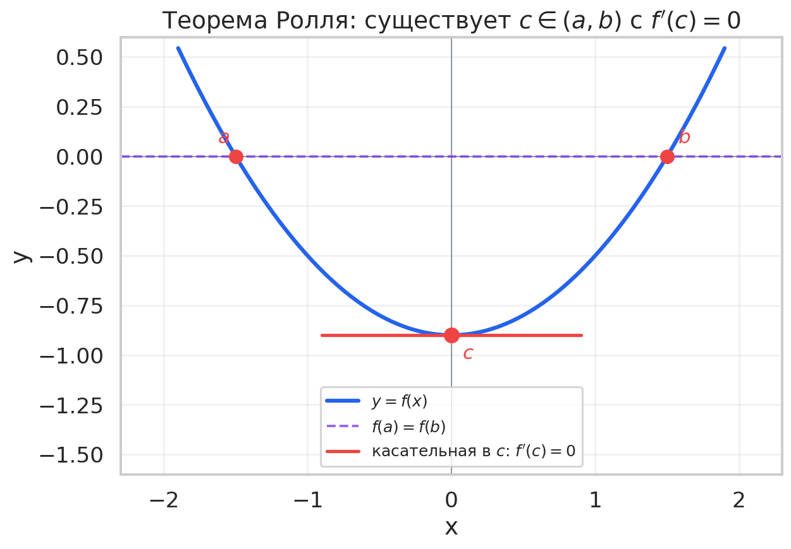
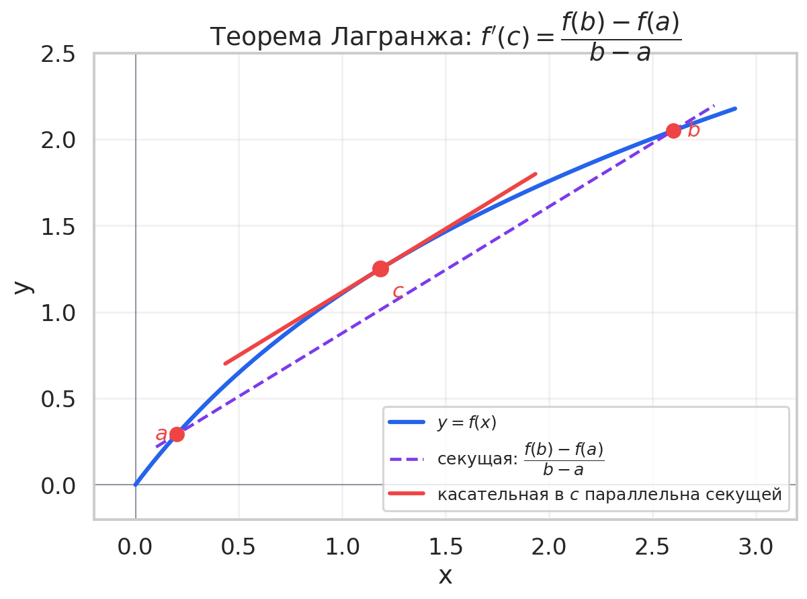
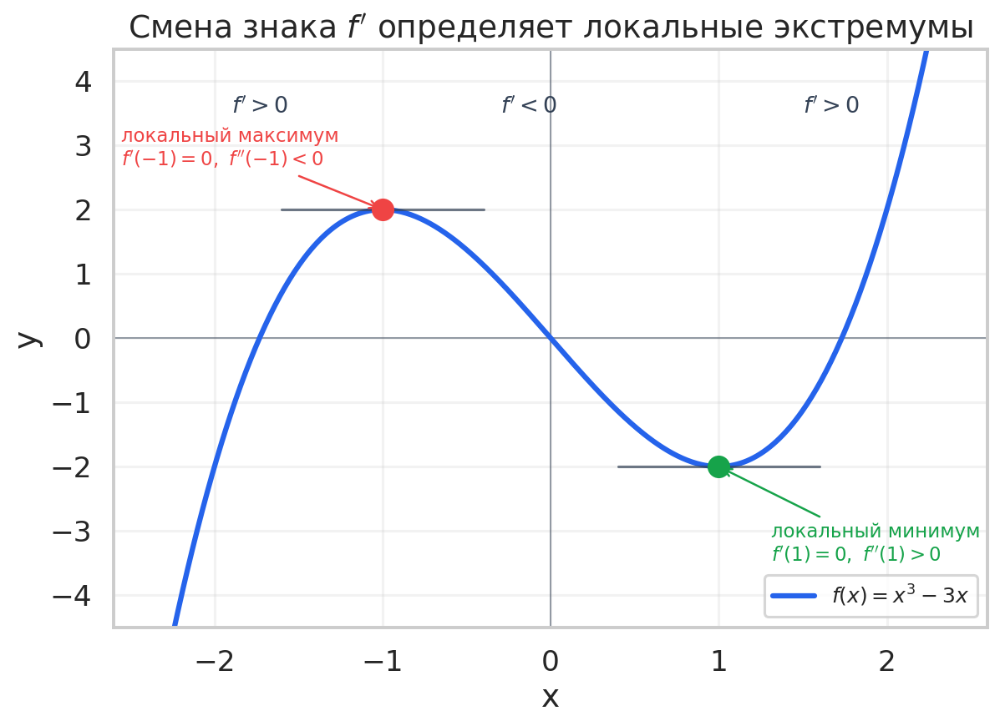
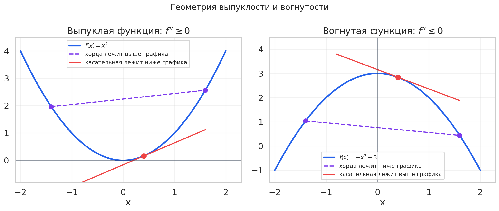
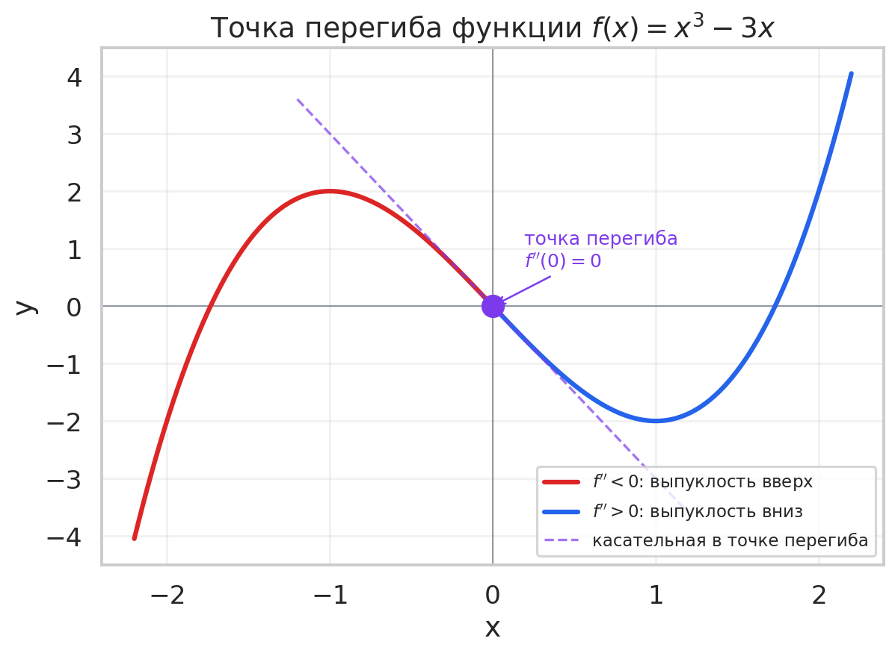
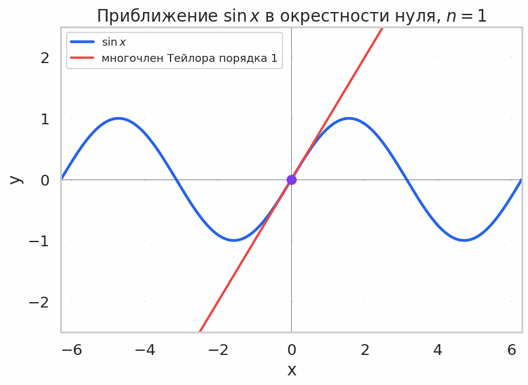
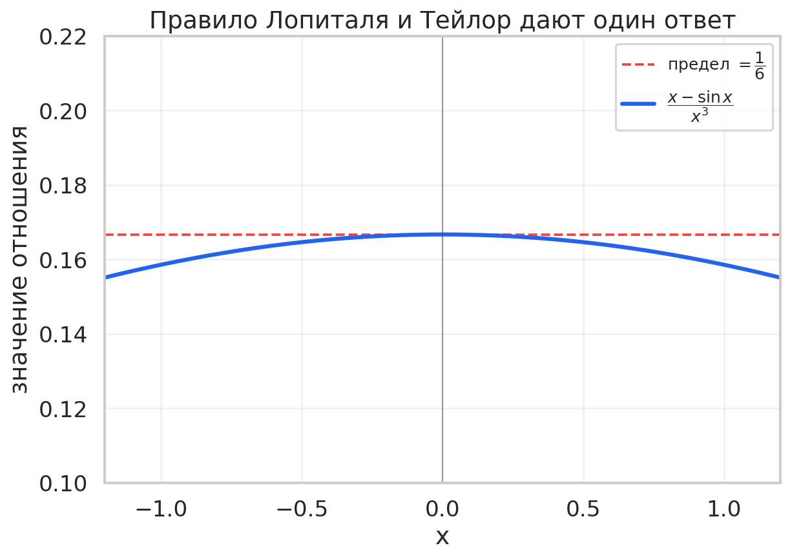

# Лекция: теоремы о среднем, исследование функций, формула Тейлора и правило Лопиталя

## План лекции

1. Зачем нужна тема  
2. Теорема Ферма о внутреннем экстремуме  
3. Теорема Ролля  
4. Теорема Лагранжа  
5. Теорема Коши  
6. Монотонность и производная  
7. Локальные экстремумы и их признаки  
8. Выпуклость и вогнутость  
9. Точки перегиба  
10. Схема исследования функции  
11. Формула Тейлора  
12. Правило Лопиталя  
13. Типичные примеры  
14. Типичные ошибки  
15. Что важно для поступления в ШАД  
16. Итоги

---

## 1. Зачем нужна эта тема

Производная сама по себе даёт локальную информацию о функции: наклон касательной, скорость изменения, главный линейный член приращения. Но на практике нужно уметь переходить от локального к глобальному:

- доказывать неравенства и оценки;
- описывать монотонность функции на промежутке;
- находить локальные и глобальные экстремумы;
- различать выпуклость и вогнутость;
- строить качественный эскиз графика;
- вычислять «неопределённые» пределы;
- получать полиномиальные приближения функций в окрестности точки.

Все эти задачи опираются на три классические теоремы о среднем (Ролля, Лагранжа, Коши), на формулу Тейлора и на правило Лопиталя. Именно этому и посвящена лекция.

---

## 2. Теорема Ферма о внутреннем экстремуме

Это базовый факт, на который опирается дальше всё остальное.

### 2.1. Формулировка

Пусть функция $f$ определена в окрестности точки $x_0$, имеет в точке $x_0$ локальный экстремум и дифференцируема в этой точке. Тогда

$$
f'(x_0)=0.
$$

### 2.2. Почему это верно

Пусть $x_0$ — точка локального максимума. Тогда в малой окрестности $f(x)\le f(x_0)$. Значит, при $h>0$ (и достаточно малом) имеем

$$
\frac{f(x_0+h)-f(x_0)}{h}\le 0,
$$

и в пределе $f'_+(x_0)\le 0$. При $h<0$ знаменатель отрицателен, а числитель не положителен, то есть

$$
\frac{f(x_0+h)-f(x_0)}{h}\ge 0,
$$

и $f'_-(x_0)\ge 0$. Так как функция дифференцируема, обе односторонние производные равны $f'(x_0)$. Следовательно, $f'(x_0)=0$.

### 2.3. Важные оговорки

- Теорема говорит только о внутренних точках: на концах отрезка производная в точке экстремума может быть ненулевой.
- Обратное неверно: из $f'(x_0)=0$ не следует, что $x_0$ — экстремум (пример — функция $f(x)=x^3$ в нуле).

Точки, где $f'(x_0)=0$ или производная не существует, называют **критическими** (стационарные — это подкласс, где именно $f'(x_0)=0$).

---

## 3. Теорема Ролля

### 3.1. Формулировка

Пусть функция $f$:

- непрерывна на отрезке $[a,b]$;
- дифференцируема на интервале $(a,b)$;
- принимает равные значения на концах: $f(a)=f(b)$.

Тогда найдётся точка $c\in(a,b)$ такая, что

$$
f'(c)=0.
$$

### 3.2. Идея доказательства

По теореме Вейерштрасса непрерывная на отрезке функция достигает своего минимума и максимума. Возможны два случая.

1. Максимум и минимум достигаются только на концах отрезка. Тогда $f$ постоянна, и $f'(x)=0$ в любой точке $(a,b)$.
2. Хотя бы один экстремум достигается во внутренней точке $c\in(a,b)$. Тогда по теореме Ферма $f'(c)=0$.

### 3.3. Важные оговорки

Все три условия существенны:

- если $f$ не непрерывна на отрезке, утверждение может нарушаться;
- если $f$ не дифференцируема хотя бы в одной внутренней точке, всё ломается (например, $f(x)=|x|$ на $[-1,1]$);
- если $f(a)\ne f(b)$, теорема неприменима в исходной форме — но именно эта ситуация обобщается теоремой Лагранжа.

---

## 4. Теорема Лагранжа о конечных приращениях

### 4.1. Формулировка

Пусть $f$ непрерывна на $[a,b]$ и дифференцируема на $(a,b)$. Тогда найдётся точка $c\in(a,b)$ такая, что

$$
f(b)-f(a)=f'(c)(b-a).
$$

Эквивалентно:

$$
\frac{f(b)-f(a)}{b-a}=f'(c).
$$

### 4.2. Геометрический смысл

Левая часть — угловой коэффициент секущей, соединяющей точки $(a,f(a))$ и $(b,f(b))$. Теорема утверждает, что хотя бы в одной точке $c$ внутри отрезка касательная параллельна этой секущей.

### 4.3. Доказательство

Рассмотрим вспомогательную функцию

$$
g(x)=f(x)-\frac{f(b)-f(a)}{b-a}(x-a).
$$

Она непрерывна на $[a,b]$ и дифференцируема на $(a,b)$. Прямое вычисление показывает, что $g(a)=f(a)$ и $g(b)=f(a)$, то есть $g(a)=g(b)$. Применяем теорему Ролля: найдётся $c\in(a,b)$, в которой $g'(c)=0$, а это и даёт

$$
f'(c)=\frac{f(b)-f(a)}{b-a}.
$$

### 4.4. Следствия

Теорема Лагранжа — основной инструмент для доказательства неравенств и оценок. Типичные следствия:

- если $f'(x)\ge 0$ на интервале, то $f$ не убывает;
- если $f'(x)\le 0$ на интервале, то $f$ не возрастает;
- если $f'(x)=0$ всюду на интервале, то $f$ постоянна;
- если $|f'(x)|\le M$, то $|f(x)-f(y)|\le M|x-y|$ (липшицевость).

---

## 5. Теорема Коши

### 5.1. Формулировка

Пусть функции $f$ и $g$ непрерывны на $[a,b]$ и дифференцируемы на $(a,b)$, и пусть $g'(x)\ne 0$ на $(a,b)$. Тогда существует точка $c\in(a,b)$ такая, что

$$
\frac{f(b)-f(a)}{g(b)-g(a)}=\frac{f'(c)}{g'(c)}.
$$

### 5.2. Когда она нужна

Это обобщение теоремы Лагранжа (при $g(x)=x$ получается именно Лагранж). Настоящая сила теоремы Коши проявляется там, где нужно сравнить приращения двух функций — в частности, именно она лежит в основе правила Лопиталя.

### 5.3. Схема доказательства

Рассмотрим вспомогательную функцию

$$
\varphi(x)=f(x)-\frac{f(b)-f(a)}{g(b)-g(a)}\bigl(g(x)-g(a)\bigr).
$$

Она непрерывна на $[a,b]$, дифференцируема на $(a,b)$ и удовлетворяет $\varphi(a)=\varphi(b)=f(a)$. По теореме Ролля найдётся $c\in(a,b)$, в которой $\varphi'(c)=0$. Раскрывая, получаем нужное равенство.

---

## 6. Монотонность и производная

Из теоремы Лагранжа напрямую получается связь знака производной и монотонности.

### 6.1. Критерий монотонности

Пусть $f$ дифференцируема на интервале $I$. Тогда:

- если $f'(x)>0$ всюду на $I$, то $f$ строго возрастает на $I$;
- если $f'(x)<0$ всюду на $I$, то $f$ строго убывает на $I$;
- если $f'(x)\ge 0$ на $I$, то $f$ не убывает на $I$;
- если $f'(x)\le 0$ на $I$, то $f$ не возрастает на $I$.

### 6.2. Тонкость

Строгое неравенство $f'(x)>0$ гарантирует строгую монотонность, но обратное неверно: функция $f(x)=x^3$ строго возрастает на $\mathbb{R}$, хотя $f'(0)=0$. Для строгой монотонности достаточно, чтобы $f'(x)\ge 0$ и множество $\{x:f'(x)=0\}$ не содержало интервала.

---

## 7. Локальные экстремумы

### 7.1. Определение

Точка $x_0$ называется **точкой локального максимума**, если в некоторой её окрестности выполняется $f(x)\le f(x_0)$. Аналогично — локальный минимум.

Если неравенство строгое для $x\ne x_0$, экстремум называют строгим.

### 7.2. Необходимое условие

По теореме Ферма: если $x_0$ — внутренняя точка экстремума и $f$ дифференцируема в $x_0$, то $f'(x_0)=0$.

Поэтому экстремумы дифференцируемой функции нужно искать среди её стационарных точек, а в общем случае — среди критических точек.

### 7.3. Первый достаточный признак (через смену знака $f'$)

Пусть $f$ непрерывна в $x_0$ и дифференцируема в проколотой окрестности $x_0$. Тогда:

- если $f'(x)>0$ слева от $x_0$ и $f'(x)<0$ справа, то $x_0$ — точка локального максимума;
- если $f'(x)<0$ слева и $f'(x)>0$ справа, то $x_0$ — точка локального минимума;
- если $f'$ не меняет знак, то экстремума нет.

### 7.4. Второй достаточный признак (через $f''$)

Пусть $f$ дважды дифференцируема в окрестности $x_0$, $f'(x_0)=0$ и $f''(x_0)\ne 0$. Тогда:

- если $f''(x_0)>0$, то $x_0$ — локальный минимум;
- если $f''(x_0)<0$, то $x_0$ — локальный максимум.

Если же $f''(x_0)=0$, этот признак молчит: надо смотреть дальше (например, на высшие производные или на знак $f'$).

### 7.5. Пример

Найдём экстремумы функции $f(x)=x^3-3x$.

Производная: $f'(x)=3x^2-3=3(x-1)(x+1)$. Стационарные точки: $x=-1$ и $x=1$.

Вторая производная: $f''(x)=6x$. В точке $x=-1$ имеем $f''(-1)=-6<0$ — локальный максимум; в точке $x=1$ имеем $f''(1)=6>0$ — локальный минимум.

Значения: $f(-1)=2$, $f(1)=-2$.

---

## 8. Выпуклость и вогнутость

### 8.1. Определение

Функция $f$ называется **выпуклой вниз** (или просто выпуклой) на интервале $I$, если для любых $x_1,x_2\in I$ и $t\in[0,1]$ выполнено

$$
f\bigl(tx_1+(1-t)x_2\bigr)\le tf(x_1)+(1-t)f(x_2).
$$

Геометрически это означает, что график лежит ниже любой своей хорды. Для строгой выпуклости неравенство должно быть строгим при $t\in(0,1)$ и $x_1\ne x_2$.

Функция называется **выпуклой вверх** (вогнутой), если противоположное неравенство $f(tx_1+(1-t)x_2)\ge tf(x_1)+(1-t)f(x_2)$ выполнено.

### 8.2. Критерий выпуклости через вторую производную

Пусть $f$ дважды дифференцируема на интервале $I$. Тогда:

- $f$ выпукла на $I$ тогда и только тогда, когда $f''(x)\ge 0$ всюду на $I$;
- $f$ вогнута на $I$ тогда и только тогда, когда $f''(x)\le 0$ всюду на $I$.

Если $f''(x)>0$ во всех точках, то $f$ строго выпукла.

### 8.3. Критерий через первую производную

Эквивалентно: $f$ выпукла на $I$ тогда и только тогда, когда её производная $f'$ не убывает на $I$.

### 8.4. Касательная как опорная прямая

Для дифференцируемой выпуклой функции график лежит не ниже любой касательной:

$$
f(x)\ge f(x_0)+f'(x_0)(x-x_0).
$$

Это наблюдение лежит в основе многих классических неравенств (например, неравенство Йенсена).

---

## 9. Точки перегиба

### 9.1. Определение

Точка $x_0$ называется **точкой перегиба** функции $f$, если функция непрерывна в $x_0$ и при переходе через эту точку направление выпуклости меняется (с выпуклости вниз на выпуклость вверх или наоборот).

### 9.2. Необходимое условие

Если $f$ дважды дифференцируема в окрестности $x_0$ и $x_0$ — точка перегиба, то

$$
f''(x_0)=0.
$$

Обратное снова неверно: например, для $f(x)=x^4$ имеем $f''(0)=0$, но $x=0$ не точка перегиба.

### 9.3. Достаточное условие

Если $f''$ меняет знак при переходе через точку $x_0$, то $x_0$ — точка перегиба.

### 9.4. Пример

Для $f(x)=x^3$ имеем $f''(x)=6x$. При $x<0$ это отрицательно, при $x>0$ положительно. Значит, $x=0$ — точка перегиба: слева функция выпукла вверх, справа — выпукла вниз.

---

## 10. Схема исследования функции

Стандартная схема, которая часто появляется на вступительных задачах:

1. Найти область определения функции.
2. Проверить чётность, нечётность, периодичность.
3. Найти пределы на границах области определения и асимптоты.
4. Найти $f'(x)$, определить стационарные и критические точки.
5. Разбить область на интервалы знакопостоянства $f'$, определить монотонность и локальные экстремумы.
6. Найти $f''(x)$, определить интервалы выпуклости и точки перегиба.
7. Составить таблицу поведения и построить эскиз графика.

Этой схемы достаточно почти для любой функции, с которой можно встретиться на экзамене.

---

## 11. Формула Тейлора

### 11.1. Многочлен Тейлора

Пусть функция $f$ имеет в точке $x_0$ производные до порядка $n$ включительно. **Многочленом Тейлора** порядка $n$ называется

$$
T_n(x)=\sum_{k=0}^{n}\frac{f^{(k)}(x_0)}{k!}(x-x_0)^k.
$$

Его главное свойство: в точке $x_0$ совпадают значения $T_n$ и $f$, а также все производные до порядка $n$.

### 11.2. Формула Тейлора с остаточным членом Пеано

Если $f$ имеет в точке $x_0$ производные до порядка $n$, то

$$
f(x)=T_n(x)+o\bigl((x-x_0)^n\bigr), \qquad x\to x_0.
$$

Это локальное утверждение: оно описывает поведение $f$ в окрестности $x_0$.

### 11.3. Формула Тейлора с остаточным членом Лагранжа

Если $f$ имеет непрерывные производные до порядка $n+1$ в окрестности $x_0$, то для любого $x$ из этой окрестности найдётся точка $\xi$ между $x_0$ и $x$ такая, что

$$
f(x)=T_n(x)+\frac{f^{(n+1)}(\xi)}{(n+1)!}(x-x_0)^{n+1}.
$$

Это более сильное глобальное утверждение, позволяющее оценивать ошибку приближения.

### 11.4. Стандартные разложения в точке $x_0=0$

Это так называемая **формула Маклорена**. Её полезно знать наизусть:

$$
e^x=1+x+\frac{x^2}{2!}+\frac{x^3}{3!}+\dots+\frac{x^n}{n!}+o(x^n).
$$

$$
\sin x=x-\frac{x^3}{3!}+\frac{x^5}{5!}-\dots+o(x^{2n+1}).
$$

$$
\cos x=1-\frac{x^2}{2!}+\frac{x^4}{4!}-\dots+o(x^{2n}).
$$

$$
\ln(1+x)=x-\frac{x^2}{2}+\frac{x^3}{3}-\dots+(-1)^{n-1}\frac{x^n}{n}+o(x^n).
$$

$$
(1+x)^\alpha=1+\alpha x+\frac{\alpha(\alpha-1)}{2!}x^2+\dots+o(x^n).
$$

$$
\frac{1}{1-x}=1+x+x^2+\dots+x^n+o(x^n).
$$

### 11.5. Зачем это нужно

Формула Тейлора — это способ локально заменить сложную функцию многочленом. Она используется в задачах на:

- вычисление пределов (альтернатива Лопиталю);
- оценку погрешности;
- доказательство неравенств;
- разложения составных функций;
- аналитические оценки в теории алгоритмов и численных методах.

На анимации видно ключевое свойство формулы: чем выше порядок, тем шире интервал, на котором многочлен хорошо приближает функцию. Но даже многочлен высокого порядка остаётся лишь локальным приближением — вдали от нуля ошибка всё равно растёт.

### 11.6. Пример вычисления предела через разложение

Найдём

$$
\lim_{x\to 0}\frac{\sin x-x}{x^3}.
$$

Используем разложение $\sin x=x-\dfrac{x^3}{6}+o(x^3)$. Тогда

$$
\sin x-x=-\frac{x^3}{6}+o(x^3),
$$

и

$$
\frac{\sin x-x}{x^3}=-\frac{1}{6}+o(1)\to -\frac{1}{6}.
$$

---

## 12. Правило Лопиталя

### 12.1. Формулировка (случай $\tfrac{0}{0}$)

Пусть функции $f$ и $g$ дифференцируемы в проколотой окрестности точки $a$, $g'(x)\ne 0$ в этой окрестности, и

$$
\lim_{x\to a}f(x)=\lim_{x\to a}g(x)=0.
$$

Если существует (конечный или бесконечный) предел

$$
\lim_{x\to a}\frac{f'(x)}{g'(x)},
$$

то существует и

$$
\lim_{x\to a}\frac{f(x)}{g(x)}=\lim_{x\to a}\frac{f'(x)}{g'(x)}.
$$

### 12.2. Формулировка (случай $\tfrac{\infty}{\infty}$)

Аналогичное утверждение верно, если

$$
\lim_{x\to a}|g(x)|=\infty,
$$

без требования поведения $f$ в нуле. Доказательство технически сложнее, но пользоваться можно по той же схеме.

### 12.3. Откуда берётся правило

В случае $\tfrac{0}{0}$ можно доопределить $f(a)=g(a)=0$. Применяя теорему Коши к отрезку $[a,x]$, получим

$$
\frac{f(x)}{g(x)}=\frac{f(x)-f(a)}{g(x)-g(a)}=\frac{f'(\xi)}{g'(\xi)}
$$

для некоторой точки $\xi$ между $a$ и $x$. При $x\to a$ точка $\xi$ также стремится к $a$, откуда и следует равенство пределов.

### 12.4. Что важно помнить

Правило Лопиталя применимо только при действительно неопределённых формах $\tfrac{0}{0}$ или $\tfrac{\infty}{\infty}$. Неопределённости вида $0\cdot\infty$, $\infty-\infty$, $0^0$, $1^\infty$, $\infty^0$ нужно сначала привести к одной из этих двух форм — алгебраически или через логарифмирование.

### 12.5. Пример

Найдём

$$
\lim_{x\to 0}\frac{e^x-1-x}{x^2}.
$$

Это неопределённость $\tfrac{0}{0}$. По Лопиталю:

$$
\lim_{x\to 0}\frac{e^x-1}{2x}.
$$

Снова $\tfrac{0}{0}$. Ещё раз:

$$
\lim_{x\to 0}\frac{e^x}{2}=\frac{1}{2}.
$$

Тот же результат получается через разложение $e^x=1+x+\dfrac{x^2}{2}+o(x^2)$.

---

## 13. Типичные примеры

### 13.1. Доказательство неравенства через теорему Лагранжа

Покажем, что при $0<a<b$ выполнено

$$
\frac{b-a}{b}<\ln\frac{b}{a}<\frac{b-a}{a}.
$$

Рассмотрим функцию $f(x)=\ln x$ на $[a,b]$. По теореме Лагранжа найдётся $c\in(a,b)$ такое, что

$$
\ln b-\ln a=\frac{1}{c}(b-a).
$$

Так как $a<c<b$, то $\dfrac{1}{b}<\dfrac{1}{c}<\dfrac{1}{a}$, откуда и следует требуемое неравенство.

### 13.2. Нахождение экстремумов и точек перегиба

Исследуем функцию $f(x)=x^4-4x^3$.

Производная: $f'(x)=4x^3-12x^2=4x^2(x-3)$. Стационарные точки: $x=0$ (кратная) и $x=3$.

В точке $x=3$ производная меняет знак с минуса на плюс — локальный минимум, $f(3)=-27$.
В точке $x=0$ знака $f'$ не меняет (остаётся неположительным по обе стороны), так что экстремума нет.

Вторая производная: $f''(x)=12x^2-24x=12x(x-2)$. Меняет знак в точках $0$ и $2$, так что это две точки перегиба.

### 13.3. Вычисление предела через Тейлор

Найдём

$$
\lim_{x\to 0}\frac{\ln(1+x)-x}{x^2}.
$$

Разложение: $\ln(1+x)=x-\dfrac{x^2}{2}+o(x^2)$. Тогда

$$
\ln(1+x)-x=-\frac{x^2}{2}+o(x^2),
$$

и предел равен $-\dfrac{1}{2}$.

---

## 14. Типичные ошибки

### 14.1. Забывать проверить условия теоремы Ролля

Если функция не дифференцируема во внутренней точке (например, $f(x)=|x|$), теорема не применима: нельзя утверждать существование точки $c$ с нулевой производной.

### 14.2. Считать, что $f'(x_0)=0$ — уже экстремум

Классический пример: $f(x)=x^3$. В нуле производная равна нулю, но экстремума нет. Обязательно нужен дополнительный признак — смена знака $f'$, знак $f''$ или анализ высших производных.

### 14.3. Применять Лопиталь там, где нет неопределённости

Выражение вида $\lim_{x\to 0}\dfrac{\sin x}{x+1}$ сразу равно $0$, применять Лопиталь бессмысленно и может дать неверный ответ.

### 14.4. Применять Лопиталь, когда предел $\dfrac{f'}{g'}$ не существует

Существование предела $\tfrac{f}{g}$ не гарантирует существования предела $\tfrac{f'}{g'}$. Классический контрпример:

$$
\lim_{x\to\infty}\frac{x+\sin x}{x}=1,
$$

а предел $\dfrac{1+\cos x}{1}$ вообще не существует. Правило Лопиталя тут просто не даёт ответа.

### 14.5. Путать точки перегиба и экстремумы

В точке перегиба меняется направление выпуклости, но значение функции никак не обязано быть локальным экстремумом.

### 14.6. Обрывать разложение Тейлора слишком рано

Если в пределе нужно «поймать» член порядка $x^3$, то все компоненты нужно раскладывать хотя бы до $x^3$, иначе ошибки в главном члене превратятся в неверный ответ.

---

## 15. Что особенно важно для поступления в ШАД

На вступительных задачах по этой теме обычно нужно уметь:

- формулировать и проверять условия теорем Ролля, Лагранжа и Коши;
- использовать теорему Лагранжа для доказательства неравенств и оценок;
- исследовать монотонность через знак производной;
- находить локальные экстремумы обоими достаточными признаками;
- отличать точки перегиба от экстремумов;
- строить эскиз графика по стандартной схеме;
- пользоваться стандартными разложениями Тейлора и выбирать достаточный порядок;
- применять правило Лопиталя и понимать его границы;
- сравнивать подход «через Лопиталя» с подходом «через Тейлор» — второй обычно надёжнее.

Особенно ценится не формальное применение инструментов, а понимание того, когда какой инструмент уместен.

---

## 16. Итоги

<strong>Главное, что нужно запомнить</strong>

- Теорема Ферма: во внутренней точке экстремума дифференцируемой функции $f'(x_0)=0$.

- Теорема Ролля: при $f(a)=f(b)$ найдётся $c\in(a,b)$ с $f'(c)=0$.

- Теорема Лагранжа:

$$
f(b)-f(a)=f'(c)(b-a).
$$

- Теорема Коши:

$$
\frac{f(b)-f(a)}{g(b)-g(a)}=\frac{f'(c)}{g'(c)}.
$$

- Знак $f'$ определяет монотонность, знак $f''$ — выпуклость.

- Критические точки — кандидаты на экстремум, точки $f''=0$ — кандидаты на перегиб. Оба факта требуют проверки достаточного признака.

- Формула Тейлора:

$$
f(x)=\sum_{k=0}^{n}\frac{f^{(k)}(x_0)}{k!}(x-x_0)^k+R_n(x),
$$

где остаток можно записать в форме Пеано или Лагранжа.

- Правило Лопиталя: для неопределённостей $\tfrac{0}{0}$ и $\tfrac{\infty}{\infty}$

$$
\lim\frac{f(x)}{g(x)}=\lim\frac{f'(x)}{g'(x)},
$$

если правый предел существует.

---

## 17. Заключение

Эта тема связывает три крупных инструмента анализа: теоремы о среднем, формулу Тейлора и правило Лопиталя. Вместе они дают универсальный аппарат для работы с функциями — от доказательства неравенств до вычисления пределов и построения графиков.

Сильное владение темой предполагает умение не просто применять формулы, а понимать, когда они работают и чем одна техника отличается от другой. Особенно полезно уметь переключаться между разложением Тейлора и правилом Лопиталя: обычно одно из этих средств даёт более короткое и надёжное решение, чем другое.
