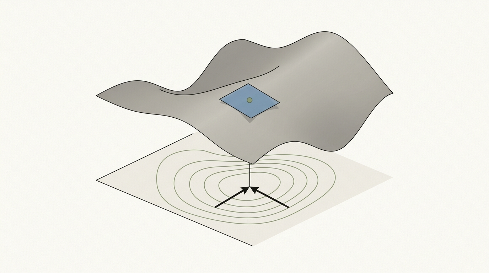
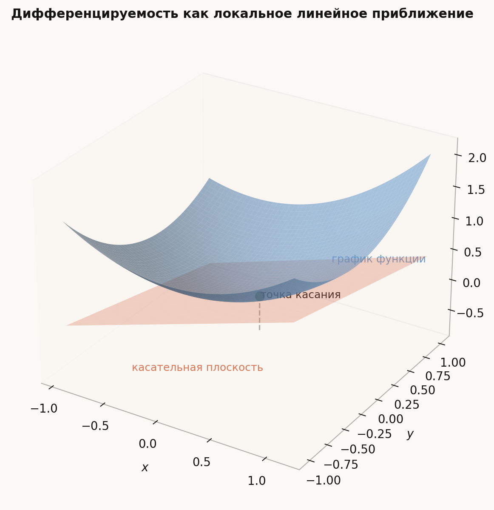
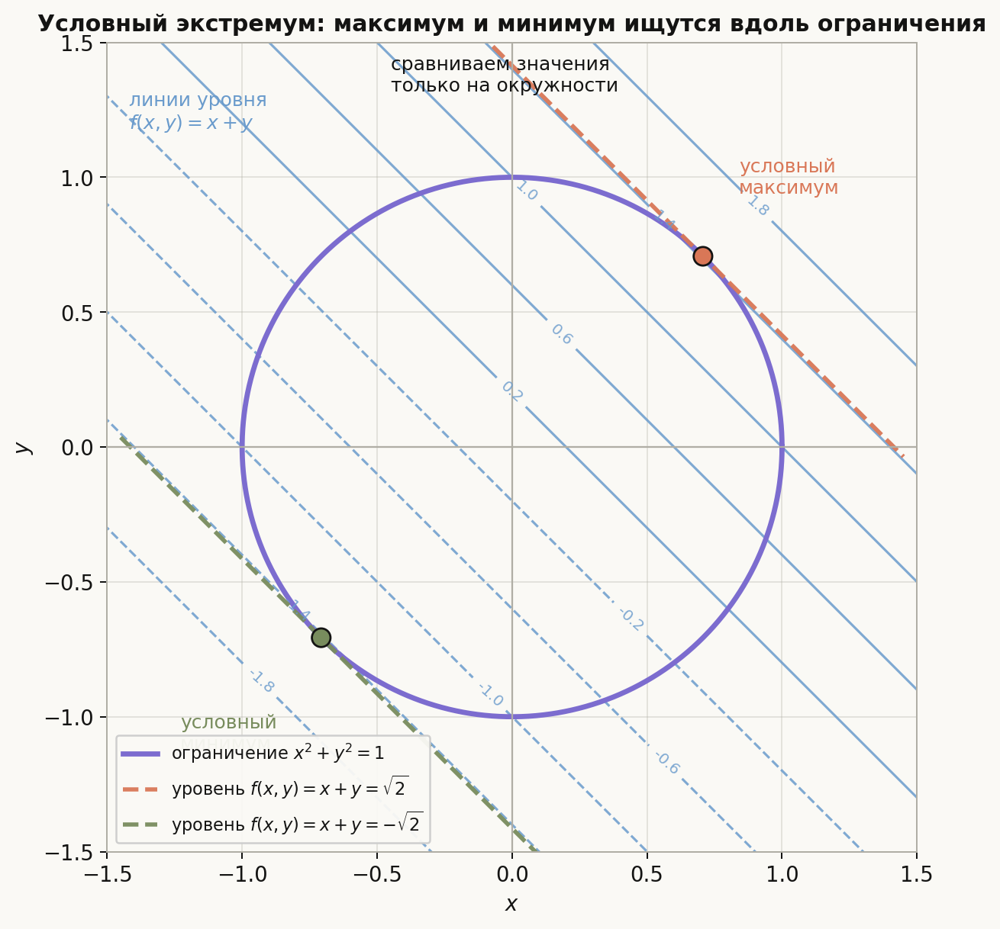
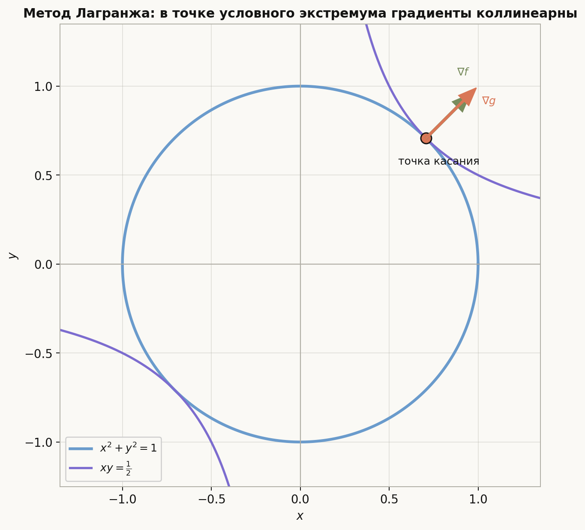
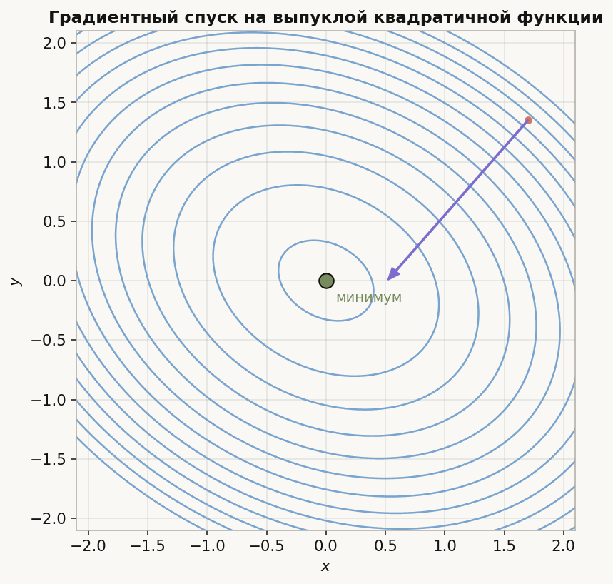
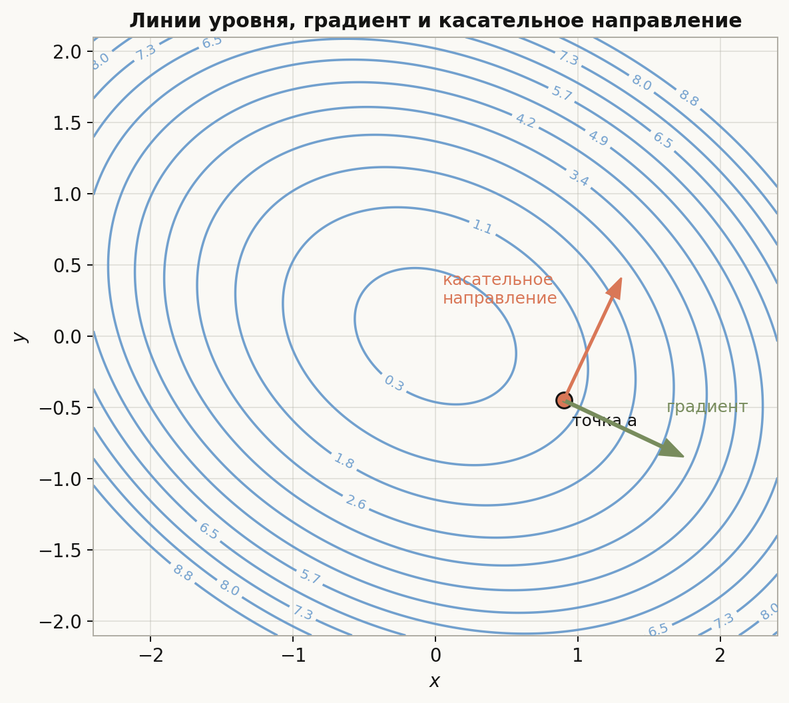
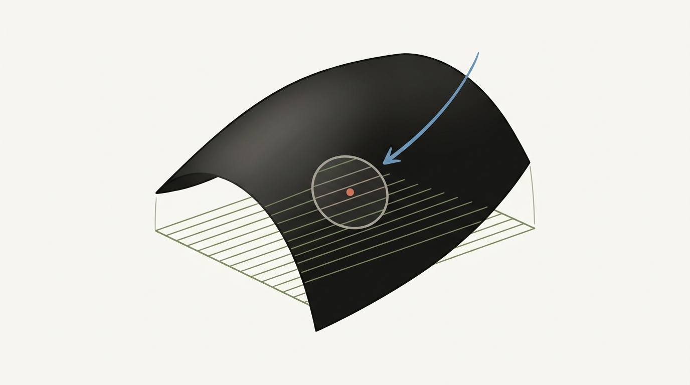

# Лекция: Функции многих переменных, их непрерывность и дифференцируемость

## План

- Вспомнить, что такое функция многих переменных и как для неё определяются предел и непрерывность.
- Ввести частные производные и полную дифференцируемость.
- Обсудить градиент, производную по направлению и гессиан.
- Разобрать вычислительные примеры.
- Понять геометрический смысл основных объектов.
- Обсудить поиск безусловных и условных экстремумов.
- Кратко рассмотреть метод градиентного спуска.
- Сформулировать теорему о неявной функции и понять, как ею пользоваться.
- Отметить типичные ошибки и то, что особенно важно на вступительных задачах ШАД.

## 1. Мотивация

Функции многих переменных возникают почти в любой содержательной задаче. Например:

- площадь, объём, энергия, вероятность, ошибка модели зависят сразу от нескольких параметров;
- в задачах оптимизации нужно минимизировать или максимизировать функцию $f(x_1,\dots,x_n)$;
- в машинном обучении функция потерь зависит от большого числа параметров, и её минимизация обычно основана на градиенте;
- ограничения вида $g(x,y,z)=0$ приводят к задачам условного экстремума и к неявно заданным функциям.

В одной переменной важны производная, выпуклость и экстремумы. В нескольких переменных появляются новые объекты:

- частные производные;
- градиент;
- производная по направлению;
- матрица вторых производных, то есть гессиан;
- касательная плоскость вместо касательной прямой;
- линии и поверхности уровня;
- условные экстремумы при наличии связи.

Это важно, потому что во вступительных задачах часто требуется не только посчитать производные, но и аккуратно различать:

- существование частных производных и дифференцируемость;
- необходимое и достаточное условие экстремума;
- локальный и глобальный экстремум;
- безусловный и условный экстремум.

## 2. Определения

### 2.1. Функция многих переменных

Пусть $D \subset \mathbb{R}^n$. Функция многих переменных — это отображение $f\colon D \to \mathbb{R}$.

Чаще всего на начальном этапе рассматривают функции двух или трёх переменных:
$f(x,y)$ или $f(x,y,z)$.

### 2.2. Предел и непрерывность

Говорят, что $\lim\limits_{x\to a} f(x)=L$, если для любого $\varepsilon>0$ найдётся $\delta>0$ такое, что из $\|x-a\|<\delta$ следует $|f(x)-L|<\varepsilon$.

Здесь $x,a \in \mathbb{R}^n$, а $\|\cdot\|$ — обычно евклидова норма.

Функция $f$ непрерывна в точке $a$, если
$\lim\limits_{x\to a} f(x)=f(a)$.

Важно помнить: в $\mathbb{R}^n$ к точке можно подходить бесконечно многими способами. Поэтому проверка только по прямым часто помогает найти отсутствие предела, но не всегда доказывает его существование.

### 2.3. Частные производные

Пусть $f(x_1,\dots,x_n)$ определена в окрестности точки $a=(a_1,\dots,a_n)$.

Частная производная по переменной $x_k$ в точке $a$ определяется как
$$
\frac{\partial f}{\partial x_k}(a)=\lim_{t\to 0}\frac{f(a_1,\dots,a_k+t,\dots,a_n)-f(a_1,\dots,a_n)}{t},
$$
если предел существует.

Для функции двух переменных:
$$
f_x(x,y)=\frac{\partial f}{\partial x}(x,y), \qquad f_y(x,y)=\frac{\partial f}{\partial y}(x,y).
$$

### 2.4. Дифференцируемость

Функция $f\colon \mathbb{R}^n \to \mathbb{R}$ дифференцируема в точке $a$, если существует линейная функция $L(h)$ такая, что
$$
f(a+h)=f(a)+L(h)+o(\|h\|), \qquad h\to 0.
$$

Линейная функция $L$ называется дифференциалом или производной функции в точке $a$.

Если $f$ дифференцируема в $a$, то
$$
L(h)=\sum_{k=1}^n \frac{\partial f}{\partial x_k}(a)\,h_k.
$$

Для двух переменных это записывается так:
$$
f(a+\Delta x,b+\Delta y)-f(a,b)=f_x(a,b)\Delta x+f_y(a,b)\Delta y+o\bigl(\sqrt{(\Delta x)^2+(\Delta y)^2}\bigr).
$$

Эта картинка показывает, что дифференцируемость сильнее простого существования частных производных: поверхность в малой окрестности точки должна хорошо приближаться одной касательной плоскостью.

Важно: существование всех частных производных в точке само по себе не гарантирует дифференцируемость.

### 2.5. Градиент

Градиент функции $f$ в точке $a$ — это вектор
$$
\nabla f(a)=\left(\frac{\partial f}{\partial x_1}(a),\dots,\frac{\partial f}{\partial x_n}(a)\right).
$$

Для функции двух переменных:
$$
\nabla f(x,y)=(f_x(x,y),f_y(x,y)).
$$

### 2.6. Производная по направлению

Пусть $u \in \mathbb{R}^n$ — единичный вектор. Производная функции $f$ в точке $a$ по направлению $u$ определяется как
$$
D_u f(a)=\lim_{t\to 0}\frac{f(a+tu)-f(a)}{t},
$$
если предел существует.

Если $f$ дифференцируема в точке $a$, то
$$
D_u f(a)=\nabla f(a)\cdot u.
$$

### 2.7. Гессиан

Если у функции существуют вторые частные производные, то гессиан функции $f$ в точке $a$ — это матрица
$$
H_f(a)=
\begin{pmatrix}
\frac{\partial^2 f}{\partial x_1^2}(a) & \frac{\partial^2 f}{\partial x_1\partial x_2}(a) & \cdots & \frac{\partial^2 f}{\partial x_1\partial x_n}(a)\\
\frac{\partial^2 f}{\partial x_2\partial x_1}(a) & \frac{\partial^2 f}{\partial x_2^2}(a) & \cdots & \frac{\partial^2 f}{\partial x_2\partial x_n}(a)\\
\vdots & \vdots & \ddots & \vdots\\
\frac{\partial^2 f}{\partial x_n\partial x_1}(a) & \frac{\partial^2 f}{\partial x_n\partial x_2}(a) & \cdots & \frac{\partial^2 f}{\partial x_n^2}(a)
\end{pmatrix}.
$$

Для $f(x,y)$:
$$
H_f(x,y)=
\begin{pmatrix}
f_{xx}(x,y) & f_{xy}(x,y)\\
f_{yx}(x,y) & f_{yy}(x,y)
\end{pmatrix}.
$$

### 2.8. Критическая точка

Точка $a$ называется критической для дифференцируемой функции $f$, если $\nabla f(a)=0$.

Именно в таких точках ищут кандидатов на локальные экстремумы внутри области.

### 2.9. Условный экстремум

Пусть требуется исследовать функцию $f(x)$ при ограничении $g(x)=0$.

Условие $g(x)=0$ задаёт множество **допустимых точек**. Поэтому здесь мы сравниваем значение функции не со всеми близкими точками пространства, а только с теми, которые удовлетворяют ограничению.

Точка $a$ на множестве $\{x\colon g(x)=0\}$ называется точкой **условного минимума**, если в некоторой окрестности для всех допустимых точек $x$ выполнено
$$
f(x)\ge f(a).
$$

Аналогично, $a$ называется точкой **условного максимума**, если для всех близких допустимых точек
$$
f(x)\le f(a).
$$

Иначе говоря, мы ищем экстремум не на всей поверхности, а только вдоль кривой или поверхности, заданной уравнением $g(x)=0$.

Простейший пример: если $f(x,y)=x+y$, а ограничение имеет вид $x^2+y^2=1$, то на всей плоскости у функции нет ни минимума, ни максимума. Но на окружности $x^2+y^2=1$ они уже есть: максимум достигается в точке $\left(\frac{1}{\sqrt 2},\frac{1}{\sqrt 2}\right)$, а минимум — в противоположной точке. Ограничение превращает задачу "по всей плоскости" в задачу "только на допустимой кривой".

### 2.10. Неявная функция

Уравнение $F(x,y)=0$ может задавать $y$ как функцию от $x$, даже если явно выразить это трудно или невозможно.

Здесь важно не путать три разных объекта:

- запись $f(x,y)=x+y$ задаёт **саму функцию двух переменных**;
- уравнение $z=f(x,y)=x+y$ задаёт её **график** в трёхмерном пространстве, и это действительно плоскость;
- уравнения вида $f(x,y)=c$, то есть $x+y=c$, задают уже не график функции, а её **линии уровня** на плоскости $(x,y)$.

Поэтому семейство прямых $x+y=5$, $x+y=6$ и так далее возникает не потому, что функция задана неявно, а потому, что мы фиксируем разные значения $c$ и рассматриваем семейство уровней одной и той же функции.

Теорема о неявной функции даёт условия, при которых вблизи точки $(x_0,y_0)$, удовлетворяющей $F(x_0,y_0)=0$, действительно существует функция $y=\varphi(x)$ такая, что
$$
F(x,\varphi(x))=0.
$$

## 3. Главные свойства

### 3.1. Непрерывность и дифференцируемость

Если функция дифференцируема в точке, то она непрерывна в этой точке.

Обратное неверно: непрерывность не влечёт дифференцируемость.

Также существование частных производных в точке не влечёт дифференцируемость.

Полезный достаточный признак: если все частные производные существуют в некоторой окрестности точки и непрерывны в самой точке, то функция дифференцируема в этой точке.

### 3.2. Связь дифференциала и градиента

Если $f$ дифференцируема в точке $a$, то
$$
df_a(h)=\nabla f(a)\cdot h.
$$

Значит, линейная часть приращения функции задаётся скалярным произведением с градиентом.

### 3.3. Формула для производной по направлению

Если $f$ дифференцируема в точке $a$, то для любого единичного вектора $u$
$$
D_u f(a)=\nabla f(a)\cdot u.
$$

Следовательно:

- наибольшее значение производной по направлению равно $\|\nabla f(a)\|$;
- оно достигается в направлении градиента;
- наименьшее равно $-\|\nabla f(a)\|$ и достигается в противоположном направлении;
- если $u \perp \nabla f(a)$, то $D_u f(a)=0$.

### 3.4. Теорема о смешанных производных

Если вторые частные производные $f_{x_i x_j}$ непрерывны в окрестности точки, то
$$
\frac{\partial^2 f}{\partial x_i \partial x_j}=\frac{\partial^2 f}{\partial x_j \partial x_i}.
$$

Для двух переменных:
$$
f_{xy}=f_{yx}.
$$

Это свойство удобно, но его нельзя применять без условий.

### 3.5. Квадратичное приближение и гессиан

Если функция дважды дифференцируема в точке $a$, то
$$
f(a+h)=f(a)+\nabla f(a)\cdot h+\frac12\, h^T H_f(a) h+o(\|h\|^2).
$$

Если $a$ — критическая точка, то линейный член исчезает, и поведение функции рядом с $a$ определяется квадратичной формой
$$
h^T H_f(a) h.
$$

### 3.6. Необходимое условие локального экстремума

Если $f$ дифференцируема в точке $a$ и имеет в ней локальный экстремум, то
$$
\nabla f(a)=0.
$$

Это только необходимое условие, но не достаточное.

### 3.7. Достаточное условие через гессиан

Пусть $a$ — критическая точка функции $f$, и $f$ дважды дифференцируема.

Напомним, что квадратичная форма $Q(h)=h^T H_f(a) h$ называется **положительно определённой**, если
$$
Q(h)>0 \quad \text{для всех } h\ne 0,
$$
и **отрицательно определённой**, если
$$
Q(h)<0 \quad \text{для всех } h\ne 0.
$$

- Если квадратичная форма $h^T H_f(a) h$ положительно определена, то в точке $a$ строгий локальный минимум.
- Если она отрицательно определена, то в точке $a$ строгий локальный максимум.
- Если форма принимает значения разных знаков, то экстремума нет, это седловая точка.

Для функции двух переменных удобно использовать обозначения
$$
A=f_{xx}(a), \qquad B=f_{xy}(a), \qquad C=f_{yy}(a),
$$
и определитель
$$
\Delta=AC-B^2.
$$

Тогда:

- если $\Delta>0$ и $A>0$, то локальный минимум;
- если $\Delta>0$ и $A<0$, то локальный максимум;
- если $\Delta<0$, то седловая точка;
- если $\Delta=0$, критерий не даёт ответа.

### 3.8. Градиентный спуск

Для минимизации функции $f(x)$ один из базовых итерационных методов имеет вид
$$
x_{k+1}=x_k-\alpha_k \nabla f(x_k),
$$
где $\alpha_k>0$ — шаг.

Идея состоит в том, что градиент указывает направление наибольшего роста, значит, в направлении $-\nabla f$ функция локально убывает быстрее всего.

Для квадратичных и хорошо устроенных функций это даёт естественный путь к минимуму. Для общих функций важен выбор шага: слишком большой шаг может увести процесс в колебания или даже увеличить значение функции.

### 3.9. Метод множителей Лагранжа

Пусть нужно исследовать экстремумы $f(x)$ при ограничении $g(x)=0$.

Ограничение $g(x)=0$ задаёт множество допустимых точек. В точке условного экстремума нельзя получить линейное увеличение или уменьшение функции, двигаясь **вдоль** этого множества.

Геометрически это означает следующее:

- допустимые малые смещения лежат в касательном направлении к множеству $g(x)=0$;
- в точке условного экстремума производная функции по любому такому допустимому направлению должна быть равна нулю;
- следовательно, градиент $\nabla f(a)$ ортогонален касательному направлению.

Но градиент ограничения $\nabla g(a)$ тоже ортогонален множеству уровня $g(x)=0$. Поэтому оба вектора нормальны к одному и тому же касательному направлению, а значит, коллинеарны.

Если в точке условного экстремума градиент ограничения не равен нулю, то существует число $\lambda$ такое, что
$$
\nabla f(a)=\lambda \nabla g(a).
$$

Именно это и есть условие Лагранжа: в точке условного экстремума градиент функции выражается через градиент ограничения.

Число $\lambda$ называется **множителем Лагранжа**. Его не нужно заранее как-то интерпретировать или угадывать: это просто дополнительная неизвестная, которая помогает записать условие коллинеарности двух градиентов в виде системы уравнений.

На рисунке линия уровня функции касается кривой ограничения. В точке касания нельзя улучшить значение $f$, оставаясь на допустимой кривой, поэтому нормали к этим двум линиям оказываются параллельны.

Для нескольких ограничений $g_1(x)=0,\dots,g_m(x)=0$:
$$
\nabla f(a)=\lambda_1 \nabla g_1(a)+\cdots+\lambda_m \nabla g_m(a).
$$

То есть градиент функции должен лежать в линейной оболочке градиентов ограничений.

Практически метод работает по шагам:

1. Выделяют функцию ограничения:
$$
g(x)=0.
$$

2. Вычисляют градиенты $\nabla f$ и $\nabla g$.

3. Записывают уравнение Лагранжа
$$
\nabla f(a)=\lambda \nabla g(a)
$$
и добавляют к нему само ограничение
$$
g(a)=0,
$$
чтобы получить замкнутую систему на координаты точки и множитель $\lambda$.

4. Решают эту систему и получают все **кандидаты** на условный экстремум.

5. Подставляют найденные точки в функцию $f$ и сравнивают значения, либо дополнительно анализируют задачу, чтобы понять, где достигается минимум, где максимум, а где экстремума нет.

Важно помнить: система Лагранжа даёт кандидатов, но сама по себе ещё не различает минимум, максимум и другие возможные ситуации. Окончательный вывод делают после подстановки или дополнительного анализа.

В этой лекции конкретный разбор показан ниже в примере `4.9`, где метод применяется к функции $f(x,y)=xy$ при ограничении $x^2+y^2=1$.

### 3.10. Теорема о неявной функции

Одна из стандартных формулировок для двух переменных такова.

Пусть функция $F(x,y)$ непрерывно дифференцируема в окрестности точки $(x_0,y_0)$, причём
$$
F(x_0,y_0)=0, \qquad F_y(x_0,y_0)\ne 0.
$$

Тогда существуют окрестность точки $x_0$ и единственная функция $y=\varphi(x)$, определённая в этой окрестности, такая, что
$$
\varphi(x_0)=y_0, \qquad F(x,\varphi(x))=0.
$$

Причём функция $\varphi$ дифференцируема, и
$$
\varphi'(x)=-\frac{F_x(x,\varphi(x))}{F_y(x,\varphi(x))}.
$$

В многомерном варианте условие невырожденности относится к матрице производных по переменным, которые хотим выразить неявно.

## 4. Примеры вычислений

### 4.1. Непрерывность функции двух переменных

Рассмотрим функцию
$$
f(x,y)=x^2+y^2.
$$

Она непрерывна всюду, поскольку является многочленом по переменным $x,y$.

Теперь рассмотрим
$$
g(x,y)=
\begin{cases}
\dfrac{x^2 y}{x^2+y^2}, & (x,y)\ne(0,0),\\
0, & (x,y)=(0,0).
\end{cases}
$$

Проверим непрерывность в $(0,0)$.

Имеем оценку
$$
|g(x,y)|=\left|\frac{x^2 y}{x^2+y^2}\right|\le |y|.
$$

Так как $|y|\to 0$ при $(x,y)\to(0,0)$, то по теореме о зажатой функции
$$
g(x,y)\to 0=g(0,0).
$$

Следовательно, $g$ непрерывна в нуле.

### 4.2. Частные производные и дифференцируемость

Рассмотрим
$$
f(x,y)=x^2 y+\sin(xy).
$$

Найдём частные производные:
$$
f_x(x,y)=2xy+y\cos(xy),
$$
$$
f_y(x,y)=x^2+x\cos(xy).
$$

Так как эти функции непрерывны всюду, функция $f$ дифференцируема всюду.

Дифференциал в точке $(a,b)$:
$$
df_{(a,b)}(\Delta x,\Delta y)=\bigl(2ab+b\cos(ab)\bigr)\Delta x+\bigl(a^2+a\cos(ab)\bigr)\Delta y.
$$

### 4.3. Частные производные существуют, но дифференцируемости нет

Рассмотрим функцию
$$
f(x,y)=
\begin{cases}
\dfrac{xy}{\sqrt{x^2+y^2}}, & (x,y)\ne(0,0),\\
0, & (x,y)=(0,0).
\end{cases}
$$

Найдём частные производные в нуле.

При $y=0$ имеем $f(x,0)=0$, значит
$$
f_x(0,0)=\lim_{h\to 0}\frac{f(h,0)-f(0,0)}{h}=0.
$$

Аналогично $f_y(0,0)=0$.

Но проверим дифференцируемость. Если бы функция была дифференцируема в нуле, то должно было бы выполняться
$$
f(x,y)=o\bigl(\sqrt{x^2+y^2}\bigr).
$$

Подставим $y=x$:
$$
f(x,x)=\frac{x^2}{\sqrt{2x^2}}=\frac{|x|}{\sqrt{2}}.
$$

Тогда
$$
\frac{f(x,x)}{\sqrt{x^2+x^2}}=\frac{|x|/\sqrt{2}}{\sqrt{2}|x|}=\frac12.
$$

Это не стремится к нулю. Следовательно, функция не дифференцируема в $(0,0)$.

### 4.4. Градиент и производная по направлению

Пусть
$$
f(x,y,z)=x^2y+yz+e^{xz}.
$$

Тогда
$$
\nabla f(x,y,z)=
\left(
2xy+z e^{xz},
x^2+z,
y+x e^{xz}
\right).
$$

Найдём производную по направлению в точке $(1,2,0)$ в направлении вектора $v=(1,2,2)$.

Сначала нормируем:
$$
\|v\|=\sqrt{1+4+4}=3,
\qquad
u=\left(\frac13,\frac23,\frac23\right).
$$

Градиент в точке:
$$
\nabla f(1,2,0)=
\left(
4,\,
1,\,
3
\right).
$$

Следовательно,
$$
D_u f(1,2,0)=\nabla f(1,2,0)\cdot u=4\cdot \frac13+1\cdot \frac23+3\cdot \frac23=\frac{4+2+6}{3}=4.
$$

### 4.5. Гессиан и классификация критической точки

Рассмотрим
$$
f(x,y)=x^2+xy+y^2-2x-4y.
$$

Найдём стационарные точки:
$$
f_x=2x+y-2,
\qquad
f_y=x+2y-4.
$$

Решаем систему
$$
\begin{cases}
2x+y-2=0,\\
x+2y-4=0.
\end{cases}
$$

Из первого уравнения $y=2-2x$. Подставляем во второе:
$$
x+2(2-2x)-4=0,
$$
$$
x+4-4x-4=0,
$$
$$
-3x=0,
$$
$$
x=0,\qquad y=2.
$$

Гессиан:
$$
H_f=
\begin{pmatrix}
2 & 1\\
1 & 2
\end{pmatrix}.
$$

Его определитель равен $4-1=3>0$, а $f_{xx}=2>0$. Значит, гессиан положительно определён, и точка $(0,2)$ — точка строгого локального минимума.

Так как функция квадратична с положительно определённой матрицей, этот минимум также является глобальным.

Посчитаем значение:
$$
f(0,2)=0+0+4-0-8=-4.
$$

### 4.6. Седловая точка

Рассмотрим
$$
f(x,y)=x^2-y^2.
$$

Тогда
$$
\nabla f(x,y)=(2x,-2y),
$$
поэтому единственная критическая точка — $(0,0)$.

Гессиан:
$$
H_f=
\begin{pmatrix}
2 & 0\\
0 & -2
\end{pmatrix}.
$$

Квадратичная форма равна $2h_1^2-2h_2^2$, она принимает как положительные, так и отрицательные значения. Значит, $(0,0)$ — седловая точка, экстремума нет.

Это видно и напрямую:
$$
f(x,0)=x^2 \ge 0, \qquad f(0,y)=-y^2 \le 0.
$$

### 4.7. Критерий второго порядка не даёт ответа

Рассмотрим
$$
f(x,y)=x^4+y^4.
$$

Тогда
$$
\nabla f=(4x^3,4y^3),
$$
значит, критическая точка одна: $(0,0)$.

Гессиан:
$$
H_f(x,y)=
\begin{pmatrix}
12x^2 & 0\\
0 & 12y^2
\end{pmatrix},
$$
поэтому
$$
H_f(0,0)=
\begin{pmatrix}
0 & 0\\
0 & 0
\end{pmatrix}.
$$

Критерий по гессиану здесь ничего не говорит. Но из неравенства
$$
x^4+y^4 \ge 0
$$
следует, что в точке $(0,0)$ имеется локальный и глобальный минимум.

### 4.8. Градиентный спуск на квадратичной функции

Пусть
$$
f(x,y)=x^2+y^2.
$$

Тогда
$$
\nabla f(x,y)=(2x,2y).
$$

Шаг градиентного спуска с постоянным $\alpha$:
$$
\begin{pmatrix}x_{k+1}\\y_{k+1}\end{pmatrix}
=\begin{pmatrix}x_k\\y_k\end{pmatrix}-\alpha\begin{pmatrix}2x_k\\2y_k\end{pmatrix}
=(1-2\alpha)\begin{pmatrix}x_k\\y_k\end{pmatrix}.
$$

Отсюда
$$
(x_k,y_k)=(1-2\alpha)^k (x_0,y_0).
$$

Следовательно, метод сходится к $(0,0)$ тогда и только тогда, когда
$$
|1-2\alpha|<1,
$$
то есть
$$
0<\alpha<1.
$$

Это полезный пример: даже для очень простой функции выбор шага принципиален.

Анимация помогает увидеть, как формула $x_{k+1}=x_k-\alpha \nabla f(x_k)$ превращается в реальное движение по линиям уровня к минимуму.

### 4.9. Условный экстремум методом Лагранжа

Найдём экстремумы функции
$$
f(x,y)=xy
$$
при ограничении
$$
x^2+y^2=1.
$$

Введём
$$
g(x,y)=x^2+y^2-1.
$$

Тогда
$$
\nabla f=(y,x), \qquad \nabla g=(2x,2y).
$$

Составляем систему Лагранжа:
$$
\begin{cases}
y=2\lambda x,\\
x=2\lambda y,\\
x^2+y^2=1.
\end{cases}
$$

Если $x=0$, то из ограничения $y=\pm 1$, но тогда первое уравнение даёт $y=0$, противоречие. Аналогично $y\ne 0$.

Умножим первые два уравнения:
$$
xy=4\lambda^2 xy.
$$

Так как $xy\ne 0$, получаем
$$
4\lambda^2=1,
\qquad
\lambda=\pm \frac12.
$$

Если $\lambda=\frac12$, то из системы следует $y=x$. Тогда
$$
2x^2=1,
\qquad
x=\pm \frac{1}{\sqrt{2}},
\qquad
y=\pm \frac{1}{\sqrt{2}}.
$$

В этих точках
$$
f(x,y)=\frac12.
$$

Если $\lambda=-\frac12$, то $y=-x$. Тогда
$$
x=\pm \frac{1}{\sqrt{2}},
\qquad
y=\mp \frac{1}{\sqrt{2}},
$$
и
$$
f(x,y)=-\frac12.
$$

Итак, условный максимум равен $\frac12$, условный минимум равен $-\frac12$.

### 4.10. Неявная функция и её производная

Рассмотрим уравнение
$$
F(x,y)=y^3+y-x=0.
$$

В точке $(0,0)$ имеем
$$
F(0,0)=0.
$$

Проверим условие теоремы:
$$
F_y(x,y)=3y^2+1,
$$
поэтому
$$
F_y(0,0)=1\ne 0.
$$

Следовательно, в окрестности нуля уравнение задаёт функцию $y=\varphi(x)$.

Найдём её производную:
$$
\varphi'(x)=-\frac{F_x(x,\varphi(x))}{F_y(x,\varphi(x))}.
$$

Здесь
$$
F_x(x,y)=-1,
$$
поэтому
$$
\varphi'(x)=\frac{1}{3\varphi(x)^2+1}.
$$

В частности,
$$
\varphi'(0)=1.
$$

## 5. Геометрический или интуитивный смысл

### 5.1. График и линии уровня

Для функции двух переменных $f(x,y)$ график — это поверхность в $\mathbb{R}^3$:
$$
z=f(x,y).
$$

Часто удобнее смотреть не на саму поверхность, а на линии уровня:
$$
f(x,y)=c.
$$

Они показывают, как меняется функция в плоскости.

### 5.2. Частные производные

Частная производная $f_x(a,b)$ — это скорость изменения функции, если двигаться только вдоль оси $x$, удерживая $y=b$ фиксированным.

Аналогично $f_y(a,b)$ описывает изменение при движении только по оси $y$.

То есть частные производные изучают поведение функции по координатным направлениям.

### 5.3. Дифференцируемость

Дифференцируемость означает, что вблизи точки функцию можно хорошо заменить линейной функцией.

Для $f(x,y)$ это значит, что график поверхности в малом почти совпадает с касательной плоскостью:
$$
z=f(a,b)+f_x(a,b)(x-a)+f_y(a,b)(y-b).
$$

Если такая линейная аппроксимация работает с ошибкой меньшего порядка, чем расстояние до точки, то функция дифференцируема.

### 5.4. Градиент

Градиент $\nabla f(a)$ в точке:

- указывает направление наиболее быстрого роста функции;
- его длина равна максимальной скорости роста;
- он ортогонален линии уровня $f=\text{const}$.

Последний факт очень важен. Если двигаться вдоль линии уровня, значение функции не меняется. Значит, производная по касательному направлению равна нулю. Следовательно, касательное направление ортогонально градиенту.

Это одна из самых полезных геометрических картинок темы: градиент перпендикулярен линии уровня, а производная по касательному направлению равна нулю.

### 5.5. Производная по направлению

Производная по направлению $D_u f(a)$ показывает, как быстро меняется функция, если идти из точки $a$ в направлении $u$.

Формула
$$
D_u f(a)=\nabla f(a)\cdot u
$$
означает, что важна проекция градиента на это направление.

Если угол между $u$ и $\nabla f(a)$ равен $\theta$, то
$$
D_u f(a)=\|\nabla f(a)\|\cos\theta.
$$

### 5.6. Гессиан

Гессиан описывает кривизну поверхности вблизи точки.

- Положительно определённый гессиан соответствует форме типа "чаши", то есть минимуму.
- Отрицательно определённый — форме типа "перевёрнутой чаши", то есть максимуму.
- Неопределённый — форме типа "седла".

### 5.7. Метод Лагранжа

Если есть ограничение $g(x,y)=0$, то допустимые точки лежат на кривой.

В точке условного экстремума нельзя уменьшить или увеличить функцию, двигаясь по допустимой кривой. Значит, производная функции вдоль касательного направления к кривой равна нулю.

Это эквивалентно тому, что градиент функции ортогонален касательному направлению. Но и градиент ограничения $\nabla g$ тоже ортогонален касательной к кривой уровня $g=0$. Следовательно, в точке условного экстремума векторы $\nabla f$ и $\nabla g$ коллинеарны:
$$
\nabla f=\lambda \nabla g.
$$

Та же геометрия показана на схеме в п. 3.9: линия уровня касается ограничения в точке экстремума, и именно отсюда возникает система Лагранжа.

### 5.8. Неявная функция

Уравнение $F(x,y)=0$ задаёт кривую на плоскости. Если в точке $F_y\ne 0$, то кривая локально не "вертикальна", и её можно представить как график функции $y=\varphi(x)$.

Полезно различать это с обычной функцией двух переменных: запись $f(x,y)=x+y$ задаёт числовую функцию, её график имеет вид $z=x+y$ и живёт в пространстве $(x,y,z)$, а уравнения $x+y=c$ описывают семейство линий уровня на плоскости $(x,y)$. Напротив, запись $F(x,y)=0$ сразу задаёт множество точек на плоскости, и вопрос теоремы о неявной функции состоит в том, можно ли это множество локально переписать как график $y=\varphi(x)$.

Если же $F_x\ne 0$, то локально можно выразить $x$ через $y$.

Здесь важно слово «локально»: теорема не обещает глобального явного решения, но в малой окрестности регулярной точки кривая или поверхность ведёт себя как гладкий график.

## 6. Типичные ошибки

- Проверять предел функции многих переменных только вдоль одной траектории и делать вывод о существовании предела.
- Считать, что существование всех частных производных автоматически означает дифференцируемость.
- Путать частные производные и производные по направлению.
- Забывать нормировать вектор направления при использовании формулы $D_u f=\nabla f\cdot u$, если по определению направление задаётся единичным вектором.
- Механически применять равенство $f_{xy}=f_{yx}$ без проверки условий на непрерывность вторых производных.
- Искать экстремумы только среди критических точек и забывать про границу области.
- Считать, что условие $\nabla f=0$ уже гарантирует экстремум.
- При исследовании по гессиану забывать, что случай $\Delta=0$ в двумерном критерии остаётся неопределённым.
- В методе Лагранжа выписывать систему $\nabla f=\lambda \nabla g$, но не добавлять само ограничение $g=0$.
- Забывать проверить, что в точке ограничения действительно выполнено условие $\nabla g\ne 0$, если ссылаются на теорему о множителях Лагранжа.
- В теореме о неявной функции не проверять одновременно два условия: $F(x_0,y_0)=0$ и ненулевую частную производную по переменной, которую хотим выразить.
- Путать локальный и глобальный экстремум.

## 7. Что важно для поступления в ШАД

### 7.1. Базовые вычислительные навыки

Нужно уверенно уметь:

- находить частные производные первого и второго порядка;
- считать градиент и гессиан;
- находить производную по направлению;
- решать систему $\nabla f=0$;
- применять критерий второго порядка для функций двух переменных;
- работать с простыми задачами на Лагранжа;
- дифференцировать неявно заданную функцию.

### 7.2. Концептуальные различия

Особенно важно чётко понимать:

- непрерывность, существование частных производных и дифференцируемость — разные свойства;
- критическая точка и точка экстремума — не одно и то же;
- нулевой градиент — необходимое, но не достаточное условие;
- гессиан помогает классифицировать критическую точку, но не всегда;
- для экстремума на замкнутой области нужно исследовать и внутренние точки, и границу.

### 7.3. Типовые форматы задач

На вступительных задачах часто встречаются следующие сюжеты:

- проверить существование предела функции в точке;
- выяснить, непрерывна ли функция;
- показать, что частные производные существуют, а дифференцируемости нет;
- найти направление наибольшего роста;
- исследовать критические точки функции двух переменных;
- найти максимум и минимум на окружности, эллипсе или прямой связи;
- использовать теорему о неявной функции для нахождения производной;
- вывести формулу касательной плоскости.

### 7.4. Что полезно делать на экзамене

- Сначала выписать область определения.
- Если задача про экстремум на области, явно разделить: внутренние точки и граница.
- Если исследуется предел, пробовать разные траектории: прямые, параболы, полярные координаты.
- Если критерий второго порядка не сработал, не останавливаться: нужно анализировать функцию напрямую.
- В задачах Лагранжа после нахождения кандидатов обязательно подставлять их в функцию и сравнивать значения.
- В решениях аккуратно указывать, где используется теорема и почему её условия выполнены.

## 8. Итоги

Функции многих переменных обобщают основные идеи одномерного анализа, но делают геометрию и логику задач богаче.

Ключевые объекты темы:

- частные производные описывают изменение по координатным направлениям;
- дифференцируемость означает существование хорошего линейного приближения;
- градиент задаёт направление наибыстрейшего роста и ортогонален линиям уровня;
- производная по направлению выражается через скалярное произведение с градиентом;
- гессиан отвечает за второй порядок приближения и классификацию критических точек;
- метод градиентного спуска использует движение против градиента для минимизации;
- экстремумы без ограничений ищутся среди критических точек и на границе области;
- условные экстремумы удобно искать методом множителей Лагранжа;
- теорема о неявной функции позволяет локально выражать одни переменные через другие и вычислять производные таких функций.

Для хорошего владения темой нужно одновременно уметь:

- аккуратно считать;
- понимать геометрический смысл;
- различать близкие, но не совпадающие понятия;
- видеть, какой именно инструмент подходит в данной задаче.

## 9. Вопросы для самопроверки

1. Чем отличается существование всех частных производных в точке от дифференцируемости в этой точке?
2. Почему из дифференцируемости следует непрерывность?
3. Как определяется производная по направлению, и при каком условии она равна $\nabla f(a)\cdot u$?
4. Что геометрически означает градиент функции двух переменных?
5. Почему градиент ортогонален линии уровня?
6. Как по гессиану классифицировать критическую точку функции двух переменных?
7. Что означает случай $\Delta=0$ в критерии второго порядка для функции двух переменных?
8. Почему условие $\nabla f(a)=0$ не гарантирует экстремум?
9. Как устроен один шаг метода градиентного спуска?
10. Почему в задачах на экстремум по области нельзя забывать про границу?
11. В чём состоит идея метода множителей Лагранжа?
12. Какие уравнения нужно выписать при поиске условного экстремума функции $f(x,y)$ при ограничении $g(x,y)=0$?
13. Какие условия нужны в теореме о неявной функции для уравнения $F(x,y)=0$?
14. Как найти производную неявно заданной функции $y=\varphi(x)$ из соотношения $F(x,\varphi(x))=0$?
15. Приведите пример функции, у которой в точке существуют частные производные, но нет дифференцируемости.
