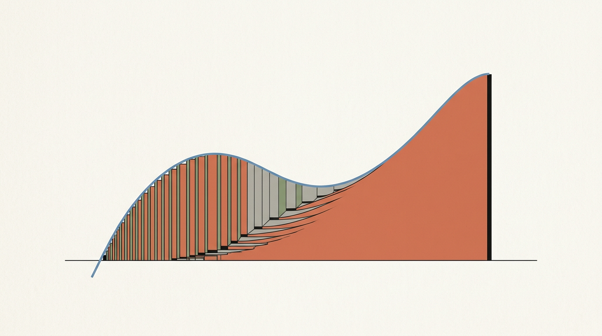
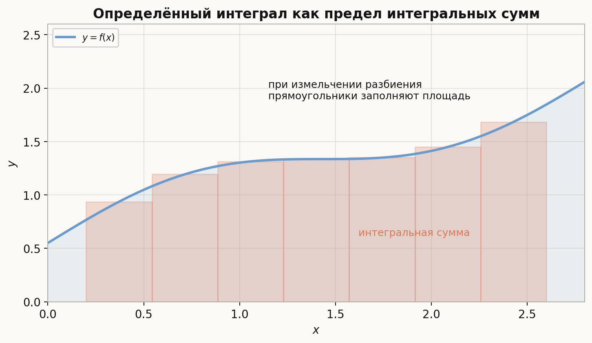
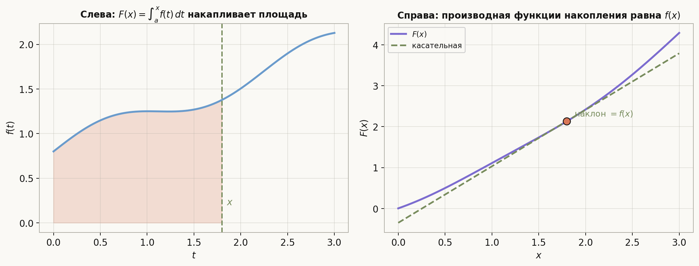
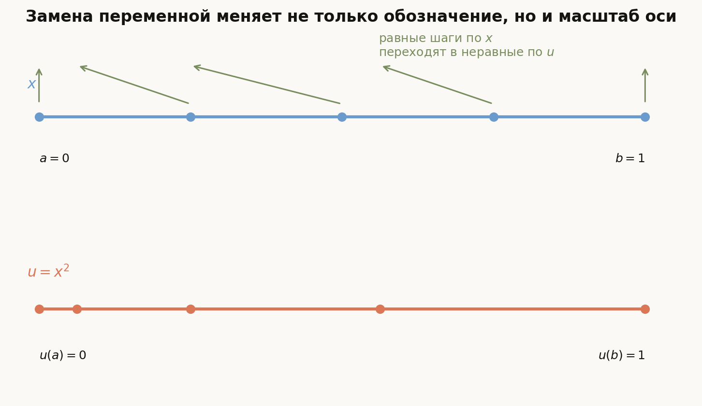
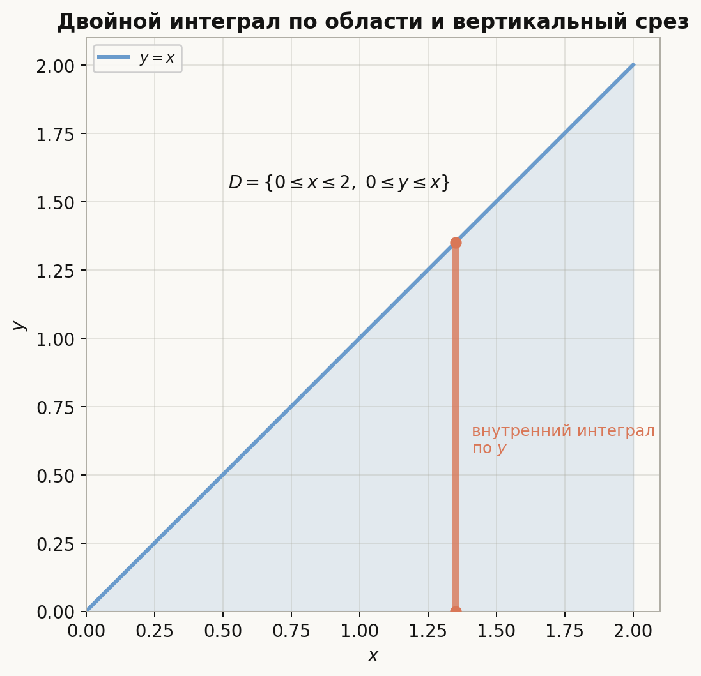
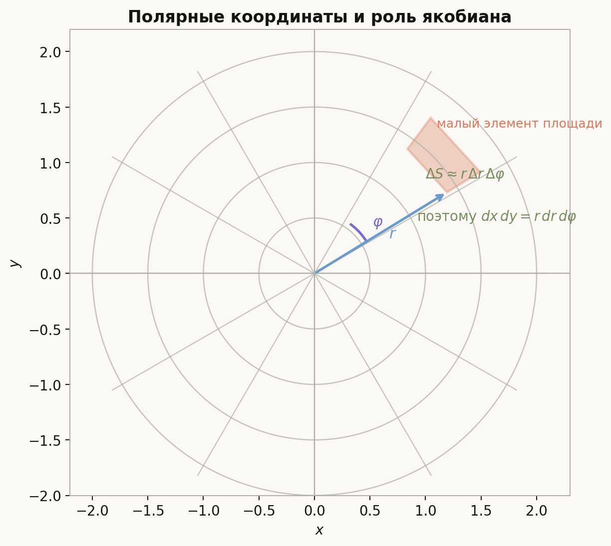
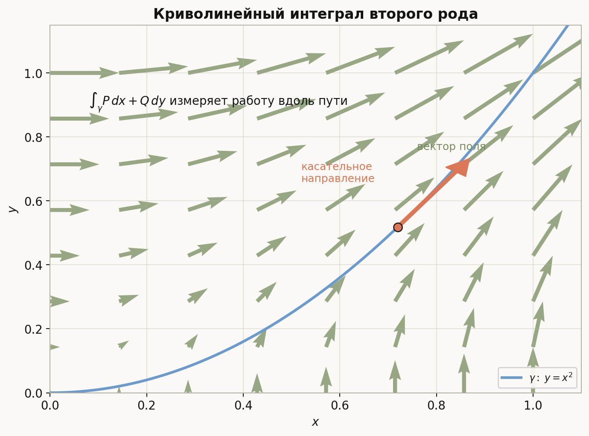
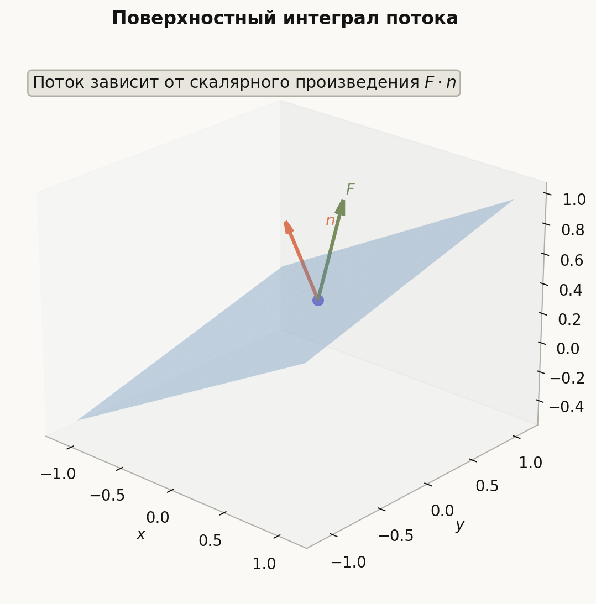

# Лекция: интегрирование

## План

1. Зачем нужен интеграл и какие задачи он решает
2. Неопределённый интеграл и первообразная
3. Таблица базовых первообразных
4. Определённый интеграл как предел интегральных сумм
5. Связь определённого и неопределённого интегралов
6. Геометрический и физический смысл интеграла
7. Подстановка
8. Интегрирование по частям
9. Разложение на простейшие дроби и стандартные приёмы
10. Кратные интегралы
11. Повторные интегралы и порядок интегрирования
12. Замена переменных и якобиан
13. Криволинейные интегралы
14. Поверхностные интегралы
15. Что важно для поступления в ШАД
16. Типичные ошибки
17. Итог
18. Вопросы для самопроверки

---

## 1. Зачем нужен интеграл и какие задачи он решает

Производная отвечает на вопрос о локальном изменении функции. Интеграл отвечает на обратный и не менее важный вопрос: как **накопить** локальные вклады в общий результат.

Типичные задачи, в которых возникает интеграл:

- найти площадь под графиком функции;
- восстановить функцию по её производной;
- вычислить путь по известной скорости;
- найти массу неоднородного тела по известной плотности;
- вычислить объём, работу, поток, заряд, вероятность.

В одной переменной интеграл сначала появляется в двух видах:

- как **неопределённый интеграл**, то есть семейство первообразных;
- как **определённый интеграл**, то есть число, измеряющее накопленный вклад на отрезке.

Позже те же идеи обобщаются:

- на двойные и тройные интегралы по областям;
- на криволинейные интегралы по кривым;
- на поверхностные интегралы по поверхностям.

Главная идея всей темы такая: интеграл складывает бесконечно много малых вкладов, а формула Ньютона-Лейбница связывает это накопление с производной.

---

## 2. Неопределённый интеграл и первообразная

### Определение

Функция $F$ называется **первообразной** для функции $f$ на промежутке $I$, если
$$
F'(x)=f(x)
$$
для всех $x\in I$.

### Неопределённый интеграл

Множество всех первообразных функции $f$ обозначают так:
$$
\int f(x)\,dx.
$$

Если $F$ — одна первообразная для $f$, то
$$
\int f(x)\,dx = F(x)+C,
$$
где $C$ — произвольная константа.

### Почему появляется константа

Если $F'(x)=f(x)$, то и
$$
(F(x)+C)' = F'(x)=f(x).
$$

Значит, все первообразные одной и той же функции отличаются на константу.

### Пример

Для функции $f(x)=2x$ первообразной является $F(x)=x^2$, поэтому
$$
\int 2x\,dx = x^2 + C.
$$

### Ещё один пример

Так как
$$
(\sin x)'=\cos x,
$$
имеем
$$
\int \cos x\,dx = \sin x + C.
$$

---

## 3. Таблица базовых первообразных

Ниже приведены самые важные формулы, которые нужно знать уверенно.

- $\int x^n\,dx=\dfrac{x^{n+1}}{n+1}+C$ при $n\ne -1$;
- $\int \dfrac{1}{x}\,dx=\ln|x|+C$;
- $\int e^x\,dx=e^x+C$;
- $\int a^x\,dx=\dfrac{a^x}{\ln a}+C$ при $a>0$, $a\ne 1$;
- $\int \sin x\,dx=-\cos x+C$;
- $\int \cos x\,dx=\sin x+C$;
- $\int \dfrac{1}{1+x^2}\,dx=\arctan x + C$;
- $\int \dfrac{1}{\sqrt{1-x^2}}\,dx=\arcsin x + C$.

### Важно

Таблица первообразных сама по себе недостаточна. На практике нужно уметь распознавать, когда выражение можно привести к табличному виду заменой переменной, по частям или алгебраическим преобразованием.

---

## 4. Определённый интеграл как предел интегральных сумм

### Идея

Пусть функция $f(x)\ge 0$ задана на отрезке $[a,b]$. Разобьём отрезок на маленькие куски:
$$
a=x_0<x_1<\dots<x_n=b.
$$

На каждом маленьком отрезке $[x_{k-1},x_k]$ выберем точку $\xi_k$ и построим прямоугольник высоты $f(\xi_k)$ и ширины
$$
\Delta x_k = x_k-x_{k-1}.
$$

Тогда сумма площадей прямоугольников равна
$$
\sum_{k=1}^n f(\xi_k)\,\Delta x_k.
$$

Если при измельчении разбиения эти суммы стремятся к одному и тому же пределу, то этот предел и называется определённым интегралом:
$$
\int_a^b f(x)\,dx.
$$

### Определение

Функция $f$ называется интегрируемой по Риману на $[a,b]$, если существует число $I$ такое, что для любых последовательностей разбиений с шагом, стремящимся к нулю, соответствующие интегральные суммы стремятся к $I$.

Тогда пишут:
$$
I=\int_a^b f(x)\,dx.
$$

### Когда интеграл существует

Для задач вступительного уровня достаточно помнить важный факт:

- всякая непрерывная функция на отрезке интегрируема;
- всякая кусочно-непрерывная ограниченная функция на отрезке тоже интегрируема.

---

## 5. Связь определённого и неопределённого интегралов

Это центральное утверждение всей темы.

### Функция накопления

Пусть функция $f$ непрерывна на $[a,b]$. Рассмотрим функцию
$$
F(x)=\int_a^x f(t)\,dt.
$$

Тогда:
$$
F'(x)=f(x).
$$

Иначе говоря, интеграл с переменным верхним пределом является первообразной.

### Формула Ньютона-Лейбница

Если $F'(x)=f(x)$ на $[a,b]$, то
$$
\int_a^b f(x)\,dx = F(b)-F(a).
$$

### Почему это важно

Эта формула превращает вычисление определённого интеграла из предельной задачи в задачу нахождения первообразной.

### Пример

Вычислим
$$
\int_0^2 3x^2\,dx.
$$

Первообразная для $3x^2$ равна $x^3$, значит
$$
\int_0^2 3x^2\,dx = x^3\Big|_0^2 = 8-0=8.
$$

### Ещё один пример

$$
\int_0^\pi \sin x\,dx = -\cos x\Big|_0^\pi = -(-1)-(-1)=2.
$$

---

## 6. Геометрический и физический смысл интеграла

### Геометрический смысл

Если $f(x)\ge 0$, то
$$
\int_a^b f(x)\,dx
$$
равен площади фигуры под графиком функции на отрезке $[a,b]$.

Если функция меняет знак, то определённый интеграл даёт **алгебраическую площадь**:

- площадь над осью $Ox$ идёт со знаком плюс;
- площадь под осью $Ox$ идёт со знаком минус.

### Физический смысл

Если $v(t)$ — скорость, то
$$
\int_{t_1}^{t_2} v(t)\,dt
$$
даёт перемещение.

Если $\rho(x)$ — линейная плотность стержня, то
$$
\int_a^b \rho(x)\,dx
$$
даёт массу стержня.

Если сила зависит от положения, то работа тоже вычисляется интегралом.

---

## 7. Подстановка

### Идея

Если подынтегральное выражение содержит сложную функцию и её производную, удобно сделать замену переменной.

### Формула

Пусть
$$
u=\varphi(x).
$$

Тогда формально:
$$
\int f(\varphi(x))\varphi'(x)\,dx = \int f(u)\,du.
$$

Для определённого интеграла:
$$
\int_a^b f(\varphi(x))\varphi'(x)\,dx
=
\int_{\varphi(a)}^{\varphi(b)} f(u)\,du.
$$

### Пример

Вычислим
$$
\int 2x\cos(x^2)\,dx.
$$

Положим
$$
u=x^2,\qquad du=2x\,dx.
$$

Тогда
$$
\int 2x\cos(x^2)\,dx = \int \cos u\,du = \sin u + C = \sin(x^2)+C.
$$

### Пример с определённым интегралом

$$
\int_0^1 2x e^{x^2}\,dx.
$$

Подстановка $u=x^2$ даёт:
$$
u(0)=0,\qquad u(1)=1,
$$
поэтому
$$
\int_0^1 2x e^{x^2}\,dx = \int_0^1 e^u\,du = e-1.
$$

### Что важно

В определённом интеграле после подстановки нужно либо:

- сразу менять пределы интегрирования;
- либо возвращаться к переменной $x$ перед подстановкой границ.

Смешивать оба подхода нельзя.

---

## 8. Интегрирование по частям

### Формула

Если функции $u(x)$ и $v(x)$ дифференцируемы, то
$$
(uv)' = u'v + uv'.
$$

Интегрируя, получаем:
$$
\int u\,dv = uv - \int v\,du.
$$

Для определённого интеграла:
$$
\int_a^b u(x)v'(x)\,dx = u(x)v(x)\Big|_a^b - \int_a^b u'(x)v(x)\,dx.
$$

### Идея

Этот метод полезен, когда произведение функций после переноса производной становится проще.

### Пример

Вычислим
$$
\int x e^x\,dx.
$$

Положим
$$
u=x,\qquad dv=e^x\,dx.
$$

Тогда
$$
du=dx,\qquad v=e^x.
$$

Следовательно,
$$
\int x e^x\,dx = xe^x-\int e^x\,dx = xe^x-e^x+C.
$$

### Ещё один пример

$$
\int \ln x\,dx.
$$

Берём
$$
u=\ln x,\qquad dv=dx.
$$

Тогда
$$
du=\frac{dx}{x},\qquad v=x,
$$
и
$$
\int \ln x\,dx = x\ln x - \int 1\,dx = x\ln x - x + C.
$$

---

## 9. Разложение на простейшие дроби и стандартные приёмы

Во вступительных задачах часто встречаются рациональные функции. Если дробь правильная, полезно разложить её на простейшие слагаемые.

### Пример

Вычислим
$$
\int \frac{dx}{x^2-1}.
$$

Разложим:
$$
\frac{1}{x^2-1}=\frac{1}{(x-1)(x+1)}
=\frac{1}{2}\cdot \frac{1}{x-1} - \frac{1}{2}\cdot \frac{1}{x+1}.
$$

Значит,
$$
\int \frac{dx}{x^2-1}
=
\frac{1}{2}\int\frac{dx}{x-1}
-\frac{1}{2}\int\frac{dx}{x+1}
$$
и
$$
\int \frac{dx}{x^2-1}
=
\frac{1}{2}\ln|x-1|-\frac{1}{2}\ln|x+1|+C.
$$

Можно записать и компактнее:
$$
\int \frac{dx}{x^2-1}
=
\frac{1}{2}\ln\left|\frac{x-1}{x+1}\right|+C.
$$

### Ещё полезные идеи

- выделение полного квадрата;
- тригонометрические подстановки в выражениях вида $\sqrt{a^2-x^2}$, $\sqrt{x^2+a^2}$;
- чётность и нечётность функции на симметричном промежутке;
- использование геометрического смысла, если первообразная неудобна.

---

## 10. Кратные интегралы

### Двойной интеграл

Если функция $f(x,y)$ задана на области $D\subset \mathbb{R}^2$, то двойной интеграл
$$
\iint\limits_D f(x,y)\,dA
$$
описывает суммарный вклад функции по всей области.

Если $f(x,y)\ge 0$, то его можно понимать как объём под поверхностью
$$
z=f(x,y)
$$
над областью $D$.

### Тройной интеграл

Если функция $f(x,y,z)$ задана на области $G\subset \mathbb{R}^3$, то
$$
\iiint\limits_G f(x,y,z)\,dV
$$
суммирует значения функции по объёму.

### Частные случаи

- если $f\equiv 1$, то двойной интеграл даёт площадь области;
- если $f\equiv 1$, то тройной интеграл даёт объём области;
- если $f=\rho$, то интеграл даёт массу при плотности $\rho$.

---

## 11. Повторные интегралы и порядок интегрирования

Чаще всего кратные интегралы вычисляют как повторные.

### Пример области

Пусть
$$
D=\{(x,y)\mid 0\le x\le 2,\ 0\le y\le x\}.
$$

Тогда
$$
\iint\limits_D f(x,y)\,dA
=
\int_0^2\left(\int_0^x f(x,y)\,dy\right)dx.
$$

### Пример вычисления

Вычислим
$$
\iint\limits_D (x+y)\,dA,
$$
где $D=\{(x,y)\mid 0\le x\le 2,\ 0\le y\le x\}$.

Тогда
$$
\iint\limits_D (x+y)\,dA
=
\int_0^2\left(\int_0^x (x+y)\,dy\right)dx.
$$

Сначала считаем внутренний интеграл:
$$
\int_0^x (x+y)\,dy
=
xy+\frac{y^2}{2}\Big|_0^x
=
x^2+\frac{x^2}{2}
=
\frac{3x^2}{2}.
$$

Теперь внешний:
$$
\int_0^2 \frac{3x^2}{2}\,dx
=
\frac{3}{2}\cdot \frac{x^3}{3}\Big|_0^2
=
4.
$$

### Почему порядок бывает важен

Иногда одну и ту же область удобнее задавать как:

- сначала по $y$, потом по $x$;
- или сначала по $x$, потом по $y$.

Умение менять порядок интегрирования часто резко упрощает вычисления.

---

## 12. Замена переменных и якобиан

### Идея

В кратных интегралах замена переменных меняет не только вид функции, но и элемент площади или объёма.

Если
$$
x=x(u,v),\qquad y=y(u,v),
$$
то
$$
dx\,dy = \left|\frac{\partial(x,y)}{\partial(u,v)}\right|\,du\,dv.
$$

Число
$$
J=\frac{\partial(x,y)}{\partial(u,v)}
$$
называется **якобианом** преобразования.

### Полярные координаты

Для перехода
$$
x=r\cos\varphi,\qquad y=r\sin\varphi
$$
имеем
$$
dx\,dy = r\,dr\,d\varphi.
$$

Этот множитель $r$ принципиально важен: он отражает то, что в полярной сетке маленькие элементы площади имеют размер примерно
$$
r\,\Delta r\,\Delta\varphi.
$$

### Пример

Найдём площадь круга радиуса $R$:
$$
\iint\limits_{x^2+y^2\le R^2} 1\,dx\,dy.
$$

В полярных координатах:
$$
0\le r\le R,\qquad 0\le \varphi \le 2\pi.
$$

Поэтому
$$
\iint\limits_{x^2+y^2\le R^2} 1\,dx\,dy
=
\int_0^{2\pi}\int_0^R r\,dr\,d\varphi
=
\int_0^{2\pi}\frac{R^2}{2}\,d\varphi
=
\pi R^2.
$$

### Что важно

При замене переменных в кратных интегралах надо заменить:

- саму функцию;
- границы области;
- элемент площади или объёма через якобиан.

---

## 13. Криволинейные интегралы

Существует два основных типа криволинейных интегралов.

### 13.1. Интеграл первого рода

Если вдоль кривой $\gamma$ задана скалярная функция $f$, то
$$
\int_\gamma f\,ds
$$
суммирует значения функции по длине дуги.

Если $f$ — линейная плотность проволоки, то этот интеграл даёт массу проволоки.

### 13.2. Интеграл второго рода

Если дано векторное поле
$$
F=(P,Q)
$$
и кривая $\gamma$, то
$$
\int_\gamma P\,dx + Q\,dy
$$
можно понимать как работу поля вдоль траектории.

### Параметризация

Если кривая задана так:
$$
x=x(t),\qquad y=y(t),\qquad t\in[\alpha,\beta],
$$
то
$$
\int_\gamma f\,ds
=
\int_\alpha^\beta f(x(t),y(t))\sqrt{(x'(t))^2+(y'(t))^2}\,dt
$$
и
$$
\int_\gamma P\,dx+Q\,dy
=
\int_\alpha^\beta \Big(P(x(t),y(t))x'(t)+Q(x(t),y(t))y'(t)\Big)\,dt.
$$

### Пример

Пусть
$$
F=(y,x),
$$
а кривая задана параметрически:
$$
\gamma:\ x=t,\ y=t^2,\qquad 0\le t\le 1.
$$

Тогда
$$
dx=dt,\qquad dy=2t\,dt.
$$

Следовательно,
$$
\int_\gamma y\,dx + x\,dy
=
\int_0^1 \bigl(t^2\cdot 1 + t\cdot 2t\bigr)\,dt
=
\int_0^1 3t^2\,dt
=1.
$$

---

## 14. Поверхностные интегралы

Поверхностные интегралы являются двумерным аналогом криволинейных интегралов.

### 14.1. Интеграл первого рода

Если на поверхности $S$ задана скалярная функция $f$, то
$$
\iint\limits_S f\,dS
$$
суммирует её значения по площади поверхности.

Если $f$ — поверхностная плотность, то такой интеграл даёт массу оболочки.

### 14.2. Интеграл второго рода

Если задано векторное поле $F$, то поток через ориентированную поверхность $S$ записывают как
$$
\iint\limits_S F\cdot n\,dS,
$$
где $n$ — единичная нормаль.

Этот интеграл измеряет, насколько поле проходит сквозь поверхность.

### Интуиция

- если поле в основном направлено вдоль поверхности, поток мал;
- если поле направлено почти по нормали, поток велик;
- смена ориентации меняет знак потока.

### Что обычно важно на вступительном уровне

Для ШАД чаще всего достаточно:

- понимать смысл формулы;
- уметь параметризовать поверхность в простых случаях;
- аккуратно работать с нормалью и ориентацией;
- не путать интеграл по поверхности с интегралом по проекции.

---

## 15. Что важно для поступления в ШАД

- чётко различать неопределённый и определённый интегралы;
- помнить, что неопределённый интеграл — это семейство первообразных, а не число;
- уверенно пользоваться формулой Ньютона-Лейбница;
- узнавать ситуации для подстановки и интегрирования по частям;
- помнить базовую таблицу первообразных;
- уметь вычислять простые двойные интегралы через повторные;
- понимать, откуда в полярных координатах появляется множитель $r$;
- различать интеграл по области, по кривой и по поверхности;
- не путать геометрическую площадь и алгебраический знак определённого интеграла.

---

## 16. Типичные ошибки

### Ошибка 1

Забывать константу $C$ в неопределённом интеграле.

### Ошибка 2

Писать
$$
\int_a^b f(x)\,dx = F(x)+C.
$$

Это неверно: определённый интеграл — число, а не семейство функций.

### Ошибка 3

После замены переменной в определённом интеграле оставить старые пределы, но уже перейти к новой переменной.

### Ошибка 4

Забывать множитель якобиана при замене переменных в кратном интеграле.

### Ошибка 5

Путать:

- площадь под графиком;
- алгебраическую площадь;
- длину кривой;
- работу поля вдоль кривой.

Это разные объекты и разные интегралы.

### Ошибка 6

В криволинейном или поверхностном интеграле забывать про параметризацию, нормаль или ориентацию.

---

## 17. Итог

Интегрирование — это общий язык для накопления бесконечно большого числа малых вкладов.

В одной переменной:

- неопределённый интеграл описывает все первообразные;
- определённый интеграл даёт накопленный результат на промежутке;
- формула Ньютона-Лейбница связывает оба взгляда.

В нескольких переменных интеграл распространяется на площади, объёмы, кривые и поверхности. При этом сохраняется одна и та же идея: разбить объект на маленькие части, посчитать локальный вклад и сложить всё вместе.

---

## 18. Вопросы для самопроверки

1. Чем отличается определённый интеграл от неопределённого?
2. Почему все первообразные одной функции отличаются на константу?
3. Как определяется определённый интеграл через интегральные суммы?
4. В чём смысл формулы Ньютона-Лейбница?
5. Когда удобно применять замену переменной?
6. В чём идея интегрирования по частям?
7. Как связан двойной интеграл с повторным?
8. Почему в полярных координатах появляется множитель $r$?
9. Чем криволинейный интеграл первого рода отличается от интеграла второго рода?
10. Что измеряет поверхностный интеграл потока?
