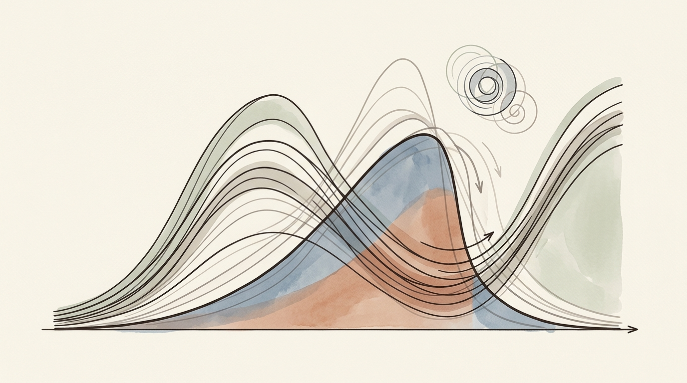
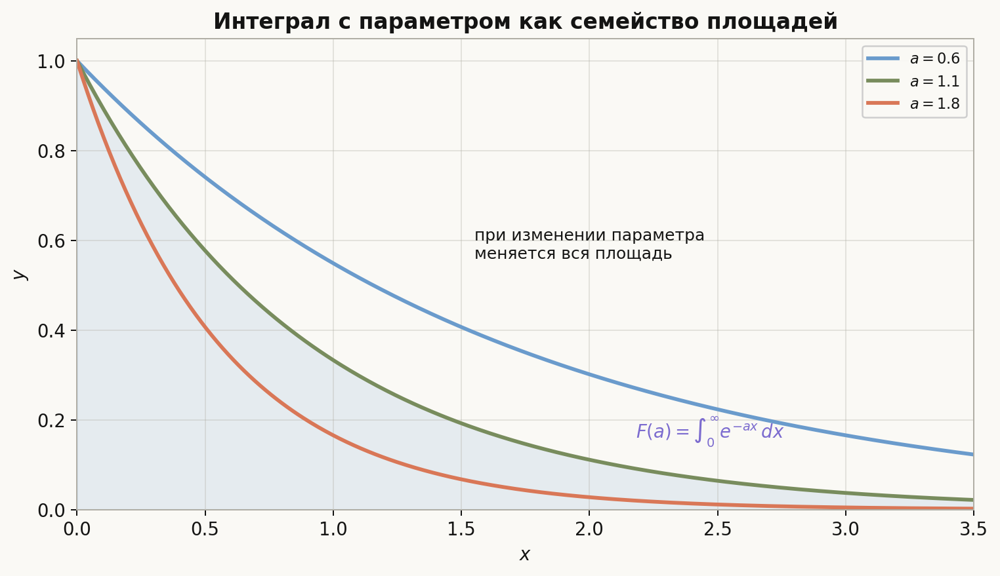
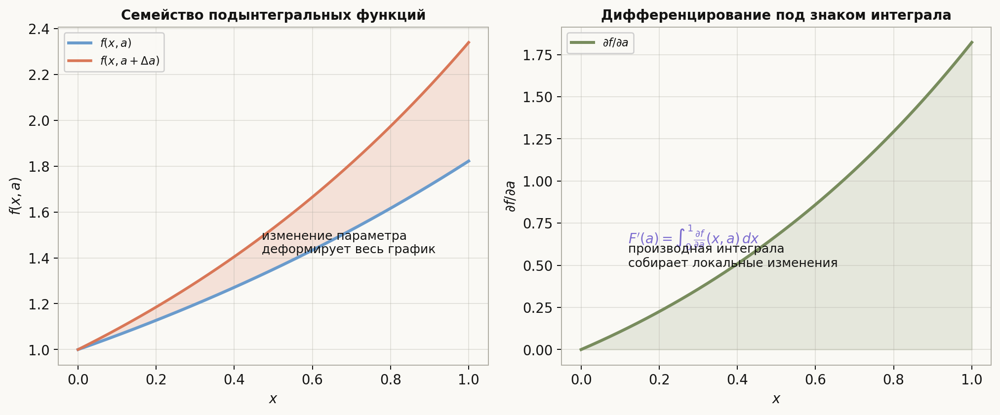
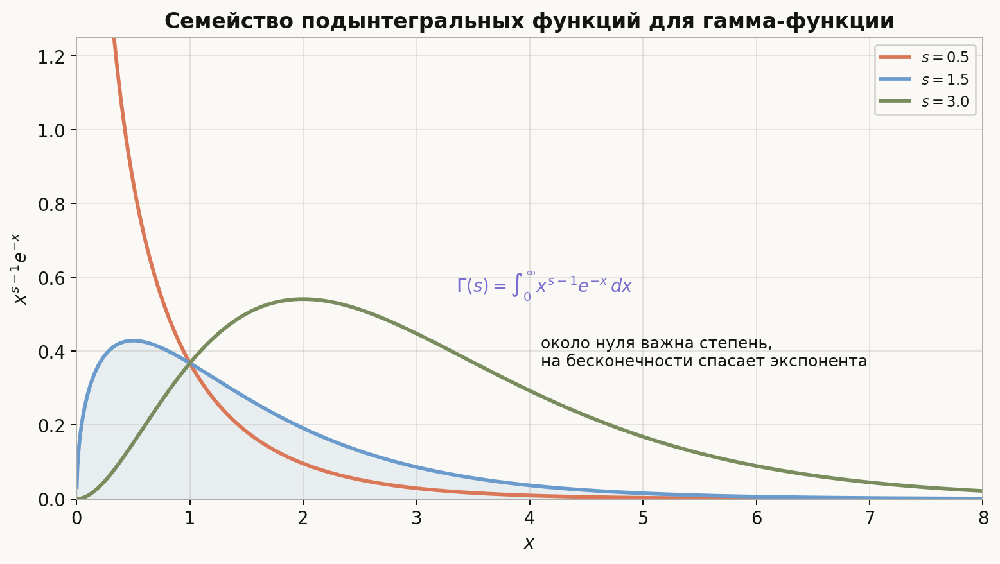
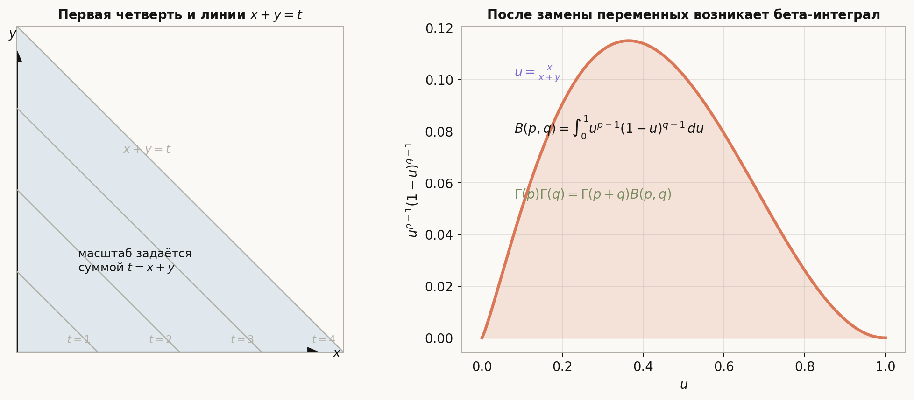
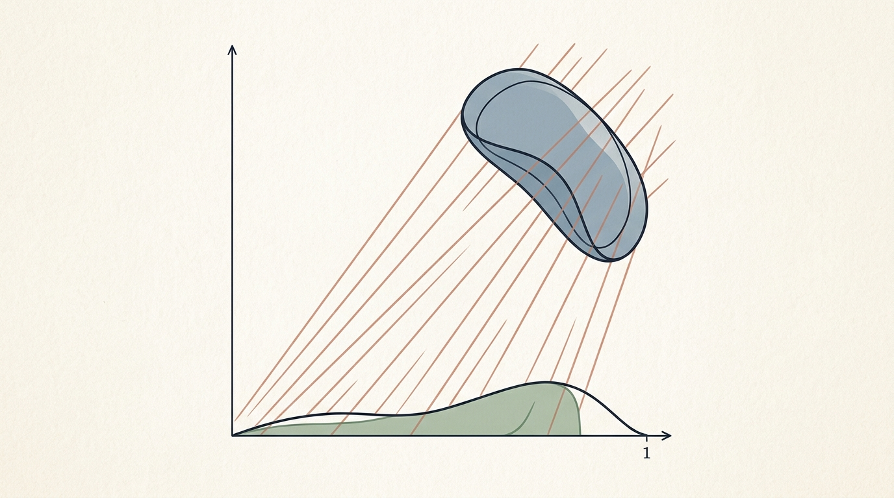

# Лекция: интегралы с параметром, гамма- и бета-функции

## План

1. Что такое интеграл с параметром
2. Почему эта тема важна
3. Непрерывность интеграла с параметром
4. Дифференцирование под знаком интеграла
5. Типичные примеры вычислений
6. Гамма-функция
7. Бета-функция
8. Связь между бета- и гамма-функциями
9. Типичные ошибки
10. Что важно для поступления в ШАД
11. Итог
12. Вопросы для самопроверки

---

## 1. Что такое интеграл с параметром

Обычный определённый интеграл даёт число:
$$
\int_a^b f(x)\,dx.
$$

Интеграл с параметром даёт уже **функцию параметра**. Например,
$$
F(\alpha)=\int_0^1 f(x,\alpha)\,dx.
$$

Здесь:

- $x$ — переменная интегрирования;
- $\alpha$ — внешний параметр;
- после интегрирования по $x$ остаётся зависимость от $\alpha$.

Главная идея темы такая: если функция $f(x,\alpha)$ хорошо ведёт себя по параметру, то и функция
$$
F(\alpha)=\int f(x,\alpha)\,dx
$$
тоже наследует хорошие свойства: непрерывность, дифференцируемость, иногда даже аналитичность.

### Простой пример

Рассмотрим
$$
F(a)=\int_0^1 x^a\,dx,\qquad a>-1.
$$

После вычисления получаем
$$
F(a)=\frac{1}{a+1}.
$$

То есть один и тот же интеграл по переменной $x$ породил уже функцию параметра $a$.

### Геометрическая интуиция

При фиксированном параметре $a$ мы берём обычную площадь под графиком функции $x\mapsto f(x,a)$. Если поменять параметр, меняется сам график, а вместе с ним меняется и площадь. Значит, интеграл с параметром можно понимать как закон изменения площади при деформации семейства графиков.

---

## 2. Почему эта тема важна

Эта тема возникает во многих стандартных сюжетах анализа.

- Так вычисляют сложные интегралы через введение параметра.
- Так получают новые формулы из уже известных, дифференцируя по параметру.
- Так определяют специальные функции, в частности $\Gamma$ и $B$.
- Так переходят от геометрической картины к вероятностным распределениям, асимптотике и преобразованиям Фурье.

Для вступительного уровня особенно важно уверенно понимать три вещи:

1. когда можно перейти к пределу под знаком интеграла;
2. когда можно дифференцировать под знаком интеграла;
3. как из интегральных определений выводятся свойства $\Gamma$- и $B$-функций.

---

## 3. Непрерывность интеграла с параметром

Рассмотрим функцию
$$
F(\alpha)=\int_a^b f(x,\alpha)\,dx.
$$

Хотим понять: когда функция $F(\alpha)$ непрерывна по параметру?

### Базовая идея

Если при $\alpha\to \alpha_0$ функции $f(x,\alpha)$ для каждого $x$ меняются непрерывно и при этом не происходит "взрыва" по $x$, то можно ожидать, что и интеграл тоже будет меняться непрерывно.

### Удобная достаточная теорема

Пусть:

- для каждого $x\in [a,b]$ функция $\alpha\mapsto f(x,\alpha)$ непрерывна в точке $\alpha_0$;
- существует интегрируемая функция $g(x)$ такая, что
$$
|f(x,\alpha)|\le g(x)
$$
для всех $\alpha$ из некоторой окрестности точки $\alpha_0$ и всех $x\in[a,b]$.

Тогда функция
$$
F(\alpha)=\int_a^b f(x,\alpha)\,dx
$$
непрерывна в точке $\alpha_0$.

### Почему здесь нужна мажоранта

Поточечная непрерывность по $\alpha$ сама по себе ещё не гарантирует, что можно перейти к пределу под знаком интеграла. Нужен единый контроль по переменной $x$, чтобы интеграл не "потерял устойчивость" на малых или больших значениях.

По существу здесь работает идея теоремы о мажорируемой сходимости:
$$
f(x,\alpha)\to f(x,\alpha_0)
$$
и одновременно
$$
|f(x,\alpha)|\le g(x),\qquad g\in L^1.
$$

Тогда
$$
F(\alpha)\to F(\alpha_0).
$$

### Пример

Рассмотрим
$$
F(a)=\int_0^1 x^a\,dx,\qquad a>-1.
$$

Для любого фиксированного $x\in(0,1]$ функция $x^a$ непрерывна по $a$. Если взять параметр $a$ в окрестности точки $a_0>-1$, то можно выбрать число $\delta>0$ так, что
$$
a\ge a_0-\delta>-1.
$$

Тогда на $(0,1]$ имеем
$$
0\le x^a\le x^{a_0-\delta}.
$$

Функция $x^{a_0-\delta}$ интегрируема на $[0,1]$, поскольку показатель больше $-1$. Значит, $F(a)$ непрерывна по $a$.

---

## 4. Дифференцирование под знаком интеграла

Это один из самых полезных приёмов темы.

### Постановка

Пусть
$$
F(\alpha)=\int_a^b f(x,\alpha)\,dx.
$$

Когда можно написать
$$
F'(\alpha)=\int_a^b \frac{\partial f}{\partial \alpha}(x,\alpha)\,dx?
$$

### Достаточные условия

Пусть:

- функция $f(x,\alpha)$ определена на $[a,b]\times I$;
- частная производная $\dfrac{\partial f}{\partial \alpha}(x,\alpha)$ существует;
- для каждого $x$ функция $\dfrac{\partial f}{\partial \alpha}(x,\alpha)$ непрерывна по $\alpha$;
- существует интегрируемая функция $g(x)$ такая, что
$$
\left|\frac{\partial f}{\partial \alpha}(x,\alpha)\right|\le g(x)
$$
для всех $\alpha\in I$ и всех $x\in[a,b]$.

Тогда функция
$$
F(\alpha)=\int_a^b f(x,\alpha)\,dx
$$
дифференцируема на $I$, и
$$
F'(\alpha)=\int_a^b \frac{\partial f}{\partial \alpha}(x,\alpha)\,dx.
$$

### Смысл формулы

Изменение всего интеграла по параметру равно интегралу от локального изменения подынтегральной функции по этому параметру.

Это очень похоже на линейность производной: мы можем сначала дифференцировать "по кусочкам", а потом сложить результат.

### Если пределы тоже зависят от параметра

Более общая формула Лейбница выглядит так:
$$
\begin{aligned}
\frac{d}{d\alpha}\int_{u(\alpha)}^{v(\alpha)} f(x,\alpha)\,dx
&=
f(v(\alpha),\alpha)v'(\alpha)-f(u(\alpha),\alpha)u'(\alpha) \\
&\quad + \int_{u(\alpha)}^{v(\alpha)} \frac{\partial f}{\partial \alpha}(x,\alpha)\,dx.
\end{aligned}
$$

На вступительном уровне чаще всего достаточно хорошо понимать случай постоянных пределов и помнить, что при переменных пределах появляются ещё граничные слагаемые.

---

## 5. Типичные примеры вычислений

### Пример 1. Вычисляем сам интеграл

Рассмотрим
$$
F(a)=\int_0^\infty e^{-ax}\,dx,\qquad a>0.
$$

Интегрируем по $x$:
$$
F(a)=\left[-\frac{e^{-ax}}{a}\right]_0^\infty=\frac{1}{a}.
$$

Это классический пример интеграла с параметром.

### Пример 2. Получаем новый интеграл дифференцированием по параметру

Возьмём
$$
F(a)=\int_0^1 x^a\,dx=\frac{1}{a+1},\qquad a>-1.
$$

Дифференцируем по $a$. Поскольку
$$
\frac{\partial}{\partial a}x^a=x^a\ln x,
$$
получаем
$$
F'(a)=\int_0^1 x^a\ln x\,dx.
$$

С другой стороны,
$$
F'(a)=-\frac{1}{(a+1)^2}.
$$

Следовательно,
$$
\int_0^1 x^a\ln x\,dx=-\frac{1}{(a+1)^2},\qquad a>-1.
$$

Это очень типичный приём: сначала вычислить более простой параметрический интеграл, а затем извлечь из него новый.

### Пример 3. Второе дифференцирование

Ещё раз дифференцируя, получаем
$$
\int_0^1 x^a(\ln x)^2\,dx=\frac{2}{(a+1)^3},\qquad a>-1.
$$

Таким образом, параметр часто превращает семейство трудных интегралов в одну функцию, с которой проще работать.

---

## 6. Гамма-функция

### Определение

Для $s>0$ гамма-функция определяется интегралом
$$
\Gamma(s)=\int_0^\infty x^{s-1}e^{-x}\,dx.
$$

Это одна из главных специальных функций анализа.

### Почему интеграл сходится

Нужно проверить два участка:

1. около нуля;
2. на бесконечности.

Около нуля поведение определяется степенью $x^{s-1}$. Интеграл
$$
\int_0^1 x^{s-1}\,dx
$$
сходится тогда и только тогда, когда $s>0$.

На бесконечности множитель $e^{-x}$ убывает так быстро, что подавляет любую степень. Поэтому
$$
\int_1^\infty x^{s-1}e^{-x}\,dx
$$
сходится при любом фиксированном $s$.

Значит, $\Gamma(s)$ корректно определена для всех $s>0$.

### Главное рекуррентное свойство

Покажем, что
$$
\Gamma(s+1)=s\Gamma(s).
$$

Действительно,
$$
\Gamma(s+1)=\int_0^\infty x^s e^{-x}\,dx.
$$

Интегрируем по частям:
$$
\begin{aligned}
\Gamma(s+1)
&=\int_0^\infty x^s e^{-x}\,dx \\
&=\left[-x^s e^{-x}\right]_0^\infty + s\int_0^\infty x^{s-1}e^{-x}\,dx \\
&=s\Gamma(s).
\end{aligned}
$$

Граничные члены равны нулю: при $x\to\infty$ экспонента побеждает степень, а при $x\to 0+$ имеем $x^s\to 0$ при $s>0$.

### Связь с факториалом

Так как
$$
\Gamma(1)=\int_0^\infty e^{-x}\,dx=1,
$$
из рекуррентной формулы получаем
$$
\Gamma(n+1)=n!
$$
для любого натурального $n$.

То есть гамма-функция продолжает факториал с натуральных чисел на всю полуось $s>0$.

### Значение в точке $1/2$

Очень важный факт:
$$
\Gamma\left(\frac12\right)=\sqrt{\pi}.
$$

Он доказывается заменой $x=t^2$ и переходом к гауссову интегралу. Для вступительного экзамена чаще нужно помнить сам результат и понимать, что именно он связывает гамма-функцию с нормальным распределением и формулами объёмов шаров.

### Графическая интуиция

Подынтегральная функция
$$
x^{s-1}e^{-x}
$$
зависит от параметра $s$: возле нуля степень меняет поведение, а экспонента на бесконечности удерживает интеграл сходящимся.

---

## 7. Бета-функция

### Определение

Для $p>0$ и $q>0$ бета-функция определяется формулой
$$
B(p,q)=\int_0^1 x^{p-1}(1-x)^{q-1}\,dx.
$$

### Почему интеграл сходится

Проблемные точки здесь — это концы отрезка $0$ и $1$.

Около нуля имеем поведение как у $x^{p-1}$, поэтому нужна сходимость
$$
\int_0 x^{p-1}\,dx,
$$
то есть условие $p>0$.

Около единицы имеем поведение как у $(1-x)^{q-1}$, поэтому нужно $q>0$.

Значит, бета-функция определена именно при
$$
p>0,\qquad q>0.
$$

### Симметрия

Подстановкой $x=1-t$ получаем
$$
B(p,q)=B(q,p).
$$

Это сразу видно и по формуле: роли множителей $x^{p-1}$ и $(1-x)^{q-1}$ симметричны относительно замены концов отрезка.

### Пример

Вычислим
$$
B(2,3)=\int_0^1 x(1-x)^2\,dx.
$$

Раскрываем скобки:
$$
x(1-x)^2=x-2x^2+x^3.
$$

Тогда
$$
\begin{aligned}
B(2,3)
&=\int_0^1 (x-2x^2+x^3)\,dx \\
&=\left[\frac{x^2}{2}-\frac{2x^3}{3}+\frac{x^4}{4}\right]_0^1 \\
&=\frac12-\frac23+\frac14
=\frac{1}{12}.
\end{aligned}
$$

---

## 8. Связь между бета- и гамма-функциями

Это центральная формула всей темы:
$$
B(p,q)=\frac{\Gamma(p)\Gamma(q)}{\Gamma(p+q)}.
$$

### Идея доказательства

Рассмотрим произведение двух гамма-функций:
$$
\Gamma(p)\Gamma(q)=
\int_0^\infty x^{p-1}e^{-x}\,dx
\int_0^\infty y^{q-1}e^{-y}\,dy.
$$

Объединяя интегралы, получаем двойной интеграл по первой четверти:
$$
\Gamma(p)\Gamma(q)=
\iint_{x>0,\ y>0} x^{p-1}y^{q-1}e^{-(x+y)}\,dx\,dy.
$$

Теперь делаем замену переменных
$$
\begin{cases}
x=tu,\\
y=t(1-u),
\end{cases}
\qquad t>0,\quad 0<u<1.
$$

Здесь:

- $t=x+y$ отвечает за "общий масштаб";
- $u=\dfrac{x}{x+y}$ отвечает за относительную долю.

Якобиан этой замены равен $t$, поэтому
$$
dx\,dy=t\,dt\,du.
$$

После замены:
$$
\begin{aligned}
\Gamma(p)\Gamma(q)
&=\int_0^\infty\int_0^1
(tu)^{p-1}(t(1-u))^{q-1}e^{-t}\,t\,du\,dt \\
&=\int_0^\infty t^{p+q-1}e^{-t}\,dt
\int_0^1 u^{p-1}(1-u)^{q-1}\,du \\
&=\Gamma(p+q)\,B(p,q).
\end{aligned}
$$

Следовательно,
$$
B(p,q)=\frac{\Gamma(p)\Gamma(q)}{\Gamma(p+q)}.
$$

### Почему эта формула полезна

Она позволяет вычислять многие бета-интегралы через факториалы и значения гамма-функции.

Например,
$$
B(m,n)=\frac{(m-1)!(n-1)!}{(m+n-1)!}
$$
для натуральных $m,n$.

### Пример

Для $p=2$, $q=3$ получаем
$$
B(2,3)=\frac{\Gamma(2)\Gamma(3)}{\Gamma(5)}
=\frac{1!\,2!}{4!}
=\frac{2}{24}
=\frac{1}{12},
$$
что совпадает с прямым вычислением.

---

## 9. Типичные ошибки

- Путать переменную интегрирования и параметр. В выражении $\int_0^1 f(x,a)\,dx$ переменная $x$ исчезает после интегрирования, а параметр $a$ остаётся.
- Дифференцировать под знаком интеграла без проверки условий.
- Забывать, что у бета- и гамма-функций есть ограничения на параметры: $p>0$, $q>0$, $s>0$.
- Неправильно анализировать сходимость у концов интеграла: около $0$ и около $\infty$ работают разные механизмы.
- Терять якобиан в доказательстве связи между $B$ и $\Gamma$.
- Писать $\Gamma(n)=n!$ вместо верного равенства $\Gamma(n+1)=n!$.

---

## 10. Что важно для поступления в ШАД

Для уверенного уровня по этой теме нужно уметь:

- понимать, что такое интеграл с параметром как функция параметра;
- применять базовую схему непрерывности и дифференцируемости под знаком интеграла;
- вычислять стандартные параметрические интегралы;
- знать определения $\Gamma(s)$ и $B(p,q)$;
- выводить формулы
$$
\Gamma(s+1)=s\Gamma(s)
$$
и
$$
B(p,q)=\frac{\Gamma(p)\Gamma(q)}{\Gamma(p+q)};
$$
- помнить, что $\Gamma(n+1)=n!$ и $\Gamma(1/2)=\sqrt{\pi}$.

Если задача на экзамене выглядит непривычно, часто помогает ввести параметр, вычислить семейство интегралов, а затем продифференцировать по параметру.

---

## 11. Итог

Интеграл с параметром — это способ получить из семейства функций одну новую функцию параметра:
$$
F(\alpha)=\int f(x,\alpha)\,dx.
$$

При хороших условиях можно:

- переходить к пределу под знаком интеграла;
- дифференцировать под знаком интеграла;
- извлекать новые формулы из уже известных.

Гамма- и бета-функции — важнейшие примеры таких объектов:
$$
\Gamma(s)=\int_0^\infty x^{s-1}e^{-x}\,dx,
\qquad
B(p,q)=\int_0^1 x^{p-1}(1-x)^{q-1}\,dx.
$$

Они связаны формулой
$$
B(p,q)=\frac{\Gamma(p)\Gamma(q)}{\Gamma(p+q)},
$$
которая объединяет параметрические интегралы, замену переменных и специальные функции в одну общую картину.

---

## 12. Вопросы для самопроверки

1. Что именно называется интегралом с параметром?
2. Чем параметр отличается от переменной интегрирования?
3. Зачем для непрерывности интеграла с параметром нужна интегрируемая мажоранта?
4. При каких условиях можно дифференцировать под знаком интеграла?
5. Как с помощью параметра получить интеграл $\int_0^1 x^a\ln x\,dx$?
6. Почему гамма-функция сходится только при $s>0$?
7. Как выводится рекуррентная формула $\Gamma(s+1)=s\Gamma(s)$?
8. Почему $\Gamma(n+1)=n!$, а не $\Gamma(n)=n!$?
9. При каких $p$ и $q$ сходится бета-функция?
10. В чём состоит замена переменных, которая связывает $B$ и $\Gamma$?
