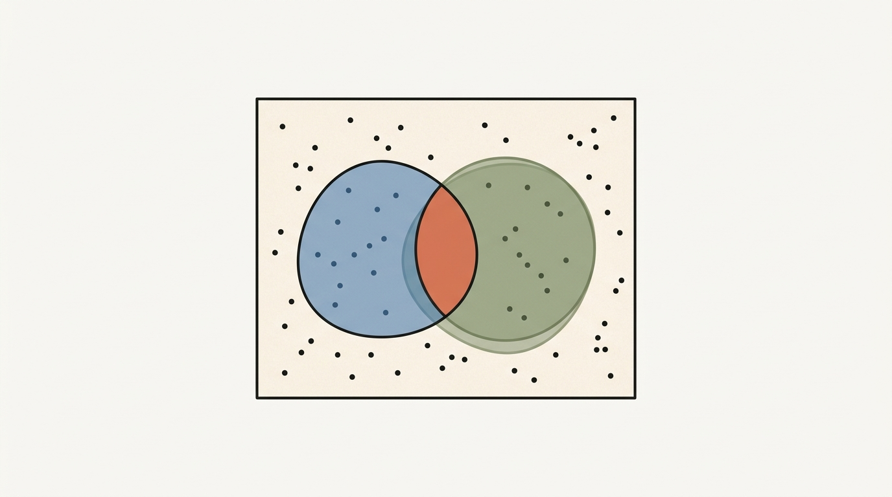
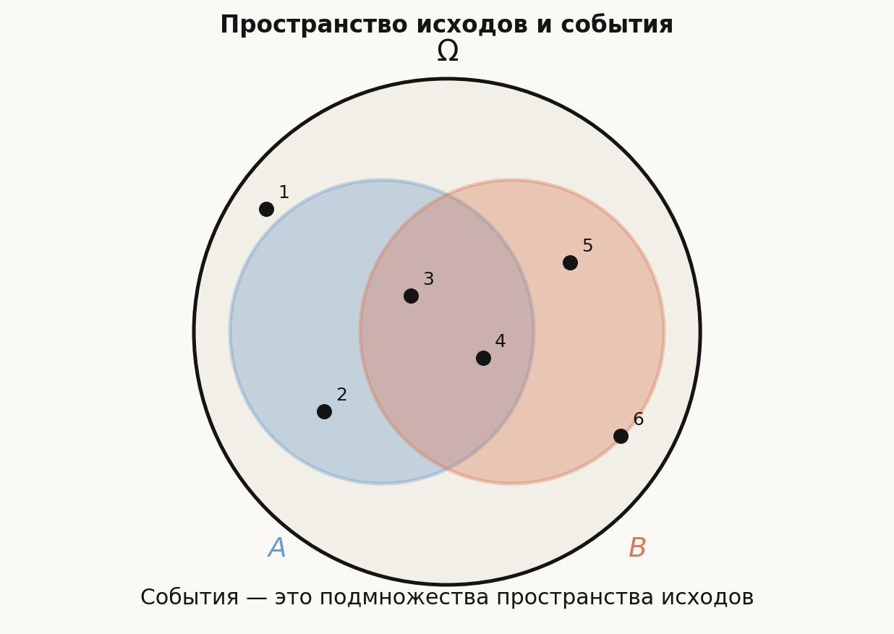
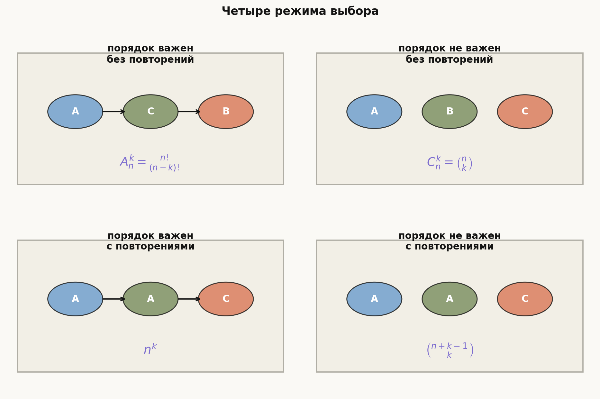
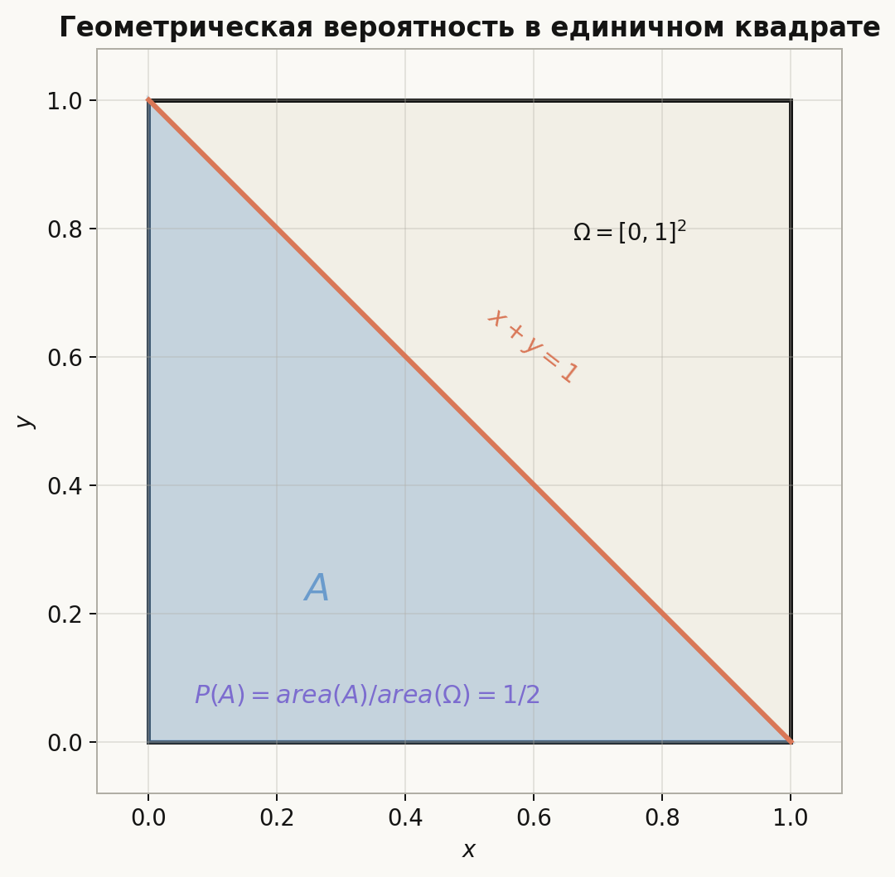

# Лекция: основные понятия теории вероятностей

## План

1. Случайный эксперимент, исходы и события
2. Вероятностное пространство
3. Дискретная модель
4. Классическая вероятностная модель
5. Выборки с порядком и без порядка
6. Упорядоченные и неупорядоченные наборы
7. Аксиомы Колмогорова
8. Следствия из аксиом
9. Геометрическая вероятность
10. Типичные ошибки
11. Что важно для поступления в ШАД
12. Итог
13. Вопросы для самопроверки

---

## 1. Случайный эксперимент, исходы и события

Теория вероятностей начинается с описания эксперимента, результат которого заранее неизвестен.

Примеры:

- бросили монету;
- бросили кубик;
- выбрали карту из колоды;
- случайно выбрали точку в квадрате;
- перемешали $n$ различных предметов.

### Пространство исходов

**Пространством элементарных исходов** называется множество всех возможных результатов эксперимента. Обычно его обозначают $\Omega$.

Пример для одного броска кубика:
$$
\Omega=\{1,2,3,4,5,6\}.
$$

Элементарный исход — это один конкретный результат, например $\omega=4$.

### События

**Событие** — это множество исходов, то есть подмножество $A\subseteq\Omega$.

Например, при броске кубика событие "выпало чётное число" равно
$$
A=\{2,4,6\}.
$$

Событие произошло, если фактический исход $\omega$ попал в $A$.

### Операции над событиями

Если события — это множества, то над ними работают обычные операции:

- $A\cup B$ — произошло хотя бы одно из событий $A$ и $B$;
- $A\cap B$ — произошли оба события;
- $\overline A=\Omega\setminus A$ — событие $A$ не произошло;
- $A\setminus B$ — произошло $A$, но не произошло $B$;
- $A\triangle B$ — произошло ровно одно из событий $A$ и $B$.

Если $A\cap B=\varnothing$, события называются **несовместными**.

---

## 2. Вероятностное пространство

### Определение

**Вероятностное пространство** — это тройка
$$
(\Omega,\mathcal F,\mathbb P),
$$
где:

- $\Omega$ — пространство элементарных исходов;
- $\mathcal F$ — множество событий, то есть допустимых подмножеств $\Omega$;
- $\mathbb P$ — вероятность, которая каждому событию $A\in\mathcal F$ сопоставляет число $\mathbb P(A)$.

В конечных и счётных дискретных задачах обычно можно считать, что $\mathcal F$ состоит из всех подмножеств $\Omega$.

### Зачем нужна $\mathcal F$

В конечной модели можно не замечать разницы между $\Omega$ и $\mathcal F$: любое подмножество исходов является событием. Но в непрерывных моделях не всякое подмножество удобно считать событием. Поэтому формально события живут в специальном семействе $\mathcal F$.

Для вступительных задач чаще всего достаточно помнить:
$$
A\in\mathcal F,\qquad \mathbb P(A)\in[0,1].
$$

---

## 3. Дискретная модель

Пусть $\Omega$ конечно или счётно:
$$
\Omega=\{\omega_1,\omega_2,\dots\}.
$$

Вероятность задаётся весами элементарных исходов:
$$
p_i=\mathbb P(\{\omega_i\}),\qquad p_i\ge 0,\qquad \sum_i p_i=1.
$$

Тогда для любого события $A$:
$$
\mathbb P(A)=\sum_{\omega_i\in A}p_i.
$$

### Пример

Пусть кубик нечестный, и вероятности граней равны
$$
\mathbb P(1)=\mathbb P(2)=\mathbb P(3)=\mathbb P(4)=\mathbb P(5)=0.1,\qquad \mathbb P(6)=0.5.
$$

Тогда вероятность события $A=\{2,4,6\}$ равна
$$
\mathbb P(A)=0.1+0.1+0.5=0.7.
$$

---

## 4. Классическая вероятностная модель

Классическая модель применяется, когда:

1. пространство исходов конечно;
2. все элементарные исходы равновероятны.

Если $|\Omega|=N$, то каждый исход имеет вероятность $1/N$. Поэтому для события $A\subseteq\Omega$:
$$
\mathbb P(A)=\frac{|A|}{|\Omega|}.
$$

Эта формула — основа большинства элементарных задач на вероятность.

### Пример

Бросают честный кубик. Событие $A$ — выпало число больше $4$:
$$
A=\{5,6\}.
$$

Тогда
$$
\mathbb P(A)=\frac{2}{6}=\frac13.
$$

### Важное предупреждение

Нельзя применять формулу $\mathbb P(A)=|A|/|\Omega|$, если исходы не равновероятны. В таком случае нужно суммировать веса исходов.

---

## 5. Выборки с порядком и без порядка

Многие вероятностные задачи сводятся к аккуратному подсчёту исходов. Главное — правильно понять, что считается одним исходом.

Пусть есть $n$ различных объектов, и мы выбираем $k$ объектов.

### Выбор с порядком без повторений

Порядок важен, один объект нельзя выбрать дважды. Число исходов:
$$
A_n^k=n(n-1)\dots(n-k+1)=\frac{n!}{(n-k)!}.
$$

Пример: выбрать президента, секретаря и казначея из $10$ человек.

### Выбор без порядка без повторений

Порядок не важен, один объект нельзя выбрать дважды. Число исходов:
$$
C_n^k=\binom nk=\frac{n!}{k!(n-k)!}.
$$

Пример: выбрать комитет из $3$ человек из $10$.

### Выбор с порядком с повторениями

Порядок важен, объекты можно повторять. Число исходов:
$$
n^k.
$$

Пример: пароль длины $k$ из алфавита мощности $n$.

### Выбор без порядка с повторениями

Порядок не важен, повторения разрешены. Число исходов:
$$
\binom{n+k-1}{k}.
$$

Пример: выбрать $k$ конфет из $n$ видов, если конфет каждого вида достаточно много.

---

## 6. Упорядоченные и неупорядоченные наборы

В задачах часто ошибка возникает не в вероятности, а в выборе модели.

### Упорядоченная пара

Если бросают два кубика, естественное пространство исходов:
$$
\Omega=\{(i,j)\mid i,j\in\{1,\dots,6\}\}.
$$

Здесь $(1,6)$ и $(6,1)$ — разные исходы. Всего $36$ исходов.

### Неупорядоченная пара

Если из мешка одновременно достают два шара, порядок обычно не важен. Тогда исход $\{a,b\}$ совпадает с $\{b,a\}$.

### Почему это важно

Если заменить упорядоченную модель на неупорядоченную без проверки равновероятности, можно получить неверный ответ. Например, при двух бросках кубика неупорядоченные результаты $\{1,1\}$ и $\{1,2\}$ не равновероятны: первый возникает одним способом, второй — двумя.

---

## 7. Аксиомы Колмогорова

Пусть задано пространство событий $\mathcal F$. Вероятность $\mathbb P$ должна удовлетворять трём аксиомам.

### Аксиома 1. Неотрицательность

Для любого события $A$:
$$
\mathbb P(A)\ge 0.
$$

### Аксиома 2. Нормировка

Вероятность достоверного события равна $1$:
$$
\mathbb P(\Omega)=1.
$$

### Аксиома 3. Счётная аддитивность

Если события $A_1,A_2,\dots$ попарно несовместны, то
$$
\mathbb P\left(\bigcup_{i=1}^{\infty}A_i\right)=\sum_{i=1}^{\infty}\mathbb P(A_i).
$$

В конечных задачах чаще используется частный случай:
$$
\mathbb P(A\cup B)=\mathbb P(A)+\mathbb P(B)
$$
для несовместных событий $A$ и $B$.

### Пример: проверка аксиом на конкретном пространстве

Бросаем монету дважды. $\Omega = \{\text{ОО}, \text{ОР}, \text{РО}, \text{РР}\}$, $|\Omega| = 4$.

Определим $\mathbb{P}(A) = |A|/4$ (равновероятные исходы).

Проверим аксиомы:
1. $\mathbb{P}(A) = |A|/4 \ge 0$ — выполнено, так как $|A| \ge 0$.
2. $\mathbb{P}(\Omega) = 4/4 = 1$ ✓.
3. $A = \{\text{ОО}, \text{ОР}\}$, $B = \{\text{РО}\}$, $A \cap B = \emptyset$:
$$\mathbb{P}(A \cup B) = \frac{|\{\text{ОО},\text{ОР},\text{РО}\}|}{4} = \frac{3}{4} = \frac{2}{4} + \frac{1}{4} = \mathbb{P}(A)+\mathbb{P}(B). \checkmark$$

---

## 8. Следствия из аксиом

### Вероятность пустого события

$$
\mathbb P(\varnothing)=0.
$$

Действительно, $\Omega=\Omega\cup\varnothing$, причём события несовместны. Поэтому
$$
1=\mathbb P(\Omega)=\mathbb P(\Omega)+\mathbb P(\varnothing),
$$
откуда $\mathbb P(\varnothing)=0$.

### Дополнение события

Так как $A$ и $\overline A$ несовместны, а $A\cup\overline A=\Omega$, имеем
$$
\mathbb P(\overline A)=1-\mathbb P(A).
$$

### Монотонность

Если $A\subseteq B$, то
$$
\mathbb P(A)\le \mathbb P(B).
$$

Причина: $B=A\cup(B\setminus A)$, где объединение несовместно.

### Формула сложения

Для любых событий $A$ и $B$:
$$
\mathbb P(A\cup B)=\mathbb P(A)+\mathbb P(B)-\mathbb P(A\cap B).
$$

Вычитаем $\mathbb P(A\cap B)$, потому что пересечение было посчитано дважды.

---

## 9. Геометрическая вероятность

Геометрическая вероятность используется, когда исход — точка в геометрической области, выбранная равномерно.

Если точка равномерно выбирается из области $\Omega$, а событие $A\subseteq\Omega$, то
$$
\mathbb P(A)=\frac{\operatorname{mes}(A)}{\operatorname{mes}(\Omega)}.
$$

Здесь $\operatorname{mes}$ означает длину, площадь или объём в зависимости от задачи.

### Пример с отрезком

Точка равномерно выбирается на отрезке $[0,1]$. Найти вероятность события $x\le 0.3$.

Событие — отрезок $[0,0.3]$, поэтому
$$
\mathbb P(x\le 0.3)=\frac{0.3}{1}=0.3.
$$

### Пример с квадратом

Точка равномерно выбирается в единичном квадрате $[0,1]^2$. Найти вероятность события $x+y\le 1$.

Область $x+y\le 1$ внутри квадрата — прямоугольный треугольник площади $1/2$. Площадь квадрата равна $1$. Значит,
$$
\mathbb P(x+y\le 1)=\frac12.
$$

---

## 10. Типичные ошибки

### Ошибка 1. Считать все видимые варианты равновероятными

При двух бросках кубика неупорядоченные пары не равновероятны. Модель с $36$ упорядоченными исходами обычно безопаснее.

### Ошибка 2. Путать событие и элементарный исход

Исход — один результат $\omega$. Событие — множество исходов $A\subseteq\Omega$.

### Ошибка 3. Применять сложение без проверки несовместности

Формула $\mathbb P(A\cup B)=\mathbb P(A)+\mathbb P(B)$ верна только при $A\cap B=\varnothing$.

### Ошибка 4. Забывать нормировку

В дискретной модели веса исходов должны суммироваться в $1$.

### Ошибка 5. В геометрической вероятности считать "похожие" области равными

Нужно сравнивать длины, площади или объёмы, а не визуальное впечатление.

---

## 11. Что важно для поступления в ШАД

Нужно уверенно уметь:

- задавать пространство исходов $\Omega$;
- отличать исходы от событий;
- выбирать между упорядоченной и неупорядоченной моделью;
- считать число исходов через размещения, перестановки и сочетания;
- применять формулу классической вероятности только при равновероятности;
- пользоваться аксиомами Колмогорова и их следствиями;
- решать простые задачи на геометрическую вероятность через отношение мер.

---

## 12. Итог

Вероятность — это функция на событиях, удовлетворяющая аксиомам Колмогорова. В конечной равновероятной модели вероятность события равна доле благоприятных исходов. В общей дискретной модели вероятность события равна сумме весов входящих в него исходов. В геометрической модели вероятность равна отношению меры благоприятной области к мере всей области.

Главный практический навык первой темы — правильно построить модель эксперимента. После этого вычисление вероятности обычно сводится к подсчёту или к сравнению геометрических мер.

---

## 13. Вопросы для самопроверки

1. Чем элементарный исход отличается от события?
2. Что входит в тройку $(\Omega,\mathcal F,\mathbb P)$?
3. Когда можно использовать формулу $\mathbb P(A)=|A|/|\Omega|$?
4. Почему при двух бросках кубика удобнее считать упорядоченные пары?
5. Сколько существует выборок длины $k$ из $n$ объектов с порядком и повторениями?
6. Сколько существует выборок без порядка и без повторений?
7. Как вывести формулу $\mathbb P(\overline A)=1-\mathbb P(A)$ из аксиом?
8. Почему в формуле сложения нужно вычитать $\mathbb P(A\cap B)$?
9. Что означает равномерный выбор точки из области?
10. Как решать задачу на геометрическую вероятность в квадрате или круге?
