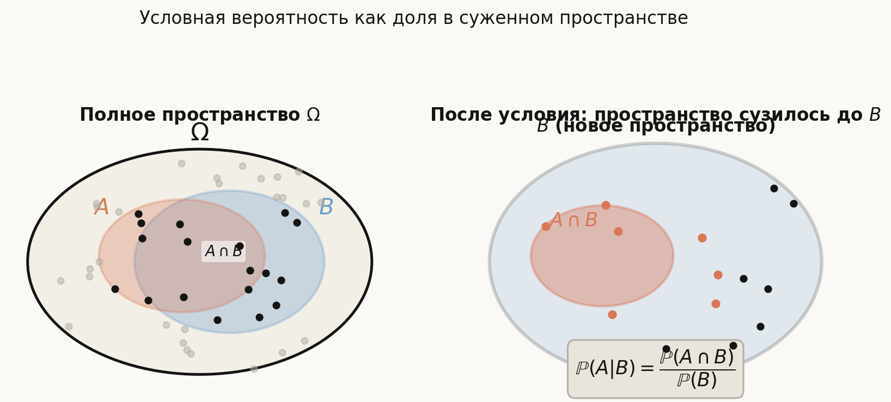
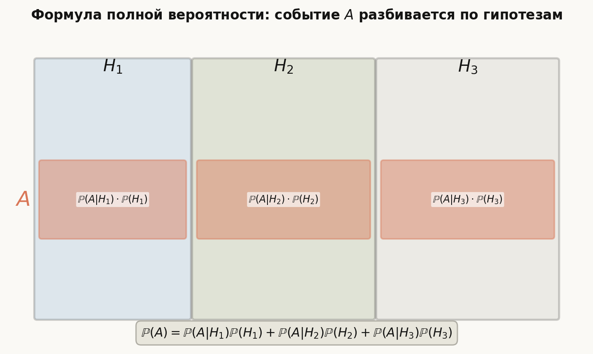

# Лекция: условные вероятности

В первой лекции мы задали вероятностное пространство $(\Omega, \mathcal{F}, \mathbb{P})$ и научились считать вероятности событий в классической и геометрической моделях. Но на практике нас часто интересует вопрос: как изменяется вероятность события $A$, если мы узнали, что произошло событие $B$? Именно это описывает **условная вероятность** — центральный инструмент всей прикладной теории вероятностей.

Главная линия лекции:
$$
\text{условная вероятность} \to \text{умножение} \to \text{полная вероятность} \to \text{Байес} \to \text{независимость}.
$$

Как читать эту лекцию:

- разделы 1–3 вводят условную вероятность и формулу умножения;
- разделы 4–5 — формула полной вероятности и формула Байеса (самые используемые инструменты);
- разделы 6–7 — независимость: определение, попарная против совокупной;
- раздел 8 — частые путаницы;
- разделы 9–12 — ошибки, ориентир для ШАД, итог, самопроверка.

---

## План

1. Мотивация: зачем нужна условная вероятность
2. Определение условной вероятности
3. Умножение вероятностей
4. Формула полной вероятности
5. Формула Байеса
6. Независимость двух событий
7. Попарная независимость и независимость в совокупности
8. Независимость и несовместность — частые путаницы
9. Типичные ошибки
10. Что важно для поступления в ШАД
11. Итог
12. Вопросы для самопроверки

---

## 1. Мотивация: зачем нужна условная вероятность

Предположим, мы знаем, что при броске кубика выпало чётное число. Как изменяется вероятность того, что выпала $6$?

Без информации: $\mathbb P(6)=1/6$.  
С информацией "выпало чётное": теперь возможны только $\{2,4,6\}$, и $6$ — один из трёх равновероятных вариантов, то есть вероятность становится $1/3$.

Новая вероятность называется **условной**: мы пересчитали её с учётом события-условия.

---

## 2. Определение условной вероятности

### Определение

Пусть $(\Omega, \mathcal{F}, \mathbb P)$ — вероятностное пространство и $B \in \mathcal{F}$ — событие с $\mathbb P(B) > 0$.

**Условная вероятность** события $A$ при условии $B$:

$$
\mathbb P(A \mid B) = \frac{\mathbb P(A \cap B)}{\mathbb P(B)}.
$$

### Геометрический смысл

Условие $B$ "сужает" пространство исходов до $B$. Внутри этого нового пространства нас интересует доля исходов, попавших также и в $A$, то есть $A \cap B$.

### Пример: кубик

Бросают честный кубик. $A = \{6\}$, $B = \{2, 4, 6\}$.

$$
\mathbb P(A \cap B) = \mathbb P(\{6\}) = \frac{1}{6}, \qquad \mathbb P(B) = \frac{3}{6} = \frac{1}{2}.
$$

$$
\mathbb P(A \mid B) = \frac{1/6}{1/2} = \frac{1}{3}.
$$

### Условная вероятность сама является вероятностью

При фиксированном $B$ функция $A \mapsto \mathbb P(A \mid B)$ удовлетворяет всем аксиомам Колмогорова на новом пространстве $B$:

- $\mathbb P(A \mid B) \ge 0$;
- $\mathbb P(B \mid B) = 1$;
- счётная аддитивность для попарно несовместных $A_i \subseteq B$.

---

## 3. Умножение вероятностей

Из определения условной вероятности немедленно получается формула умножения:

$$
\mathbb P(A \cap B) = \mathbb P(A \mid B) \cdot \mathbb P(B).
$$

Для трёх событий:

$$
\mathbb P(A \cap B \cap C) = \mathbb P(A \mid B \cap C) \cdot \mathbb P(B \mid C) \cdot \mathbb P(C).
$$

В общем виде для $n$ событий:

$$
\mathbb P(A_1 \cap A_2 \cap \cdots \cap A_n) = \mathbb P(A_1) \cdot \mathbb P(A_2 \mid A_1) \cdot \mathbb P(A_3 \mid A_1 \cap A_2) \cdots \mathbb P(A_n \mid A_1 \cap \cdots \cap A_{n-1}).
$$

### Пример: карты без возврата

Из колоды в $52$ карты последовательно достают две карты. Найти вероятность того, что обе — тузы.

$$
\mathbb P(\text{два туза}) = \mathbb P(\text{1-я туз}) \cdot \mathbb P(\text{2-я туз} \mid \text{1-я туз}) = \frac{4}{52} \cdot \frac{3}{51} = \frac{12}{2652} = \frac{1}{221}.
$$

---

## 4. Формула полной вероятности

### Полная группа событий

События $H_1, H_2, \ldots, H_n$ образуют **полную группу** (разбиение $\Omega$), если:

- они попарно несовместны: $H_i \cap H_j = \varnothing$ при $i \ne j$;
- их объединение равно всему пространству: $H_1 \cup H_2 \cup \cdots \cup H_n = \Omega$;
- $\mathbb P(H_i) > 0$ для всех $i$.

### Формулировка

Если $H_1, \ldots, H_n$ — полная группа событий, то для любого события $A$:

$$
\mathbb P(A) = \sum_{i=1}^{n} \mathbb P(A \mid H_i) \cdot \mathbb P(H_i).
$$

### Вывод

Так как $H_i$ разбивают $\Omega$, то и $A$ разбивается на несовместные части $A \cap H_i$:

$$
A = (A \cap H_1) \cup (A \cap H_2) \cup \cdots \cup (A \cap H_n).
$$

По аддитивности и формуле умножения:

$$
\mathbb P(A) = \sum_{i=1}^{n} \mathbb P(A \cap H_i) = \sum_{i=1}^{n} \mathbb P(A \mid H_i) \cdot \mathbb P(H_i).
$$

### Пример: две урны

В первой урне $3$ красных и $7$ синих шара, во второй — $6$ красных и $4$ синих. Выбирают урну случайно (с равными вероятностями $1/2$), затем достают один шар. Найти вероятность того, что шар красный.

Гипотезы: $H_1$ — выбрана первая урна, $H_2$ — вторая. $\mathbb P(H_1) = \mathbb P(H_2) = 1/2$.

$$
\mathbb P(\text{красный} \mid H_1) = \frac{3}{10}, \qquad \mathbb P(\text{красный} \mid H_2) = \frac{6}{10}.
$$

$$
\mathbb P(\text{красный}) = \frac{3}{10} \cdot \frac{1}{2} + \frac{6}{10} \cdot \frac{1}{2} = \frac{3}{20} + \frac{6}{20} = \frac{9}{20}.
$$

---

## 5. Формула Байеса

### Формулировка

При тех же условиях (полная группа $H_1, \ldots, H_n$, $\mathbb P(A) > 0$):

$$
\mathbb P(H_k \mid A) = \frac{\mathbb P(A \mid H_k) \cdot \mathbb P(H_k)}{\displaystyle\sum_{i=1}^{n} \mathbb P(A \mid H_i) \cdot \mathbb P(H_i)}.
$$

### Смысл

Формула Байеса позволяет обновить вероятность гипотезы $H_k$ после наблюдения события $A$:

- $\mathbb P(H_k)$ — **априорная** вероятность (до наблюдения);
- $\mathbb P(H_k \mid A)$ — **апостериорная** вероятность (после наблюдения).

### Вывод

По определению условной вероятности и формуле умножения:

$$
\mathbb P(H_k \mid A) = \frac{\mathbb P(H_k \cap A)}{\mathbb P(A)} = \frac{\mathbb P(A \mid H_k) \cdot \mathbb P(H_k)}{\mathbb P(A)}.
$$

Знаменатель раскрывается по формуле полной вероятности.

### Пример: медицинский тест

Болезнь встречается у $1\%$ населения. Тест даёт положительный результат у $95\%$ больных и у $5\%$ здоровых. Пациент сдал тест — результат положительный. Найти вероятность того, что пациент болен.

Гипотезы: $H_1$ — болен ($\mathbb P(H_1) = 0.01$), $H_2$ — здоров ($\mathbb P(H_2) = 0.99$).

Событие $A$ — положительный тест:

$$
\mathbb P(A \mid H_1) = 0.95, \qquad \mathbb P(A \mid H_2) = 0.05.
$$

Знаменатель (формула полной вероятности):

$$
\mathbb P(A) = 0.95 \cdot 0.01 + 0.05 \cdot 0.99 = 0.0095 + 0.0495 = 0.059.
$$

Формула Байеса:

$$
\mathbb P(H_1 \mid A) = \frac{0.95 \cdot 0.01}{0.059} = \frac{0.0095}{0.059} \approx 0.161.
$$

Даже при положительном тесте вероятность болезни всего около $16\%$ — из-за низкой базовой частоты заболевания.

---

## 6. Независимость двух событий

### Определение

События $A$ и $B$ называются **независимыми**, если

$$
\mathbb P(A \cap B) = \mathbb P(A) \cdot \mathbb P(B).
$$

### Связь с условной вероятностью

Если $\mathbb P(B) > 0$, то $A$ и $B$ независимы тогда и только тогда, когда

$$
\mathbb P(A \mid B) = \mathbb P(A).
$$

Смысл: информация о $B$ не меняет вероятность $A$.

### Симметричность

Независимость симметрична: если $A$ независимо от $B$, то $B$ независимо от $A$.

### Независимость и дополнения

Если $A$ и $B$ независимы, то независимы также пары: $A$ и $\overline B$; $\overline A$ и $B$; $\overline A$ и $\overline B$.

### Пример

Бросают два честных кубика. $A$ — "на первом выпало чётное", $B$ — "на втором выпало $\ge 4$".

$$
\mathbb P(A) = \frac{3}{6} = \frac{1}{2}, \qquad \mathbb P(B) = \frac{3}{6} = \frac{1}{2}.
$$

$$
\mathbb P(A \cap B) = \frac{3 \cdot 3}{36} = \frac{9}{36} = \frac{1}{4} = \frac{1}{2} \cdot \frac{1}{2}.
$$

События независимы.

---

## 7. Попарная независимость и независимость в совокупности

### Определения

События $A_1, A_2, \ldots, A_n$ называются **независимыми в совокупности**, если для любого непустого подмножества индексов $I \subseteq \{1, \ldots, n\}$:

$$
\mathbb P\!\left(\bigcap_{i \in I} A_i\right) = \prod_{i \in I} \mathbb P(A_i).
$$

События называются **попарно независимыми**, если независима каждая пара: $\mathbb P(A_i \cap A_j) = \mathbb P(A_i)\mathbb P(A_j)$ для всех $i \ne j$.

### Попарная $\not\Rightarrow$ совокупная

Попарная независимость не влечёт независимость в совокупности. Классический контрпример — пространство Бернштейна.

**Контрпример Бернштейна.** Бросают два честных кубика.

$$
A = \{\text{на 1-м выпало чётное}\}, \quad B = \{\text{на 2-м выпало чётное}\}, \quad C = \{\text{сумма чётная}\}.
$$

Каждое из событий имеет вероятность $1/2$. Проверим попарность:

$$
\mathbb P(A \cap B) = \frac{1}{4} = \mathbb P(A)\mathbb P(B), \quad \mathbb P(A \cap C) = \frac{1}{4} = \mathbb P(A)\mathbb P(C), \quad \mathbb P(B \cap C) = \frac{1}{4} = \mathbb P(B)\mathbb P(C).
$$

Но $A \cap B \subseteq C$, поэтому $A \cap B \cap C = A \cap B$, и:

$$
\mathbb P(A \cap B \cap C) = \mathbb P(A \cap B) = \frac{1}{4} \ne \frac{1}{8} = \mathbb P(A)\mathbb P(B)\mathbb P(C).
$$

События попарно независимы, но не независимы в совокупности.

---

## 8. Независимость и несовместность — частые путаницы

### Несовместность ≠ независимость

- **Несовместные** события ($A \cap B = \varnothing$) не могут произойти одновременно.
- **Независимые** события не влияют друг на друга.

Если $\mathbb P(A) > 0$ и $\mathbb P(B) > 0$, то несовместные события **зависимы**:

$$
\mathbb P(A \cap B) = 0 \ne \mathbb P(A)\mathbb P(B) > 0.
$$

Знание того, что произошло $A$, делает $B$ невозможным, то есть сильно меняет его вероятность.

### Независимость ≠ отсутствие связи

Независимость — строго вероятностное понятие. Два события могут быть логически связаны и при этом независимы в вероятностном смысле.

---

## 9. Типичные ошибки

### Ошибка 1. Перепутать $\mathbb P(A \mid B)$ и $\mathbb P(B \mid A)$

Это разные числа. В примере с медицинским тестом $\mathbb P(\text{тест} + \mid \text{болен}) = 0.95$, но $\mathbb P(\text{болен} \mid \text{тест}+) \approx 0.16$. Путаница называется **транспозиционной ошибкой** (prosecutor's fallacy).

### Ошибка 2. Применять формулу умножения для зависимых событий

Формула $\mathbb P(A \cap B) = \mathbb P(A) \cdot \mathbb P(B)$ верна только при независимости. В общем случае нужна $\mathbb P(A \cap B) = \mathbb P(A \mid B) \cdot \mathbb P(B)$.

### Ошибка 3. Использовать $\mathbb P(A \mid B)$, когда $\mathbb P(B) = 0$

Условная вероятность определена только при $\mathbb P(B) > 0$.

### Ошибка 4. Путать попарную независимость с независимостью в совокупности

Для применения полной формулы умножения $\mathbb P(A_1 \cap \cdots \cap A_n) = \prod \mathbb P(A_i)$ нужна независимость в совокупности, а не только попарная.

### Ошибка 5. Считать независимость и несовместность синонимами

Несовместные события с ненулевыми вероятностями — всегда зависимы.

---

## 10. Что важно для поступления в ШАД

Нужно уверенно уметь:

- вычислять условную вероятность по определению;
- составлять формулу полной вероятности, грамотно выбирая полную группу гипотез;
- применять формулу Байеса и понимать, что она обновляет априорные вероятности;
- проверять независимость двух событий через $\mathbb P(A \cap B) = \mathbb P(A)\mathbb P(B)$;
- различать попарную независимость и независимость в совокупности;
- не путать несовместность и независимость.

---

## 11. Итог

Условная вероятность $\mathbb P(A \mid B)$ описывает вероятность $A$ при условии, что $B$ уже произошло, и равна $\mathbb P(A \cap B) / \mathbb P(B)$. Формула умножения выражает вероятность пересечения через условные вероятности. Формула полной вероятности раскладывает $\mathbb P(A)$ по полной группе гипотез. Формула Байеса позволяет обновить вероятность гипотезы после наблюдения. Независимость событий — это равенство $\mathbb P(A \cap B) = \mathbb P(A)\mathbb P(B)$; для набора событий различают попарную независимость и более сильную — в совокупности.

---

## 12. Вопросы для самопроверки

1. Как записывается определение условной вероятности $\mathbb P(A \mid B)$?
2. Почему условная вероятность $A \mapsto \mathbb P(A \mid B)$ сама является вероятностью?
3. Как выглядит формула умножения для двух событий? Для трёх?
4. Что такое полная группа событий?
5. Как вывести формулу полной вероятности из аксиом и формулы умножения?
6. Что такое априорная и апостериорная вероятность в формуле Байеса?
7. Как определяется независимость двух событий?
8. Верно ли, что $\mathbb P(A \mid B) = \mathbb P(A)$ равносильно $\mathbb P(B \mid A) = \mathbb P(B)$?
9. Приведите пример попарно независимых событий, не независимых в совокупности.
10. Почему несовместные события с ненулевыми вероятностями всегда зависимы?
