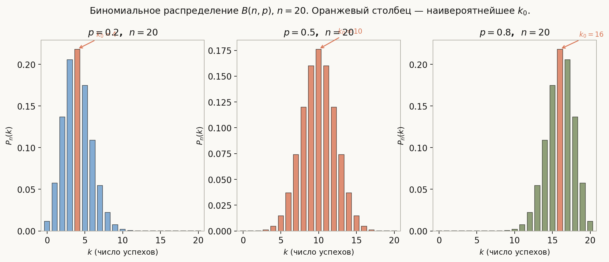
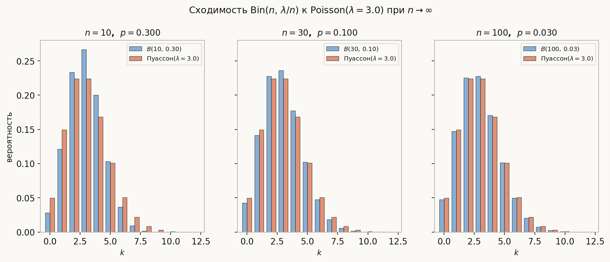

# Лекция: схема Бернулли, формула Пуассона, полиномиальная схема

Лекция опирается на понятие независимости событий из лекции 2. Схема Бернулли — это модель повторных одинаковых испытаний, каждое из которых заканчивается «успехом» или «неудачей». Несмотря на простоту, она лежит в основе биномиального распределения, распределения Пуассона и задач с подсчётом редких событий.

Главная линия лекции:
$$
\text{схема Бернулли} \to \text{формула Бернулли} \to \text{наивероятнейшее } k \to \text{Пуассон (предел)} \to \text{полиномиальная схема}.
$$

Как читать эту лекцию:

- разделы 1–3 вводят схему и выводят формулу Бернулли;
- раздел 4 — как найти наивероятнейшее число успехов;
- разделы 5–6 — предел Пуассона и область применения аппроксимации;
- раздел 7 — обобщение на $r > 2$ исхода (полиномиальная схема);
- разделы 8–11 — ошибки, ориентир для ШАД, итог, самопроверка.

---

## План

1. Мотивация и определение схемы Бернулли
2. Формула Бернулли
3. Примеры на формулу Бернулли
4. Наивероятнейшее число успехов
5. Предельная теорема Пуассона
6. Когда применять аппроксимацию Пуассона
7. Полиномиальная схема
8. Типичные ошибки
9. Что важно для поступления в ШАД
10. Итог
11. Вопросы для самопроверки

---

## 1. Мотивация и определение схемы Бернулли

Многие практические задачи сводятся к следующей структуре: есть эксперимент с двумя исходами, его повторяют несколько раз независимо. Например:

- подбрасывают монету $n$ раз и считают число орлов;
- проверяют $n$ деталей и считают число бракованных;
- отправляют $n$ пакетов по сети и считают число потерянных;
- задают $n$ независимых тестовых вопросов и считают число правильных ответов.

### Определение

**Схема Бернулли** — это последовательность из $n$ испытаний, в которых:

1. каждое испытание имеет ровно два исхода: **успех** (с вероятностью $p$) и **неудача** (с вероятностью $q = 1 - p$);
2. испытания **независимы**;
3. вероятность успеха $p$ одинакова во всех испытаниях.

Такую схему обозначают $B(n, p)$.

### Пространство исходов

Элементарный исход — это последовательность длины $n$ из символов У (успех) и Н (неудача). Например, при $n = 3$:

$$
\Omega = \{\text{УУУ},\ \text{УУН},\ \text{УНУ},\ \ldots,\ \text{НОО}\},\quad |\Omega| = 2^n.
$$

Исходы неравновероятны: последовательность из $k$ успехов и $n-k$ неудач имеет вероятность $p^k q^{n-k}$.

---

## 2. Формула Бернулли

### Теорема

В схеме $B(n, p)$ вероятность того, что ровно $k$ испытаний из $n$ окончатся успехом, равна:

$$
\boxed{P_n(k) = \binom{n}{k} p^k q^{n-k}, \quad k = 0, 1, \ldots, n.}
$$

### Вывод

Зафиксируем любую конкретную последовательность с ровно $k$ успехами, например «первые $k$ испытаний — успех, остальные — неудача». По независимости её вероятность:

$$
p \cdot p \cdots p \cdot q \cdot q \cdots q = p^k q^{n-k}.
$$

Но таких последовательностей ровно $\binom{n}{k}$ (выбираем, на каких $k$ местах стоят успехи). Они несовместны, поэтому:

$$
P_n(k) = \binom{n}{k} p^k q^{n-k}.
$$

### Проверка

Сумма по всем $k$ должна давать $1$:

$$
\sum_{k=0}^{n} \binom{n}{k} p^k q^{n-k} = (p + q)^n = 1^n = 1. \checkmark
$$

### Числа $P_n(k)$ — биномиальное распределение

Набор вероятностей $\{P_n(k)\}_{k=0}^{n}$ называется **биномиальным распределением** с параметрами $n$ и $p$.

---

## 3. Примеры на формулу Бернулли

### Пример 1. Монета

Монету бросают $6$ раз. Найти вероятность ровно $4$ орлов.

$$
P_6(4) = \binom{6}{4} \left(\frac{1}{2}\right)^4 \left(\frac{1}{2}\right)^2 = 15 \cdot \frac{1}{64} = \frac{15}{64} \approx 0.234.
$$

### Пример 2. Контроль качества

Вероятность брака — $0.02$. Проверяют $100$ деталей. Найти вероятность ровно $3$ бракованных.

$$
P_{100}(3) = \binom{100}{3} (0.02)^3 (0.98)^{97}.
$$

Точное значение сложно вычислить вручную — здесь применима аппроксимация Пуассона (раздел 5).

### Пример 3. Хотя бы один успех

При $n = 5$, $p = 0.3$ найти вероятность хотя бы одного успеха.

Через дополнение:

$$
P(\text{хотя бы один успех}) = 1 - P_5(0) = 1 - (0.7)^5 = 1 - 0.16807 \approx 0.832.
$$

Считать через дополнение всегда быстрее, чем суммировать $P_5(1) + \cdots + P_5(5)$.

---

## 4. Наивероятнейшее число успехов

**Наивероятнейшим** называется то значение $k_0$, при котором $P_n(k)$ максимально.

### Критерий

Рассмотрим отношение:

$$
\frac{P_n(k)}{P_n(k-1)} = \frac{(n-k+1)\,p}{k\,q}.
$$

Это отношение $\ge 1$ тогда и только тогда, когда $(n-k+1)p \ge kq$, то есть $k \le (n+1)p$.

Следовательно:

- если $(n+1)p$ — не целое, то $k_0 = \lfloor (n+1)p \rfloor$;
- если $(n+1)p = m$ — целое, то максимум достигается в двух точках: $k_0 = m$ и $k_0 = m - 1$.

### Пример

$n = 10$, $p = 0.3$. Тогда $(n+1)p = 11 \cdot 0.3 = 3.3$, поэтому $k_0 = 3$.

Проверка: $P_{10}(3) = \binom{10}{3}(0.3)^3(0.7)^7 \approx 0.267$ — действительно наибольшее.

---

## 5. Предельная теорема Пуассона

### Постановка

Рассмотрим последовательность схем Бернулли $B(n, p_n)$, в которых $p_n \to 0$ и $n p_n \to \lambda > 0$ при $n \to \infty$.

**Теорема (Пуассон, 1837).** При указанных условиях для любого фиксированного $k \ge 0$:

$$
\binom{n}{k} p_n^k (1 - p_n)^{n-k} \;\xrightarrow[n\to\infty]{}\; \frac{\lambda^k e^{-\lambda}}{k!}.
$$

### Вывод (ключевые шаги)

Обозначим $\lambda = np_n$. Тогда $p_n = \lambda/n$ и:

$$
\binom{n}{k} p_n^k (1-p_n)^{n-k}
= \frac{n(n-1)\cdots(n-k+1)}{k!} \cdot \frac{\lambda^k}{n^k} \cdot \left(1 - \frac{\lambda}{n}\right)^{n-k}.
$$

При $n \to \infty$:

- $\dfrac{n(n-1)\cdots(n-k+1)}{n^k} \to 1$;
- $\left(1 - \dfrac{\lambda}{n}\right)^n \to e^{-\lambda}$;
- $\left(1 - \dfrac{\lambda}{n}\right)^{-k} \to 1$.

Итого: предел равен $\dfrac{\lambda^k e^{-\lambda}}{k!}$.

### Формула Пуассона

Числа $\pi_k = \dfrac{\lambda^k e^{-\lambda}}{k!}$, $k = 0, 1, 2, \ldots$ называются **распределением Пуассона** с параметром $\lambda$. Они задают вероятность для предельного случая.

Проверка нормировки:

$$
\sum_{k=0}^{\infty} \frac{\lambda^k e^{-\lambda}}{k!} = e^{-\lambda} \cdot e^{\lambda} = 1. \checkmark
$$

### Аппроксимация

На практике: если $n$ велико, $p$ мало и $\lambda = np$ не слишком большое (скажем, $\lambda \le 10$), то:

$$
P_n(k) = \binom{n}{k} p^k (1-p)^{n-k} \approx \frac{\lambda^k e^{-\lambda}}{k!}, \quad \lambda = np.
$$

### Пример

$n = 100$, $p = 0.02$, $\lambda = 2$. Вероятность ровно $3$ успехов:

$$
P_{100}(3) \approx \frac{2^3 e^{-2}}{3!} = \frac{8 \cdot e^{-2}}{6} \approx \frac{8 \cdot 0.1353}{6} \approx 0.180.
$$

Точное значение: $\binom{100}{3}(0.02)^3(0.98)^{97} \approx 0.182$ — ошибка менее $1\%$.

---

## 6. Когда применять аппроксимацию Пуассона

| Условие | Комментарий |
|---|---|
| $n \ge 50$ | достаточно много испытаний |
| $p \le 0.05$ | вероятность успеха мала |
| $\lambda = np \le 10$ | среднее число успехов не слишком большое |

При выходе за эти рамки точность аппроксимации падает. Для умеренных $p$ (примерно $0.1$–$0.9$) и больших $n$ лучше работает нормальная аппроксимация (теорема Муавра–Лапласа), которую рассмотрим в лекции 7.

---

## 7. Полиномиальная схема

### Определение

**Полиномиальная схема** — обобщение схемы Бернулли на $r \ge 2$ исходов. В каждом из $n$ независимых испытаний возможны исходы $A_1, A_2, \ldots, A_r$ с вероятностями $p_1, p_2, \ldots, p_r$, где $p_1 + p_2 + \cdots + p_r = 1$.

### Формула

Вероятность того, что исход $A_1$ наступит $k_1$ раз, $A_2$ — $k_2$ раз, …, $A_r$ — $k_r$ раз ($k_1 + k_2 + \cdots + k_r = n$):

$$
P(k_1, k_2, \ldots, k_r) = \frac{n!}{k_1!\, k_2!\, \cdots\, k_r!} \cdot p_1^{k_1} p_2^{k_2} \cdots p_r^{k_r}.
$$

Множитель $\dfrac{n!}{k_1!\cdots k_r!}$ — это **мультиномиальный коэффициент**: число способов расставить $n$ объектов по $r$ группам размеров $k_1, \ldots, k_r$.

### Проверка

Сумма по всем допустимым $(k_1, \ldots, k_r)$:

$$
\sum_{k_1+\cdots+k_r=n} \frac{n!}{k_1!\cdots k_r!} p_1^{k_1}\cdots p_r^{k_r} = (p_1 + \cdots + p_r)^n = 1. \checkmark
$$

Это и есть разложение $\textbf{мультиномиальной теоремы}$.

### Пример

Кубик бросают $6$ раз. Найти вероятность того, что каждая грань выпадет ровно по одному разу.

$$
r = 6,\quad p_i = \frac{1}{6},\quad k_1 = k_2 = \cdots = k_6 = 1.
$$

$$
P = \frac{6!}{1!\,1!\,1!\,1!\,1!\,1!} \cdot \left(\frac{1}{6}\right)^6 = 720 \cdot \frac{1}{46656} = \frac{720}{46656} = \frac{5}{324} \approx 0.0154.
$$

---

## 8. Типичные ошибки

### Ошибка 1. Забыть биномиальный коэффициент

Написать $P_n(k) = p^k q^{n-k}$ без множителя $\binom{n}{k}$ — самая частая ошибка. Это вероятность одной конкретной последовательности с $k$ успехами, а не вероятность события «ровно $k$ успехов».

### Ошибка 2. Применять Бернулли при зависимых испытаниях

Если шары достают без возврата — испытания зависимы. Нужна гипергеометрическая схема, а не формула Бернулли. Зависимость исчезает только при возврате.

### Ошибка 3. Применять аппроксимацию Пуассона при больших $p$

Формула Пуассона работает при малых $p$. При $p = 0.5$ аппроксимация даёт неприемлемую ошибку.

### Ошибка 4. Путать $\lambda$ и $k$ в формуле Пуассона

В $\dfrac{\lambda^k e^{-\lambda}}{k!}$: $\lambda = np$ — параметр (среднее), $k$ — конкретное число успехов.

### Ошибка 5. Забыть условие $k_1 + \cdots + k_r = n$ в полиномиальной схеме

Формула имеет смысл только при $k_1 + k_2 + \cdots + k_r = n$. Если суммы не совпадают — задача поставлена некорректно.

---

## 9. Что важно для поступления в ШАД

Нужно уверенно уметь:

- применять формулу Бернулли $P_n(k) = \binom{n}{k} p^k q^{n-k}$ и безошибочно вычислять биномиальные коэффициенты;
- использовать дополнение для «хотя бы одного успеха»;
- находить наивероятнейшее число успехов через условие $k_0 \approx (n+1)p$;
- применять аппроксимацию Пуассона при $n$ большом и $p$ малом;
- записывать и применять формулу полиномиальной схемы;
- понимать, почему сумма вероятностей в обеих схемах равна $1$ (связь с бином и полиномом Ньютона).

---

## 10. Итог

Схема Бернулли описывает $n$ независимых одинаковых испытаний с вероятностью успеха $p$. Вероятность ровно $k$ успехов даётся формулой Бернулли $P_n(k) = \binom{n}{k}p^k q^{n-k}$, которая суммируется в $(p+q)^n = 1$ по биному Ньютона. Наивероятнейшее число успехов равно $\lfloor (n+1)p \rfloor$. При $n \to \infty$, $p \to 0$, $np \to \lambda$ биномиальное распределение сходится к распределению Пуассона $\pi_k = \lambda^k e^{-\lambda}/k!$, что даёт удобную аппроксимацию при малых вероятностях. Полиномиальная схема обобщает Бернулли на $r$ возможных исходов и использует мультиномиальный коэффициент.

---

## 11. Вопросы для самопроверки

1. Какие три условия определяют схему Бернулли?
2. Почему в формуле $P_n(k) = \binom{n}{k} p^k q^{n-k}$ нужен биномиальный коэффициент?
3. Как убедиться, что $\sum_{k=0}^n P_n(k) = 1$?
4. Как найти наивероятнейшее $k_0$, если $(n+1)p$ — целое число?
5. Что такое параметр $\lambda$ в формуле Пуассона и как он связан с $n$ и $p$?
6. При каких условиях аппроксимация Пуассона хорошо работает?
7. Докажите, что $\sum_{k=0}^{\infty} \frac{\lambda^k e^{-\lambda}}{k!} = 1$.
8. Что такое мультиномиальный коэффициент и чему он равен при $r = 2$?
9. Чем полиномиальная схема отличается от схемы Бернулли?
10. Почему формулу Бернулли нельзя применять при выборке без возврата?
