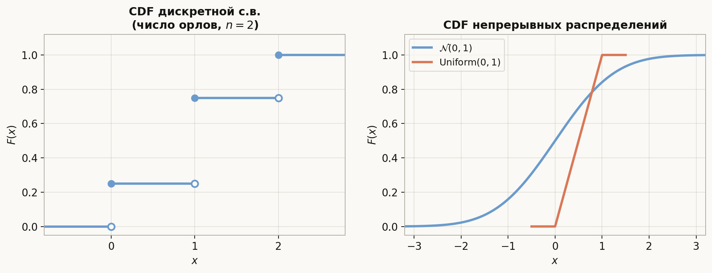
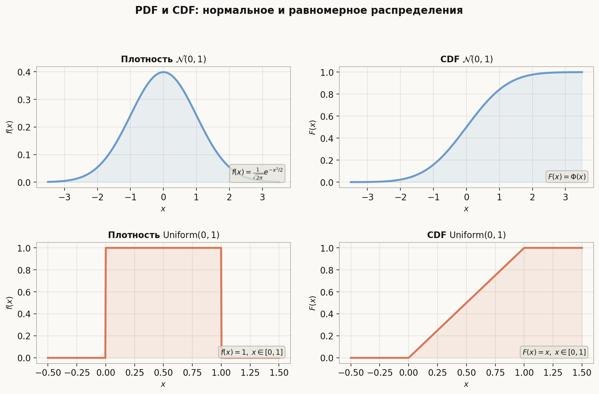
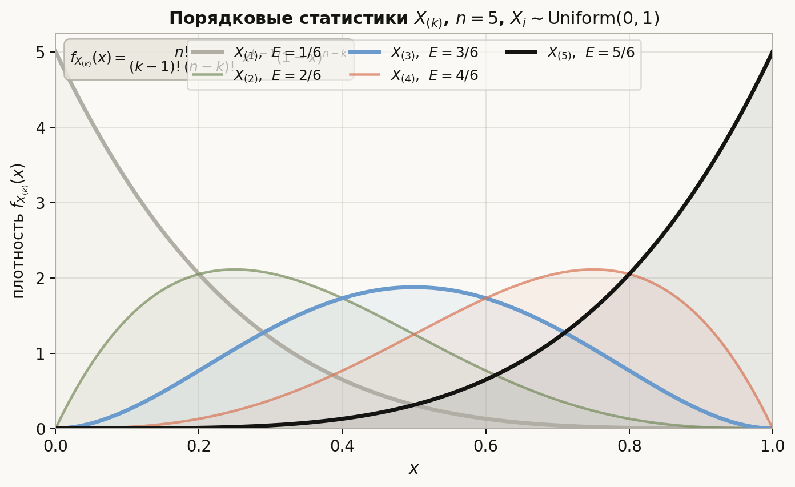

# Лекция: случайные величины, функция распределения, плотность, порядковые статистики

До этой лекции события были основным объектом — подмножества $\Omega$. Теперь переходим к **случайным величинам**: числовым функциям на $\Omega$, которые позволяют описывать эксперименты количественно. Функция распределения и плотность — два универсальных инструмента, которые полностью задают «вероятностный закон» случайной величины и применяются во всех разделах математической статистики и машинного обучения.

Главная линия лекции:
$$
\text{с.в. как функция на }\Omega \;\to\; F(x) \;\to\; \text{дискретный и непрерывный случай} \;\to\; \text{векторы и независимость} \;\to\; \text{функции от с.в.} \;\to\; \text{порядковые статистики}.
$$

Как читать эту лекцию:

- разделы 1–2 — определение с.в. и функция распределения;
- разделы 3–4 — дискретный и абсолютно непрерывный случаи;
- раздел 5 — независимость случайных величин;
- разделы 6–7 — случайные векторы и их совместное распределение;
- разделы 8–9 — функции от с.в. и порядковые статистики;
- разделы 10–13 — ошибки, ориентир для ШАД, итог, самопроверка.

---

## План

1. Случайная величина как измеримая функция
2. Функция распределения и её свойства
3. Дискретные случайные величины
4. Абсолютно непрерывные случайные величины и плотность
5. Независимость случайных величин
6. Случайные векторы
7. Совместное распределение и маргиналы
8. Функции от случайной величины
9. Порядковые статистики
10. Типичные ошибки
11. Что важно для поступления в ШАД
12. Итог
13. Вопросы для самопроверки

---

## 1. Случайная величина как измеримая функция

### Определение

Пусть задано вероятностное пространство $(\Omega, \mathcal{F}, \mathbb{P})$. **Случайная величина** (с.в.) — это функция

$$
X \colon \Omega \to \mathbb{R},
$$

такая что для любого $x \in \mathbb{R}$ прообраз $\{\omega \in \Omega \mid X(\omega) \le x\}$ является событием, то есть принадлежит $\mathcal{F}$. Такое условие называется **измеримостью**.

На практике это означает, что для любого числа $x$ вопрос «выполняется ли $X \le x$?» имеет смысл как событие и у него есть вероятность.

### Интуиция

Случайная величина — это «численный результат» эксперимента. Примеры:

- $X$ = число орлов при $n$ бросках монеты;
- $X$ = время ожидания автобуса;
- $X$ = ошибка измерения прибором;
- $X$ = оценка за экзамен.

Сам исход $\omega$ может быть сложным объектом (перестановкой, последовательностью), но $X(\omega)$ — просто число.

---

## 2. Функция распределения и её свойства

### Определение

**Функция распределения** (CDF, cumulative distribution function) случайной величины $X$:

$$
F(x) = \mathbb{P}(X \le x), \quad x \in \mathbb{R}.
$$

### Основные свойства

**(1) Монотонность.** $F$ не убывает: если $x_1 < x_2$, то $F(x_1) \le F(x_2)$.

**(2) Предельные значения.**
$$
\lim_{x \to -\infty} F(x) = 0, \qquad \lim_{x \to +\infty} F(x) = 1.
$$

**(3) Непрерывность справа.**
$$
F(x) = F(x+0) := \lim_{t \downarrow x} F(t).
$$

**(4) Скачки.** В точке $a$ функция $F$ имеет скачок $F(a) - F(a-0) = \mathbb{P}(X = a)$.

### Вероятности через CDF

Из определения:

$$
\mathbb{P}(X > x) = 1 - F(x),
$$
$$
\mathbb{P}(a < X \le b) = F(b) - F(a),
$$
$$
\mathbb{P}(X = a) = F(a) - F(a - 0).
$$

### Характеризация

Любая функция $F \colon \mathbb{R} \to [0,1]$, удовлетворяющая свойствам (1)–(3), является функцией распределения некоторой с.в.

---

## 3. Дискретные случайные величины

### Определение

С.в. $X$ называется **дискретной**, если она принимает не более чем счётное множество значений $x_1, x_2, \ldots$

### Закон распределения

Дискретная с.в. полностью задаётся своим **законом распределения** — таблицей (или формулой):

$$
p_k = \mathbb{P}(X = x_k), \quad p_k \ge 0, \quad \sum_k p_k = 1.
$$

### CDF дискретной с.в.

$$
F(x) = \sum_{x_k \le x} p_k.
$$

Это **ступенчатая функция**: она постоянна между значениями $x_k$ и имеет скачок $p_k$ в точке $x_k$.

### Пример

$X$ = число орлов при двух бросках честной монеты:

| $X$ | $0$ | $1$ | $2$ |
|---|---|---|---|
| $\mathbb{P}$ | $1/4$ | $1/2$ | $1/4$ |

$$
F(x) = \begin{cases} 0, & x < 0, \\ 1/4, & 0 \le x < 1, \\ 3/4, & 1 \le x < 2, \\ 1, & x \ge 2. \end{cases}
$$

---

## 4. Абсолютно непрерывные случайные величины и плотность

### Определение

С.в. $X$ называется **абсолютно непрерывной**, если существует неотрицательная функция $f \colon \mathbb{R} \to [0, +\infty)$ такая, что

$$
F(x) = \int_{-\infty}^{x} f(t)\, dt \quad \text{для всех } x \in \mathbb{R}.
$$

Функция $f$ называется **плотностью распределения** (PDF, probability density function).

### Свойства плотности

**(1) Неотрицательность.** $f(x) \ge 0$.

**(2) Нормировка.**
$$
\int_{-\infty}^{+\infty} f(x)\, dx = 1.
$$

**(3) Вероятность на промежутке.**
$$
\mathbb{P}(a < X \le b) = \int_{a}^{b} f(x)\, dx.
$$

**(4) Связь с CDF.** В точках непрерывности $f$:
$$
f(x) = F'(x).
$$

**(5) Вероятность одной точки.** $\mathbb{P}(X = a) = 0$ для любого $a$ — это принципиальное отличие от дискретного случая.

### Пример: равномерное распределение

$X \sim \mathrm{Uniform}(a, b)$:

$$
f(x) = \begin{cases} \dfrac{1}{b - a}, & a \le x \le b, \\ 0, & \text{иначе.} \end{cases}
\qquad
F(x) = \begin{cases} 0, & x < a, \\ \dfrac{x - a}{b - a}, & a \le x \le b, \\ 1, & x > b. \end{cases}
$$

### Пример: стандартное нормальное распределение

$X \sim \mathcal{N}(0, 1)$:

$$
f(x) = \frac{1}{\sqrt{2\pi}} e^{-x^2/2}, \qquad F(x) = \Phi(x) = \frac{1}{\sqrt{2\pi}} \int_{-\infty}^{x} e^{-t^2/2}\, dt.
$$

Явной формулы для $\Phi(x)$ нет; значения берут из таблицы или используют стандартные библиотеки.

---

## 5. Независимость случайных величин

### Определение

Случайные величины $X$ и $Y$ называются **независимыми**, если для любых $x, y \in \mathbb{R}$:

$$
\mathbb{P}(X \le x,\ Y \le y) = \mathbb{P}(X \le x) \cdot \mathbb{P}(Y \le y),
$$

то есть их совместная CDF равна произведению маргинальных CDF:

$$
F_{X,Y}(x, y) = F_X(x) \cdot F_Y(y).
$$

### Эквивалентное условие

В дискретном случае: $\mathbb{P}(X = x_i, Y = y_j) = \mathbb{P}(X = x_i) \cdot \mathbb{P}(Y = y_j)$ для всех $i, j$.

В непрерывном случае: $f_{X,Y}(x, y) = f_X(x) \cdot f_Y(y)$.

### Независимость $n$ величин

$X_1, \ldots, X_n$ независимы (в совокупности), если для любых $x_1, \ldots, x_n$:

$$
\mathbb{P}(X_1 \le x_1, \ldots, X_n \le x_n) = \prod_{i=1}^{n} \mathbb{P}(X_i \le x_i).
$$

### Следствие

Если $X$ и $Y$ независимы и $g$, $h$ — борелевские функции, то $g(X)$ и $h(Y)$ тоже независимы.

### Пример: проверка независимости по совместной плотности

Совместная плотность $(X, Y)$:

$$
f_{X,Y}(x, y) = 6x, \quad 0 < x < 1,\; 0 < y < 1-x.
$$

Найдём маргиналы:

$$
f_X(x) = \int_0^{1-x} 6x\, dy = 6x(1-x), \quad 0 < x < 1.
$$

$$
f_Y(y) = \int_0^{1-y} 6x\, dx = 3(1-y)^2, \quad 0 < y < 1.
$$

Произведение: $f_X(x) \cdot f_Y(y) = 6x(1-x) \cdot 3(1-y)^2 = 18x(1-x)(1-y)^2 \ne 6x$.

Поскольку $f_{X,Y} \ne f_X \cdot f_Y$, величины $X$ и $Y$ **зависимы**. (Это видно и из области: носитель плотности — треугольник $\{0<x<1,\, 0<y<1-x\}$, а не прямоугольник.)

### Пример: независимые с.в. дают прямоугольный носитель

Пусть $X \sim \mathrm{Exp}(1)$ и $Y \sim \mathrm{Exp}(2)$ независимы. Тогда:

$$
f_{X,Y}(x,y) = e^{-x} \cdot 2e^{-2y} = 2e^{-x-2y}, \quad x > 0,\; y > 0.
$$

Носитель — прямоугольник $(0,\infty)\times(0,\infty)$, и плотность факторизуется. Признак: если носитель — прямоугольник (декартово произведение) **и** $f_{X,Y}(x,y) = h_1(x)\,h_2(y)$, то $X$ и $Y$ независимы.

---

## 6. Случайные векторы

### Определение

**Случайный вектор** — это упорядоченный набор с.в.:

$$
\mathbf{X} = (X_1, X_2, \ldots, X_n) \colon \Omega \to \mathbb{R}^n.
$$

### Совместная функция распределения

$$
F_{\mathbf{X}}(x_1, \ldots, x_n) = \mathbb{P}(X_1 \le x_1, \ldots, X_n \le x_n).
$$

### Маргинальные распределения

Распределение отдельной компоненты $X_i$ получается предельным переходом остальных аргументов к $+\infty$:

$$
F_{X_i}(x) = \lim_{\substack{x_j \to +\infty \\ j \ne i}} F_{\mathbf{X}}(x_1, \ldots, x_n).
$$

**Важно:** из маргинальных распределений нельзя восстановить совместное распределение без дополнительной информации (например, о зависимости или копуле).

### Пример: разные совместные, одинаковые маргиналы

Пусть $X, Y$ принимают значения $\{0, 1\}$. Два разных совместных закона:

| | $Y=0$ | $Y=1$ | $f_X$ |
|---|---|---|---|
| $X=0$ | $1/4$ | $1/4$ | $1/2$ |
| $X=1$ | $1/4$ | $1/4$ | $1/2$ |
| $f_Y$ | $1/2$ | $1/2$ | |

(независимые $X$ и $Y$)

| | $Y=0$ | $Y=1$ | $f_X$ |
|---|---|---|---|
| $X=0$ | $1/2$ | $0$ | $1/2$ |
| $X=1$ | $0$ | $1/2$ | $1/2$ |
| $f_Y$ | $1/2$ | $1/2$ | |

(зависимые: $X = Y$ п.н.)

Маргинальные распределения в обоих случаях одинаковы: $X \sim \mathrm{Ber}(1/2)$, $Y \sim \mathrm{Ber}(1/2)$.

### Совместная плотность

Если существует функция $f_{\mathbf{X}}(x_1, \ldots, x_n) \ge 0$ такая, что

$$
F_{\mathbf{X}}(x_1, \ldots, x_n) = \int_{-\infty}^{x_1} \cdots \int_{-\infty}^{x_n} f_{\mathbf{X}}(t_1, \ldots, t_n)\, dt_n \cdots dt_1,
$$

то $f_{\mathbf{X}}$ — **совместная плотность** вектора $\mathbf{X}$.

Маргинальная плотность:

$$
f_{X_1}(x_1) = \int_{-\infty}^{+\infty} \cdots \int_{-\infty}^{+\infty} f_{\mathbf{X}}(x_1, x_2, \ldots, x_n)\, dx_2 \cdots dx_n.
$$

### Пример: нахождение маргинальной плотности

Совместная плотность $(X, Y)$:

$$
f_{X,Y}(x, y) = \frac{3}{2}(x^2 + y^2), \quad 0 \le x \le 1,\; 0 \le y \le 1.
$$

Проверим нормировку: $\int_0^1\int_0^1 \frac{3}{2}(x^2+y^2)\,dx\,dy = \frac{3}{2}\left(\frac{1}{3}+\frac{1}{3}\right) = 1$ ✓.

Маргинальная плотность $X$:

$$
f_X(x) = \int_0^1 \frac{3}{2}(x^2 + y^2)\,dy = \frac{3}{2}\!\left[x^2 y + \frac{y^3}{3}\right]_0^1 = \frac{3}{2}\!\left(x^2 + \frac{1}{3}\right), \quad 0 \le x \le 1.
$$

Аналогично $f_Y(y) = \frac{3}{2}(y^2 + \frac{1}{3})$.

Проверим независимость: $f_X(x)\cdot f_Y(y) = \frac{9}{4}(x^2+\frac{1}{3})(y^2+\frac{1}{3}) \ne f_{X,Y}(x,y)$ — зависимы.

---

## 7. Функции от случайной величины

### Дискретный случай

Если $X$ дискретная и $Y = g(X)$, то $Y$ тоже дискретная:

$$
\mathbb{P}(Y = y) = \sum_{\{x\,:\,g(x) = y\}} \mathbb{P}(X = x).
$$

### Непрерывный случай: метод функции распределения

Для нахождения распределения $Y = g(X)$ при известной $f_X$:

1. Записать $F_Y(y) = \mathbb{P}(g(X) \le y)$;
2. Выразить через $F_X$ или $f_X$;
3. Продифференцировать, чтобы получить $f_Y$.

### Пример: $Y = X^2$

Пусть $X \sim \mathcal{N}(0, 1)$. Найдём плотность $Y = X^2$.

$$
F_Y(y) = \mathbb{P}(X^2 \le y) = \mathbb{P}(-\sqrt{y} \le X \le \sqrt{y}) = \Phi(\sqrt{y}) - \Phi(-\sqrt{y}) = 2\Phi(\sqrt{y}) - 1, \quad y > 0.
$$

$$
f_Y(y) = F_Y'(y) = 2 \cdot \frac{1}{\sqrt{2\pi}} e^{-y/2} \cdot \frac{1}{2\sqrt{y}} = \frac{1}{\sqrt{2\pi y}} e^{-y/2}, \quad y > 0.
$$

Это распределение $\chi^2(1)$.

### Формула замены переменной (монотонный случай)

Если $g$ строго монотонна и дифференцируема, то:

$$
f_Y(y) = f_X\!\left(g^{-1}(y)\right) \cdot \left|\frac{d}{dy} g^{-1}(y)\right|.
$$

**Логика вывода.** $F_Y(y) = \mathbb{P}(g(X) \le y)$. Если $g$ строго возрастает, то $\{g(X) \le y\} = \{X \le g^{-1}(y)\}$, значит $F_Y(y) = F_X(g^{-1}(y))$. Дифференцируем по $y$ и получаем формулу. При строго убывающей $g$ появляется минус, который поглощается модулем.

### Пример: $Y = e^X$ (логнормальное)

Пусть $X \sim \mathcal{N}(\mu, \sigma^2)$. Найти плотность $Y = e^X$.

Обратная функция: $g^{-1}(y) = \ln y$, её производная $(g^{-1})'(y) = 1/y$.

$$
f_Y(y) = f_X(\ln y) \cdot \frac{1}{y} = \frac{1}{\sigma\sqrt{2\pi}}\exp\!\left(-\frac{(\ln y - \mu)^2}{2\sigma^2}\right) \cdot \frac{1}{y}, \quad y > 0.
$$

Это **логнормальное** распределение $\mathrm{LogNormal}(\mu, \sigma^2)$.

Заметьте: $g = e^x$ строго возрастает на $\mathbb{R}$, поэтому формула применима напрямую без метода CDF.

### Пример: $Y = aX + b$ (линейное преобразование)

Пусть $X$ имеет плотность $f_X$. Найти плотность $Y = aX + b$ при $a \ne 0$.

$g^{-1}(y) = (y - b)/a$, $(g^{-1})'(y) = 1/a$.

$$
f_Y(y) = f_X\!\left(\frac{y - b}{a}\right) \cdot \frac{1}{|a|}.
$$

Частный случай: если $X \sim \mathcal{N}(0, 1)$, то $Y = \sigma X + \mu$ имеет плотность

$$
f_Y(y) = \frac{1}{\sigma}\cdot\frac{1}{\sqrt{2\pi}}e^{-(y-\mu)^2/(2\sigma^2)},
$$

то есть $Y \sim \mathcal{N}(\mu, \sigma^2)$ — стандартизованные нормальные переходят в нормальные с нужными параметрами.

### Функции от случайного вектора: якобиан

**Диффеоморфизм** — гладкое (бесконечно дифференцируемое) взаимно однозначное отображение $g: U \to V$ между открытыми областями $U, V \subseteq \mathbb{R}^n$, у которого существует гладкое обратное $g^{-1}: V \to U$. Условие $\det J_g(\mathbf{x}) \neq 0$ для всех $\mathbf{x} \in U$ гарантирует локальную обратимость (теорема об обратной функции). На практике большинство гладких замен переменных в теорвере (линейные, полярные, логарифмические) являются диффеоморфизмами на своей области определения.

Пусть $\mathbf{Y} = g(\mathbf{X})$ — диффеоморфизм. Тогда:

$$
f_{\mathbf{Y}}(\mathbf{y}) = f_{\mathbf{X}}\!\left(g^{-1}(\mathbf{y})\right) \cdot \left|\det J_{g^{-1}}(\mathbf{y})\right|,
$$

где $J_{g^{-1}}$ — якобиан обратного преобразования.

### Пример: сумма и разность двух с.в.

Пусть $X, Y$ — независимые с плотностями $f_X, f_Y$. Найти плотность $S = X + Y$.

Введём замену: $S = X + Y$, $T = Y$. Тогда $X = S - T$, $Y = T$.

$$
J = \begin{vmatrix} \partial x/\partial s & \partial x/\partial t \\ \partial y/\partial s & \partial y/\partial t \end{vmatrix} = \begin{vmatrix} 1 & -1 \\ 0 & 1 \end{vmatrix} = 1.
$$

Совместная плотность $(S, T)$: $f_{S,T}(s, t) = f_X(s-t)\,f_Y(t) \cdot 1$.

Маргинальная плотность $S$ — **формула свёртки**:

$$
f_S(s) = \int_{-\infty}^\infty f_X(s - t)\,f_Y(t)\,dt = (f_X * f_Y)(s).
$$

### Пример: якобиан полярных координат

$(X, Y)$ — вектор с совместной плотностью $f_{X,Y}$. Перейдём к полярным: $R = \sqrt{X^2+Y^2}$, $\Theta = \arctan(Y/X)$.

Обратное преобразование: $X = R\cos\Theta$, $Y = R\sin\Theta$.

$$
J_{g^{-1}} = \begin{pmatrix} \cos\theta & -r\sin\theta \\ \sin\theta & r\cos\theta \end{pmatrix}, \quad |\det J_{g^{-1}}| = r.
$$

$$
f_{R,\Theta}(r, \theta) = f_{X,Y}(r\cos\theta,\; r\sin\theta) \cdot r, \quad r \ge 0,\; \theta \in [0, 2\pi).
$$

Для $\mathcal{N}_2(\mathbf{0}, I)$: $f_{X,Y}(x,y) = \frac{1}{2\pi}e^{-(x^2+y^2)/2}$, тогда

$$
f_{R,\Theta}(r,\theta) = \frac{r}{2\pi}e^{-r^2/2}.
$$

Маргинальная плотность $R$: $f_R(r) = re^{-r^2/2}$ — распределение Рэлея; $\Theta \sim \mathrm{Uniform}(0, 2\pi)$ и $R, \Theta$ независимы.

---

## 8. Порядковые статистики

### Определение

Пусть $X_1, X_2, \ldots, X_n$ — независимые одинаково распределённые (i.i.d.) с.в. с CDF $F$ и плотностью $f$.

Если упорядочить их значения:

$$
X_{(1)} \le X_{(2)} \le \cdots \le X_{(n)},
$$

то $X_{(k)}$ называется **$k$-й порядковой статистикой** ($k$-й порядковой статистикой выборки).

Частные случаи:

- $X_{(1)} = \min(X_1, \ldots, X_n)$ — минимум;
- $X_{(n)} = \max(X_1, \ldots, X_n)$ — максимум;
- $X_{(\lceil n/2 \rceil)}$ — выборочная медиана.

### CDF минимума и максимума

$$
F_{X_{(n)}}(x) = \mathbb{P}(\max \le x) = \mathbb{P}(X_1 \le x, \ldots, X_n \le x) = [F(x)]^n,
$$

$$
F_{X_{(1)}}(x) = \mathbb{P}(\min \le x) = 1 - \mathbb{P}(\min > x) = 1 - [1 - F(x)]^n.
$$

### Плотность $k$-й порядковой статистики

$$
f_{X_{(k)}}(x) = \frac{n!}{(k-1)!\,(n-k)!} [F(x)]^{k-1} [1 - F(x)]^{n-k} f(x).
$$

**Смысл:** один элемент попал в точку $x$ (плотность $f(x)$), $k-1$ элементов — левее (вероятность $F(x)^{k-1}$), $n-k$ — правее ($(1-F(x))^{n-k}$), мультиномиальный коэффициент $\dfrac{n!}{(k-1)!\,1!\,(n-k)!}$ считает упорядочения.

### Пример: максимум из $n$ равномерных

$X_i \sim \mathrm{Uniform}(0, 1)$. Тогда $F(x) = x$ и:

$$
f_{X_{(n)}}(x) = n x^{n-1}, \quad x \in [0, 1].
$$

$$
\mathbb{E}[X_{(n)}] = \int_0^1 x \cdot n x^{n-1}\, dx = n \int_0^1 x^n\, dx = \frac{n}{n+1}.
$$

---

## 9. Типичные ошибки

### Ошибка 1. Путать плотность и вероятность

$f(x)$ — не вероятность. Значение $f(x)$ может быть больше $1$. Вероятность — это интеграл от $f$ на промежутке.

### Ошибка 2. Считать $\mathbb{P}(X = a) > 0$ для непрерывной с.в.

Для абсолютно непрерывной с.в. вероятность любого одного значения равна нулю. Вопрос «какова вероятность, что $X = 2.5$?» для непрерывной с.в. не имеет смысла — нужно спрашивать про интервал.

### Ошибка 3. Восстанавливать совместное распределение из маргинальных

Зная $F_X$ и $F_Y$ по отдельности, нельзя определить $F_{X,Y}$ без информации о зависимости. Пример: разные совместные распределения дают одинаковые маргиналы.

### Ошибка 4. Применять формулу якобиана без проверки монотонности

Формула замены переменной $f_Y(y) = f_X(g^{-1}(y)) |{(g^{-1})'(y)}|$ работает только если $g$ строго монотонна. Для $Y = X^2$ нужен метод CDF — два прообраза $\pm\sqrt{y}$.

### Ошибка 5. Перепутать $X_{(k)}$ с $X_k$

$X_k$ — $k$-й элемент исходной выборки (случайный, без упорядочивания). $X_{(k)}$ — $k$-й по величине после сортировки. Это разные с.в.

---

## 10. Что важно для поступления в ШАД

Нужно уверенно уметь:

- давать определение с.в. и объяснять условие измеримости;
- записывать и применять свойства функции распределения $F(x)$;
- вычислять вероятности через CDF: $\mathbb{P}(a < X \le b) = F(b) - F(a)$;
- работать с дискретными с.в.: составлять таблицу распределения, строить CDF;
- работать с непрерывными с.в.: задавать через плотность, проверять нормировку, вычислять вероятности как интегралы;
- понимать и применять определение независимости с.в. через совместную CDF;
- находить маргинальные плотности из совместной;
- находить распределение функции от с.в. методом CDF и заменой переменной;
- выводить и применять формулы для минимума, максимума и $k$-й порядковой статистики.

---

## 11. Итог

Случайная величина — это измеримая функция на вероятностном пространстве, сопоставляющая каждому исходу число. Функция распределения $F(x) = \mathbb{P}(X \le x)$ полностью описывает вероятностный закон и является монотонной, правонепрерывной функцией с пределами $0$ и $1$. В дискретном случае распределение задаётся набором вероятностей $p_k$, в непрерывном — плотностью $f(x) = F'(x)$. Совместное распределение вектора $(X_1, \ldots, X_n)$ содержит больше информации, чем совокупность маргиналов. Независимость выражается через произведение маргинальных CDF. Распределение функции $g(X)$ находится методом CDF или заменой переменной (якобиан). Порядковые статистики описывают поведение минимума, максимума и медианы выборки: плотность $X_{(k)}$ даётся формулой с биномиальными множителями $[F(x)]^{k-1}[1-F(x)]^{n-k}$.

---

## 12. Вопросы для самопроверки

1. Почему случайная величина определяется как *измеримая* функция? Что было бы без этого условия?
2. Перечислите три ключевых свойства функции распределения.
3. Чем CDF дискретной с.в. отличается от CDF непрерывной?
4. Что означает $\mathbb{P}(X = a) = 0$ для непрерывной с.в.? Это значит, что событие невозможно?
5. Как из совместной плотности $f_{X,Y}(x, y)$ получить маргинальную $f_X(x)$?
6. Сформулируйте условие независимости двух непрерывных с.в. через плотности.
7. Почему из маргинальных распределений нельзя восстановить совместное?
8. Как найти распределение $Y = e^X$, если $X \sim \mathcal{N}(0, 1)$?
9. Запишите CDF максимума $n$ независимых одинаково распределённых с.в.
10. Выведите плотность минимума $X_{(1)}$ из $n$ i.i.d. с.в. с плотностью $f$ и CDF $F$.
