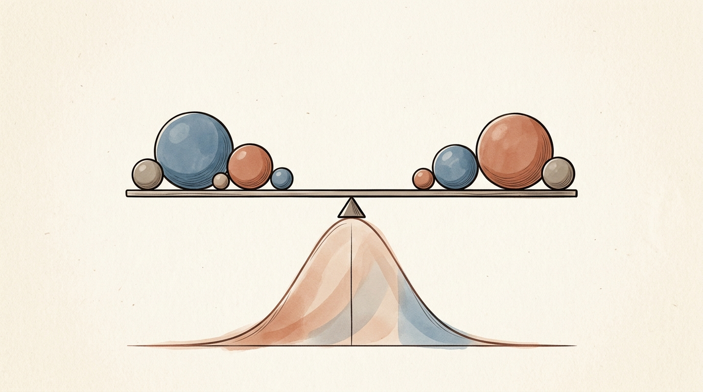
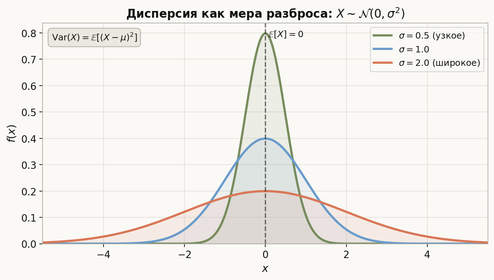
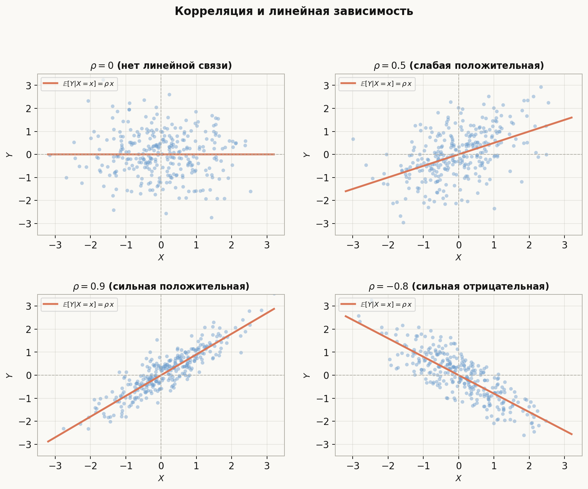

# Лекция: математическое ожидание, дисперсия, ковариация, условное МО

Лекция 4 дала нам функцию распределения и плотность — полное описание закона с.в. Но на практике часто достаточно нескольких чисел, которые резюмируют это распределение. Главные из них — **математическое ожидание** (центр) и **дисперсия** (разброс). Ковариация и корреляция измеряют линейную связь между двумя с.в. Условное математическое ожидание обобщает понятие регрессии и является одним из ключевых инструментов в теории вероятностей и машинном обучении.

Главная линия лекции:
$$
\mathbb{E}[X] \;\to\; \mathrm{Var}(X) \;\to\; \mathrm{Cov}(X,Y),\,\rho \;\to\; \text{матрица ковариаций} \;\to\; \mathbb{E}[X \mid Y] \;\to\; \text{моменты}.
$$

Как читать эту лекцию:

- разделы 1–3 — определение и свойства МО в дискретном и непрерывном случае;
- разделы 4–5 — дисперсия, стандартное отклонение, дисперсия суммы;
- разделы 6–7 — ковариация, корреляция, матрица ковариаций вектора;
- раздел 8 — МО в общем виде (формула Стилтьеса);
- разделы 9–10 — условное распределение и условное МО, свойства;
- раздел 11 — регрессия как условное МО;
- раздел 12 — моменты старших порядков, асимметрия, эксцесс;
- разделы 13–16 — ошибки, ориентир для ШАД, итог, самопроверка.

---

## План

1. Математическое ожидание в дискретном случае
2. Математическое ожидание в непрерывном случае
3. Основные свойства математического ожидания
4. Дисперсия и стандартное отклонение
5. Дисперсия суммы. Свойства дисперсии
6. Ковариация и коэффициент корреляции
7. Математическое ожидание и матрица ковариаций случайного вектора
8. Математическое ожидание в общем виде
9. Условное распределение
10. Условное математическое ожидание и его свойства
11. Регрессия
12. Моменты старших порядков. Асимметрия и эксцесс
13. Типичные ошибки
14. Что важно для поступления в ШАД
15. Итог
16. Вопросы для самопроверки

---

## 1. Математическое ожидание в дискретном случае

### Определение

Пусть $X$ — дискретная с.в. с законом $\mathbb{P}(X = x_k) = p_k$. **Математическое ожидание** (МО):

$$
\mathbb{E}[X] = \sum_k x_k\, p_k,
$$

если ряд **абсолютно сходится**: $\sum_k |x_k| p_k < \infty$.

Если ряд расходится, говорят, что МО не существует.

### Интуиция

$\mathbb{E}[X]$ — это средневзвешенное значение $X$, где вес каждого исхода равен его вероятности. Физический аналог — центр тяжести распределения масс $p_k$ в точках $x_k$.

### Пример

Честный кубик: $X \in \{1,2,3,4,5,6\}$, все $p_k = 1/6$.

$$
\mathbb{E}[X] = \frac{1+2+3+4+5+6}{6} = \frac{21}{6} = 3.5.
$$

### МО функции от с.в.

Если $Y = g(X)$, то не нужно сначала находить закон $Y$:

$$
\mathbb{E}[g(X)] = \sum_k g(x_k)\, p_k.
$$

---

## 2. Математическое ожидание в непрерывном случае

### Определение

Пусть $X$ — абсолютно непрерывная с.в. с плотностью $f$:

$$
\mathbb{E}[X] = \int_{-\infty}^{+\infty} x\, f(x)\, dx,
$$

если интеграл **абсолютно сходится**: $\int_{-\infty}^{+\infty} |x|\, f(x)\, dx < \infty$.

### МО функции от с.в.

$$
\mathbb{E}[g(X)] = \int_{-\infty}^{+\infty} g(x)\, f(x)\, dx.
$$

### Примеры

**Равномерное** $X \sim \mathrm{Uniform}(a, b)$:

$$
\mathbb{E}[X] = \int_a^b x \cdot \frac{1}{b-a}\, dx = \frac{a+b}{2}.
$$

**Стандартное нормальное** $X \sim \mathcal{N}(0,1)$:

$$
\mathbb{E}[X] = \int_{-\infty}^{+\infty} x \cdot \frac{e^{-x^2/2}}{\sqrt{2\pi}}\, dx = 0 \quad \text{(нечётная функция)}.
$$

**Показательное** $X \sim \mathrm{Exp}(\lambda)$, $f(x) = \lambda e^{-\lambda x}$:

$$
\mathbb{E}[X] = \int_0^{+\infty} x \lambda e^{-\lambda x}\, dx = \frac{1}{\lambda}.
$$

---

## 3. Основные свойства математического ожидания

Пусть МО всех упомянутых с.в. существуют.

**(1) Линейность.**
$$
\mathbb{E}[aX + bY] = a\,\mathbb{E}[X] + b\,\mathbb{E}[Y].
$$

Это верно при любой зависимости между $X$ и $Y$.

**(2) МО константы.**
$$
\mathbb{E}[c] = c.
$$

**(3) Монотонность.** Если $X \le Y$ п.н. (почти наверное), то $\mathbb{E}[X] \le \mathbb{E}[Y]$.

**(4) Независимость и произведение.** Если $X$ и $Y$ независимы:
$$
\mathbb{E}[XY] = \mathbb{E}[X] \cdot \mathbb{E}[Y].
$$

Обратное неверно: из $\mathbb{E}[XY] = \mathbb{E}[X]\mathbb{E}[Y]$ независимость не следует.

**(5) Неравенство Йенсена.** Если $\varphi$ выпукла:
$$
\varphi(\mathbb{E}[X]) \le \mathbb{E}[\varphi(X)].
$$

Частные случаи: $(\mathbb{E}[X])^2 \le \mathbb{E}[X^2]$; $e^{\mathbb{E}[X]} \le \mathbb{E}[e^X]$.

---

## 4. Дисперсия и стандартное отклонение

### Определение

**Дисперсия** (variance) с.в. $X$:

$$
\mathrm{Var}(X) = \mathbb{E}\!\left[(X - \mathbb{E}[X])^2\right].
$$

Дисперсия измеряет средний квадрат отклонения от МО. Иногда обозначается $\sigma^2(X)$ или $\mathbb{D}X$.

### Рабочая формула

$$
\mathrm{Var}(X) = \mathbb{E}[X^2] - (\mathbb{E}[X])^2.
$$

Вывод: $\mathbb{E}[(X-\mu)^2] = \mathbb{E}[X^2 - 2\mu X + \mu^2] = \mathbb{E}[X^2] - 2\mu^2 + \mu^2 = \mathbb{E}[X^2] - \mu^2$.

### Стандартное отклонение

$$
\sigma(X) = \sqrt{\mathrm{Var}(X)}.
$$

Имеет те же единицы измерения, что и $X$.

### Примеры

**Бернулли** $X \sim \mathrm{Ber}(p)$: $\mathbb{E}[X] = p$, $\mathbb{E}[X^2] = p$, $\mathrm{Var}(X) = p - p^2 = pq$.

**Равномерное** $X \sim \mathrm{Uniform}(a,b)$:

$$
\mathrm{Var}(X) = \frac{(b-a)^2}{12}.
$$

**Нормальное** $X \sim \mathcal{N}(\mu, \sigma^2)$: $\mathbb{E}[X] = \mu$, $\mathrm{Var}(X) = \sigma^2$.

---

## 5. Дисперсия суммы. Свойства дисперсии

**(1) Сдвиг.** $\mathrm{Var}(X + c) = \mathrm{Var}(X)$.

**(2) Масштаб.** $\mathrm{Var}(aX) = a^2 \mathrm{Var}(X)$.

**(3) Дисперсия суммы (общий случай).**
$$
\mathrm{Var}(X + Y) = \mathrm{Var}(X) + \mathrm{Var}(Y) + 2\,\mathrm{Cov}(X, Y).
$$

**(4) Дисперсия суммы независимых.**

Если $X_1, \ldots, X_n$ независимы:
$$
\mathrm{Var}(X_1 + \cdots + X_n) = \mathrm{Var}(X_1) + \cdots + \mathrm{Var}(X_n).
$$

**(5) Дисперсия суммы $n$ одинаковых независимых.**

Если $X_i$ i.i.d. с дисперсией $\sigma^2$:
$$
\mathrm{Var}\!\left(\sum_{i=1}^n X_i\right) = n\sigma^2, \qquad \mathrm{Var}\!\left(\bar{X}\right) = \frac{\sigma^2}{n},
$$

где $\bar{X} = \frac{1}{n}\sum X_i$ — выборочное среднее. Дисперсия среднего убывает как $1/n$ — это основа закона больших чисел.

---

## 6. Ковариация и коэффициент корреляции

### Ковариация

$$
\mathrm{Cov}(X, Y) = \mathbb{E}\!\left[(X - \mathbb{E}[X])(Y - \mathbb{E}[Y])\right] = \mathbb{E}[XY] - \mathbb{E}[X]\,\mathbb{E}[Y].
$$

**Свойства:**

- $\mathrm{Cov}(X, X) = \mathrm{Var}(X)$;
- $\mathrm{Cov}(X, Y) = \mathrm{Cov}(Y, X)$ (симметричность);
- $\mathrm{Cov}(aX + b, cY + d) = ac\,\mathrm{Cov}(X, Y)$;
- $\mathrm{Cov}(X + Z, Y) = \mathrm{Cov}(X, Y) + \mathrm{Cov}(Z, Y)$ (билинейность);
- если $X$ и $Y$ независимы, то $\mathrm{Cov}(X, Y) = 0$ (некоррелированность). Обратное неверно.

### Коэффициент корреляции (Пирсона)

$$
\rho(X, Y) = \frac{\mathrm{Cov}(X, Y)}{\sqrt{\mathrm{Var}(X)\,\mathrm{Var}(Y)}}.
$$

**Свойства:**

- $|\rho(X, Y)| \le 1$;
- $\rho = 1$ тогда и только тогда, когда $Y = aX + b$ п.н. с $a > 0$;
- $\rho = -1$ тогда и только тогда, когда $Y = aX + b$ п.н. с $a < 0$;
- $\rho = 0$ означает лишь отсутствие *линейной* зависимости.

### Пример: вычисление ковариации и корреляции

Пусть $(X,Y)$ — совместное дискретное распределение:

| | $Y=-1$ | $Y=0$ | $Y=1$ |
|---|---|---|---|
| $X=0$ | $0.1$ | $0.2$ | $0.1$ |
| $X=1$ | $0.2$ | $0.1$ | $0.3$ |

Маргиналы: $\mathbb{P}(X=0)=0.4$, $\mathbb{P}(X=1)=0.6$; $\mathbb{P}(Y=-1)=0.3$, $\mathbb{P}(Y=0)=0.3$, $\mathbb{P}(Y=1)=0.4$.

$$\mathbb{E}[X] = 0 \cdot 0.4 + 1 \cdot 0.6 = 0.6, \quad \mathbb{E}[Y] = (-1)(0.3)+0(0.3)+1(0.4) = 0.1.$$

$$\mathbb{E}[XY] = 0\cdot(-1)(0.1)+0\cdot0(0.2)+0\cdot1(0.1)+1\cdot(-1)(0.2)+1\cdot0(0.1)+1\cdot1(0.3) = 0.1.$$

$$\mathrm{Cov}(X,Y) = \mathbb{E}[XY] - \mathbb{E}[X]\mathbb{E}[Y] = 0.1 - 0.6\cdot0.1 = 0.1 - 0.06 = 0.04.$$

$$\mathrm{Var}(X) = \mathbb{E}[X^2] - 0.36 = 0.6 - 0.36 = 0.24; \quad \mathrm{Var}(Y) = \mathbb{E}[Y^2]-0.01 = 0.5-0.01=0.49.$$

$$\rho(X,Y) = \frac{0.04}{\sqrt{0.24}\cdot\sqrt{0.49}} = \frac{0.04}{0.490\cdot0.700} \approx \frac{0.04}{0.343} \approx 0.117.$$

Слабая положительная корреляция: большие $X$ чуть чаще сочетаются с большими $Y$.

---

## 7. Математическое ожидание и матрица ковариаций вектора

### МО случайного вектора

Для $\mathbf{X} = (X_1, \ldots, X_n)^T$:

$$
\mathbb{E}[\mathbf{X}] = (\mathbb{E}[X_1], \ldots, \mathbb{E}[X_n])^T.
$$

Линейность: $\mathbb{E}[A\mathbf{X} + \mathbf{b}] = A\,\mathbb{E}[\mathbf{X}] + \mathbf{b}$.

### Матрица ковариаций

$$
\Sigma = \mathrm{Cov}(\mathbf{X}) = \mathbb{E}\!\left[(\mathbf{X} - \mathbb{E}[\mathbf{X}])(\mathbf{X} - \mathbb{E}[\mathbf{X}])^T\right].
$$

Элемент $(i,j)$: $\Sigma_{ij} = \mathrm{Cov}(X_i, X_j)$. Диагональные элементы: $\Sigma_{ii} = \mathrm{Var}(X_i)$.

**Ключевые свойства:**

**(1) Симметричность.** $\Sigma = \Sigma^T$ (так как $\mathrm{Cov}(X_i, X_j) = \mathrm{Cov}(X_j, X_i)$).

**(2) Неотрицательная определённость.** Для любого вектора $\mathbf{v}$:

$$
\mathbf{v}^T \Sigma\, \mathbf{v} = \mathrm{Var}(\mathbf{v}^T \mathbf{X}) \ge 0.
$$

**(3) Преобразование.** Для матрицы $A$:

$$
\mathrm{Cov}(A\mathbf{X}) = A\,\Sigma\, A^T.
$$

### Пример: матрица ковариаций для двумерного вектора

Пусть $\mathbf{X} = (X_1, X_2)^T$, $X_1 \sim \mathcal{N}(1,4)$, $X_2 = 2X_1 + Z$, где $Z \sim \mathcal{N}(0,1)$ независимо от $X_1$.

$$\mathrm{Var}(X_2) = 4\mathrm{Var}(X_1) + \mathrm{Var}(Z) = 4\cdot4+1 = 17.$$

$$\mathrm{Cov}(X_1, X_2) = \mathrm{Cov}(X_1, 2X_1+Z) = 2\mathrm{Var}(X_1) = 8.$$

$$\Sigma = \begin{pmatrix}4 & 8\\ 8 & 17\end{pmatrix}.$$

Проверка НО: $\det\Sigma = 4\cdot17-64 = 68-64 = 4 > 0$ ✓.

---

## 8. Математическое ожидание в общем виде

В самом общем виде, не разделяя дискретный и непрерывный случай, МО определяется как интеграл Лебега–Стилтьеса:

$$
\mathbb{E}[X] = \int_{-\infty}^{+\infty} x\, dF(x),
$$

где $F$ — функция распределения $X$. Это определение покрывает одновременно:

- дискретный случай: $\int x\, dF = \sum_k x_k p_k$;
- непрерывный случай: $\int x\, dF = \int x\, f(x)\, dx$.

**Эквивалентное определение на $\Omega$:**

$$
\mathbb{E}[X] = \int_\Omega X(\omega)\, d\mathbb{P}(\omega).
$$

Этот взгляд важен при работе с условным МО, мартингалами и общей теорией.

---

## 9. Условное распределение

### Дискретный случай

Условное распределение $X$ при условии $Y = y_j$:

$$
\mathbb{P}(X = x_i \mid Y = y_j) = \frac{\mathbb{P}(X = x_i, Y = y_j)}{\mathbb{P}(Y = y_j)}.
$$

### Непрерывный случай

Условная плотность $X$ при условии $Y = y$:

$$
f_{X \mid Y}(x \mid y) = \frac{f_{X,Y}(x, y)}{f_Y(y)}, \quad f_Y(y) > 0.
$$

Это «срез» совместной плотности на уровне $Y = y$, нормированный так, чтобы интегрировался в $1$.

**Формула умножения для плотностей:**

$$
f_{X,Y}(x, y) = f_{X \mid Y}(x \mid y) \cdot f_Y(y).
$$

**Формула полной вероятности для плотностей:**

$$
f_X(x) = \int_{-\infty}^{+\infty} f_{X \mid Y}(x \mid y)\, f_Y(y)\, dy.
$$

---

## 10. Условное математическое ожидание и его свойства

### Определение

**Условное математическое ожидание** $\mathbb{E}[X \mid Y = y]$ — это МО случайной величины $X$ относительно условного распределения $X$ при $Y = y$:

$$
\mathbb{E}[X \mid Y = y] = \int_{-\infty}^{+\infty} x\, f_{X \mid Y}(x \mid y)\, dx \quad \text{(непрерывный случай)}.
$$

Рассматривая $y$ как переменную, получаем с.в. $\mathbb{E}[X \mid Y]$ — функцию от $Y$.

### Ключевые свойства

**(1) Закон полного МО (формула башни).**
$$
\mathbb{E}[\mathbb{E}[X \mid Y]] = \mathbb{E}[X].
$$

**(2) Линейность.**
$$
\mathbb{E}[aX + bZ \mid Y] = a\,\mathbb{E}[X \mid Y] + b\,\mathbb{E}[Z \mid Y].
$$

**(3) Вынесение известного.** Если $h(Y)$ — функция от $Y$:
$$
\mathbb{E}[h(Y) \cdot X \mid Y] = h(Y)\,\mathbb{E}[X \mid Y].
$$

**(4) Независимость.** Если $X$ и $Y$ независимы:
$$
\mathbb{E}[X \mid Y] = \mathbb{E}[X].
$$

**(5) Наилучший прогноз.** $\mathbb{E}[X \mid Y]$ минимизирует среднеквадратичную ошибку прогноза $X$ по $Y$:
$$
\mathbb{E}[(X - g(Y))^2] \ge \mathbb{E}[(X - \mathbb{E}[X \mid Y])^2]
$$
для любой функции $g$.

### Пример: вычисление условного МО

Пусть $(X,Y)$ с совместной плотностью $f_{X,Y}(x,y) = 2$ на $\{0<x<y<1\}$.

Из лекции 4: $f_{Y|X}(y\mid x) = \frac{1}{1-x}$ при $x < y < 1$ (равномерное на $(x,1)$).

$$\mathbb{E}[Y \mid X = x] = \frac{x+1}{2} \quad \text{(середина отрезка }(x,1)\text{)}.$$

Проверим башенное свойство. $f_X(x) = 2(1-x)$:

$$\mathbb{E}[\mathbb{E}[Y\mid X]] = \int_0^1 \frac{x+1}{2}\cdot 2(1-x)\,dx = \int_0^1(1-x^2)\,dx = 1 - \frac{1}{3} = \frac{2}{3} = \mathbb{E}[Y]. \checkmark$$

---

## 11. Регрессия

**Регрессия** $X$ на $Y$ — это функция:

$$
m(y) = \mathbb{E}[X \mid Y = y].
$$

Она описывает, как меняется среднее значение $X$ в зависимости от значения $Y$.

### Линейная регрессия

Если искать не произвольную $g(Y)$, а только **линейную** $g(Y) = a + bY$, минимизирующую $\mathbb{E}[(X - a - bY)^2]$, то:

$$
b = \frac{\mathrm{Cov}(X, Y)}{\mathrm{Var}(Y)}, \qquad a = \mathbb{E}[X] - b\,\mathbb{E}[Y].
$$

Это и есть **линейная регрессия** $X$ на $Y$. При нормальном совместном распределении линейная регрессия совпадает с условным МО.

![Условное МО как регрессионная кривая: E[Y|X=x] при разных законах](assets/conditional_expectation.png)

### Пример: линейная регрессия из моментов

Дано: $\mathbb{E}[X]=2$, $\mathbb{E}[Y]=5$, $\mathrm{Var}(X)=9$, $\mathrm{Cov}(X,Y)=6$.

Коэффициент наклона: $b = \mathrm{Cov}(X,Y)/\mathrm{Var}(X) = 6/9 = 2/3$.

Свободный член: $a = \mathbb{E}[Y] - b\mathbb{E}[X] = 5 - (2/3)\cdot2 = 5 - 4/3 = 11/3$.

$$\hat{Y} = \frac{11}{3} + \frac{2}{3}X.$$

Корреляция: $\rho = \mathrm{Cov}/(\sigma_X\sigma_Y)$. Для нахождения нужна $\mathrm{Var}(Y)$ — без неё $\rho$ не определить.

---

## 12. Моменты старших порядков. Асимметрия и эксцесс

### Моменты

**Момент порядка $k$ (начальный):**

$$
\mu_k = \mathbb{E}[X^k].
$$

**Центральный момент порядка $k$:**

$$
\tilde\mu_k = \mathbb{E}\!\left[(X - \mathbb{E}[X])^k\right].
$$

МО = $\mu_1$; дисперсия = $\tilde\mu_2$.

### Асимметрия (skewness)

$$
\gamma_1 = \frac{\tilde\mu_3}{\sigma^3}.
$$

- $\gamma_1 > 0$: распределение вытянуто вправо («правый хвост»);
- $\gamma_1 < 0$: вытянуто влево;
- $\gamma_1 = 0$: симметрично (необходимо, но не достаточно).

### Эксцесс (kurtosis)

$$
\gamma_2 = \frac{\tilde\mu_4}{\sigma^4} - 3.
$$

Вычитание $3$ нормирует так, чтобы для нормального распределения $\gamma_2 = 0$.

- $\gamma_2 > 0$: тяжёлые хвосты (лептокуртотическое);
- $\gamma_2 < 0$: лёгкие хвосты (платикуртотическое).

### Пример: асимметрия и эксцесс для показательного распределения

$X \sim \mathrm{Exp}(\lambda)$: $\mu = 1/\lambda$, $\sigma^2 = 1/\lambda^2$.

Центральные моменты: $\mu_3 = 2/\lambda^3$, $\mu_4 = 9/\lambda^4$.

$$\gamma_1 = \frac{\mu_3}{\sigma^3} = \frac{2/\lambda^3}{(1/\lambda)^3} = 2.$$

$$\gamma_2 = \frac{\mu_4}{\sigma^4} - 3 = \frac{9/\lambda^4}{1/\lambda^4} - 3 = 9 - 3 = 6.$$

Вывод: показательное распределение сильно скошено вправо ($\gamma_1 = 2 > 0$) и имеет тяжёлые хвосты ($\gamma_2 = 6 > 0$). Для нормального $\gamma_1 = \gamma_2 = 0$.

---

## 13. Типичные ошибки

### Ошибка 1. Думать, что $\mathbb{E}[g(X)] = g(\mathbb{E}[X])$

Это верно только для линейных $g$. Для нелинейных (по неравенству Йенсена): $\mathbb{E}[X^2] \ge (\mathbb{E}[X])^2$, $\mathbb{E}[1/X] \ge 1/\mathbb{E}[X]$ (при $X > 0$).

### Ошибка 2. Считать, что некоррелированность означает независимость

Из $\mathrm{Cov}(X,Y) = 0$ независимость не следует. Классический контрпример: $X \sim \mathcal{N}(0,1)$, $Y = X^2$. Тогда $\mathrm{Cov}(X, X^2) = \mathbb{E}[X^3] - \mathbb{E}[X]\mathbb{E}[X^2] = 0$, но $Y$ полностью определяется $X$.

### Ошибка 3. Применять $\mathrm{Var}(X+Y) = \mathrm{Var}(X) + \mathrm{Var}(Y)$ при зависимости

Это верно только при независимости (или некоррелированности). В общем случае добавляется $2\,\mathrm{Cov}(X,Y)$.

### Ошибка 4. Путать $\mathbb{E}[X \mid Y]$ и $\mathbb{E}[X \mid Y = y]$

$\mathbb{E}[X \mid Y = y]$ — число (для конкретного $y$). $\mathbb{E}[X \mid Y]$ — случайная величина (функция от $Y$).

### Ошибка 5. Забывать условие существования МО

МО не обязательно существует. Пример: распределение Коши с плотностью $f(x) = \dfrac{1}{\pi(1+x^2)}$ не имеет МО.

---

## 14. Что важно для поступления в ШАД

Нужно уверенно уметь:

- вычислять МО дискретной и непрерывной с.в. по определению;
- применять рабочую формулу $\mathrm{Var}(X) = \mathbb{E}[X^2] - (\mathbb{E}[X])^2$;
- пользоваться линейностью МО и аддитивностью дисперсии для независимых;
- вычислять ковариацию через $\mathbb{E}[XY] - \mathbb{E}[X]\mathbb{E}[Y]$;
- интерпретировать и ограничивать коэффициент корреляции $|\rho| \le 1$;
- знать, что матрица ковариаций симметрична и неотрицательно определена;
- применять закон полного МО $\mathbb{E}[\mathbb{E}[X \mid Y]] = \mathbb{E}[X]$;
- находить условное МО в дискретном и непрерывном случае;
- понимать регрессию как условное МО и выводить коэффициенты линейной регрессии;
- знать определения асимметрии и эксцесса.

---

## 15. Итог

Математическое ожидание — линейный функционал, задающий «центр» распределения; в дискретном случае $\sum x_k p_k$, в непрерывном $\int x f(x) dx$, в общем виде $\int x\, dF(x)$. Дисперсия $\mathbb{E}[(X-\mu)^2] = \mathbb{E}[X^2] - \mu^2$ измеряет разброс; для суммы независимых с.в. дисперсии складываются. Ковариация $\mathbb{E}[XY] - \mathbb{E}[X]\mathbb{E}[Y]$ и коэффициент корреляции $\rho \in [-1, 1]$ измеряют линейную связь. Матрица ковариаций случайного вектора симметрична и неотрицательно определена. Условное МО $\mathbb{E}[X \mid Y]$ — это с.в., минимизирующая среднеквадратичную ошибку прогноза; оно удовлетворяет закону полного МО. Моменты старших порядков описывают асимметрию и форму хвостов распределения.

---

## 16. Вопросы для самопроверки

1. Почему линейность $\mathbb{E}[aX + bY] = a\mathbb{E}[X] + b\mathbb{E}[Y]$ верна без условия независимости?
2. Докажите рабочую формулу $\mathrm{Var}(X) = \mathbb{E}[X^2] - (\mathbb{E}[X])^2$.
3. Как дисперсия среднего $\bar{X}$ зависит от $n$?
4. Почему $|\rho(X,Y)| \le 1$? Подсказка: неравенство Коши–Буняковского.
5. Приведите пример некоррелированных, но зависимых с.в.
6. Почему матрица ковариаций $\Sigma$ неотрицательно определена?
7. Как формула полного МО $\mathbb{E}[\mathbb{E}[X \mid Y]] = \mathbb{E}[X]$ связана с формулой полной вероятности?
8. Запишите условную плотность $f_{X \mid Y}(x \mid y)$ через совместную плотность.
9. Чем линейная регрессия $X$ на $Y$ отличается от регрессионной функции $\mathbb{E}[X \mid Y]$?
10. Каков эксцесс нормального распределения и почему при определении вычитают $3$?
