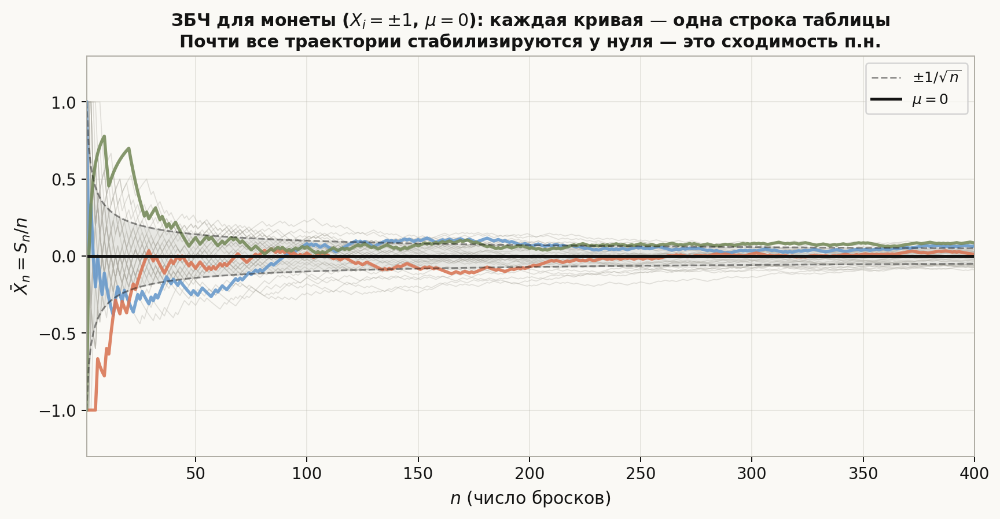
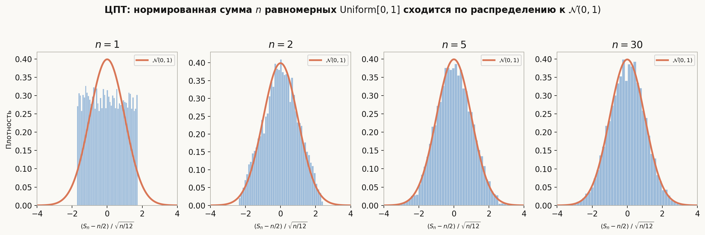

# Лекция: неравенства, виды сходимости, законы больших чисел

Предыдущие лекции дали нам язык: пространство, случайные величины, их числовые характеристики. Теперь — инструменты управления неопределённостью. **Неравенства** Маркова, Чебышёва и Йенсена позволяют оценивать вероятности хвостов без знания точного закона. **Лемма Бореля–Кантелли** отвечает на вопрос «происходит ли событие бесконечно часто». **Виды сходимости** описывают, что значит «последовательность с.в. стремится к пределу» — здесь ответов несколько, и они не эквивалентны. **Законы больших чисел** объясняют, почему статистика работает: выборочное среднее сходится к теоретическому МО. Закон повторного логарифма описывает точный предел осцилляций.

Главная линия лекции:
$$
\text{неравенства} \;\to\; \text{лемма Б.-К.} \;\to\; \xrightarrow{\text{п.н.}},\; \xrightarrow{P},\; \xrightarrow{L^p},\; \xrightarrow{d} \;\to\; \text{ЗБЧ и УЗБЧ} \;\to\; \text{ЗПЛ}.
$$

Как читать эту лекцию:

- разделы 1–3 — три ключевых неравенства; достаточно понять доказательства и знать условия;
- раздел 4 — лемма Бореля–Кантелли: прямая (сходимость рядов → конечность числа событий) и обратная;
- разделы 5–8 — четыре вида сходимости, определения и примеры;
- раздел 9 — диаграмма взаимосвязей, контрпримеры;
- раздел 10 — теорема Слуцкого;
- разделы 11–13 — ЗБЧ, УЗБЧ, ЗПЛ;
- разделы 14–17 — ошибки, ориентир для ШАД, итог, самопроверка.

---

## План

1. Неравенство Маркова
2. Неравенство Чебышёва
3. Неравенство Йенсена
4. Лемма Бореля–Кантелли
5. Сходимость почти наверное
6. Сходимость по вероятности
7. Сходимость в среднем порядка $p$
8. Сходимость по распределению
9. Взаимосвязи видов сходимости
10. Теорема Слуцкого
11. Закон больших чисел (слабый)
12. Усиленный закон больших чисел
13. Закон повторного логарифма
14. Типичные ошибки
15. Что важно для поступления в ШАД
16. Итог
17. Вопросы для самопроверки

---

## 1. Неравенство Маркова

### Теорема

Пусть $X \ge 0$ — неотрицательная с.в. с конечным МО. Тогда для любого $a > 0$:

$$
\boxed{\mathbb{P}(X \ge a) \le \frac{\mathbb{E}[X]}{a}.}
$$

### Доказательство

Запишем $\mathbb{E}[X]$ через интеграл, выделив часть на $\{X \ge a\}$:

$$
\mathbb{E}[X] = \mathbb{E}[X \,\mathbf{1}_{X \ge a}] + \mathbb{E}[X \,\mathbf{1}_{X < a}] \ge \mathbb{E}[X \,\mathbf{1}_{X \ge a}] \ge a \,\mathbb{P}(X \ge a).
$$

Разделив на $a > 0$, получаем утверждение. $\square$

### Пример

Средний балл по задаче — $\mathbb{E}[X] = 3$ из 10 возможных. Вероятность получить $\ge 9$:

$$
\mathbb{P}(X \ge 9) \le \frac{3}{9} = \frac{1}{3}.
$$

Оценка грубая, но работает без знания распределения.

### Важные замечания

- Требуется только $X \ge 0$ и существование $\mathbb{E}[X]$.
- Для произвольной с.в. применяют к $|X|$: $\mathbb{P}(|X| \ge a) \le \mathbb{E}[|X|]/a$.
- Оценка оптимальна по порядку: для $X \sim \mathrm{Exp}(\lambda)$ при $a \to \infty$ обе части $\sim C/a$.

---

## 2. Неравенство Чебышёва

### Теорема

Пусть $\mathbb{E}[X^2] < \infty$. Тогда для любого $\varepsilon > 0$:

$$
\boxed{\mathbb{P}(|X - \mathbb{E}[X]| \ge \varepsilon) \le \frac{\mathrm{Var}(X)}{\varepsilon^2}.}
$$

### Доказательство

Применим неравенство Маркова к неотрицательной с.в. $(X - \mu)^2$ при пороге $\varepsilon^2$:

$$
\mathbb{P}((X-\mu)^2 \ge \varepsilon^2) \le \frac{\mathbb{E}[(X-\mu)^2]}{\varepsilon^2} = \frac{\mathrm{Var}(X)}{\varepsilon^2}. \quad \square
$$

### Пример

$X$ — время ответа сервера, $\mathbb{E}[X] = 200$ мс, $\sigma = 50$ мс. Вероятность отклонения $\ge 150$ мс:

$$
\mathbb{P}(|X - 200| \ge 150) \le \frac{50^2}{150^2} = \frac{2500}{22500} \approx 0.111.
$$

Реальная вероятность обычно намного меньше — неравенство Чебышёва очень консервативно.

### Следствие: оценка через $k$ сигм

$$
\mathbb{P}(|X - \mu| \ge k\sigma) \le \frac{1}{k^2}.
$$

При $k=2$: $\mathbb{P}(|X-\mu| \ge 2\sigma) \le 1/4$; при $k=3$: $\le 1/9$.

---

## 3. Неравенство Йенсена

### Теорема

Пусть $\varphi : \mathbb{R} \to \mathbb{R}$ — **выпуклая** функция и $\mathbb{E}[|X|] < \infty$. Тогда:

$$
\boxed{\varphi(\mathbb{E}[X]) \le \mathbb{E}[\varphi(X)].}
$$

Если $\varphi$ **вогнутая**, неравенство меняет знак.

### Интуиция

Выпуклая функция «изгибается вверх». МО усредняет значения $X$ — это как взять точку «внутри» распределения. Из-за изгиба вверх $\varphi$ в этой точке оказывается **ниже**, чем среднее значений $\varphi$ по всему распределению. Поэтому $\varphi(\text{среднего}) \le \text{среднее } \varphi$.

Пример на пальцах: $\varphi(x) = x^2$, $X$ равномерна на $\{-1, +1\}$.
$$\varphi(\mathbb{E}[X]) = \varphi(0) = 0, \qquad \mathbb{E}[\varphi(X)] = \mathbb{E}[X^2] = 1. \quad \checkmark$$

### Доказательство (схема)

Для выпуклой $\varphi$ в точке $\mu = \mathbb{E}[X]$ существует **опорная прямая** — прямая, которая касается графика $\varphi$ снизу и нигде его не пересекает:

$$
\varphi(x) \ge \varphi(\mu) + c(x - \mu) \quad \forall x.
$$

(Это то, что прямая $\ell(x) = \varphi(\mu) + c(x-\mu)$ лежит под графиком $\varphi$. При $\varphi$ дифференцируемой $c = \varphi'(\mu)$ — это касательная. При недифференцируемой $c$ — любая субградиентная константа.)

Применяем МО к обеим частям неравенства:

$$
\mathbb{E}[\varphi(X)] \ge \varphi(\mu) + c\underbrace{(\mathbb{E}[X] - \mu)}_{=\,0} = \varphi(\mu). \quad \square
$$

### Таблица примеров

| Функция $\varphi$ | Выпукла/вогнута | Следствие |
|---|---|---|
| $x^2$ | выпукла | $(\mathbb{E}[X])^2 \le \mathbb{E}[X^2]$ |
| $e^x$ | выпукла | $e^{\mathbb{E}[X]} \le \mathbb{E}[e^X]$ |
| $\ln x\; (x>0)$ | вогнута | $\ln \mathbb{E}[X] \ge \mathbb{E}[\ln X]$ |
| $\sqrt{x}\; (x\ge 0)$ | вогнута | $\sqrt{\mathbb{E}[X]} \ge \mathbb{E}[\sqrt{X}]$ |
| $1/x\; (x>0)$ | выпукла | $1/\mathbb{E}[X] \le \mathbb{E}[1/X]$ |

### Пример: неравенство AM–GM

**AM–GM** — неравенство между средним арифметическим и средним геометрическим: для любых $a_1, \ldots, a_n > 0$

$$
\underbrace{\frac{a_1 + \cdots + a_n}{n}}_{\text{AM}} \;\ge\; \underbrace{\sqrt[n]{a_1 \cdots a_n}}_{\text{GM}},
$$

с равенством тогда и только тогда, когда $a_1 = \cdots = a_n$.

**Вывод из Йенсена.** Возьмём $X$, равномерно распределённую на $\{a_1, \ldots, a_n\}$, то есть $P(X = a_i) = \tfrac{1}{n}$.

Тогда математическое ожидание — это в точности среднее арифметическое:

$$
\mathbb{E}[X] = \frac{a_1 + \cdots + a_n}{n} = \mathrm{AM}.
$$

Функция $\varphi(x) = -\ln x$ **выпукла** на $(0, +\infty)$, так как $\varphi''(x) = \tfrac{1}{x^2} > 0$. Применяем Йенсена $\varphi(\mathbb{E}[X]) \le \mathbb{E}[\varphi(X)]$:

$$
-\ln\!\left(\frac{a_1+\cdots+a_n}{n}\right) \;\le\; \mathbb{E}[-\ln X] = -\frac{\ln a_1 + \cdots + \ln a_n}{n}.
$$

Умножаем обе части на $-1$ (знак неравенства меняется):

$$
\ln\!\left(\frac{a_1+\cdots+a_n}{n}\right) \;\ge\; \frac{\ln a_1 + \cdots + \ln a_n}{n} = \ln \sqrt[n]{a_1 \cdots a_n}.
$$

Экспонента монотонна, поэтому можно применить её к обеим частям:

$$
\frac{a_1+\cdots+a_n}{n} \;\ge\; \sqrt[n]{a_1 \cdots a_n}. \quad \square
$$

**Суть:** Йенсен — обобщение AM–GM. AM–GM — это Йенсен для $\varphi = -\ln$ и равномерного распределения на $n$ точках.

---

## 4. Лемма Бореля–Кантелли

### Что такое «бесконечно часто»?

Представьте, что каждый день происходит какое-то событие $A_n$ («выпадет дождь в день $n$», «сервер упадёт на шаге $n$»). Говорим, что событие происходит **бесконечно часто**, если сколько бы дней мы ни подождали — после этого момента $A_n$ всё равно случится снова (и снова, и снова).

Формально: элементарный исход $\omega$ попадает в событие «$A_n$ бесконечно часто» (пишем $A_n$ б.ч.), если для **любого** $N$ найдётся $k \ge N$ такое, что $\omega \in A_k$. То есть никогда не наступает момент, после которого события прекращаются.

Это записывается через $\limsup$:

$$
\{A_n \text{ б.ч.}\} \;\coloneqq\; \limsup_{n\to\infty} A_n \;=\; \bigcap_{n=1}^\infty \bigcup_{k=n}^\infty A_k.
$$

**Как читать эту формулу:** $\bigcup_{k=n}^\infty A_k$ — событие «хотя бы одно из $A_n, A_{n+1}, A_{n+2}, \ldots$ произошло». Если это верно для **всех** $n$ одновременно (то есть в пересечении по $n$) — значит, сколько угодно далеко в будущем всегда найдётся ещё одно вхождение. Это и есть «бесконечно часто».

### Ключевой вопрос

Можно ли по вероятностям $p_n = \mathbb{P}(A_n)$ понять, случится ли событие бесконечно часто? Лемма Бореля–Кантелли даёт ответ через сходимость ряда $\sum p_n$.

---

### Прямая лемма: сходящийся ряд → конечное число раз

**Теорема.** Если $\displaystyle\sum_{n=1}^\infty \mathbb{P}(A_n) < \infty$, то $\mathbb{P}(A_n \text{ б.ч.}) = 0$.

**Интуиция.** Сумма вероятностей — это «ожидаемое полное число вхождений» (по линейности МО). Если она конечна, событие в среднем случается конечное число раз, а значит с вероятностью 1 прекратится в какой-то момент.

**Доказательство пошагово.**

Шаг 1. По субаддитивности вероятности:

$$
\mathbb{P}\!\left(\bigcup_{k=n}^\infty A_k\right) \;\le\; \sum_{k=n}^\infty \mathbb{P}(A_k).
$$

Шаг 2. Правая часть — хвост сходящегося ряда. У сходящегося ряда хвосты стремятся к нулю:

$$
\sum_{k=n}^\infty \mathbb{P}(A_k) \;\xrightarrow{n\to\infty}\; 0.
$$

Шаг 3. Событие $\{A_n \text{ б.ч.}\}$ вложено в $\bigcup_{k=n}^\infty A_k$ для каждого $n$:

$$
\{A_n \text{ б.ч.}\} \;\subseteq\; \bigcup_{k=n}^\infty A_k \quad \forall n.
$$

Значит $\mathbb{P}(A_n \text{ б.ч.}) \le \mathbb{P}\!\left(\bigcup_{k=n}^\infty A_k\right) \to 0$ при $n \to \infty$.

Так как вероятность неотрицательна и стремится к нулю, получаем $\mathbb{P}(A_n \text{ б.ч.}) = 0$. $\square$

---

### Обратная лемма: расходящийся ряд + независимость → бесконечно часто

**Теорема.** Если события $(A_n)$ **независимы** и $\displaystyle\sum_{n=1}^\infty \mathbb{P}(A_n) = \infty$, то $\mathbb{P}(A_n \text{ б.ч.}) = 1$.

**Интуиция.** Если ряд расходится — событий «ожидается бесконечно много». При независимости они не мешают друг другу накапливаться, поэтому с вероятностью 1 их действительно бесконечно много.

**Доказательство (схема).**

Достаточно показать, что $\mathbb{P}(A_n \text{ б.ч.}) = 0$ невозможно, то есть $\mathbb{P}(\overline{A_n} \text{ начиная с некоторого } n) = 0$.

Фиксируем $n$ и $N > n$. Вероятность того, что **ни одно** из $A_n, \ldots, A_N$ не произошло:

$$
\mathbb{P}\!\left(\bigcap_{k=n}^{N} \overline{A_k}\right) = \prod_{k=n}^{N}(1 - p_k) \;\le\; \prod_{k=n}^{N} e^{-p_k} = \exp\!\left(-\sum_{k=n}^{N} p_k\right).
$$

Так как $\sum p_k = \infty$, при $N \to \infty$ показатель экспоненты $\to -\infty$, значит произведение $\to 0$. Это верно для любого $n$, поэтому $\mathbb{P}(A_n \text{ б.ч.}) = 1$. $\square$

---

### Примеры

**Пример 1.** Сервер падает на шаге $n$ с вероятностью $p_n = \tfrac{1}{n^2}$, падения независимы.

$$
\sum_{n=1}^\infty \frac{1}{n^2} = \frac{\pi^2}{6} < \infty \quad \Rightarrow \quad \mathbb{P}(\text{падения случаются б.ч.}) = 0.
$$

С вероятностью 1 после какого-то момента падений больше не будет.

> **Почему $\sum 1/n^2 = \pi^2/6$?** Это **Базельская задача** (Эйлер, 1734). Вывод — через ряды Фурье (матанализ, лекция 11: тождество Парсеваля).
>
> Разложим $f(x) = x$ на $(-\pi, \pi)$ в ряд Фурье. Функция нечётная, $a_n = 0$, коэффициенты синусов (интегрирование по частям):
> $$b_n = \frac{2}{\pi}\int_0^\pi x\sin(nx)\,dx = \frac{2(-1)^{n+1}}{n}.$$
>
> **Тождество Парсеваля:** энергия функции = сумма квадратов коэффициентов:
> $$\frac{1}{\pi}\int_{-\pi}^{\pi} |f(x)|^2\,dx = \frac{a_0^2}{2} + \sum_{n=1}^\infty\bigl(a_n^2 + b_n^2\bigr).$$
>
> Левая часть: $\dfrac{1}{\pi}\cdot\dfrac{2\pi^3}{3} = \dfrac{2\pi^2}{3}$.
> Правая часть: $b_n^2 = \tfrac{4}{n^2}$, итого $\displaystyle 4\sum_{n=1}^\infty \dfrac{1}{n^2}$.
>
> Приравниваем: $\dfrac{2\pi^2}{3} = 4\displaystyle\sum_{n=1}^\infty \dfrac{1}{n^2}$, откуда $\displaystyle\sum_{n=1}^\infty \dfrac{1}{n^2} = \dfrac{\pi^2}{6}$. $\square$

**Пример 2.** Сервер падает с вероятностью $p_n = \tfrac{1}{n}$, падения независимы.

$$
\sum_{n=1}^\infty \frac{1}{n} = \infty \quad \Rightarrow \quad \mathbb{P}(\text{падения случаются б.ч.}) = 1.
$$

Как бы долго вы ни ждали — сервер упадёт снова.

**Пример 3 (граничный случай).** $p_n = \tfrac{1}{n \ln n}$ при $n \ge 2$.

$$
\sum_{n=2}^\infty \frac{1}{n \ln n} = \infty \quad \Rightarrow \quad \mathbb{P}(\text{б.ч.}) = 1.
$$

Даже если вероятности убывают быстро — если ряд расходится, событие всё равно происходит бесконечно часто.

---

### Резюме в одной строке

| Условие | Вывод |
|---|---|
| $\sum \mathbb{P}(A_n) < \infty$ | $\mathbb{P}(A_n \text{ б.ч.}) = 0$ — событий конечно много |
| $\sum \mathbb{P}(A_n) = \infty$ + независимость | $\mathbb{P}(A_n \text{ б.ч.}) = 1$ — событий бесконечно много |

---

### Как думать о четырёх видах сходимости

Есть последовательность случайных величин $X_1, X_2, X_3, \ldots$ — каждая определена на одном и том же вероятностном пространстве $(\Omega, \mathcal{F}, \mathbb{P})$. Никакого «времени» нет: индекс $n$ — это просто номер случайной величины в последовательности. В ЗБЧ это размер выборки, в ЦПТ — число слагаемых, в другой задаче — шаг итерации.

Удобно представить **таблицу**: строки — элементарные исходы $\omega$ («сценарии»), столбцы — случайные величины $X_1, X_2, X_3, \ldots$ В клетке $(\omega_i, n)$ стоит число $X_n(\omega_i)$.

| | $X_1$ | $X_2$ | $X_3$ | $\cdots$ |
|---|---|---|---|---|
| $\omega_1$ | $X_1(\omega_1)$ | $X_2(\omega_1)$ | $X_3(\omega_1)$ | $\to\, ?$ |
| $\omega_2$ | $X_1(\omega_2)$ | $X_2(\omega_2)$ | $X_3(\omega_2)$ | $\to\, ?$ |
| $\vdots$ | | | | |

Четыре вида сходимости — это четыре разных вопроса об этой таблице:

- **Сходимость п.н.** — почти каждая **строка** (как числовая последовательность) сходится к $X(\omega_i)$.
- **Сходимость по вероятности** — в каждом **столбце** с большим $n$ всё меньше строк с большим отклонением от $X$.
- **Сходимость в $L^p$** — среднее $p$-й степени отклонений по **столбцу** → 0.
- **Сходимость по распределению** — **гистограммы значений в столбце** $X_n$ приближаются к распределению $X$.

Ключевое различие: сходимость п.н. — про поведение отдельных **строк**. Остальные три — про поведение **столбца** с большим $n$.

---

## 5. Сходимость почти наверное

**Интуиция.** Смотрим на каждый отдельный сценарий $\omega$ — на его «жизненный путь» $X_1(\omega), X_2(\omega), X_3(\omega), \ldots$ Сходимость п.н. означает: почти все такие пути в итоге стабилизируются у $X(\omega)$. Как стрелки на мишени, которые со временем попадают точнее и точнее — и большинство из них в конце концов перестаёт промахиваться.

### Определение

Последовательность $(X_n)$ **сходится почти наверное** (п.н.) к $X$:

$$
X_n \xrightarrow{\text{п.н.}} X \quad \Longleftrightarrow \quad \mathbb{P}\!\left(\omega : X_n(\omega) \to X(\omega)\right) = 1.
$$

Это поточечная сходимость на множестве вероятности 1 — самый сильный вид сходимости с.в.

### Критерий через лемму Б.-К.

$$
X_n \xrightarrow{\text{п.н.}} X \iff \forall \varepsilon > 0 : \mathbb{P}\!\left(\sup_{k \ge n} |X_k - X| > \varepsilon\right) \xrightarrow{n\to\infty} 0.
$$

Эквивалентно: $\mathbb{P}(|X_n - X| > \varepsilon \text{ б.ч.}) = 0$ для всех $\varepsilon > 0$.

### Пример

$X_n = \frac{1}{n}$ на любом вероятностном пространстве. Тогда $X_n(\omega) = 1/n \to 0$ для **всех** $\omega$ — каждая строка таблицы стремится к 0. Сходимость п.н. есть (более того, она «наверное», без исключений).

### Пример: монета и закон больших чисел

Бросаем монету: $X_i = +1$ (орёл) или $-1$ (решка) с вероятностью $\frac{1}{2}$ каждое, $\mathbb{E}[X_i] = 0$. Рассмотрим выборочное среднее $\bar{X}_n = \frac{S_n}{n}$.

УЗБЧ утверждает: $\bar{X}_n \xrightarrow{\text{п.н.}} 0$. На диаграмме ниже каждая кривая — одна строка таблицы (один «сценарий» последовательности бросков). Почти все они прижимаются к нулю — это и есть сходимость п.н. Серая полоса $\pm 1/\sqrt{n}$ показывает масштаб типичных отклонений.

---

## 6. Сходимость по вероятности

**Интуиция.** Теперь смотрим не на отдельные строки, а на каждый **столбец** $n$ отдельно. Берём столбец с большим $n$ и смотрим: какая доля строк (исходов) в нём далека от $X$? Если эта доля стремится к 0 — имеем сходимость по вероятности. При этом конкретный исход $\omega$ может «выбиваться» снова и снова, лишь бы таких строк становилось всё меньше.

### Определение

$(X_n)$ **сходится по вероятности** к $X$:

$$
X_n \xrightarrow{P} X \quad \Longleftrightarrow \quad \forall \varepsilon > 0 : \mathbb{P}(|X_n - X| > \varepsilon) \xrightarrow{n\to\infty} 0.
$$

Это слабее сходимости п.н.: мы требуем лишь уменьшения доли «плохих» исходов в каждый момент, но не запрещаем конкретному исходу «подводить» снова и снова.

### Пример: «убегающий горб»

Пусть $\Omega = [0,1]$ с равномерной мерой. Строим «горб», который движется по $[0,1]$, постепенно сужаясь:

$$
X_1 = \mathbf{1}_{[0,1]},\quad X_2 = \mathbf{1}_{[0,1/2]},\quad X_3 = \mathbf{1}_{[1/2,1]},\quad X_4 = \mathbf{1}_{[0,1/3]},\quad X_5 = \mathbf{1}_{[1/3,2/3]}, \ldots
$$

Горб сужается и гуляет: его ширина $\to 0$, поэтому $\mathbb{P}(X_n = 1) \to 0$, то есть $X_n \xrightarrow{P} 0$.

Но для **любой** фиксированной точки $\omega \in [0,1]$: горб периодически проходит через $\omega$, поэтому $X_n(\omega) = 1$ бесконечно часто. Ни одна строка не сходится — п.н. сходимости **нет**.

---

## 7. Сходимость в среднем порядка $p$

**Интуиция.** Смотрим на столбец $n$ и измеряем «среднее расстояние» от $X_n$ до $X$ с помощью нормы $L^p$: берём $p$-ю степень отклонений и усредняем. Если это число → 0 — сходимость в $L^p$. Это «энергетический» критерий: не только мало строк с большим отклонением, но и само отклонение в среднем мало.

### Определение

$(X_n)$ **сходится в $L^p$** ($p \ge 1$) к $X$:

$$
X_n \xrightarrow{L^p} X \quad \Longleftrightarrow \quad \mathbb{E}[|X_n - X|^p] \xrightarrow{n\to\infty} 0.
$$

При $p=2$ — **среднеквадратическая** сходимость, наиболее употребительная в статистике.

### Связь с другими видами

Если $X_n \xrightarrow{L^p} X$, то $X_n \xrightarrow{P} X$ (по неравенству Маркова):

$$
\mathbb{P}(|X_n - X| > \varepsilon) \le \frac{\mathbb{E}[|X_n - X|^p]}{\varepsilon^p} \to 0.
$$

Обратное неверно: можно иметь $X_n \xrightarrow{P} 0$, но $\mathbb{E}[|X_n|^p] \not\to 0$.

### Контрпример: тонкий высокий горб

На $[0,1]$: $X_n = n^{1/p} \mathbf{1}_{[0, 1/n]}$. Горб с каждым шагом становится тоньше (ширина $1/n \to 0$), но зато выше (высота $n^{1/p} \to \infty$).

- По вероятности: $\mathbb{P}(|X_n| > \varepsilon) = 1/n \to 0$ → $X_n \xrightarrow{P} 0$. ✓
- В $L^p$: $\mathbb{E}[|X_n|^p] = n \cdot \frac{1}{n} = 1 \not\to 0$ → сходимости в $L^p$ **нет**. ✗

Горб всё реже задевает случайный $\omega$, но когда задевает — даёт огромный вклад в энергию.

---

## 8. Сходимость по распределению

**Интуиция.** Теперь нас вообще не интересует, что происходит с отдельными $\omega$. Смотрим только на **форму гистограммы** $X_n$ при больших $n$: совпадает ли она с гистограммой $X$? Если да — $X_n \xrightarrow{d} X$. Это самый слабый вид: $X_n$ и $X$ могут быть вообще независимы или определены на разных пространствах.

### Определение

$(X_n)$ **сходится по распределению** (слабо) к $X$:

$$
X_n \xrightarrow{d} X \quad \Longleftrightarrow \quad F_{X_n}(x) \to F_X(x) \text{ в каждой точке непрерывности } F_X.
$$

### Пример: ЦПТ

Если $X_1, X_2, \ldots$ — н.о.р., $\mathbb{E}[X_i] = \mu$, $\mathrm{Var}(X_i) = \sigma^2$, то нормированная сумма:

$$
\frac{\sum_{i=1}^n X_i - n\mu}{\sigma\sqrt{n}} \xrightarrow{d} \mathcal{N}(0,1).
$$

Слагаемые могут быть бросками монеты или показаниями датчика — форма распределения суммы всегда стремится к нормальной.

Возьмём $X_i \sim \mathrm{Uniform}[0, 1]$: $\mathbb{E}[X_i] = 1/2$, $\mathrm{Var}(X_i) = 1/12$. Нормируем сумму: $Z_n = \frac{S_n - n/2}{\sqrt{n/12}}$. При $n=1$ распределение прямоугольное, при $n=30$ — почти неотличимо от нормального:

Это и есть сходимость по распределению: отдельные значения $Z_n(\omega)$ никуда не «сходятся» — но **форма гистограммы** столбца $n$ приближается к кривой $\mathcal{N}(0,1)$.

### Пример: сходимость к константе

$X_n \xrightarrow{d} c$ (константа) $\iff$ $X_n \xrightarrow{P} c$. Это единственный случай, когда $\xrightarrow{d}$ влечёт $\xrightarrow{P}$.

---

## 9. Взаимосвязи видов сходимости

### Импликации (стрелки)

$$
X_n \xrightarrow{\text{п.н.}} X \implies X_n \xrightarrow{P} X \implies X_n \xrightarrow{d} X.
$$

$$
X_n \xrightarrow{L^p} X \implies X_n \xrightarrow{P} X \implies X_n \xrightarrow{d} X.
$$

Между $\xrightarrow{\text{п.н.}}$ и $\xrightarrow{L^p}$ импликаций в общем нет.

### Когда $\xrightarrow{P}$ влечёт $\xrightarrow{\text{п.н.}}$

Из $X_n \xrightarrow{P} X$ можно извлечь **подпоследовательность**, сходящуюся п.н. (теорема Рисса).

### Когда $\xrightarrow{d}$ влечёт $\xrightarrow{P}$

Только если предел — константа.

### Сводная таблица

| Вид сходимости | Определение | Сила |
|---|---|---|
| п.н. | траектории сходятся на множестве вероятности 1 | сильнейший |
| $L^p$ | $\mathbb{E}[|X_n - X|^p] \to 0$ | — |
| по вероятности | $\mathbb{P}(|X_n-X|>\varepsilon)\to 0$ | — |
| по распределению | $F_{X_n}(x)\to F_X(x)$ в точках непр. | слабейший |

### Пример: последовательность, сходящаяся по вероятности, но не п.н.

Пространство $(\Omega, \mathcal{F}, \mathbb{P}) = ([0,1], \mathcal{B}, \lambda)$.

Построим «блуждающий горб»: индексируем через пары $(m, k)$ и определяем $X_{m,k} = \mathbf{1}_{[k/m,\,(k+1)/m]}$, перебирая их в порядке $(1,0),\,(2,0),(2,1),\,(3,0),\ldots$ — т.е. $X_1,X_2,X_3,\ldots$

- $\mathbb{P}(|X_n - 0| > \varepsilon) = 1/m \to 0$ (ширина горба → 0) → $X_n \xrightarrow{P} 0$.
- Для любого $\omega \in [0,1]$: $X_n(\omega) = 1$ бесконечно часто (горб возвращается) → $X_n(\omega) \not\to 0$ → сходимости п.н. **нет**.

Этот пример объясняет, почему стрелка $\xrightarrow{P} \not\Rightarrow \xrightarrow{\text{п.н.}}$ в диаграмме.

---

## 10. Теорема Слуцкого

### Теорема

Пусть $X_n \xrightarrow{d} X$ и $Y_n \xrightarrow{P} c$ (константа). Тогда:

$$
X_n + Y_n \xrightarrow{d} X + c, \qquad X_n Y_n \xrightarrow{d} cX, \qquad \frac{X_n}{Y_n} \xrightarrow{d} \frac{X}{c} \text{ (при }c \ne 0\text{)}.
$$

### Применение

Если $S_n/\sqrt{n} \xrightarrow{d} \mathcal{N}(0, \sigma^2)$ и $\hat{\sigma}_n \xrightarrow{P} \sigma$, то:

$$
\frac{S_n/\sqrt{n}}{\hat{\sigma}_n} \xrightarrow{d} \mathcal{N}(0, 1).
$$

Это основа t-критерия с оценённой дисперсией.

### Предостережение

Если оба $X_n \xrightarrow{d} X$ и $Y_n \xrightarrow{d} Y$, то $X_n + Y_n$ не обязательно сходится к $X + Y$ — нужна совместная сходимость. Теорема Слуцкого обходит это, требуя $\xrightarrow{P}$ для второго.

---

## 11. Закон больших чисел (слабый ЗБЧ)

### Теорема (Чебышёв, 1867)

Пусть $X_1, X_2, \ldots$ — **попарно некоррелированные** с.в. с $\mathbb{E}[X_i] = \mu$, $\mathrm{Var}(X_i) \le C < \infty$. Тогда:

$$
\bar{X}_n = \frac{X_1 + \cdots + X_n}{n} \xrightarrow{P} \mu.
$$

### Доказательство (через Чебышёва)

$$
\mathbb{P}(|\bar{X}_n - \mu| \ge \varepsilon) \le \frac{\mathrm{Var}(\bar{X}_n)}{\varepsilon^2} = \frac{\mathrm{Var}(X_1)}{n\varepsilon^2} \le \frac{C}{n\varepsilon^2} \xrightarrow{n\to\infty} 0. \quad \square
$$

### Теорема (Хинчин, н.о.р. случай)

Если $X_1, X_2, \ldots$ — **н.о.р.** с $\mathbb{E}[|X_1|] < \infty$ и $\mathbb{E}[X_1] = \mu$, то $\bar{X}_n \xrightarrow{P} \mu$.

Доказательство использует характеристические функции (лекция 7).

---

## 12. Усиленный закон больших чисел

### Теорема (Колмогоров)

Пусть $X_1, X_2, \ldots$ — **н.о.р.**, $\mathbb{E}[|X_1|] < \infty$, $\mathbb{E}[X_1] = \mu$. Тогда:

$$
\bar{X}_n \xrightarrow{\text{п.н.}} \mu.
$$

Сходимость **почти наверная** — траекторной: для почти всех $\omega$ выборочное среднее сходится к $\mu$.

### Необходимость условия $\mathbb{E}[|X|] < \infty$

Если $\mathbb{E}[|X_1|] = \infty$, то $\bar{X}_n$ расходится п.н. (теорема Колмогорова). Таким образом, $\mathbb{E}[|X_1|] < \infty$ — необходимо и достаточно для УЗБЧ.

### Доказательство (упрощённый вариант при $\mathbb{E}[X_i^4] < \infty$)

Достаточно показать $\sum_n \mathbb{P}(|\bar{X}_n - \mu| > \varepsilon) < \infty$ и применить лемму Б.-К.

$$
\mathbb{E}[(S_n - n\mu)^4] = n\mathbb{E}[(X_1-\mu)^4] + 3n(n-1)(\mathrm{Var}(X_1))^2 = O(n^2).
$$

По неравенству Маркова:

$$
\mathbb{P}(|\bar{X}_n - \mu| > \varepsilon) = \mathbb{P}\!\left(|S_n - n\mu|^4 > n^4\varepsilon^4\right) \le \frac{O(n^2)}{n^4\varepsilon^4} = \frac{O(1)}{n^2}.
$$

Ряд $\sum 1/n^2$ сходится, значит $\mathbb{P}(|\bar{X}_n - \mu| > \varepsilon \text{ б.ч.}) = 0$ по лемме Б.-К. $\square$

---

## 13. Закон повторного логарифма

### Теорема (Хартман–Винтнер)

Пусть $X_1, X_2, \ldots$ — **н.о.р.**, $\mathbb{E}[X_i] = 0$, $\mathbb{E}[X_i^2] = \sigma^2 \in (0,\infty)$. Обозначим $S_n = X_1 + \cdots + X_n$. Тогда п.н.:

$$
\limsup_{n \to \infty} \frac{S_n}{\sigma\sqrt{2n\ln\ln n}} = 1, \qquad \liminf_{n \to \infty} \frac{S_n}{\sigma\sqrt{2n\ln\ln n}} = -1.
$$

### Интерпретация: три масштаба одной суммы

Для н.о.р. $(X_i)$ с $\mathbb{E}[X_i]=0$, $\mathrm{Var}(X_i)=\sigma^2$ и $S_n = X_1+\cdots+X_n$ имеем три утверждения разной силы:

| Теорема | Что говорит | Масштаб |
|---|---|---|
| УЗБЧ | $S_n/n \to 0$ п.н. | $S_n = o(n)$ |
| ЦПТ | $S_n/(\sigma\sqrt{n}) \xrightarrow{d} \mathcal{N}(0,1)$ | $S_n \approx \sigma\sqrt{n}$ «типично» |
| ЗПЛ | $\limsup S_n / (\sigma\sqrt{2n\ln\ln n}) = 1$ п.н. | $S_n$ достигает $\sigma\sqrt{2n\ln\ln n}$ б.ч. |

ЦПТ описывает **типичное** значение $S_n$. ЗПЛ описывает **максимальное** значение, которое $S_n$ достигает бесконечно часто.

### Почему именно $\ln\ln n$?

Откуда берётся двойной логарифм? Интуиция: хотим проверить, насколько часто сумма выходит за уровень $b_n$.

По лемме Б.-К.: если $\sum \mathbb{P}(S_n > b_n) < \infty$ — выход за уровень происходит лишь конечно много раз (нет б.ч.). Если $\sum \mathbb{P}(S_n > b_n) = \infty$ — бесконечно часто.

Для нормальной с.в. хвост: $\mathbb{P}(Z > t) \approx \frac{1}{t\sqrt{2\pi}}e^{-t^2/2}$. Подставим $b_n = \sigma\sqrt{2n\ln\ln n}$, тогда $t_n = \sqrt{2\ln\ln n}$ и

$$\mathbb{P}(S_n > b_n) \approx \frac{C}{\sqrt{\ln\ln n}} \cdot \frac{1}{n\ln n}.$$

Ряд $\sum \frac{1}{n\ln n}$ **расходится** — значит, $S_n > b_n$ происходит б.ч. Чуть большая граница $b_n = \sigma\sqrt{2(1+\varepsilon)n\ln\ln n}$ даёт сходящийся ряд — значит, б.ч. не происходит. Это объясняет точность $\ln\ln n$: это именно тот масштаб, на котором ряд переходит от расходимости к сходимости.

### Пример для монеты

Бросаем честную монету, $X_i = \pm 1$, $\sigma = 1$. ЗПЛ: максимальное накопленное «везение» к шагу $n$ порядка $\sqrt{2n\ln\ln n}$.

При $n = 10^6$: $\ln\ln 10^6 = \ln(6\ln 10) \approx \ln 13.8 \approx 2.62$, значит граница $\approx \sqrt{2 \cdot 10^6 \cdot 2.62} \approx 2289$.

Это значит: при броске миллиона монет вы ожидаете, что в какой-то момент накопленный перевес орла над решкой превысит ~2289, — но никогда не превысит, скажем, 3000 «навсегда».

---

## 14. Типичные ошибки

**1. Путаница дисперсии и среднего в Чебышёве.**  
Неравенство Чебышёва оценивает $\mathbb{P}(|X - \mu| \ge \varepsilon)$, а не $\mathbb{P}(X \ge \varepsilon)$. Не забывайте центрировать.

**2. Применение Маркова к отрицательным с.в.**  
Неравенство Маркова требует $X \ge 0$. Для произвольной с.в. надо переходить к $|X|$ или $(X-c)^2$ и т.д.

**3. «ЗБЧ ⟹ УЗБЧ».**  
Слабый ЗБЧ даёт $\xrightarrow{P}$, УЗБЧ — $\xrightarrow{\text{п.н.}}$. Это более сильное утверждение и требует других условий (или иного доказательства).

**4. Отождествление сходимости по распределению и по вероятности.**  
$X_n \xrightarrow{d} X$ не означает $\mathbb{P}(|X_n - X| > \varepsilon) \to 0$, потому что $X_n$ и $X$ могут быть определены на разных пространствах или быть независимы.

**5. «Некоррелированные ⟹ независимые».**  
Теорема Чебышёва требует лишь некоррелированности. Но некоррелированность не влечёт независимости (пример: $X, X^2$ для $X\sim\mathcal{N}(0,1)$).

**6. Неправильное применение обратной леммы Б.-К.**  
Обратная лемма требует **попарной** (минимум) независимости. Без неё $\sum p_n = \infty$ не гарантирует $\mathbb{P}(\text{б.ч.}) = 1$.

**7. «ЗПЛ говорит, что максимум $S_n$ растёт как $\sqrt{n\ln\ln n}$».**  
ЗПЛ о $\limsup$: $S_n$ превышает $(1-\varepsilon)\sigma\sqrt{2n\ln\ln n}$ бесконечно часто, но превышает $(1+\varepsilon)\sigma\sqrt{2n\ln\ln n}$ лишь конечное число раз.

---

## 15. Что важно для поступления в ШАД

- Знать **доказательства** неравенств Маркова и Чебышёва (один—два шага).
- Уметь применять Йенсена: определить выпуклость/вогнутость по $\varphi''$.
- Знать **прямую** лемму Бореля–Кантелли наизусть и уметь доказывать.
- Чётко различать 4 вида сходимости и знать диаграмму импликаций.
- Уметь строить **контрпримеры**: «убегающий горб» — $\xrightarrow{P}$ без $\xrightarrow{\text{п.н.}}$.
- Знать формулировку и доказательство слабого ЗБЧ (через Чебышёва).
- Знать формулировку УЗБЧ и условие $\mathbb{E}[|X|] < \infty$.
- Уметь **применять теорему Слуцкого** в задачах на предельные распределения статистик.
- ЗПЛ: знать формулировку и интерпретацию, доказательство не требуется.

---

## 16. Итог

Неравенства Маркова и Чебышёва — это инструменты контроля хвостов распределений через МО и дисперсию, без знания точного закона. Неравенство Йенсена описывает нелинейность МО для выпуклых функций. Лемма Бореля–Кантелли связывает сходимость рядов вероятностей с поведением событий «бесконечно часто». Четыре вида сходимости с.в. (п.н., по вероятности, в $L^p$, по распределению) образуют иерархию: каждый влечёт следующий, но не наоборот. Теорема Слуцкого позволяет передавать сходимость по распределению через операции при условии, что второй множитель сходится по вероятности к константе. Слабый ЗБЧ (через Чебышёва) и усиленный ЗБЧ (Колмогорова) устанавливают сходимость выборочного среднего к МО — соответственно по вероятности и почти наверное. Закон повторного логарифма задаёт точный масштаб флуктуаций частичных сумм.

---

## 17. Вопросы для самопроверки

1. Докажите неравенство Маркова. Почему оно требует $X \ge 0$?
2. Как из Маркова вывести неравенство Чебышёва?
3. Что такое выпуклая функция? Как проверить выпуклость через вторую производную?
4. Сформулируйте неравенство Йенсена. Почему $\mathbb{E}[\ln X] \le \ln \mathbb{E}[X]$?
5. Что означает событие $\{A_n \text{ б.ч.}\}$? Запишите его через $\limsup$.
6. Сформулируйте прямую лемму Бореля–Кантелли. Когда применяется обратная?
7. Дайте определения всех четырёх видов сходимости с.в.
8. Существует ли последовательность $X_n \xrightarrow{P} 0$, но не сходящаяся п.н.? Постройте пример.
9. Верно ли, что $X_n \xrightarrow{d} X$ и $Y_n \xrightarrow{d} Y$ влечёт $X_n + Y_n \xrightarrow{d} X+Y$?
10. Сформулируйте слабый ЗБЧ. Докажите его с помощью неравенства Чебышёва.
11. Чем УЗБЧ отличается от слабого ЗБЧ? Какое условие необходимо и достаточно для УЗБЧ?
12. Что говорит ЗПЛ об осцилляциях $S_n$? Почему нормировка $\sqrt{n\ln\ln n}$, а не $\sqrt{n}$?
