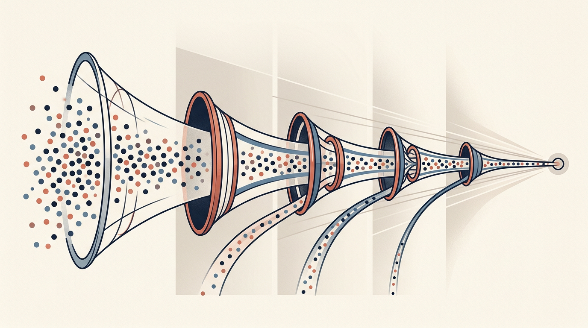
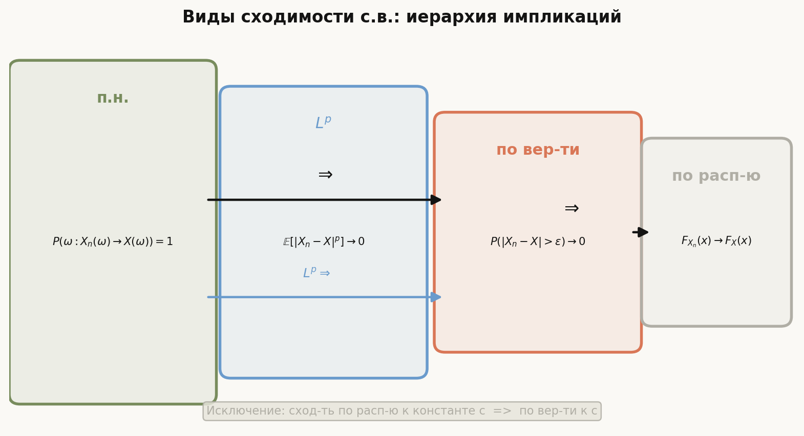
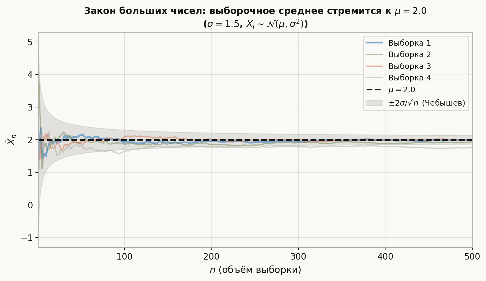

# Лекция: неравенства, виды сходимости, законы больших чисел

Предыдущие лекции дали нам язык: пространство, случайные величины, их числовые характеристики. Теперь — инструменты управления неопределённостью. **Неравенства** Маркова, Чебышёва и Йенсена позволяют оценивать вероятности хвостов без знания точного закона. **Лемма Бореля–Кантелли** отвечает на вопрос «происходит ли событие бесконечно часто». **Виды сходимости** описывают, что значит «последовательность с.в. стремится к пределу» — здесь ответов несколько, и они не эквивалентны. **Законы больших чисел** объясняют, почему статистика работает: выборочное среднее сходится к теоретическому МО. Закон повторного логарифма описывает точный предел осцилляций.

Главная линия лекции:
$$
\text{неравенства} \;\to\; \text{лемма Б.-К.} \;\to\; \xrightarrow{\text{п.н.}},\; \xrightarrow{P},\; \xrightarrow{L^p},\; \xrightarrow{d} \;\to\; \text{ЗБЧ и УЗБЧ} \;\to\; \text{ЗПЛ}.
$$

Как читать эту лекцию:

- разделы 1–3 — три ключевых неравенства; достаточно понять доказательства и знать условия;
- раздел 4 — лемма Бореля–Кантелли: прямая (сходимость рядов → конечность числа событий) и обратная;
- разделы 5–8 — четыре вида сходимости, определения и примеры;
- раздел 9 — диаграмма взаимосвязей, контрпримеры;
- раздел 10 — теорема Слуцкого;
- разделы 11–13 — ЗБЧ, УЗБЧ, ЗПЛ;
- разделы 14–17 — ошибки, ориентир для ШАД, итог, самопроверка.

---

## План

1. Неравенство Маркова
2. Неравенство Чебышёва
3. Неравенство Йенсена
4. Лемма Бореля–Кантелли
5. Сходимость почти наверное
6. Сходимость по вероятности
7. Сходимость в среднем порядка $p$
8. Сходимость по распределению
9. Взаимосвязи видов сходимости
10. Теорема Слуцкого
11. Закон больших чисел (слабый)
12. Усиленный закон больших чисел
13. Закон повторного логарифма
14. Типичные ошибки
15. Что важно для поступления в ШАД
16. Итог
17. Вопросы для самопроверки

---

## 1. Неравенство Маркова

### Теорема

Пусть $X \ge 0$ — неотрицательная с.в. с конечным МО. Тогда для любого $a > 0$:

$$
\boxed{\mathbb{P}(X \ge a) \le \frac{\mathbb{E}[X]}{a}.}
$$

### Доказательство

Запишем $\mathbb{E}[X]$ через интеграл, выделив часть на $\{X \ge a\}$:

$$
\mathbb{E}[X] = \mathbb{E}[X \,\mathbf{1}_{X \ge a}] + \mathbb{E}[X \,\mathbf{1}_{X < a}] \ge \mathbb{E}[X \,\mathbf{1}_{X \ge a}] \ge a \,\mathbb{P}(X \ge a).
$$

Разделив на $a > 0$, получаем утверждение. $\square$

### Пример

Средний балл по задаче — $\mathbb{E}[X] = 3$ из 10 возможных. Вероятность получить $\ge 9$:

$$
\mathbb{P}(X \ge 9) \le \frac{3}{9} = \frac{1}{3}.
$$

Оценка грубая, но работает без знания распределения.

### Важные замечания

- Требуется только $X \ge 0$ и существование $\mathbb{E}[X]$.
- Для произвольной с.в. применяют к $|X|$: $\mathbb{P}(|X| \ge a) \le \mathbb{E}[|X|]/a$.
- Оценка оптимальна по порядку: для $X \sim \mathrm{Exp}(\lambda)$ при $a \to \infty$ обе части $\sim C/a$.

---

## 2. Неравенство Чебышёва

### Теорема

Пусть $\mathbb{E}[X^2] < \infty$. Тогда для любого $\varepsilon > 0$:

$$
\boxed{\mathbb{P}(|X - \mathbb{E}[X]| \ge \varepsilon) \le \frac{\mathrm{Var}(X)}{\varepsilon^2}.}
$$

### Доказательство

Применим неравенство Маркова к неотрицательной с.в. $(X - \mu)^2$ при пороге $\varepsilon^2$:

$$
\mathbb{P}((X-\mu)^2 \ge \varepsilon^2) \le \frac{\mathbb{E}[(X-\mu)^2]}{\varepsilon^2} = \frac{\mathrm{Var}(X)}{\varepsilon^2}. \quad \square
$$

### Пример

$X$ — время ответа сервера, $\mathbb{E}[X] = 200$ мс, $\sigma = 50$ мс. Вероятность отклонения $\ge 150$ мс:

$$
\mathbb{P}(|X - 200| \ge 150) \le \frac{50^2}{150^2} = \frac{2500}{22500} \approx 0.111.
$$

Реальная вероятность обычно намного меньше — неравенство Чебышёва очень консервативно.

### Следствие: оценка через $k$ сигм

$$
\mathbb{P}(|X - \mu| \ge k\sigma) \le \frac{1}{k^2}.
$$

При $k=2$: $\mathbb{P}(|X-\mu| \ge 2\sigma) \le 1/4$; при $k=3$: $\le 1/9$.

---

## 3. Неравенство Йенсена

### Теорема

Пусть $\varphi : \mathbb{R} \to \mathbb{R}$ — **выпуклая** функция и $\mathbb{E}[|X|] < \infty$. Тогда:

$$
\boxed{\varphi(\mathbb{E}[X]) \le \mathbb{E}[\varphi(X)].}
$$

Если $\varphi$ **вогнутая**, неравенство меняет знак.

### Доказательство (схема)

Для выпуклой $\varphi$ в точке $\mu = \mathbb{E}[X]$ существует опорная прямая:

$$
\varphi(x) \ge \varphi(\mu) + c(x - \mu) \quad \forall x,
$$

где $c$ — любая субградиентная константа. Взяв МО от обеих частей:

$$
\mathbb{E}[\varphi(X)] \ge \varphi(\mu) + c(\mathbb{E}[X] - \mu) = \varphi(\mu). \quad \square
$$

### Таблица примеров

| Функция $\varphi$ | Выпукла/вогнута | Следствие |
|---|---|---|
| $x^2$ | выпукла | $(\mathbb{E}[X])^2 \le \mathbb{E}[X^2]$ |
| $e^x$ | выпукла | $e^{\mathbb{E}[X]} \le \mathbb{E}[e^X]$ |
| $\ln x\; (x>0)$ | вогнута | $\ln \mathbb{E}[X] \ge \mathbb{E}[\ln X]$ |
| $\sqrt{x}\; (x\ge 0)$ | вогнута | $\sqrt{\mathbb{E}[X]} \ge \mathbb{E}[\sqrt{X}]$ |
| $1/x\; (x>0)$ | выпукла | $1/\mathbb{E}[X] \le \mathbb{E}[1/X]$ |

### Пример: неравенство AM–GM

При $X$ равномерном на $\{a_1, \ldots, a_n\}$ (все $a_i > 0$) и $\varphi(x) = -\ln x$:

$$
-\ln\!\left(\frac{a_1+\cdots+a_n}{n}\right) \le -\frac{\ln a_1 + \cdots + \ln a_n}{n},
$$

что равносильно AM $\ge$ GM.

---

## 4. Лемма Бореля–Кантелли

Пусть $(A_n)_{n \ge 1}$ — последовательность событий. Введём:

$$
\{A_n \text{ б.ч.}\} \coloneqq \limsup_n A_n = \bigcap_{n=1}^\infty \bigcup_{k=n}^\infty A_k
$$

— событие «$A_n$ происходит бесконечно часто».

### Прямая лемма (сходимость ряда → конечное число)

**Теорема.** Если $\sum_{n=1}^\infty \mathbb{P}(A_n) < \infty$, то $\mathbb{P}(A_n \text{ б.ч.}) = 0$.

**Доказательство.**

$$
\mathbb{P}\!\left(\bigcup_{k=n}^\infty A_k\right) \le \sum_{k=n}^\infty \mathbb{P}(A_k) \xrightarrow{n\to\infty} 0,
$$

поскольку хвост сходящегося ряда стремится к нулю. Так как $\{A_n \text{ б.ч.}\} \subseteq \bigcup_{k=n}^\infty A_k$ для всех $n$, получаем $\mathbb{P}(A_n \text{ б.ч.}) = 0$. $\square$

### Обратная лемма (независимость + расходимость → бесконечно часто)

**Теорема.** Если $(A_n)$ **попарно независимы** и $\sum_{n=1}^\infty \mathbb{P}(A_n) = \infty$, то $\mathbb{P}(A_n \text{ б.ч.}) = 1$.

### Пример: правило «1 из 1000»

На каждом шаге ошибка с вероятностью $p = 0.001$, шаги независимы. Тогда $\sum p_n = \infty$ и $\mathbb{P}(\text{б.ч. ошибок}) = 1$. При $p_n = 1/n^2$: $\sum 1/n^2 = \pi^2/6 < \infty$ — ошибки прекратятся в конечном счёте.

---

## 5. Сходимость почти наверное

### Определение

Последовательность $(X_n)$ **сходится почти наверное** (п.н.) к $X$:

$$
X_n \xrightarrow{\text{п.н.}} X \quad \Longleftrightarrow \quad \mathbb{P}\!\left(\omega : X_n(\omega) \to X(\omega)\right) = 1.
$$

Это поточечная сходимость на множестве вероятности 1 — самый сильный вид сходимости с.в.

### Критерий через лемму Б.-К.

$$
X_n \xrightarrow{\text{п.н.}} X \iff \forall \varepsilon > 0 : \mathbb{P}\!\left(\sup_{k \ge n} |X_k - X| > \varepsilon\right) \xrightarrow{n\to\infty} 0.
$$

Эквивалентно: $\mathbb{P}(|X_n - X| > \varepsilon \text{ б.ч.}) = 0$ для всех $\varepsilon > 0$.

### Пример

$X_n = \frac{1}{n}$ на любом вероятностном пространстве. Тогда $X_n(\omega) = 1/n \to 0$ для **всех** $\omega$, значит $X_n \xrightarrow{\text{п.н.}} 0$.

---

## 6. Сходимость по вероятности

### Определение

$(X_n)$ **сходится по вероятности** к $X$:

$$
X_n \xrightarrow{P} X \quad \Longleftrightarrow \quad \forall \varepsilon > 0 : \mathbb{P}(|X_n - X| > \varepsilon) \xrightarrow{n\to\infty} 0.
$$

Это слабее сходимости п.н.: фиксируется $\varepsilon$ и смотрим на отдельные вероятности, а не на траектории.

### Пример: «убегающий горб»

Пусть $\Omega = [0,1]$ с мерой Лебега. Определим $X_n$ как индикатор «убегающих» отрезков:

$$
X_1 = \mathbf{1}_{[0,1]},\; X_2 = \mathbf{1}_{[0,1/2]},\; X_3 = \mathbf{1}_{[1/2,1]},\; X_4 = \mathbf{1}_{[0,1/3]}, \ldots
$$

Тогда $\mathbb{P}(X_n \ne 0) \to 0$, значит $X_n \xrightarrow{P} 0$. Но для каждого $\omega \in [0,1]$ значение $X_n(\omega)$ принимает 1 бесконечно часто — сходимости п.н. нет.

---

## 7. Сходимость в среднем порядка $p$

### Определение

$(X_n)$ **сходится в $L^p$** ($p \ge 1$) к $X$:

$$
X_n \xrightarrow{L^p} X \quad \Longleftrightarrow \quad \mathbb{E}[|X_n - X|^p] \xrightarrow{n\to\infty} 0.
$$

При $p=2$ — сходимость в среднеквадратическом (среднеквадратичная).

### Связь с другими видами

Если $X_n \xrightarrow{L^p} X$, то $X_n \xrightarrow{P} X$ (по неравенству Маркова):

$$
\mathbb{P}(|X_n - X| > \varepsilon) \le \frac{\mathbb{E}[|X_n - X|^p]}{\varepsilon^p} \to 0.
$$

Обратное неверно: можно иметь $X_n \xrightarrow{P} 0$, но $\mathbb{E}[|X_n|^p] \not\to 0$.

### Контрпример

На $[0,1]$: $X_n = n^{1/p} \mathbf{1}_{[0, 1/n]}$. Тогда $\mathbb{P}(|X_n| > \varepsilon) = 1/n \to 0$, но:

$$
\mathbb{E}[|X_n|^p] = n \cdot \frac{1}{n} = 1 \not\to 0.
$$

---

## 8. Сходимость по распределению

### Определение

$(X_n)$ **сходится по распределению** (слабо) к $X$:

$$
X_n \xrightarrow{d} X \quad \Longleftrightarrow \quad F_{X_n}(x) \to F_X(x) \text{ в каждой точке непрерывности } F_X.
$$

Это самый слабый вид сходимости: работает с распределениями, не с самими с.в. (они могут быть определены на разных пространствах).

### Пример: ЦПТ

Если $X_1, X_2, \ldots$ — н.о.р., $\mathbb{E}[X_i] = \mu$, $\mathrm{Var}(X_i) = \sigma^2$, то:

$$
\frac{\sum_{i=1}^n X_i - n\mu}{\sigma\sqrt{n}} \xrightarrow{d} \mathcal{N}(0,1).
$$

### Пример: сходимость к константе

$X_n \xrightarrow{d} c$ (константа) $\iff$ $X_n \xrightarrow{P} c$. Это единственный случай, когда $\xrightarrow{d}$ влечёт $\xrightarrow{P}$.

---

## 9. Взаимосвязи видов сходимости

### Импликации (стрелки)

$$
X_n \xrightarrow{\text{п.н.}} X \implies X_n \xrightarrow{P} X \implies X_n \xrightarrow{d} X.
$$

$$
X_n \xrightarrow{L^p} X \implies X_n \xrightarrow{P} X \implies X_n \xrightarrow{d} X.
$$

Между $\xrightarrow{\text{п.н.}}$ и $\xrightarrow{L^p}$ импликаций в общем нет.

### Когда $\xrightarrow{P}$ влечёт $\xrightarrow{\text{п.н.}}$

Из $X_n \xrightarrow{P} X$ можно извлечь **подпоследовательность**, сходящуюся п.н. (теорема Рисса).

### Когда $\xrightarrow{d}$ влечёт $\xrightarrow{P}$

Только если предел — константа.

### Сводная таблица

| Вид сходимости | Определение | Сила |
|---|---|---|
| п.н. | траектории сходятся на множестве вероятности 1 | сильнейший |
| $L^p$ | $\mathbb{E}[|X_n - X|^p] \to 0$ | — |
| по вероятности | $\mathbb{P}(|X_n-X|>\varepsilon)\to 0$ | — |
| по распределению | $F_{X_n}(x)\to F_X(x)$ в точках непр. | слабейший |

### Пример: последовательность, сходящаяся по вероятности, но не п.н.

Пространство $(\Omega, \mathcal{F}, \mathbb{P}) = ([0,1], \mathcal{B}, \lambda)$.

Построим «блуждающий горб»: индексируем через пары $(m, k)$ и определяем $X_{m,k} = \mathbf{1}_{[k/m,\,(k+1)/m]}$, перебирая их в порядке $(1,0),\,(2,0),(2,1),\,(3,0),\ldots$ — т.е. $X_1,X_2,X_3,\ldots$

- $\mathbb{P}(|X_n - 0| > \varepsilon) = 1/m \to 0$ (ширина горба → 0) → $X_n \xrightarrow{P} 0$.
- Для любого $\omega \in [0,1]$: $X_n(\omega) = 1$ бесконечно часто (горб возвращается) → $X_n(\omega) \not\to 0$ → сходимости п.н. **нет**.

Этот пример объясняет, почему стрелка $\xrightarrow{P} \not\Rightarrow \xrightarrow{\text{п.н.}}$ в диаграмме.

---

## 10. Теорема Слуцкого

### Теорема

Пусть $X_n \xrightarrow{d} X$ и $Y_n \xrightarrow{P} c$ (константа). Тогда:

$$
X_n + Y_n \xrightarrow{d} X + c, \qquad X_n Y_n \xrightarrow{d} cX, \qquad \frac{X_n}{Y_n} \xrightarrow{d} \frac{X}{c} \text{ (при }c \ne 0\text{)}.
$$

### Применение

Если $S_n/\sqrt{n} \xrightarrow{d} \mathcal{N}(0, \sigma^2)$ и $\hat{\sigma}_n \xrightarrow{P} \sigma$, то:

$$
\frac{S_n/\sqrt{n}}{\hat{\sigma}_n} \xrightarrow{d} \mathcal{N}(0, 1).
$$

Это основа t-критерия с оценённой дисперсией.

### Предостережение

Если оба $X_n \xrightarrow{d} X$ и $Y_n \xrightarrow{d} Y$, то $X_n + Y_n$ не обязательно сходится к $X + Y$ — нужна совместная сходимость. Теорема Слуцкого обходит это, требуя $\xrightarrow{P}$ для второго.

---

## 11. Закон больших чисел (слабый ЗБЧ)

### Теорема (Чебышёв, 1867)

Пусть $X_1, X_2, \ldots$ — **попарно некоррелированные** с.в. с $\mathbb{E}[X_i] = \mu$, $\mathrm{Var}(X_i) \le C < \infty$. Тогда:

$$
\bar{X}_n = \frac{X_1 + \cdots + X_n}{n} \xrightarrow{P} \mu.
$$

### Доказательство (через Чебышёва)

$$
\mathbb{P}(|\bar{X}_n - \mu| \ge \varepsilon) \le \frac{\mathrm{Var}(\bar{X}_n)}{\varepsilon^2} = \frac{\mathrm{Var}(X_1)}{n\varepsilon^2} \le \frac{C}{n\varepsilon^2} \xrightarrow{n\to\infty} 0. \quad \square
$$

### Теорема (Хинчин, н.о.р. случай)

Если $X_1, X_2, \ldots$ — **н.о.р.** с $\mathbb{E}[|X_1|] < \infty$ и $\mathbb{E}[X_1] = \mu$, то $\bar{X}_n \xrightarrow{P} \mu$.

Доказательство использует характеристические функции (лекция 7).

---

## 12. Усиленный закон больших чисел

### Теорема (Колмогоров)

Пусть $X_1, X_2, \ldots$ — **н.о.р.**, $\mathbb{E}[|X_1|] < \infty$, $\mathbb{E}[X_1] = \mu$. Тогда:

$$
\bar{X}_n \xrightarrow{\text{п.н.}} \mu.
$$

Сходимость **почти наверная** — траекторной: для почти всех $\omega$ выборочное среднее сходится к $\mu$.

### Необходимость условия $\mathbb{E}[|X|] < \infty$

Если $\mathbb{E}[|X_1|] = \infty$, то $\bar{X}_n$ расходится п.н. (теорема Колмогорова). Таким образом, $\mathbb{E}[|X_1|] < \infty$ — необходимо и достаточно для УЗБЧ.

### Доказательство (упрощённый вариант при $\mathbb{E}[X_i^4] < \infty$)

Достаточно показать $\sum_n \mathbb{P}(|\bar{X}_n - \mu| > \varepsilon) < \infty$ и применить лемму Б.-К.

$$
\mathbb{E}[(S_n - n\mu)^4] = n\mathbb{E}[(X_1-\mu)^4] + 3n(n-1)(\mathrm{Var}(X_1))^2 = O(n^2).
$$

По неравенству Маркова:

$$
\mathbb{P}(|\bar{X}_n - \mu| > \varepsilon) = \mathbb{P}\!\left(|S_n - n\mu|^4 > n^4\varepsilon^4\right) \le \frac{O(n^2)}{n^4\varepsilon^4} = \frac{O(1)}{n^2}.
$$

Ряд $\sum 1/n^2$ сходится, значит $\mathbb{P}(|\bar{X}_n - \mu| > \varepsilon \text{ б.ч.}) = 0$ по лемме Б.-К. $\square$

---

## 13. Закон повторного логарифма

### Теорема (Хартман–Винтнер)

Пусть $X_1, X_2, \ldots$ — **н.о.р.**, $\mathbb{E}[X_i] = 0$, $\mathbb{E}[X_i^2] = \sigma^2 \in (0,\infty)$. Обозначим $S_n = X_1 + \cdots + X_n$. Тогда п.н.:

$$
\limsup_{n \to \infty} \frac{S_n}{\sigma\sqrt{2n\ln\ln n}} = 1, \qquad \liminf_{n \to \infty} \frac{S_n}{\sigma\sqrt{2n\ln\ln n}} = -1.
$$

### Интерпретация

- УЗБЧ говорит: $S_n / n \to 0$.
- ЦПТ говорит: $S_n / (\sigma\sqrt{n})$ имеет нормальное распределение.
- ЗПЛ уточняет: типичное отклонение $S_n$ от нуля — порядка $\sigma\sqrt{n}$, а «максимальный» рост — $\sigma\sqrt{2n\ln\ln n}$.

Знаменатель $\sqrt{2n\ln\ln n}$ называют **нормировкой ЗПЛ**: это точная граница, за которую $S_n$ выходит лишь конечное число раз.

### Пример для монеты

Бросаем честную монету, $X_i = \pm 1$, $\sigma = 1$. ЗПЛ предсказывает: максимальное «везение» к шагу $n$ порядка $\sqrt{2n\ln\ln n}$. При $n = 10^6$ это $\approx \sqrt{2 \cdot 10^6 \cdot \ln\ln 10^6} \approx \sqrt{2 \cdot 10^6 \cdot 2.97} \approx 2438$.

---

## 14. Типичные ошибки

**1. Путаница дисперсии и среднего в Чебышёве.**  
Неравенство Чебышёва оценивает $\mathbb{P}(|X - \mu| \ge \varepsilon)$, а не $\mathbb{P}(X \ge \varepsilon)$. Не забывайте центрировать.

**2. Применение Маркова к отрицательным с.в.**  
Неравенство Маркова требует $X \ge 0$. Для произвольной с.в. надо переходить к $|X|$ или $(X-c)^2$ и т.д.

**3. «ЗБЧ ⟹ УЗБЧ».**  
Слабый ЗБЧ даёт $\xrightarrow{P}$, УЗБЧ — $\xrightarrow{\text{п.н.}}$. Это более сильное утверждение и требует других условий (или иного доказательства).

**4. Отождествление сходимости по распределению и по вероятности.**  
$X_n \xrightarrow{d} X$ не означает $\mathbb{P}(|X_n - X| > \varepsilon) \to 0$, потому что $X_n$ и $X$ могут быть определены на разных пространствах или быть независимы.

**5. «Некоррелированные ⟹ независимые».**  
Теорема Чебышёва требует лишь некоррелированности. Но некоррелированность не влечёт независимости (пример: $X, X^2$ для $X\sim\mathcal{N}(0,1)$).

**6. Неправильное применение обратной леммы Б.-К.**  
Обратная лемма требует **попарной** (минимум) независимости. Без неё $\sum p_n = \infty$ не гарантирует $\mathbb{P}(\text{б.ч.}) = 1$.

**7. «ЗПЛ говорит, что максимум $S_n$ растёт как $\sqrt{n\ln\ln n}$».**  
ЗПЛ о $\limsup$: $S_n$ превышает $(1-\varepsilon)\sigma\sqrt{2n\ln\ln n}$ бесконечно часто, но превышает $(1+\varepsilon)\sigma\sqrt{2n\ln\ln n}$ лишь конечное число раз.

---

## 15. Что важно для поступления в ШАД

- Знать **доказательства** неравенств Маркова и Чебышёва (один—два шага).
- Уметь применять Йенсена: определить выпуклость/вогнутость по $\varphi''$.
- Знать **прямую** лемму Бореля–Кантелли наизусть и уметь доказывать.
- Чётко различать 4 вида сходимости и знать диаграмму импликаций.
- Уметь строить **контрпримеры**: «убегающий горб» — $\xrightarrow{P}$ без $\xrightarrow{\text{п.н.}}$.
- Знать формулировку и доказательство слабого ЗБЧ (через Чебышёва).
- Знать формулировку УЗБЧ и условие $\mathbb{E}[|X|] < \infty$.
- Уметь **применять теорему Слуцкого** в задачах на предельные распределения статистик.
- ЗПЛ: знать формулировку и интерпретацию, доказательство не требуется.

---

## 16. Итог

Неравенства Маркова и Чебышёва — это инструменты контроля хвостов распределений через МО и дисперсию, без знания точного закона. Неравенство Йенсена описывает нелинейность МО для выпуклых функций. Лемма Бореля–Кантелли связывает сходимость рядов вероятностей с поведением событий «бесконечно часто». Четыре вида сходимости с.в. (п.н., по вероятности, в $L^p$, по распределению) образуют иерархию: каждый влечёт следующий, но не наоборот. Теорема Слуцкого позволяет передавать сходимость по распределению через операции при условии, что второй множитель сходится по вероятности к константе. Слабый ЗБЧ (через Чебышёва) и усиленный ЗБЧ (Колмогорова) устанавливают сходимость выборочного среднего к МО — соответственно по вероятности и почти наверное. Закон повторного логарифма задаёт точный масштаб флуктуаций частичных сумм.

---

## 17. Вопросы для самопроверки

1. Докажите неравенство Маркова. Почему оно требует $X \ge 0$?
2. Как из Маркова вывести неравенство Чебышёва?
3. Что такое выпуклая функция? Как проверить выпуклость через вторую производную?
4. Сформулируйте неравенство Йенсена. Почему $\mathbb{E}[\ln X] \le \ln \mathbb{E}[X]$?
5. Что означает событие $\{A_n \text{ б.ч.}\}$? Запишите его через $\limsup$.
6. Сформулируйте прямую лемму Бореля–Кантелли. Когда применяется обратная?
7. Дайте определения всех четырёх видов сходимости с.в.
8. Существует ли последовательность $X_n \xrightarrow{P} 0$, но не сходящаяся п.н.? Постройте пример.
9. Верно ли, что $X_n \xrightarrow{d} X$ и $Y_n \xrightarrow{d} Y$ влечёт $X_n + Y_n \xrightarrow{d} X+Y$?
10. Сформулируйте слабый ЗБЧ. Докажите его с помощью неравенства Чебышёва.
11. Чем УЗБЧ отличается от слабого ЗБЧ? Какое условие необходимо и достаточно для УЗБЧ?
12. Что говорит ЗПЛ об осцилляциях $S_n$? Почему нормировка $\sqrt{n\ln\ln n}$, а не $\sqrt{n}$?
