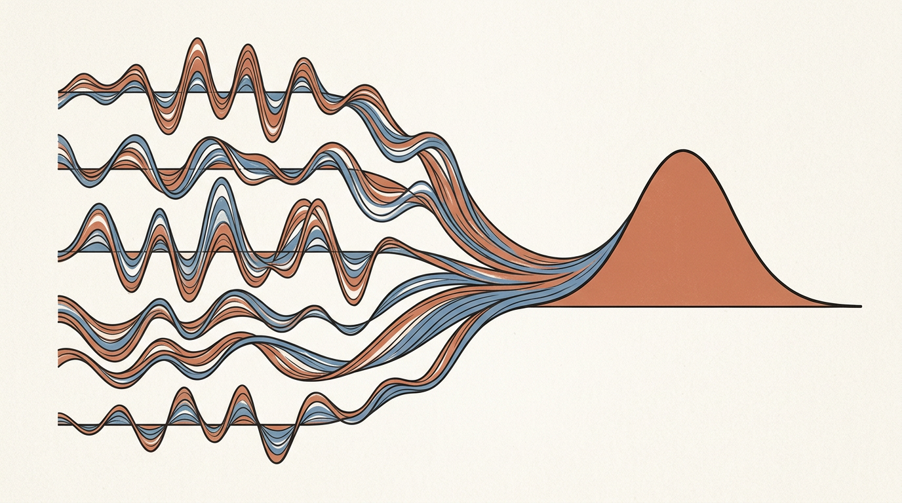
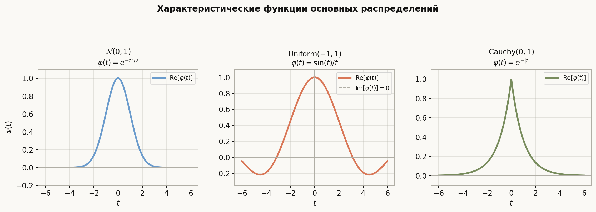
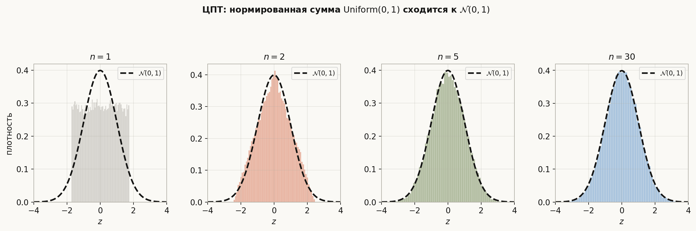
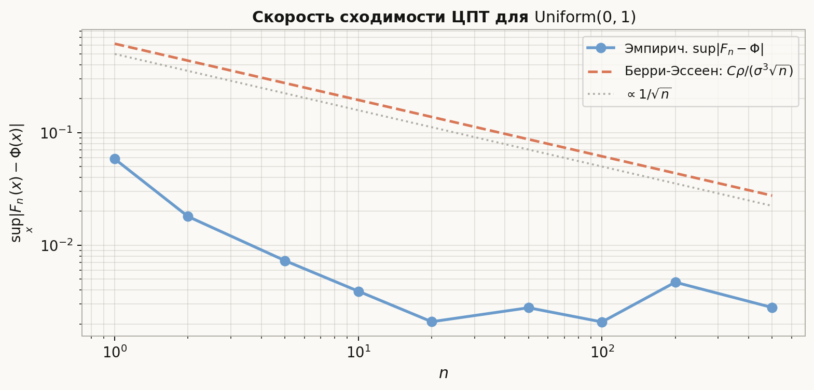

# Лекция: характеристические функции и центральная предельная теорема

Лекция 6 дала нам инструменты ограничения и виды сходимости. Теперь — самый мощный аналитический аппарат теории вероятностей: **характеристическая функция** (х.ф.) — это преобразование Фурье от меры распределения. Она кодирует закон с.в. в единственном объекте, переводит свёртку в произведение и обладает регулярностью, которой нет у плотности. Венец этой теории — **центральная предельная теорема**: при определённых условиях нормированная сумма независимых с.в. стремится к нормальному закону, что объясняет его повсеместное господство в природе и статистике.

Главная линия лекции:
$$
\varphi_X(t) = \mathbb{E}[e^{itX}] \;\to\; \text{свойства} \;\to\; \text{теор. ед-ти и непр-ти} \;\to\; \text{доказательство ЦПТ} \;\to\; \text{многомерная ЦПТ} \;\to\; \text{Берри–Эссеен}.
$$

Как читать эту лекцию:

- разделы 1–2 — определение и примеры для основных распределений;
- разделы 3–4 — свойства: линейность, независимость, моменты через производные;
- разделы 5–6 — теорема единственности и теорема непрерывности Леви;
- раздел 7 — доказательство ЦПТ через х.ф.;
- раздел 8 — формулировка ЦПТ, интерпретация, примеры;
- раздел 9 — многомерный аналог;
- раздел 10 — скорость сходимости: неравенство Берри–Эссеена;
- разделы 11–14 — ошибки, ориентир для ШАД, итог, самопроверка.

---

## План

1. Определение характеристической функции
2. Примеры характеристических функций
3. Основные свойства характеристической функции
4. Моменты и производные характеристической функции
5. Теорема единственности
6. Теорема непрерывности (Леви)
7. Доказательство ЦПТ через характеристические функции
8. Центральная предельная теорема: формулировка и интерпретация
9. Многомерный аналог ЦПТ
10. Скорость сходимости: неравенство Берри–Эссеена
11. Типичные ошибки
12. Что важно для поступления в ШАД
13. Итог
14. Вопросы для самопроверки

---

## 1. Определение характеристической функции

### Определение

**Характеристической функцией** (х.ф.) случайной величины $X$ называется:

$$
\boxed{\varphi_X(t) = \mathbb{E}[e^{itX}] = \mathbb{E}[\cos(tX)] + i\,\mathbb{E}[\sin(tX)], \quad t \in \mathbb{R}.}
$$

Для дискретной с.в.: $\varphi_X(t) = \sum_k p_k e^{itx_k}$.

Для непрерывной с.в.: $\varphi_X(t) = \int_{-\infty}^\infty e^{itx} f(x)\, dx$.

Х.ф. всегда существует (так как $|e^{itX}| = 1$, МО конечно), и $\varphi_X(t) \in \mathbb{C}$.

### Связь с преобразованием Фурье

Характеристическая функция — это преобразование Фурье меры распределения $\mu_X$:

$$
\varphi_X(t) = \hat{\mu}_X(-t) = \int e^{itx}\, d\mu_X(x).
$$

Обратное преобразование Фурье восстанавливает $\mu_X$ — отсюда теорема единственности.

---

## 2. Примеры характеристических функций

### Бернулли: $X \sim \mathrm{Ber}(p)$

$$
\varphi_X(t) = (1-p) + p\,e^{it} = 1 - p(1 - e^{it}).
$$

### Биномиальное: $X \sim \mathrm{Bin}(n, p)$

$X = \sum_{k=1}^n X_k$, где $X_k$ — н.о.р. $\mathrm{Ber}(p)$. По свойству независимости:

$$
\varphi_X(t) = [(1-p) + p\,e^{it}]^n.
$$

### Пуассон: $X \sim \mathrm{Poisson}(\lambda)$

$$
\varphi_X(t) = \exp(\lambda(e^{it} - 1)).
$$

*Доказательство:*
$$
\varphi_X(t) = \sum_{k=0}^\infty e^{itk} \frac{\lambda^k e^{-\lambda}}{k!} = e^{-\lambda} \sum_{k=0}^\infty \frac{(\lambda e^{it})^k}{k!} = e^{-\lambda} e^{\lambda e^{it}} = \exp(\lambda(e^{it}-1)).
$$

### Нормальное: $X \sim \mathcal{N}(\mu, \sigma^2)$

$$
\varphi_X(t) = \exp\!\left(i\mu t - \frac{\sigma^2 t^2}{2}\right).
$$

*Доказательство для $\mathcal{N}(0,1)$:*
$$
\varphi(t) = \frac{1}{\sqrt{2\pi}}\int_{-\infty}^\infty e^{itx - x^2/2}\, dx = e^{-t^2/2} \cdot \frac{1}{\sqrt{2\pi}}\int e^{-(x-it)^2/2}\, dx = e^{-t^2/2}.
$$

Для $\mathcal{N}(\mu, \sigma^2)$: $X = \mu + \sigma Z$, $\varphi_X(t) = e^{i\mu t}\varphi_Z(\sigma t) = e^{i\mu t - \sigma^2 t^2/2}$.

### Равномерное: $X \sim \mathrm{Uniform}(a, b)$

$$
\varphi_X(t) = \frac{e^{ibt} - e^{iat}}{it(b-a)}.
$$

### Показательное: $X \sim \mathrm{Exp}(\lambda)$

$$
\varphi_X(t) = \frac{\lambda}{\lambda - it}.
$$

### Таблица

| Распределение | Параметры | $\varphi_X(t)$ |
|---|---|---|
| $\mathrm{Ber}(p)$ | $p$ | $(1-p) + pe^{it}$ |
| $\mathrm{Bin}(n,p)$ | $n, p$ | $[(1-p)+pe^{it}]^n$ |
| $\mathrm{Poisson}(\lambda)$ | $\lambda$ | $\exp(\lambda(e^{it}-1))$ |
| $\mathcal{N}(\mu,\sigma^2)$ | $\mu, \sigma^2$ | $\exp(i\mu t - \sigma^2 t^2/2)$ |
| $\mathrm{Uniform}(a,b)$ | $a < b$ | $(e^{ibt}-e^{iat})/(it(b-a))$ |
| $\mathrm{Exp}(\lambda)$ | $\lambda > 0$ | $\lambda/(\lambda - it)$ |
| $\mathrm{Cauchy}(0,1)$ | — | $e^{-|t|}$ |

---

## 3. Основные свойства характеристической функции

### Свойство 1: Нормировка и ограниченность

$$
\varphi_X(0) = 1, \qquad |\varphi_X(t)| \le 1 \;\;\forall t.
$$

*Доказательство:* $|\varphi_X(t)| \le \mathbb{E}[|e^{itX}|] = \mathbb{E}[1] = 1$.

### Свойство 2: Равномерная непрерывность

$\varphi_X(t)$ равномерно непрерывна на $\mathbb{R}$.

### Свойство 3: Эрмитовская симметрия

$$
\varphi_X(-t) = \overline{\varphi_X(t)}.
$$

Если $X$ симметрична относительно 0, то $\varphi_X(t) \in \mathbb{R}$ и чётна.

### Свойство 4: Линейное преобразование

$$
\varphi_{aX+b}(t) = e^{ibt}\,\varphi_X(at).
$$

*Доказательство:* $\mathbb{E}[e^{it(aX+b)}] = e^{ibt}\mathbb{E}[e^{i(at)X}] = e^{ibt}\varphi_X(at)$.

### Свойство 5: Независимость → произведение

Если $X$ и $Y$ **независимы**, то:

$$
\varphi_{X+Y}(t) = \varphi_X(t)\cdot\varphi_Y(t).
$$

Более общо: если $X_1, \ldots, X_n$ независимы, то $\varphi_{X_1+\cdots+X_n}(t) = \prod_{k=1}^n \varphi_{X_k}(t)$.

*Доказательство:* $\mathbb{E}[e^{it(X+Y)}] = \mathbb{E}[e^{itX}e^{itY}] = \mathbb{E}[e^{itX}]\cdot\mathbb{E}[e^{itY}]$ (независимость).

### Следствие: устойчивость нормального закона

Если $X \sim \mathcal{N}(\mu_1, \sigma_1^2)$ и $Y \sim \mathcal{N}(\mu_2, \sigma_2^2)$ независимы:

$$
\varphi_{X+Y}(t) = e^{i\mu_1 t - \sigma_1^2 t^2/2} \cdot e^{i\mu_2 t - \sigma_2^2 t^2/2} = e^{i(\mu_1+\mu_2)t - (\sigma_1^2+\sigma_2^2)t^2/2}.
$$

Значит $X + Y \sim \mathcal{N}(\mu_1+\mu_2, \sigma_1^2+\sigma_2^2)$ — нормальный закон **устойчив** относительно сложения.

---

## 4. Моменты и производные характеристической функции

### Теорема

Если $\mathbb{E}[|X|^n] < \infty$, то $\varphi_X$ $n$ раз дифференцируема и:

$$
\varphi_X^{(k)}(0) = i^k \mathbb{E}[X^k], \quad k = 1, \ldots, n.
$$

В частности: $\mathbb{E}[X] = \frac{\varphi_X'(0)}{i}$, $\mathbb{E}[X^2] = \frac{\varphi_X''(0)}{i^2} = -\varphi_X''(0)$.

### Разложение в ряд

Если все моменты конечны:

$$
\varphi_X(t) = \sum_{k=0}^\infty \frac{(it)^k}{k!} \mathbb{E}[X^k].
$$

### Пример: нормальное $\mathcal{N}(0,1)$

$$
\varphi(t) = e^{-t^2/2} = 1 - \frac{t^2}{2} + \frac{t^4}{8} - \cdots
$$

Отсюда: $\varphi'(0) = 0 \Rightarrow \mathbb{E}[Z] = 0$; $\varphi''(0) = -1 \Rightarrow \mathbb{E}[Z^2] = 1$.

### Кумулянты

Логарифм х.ф. $\ln \varphi_X(t) = \sum_{k=1}^\infty \frac{(it)^k}{k!}\kappa_k$ определяет **кумулянты** $\kappa_k$.

- $\kappa_1 = \mathbb{E}[X]$ (среднее),
- $\kappa_2 = \mathrm{Var}(X)$ (дисперсия),
- $\kappa_3$ связан с асимметрией, $\kappa_4$ — с эксцессом.

Для нормального: $\ln\varphi(t) = i\mu t - \sigma^2 t^2/2$, значит все кумулянты $\kappa_k = 0$ при $k \ge 3$. Это **характеристическое свойство** нормального закона.

---

## 5. Теорема единственности

### Теорема

Характеристическая функция **однозначно** определяет распределение:

$$
\varphi_X = \varphi_Y \iff \mu_X = \mu_Y.
$$

### Формула обращения

Если $\varphi_X \in L^1(\mathbb{R})$ (что выполнено, например, для нормального), то плотность восстанавливается:

$$
f_X(x) = \frac{1}{2\pi}\int_{-\infty}^\infty e^{-itx}\,\varphi_X(t)\, dt.
$$

В общем случае (для произвольных распределений) теорема обращения даёт:

$$
\mu_X(a, b) = \lim_{T\to\infty} \frac{1}{2\pi}\int_{-T}^T \frac{e^{-ita} - e^{-itb}}{it}\,\varphi_X(t)\, dt.
$$

### Применение

Чтобы доказать, что две с.в. имеют одинаковое распределение, достаточно проверить, что их х.ф. совпадают — это обычно проще, чем сравнивать CDF или плотности напрямую.

---

## 6. Теорема непрерывности (Леви)

### Теорема

Последовательность $(X_n)$ сходится по распределению к $X$ тогда и только тогда, когда:

$$
\varphi_{X_n}(t) \to \varphi_X(t) \quad \forall t \in \mathbb{R}.
$$

Эквивалентно: $X_n \xrightarrow{d} X \iff \varphi_{X_n}(t) \to \varphi_X(t)$ поточечно.

### Важное следствие

Если $\varphi_{X_n}(t) \to \varphi(t)$ поточечно, и $\varphi$ непрерывна в нуле, то $\varphi$ является характеристической функцией некоторого распределения $X$, и $X_n \xrightarrow{d} X$.

Теорема Леви превращает вычисление предельного распределения в задачу анализа: нужно найти предел х.ф. и опознать его.

---

## 7. Доказательство ЦПТ через характеристические функции

Пусть $X_1, X_2, \ldots$ — н.о.р., $\mathbb{E}[X_i] = 0$, $\mathbb{E}[X_i^2] = \sigma^2 \in (0, \infty)$. Обозначим:

$$
S_n = X_1 + \cdots + X_n, \qquad Z_n = \frac{S_n}{\sigma\sqrt{n}}.
$$

Надо показать: $Z_n \xrightarrow{d} \mathcal{N}(0,1)$.

### Шаг 1: х.ф. нормированной суммы

$$
\varphi_{Z_n}(t) = \varphi_{S_n/(\sigma\sqrt{n})}(t) = \varphi_{S_n}\!\left(\frac{t}{\sigma\sqrt{n}}\right) = \left[\varphi_X\!\left(\frac{t}{\sigma\sqrt{n}}\right)\right]^n.
$$

(использовали независимость и свойства 4, 5).

### Шаг 2: разложение $\varphi_X$ в нуле

Так как $\mathbb{E}[X] = 0$ и $\mathbb{E}[X^2] = \sigma^2$:

$$
\varphi_X(u) = 1 + iu\mathbb{E}[X] - \frac{u^2}{2}\mathbb{E}[X^2] + o(u^2) = 1 - \frac{\sigma^2 u^2}{2} + o(u^2).
$$

При $u = t/(\sigma\sqrt{n}) \to 0$:

$$
\varphi_X\!\left(\frac{t}{\sigma\sqrt{n}}\right) = 1 - \frac{\sigma^2}{2} \cdot \frac{t^2}{\sigma^2 n} + o\!\left(\frac{1}{n}\right) = 1 - \frac{t^2}{2n} + o\!\left(\frac{1}{n}\right).
$$

### Шаг 3: предел при $n \to \infty$

$$
\varphi_{Z_n}(t) = \left[1 - \frac{t^2}{2n} + o\!\left(\frac{1}{n}\right)\right]^n \xrightarrow{n\to\infty} e^{-t^2/2}.
$$

(использовали: $(1 + a_n/n)^n \to e^a$ при $a_n \to a$.)

### Шаг 4: теорема Леви

$e^{-t^2/2}$ — х.ф. стандартного нормального $\mathcal{N}(0,1)$. По теореме непрерывности:

$$
Z_n \xrightarrow{d} \mathcal{N}(0,1). \quad \square
$$

---

## 8. Центральная предельная теорема: формулировка и интерпретация

### Теорема (ЦПТ)

Пусть $X_1, X_2, \ldots$ — **н.о.р.** с $\mathbb{E}[X_i] = \mu$ и $\mathrm{Var}(X_i) = \sigma^2 \in (0, \infty)$. Тогда:

$$
\boxed{\frac{X_1 + \cdots + X_n - n\mu}{\sigma\sqrt{n}} \xrightarrow{d} \mathcal{N}(0,1).}
$$

Эквивалентно: $\bar{X}_n \xrightarrow{d} \mathcal{N}\!\left(\mu,\, \frac{\sigma^2}{n}\right)$.

### Практическая форма

Для больших $n$:

$$
\mathbb{P}\!\left(a \le \frac{S_n - n\mu}{\sigma\sqrt{n}} \le b\right) \approx \Phi(b) - \Phi(a),
$$

где $\Phi$ — CDF стандартного нормального.

### Пример: сумма кубиков

Бросаем $n = 100$ правильных кубиков ($X_i \sim \mathrm{Uniform}\{1,\ldots,6\}$), $\mu = 3.5$, $\sigma^2 = 35/12$.

$$
\mathbb{P}(S_{100} \ge 370) = \mathbb{P}\!\left(\frac{S_{100}-350}{\sqrt{100\cdot 35/12}} \ge \frac{370-350}{\sqrt{100\cdot 35/12}}\right) \approx \mathbb{P}(Z \ge 1.96) \approx 0.025.
$$

### Когда ЦПТ применима

- **Всегда** при н.о.р. с конечной дисперсией.
- При зависимых с.в. нужны дополнительные условия (условие Линдберга — см. ниже).

### Теорема Линдберга (обобщение)

Пусть $X_1, X_2, \ldots$ — **независимые** (необязательно одинаково распределённые), $\mathbb{E}[X_k] = \mu_k$, $\mathrm{Var}(X_k) = \sigma_k^2$, $B_n^2 = \sum_{k=1}^n \sigma_k^2$. Если выполнено **условие Линдберга**: для всех $\varepsilon > 0$

$$
\frac{1}{B_n^2}\sum_{k=1}^n \mathbb{E}\!\left[(X_k - \mu_k)^2 \,\mathbf{1}_{|X_k-\mu_k|>\varepsilon B_n}\right] \to 0,
$$

то $\frac{S_n - \mathbb{E}[S_n]}{B_n} \xrightarrow{d} \mathcal{N}(0,1)$.

Условие Линдберга запрещает отдельным слагаемым «доминировать» в сумме.

---

## 9. Многомерный аналог ЦПТ

### Теорема

Пусть $\mathbf{X}_1, \mathbf{X}_2, \ldots$ — **н.о.р.** $\mathbb{R}^d$-векторы с $\mathbb{E}[\mathbf{X}_i] = \boldsymbol{\mu}$ и матрицей ковариаций $\Sigma$ (конечной). Тогда:

$$
\boxed{\sqrt{n}\,(\bar{\mathbf{X}}_n - \boldsymbol{\mu}) \xrightarrow{d} \mathcal{N}_d(\mathbf{0}, \Sigma).}
$$

### Критерий Крамера–Вольда

$\mathbf{Y}_n \xrightarrow{d} \mathbf{Y}$ в $\mathbb{R}^d$ тогда и только тогда, когда для любого $\mathbf{c} \in \mathbb{R}^d$:

$$
\mathbf{c}^T \mathbf{Y}_n \xrightarrow{d} \mathbf{c}^T \mathbf{Y}.
$$

### Характеристическая функция нормального вектора

Для $\mathbf{X} \sim \mathcal{N}_d(\boldsymbol{\mu}, \Sigma)$:

$$
\varphi_{\mathbf{X}}(\mathbf{t}) = \mathbb{E}[e^{i\mathbf{t}^T\mathbf{X}}] = \exp\!\left(i\boldsymbol{\mu}^T\mathbf{t} - \frac{1}{2}\mathbf{t}^T\Sigma\mathbf{t}\right), \quad \mathbf{t} \in \mathbb{R}^d.
$$

---

## 10. Скорость сходимости: неравенство Берри–Эссеена

### Теорема (Берри–Эссеен)

Пусть $X_1, X_2, \ldots$ — н.о.р., $\mathbb{E}[X_i] = 0$, $\mathbb{E}[X_i^2] = \sigma^2$, $\mathbb{E}[|X_i|^3] = \rho < \infty$. Тогда:

$$
\sup_{x \in \mathbb{R}} \left|F_{Z_n}(x) - \Phi(x)\right| \le \frac{C\rho}{\sigma^3 \sqrt{n}},
$$

где $C \le 0.4748$ (наилучшая известная константа).

### Интерпретация

- Скорость сходимости ЦПТ — порядка $1/\sqrt{n}$.
- При $n = 100$ ошибка приближения $\sim 0.05/\sqrt{100} \cdot C \approx 0.005$ — уже очень малая.
- Чем меньше третий момент $\rho$ относительно $\sigma^3$, тем быстрее сходимость.

---

## 11. Типичные ошибки

**1. «ЦПТ работает для любой суммы».**  
ЦПТ требует конечной дисперсии. Для распределения Коши ($\sigma^2 = \infty$, х.ф. $e^{-|t|}$) сумма $S_n/n$ — снова Коши, а не нормальная.

**2. «Сходимость по распределению означает сходимость по вероятности».**  
ЦПТ даёт $\xrightarrow{d}$, а не $\xrightarrow{P}$ или $\xrightarrow{\text{п.н.}}$. Нельзя применять ЦПТ к траекториям.

**3. «$\varphi_{X+Y}(t) = \varphi_X(t)\varphi_Y(t)$ всегда».**  
Это верно лишь при **независимости** $X$ и $Y$. При зависимости формула неверна.

**4. «Из $\varphi_X = \varphi_Y$ для конкретного $t_0$ следует $X \overset{d}{=} Y$».**  
Теорема единственности требует совпадения на **всей** прямой $\mathbb{R}$.

**5. «ЦПТ — это УЗБЧ».**  
УЗБЧ говорит $\bar{X}_n \to \mu$ (почти наверное, то есть о среднем). ЦПТ — о распределении нормированного отклонения $\sqrt{n}(\bar{X}_n - \mu)$. Это разные утверждения.

**6. «Кумулянт и момент — одно и то же».**  
Кумулянт $\kappa_k$ — функция моментов до $k$-го порядка. $\kappa_1 = \mu$, $\kappa_2 = \sigma^2$, но $\kappa_3 = \mathbb{E}[(X-\mu)^3]$, $\kappa_4 = \mathbb{E}[(X-\mu)^4] - 3\sigma^4$.

**7. Применение ЦПТ без проверки $n$.**  
«Правило $n \ge 30$» — грубое правило. При сильно асимметричных распределениях нужно $n \gg 30$. Берри–Эссеен даёт точную оценку.

---

## 12. Что важно для поступления в ШАД

- Знать определение х.ф. и понимать, почему она всегда существует.
- Уметь **вычислять** х.ф. для основных распределений (нормальное, Пуассон, Бернулли).
- Знать свойства: нормировка, симметрия, линейное преобразование, **независимость → произведение**.
- Формулировать и доказывать **теорему единственности** (на уровне «зачем нужна»).
- Знать **теорему непрерывности** (Леви) — необходима для доказательства ЦПТ.
- Уметь воспроизводить **доказательство ЦПТ** через разложение х.ф. в нуле.
- Знать формулировку ЦПТ и уметь применять её к конкретным задачам.
- Знать **многомерную ЦПТ**: формулировка и критерий Крамера–Вольда.
- Знать неравенство Берри–Эссеена: формулировка, порядок $1/\sqrt{n}$.
- Знать, что нормальный закон характеризуется нулевыми кумулянтами $\kappa_k = 0$ при $k \ge 3$.

---

## 13. Итог

Характеристическая функция — это преобразование Фурье меры распределения. Она всегда существует, равномерно непрерывна, и однозначно определяет закон (теорема единственности). Ключевые свойства: значение в нуле равно 1, при линейных преобразованиях аргумент масштабируется, а при сложении **независимых** с.в. х.ф. перемножаются. Производные в нуле дают моменты: $\varphi^{(k)}(0) = i^k\mathbb{E}[X^k]$. Теорема непрерывности Леви сводит сходимость по распределению к поточечной сходимости х.ф. Центральная предельная теорема (доказывается через разложение х.ф. в нуле) утверждает: нормированная сумма н.о.р. с.в. с конечной дисперсией сходится по распределению к $\mathcal{N}(0,1)$. Обобщение — теорема Линдберга — распространяет это на независимые разнораспределённые с.в. при условии отсутствия «доминирующих» слагаемых. Многомерный аналог ЦПТ: $\sqrt{n}(\bar{\mathbf{X}}_n - \boldsymbol{\mu}) \to \mathcal{N}_d(\mathbf{0}, \Sigma)$. Неравенство Берри–Эссеена оценивает скорость сходимости: порядок $1/\sqrt{n}$ через третий момент.

---

## 14. Вопросы для самопроверки

1. Дайте определение х.ф. через МО. Почему $|\varphi_X(t)| \le 1$?
2. Вычислите х.ф. распределения Пуассон$(\lambda)$.
3. Докажите, что для независимых $X, Y$: $\varphi_{X+Y}(t) = \varphi_X(t)\varphi_Y(t)$.
4. Почему сумма двух независимых нормальных — снова нормальная? Выведите через х.ф.
5. Что такое кумулянты? Чем они лучше моментов при доказательстве ЦПТ?
6. Сформулируйте теорему единственности. Зачем она нужна?
7. Сформулируйте теорему непрерывности Леви.
8. Докажите ЦПТ для н.о.р. с.в. с $\mathbb{E}[X_i] = 0$ и $\mathrm{Var}(X_i) = \sigma^2$.
9. Чем ЦПТ отличается от теоремы Линдберга? Каково условие Линдберга?
10. Сформулируйте многомерную ЦПТ. Что такое критерий Крамера–Вольда?
11. Что говорит неравенство Берри–Эссеена? Каков порядок ошибки?
12. Почему ЦПТ не работает для распределения Коши?
