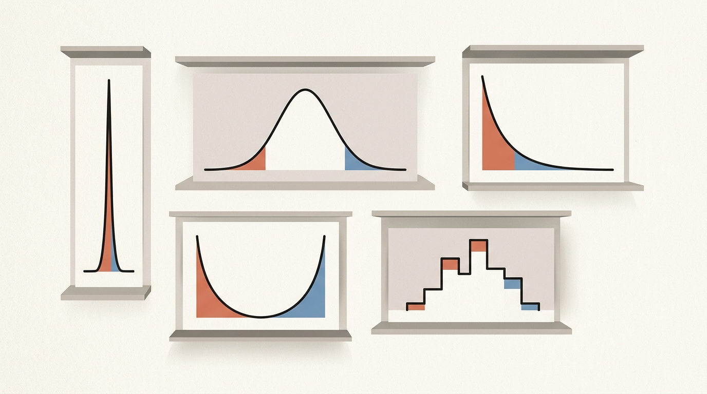
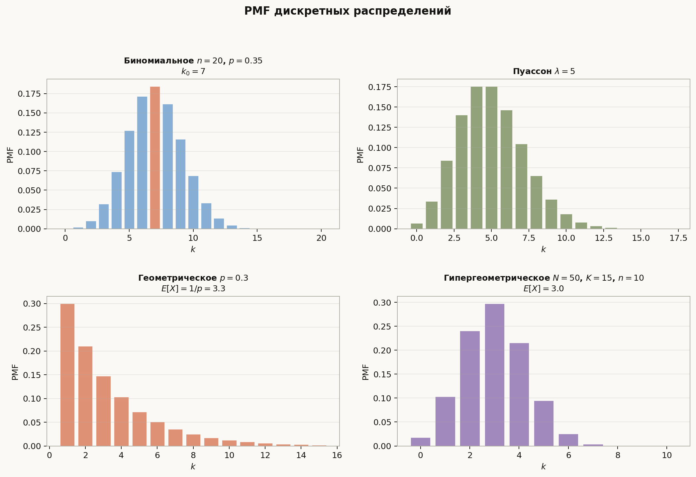
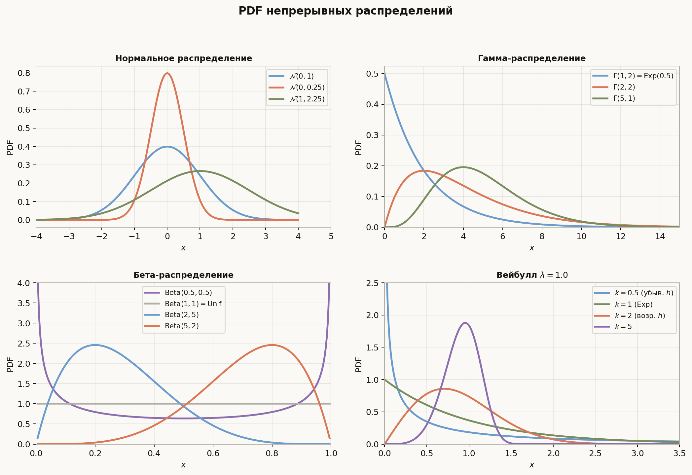
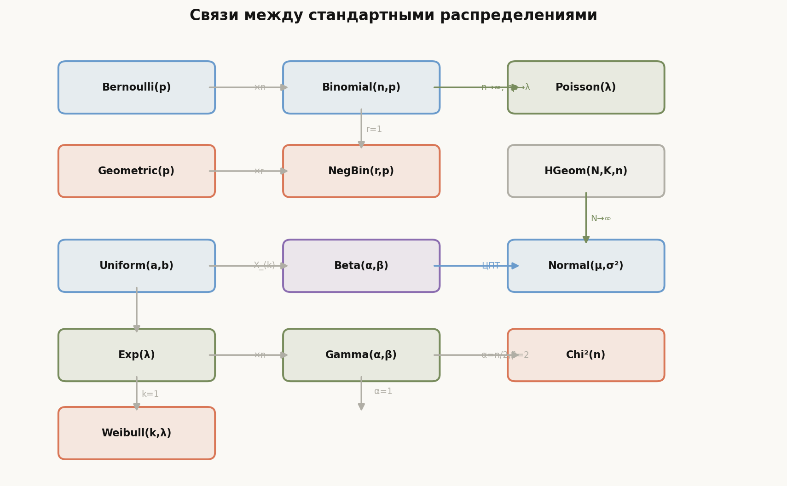

# Лекция: стандартные распределения



Предыдущие лекции строили общую теорию. Теперь — конкретный «зоопарк» распределений, которые встречаются в задачах ШАД и в реальных данных. Каждое распределение — это модель конкретной случайной природы: число успехов в независимых испытаниях, время до первого события, предельные значения. Знание их свойств позволяет быстро распознать нужную модель, вычислить нужные величины и правильно применить предельные теоремы.

Главная линия лекции:
$$
\text{дискретные (счётные исходы)} \;\to\; \text{непрерывные (плотности)} \;\to\; \text{семейства и связи}.
$$

Как читать эту лекцию:

- разделы 1–6 — дискретные распределения, каждое с PMF, МО, дисперсией, свойствами;
- разделы 7–13 — непрерывные, включая гамма/бета-семейство и Вейбулла;
- раздел 14 — связи между распределениями;
- разделы 15–18 — ошибки, ориентир ШАД, итог, самопроверка.

---

## План

1. Бернулли
2. Биномиальное
3. Геометрическое
4. Отрицательно-биномиальное (Паскаля)
5. Пуассон
6. Гипергеометрическое
7. Равномерное
8. Нормальное
9. Многомерное нормальное
10. Показательное
11. Гамма-распределение
12. Бета-распределение
13. Распределение Вейбулла (Гнеденко–Вейбулл)
14. Связи между распределениями
15. Типичные ошибки
16. Что важно для поступления в ШАД
17. Итог
18. Вопросы для самопроверки

---

## Дискретные распределения



---

## 1. Бернулли

**Модель:** один эксперимент с двумя исходами — «успех» (вер. $p$) и «неудача» (вер. $1-p$).

$$
\mathbb{P}(X = 1) = p, \quad \mathbb{P}(X = 0) = 1-p.
$$

| | |
|---|---|
| Параметр | $p \in [0,1]$ |
| $\mathbb{E}[X]$ | $p$ |
| $\mathrm{Var}(X)$ | $p(1-p)$ |
| Х.ф. | $(1-p) + pe^{it}$ |

**Связь:** $\mathrm{Bin}(1, p) = \mathrm{Ber}(p)$.

### Пример

Монета нечестная: $p=0.7$. $X \sim \mathrm{Ber}(0.7)$.  
$\mathbb{P}(X=1)=0.7$; $\mathbb{E}[X]=0.7$; $\mathrm{Var}(X)=0.7\cdot0.3=0.21$.

---

## 2. Биномиальное

**Модель:** число успехов в $n$ независимых испытаниях Бернулли с вероятностью успеха $p$.

$$
\mathbb{P}(X = k) = \binom{n}{k} p^k (1-p)^{n-k}, \quad k = 0, 1, \ldots, n.
$$

| | |
|---|---|
| Параметры | $n \in \mathbb{N}$, $p \in [0,1]$ |
| $\mathbb{E}[X]$ | $np$ |
| $\mathrm{Var}(X)$ | $np(1-p)$ |
| Х.ф. | $[(1-p)+pe^{it}]^n$ |

### Пример

$X \sim \mathrm{Bin}(5, 0.4)$. Вероятность ровно 2 успехов из 5:
$$\mathbb{P}(X=2) = \binom{5}{2}(0.4)^2(0.6)^3 = 10\cdot0.16\cdot0.216 = 0.346.$$
$\mathbb{E}[X]=2$; $\mathrm{Var}(X)=1.2$.

**Свойства:**
- $X \sim \mathrm{Bin}(n,p)$ и $Y \sim \mathrm{Bin}(m,p)$ независимы $\Rightarrow$ $X+Y \sim \mathrm{Bin}(n+m, p)$.
- При $n \to \infty$, $np \to \lambda$: $\mathrm{Bin}(n,p) \xrightarrow{d} \mathrm{Poisson}(\lambda)$.
- При $n \to \infty$: ЦПТ даёт $(\mathrm{Bin}(n,p) - np) / \sqrt{np(1-p)} \xrightarrow{d} \mathcal{N}(0,1)$.

**Наивероятнейшее $k_0$:** $(n+1)p - 1 \le k_0 \le (n+1)p$ (двойной максимум, если $(n+1)p \in \mathbb{Z}$).

---

## 3. Геометрическое

**Модель:** число испытаний до первого успеха включительно.

$$
\mathbb{P}(X = k) = (1-p)^{k-1}p, \quad k = 1, 2, 3, \ldots
$$

| | |
|---|---|
| Параметр | $p \in (0,1]$ |
| $\mathbb{E}[X]$ | $1/p$ |
| $\mathrm{Var}(X)$ | $(1-p)/p^2$ |
| Х.ф. | $pe^{it}/(1-(1-p)e^{it})$ |

### Пример

Вероятность успеха $p=0.25$. Среднее число попыток до первого успеха: $\mathbb{E}[X]=4$.  
$\mathbb{P}(X=1)=0.25$; $\mathbb{P}(X=3)=(0.75)^2\cdot0.25=0.141$.

**Свойство без памяти:**

$$
\mathbb{P}(X > m + k \mid X > m) = \mathbb{P}(X > k).
$$

Геометрическое распределение — единственное дискретное распределение без памяти.

**Альтернативное определение:** число **неудач** до первого успеха ($k = 0, 1, 2, \ldots$) — $\mathbb{P}(Y = k) = (1-p)^k p$; тогда $\mathbb{E}[Y] = (1-p)/p$.

---

## 4. Отрицательно-биномиальное (Паскаля)

**Модель:** число испытаний до $r$-го успеха включительно.

$$
\mathbb{P}(X = k) = \binom{k-1}{r-1} p^r (1-p)^{k-r}, \quad k = r, r+1, r+2, \ldots
$$

| | |
|---|---|
| Параметры | $r \in \mathbb{N}$, $p \in (0,1]$ |
| $\mathbb{E}[X]$ | $r/p$ |
| $\mathrm{Var}(X)$ | $r(1-p)/p^2$ |
| Х.ф. | $[pe^{it}/(1-(1-p)e^{it})]^r$ |

### Пример

Ждём 3-го успеха ($r=3$, $p=0.5$). $\mathbb{E}[X]=6$; $\mathrm{Var}(X)=6$.  
Вероятность, что 3-й успех наступит на 5-м испытании ($k=5$):
$$\mathbb{P}(X=5)=\binom{4}{2}(0.5)^3(0.5)^2=6\cdot\frac{1}{32}=0.1875.$$

**Связь:** $\mathrm{NegBin}(r, p) = $ сумма $r$ независимых $\mathrm{Geom}(p)$.

**Альтернативная параметризация (число неудач до $r$-го успеха):**
$$
\mathbb{P}(Y = k) = \binom{r+k-1}{k}p^r(1-p)^k, \quad k = 0, 1, 2, \ldots
$$
В таком виде распределение называют **распределением Паскаля**. $\mathbb{E}[Y] = r(1-p)/p$.

---

## 5. Пуассон

**Модель:** число редких событий за единицу времени/площади при постоянной интенсивности.

$$
\mathbb{P}(X = k) = \frac{\lambda^k e^{-\lambda}}{k!}, \quad k = 0, 1, 2, \ldots
$$

| | |
|---|---|
| Параметр | $\lambda > 0$ |
| $\mathbb{E}[X]$ | $\lambda$ |
| $\mathrm{Var}(X)$ | $\lambda$ |
| Х.ф. | $\exp(\lambda(e^{it}-1))$ |

### Пример

В колл-центр поступает в среднем $\lambda=3$ звонка в минуту. Вероятность нуля звонков:
$$\mathbb{P}(X=0)=e^{-3}\approx0.050; \quad \mathbb{P}(X\ge1)=1-e^{-3}\approx0.950.$$

**Свойства:**
- $X \sim \mathrm{Poisson}(\lambda_1)$ и $Y \sim \mathrm{Poisson}(\lambda_2)$ независимы $\Rightarrow$ $X+Y \sim \mathrm{Poisson}(\lambda_1+\lambda_2)$.
- Единственное распределение, у которого $\mathbb{E}[X] = \mathrm{Var}(X)$ (на практике используют для проверки).
- **Пуассоновский процесс:** времена между событиями — н.о.р. $\mathrm{Exp}(\lambda)$.

---

## 6. Гипергеометрическое

**Модель:** выборка без возврата из конечной генеральной совокупности.

В урне $N$ шаров, $K$ из них «помечены». Из $n$ случайно выбранных шаров $X$ — число помеченных.

$$
\mathbb{P}(X = k) = \frac{\binom{K}{k}\binom{N-K}{n-k}}{\binom{N}{n}}, \quad \max(0, n+K-N) \le k \le \min(n, K).
$$

| | |
|---|---|
| Параметры | $N, K, n \in \mathbb{N}$, $K \le N$, $n \le N$ |
| $\mathbb{E}[X]$ | $nK/N$ |
| $\mathrm{Var}(X)$ | $n\,\frac{K}{N}\,\frac{N-K}{N}\,\frac{N-n}{N-1}$ |

Множитель $\frac{N-n}{N-1}$ — **поправка на конечность** генеральной совокупности (отсутствует в биномиальном).

### Пример

Урна: $N=10$ шаров, $K=4$ красных. Берём $n=3$ без возврата.  
$\mathbb{E}[X]=3\cdot4/10=1.2$. Вероятность ровно 2 красных:
$$\mathbb{P}(X=2)=\frac{\binom{4}{2}\binom{6}{1}}{\binom{10}{3}}=\frac{6\cdot6}{120}=\frac{36}{120}=0.3.$$

**Предельный переход:** при $N \to \infty$, $K/N \to p$, $\mathrm{HGeom}(N,K,n) \to \mathrm{Bin}(n,p)$.

---

## Непрерывные распределения



---

## 7. Равномерное

**Модель:** «ничего не знаем» на отрезке — принцип максимума энтропии при известном носителе.

$$
f(x) = \frac{1}{b-a}\,\mathbf{1}_{[a,b]}(x), \qquad F(x) = \frac{x-a}{b-a}.
$$

| | |
|---|---|
| Параметры | $a < b$ |
| $\mathbb{E}[X]$ | $(a+b)/2$ |
| $\mathrm{Var}(X)$ | $(b-a)^2/12$ |
| Х.ф. | $(e^{ibt}-e^{iat})/(it(b-a))$ |

### Пример

$X \sim \mathrm{Uniform}(2,8)$. $\mathbb{E}[X]=5$; $\mathrm{Var}(X)=36/12=3$.  
$\mathbb{P}(3 \le X \le 6) = (6-3)/(8-2) = 0.5$.

**Свойство:** если $U \sim \mathrm{Uniform}(0,1)$, то $F^{-1}(U) \sim F$ для любой CDF $F$ — **метод обратной функции** (inversion sampling).

---

## 8. Нормальное

**Модель:** сумма многих малых независимых вкладов (ЦПТ). Имеет максимальную энтропию при фиксированных МО и дисперсии.

$$
f(x) = \frac{1}{\sigma\sqrt{2\pi}}\exp\!\left(-\frac{(x-\mu)^2}{2\sigma^2}\right).
$$

| | |
|---|---|
| Параметры | $\mu \in \mathbb{R}$, $\sigma^2 > 0$ |
| $\mathbb{E}[X]$ | $\mu$ |
| $\mathrm{Var}(X)$ | $\sigma^2$ |
| Х.ф. | $\exp(i\mu t - \sigma^2 t^2/2)$ |
| Мода | $\mu$ |
| Медиана | $\mu$ |

**CDF:** $F(x) = \Phi\!\left(\dfrac{x-\mu}{\sigma}\right)$, где $\Phi(z) = \frac{1}{2}(1 + \mathrm{erf}(z/\sqrt{2}))$.

**Правило трёх сигм:**

| Интервал | Вероятность |
|---|---|
| $(\mu - \sigma, \mu + \sigma)$ | $\approx 0.683$ |
| $(\mu - 2\sigma, \mu + 2\sigma)$ | $\approx 0.954$ |
| $(\mu - 3\sigma, \mu + 3\sigma)$ | $\approx 0.997$ |

### Пример

$X \sim \mathcal{N}(100, 225)$ (рост в см, $\sigma=15$). Вероятность роста от 85 до 115 см:
$$\mathbb{P}(85\le X\le115) = \mathbb{P}\!\left(\frac{85-100}{15}\le Z\le\frac{115-100}{15}\right) = \Phi(1)-\Phi(-1) \approx 0.683.$$

**Устойчивость:** $X \sim \mathcal{N}(\mu_1, \sigma_1^2)$, $Y \sim \mathcal{N}(\mu_2, \sigma_2^2)$ независимы $\Rightarrow$ $aX+bY \sim \mathcal{N}(a\mu_1+b\mu_2, a^2\sigma_1^2+b^2\sigma_2^2)$.

---

## 9. Многомерное нормальное

$$
f(\mathbf{x}) = \frac{1}{(2\pi)^{d/2}|\Sigma|^{1/2}}\exp\!\left(-\frac{1}{2}(\mathbf{x}-\boldsymbol{\mu})^T\Sigma^{-1}(\mathbf{x}-\boldsymbol{\mu})\right).
$$

| | |
|---|---|
| Параметры | $\boldsymbol{\mu} \in \mathbb{R}^d$, $\Sigma$ — симм. положит. определённая матрица |
| $\mathbb{E}[\mathbf{X}]$ | $\boldsymbol{\mu}$ |
| $\mathrm{Cov}(\mathbf{X})$ | $\Sigma$ |
| Х.ф. | $\exp(i\boldsymbol{\mu}^T\mathbf{t} - \frac{1}{2}\mathbf{t}^T\Sigma\mathbf{t})$ |

### Пример

$(X_1,X_2)^T\sim\mathcal{N}_2\!\left(\begin{pmatrix}0\\0\end{pmatrix},\begin{pmatrix}1&0.8\\0.8&1\end{pmatrix}\right)$.  
$\rho=0.8$; $\mathrm{Var}(X_1)=\mathrm{Var}(X_2)=1$. Компоненты некоррелированы $\iff$ независимы.  
Условное: $X_2\mid X_1=x\sim\mathcal{N}(0.8x,\,1-0.64)=\mathcal{N}(0.8x,\,0.36)$.

**Ключевые свойства:**
- Линейное преобразование: $A\mathbf{X} + \mathbf{b} \sim \mathcal{N}_k(A\boldsymbol{\mu}+\mathbf{b},\, A\Sigma A^T)$.
- Маргинальные и условные распределения — снова нормальные.
- Компоненты **некоррелированы** $\iff$ **независимы** (единственный случай среди непрерывных).

**Вырожденное нормальное:** если $\Sigma$ вырожденная, распределение сосредоточено на аффинном подпространстве размерности $\mathrm{rank}(\Sigma)$.

---

## 10. Показательное

**Модель:** время до первого события в пуассоновском процессе с интенсивностью $\lambda$.

$$
f(x) = \lambda e^{-\lambda x}, \quad x \ge 0; \qquad F(x) = 1 - e^{-\lambda x}.
$$

| | |
|---|---|
| Параметр | $\lambda > 0$ |
| $\mathbb{E}[X]$ | $1/\lambda$ |
| $\mathrm{Var}(X)$ | $1/\lambda^2$ |
| Медиана | $\ln 2/\lambda$ |
| Х.ф. | $\lambda/(\lambda-it)$ |

### Пример

Время жизни лампочки $T\sim\mathrm{Exp}(1/1000)$ (в часах, $\mathbb{E}[T]=1000$).  
Вероятность проработать более 500 часов: $\mathbb{P}(T>500)=e^{-500/1000}=e^{-0.5}\approx0.607$.

**Свойство без памяти:**

$$
\mathbb{P}(X > s+t \mid X > s) = \mathbb{P}(X > t) = e^{-\lambda t}.
$$

Показательное — единственное непрерывное распределение без памяти.

**Связь:** $X \sim \mathrm{Exp}(\lambda) \iff X \sim \Gamma(1, 1/\lambda)$.

---

## 11. Гамма-распределение

**Модель:** время ожидания $\alpha$-го события в пуассоновском процессе; обобщение показательного.

$$
f(x) = \frac{1}{\Gamma(\alpha)\beta^\alpha}\,x^{\alpha-1}e^{-x/\beta}, \quad x > 0.
$$

Параметризация через **скорость** $\lambda = 1/\beta$: $f(x) = \frac{\lambda^\alpha}{\Gamma(\alpha)} x^{\alpha-1}e^{-\lambda x}$.

| | |
|---|---|
| Параметры | $\alpha > 0$ (форма), $\beta > 0$ (масштаб) |
| $\mathbb{E}[X]$ | $\alpha\beta$ |
| $\mathrm{Var}(X)$ | $\alpha\beta^2$ |
| Мода | $(\alpha-1)\beta$ при $\alpha \ge 1$ |
| Х.ф. | $(1-i\beta t)^{-\alpha}$ |

**Функция Гаммы:** $\Gamma(\alpha) = \int_0^\infty x^{\alpha-1}e^{-x}\,dx$; $\Gamma(n) = (n-1)!$ для $n \in \mathbb{N}$; $\Gamma(1/2) = \sqrt{\pi}$.

**Аддитивность:** $X \sim \Gamma(\alpha_1, \beta)$, $Y \sim \Gamma(\alpha_2, \beta)$ независимы $\Rightarrow$ $X+Y \sim \Gamma(\alpha_1+\alpha_2, \beta)$.

**Частные случаи:**

| $\alpha$ | Распределение |
|---|---|
| $1$ | $\mathrm{Exp}(\lambda)$ |
| $n/2$, $\beta=2$ | $\chi^2(n)$ (хи-квадрат) |
| $n \in \mathbb{N}$ | сумма $n$ н.о.р. $\mathrm{Exp}(\lambda)$ |

### Пример

Пуассоновский процесс с $\lambda=2$ событиями/час. Время до 5-го события: $T\sim\Gamma(5,1/2)$.  
$\mathbb{E}[T]=5\cdot0.5=2.5$ ч; $\mathrm{Var}(T)=5\cdot0.25=1.25$ ч².

---

## 12. Бета-распределение

**Модель:** апостериорное распределение вероятности успеха в байесовском выводе; порядковые статистики равномерного.

$$
f(x) = \frac{x^{\alpha-1}(1-x)^{\beta-1}}{B(\alpha,\beta)}, \quad x \in (0,1),
$$

где $B(\alpha,\beta) = \Gamma(\alpha)\Gamma(\beta)/\Gamma(\alpha+\beta)$.

| | |
|---|---|
| Параметры | $\alpha, \beta > 0$ |
| $\mathbb{E}[X]$ | $\alpha/(\alpha+\beta)$ |
| $\mathrm{Var}(X)$ | $\alpha\beta / [(\alpha+\beta)^2(\alpha+\beta+1)]$ |
| Мода | $(\alpha-1)/(\alpha+\beta-2)$ при $\alpha, \beta > 1$ |

**Частные случаи:**

| $\alpha$, $\beta$ | Распределение |
|---|---|
| $1$, $1$ | $\mathrm{Uniform}(0,1)$ |
| $1/2$, $1/2$ | Арксинусное |
| $\alpha = \beta$ | Симметричное, мода $= 1/2$ |

### Пример

$\theta\sim\mathrm{Beta}(2,5)$: $\mathbb{E}[\theta]=2/7\approx0.286$; мода $=(2-1)/(2+5-2)=0.2$.  
Интерпретация: у монеты с неизвестным $p$ этот приор задаёт склонность к «неудаче».

**Байесовский вывод:** если $\theta \sim \mathrm{Beta}(\alpha, \beta)$ (априор) и $X \mid \theta \sim \mathrm{Bin}(n, \theta)$, то $\theta \mid X = k \sim \mathrm{Beta}(\alpha+k, \beta+n-k)$ (сопряжённый априор).

**Связь с порядковыми статистиками:** $X_{(k)} \sim \mathrm{Beta}(k, n-k+1)$ при $X_i \sim \mathrm{Uniform}(0,1)$.

---

## 13. Распределение Вейбулла (Гнеденко–Вейбулл)

**Модель:** время до отказа в теории надёжности; обобщение показательного с переменной интенсивностью отказов.

$$
f(x) = \frac{k}{\lambda}\left(\frac{x}{\lambda}\right)^{k-1}\exp\!\left(-\left(\frac{x}{\lambda}\right)^k\right), \quad x \ge 0.
$$

| | |
|---|---|
| Параметры | $k > 0$ (форма), $\lambda > 0$ (масштаб) |
| $\mathbb{E}[X]$ | $\lambda\,\Gamma(1 + 1/k)$ |
| $\mathrm{Var}(X)$ | $\lambda^2[\Gamma(1+2/k) - \Gamma(1+1/k)^2]$ |
| Медиана | $\lambda(\ln 2)^{1/k}$ |

### Пример

Подшипник: $T\sim\mathrm{Weibull}(k=3,\lambda=1000)$ часов.  
$\mathbb{E}[T]=1000\,\Gamma(4/3)\approx 1000\cdot0.893=893$ ч.  
$k=3>1$ — интенсивность отказов растёт: чем дольше работает, тем вероятнее отказ.

**Функция надёжности и интенсивность отказов:**

$$
R(x) = e^{-(x/\lambda)^k}, \qquad h(x) = \frac{f(x)}{R(x)} = \frac{k}{\lambda}\left(\frac{x}{\lambda}\right)^{k-1}.
$$

- $k < 1$: $h(x)$ убывает (начальные отказы, «младенческая смертность»).
- $k = 1$: $h(x) = \mathrm{const}$ — это $\mathrm{Exp}(1/\lambda)$.
- $k > 1$: $h(x)$ возрастает (износ).

**Связь:** $X \sim \mathrm{Weibull}(k, \lambda) \iff X^k \sim \mathrm{Exp}(1/\lambda^k)$.

---

## 14. Связи между распределениями



**Иерархия семейств:**

```
Bernoulli(p)  ──×n──>  Binomial(n,p)
                              │ n→∞, np→λ
                              ▼
Geometric(p) ──×r──>  NegBin(r,p) = Pascal(r,p)
                          Poisson(λ)

Uniform(0,1) ──порядк.──> Beta(k, n-k+1)

Exp(λ) ──×n──> Gamma(n, 1/λ) ──n/2,β=2──> Chi²(n)

Weibull(1,λ) = Exp(1/λ)

Normal(0,1)² ──> Chi²(1) ──(n штук)──> Chi²(n) = Gamma(n/2, 2)
```

**Ключевые предельные переходы:**

| Из | В | Условие |
|---|---|---|
| $\mathrm{Bin}(n,p)$ | $\mathrm{Poisson}(\lambda)$ | $n\to\infty$, $np\to\lambda$ |
| $\mathrm{Bin}(n,p)$ | $\mathcal{N}(np, np(1-p))$ | $n\to\infty$, ЦПТ |
| $\mathrm{HGeom}(N,K,n)$ | $\mathrm{Bin}(n, K/N)$ | $N\to\infty$, $K/N\to p$ |
| $\mathrm{Gamma}(\alpha,\beta)$ | $\mathcal{N}(\alpha\beta, \alpha\beta^2)$ | $\alpha\to\infty$, ЦПТ |

---

## 15. Типичные ошибки

**1. Путаница параметризации геометрического.**  
«Число испытаний до успеха» $\Rightarrow$ $\mathbb{E}[X] = 1/p$. «Число неудач до успеха» $\Rightarrow$ $\mathbb{E}[Y] = (1-p)/p$. Уточняйте определение.

**2. Отрицательно-биномиальное = Паскаля?**  
Паскаля — частный случай NegBin в параметризации «число неудач до $r$-го успеха». Часть источников использует «число испытаний до $r$-го успеха». Всегда проверяйте носитель.

**3. Применение Пуассона без проверки условий.**  
Пуассон применим при $n$ большом, $p$ малом, независимости и однородности испытаний. При $p > 0.1$ лучше $\mathrm{Bin}(n,p)$.

**4. «Нормальное симметрично $\Rightarrow$ все симметричные — нормальные».**  
Равномерное тоже симметрично и имеет компактный носитель. Проверяйте хвосты.

**5. Путаница $\alpha$ и $\beta$ в гамма-распределении.**  
Параметризации «форма-масштаб» $(\alpha, \beta)$ и «форма-скорость» $(\alpha, \lambda = 1/\beta)$ — разные. $\mathbb{E}[X] = \alpha\beta$ (масштаб) или $\alpha/\lambda$ (скорость).

**6. Вейбулл при $k=1$ — показательное, но с каким параметром?**  
$\mathrm{Weibull}(1, \lambda) = \mathrm{Exp}(1/\lambda)$: масштаб Вейбулла — обратен скорости Exp. Проверяйте $\mathbb{E}[X] = \lambda\,\Gamma(2) = \lambda$ vs $\mathbb{E}[\mathrm{Exp}(\mu)] = 1/\mu$.

**7. «Некоррелированные компоненты многомерного нормального независимы» — не всегда.**  
Это верно для **совместно нормального** вектора, но не для произвольного вектора с нормальными маргиналями.

---

## 16. Что важно для поступления в ШАД

- Знать PMF/PDF, МО и дисперсию **всех** перечисленных распределений наизусть.
- Уметь **выводить** МО и дисперсию через х.ф. (производные в нуле).
- Знать **связи**: Bin → Poisson, Bin → Normal (ЦПТ), Gamma → Chi².
- Применять **свойство без памяти** Exp и Geom в задачах.
- Знать **устойчивость** нормального и пуассоновского законов при сложении.
- Знать **функцию надёжности** $h(x)$ для Вейбулла и интерпретацию параметра $k$.
- Уметь определять распределение **порядковой статистики** $X_{(k)}$ через Beta.
- Понимать **сопряжённость** Beta–Binomial в байесовском выводе.
- Знать $\Gamma(n) = (n-1)!$ и $\Gamma(1/2) = \sqrt{\pi}$ для вычисления моментов.
- Уметь **применять метод инверсии** для генерации из Exp, Uniform.

---

## 17. Итог

Дискретные распределения образуют «лесенку»: Бернулли → Биномиальное (сумма $n$ Бернулли), Геометрическое → Отрицательно-биномиальное (сумма $r$ геометрических), Биномиальное при редких событиях → Пуассон, Гипергеометрическое при $N \to \infty$ → Биномиальное. Непрерывные: Равномерное — базовое, из него порядковые статистики имеют Бета-распределение; Нормальное — предел по ЦПТ; Показательное — без памяти, время между событиями Пуассона; Гамма — сумма Exp, семейство содержит $\chi^2$; Бета — на $(0,1)$, сопряжённое для биномиальной правдоподобности; Вейбулл — гибкое время до отказа, при $k=1$ совпадает с Exp. Нормальный вектор характеризуется тем, что некоррелированность и независимость компонент равносильны. Знание этих распределений и их связей — необходимая база для байесовского вывода, статистики и машинного обучения.

---

## 18. Вопросы для самопроверки

1. Запишите PMF биномиального. Выведите $\mathbb{E}[X]$ и $\mathrm{Var}(X)$ через х.ф.
2. Докажите свойство без памяти показательного распределения.
3. Чем отличается гипергеометрическое от биномиального? Когда их можно приближать друг другом?
4. Запишите PDF гамма-распределения. Какой частный случай при $\alpha = 1$?
5. Что такое функция Гаммы? Вычислите $\Gamma(5)$ и $\Gamma(3/2)$.
6. Запишите PDF бета-распределения. Какой частный случай при $\alpha = \beta = 1$?
7. Как связаны порядковые статистики $X_{(k)}$ из $\mathrm{Uniform}(0,1)$ с Бета-распределением?
8. Запишите функцию интенсивности отказов $h(x)$ для Вейбулла. Что означает $k < 1$?
9. Докажите устойчивость нормального закона при сложении через х.ф.
10. В чём состоит сопряжённость Beta–Binomial? Запишите апостериорное распределение.
11. Каков предел $\mathrm{Bin}(n,p)$ при $n\to\infty$, $np\to\lambda$? Докажите через х.ф.
12. Чем отличается вырожденное многомерное нормальное от невырожденного?
