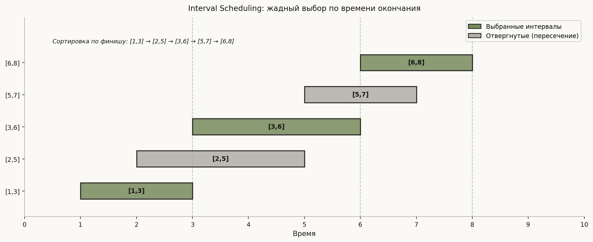
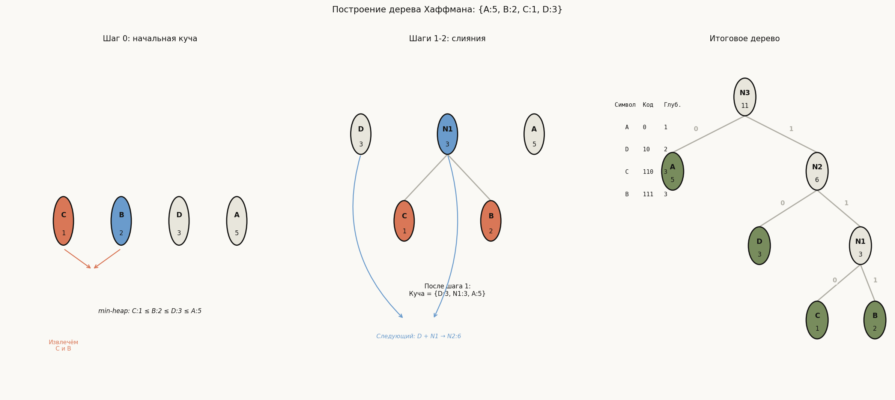
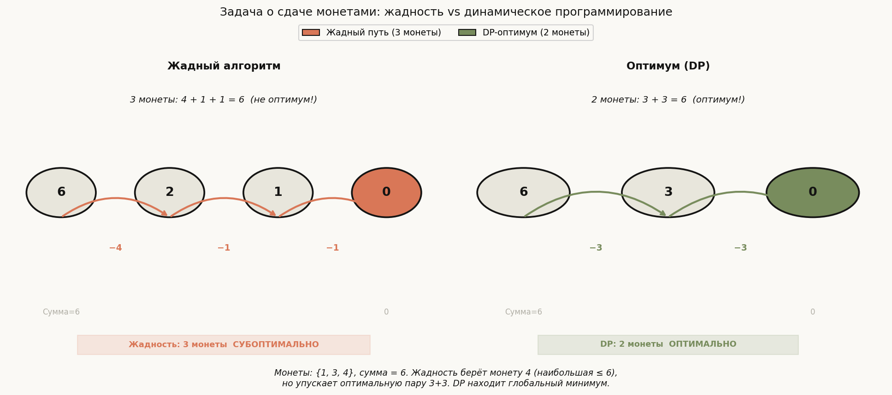

# Лекция 10: Жадные алгоритмы


Жадные алгоритмы — один из фундаментальных парадигматических подходов в алгоритмике, который строит решение шаг за шагом, на каждом шаге выбирая локально оптимальное действие и никогда не возвращаясь назад. Эта лекция опирается на знание базовых структур данных (приоритетных очередей, сортировки) и готовит к пониманию динамического программирования: именно сравнение «когда жадность работает, а когда нет» — ключевой навык для вступительных задач ШАД. Умение доказать корректность жадного алгоритма методом обмена отличает уверенного кандидата от того, кто применяет подходы наугад.

Главная линия лекции:

$$
\text{Локальный выбор} \to \text{Доказательство методом обмена} \to \text{Классические задачи} \to \text{Граница применимости}
$$

**Как читать эту лекцию:**
- Раздел 1 — понять идею и два необходимых свойства
- Раздел 2 — освоить метод обмена как единственный стандартный способ доказательства
- Разделы 3–5 — три образцовые задачи; для каждой разобрать трассировку вручную
- Раздел 6 — контрпример к задаче о монетах: запомнить как «дорожный знак» для DP
- Раздел 7 — граница применимости, матроиды как формальный критерий

---

## План

1. Идея жадных алгоритмов
2. Доказательство корректности: метод обмена
3. Задача о выборе задач (Interval Scheduling Maximization)
4. Задача о покрытии точек отрезками (Minimum Interval Cover)
5. Алгоритм Хаффмана (Huffman Coding)
6. Задача о сдаче монетами (Coin Change): когда жадность не работает
7. Контрпримеры и критерии применимости
8. Типичные ошибки
9. Что важно для поступления в ШАД
10. Итог
11. Вопросы для самопроверки

---

## 1. Идея жадных алгоритмов

**Определение.** Алгоритм называется *жадным*, если на каждом шаге он принимает решение, оптимальное в текущий момент, не пересматривая уже сделанных выборов.

**Интуиция.** Представьте, что вы едете по незнакомому городу без навигатора и на каждом перекрёстке поворачиваете в сторону, которая кажется наиболее прямой к цели. Иногда такой подход приводит в тупик — нужна карта. Жадный алгоритм хорош ровно тогда, когда «карта» (структура задачи) гарантирует, что локальные повороты складываются в глобально оптимальный маршрут.

**Два необходимых свойства:**

1. **Greedy choice property (свойство жадного выбора):** существует оптимальное решение, согласующееся с жадным выбором на первом шаге. Формально: если GREEDY выбирает элемент $e$ на первом шаге, то среди всех оптимальных решений найдётся хотя бы одно, содержащее $e$.

2. **Optimal substructure (оптимальная подструктура):** после фиксации жадного выбора оставшаяся подзадача снова имеет оптимальную подструктуру. Иными словами, оптимальное решение исходной задачи строится из оптимального решения подзадачи.

**Важно:** наличие оптимальной подструктуры само по себе не достаточно — её имеет и задача о рюкзаке 0/1, для которой жадность не работает. Ключевое — свойство жадного выбора.

**Пример (интуитивный).** Сортировка выбором не является оптимальной жадной стратегией в общем смысле, но выбор минимума на каждом шаге — это именно жадный шаг. Алгоритм Дейкстры (поиск кратчайшего пути) тоже жадный: на каждом шаге выбирается вершина с минимальным расстоянием из ещё не обработанных.

---

## 2. Доказательство корректности: метод обмена

Метод обмена (exchange argument) — стандартный способ доказательства корректности жадных алгоритмов. Структура доказательства:

**Шаг 1.** Обозначим жадное решение $G = (g_1, g_2, \ldots, g_k)$ и предположим, что существует оптимальное решение $OPT = (o_1, o_2, \ldots, o_m)$, которое от $G$ отличается.

**Шаг 2.** Найдём первую позицию $i$, в которой $G$ и $OPT$ расходятся: $g_i \neq o_i$.

**Шаг 3.** Покажем, что $o_i$ в решении $OPT$ можно заменить на $g_i$ (возможно, переставив другие элементы) так, что качество решения не ухудшится. Получим решение $OPT'$, которое совпадает с $G$ в первых $i$ позициях и не хуже $OPT$.

**Шаг 4.** По индукции применяем тот же аргумент к оставшимся позициям. В итоге $OPT$ трансформируется в $G$ без потери качества, значит $G$ оптимально.

**Схема на псевдокоде:**
```
Доказательство методом обмена:
  Предположим: OPT ≠ GREEDY
  Найти первую позицию i где они расходятся
  Swap(OPT[i], GREEDY[i]) → OPT'
  Показать: стоимость(OPT') >= стоимость(OPT)
  По индукции: OPT преобразуется в GREEDY, не теряя качества
  Следовательно: GREEDY оптимально
```

Этот метод используется во всех трёх классических задачах ниже.

---

## 3. Задача о выборе задач (Interval Scheduling Maximization)

**Условие.** Дано $n$ задач, каждая задаётся интервалом $[s_i, f_i]$ (время начала и конца). Выбрать максимальное подмножество задач, которые не пересекаются (конец одной $\leq$ начало следующей).

**Жадный алгоритм:**
1. Отсортировать задачи по времени **окончания** $f_i$.
2. Инициализировать $\text{last\_end} = -\infty$.
3. Для каждой задачи в порядке возрастания $f_i$: если $s_i \geq \text{last\_end}$ — выбрать задачу, обновить $\text{last\_end} = f_i$.

**Почему сортировка по финишу, а не по старту?** Сортировка по старту даёт неоптимальный результат: задача $[0, 10]$ стартует первой, но занимает весь слот. Сортировка по финишу минимизирует «занятость» временной оси, оставляя максимум места для будущих задач.

**Трассировка.** Интервалы: $\{[1,3],[2,5],[3,6],[5,7],[6,8]\}$.

После сортировки по финишу: $[1,3], [2,5], [3,6], [5,7], [6,8]$.

| Шаг | Задача | $s_i \geq \text{last\_end}$? | Действие | last\_end |
|-----|--------|------------------------------|----------|-----------|
| 1 | $[1,3]$ | $1 \geq -\infty$ ✓ | выбрать | 3 |
| 2 | $[2,5]$ | $2 \geq 3$? Нет | пропустить | 3 |
| 3 | $[3,6]$ | $3 \geq 3$ ✓ | выбрать | 6 |
| 4 | $[5,7]$ | $5 \geq 6$? Нет | пропустить | 6 |
| 5 | $[6,8]$ | $6 \geq 6$ ✓ | выбрать | 8 |

Результат: $\{[1,3], [3,6], [6,8]\}$ — 3 задачи. Это оптимум.



**Доказательство методом обмена.** Пусть $OPT$ выбрал первую задачу $o_1 \neq g_1$ (жадный выбор). Т.к. задачи отсортированы по $f$, имеем $f_{g_1} \leq f_{o_1}$. Заменим $o_1$ на $g_1$ в $OPT$: т.к. $f_{g_1} \leq f_{o_1}$, задача $g_1$ не конфликтует ни с одной из оставшихся задач $OPT$ (они все начинаются после $f_{o_1} \geq f_{g_1}$). Размер решения не уменьшился. По индукции — жадный алгоритм оптимален.

**Сложность:** $O(n \log n)$ на сортировку + $O(n)$ на жадный проход.

```cpp
#include <bits/stdc++.h>
using namespace std;

int intervalScheduling(vector<pair<int,int>>& intervals) {
    // Сортируем по времени окончания
    sort(intervals.begin(), intervals.end(),
         [](const pair<int,int>& a, const pair<int,int>& b){
             return a.second < b.second;
         });

    int count = 0;
    int last_end = INT_MIN;

    for (auto& [start, end] : intervals) {
        if (start >= last_end) {
            ++count;
            last_end = end;
        }
    }
    return count;
}

int main() {
    vector<pair<int,int>> intervals = {{1,3},{2,5},{3,6},{5,7},{6,8}};
    cout << intervalScheduling(intervals) << "\n"; // 3
    return 0;
}
```

---

## 4. Задача о покрытии точек отрезками (Minimum Interval Cover)

**Условие.** Дано множество точек $P = \{p_1, \ldots, p_m\}$ и множество отрезков $S = \{[a_i, b_i]\}$. Выбрать минимальное количество отрезков, покрывающих все точки.

**Альтернативная формулировка (покрытие отрезка).** Дан отрезок $[L, R]$ и набор отрезков. Покрыть $[L, R]$ минимальным числом отрезков из набора.

**Жадный алгоритм для покрытия $[L, R]$:**
1. Отсортировать отрезки по левому концу $a_i$.
2. Текущая правая граница покрытия $\text{cur} = L$.
3. Пока $\text{cur} < R$: среди всех отрезков с $a_i \leq \text{cur}$ выбрать тот, что максимально продвигает правую границу (максимальный $b_i$). Установить $\text{cur} = b_i$.
4. Если таких отрезков нет — покрытие невозможно.

**Трассировка.** $[L, R] = [0, 10]$, отрезки: $[0,4], [1,7], [3,9], [6,10], [8,12]$.

| Итерация | cur | Допустимые | Лучший выбор | новый cur |
|----------|-----|------------|--------------|-----------|
| 1 | 0 | $[0,4],[1,7]$ (начало $\leq 0$? нет — $\leq$ cur) | $[1,7]$, т.к. 7>4 | 7 |
| 2 | 7 | $[3,9],[6,10]$ | $[6,10]$, т.к. 10>9 | 10 |

Выбрано 2 отрезка: $[1,7]$ и $[6,10]$.

**Сложность:** $O(n \log n)$.

```cpp
#include <bits/stdc++.h>
using namespace std;

// Вернуть минимальное число отрезков для покрытия [L, R]
// Вернуть -1, если покрытие невозможно
int minIntervalCover(vector<pair<int,int>> segs, int L, int R) {
    sort(segs.begin(), segs.end()); // по левому концу

    int count = 0, cur = L;
    int n = (int)segs.size();
    int i = 0;

    while (cur < R) {
        int best = cur; // лучший правый конец
        while (i < n && segs[i].first <= cur) {
            best = max(best, segs[i].second);
            ++i;
        }
        if (best == cur) return -1; // нет прогресса
        cur = best;
        ++count;
    }
    return count;
}

int main() {
    vector<pair<int,int>> segs = {{0,4},{1,7},{3,9},{6,10},{8,12}};
    cout << minIntervalCover(segs, 0, 10) << "\n"; // 2
    return 0;
}
```

---

## 5. Алгоритм Хаффмана (Huffman Coding)

**Задача.** Дан алфавит из $n$ символов с частотами $f_1, \ldots, f_n$. Построить оптимальный префиксный бинарный код: код без общих префиксов (декодируемый однозначно), минимизирующий суммарную длину закодированного текста.

**Суммарная длина:**

$$
L = \sum_{i=1}^{n} f_i \cdot d_i
$$

где $d_i$ — глубина листа $i$ в дереве кодирования.

**Жадный алгоритм Хаффмана:**
1. Создать листовой узел для каждого символа с весом = частота.
2. Добавить все узлы в минимальную кучу (min-heap) по весу.
3. Пока в куче больше одного элемента:
   - Извлечь два узла с минимальными весами $u$ и $v$.
   - Создать новый узел с весом $w(u) + w(v)$, левый ребёнок — $u$, правый — $v$.
   - Вставить новый узел в кучу.
4. Оставшийся элемент — корень дерева Хаффмана.

**Трассировка.** Частоты: $\{A:5, B:2, C:1, D:3\}$.

Куча: $[C:1, B:2, D:3, A:5]$

**Шаг 1.** Извлечь $C:1$ и $B:2$, создать $N_1:3$ (дети: C, B). Куча: $[D:3, N_1:3, A:5]$.

**Шаг 2.** Извлечь $D:3$ и $N_1:3$, создать $N_2:6$ (дети: D, N_1). Куча: $[A:5, N_2:6]$.

**Шаг 3.** Извлечь $A:5$ и $N_2:6$, создать $N_3:11$ (корень). Куча: $[N_3:11]$.

Дерево и коды:
```
         N3:11
        /      \
      A:5      N2:6
              /    \
            D:3   N1:3
                  /   \
                C:1   B:2
```

| Символ | Код | Длина |
|--------|-----|-------|
| A | 0 | 1 |
| D | 10 | 2 |
| C | 110 | 3 |
| B | 111 | 3 |

Суммарная длина: $5 \cdot 1 + 3 \cdot 2 + 1 \cdot 3 + 2 \cdot 3 = 5 + 6 + 3 + 6 = 20$ бит.



**Пример "ABRACADABRA":** частоты A:5, B:2, R:2, C:1, D:1. Алгоритм строит оптимальное дерево для этих частот.

**Корректность.** Доказывается методом обмена: предположим, что два символа с минимальными частотами $f_u, f_v$ не являются братьями на максимальной глубине в оптимальном дереве. Тогда можно переставить их с самыми глубокими листьями — длина кода не увеличится (т.к. $f_u, f_v$ минимальны, они должны быть на наибольшей глубине). Это противоречие показывает, что жадный выбор на каждом шаге оптимален.

**Сложность:** $O(n \log n)$ — $n-1$ операций над кучей, каждая $O(\log n)$.

```cpp
#include <bits/stdc++.h>
using namespace std;

struct Node {
    int freq;
    char ch;
    Node* left;
    Node* right;
    Node(int f, char c = '\0', Node* l = nullptr, Node* r = nullptr)
        : freq(f), ch(c), left(l), right(r) {}
};

struct Cmp {
    bool operator()(Node* a, Node* b) { return a->freq > b->freq; }
};

void printCodes(Node* root, string code) {
    if (!root) return;
    if (!root->left && !root->right) {
        cout << root->ch << ": " << code << "\n";
        return;
    }
    printCodes(root->left, code + "0");
    printCodes(root->right, code + "1");
}

Node* buildHuffman(vector<pair<char,int>>& freqs) {
    priority_queue<Node*, vector<Node*>, Cmp> pq;
    for (auto& [c, f] : freqs)
        pq.push(new Node(f, c));

    while (pq.size() > 1) {
        Node* u = pq.top(); pq.pop();
        Node* v = pq.top(); pq.pop();
        pq.push(new Node(u->freq + v->freq, '\0', u, v));
    }
    return pq.top();
}

int main() {
    vector<pair<char,int>> freqs = {{'A',5},{'B',2},{'C',1},{'D',3}};
    Node* root = buildHuffman(freqs);
    printCodes(root, "");
    return 0;
}
```

---

## 6. Задача о сдаче монетами (Coin Change): когда жадность не работает

**Условие.** Дан набор номиналов монет $C = \{c_1, c_2, \ldots, c_k\}$ и сумма $S$. Выдать сумму $S$ минимальным количеством монет.

**Жадный алгоритм.** На каждом шаге брать монету максимального номинала, не превышающего оставшуюся сумму.

**Когда работает.** Для «канонических» систем монет (например, $\{1, 5, 10, 25\}$ — американские монеты) жадность даёт оптимальный результат. Доказательство специфично для каждой системы.

**Контрпример.** Монеты $\{1, 3, 4\}$, сумма $S = 6$.

- **Жадность:** $4$ (осталось 2) $\to$ $1$ (осталось 1) $\to$ $1$ (осталось 0). Итого: **3 монеты**.
- **Оптимум (DP):** $3 + 3 = 6$. Итого: **2 монеты**.

Жадность ошиблась, потому что выбор монеты $4$ «перекрыл» возможность использовать две монеты по $3$.



**Правильное решение — динамическое программирование:**

$$
dp[s] = \min_{c \in C,\, c \leq s} \bigl(dp[s - c] + 1\bigr), \quad dp[0] = 0
$$

```cpp
#include <bits/stdc++.h>
using namespace std;

int coinChangeDP(vector<int>& coins, int S) {
    vector<int> dp(S + 1, INT_MAX);
    dp[0] = 0;
    for (int s = 1; s <= S; ++s)
        for (int c : coins)
            if (c <= s && dp[s - c] != INT_MAX)
                dp[s] = min(dp[s], dp[s - c] + 1);
    return dp[S] == INT_MAX ? -1 : dp[S];
}

int main() {
    vector<int> coins = {1, 3, 4};
    cout << coinChangeDP(coins, 6) << "\n"; // 2 (3+3)
    return 0;
}
```

**Вывод.** Задача Coin Change для произвольного набора монет требует DP. Жадность применима только когда доказано свойство жадного выбора для конкретной системы монет.

---

## 7. Контрпримеры и критерии применимости

### Рюкзак 0/1 vs Дробный рюкзак

**Задача о рюкзаке.** Дано $n$ предметов: предмет $i$ имеет вес $w_i$ и стоимость $v_i$. Вместимость рюкзака $W$. Максимизировать суммарную стоимость.

- **0/1 рюкзак** (предмет либо берём, либо нет): жадность **не работает**. Жадность по $v_i/w_i$ может упустить оптимальную комбинацию. Требуется DP за $O(nW)$.
- **Дробный рюкзак** (можно взять долю предмета): жадность **работает** — сортируем по $v_i/w_i$ убыванию и берём жадно. Доказательство методом обмена очевидно.

**Контрпример для 0/1.** $W=10$, предметы: $(w=6,v=12), (w=5,v=9), (w=5,v=9)$.
- Жадность по $v/w$: $(12/6=2) \to$ берём первый предмет (вес 6, стоимость 12). Осталось 4 — ни второй, ни третий не помещаются. Итого: **12**.
- Оптимум: оба предмета с $(5,9)$ — вес $10$, стоимость **18**.

### Матроиды как формальный критерий

Жадный алгоритм гарантированно даёт оптимальный результат на **матроиде** — алгебраической структуре, обобщающей понятие линейной независимости.

**Матроид** $(E, \mathcal{I})$: конечное множество $E$ и семейство независимых подмножеств $\mathcal{I}$, удовлетворяющих:
1. $\emptyset \in \mathcal{I}$
2. Если $A \in \mathcal{I}$ и $B \subseteq A$, то $B \in \mathcal{I}$ (наследственность)
3. Если $A, B \in \mathcal{I}$ и $|A| < |B|$, то $\exists\, e \in B \setminus A$ такой, что $A \cup \{e\} \in \mathcal{I}$ (аугментация)

**Теорема (Радо–Эдмондс).** Задача максимизации взвешенной суммы на матроиде решается жадным алгоритмом (добавлять элементы в порядке убывания весов, пока независимость сохраняется).

**Примеры матроидов:**
- Задача о выборе задач (Interval Scheduling) — графический матроид
- Алгоритм Прима/Крускала для MST — цикловой матроид графа

**Практический критерий.** Если задача не является матроидом, жадность, скорее всего, не даёт оптимума. Тогда рассмотрите DP или другие подходы.

### Когда жадность применима (итоговая шпаргалка)

| Задача | Жадность | Причина |
|--------|----------|---------|
| Interval Scheduling | ✓ | Сортировка по финишу + exchange argument |
| Fractional Knapsack | ✓ | Сортировка по $v/w$ + exchange argument |
| Huffman Coding | ✓ | Min-heap + exchange argument |
| Minimum Spanning Tree | ✓ | Матроид |
| Coin Change (общий) | ✗ | Нет greedy choice property |
| 0/1 Knapsack | ✗ | Нет greedy choice property |
| Shortest Path (отриц. рёбра) | ✗ | Нет greedy choice property |

---

## 8. Типичные ошибки

**Ошибка 1: применение жадности без доказательства.**
Жадный алгоритм кажется «очевидным», но без формального доказательства (метода обмена или сведения к матроиду) он может давать неоптимальный результат. На вступительном экзамене ШАД «жадность, потому что кажется правильным» не засчитывается.

**Ошибка 2: неправильный критерий сортировки в Interval Scheduling.**
Сортировка по **началу** интервала вместо по **финишу** — типичная ловушка. Задача $[0,100]$ стартует первой, но занимает весь горизонт. Всегда сортируйте по финишу.

**Ошибка 3: применение жадности к задаче о монетах с нестандартными номиналами.**
Монеты $\{1, 3, 4\}$, сумма $6$: жадный берёт $4+1+1=3$ монеты, оптимум $3+3=2$ монеты. Без анализа структуры монет жадность ненадёжна.

**Ошибка 4: забыть про O(n log n) сортировку при анализе сложности.**
Студенты считают только жадный проход $O(n)$, забывая, что сортировка доминирует. Итоговая сложность — $O(n \log n)$, а не $O(n)$.

**Ошибка 5: путать 0/1 рюкзак и дробный рюкзак.**
Для дробного жадность оптимальна, для целочисленного — нет. На задачах, где разрешено брать «часть» предмета, жадность по $v/w$ всегда правильна. Для целых предметов — только DP.

**Ошибка 6: некорректная реализация метода обмена в доказательстве.**
Обмен должен показывать, что качество решения **не ухудшается** (а не просто «меняется»). Нужно явно проверить, что после замены $o_i \to g_i$ не возникает конфликтов с остальными элементами решения.

---

## 9. Что важно для поступления в ШАД

- Уметь формулировать жадный алгоритм: явно описать критерий выбора на каждом шаге
- Доказывать корректность методом обмена: предположить отличие от OPT, показать, что замену можно сделать без потерь
- Знать классические задачи наизусть: Interval Scheduling (финиш), Huffman (min-heap), Fractional Knapsack (v/w)
- Объяснять, почему жадность не работает: приводить конкретный контрпример с монетами или 0/1 рюкзаком
- Анализировать сложность: $O(n \log n)$ для всех задач с сортировкой или кучей
- Знать связь с матроидами: понимать, почему MST (Крускал) — жадный алгоритм и почему он оптимален
- Уметь реализовать на C++: priority_queue (min-heap через greater<>), sort с компаратором, рекурсия для обхода дерева Хаффмана
- Не применять жадность без обоснования: если не можете доказать exchange argument — подозревайте, что нужна DP

---

## 10. Итог

Жадные алгоритмы строят решение пошагово, принимая локально оптимальное решение на каждом шаге. Чтобы жадность давала глобально оптимальный результат, задача должна обладать двумя свойствами: greedy choice property и оптимальной подструктурой. Стандартный инструмент доказательства корректности — метод обмена: предполагается, что оптимальное решение отличается от жадного, и показывается, что это отличие можно устранить без потери качества. Три образцовых задачи — Interval Scheduling (сортировка по финишу), Huffman Coding (min-heap), Fractional Knapsack (сортировка по v/w) — жадны и оптимальны. Coin Change для произвольных монет и 0/1 Knapsack жадностью не решаются и требуют динамического программирования. Формальным критерием применимости жадности служит теория матроидов, объясняющая, почему алгоритмы Крускала и Прима для MST оптимальны.

---

## 11. Вопросы для самопроверки

1. Сформулируйте два необходимых свойства для применимости жадного алгоритма. Почему наличие оптимальной подструктуры само по себе недостаточно?

2. Опишите метод обмена (exchange argument). Какова структура доказательства? На каком шаге чаще всего допускают ошибку?

3. Дано множество интервалов $\{[1,4],[2,3],[3,5],[4,6]\}$. Запустите жадный алгоритм Interval Scheduling, выпишите порядок рассмотрения и выбранные интервалы.

4. Почему в задаче Interval Scheduling нужно сортировать по финишу, а не по старту? Приведите контрпример для сортировки по старту.

5. Постройте дерево Хаффмана для частот $\{A:4, B:7, C:2, D:1, E:6\}$. Запишите коды для всех символов и вычислите суммарную длину кода.

6. Монеты $\{1, 5, 6\}$, сумма $10$. Что выдаст жадный алгоритм? Каков оптимум? Покажите с помощью DP-таблицы.

7. Объясните разницу между задачами 0/1 рюкзак и дробный рюкзак с точки зрения применимости жадного алгоритма. Приведите контрпример для 0/1 рюкзака.

8. Что такое матроид? Сформулируйте теорему Радо–Эдмондса. Как алгоритм Крускала связан с матроидной структурой?

9. Каков порядок слияния в алгоритме Хаффмана при частотах $\{1,1,2,3,5,8\}$? Подсказка: это числа Фибоначчи — есть ли что-то интересное в структуре дерева?

10. Задача о покрытии: $[L,R]=[0,15]$, отрезки $\{[0,5],[3,9],[8,13],[12,16],[5,11]\}$. Запустите жадный алгоритм, выпишите выбранные отрезки и обоснуйте оптимальность.
