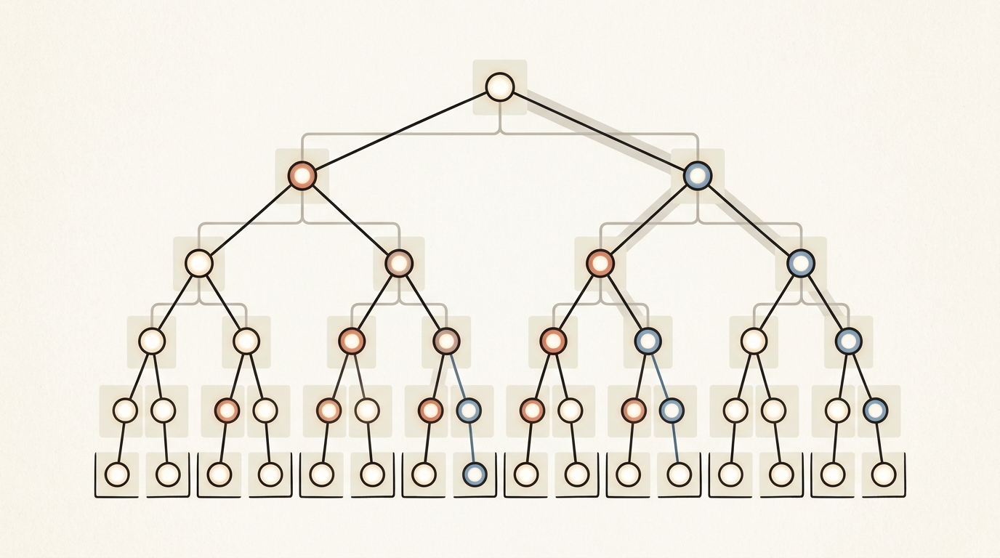
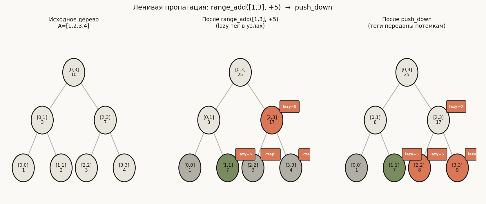

# Лекция 11: Дерево отрезков



Дерево отрезков — одна из самых важных структур данных в арсенале конкурентного программиста. Она решает фундаментальную задачу: обрабатывать запросы к диапазонам массива и точечные обновления за O(log n), тогда как любой «наивный» подход вынуждает жертвовать либо скоростью запроса, либо скоростью обновления. В курсе ШАД дерево отрезков встречается в задачах на динамическое программирование по отрезкам, в геометрических алгоритмах и в задачах на offline-обработку запросов. Понимание принципа «хранить агрегат, обновлять по пути» открывает дверь к персистентным деревьям, деревьям Фенвика, 2D-вариантам и другим продвинутым структурам.

Главная линия лекции:

$$
\text{Наивный O(n)} \;\to\; \text{Дерево отрезков O(log n)} \;\to\; \text{Ленивая пропагация O(log n) на range update}
$$

**Как читать эту лекцию:**
- Раздел 1 — убеждаемся, что наивные подходы не устраивают.
- Разделы 2–3 — строим структуру и дерево за O(n).
- Разделы 4–5 — запрос и обновление: главные операции.
- Раздел 6 — ленивая пропагация: как откладывать «дорогие» обновления.
- Раздел 7 — применения и расширения.
- Разделы 8–10 — ошибки, советы для ШАД, итог.

---

## План

1. Задача и наивные подходы
2. Структура дерева отрезков
3. Построение (Build) за O(n)
4. Запрос (Query) за O(log n)
5. Обновление (Update) за O(log n)
6. Ленивая пропагация (Lazy Propagation)
7. Применения
8. Типичные ошибки
9. Что важно для поступления в ШАД
10. Итог
11. Вопросы для самопроверки

---

## 1. Задача и наивные подходы

**Постановка задачи.** Дан массив $A[0 \ldots n-1]$. Нужно поддерживать две операции:

- **Point update:** изменить $A[\text{pos}]$ на новое значение $v$.
- **Range query:** вычислить $\sum_{i=l}^{r} A[i]$ (или $\min$, $\max$, $\gcd$ и т.д.) для произвольного диапазона $[l, r]$.

Обе операции должны выполняться быстро при произвольном чередовании.

**Наивный подход 1: «в лоб».**

- Query: обходим $A[l..r]$ за $O(n)$.
- Update: меняем один элемент за $O(1)$.
- Итог: при $q$ запросах — $O(qn)$, неприемлемо при $n, q = 10^5$.

**Наивный подход 2: Префиксные суммы.**

Вычислим $\text{prefix}[i] = A[0] + \ldots + A[i-1]$. Тогда:

$$
\sum_{i=l}^{r} A[i] = \text{prefix}[r+1] - \text{prefix}[l]
$$

- Query: $O(1)$.
- Update: нужно пересчитать все префиксные суммы от pos до n — $O(n)$.

**Цель:** обе операции за $O(\log n)$.

| Структура | Query | Update |
|---|---|---|
| Наивный обход | $O(n)$ | $O(1)$ |
| Префиксные суммы | $O(1)$ | $O(n)$ |
| **Дерево отрезков** | **$O(\log n)$** | **$O(\log n)$** |

Дерево отрезков достигает компромисса за счёт хранения предвычисленных агрегатов для $O(n)$ различных подотрезков.

---

## 2. Структура дерева отрезков

**Идея.** Строим полное бинарное дерево над массивом $A$. Каждый узел хранит агрегат (сумму, минимум, максимум и т.д.) для некоторого подотрезка $[l, r]$.

**Представление массивом.** Выделяем массив `tree` размера $4n$.

- Корень — узел с индексом $1$, покрывает $[0, n-1]$.
- Левый потомок узла $i$ — узел $2i$, покрывает $[l, \text{mid}]$.
- Правый потомок узла $i$ — узел $2i+1$, покрывает $[\text{mid}+1, r]$.
- Листья соответствуют отдельным элементам $A[i]$.

где $\text{mid} = \lfloor (l + r) / 2 \rfloor$.

**Пример дерева для $A = [1, 3, 5, 7, 9, 11]$, $n = 6$:**

```
              [0,5]=36
            /           \
      [0,2]=9          [3,5]=27
       /    \           /    \
  [0,1]=4  [2,2]=5 [3,4]=16 [5,5]=11
   /   \            /   \
[0,0]=1 [1,1]=3 [3,3]=7 [4,4]=9
```

Узел `tree[1]` = 36 (сумма всего массива). Узел `tree[2]` = 9 (сумма $A[0..2]$). Листья: `tree[tree_index]` = $A[i]$.

![Дерево отрезков для массива A = [1, 3, 5, 7, 9, 11]](assets/segment_tree.png)

То же дерево в графическом виде: в каждом узле указаны покрываемый отрезок индексов и сумма на нём. Оранжевым подсвечены узлы $[2,2]$ и $[3,4]$ — они полностью лежат внутри запроса $[2,4]$, который мы разберём в разделе 4: вместо суммирования трёх листьев ответ собирается всего из двух готовых агрегатов ($5 + 16 = 21$). Серые узлы в запросе не участвуют.

**Почему 4n?** Если $n$ — степень двойки, дерево идеально сбалансировано и содержит ровно $2n - 1$ узлов. Если нет — рекурсия делит отрезки неровно, дерево «уходит» на глубину $\lceil \log_2 n \rceil + 1$, а при хранении в массиве по формулам $2i$/$2i{+}1$ приходится резервировать место под полный двоичный уровень: до $2^{\lceil \log_2 n \rceil + 1} \leq 4n$ ячеек. Отсюда стандартный «запас с горкой» — массив размера $4n$.

**Инвариант:** значение в каждом узле равно агрегату (сумме/минимуму/максимуму) соответствующего подотрезка из двух его потомков.

---

## 3. Построение (Build) за O(n)

**Алгоритм.** Строим рекурсивно: если $l = r$, то лист — `tree[node] = A[l]`; иначе строим левое и правое поддеревья, затем пересчитываем текущий узел.

$$
\text{tree}[\text{node}] = \text{tree}[2 \cdot \text{node}] + \text{tree}[2 \cdot \text{node} + 1]
$$

**Сложность:** $O(n)$ — каждый лист посещается ровно один раз, внутренних узлов $O(n)$.

```cpp
#include <bits/stdc++.h>
using namespace std;

const int MAXN = 100005;
int A[MAXN];
long long tree[4 * MAXN];
int n;

void build(int node, int l, int r) {
    if (l == r) {
        tree[node] = A[l];
        return;
    }
    int mid = (l + r) / 2;
    build(2 * node, l, mid);
    build(2 * node + 1, mid + 1, r);
    tree[node] = tree[2 * node] + tree[2 * node + 1];
}

int main() {
    // Пример: A = [1, 3, 5, 7, 9, 11], n = 6
    n = 6;
    int init[] = {1, 3, 5, 7, 9, 11};
    for (int i = 0; i < n; i++) A[i] = init[i];

    build(1, 0, n - 1);

    // tree[1] = 36 (вся сумма)
    // tree[2] = 9  (A[0..2])
    // tree[3] = 27 (A[3..5])
    return 0;
}
```

**Трассировка построения** для $A = [1, 3, 5, 7, 9, 11]$:

1. `build(1, 0, 5)` — корень, $\text{mid}=2$.
2. `build(2, 0, 2)` — левое поддерево, $\text{mid}=1$.
3. `build(4, 0, 1)` → `build(8, 0, 0)` (лист: 1) и `build(9, 1, 1)` (лист: 3) → `tree[4] = 4`.
4. `build(5, 2, 2)` — лист: `tree[5] = 5`.
5. `tree[2] = 4 + 5 = 9`.
6. Аналогично для `build(3, 3, 5)` → `tree[3] = 27`.
7. `tree[1] = 9 + 27 = 36`.

---

## 4. Запрос (Query) за O(log n)

**Идея.** Для запроса суммы на $[ql, qr]$ спускаемся по дереву. В каждом узле, покрывающем $[l, r]$, возможны три случая:

1. $[l, r]$ **не пересекается** с $[ql, qr]$: возвращаем нейтральный элемент (0 для суммы, $+\infty$ для min).
2. $[l, r]$ **целиком внутри** $[ql, qr]$: возвращаем `tree[node]` — ответ уже готов.
3. $[l, r]$ **частично** пересекается: рекурсивно запрашиваем оба потомка и объединяем.

$$
\text{query}(l, r, ql, qr) = \begin{cases}
0 & \text{если } r < ql \text{ или } l > qr \\
\text{tree[node]} & \text{если } ql \le l \text{ и } r \le qr \\
\text{query}(\text{left}) + \text{query}(\text{right}) & \text{иначе}
\end{cases}
$$

**Сложность:** $O(\log n)$ — на каждом уровне обрабатывается не более 4 узлов.

```cpp
long long query(int node, int l, int r, int ql, int qr) {
    // Случай 1: нет пересечения
    if (r < ql || l > qr) return 0;
    // Случай 2: [l,r] полностью внутри [ql,qr]
    if (ql <= l && r <= qr) return tree[node];
    // Случай 3: частичное пересечение
    int mid = (l + r) / 2;
    long long left_sum  = query(2 * node,     l,       mid, ql, qr);
    long long right_sum = query(2 * node + 1, mid + 1, r,   ql, qr);
    return left_sum + right_sum;
}

// Вызов: query(1, 0, n-1, ql, qr)
```

**Трассировка: query sum [2, 4]** для $A = [1, 3, 5, 7, 9, 11]$:

```
query(1, [0,5], [2,4])   → частичное пересечение
  query(2, [0,2], [2,4]) → частичное пересечение
    query(4, [0,1], [2,4]) → нет пересечения → 0
    query(5, [2,2], [2,4]) → полностью внутри → 5
    → return 0 + 5 = 5
  query(3, [3,5], [2,4]) → частичное пересечение
    query(6, [3,4], [2,4]) → полностью внутри → 16
    query(7, [5,5], [2,4]) → нет пересечения → 0
    → return 16 + 0 = 16
→ return 5 + 16 = 21   ✓ (5+7+9 = 21)
```

![Трассировка запроса sum[2,4] по дереву отрезков](assets/query_trace.png)

Диаграмма повторяет трассировку выше и раскрашивает узлы по трём случаям алгоритма: серые отрезки не пересекаются с запросом и сразу возвращают нейтральный 0; оранжевые целиком лежат внутри $[2,4]$ и возвращают готовый агрегат без спуска ниже; синие пересекаются частично, поэтому рекурсия идёт в обоих потомков. Подписи под узлами показывают порядок вызовов (1–7). Обратите внимание: рекурсия «останавливается» либо на оранжевом, либо на сером узле — глубже них алгоритм не спускается, поэтому и получается $O(\log n)$.

**Почему именно $O(\log n)$?** На каждом уровне дерева «частично пересекающихся» (синих) узлов не бывает больше двух: это узлы, содержащие левую и правую границы запроса. Все остальные посещённые узлы на уровне — их непосредственные дети, которые сразу возвращают ответ. Итого на уровень приходится $O(1)$ работы, а уровней $O(\log n)$.

---

## 5. Обновление (Update) за O(log n)

**Идея.** При точечном обновлении $A[\text{pos}] = v$ нужно обновить ровно те узлы дерева, которые покрывают `pos`. Это один путь от корня до листа — $O(\log n)$ узлов.

**Алгоритм:**
- Если $l = r = \text{pos}$: обновляем лист.
- Иначе: рекурсивно идём в нужный потомок, затем пересчитываем текущий узел снизу вверх.

```cpp
void update(int node, int l, int r, int pos, int val) {
    if (l == r) {
        // Лист: обновляем значение
        tree[node] = val;
        return;
    }
    int mid = (l + r) / 2;
    if (pos <= mid) {
        update(2 * node, l, mid, pos, val);
    } else {
        update(2 * node + 1, mid + 1, r, pos, val);
    }
    // Пересчёт снизу вверх
    tree[node] = tree[2 * node] + tree[2 * node + 1];
}

// Вызов: update(1, 0, n-1, pos, val)
```

**Трассировка: update A[3] = 4** (было 7):

```
update(1, [0,5], pos=3, val=4)
  → 3 > mid=2, идём вправо
  update(3, [3,5], pos=3, val=4)
    → 3 <= mid=4, идём влево
    update(6, [3,4], pos=3, val=4)
      → 3 <= mid=3, идём влево
      update(12, [3,3], pos=3, val=4)  ← лист: tree[12] = 4
      tree[6] = tree[12] + tree[13] = 4 + 9 = 13
    tree[3] = tree[6] + tree[7] = 13 + 11 = 24
  tree[1] = tree[2] + tree[3] = 9 + 24 = 33
```

Изменились только узлы на пути: `tree[12]`, `tree[6]`, `tree[3]`, `tree[1]` — всего $O(\log n)$ узлов.

---

## 6. Ленивая пропагация (Lazy Propagation)

**Проблема.** Что если нужно прибавить $v$ ко всем элементам $A[l..r]$? Без оптимизации придётся обновлять $O(r - l + 1)$ листьев — в худшем случае $O(n \log n)$.

**Идея ленивой пропагации.** Откладываем применение обновления: вместо того чтобы спускаться до листьев, храним «ленивый тег» (lazy tag) в узле. Тег означает: «этот узел уже обновлён, но потомки — ещё нет». Когда нам нужно зайти в потомка, сначала «проталкиваем» (push down) тег.

**Детали для range add + range sum:**

- `lazy[node]` — сколько нужно прибавить ко всем элементам подотрезка этого узла.
- При добавлении $v$ к $[l, r]$: `tree[node] += v * (r - l + 1)`.
- При push down: передаём тег обоим потомкам, обнуляем у текущего.

$$
\text{tree[node]} += v \cdot (r - l + 1), \quad \text{lazy[node]} += v
$$



Три панели показывают жизненный цикл ленивого тега на массиве $A = [1, 2, 3, 4]$. Слева — исходное дерево сумм. В центре — состояние после `range_add([1,3], +5)`: узлы $[1,1]$ и $[2,3]$ полностью попали в диапазон, поэтому их суммы обновлены сразу ($2 \to 7$ и $7 \to 17$), а «долг» перед их потомками записан в теги `lazy=5`; листья $[2,2]$ и $[3,3]$ при этом хранят устаревшие значения 3 и 4 — и это нормально, пока к ним никто не обращается. Справа — момент, когда потребовалось спуститься в потомков узла $[2,3]$: `push_down` передал тег вниз, листья стали равны 8 и 9, а тег родителя обнулился.

```cpp
const int MAXN = 100005;
long long tree[4 * MAXN];
long long lazy[4 * MAXN];  // ленивые теги

// Проталкивание тега в потомков
void push_down(int node, int l, int r) {
    if (lazy[node] == 0) return;  // нечего проталкивать
    int mid = (l + r) / 2;

    // Левый потомок: покрывает (mid - l + 1) элементов
    tree[2 * node]     += lazy[node] * (mid - l + 1);
    lazy[2 * node]     += lazy[node];

    // Правый потомок: покрывает (r - mid) элементов
    tree[2 * node + 1] += lazy[node] * (r - mid);
    lazy[2 * node + 1] += lazy[node];

    lazy[node] = 0;  // тег применён
}

// Range add: прибавить val ко всем A[ql..qr]
void range_update(int node, int l, int r, int ql, int qr, long long val) {
    if (r < ql || l > qr) return;  // нет пересечения
    if (ql <= l && r <= qr) {
        // Весь отрезок внутри: обновляем и запоминаем тег
        tree[node] += val * (r - l + 1);
        lazy[node] += val;
        return;
    }
    push_down(node, l, r);  // проталкиваем тег перед спуском
    int mid = (l + r) / 2;
    range_update(2 * node,     l,       mid, ql, qr, val);
    range_update(2 * node + 1, mid + 1, r,   ql, qr, val);
    tree[node] = tree[2 * node] + tree[2 * node + 1];
}

// Range query: сумма на [ql, qr]
long long range_query(int node, int l, int r, int ql, int qr) {
    if (r < ql || l > qr) return 0;
    if (ql <= l && r <= qr) return tree[node];
    push_down(node, l, r);  // проталкиваем тег перед спуском
    int mid = (l + r) / 2;
    return range_query(2 * node,     l,       mid, ql, qr)
         + range_query(2 * node + 1, mid + 1, r,   ql, qr);
}
```

**Ключевой принцип:** `push_down` вызывается перед любым спуском в потомков. Это гарантирует, что каждый узел содержит корректное значение в момент обращения.

**Сложность:** и range update, и range query работают за $O(\log n)$.

---

## 7. Применения

### Range min / max

Просто замените агрегирующую операцию: вместо суммы используйте `min` или `max`. Нейтральный элемент: $+\infty$ для min, $-\infty$ для max.

```cpp
// Минимум на отрезке
int query_min(int node, int l, int r, int ql, int qr) {
    if (r < ql || l > qr) return INT_MAX;
    if (ql <= l && r <= qr) return tree[node];
    int mid = (l + r) / 2;
    return min(query_min(2 * node,     l,       mid, ql, qr),
               query_min(2 * node + 1, mid + 1, r,   ql, qr));
}
```

### Range GCD

Агрегирование через `__gcd`. GCD распределяется по отрезкам: $\gcd(A[l..r]) = \gcd(\gcd(A[l..\text{mid}]),\, \gcd(A[\text{mid}+1..r]))$. Нейтральный элемент — 0 (так как $\gcd(x, 0) = x$).

### Подсчёт инверсий

Дерево отрезков по значениям: для каждого нового элемента $a_i$ запрашиваем, сколько уже добавленных элементов больше $a_i$, затем добавляем $a_i$ в дерево.

### Расширения

- **Персистентное дерево отрезков:** при каждом обновлении создаём новые узлы вместо изменения старых — получаем доступ к любой «версии» массива за $O(\log n)$.
- **2D дерево отрезков:** для запросов к прямоугольным подматрицам; сложность $O(\log^2 n)$.
- **Дерево Фенвика (BIT):** более простая структура для суммы/разности, но менее гибкая.
- **Merge sort tree:** каждый узел хранит отсортированный список; позволяет отвечать на запросы типа «сколько элементов в $[l,r]$ меньше $v$» за $O(\log^2 n)$.

---

## 8. Типичные ошибки

1. **Размер массива дерева меньше 4n.** Часто пишут `tree[2*MAXN]` или даже `tree[MAXN]`. При $n$ не кратном степени двойки дерево уходит глубже, и нужно до $4n$ ячеек. Всегда выделяйте `tree[4 * MAXN]`.

2. **Неверный нейтральный элемент.** Для суммы нейтраль — 0, для min — `INT_MAX`, для max — `INT_MIN`, для GCD — 0. Если возвращать 0 при запросе минимума вне диапазона, результат будет неверным — 0 меньше любого положительного числа.

3. **Забыли push_down перед спуском в потомков.** При ленивой пропагации обязательно вызывайте `push_down` до рекурсивных вызовов в `range_update` и `range_query`. Без этого потомки будут содержать устаревшие значения.

4. **Неправильный расчёт числа элементов при push_down.** Левый потомок покрывает $\text{mid} - l + 1$ элементов, правый — $r - \text{mid}$ элементов. Ошибка в этих множителях даёт неверные суммы.

5. **Индексация с нуля vs единицы.** Корень принято помещать в узел 1 (не 0), иначе формулы $2i$ и $2i+1$ дают $0$ и $1$ — бесконечная рекурсия. Убедитесь, что вызываете `build(1, 0, n-1)`, а не `build(0, ...)`.

6. **Переполнение int.** Суммы на больших массивах могут превышать $2^{31}$. Используйте `long long` для `tree[]` и возвращаемых значений.

7. **Не пересчитываете узел после update.** Если после рекурсивного вызова забыть строку `tree[node] = tree[2*node] + tree[2*node+1]`, дерево становится некорректным начиная с этого узла.

8. **Диапазон запроса инвертирован (ql > qr).** Вызов `query(1, 0, n-1, 5, 2)` не вернёт ошибку, но даст неверный ответ. Всегда проверяйте `ql <= qr` на входе.

---

## 9. Что важно для поступления в ШАД

- **Знать наизусть структуру дерева:** размер $4n$, индексация $2i$ / $2i+1$, формула `mid = (l+r)/2`.
- **Уметь писать build, query, update за 5–10 минут** без ошибок — это стандартная базовая задача на алгоритмическом туре ШАД.
- **Ленивая пропагация** — знать когда нужна (range update) и реализовать корректно. Частый вопрос: «Добавьте поддержку прибавления константы к отрезку».
- **Смена агрегата:** уметь быстро переделать дерево с суммы на min/max/gcd. На экзамене часто просят адаптировать базовую структуру.
- **Анализ сложности:** объяснить, почему query работает за $O(\log n)$, а не $O(n)$ — на каждом уровне не более 4 «активных» узлов.
- **Задачи на offline-обработку** с деревом отрезков: например, «для каждого запроса $[l, r]$ найти количество уникальных элементов» решается через sweep + дерево отрезков.
- **Персистентное дерево отрезков** — знать идею (при изменении создаём новую версию, не трогая старую), применение — k-й порядковый элемент на подотрезке.

---

## 10. Итог

Дерево отрезков — универсальный инструмент для задач, где нужно быстро отвечать на запросы к подотрезкам и одновременно поддерживать обновления. Структура основана на двух идеях: (1) разбиении массива на иерархические отрезки с предвычисленными агрегатами и (2) ленивом откладывании обновлений, когда операции затрагивают целые подотрезки.

Ключевое достижение — оба основных действия (запрос и обновление) выполняются за $O(\log n)$, что на порядок лучше наивных $O(n)$ подходов. Гибкость структуры проявляется в том, что агрегирующую функцию можно менять (сумма, минимум, максимум, НОД, произведение) без изменения архитектуры — только заменив несколько строк кода. Именно эта универсальность делает дерево отрезков одной из первых структур данных, которую нужно освоить на пути к ШАД и олимпиадному программированию.

---

## 11. Вопросы для самопроверки

1. Почему для дерева отрезков выделяют массив размера $4n$, а не $2n$?
2. Что возвращает функция `query` при полном отсутствии пересечения $[l, r]$ и $[ql, qr]$? Почему именно это значение?
3. Как изменится код дерева отрезков, если вместо суммы нужен минимум? Что такое нейтральный элемент?
4. Объясните, почему `query` имеет сложность $O(\log n)$, хотя дерево имеет $O(n)$ узлов.
5. Что произойдёт, если в функции `update` забыть строку `tree[node] = tree[2*node] + tree[2*node+1]`?
6. В чём состоит проблема «наивного» range update без ленивой пропагации? Какова его сложность?
7. Что означает «ленивый тег» в узле дерева? Когда он проталкивается в потомков?
8. Напишите формулу, показывающую, как при `push_down` вычисляется вклад тега в значение левого и правого потомков.
9. Как построить дерево отрезков для нахождения НОД на отрезке? Чему равен нейтральный элемент?
10. Что такое персистентное дерево отрезков? Как оно используется для нахождения k-й порядковой статистики на подотрезке?
