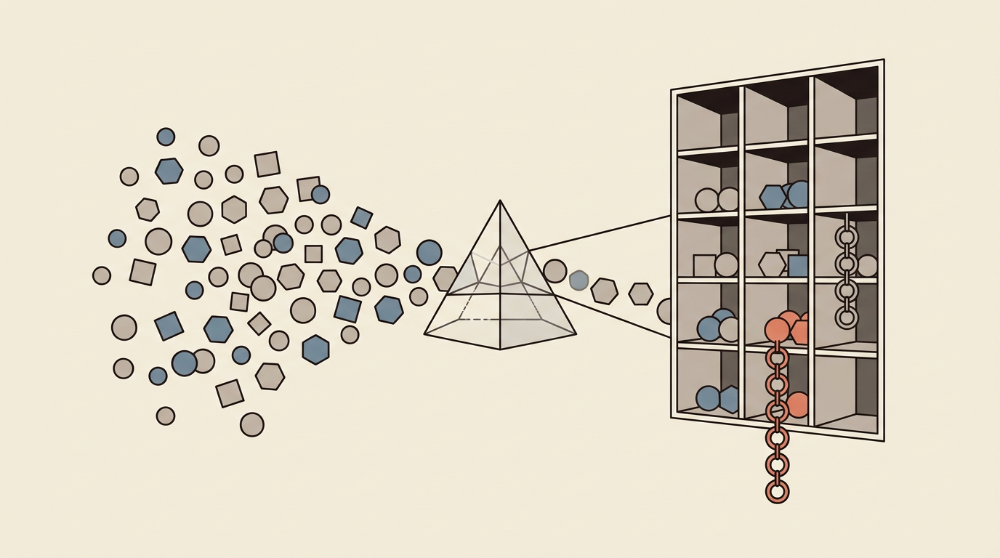
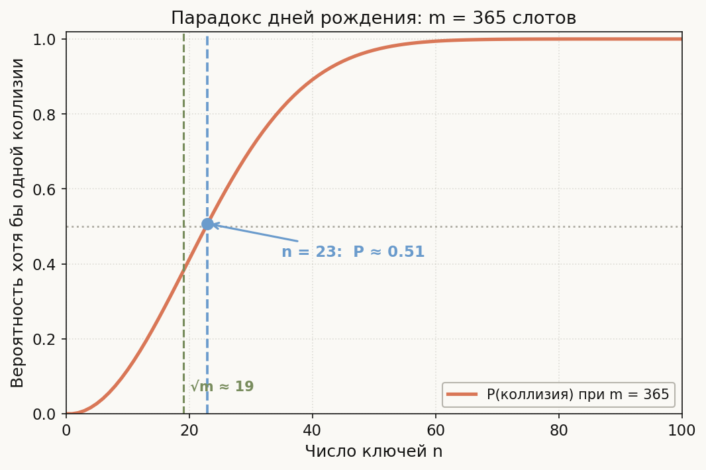
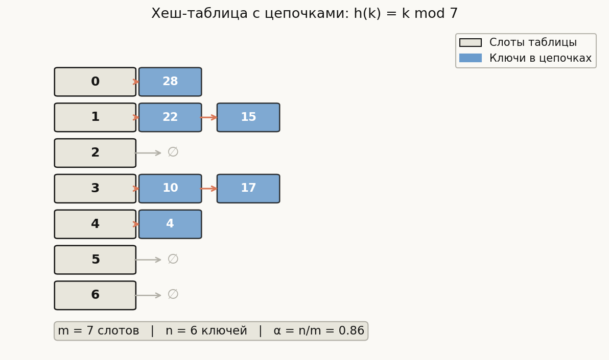
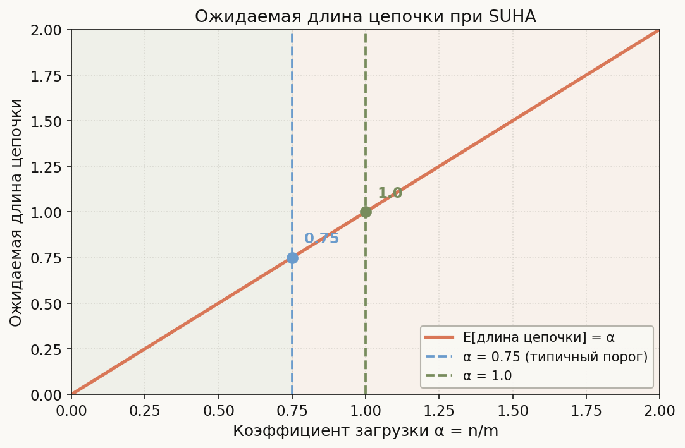
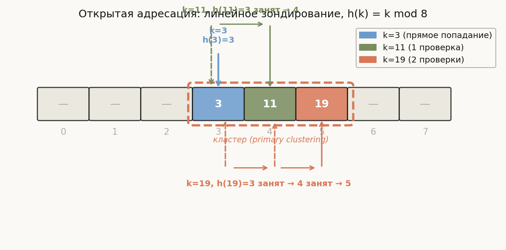
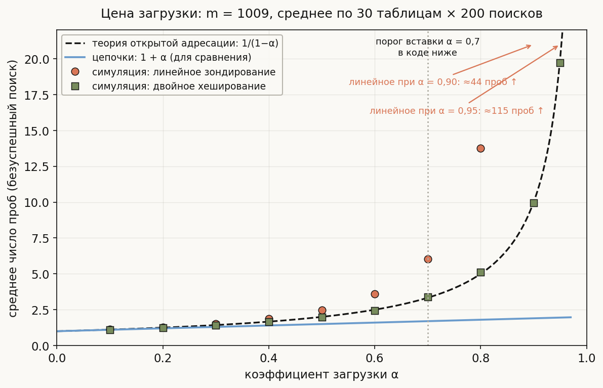

# Лекция 12: Хеш-функции и хеш-таблицы



Почти каждый реальный алгоритм — от базы данных до компилятора — держит в основе одну структуру данных, которая обеспечивает поиск за амортизированное O(1): хеш-таблицу. В предыдущих лекциях мы видели, как деревья поиска дают O(log n), а сортировка — O(n log n). Хеш-таблица ломает этот предел, пожертвовав упорядоченностью ради скорости. Для ШАД эта тема обязательна: задачи на два указателя, подсчёт частот, поиск подстрок — везде используется хеширование.

Главная линия лекции:

$$
\text{Хеш-функция} \to \text{Коллизии (неизбежны)} \to \text{Разрешение цепочками} \to O(1) \text{ в среднем}
$$

**Как читать эту лекцию:**
- Разделы 1–2: математический фундамент (хеш-функции и коллизии)
- Разделы 3–4: основная структура (цепочки + анализ через гипотезу равномерного хеширования)
- Разделы 5–6: дополнительные методы (открытая адресация, строковый хеш)
- Раздел 7: практика на C++ (std::unordered_map)
- Разделы 8–10: типичные ошибки, советы для ШАД, итог

---

## План

1. Хеш-функция
2. Коллизии и парадокс дней рождения
3. Разрешение коллизий методом цепочек
4. Гипотеза простого равномерного хеширования
5. Открытая адресация (кратко)
6. Хеш-функции для строк
7. std::unordered_map и std::unordered_set в C++
8. Типичные ошибки
9. Что важно для поступления в ШАД
10. Итог
11. Вопросы для самопроверки

---

## 1. Хеш-функция

**Определение.** Пусть $U$ — универсум ключей (например, все 64-битные целые). Хеш-функция — это отображение

$$
h: U \to \{0, 1, \ldots, m-1\}
$$

которое сжимает произвольный ключ до индекса массива размера $m$.

**Три требования к хорошей хеш-функции:**
- *Детерминированность:* одинаковый ключ всегда даёт одинаковый хеш.
- *Быстрота:* вычисляется за O(1) (или O(|k|) для строк).
- *Равномерность:* ключи распределяются по слотам максимально равномерно.

**Метод деления (division method):**

$$
h(k) = k \bmod m
$$

Выбор $m$: нельзя брать степень двойки (хеш зависит только от младших битов), нельзя брать $10^r$ для числовых ключей. Хороший выбор — простое число, далёкое от степени двойки, например $m = 1000003$.

**Плохой пример.** Телефонные номера в России имеют фиксированные цифровые паттерны. Если взять $h(k) = k \bmod 10$, последняя цифра номера не является равномерно распределённой (многие номера оканчиваются на 0). Результат — перегруженные слоты.

**Метод умножения (multiplication method):**

$$
h(k) = \lfloor m \cdot (\{k \cdot A\}) \rfloor
$$

где $\{x\} = x \bmod 1$ — дробная часть, $A$ — иррациональная константа. Классический выбор — золотое сечение $A = (\sqrt{5}-1)/2 \approx 0{,}6180339887$. Метод работает для любого $m$, в том числе степени двойки.

```cpp
#include <cstdint>
#include <cmath>

// Метод деления
int division_hash(int k, int m) {
    return ((k % m) + m) % m;  // +m для корректной работы с отрицательными
}

// Метод умножения (золотое сечение)
int multiplication_hash(uint64_t k, int m) {
    const double A = 0.6180339887498948;
    double frac = k * A - std::floor(k * A);
    return static_cast<int>(m * frac);
}

int main() {
    int m = 11;
    // h(10) = 10 mod 11 = 10
    // h(22) = 22 mod 11 = 0
    // h(31) = 31 mod 11 = 9
    for (int k : {10, 22, 31, 4, 15, 28}) {
        int slot = division_hash(k, m);
        // slot используется по назначению — вставка в таблицу
        (void)slot;
    }
    return 0;
}
```

---

## 2. Коллизии и парадокс дней рождения

**Определение.** Коллизия — ситуация, когда два разных ключа $k_1 \neq k_2$ дают одинаковый хеш: $h(k_1) = h(k_2)$.

**Неизбежность коллизий.** Если ключей больше, чем слотов ($|U| > m$), коллизии неизбежны по принципу Дирихле (принцип ящиков). Но даже при $n \ll m$ они возникают намного раньше, чем кажется.

**Парадокс дней рождения.** Рассмотрим $m = 365$ (дней в году) и $n$ людей. Вероятность того, что хотя бы двое родились в один день:

$$
P(\text{коллизия}) = 1 - \frac{365}{365} \cdot \frac{364}{365} \cdot \frac{363}{365} \cdots \frac{365-n+1}{365}
$$

При $n = 23$ эта вероятность превышает 50%. Общее правило: коллизия вероятна уже при $n \approx \sqrt{m}$.



График показывает, насколько быстро растёт вероятность коллизии при $m = 365$ слотах: уже при $n = 23$ ключах она пересекает отметку 50% (синий пунктир), а к $n \approx 60$ практически достигает единицы. Зелёная линия $\sqrt{m} \approx 19$ — универсальный ориентир: коллизии становятся вероятными, когда число ключей достигает порядка корня из числа слотов, а вовсе не когда таблица заполняется. Интуиция «места ещё много — коллизий не будет» обманчива, потому что пар ключей, способных столкнуться, уже $\binom{n}{2} \sim n^2/2$.

**Следствие для хеш-таблиц.** При $m$ слотах и $n = \sqrt{m}$ ключах вероятность коллизии $\approx 50\%$. При $n = m$ почти все слоты будут иметь хотя бы одну коллизию. Это означает, что стратегия разрешения коллизий не является "экзотическим случаем" — это обязательная часть любой хеш-таблицы.

```cpp
#include <cmath>
#include <iostream>

// Вероятность коллизии при n ключах и m слотах
double collision_probability(int n, int m) {
    double prob_no_collision = 1.0;
    for (int i = 0; i < n; ++i) {
        prob_no_collision *= static_cast<double>(m - i) / m;
    }
    return 1.0 - prob_no_collision;
}

int main() {
    std::cout << "m=365, n=23: " << collision_probability(23, 365) << "\n";
    // Вывод: m=365, n=23: ~0.5073 (>50%)
    return 0;
}
```

---

## 3. Разрешение коллизий методом цепочек

**Идея.** Каждый слот хеш-таблицы хранит не один элемент, а *связный список* (цепочку) всех ключей, смешавшихся в этот слот.

**Операции:**
- *Insert(k):* вычислить $h(k)$, добавить $k$ в начало списка слота $h(k)$. Время O(1).
- *Search(k):* вычислить $h(k)$, пройти по списку слота $h(k)$ и сравнить ключи. Время O(1 + длина цепочки).
- *Delete(k):* найти $k$, удалить из списка. Время O(1 + длина цепочки).

**Коэффициент загрузки (load factor):**

$$
\alpha = \frac{n}{m}
$$

где $n$ — количество элементов, $m$ — количество слотов. При $\alpha = 1$ каждый слот содержит в среднем один элемент. При $\alpha > 1$ цепочки растут.

**Пример.** Вставим ключи $\{10, 22, 31, 4, 15, 28, 17, 88, 59\}$ в таблицу с $m = 11$ и $h(k) = k \bmod 11$:

| Ключ | $h(k)$ | Слот |
|------|--------|------|
| 10   | 10     | 10   |
| 22   | 0      | 0    |
| 31   | 9      | 9    |
| 4    | 4      | 4    |
| 15   | 4      | 4    |
| 28   | 6      | 6    |
| 17   | 6      | 6    |
| 88   | 0      | 0    |
| 59   | 4      | 4    |

Цепочки: слот 0: [88 -> 22], слот 4: [59 -> 15 -> 4], слот 6: [17 -> 28], слот 9: [31], слот 10: [10].

Коэффициент загрузки: $\alpha = 9/11 \approx 0{,}82$.



На диаграмме — таблица меньшего размера, $m = 7$, с ключами $\{10, 22, 4, 15, 28, 17\}$ и $h(k) = k \bmod 7$. Слева — слоты 0–6, справа от каждого — его цепочка: в слот 1 попали 22 и 15 ($22 \bmod 7 = 15 \bmod 7 = 1$), в слот 3 — 10 и 17, слот 0 занят ключом 28, слот 4 — ключом 4, а пустые слоты помечены $\varnothing$. Хорошо видно устройство поиска: хеш мгновенно указывает на слот, после чего остаётся линейно пройти короткую цепочку — при $\alpha = 6/7 \approx 0{,}86$ её ожидаемая длина меньше одного элемента.

```cpp
#include <iostream>
#include <list>
#include <vector>
#include <optional>

template<typename K, typename V>
class HashTable {
public:
    explicit HashTable(int m) : m_(m), n_(0), table_(m) {}

    // Хеш-функция (метод деления)
    int hash(int k) const {
        return ((k % m_) + m_) % m_;
    }

    // Вставка ключа k со значением v
    void insert(K k, V v) {
        int slot = hash(k);
        // Если ключ уже есть — обновляем значение
        for (auto& [key, val] : table_[slot]) {
            if (key == k) {
                val = v;
                return;
            }
        }
        // Вставка в начало цепочки — O(1)
        table_[slot].push_front({k, v});
        ++n_;

        // Перехеширование при превышении порога загрузки
        if (static_cast<double>(n_) / m_ > 0.75) {
            rehash();
        }
    }

    // Поиск по ключу
    std::optional<V> find(K k) const {
        int slot = hash(k);
        for (const auto& [key, val] : table_[slot]) {
            if (key == k) return val;
        }
        return std::nullopt;
    }

    // Удаление ключа
    bool erase(K k) {
        int slot = hash(k);
        auto& chain = table_[slot];
        for (auto it = chain.begin(); it != chain.end(); ++it) {
            if (it->first == k) {
                chain.erase(it);
                --n_;
                return true;
            }
        }
        return false;
    }

    int size() const { return n_; }
    double load_factor() const { return static_cast<double>(n_) / m_; }

private:
    void rehash() {
        int new_m = m_ * 2 + 1;
        std::vector<std::list<std::pair<K,V>>> new_table(new_m);
        for (auto& chain : table_) {
            for (auto& [key, val] : chain) {
                int slot = ((key % new_m) + new_m) % new_m;
                new_table[slot].push_front({key, val});
            }
        }
        m_ = new_m;
        table_ = std::move(new_table);
    }

    int m_;
    int n_;
    std::vector<std::list<std::pair<K, V>>> table_;
};

int main() {
    HashTable<int, int> ht(11);
    for (int k : {10, 22, 31, 4, 15, 28, 17, 88, 59}) {
        ht.insert(k, k * 10);
    }
    std::cout << "find(15): " << *ht.find(15) << "\n";  // 150
    std::cout << "load factor: " << ht.load_factor() << "\n";
    ht.erase(15);
    std::cout << "find(15) after erase: " << ht.find(15).has_value() << "\n";
    return 0;
}
```

---

## 4. Гипотеза простого равномерного хеширования

**Формулировка (SUHA — Simple Uniform Hashing Assumption).** Каждый ключ с равной вероятностью $1/m$ попадает в любой из $m$ слотов, независимо от других ключей.

Эта гипотеза — теоретический идеал. На практике хорошие хеш-функции (например, MurmurHash, FNV) приближаются к ней, но не достигают точно. Под этой гипотезой можно строго доказать оценки.

**Ожидаемая длина цепочки.** Рассмотрим слот $j$. Введём индикаторную случайную величину $X_{ij} = 1$, если ключ $k_i$ попал в слот $j$. Тогда $\mathbb{E}[X_{ij}] = 1/m$. Длина цепочки в слоте $j$:

$$
L_j = \sum_{i=1}^{n} X_{ij}
$$

По линейности ожидания:

$$
\mathbb{E}[L_j] = \sum_{i=1}^{n} \frac{1}{m} = \frac{n}{m} = \alpha
$$

**Теорема (время безуспешного поиска).** Под SUHA ожидаемое время безуспешного поиска (ключ не найден) равно $\Theta(1 + \alpha)$.

*Пояснение:* вычислить хеш — O(1), пройти всю цепочку (в среднем длиной $\alpha$) — O($\alpha$). Итого O(1 + $\alpha$).

**Теорема (время успешного поиска).** Под SUHA ожидаемое время успешного поиска равно $\Theta(1 + \alpha/2)$.

*Пояснение:* при поиске ключа $k_i$ нужно просмотреть в среднем половину элементов, вставленных после него. Точное доказательство использует тот факт, что $k_i$ добавлен $i$-м, и после него добавлено $n-i$ элементов, каждый с вероятностью $1/m$ попадает в тот же слот.

$$
\mathbb{E}[\text{успешный поиск}] = \Theta\!\left(1 + \frac{\alpha}{2}\right)
$$

**Следствие.** Если $n = O(m)$, то $\alpha = O(1)$ и все операции хеш-таблицы занимают $O(1)$ ожидаемого времени.

**Где именно работает равномерность.** В выводе выше SUHA использована ровно в одном месте: $\mathbb{E}[X_{ij}] = 1/m$. Всё остальное — линейность математического ожидания, которая верна всегда и даже не требует независимости ключей между собой. Поэтому и вывод хрупок ровно в этой точке: если распределение по слотам неравномерно, оценка рушится. Крайний случай — все $n$ ключей в одном слоте (телефоны, оканчивающиеся на 0, при $h(k) = k \bmod 10$): тогда $L_j = n$, и «$O(1)$ в среднем» честно превращается в $\Theta(n)$ — таблица деградирует в связный список. Заметьте также, что оценка *ожидаемая*, а не худшая: даже идеальная хеш-функция не запрещает всем ключам случайно столкнуться, это лишь маловероятно. Именно на слом равномерности направлена атака из раздела 7: противник, знающий $h$, целенаправленно подбирает ключи с одинаковым хешем, а рандомизированный seed возвращает предположение SUHA в силу — теперь «плохой» набор ключей нельзя вычислить заранее.

**Почему перехеширование — это O(1) амортизированно.** **Ключевое наблюдение:** удвоение размера гарантирует, что после переноса загрузка падает примерно вдвое, и до следующего переноса нужно вставить ещё порядка $n$ *новых* ключей — дорогие операции экспоненциально редки. Проследим за таблицей из раздела 3 ($m = 11$, порог $\alpha > 0{,}75$, размер растёт как $m \to 2m + 1$): перенос срабатывает на 9-й вставке ($9/11 \approx 0{,}82$, платим 9 копирований, $m = 23$), затем на 18-й (платим 18, $m = 47$), на 36-й (платим 36, $m = 95$), на 72-й (платим 72, $m = 191$). За первые 100 вставок суммарно скопировано $9 + 18 + 36 + 72 = 135$ элементов — меньше $1{,}4$ копирования на вставку. Так будет всегда: стоимости переносов образуют геометрическую прогрессию, сумма которой не превышает удвоенной стоимости последнего переноса, то есть $O(n)$ на $n$ вставок — $O(1)$ на операцию в среднем по последовательности. Отдельная вставка изредка стоит $O(n)$, но «копит» на неё вся серия дешёвых вставок между переносами. Взамен таблица навсегда сохраняет $\alpha \leq 0{,}75$, а с ним и короткие цепочки.



График показывает главный вывод анализа: под SUHA ожидаемая длина цепочки растёт строго линейно, $\mathbb{E}[L] = \alpha$, без резких порогов. Зелёная зона до $\alpha = 0{,}75$ — рабочий режим, в котором операции стоят близко к $O(1)$; правее цепочки продолжают удлиняться, и константа в «$O(1)$ в среднем» становится всё заметнее. Пунктир $\alpha = 0{,}75$ — типичный порог перехеширования: выгоднее один раз заплатить $O(n)$ за перенос элементов в таблицу побольше, чем постоянно доплачивать за длинные цепочки.

```cpp
#include <iostream>

// Демонстрация: ожидаемое время поиска под SUHA
void analyze_hash_table(int n, int m) {
    double alpha = static_cast<double>(n) / m;
    double expected_unsuccessful = 1.0 + alpha;
    double expected_successful   = 1.0 + alpha / 2.0;

    std::cout << "n=" << n << ", m=" << m
              << ", alpha=" << alpha << "\n";
    std::cout << "E[unsuccessful search] = " << expected_unsuccessful << "\n";
    std::cout << "E[successful search]   = " << expected_successful << "\n";
}

int main() {
    analyze_hash_table(9, 11);   // alpha ~0.82
    analyze_hash_table(100, 100); // alpha = 1.0
    analyze_hash_table(75, 100);  // alpha = 0.75
    return 0;
}
```

---

## 5. Открытая адресация

**Идея.** Все элементы хранятся непосредственно в массиве таблицы, без указателей. При коллизии элемент помещается в следующий свободный слот согласно *последовательности зондирования* (probe sequence).

**Требование:** коэффициент загрузки $\alpha < 1$ (таблица никогда не должна быть заполнена полностью).

**Линейное зондирование (Linear Probing):**

$$
h(k, i) = (h(k) + i) \bmod m, \quad i = 0, 1, 2, \ldots
$$

*Проблема первичной кластеризации:* длинные серии занятых слотов замедляют поиск. Среднее время поиска при $\alpha$ близком к 1 растёт непропорционально.



На диаграмме $m = 8$ слотов и три ключа с одинаковым хешем: $h(3) = h(11) = h(19) = 3$. Ключ 3 занимает свой слот сразу; ключ 11 находит слот 3 занятым и сдвигается в слот 4; ключу 19 приходится перешагнуть уже два занятых слота и осесть в слоте 5. Пунктирной рамкой обведён образовавшийся кластер из трёх подряд занятых слотов — наглядная иллюстрация первичной кластеризации: каждый новый ключ, чей хеш попадает в кластер, приклеивается к его концу и удлиняет его, из-за чего серии проб растут лавинообразно.

**Двойное хеширование (Double Hashing):**

$$
h(k, i) = (h_1(k) + i \cdot h_2(k)) \bmod m
$$

где $h_2(k)$ должна быть взаимно простой с $m$ (например, если $m$ — простое, то $h_2(k) = 1 + (k \bmod (m-1))$). Позволяет покрыть все $m$ слотов и уменьшает кластеризацию.

**Откуда берётся цена высокой загрузки: $1/(1-\alpha)$ проб.** **Ключевое наблюдение:** при идеально равномерном зондировании каждая следующая проба попадает в занятый слот с вероятностью примерно $\alpha$, независимо от предыдущих. Безуспешный поиск (и вставка — это тот же путь) продолжается, пока пробы натыкаются на занятые слоты: вероятность сделать больше $i$ проб $\approx \alpha^i$, а значит ожидаемое число проб — геометрический ряд

$$
\mathbb{E}[\text{проб}] \approx \sum_{i=0}^{\infty} \alpha^i = \frac{1}{1-\alpha}.
$$

Здесь, как и в анализе цепочек, равномерность — несущая конструкция: без неё «вероятность занятости $\alpha$» на каждой пробе ничем не обоснована. Двойное хеширование близко к идеальной модели, линейное зондирование хуже — кластеры делают пробы зависимыми (попал в кластер — иди до его конца). Числа объясняют, почему открытая адресация чувствительнее цепочек к загрузке: при $\alpha = 0{,}5$ — 2 пробы, при $\alpha = 0{,}9$ — 10, при $\alpha = 0{,}99$ — 100, тогда как ожидаемая цена безуспешного поиска в цепочках $1 + \alpha$ даже при полной загрузке лишь 2. Именно поэтому вставка в коде ниже отклоняется уже при $\alpha \geq 0{,}7$ — дальше знаменатель $1 - \alpha$ начинает «взрываться».



График — честный эксперимент: в таблицу из $m = 1009$ слотов вставляются случайные ключи до нужной загрузки, затем измеряется среднее число проб при поиске отсутствующих ключей (усреднение по многим таблицам). Точки двойного хеширования ложатся на теоретическую кривую $1/(1-\alpha)$, точки линейного зондирования из-за кластеризации уходят выше неё уже при $\alpha \approx 0{,}7$, а пологая прямая $1 + \alpha$ для метода цепочек показывает контраст: цепочки почти не чувствуют загрузку, открытая адресация возле $\alpha \to 1$ дорожает на порядки.

```cpp
#include <iostream>
#include <vector>
#include <optional>

class OpenAddressHashTable {
public:
    explicit OpenAddressHashTable(int m)
        : m_(m), n_(0), table_(m, std::nullopt), deleted_(m, false) {}

    // h1 — основная хеш-функция
    int h1(int k) const { return ((k % m_) + m_) % m_; }
    // h2 — для двойного хеширования (m должно быть простым)
    int h2(int k) const { return 1 + ((k % (m_ - 1)) + (m_ - 1)) % (m_ - 1); }

    bool insert(int k) {
        if (static_cast<double>(n_) / m_ >= 0.7) return false;  // таблица заполнена
        for (int i = 0; i < m_; ++i) {
            int slot = (h1(k) + i * h2(k)) % m_;
            if (!table_[slot].has_value() || deleted_[slot]) {
                table_[slot] = k;
                deleted_[slot] = false;
                ++n_;
                return true;
            }
        }
        return false;
    }

    bool find(int k) const {
        for (int i = 0; i < m_; ++i) {
            int slot = (h1(k) + i * h2(k)) % m_;
            if (!table_[slot].has_value() && !deleted_[slot]) return false;
            if (table_[slot].has_value() && *table_[slot] == k) return true;
        }
        return false;
    }

    bool erase(int k) {
        for (int i = 0; i < m_; ++i) {
            int slot = (h1(k) + i * h2(k)) % m_;
            if (!table_[slot].has_value() && !deleted_[slot]) return false;
            if (table_[slot].has_value() && *table_[slot] == k) {
                table_[slot] = std::nullopt;
                deleted_[slot] = true;  // "захоронение" для корректного поиска
                --n_;
                return true;
            }
        }
        return false;
    }

private:
    int m_, n_;
    std::vector<std::optional<int>> table_;
    std::vector<bool> deleted_;
};

int main() {
    OpenAddressHashTable ht(11);
    for (int k : {10, 22, 31, 4, 15}) {
        ht.insert(k);
    }
    std::cout << std::boolalpha;
    std::cout << "find(15): " << ht.find(15) << "\n";  // true
    ht.erase(15);
    std::cout << "find(15) after erase: " << ht.find(15) << "\n";  // false
    return 0;
}
```

---

## 6. Хеш-функции для строк

**Полиномиальный хеш (Polynomial Rolling Hash):**

$$
h(s) = \Bigl(s[0] \cdot p^{n-1} + s[1] \cdot p^{n-2} + \cdots + s[n-1] \cdot p^0\Bigr) \bmod M
$$

Хороший выбор: $p = 31$ для строк из строчных латинских букв (или $p = 131$ для ASCII), $M = 10^9 + 7$ (большое простое).

**Алгоритм Рабина-Карпа.** Используя скользящий хеш, можно за $O(n + m)$ найти все вхождения шаблона длины $m$ в тексте длины $n$. Хеш нового окна вычисляется из предыдущего:

$$
h(s[i+1..i+m]) = \bigl(h(s[i..i+m-1]) - s[i] \cdot p^{m-1}\bigr) \cdot p + s[i+m]
$$

```cpp
#include <iostream>
#include <string>
#include <vector>

const long long MOD = 1e9 + 7;
const long long P   = 31;

// Хеш строки по схеме Горнера:
// h = s[0]*P^{n-1} + s[1]*P^{n-2} + ... + s[n-1]  (mod MOD)
long long string_hash(const std::string& s) {
    long long h = 0;
    for (char c : s) {
        h = (h * P + (c - 'a' + 1)) % MOD;
    }
    return h;
}

// Rabin-Karp: найти все вхождения pattern в text
std::vector<int> rabin_karp(const std::string& text, const std::string& pattern) {
    int n = static_cast<int>(text.size());
    int m = static_cast<int>(pattern.size());
    if (m > n) return {};

    // P^{m-1} — вес старшего (левого) символа окна
    long long p_top = 1;
    for (int i = 0; i < m - 1; ++i) p_top = p_top * P % MOD;

    long long pattern_hash = 0;
    long long window_hash  = 0;
    for (int i = 0; i < m; ++i) {
        pattern_hash = (pattern_hash * P + (pattern[i] - 'a' + 1)) % MOD;
        window_hash  = (window_hash  * P + (text[i]    - 'a' + 1)) % MOD;
    }

    std::vector<int> result;
    if (window_hash == pattern_hash && text.substr(0, m) == pattern) {
        result.push_back(0);
    }

    for (int i = m; i < n; ++i) {
        // Убираем вклад левого символа, сдвигаем окно, добавляем правый
        window_hash = (window_hash - (text[i - m] - 'a' + 1) * p_top % MOD + MOD) % MOD;
        window_hash = (window_hash * P + (text[i] - 'a' + 1)) % MOD;
        if (window_hash == pattern_hash && text.substr(i - m + 1, m) == pattern) {
            result.push_back(i - m + 1);
        }
    }
    return result;
}

int main() {
    std::string text    = "abracadabra";
    std::string pattern = "abra";
    auto positions = rabin_karp(text, pattern);
    for (int pos : positions) {
        std::cout << "Found at position " << pos << "\n";
    }
    // Вывод: Found at position 0, Found at position 7
    return 0;
}
```

---

## 7. std::unordered_map и std::unordered_set в C++

**Сложность операций:**
- `insert`, `find`, `erase`: O(1) в среднем, O(n) в худшем случае (adversarial input).
- `begin`, `end`: O(1). Итерация по всем элементам: O(n + m).

**Важные детали реализации:**
- По умолчанию `std::hash<int>` для целых — просто сам ключ (не очень равномерно).
- Злоумышленник, знающий хеш-функцию, может вызвать O(n) операции (атака на хеш-таблицу).
- Для защиты от атак: использовать рандомизированный seed (splitmix64 или std::mt19937).

**Пример: задача Two Sum.** Дан массив и число target. Найти пару с суммой target.

```cpp
#include <chrono>
#include <cstdint>
#include <iostream>
#include <optional>
#include <unordered_map>
#include <unordered_set>
#include <vector>

// O(n) решение через unordered_map
std::optional<std::pair<int,int>> two_sum(const std::vector<int>& nums, int target) {
    std::unordered_map<int, int> seen;  // значение -> индекс
    for (int i = 0; i < static_cast<int>(nums.size()); ++i) {
        int complement = target - nums[i];
        auto it = seen.find(complement);
        if (it != seen.end()) {
            return std::make_pair(it->second, i);
        }
        seen[nums[i]] = i;
    }
    return std::nullopt;
}

// Кастомный хеш для защиты от атак (splitmix64)
struct custom_hash {
    static uint64_t splitmix64(uint64_t x) {
        x += 0x9e3779b97f4a7c15;
        x = (x ^ (x >> 30)) * 0xbf58476d1ce4e5b9;
        x = (x ^ (x >> 27)) * 0x94d049bb133111eb;
        return x ^ (x >> 31);
    }

    size_t operator()(uint64_t x) const {
        static const uint64_t FIXED_RANDOM =
            std::chrono::steady_clock::now().time_since_epoch().count();
        return splitmix64(x + FIXED_RANDOM);
    }
};

int main() {
    std::vector<int> nums = {2, 7, 11, 15};
    auto result = two_sum(nums, 9);
    if (result) {
        std::cout << "Indices: " << result->first << ", " << result->second << "\n";
        // Вывод: Indices: 0, 1  (nums[0]+nums[1] = 2+7 = 9)
    }

    // unordered_map с кастомным хешем
    std::unordered_map<uint64_t, int, custom_hash> safe_map;
    safe_map[42] = 100;
    std::cout << "safe_map[42] = " << safe_map[42] << "\n";

    // unordered_set для проверки принадлежности
    std::unordered_set<int> seen_set = {1, 2, 3, 4, 5};
    std::cout << "3 in set: " << seen_set.count(3) << "\n";  // 1
    return 0;
}
```

---

## 8. Типичные ошибки

**Ошибка 1. Выбор неудачного размера таблицы.**
Размер $m = 2^k$ означает, что хеш `k mod m` зависит только от $k$ младших битов. Если ключи имеют паттерн (например, адреса памяти кратны 8), большинство ключей попадёт в одни и те же слоты. Исправление: выбирать простое $m$, далёкое от степени двойки.

**Ошибка 2. Игнорирование отрицательных ключей в хеш-функции.**
В C++ операция `%` для отрицательных чисел может вернуть отрицательный результат: `-7 % 5 == -2`. Индекс массива `-2` вызывает undefined behavior. Исправление: `((k % m) + m) % m`.

**Ошибка 3. Забыть обработать "захоронения" при открытой адресации.**
При удалении элемента нельзя просто очистить слот — это разрывает цепочку зондирования и последующие поиски вернут "не найдено" ошибочно. Исправление: помечать удалённые слоты специальным флагом `DELETED` и при поиске пропускать их, а при вставке — использовать как свободные.

**Ошибка 4. Высокий коэффициент загрузки без перехеширования.**
При $\alpha > 0.9$ цепочки становятся длинными (ожидаемая длина = $\alpha$), и O(1) в среднем превращается в реальные O(10+). Перехеширование при $\alpha > 0.75$ — стандартная практика.

**Ошибка 5. Использование std::unordered_map в задачах с adversarial input.**
Если входные данные выбраны так, что все ключи коллидируют (что возможно, если хеш-функция известна), производительность падает до O(n) на операцию. Исправление: рандомизированный seed (splitmix64).

**Ошибка 6. Неправильный строковый хеш — использование XOR.**
`h(s) = s[0] ^ s[1] ^ ... ^ s[n-1]` — плохой хеш: перестановка символов даёт тот же хеш, он игнорирует позиции. Исправление: полиномиальный хеш с позиционными весами.

---

## 9. Что важно для поступления в ШАД

**Теоретические вопросы:**
- Объяснить принцип работы хеш-таблицы с цепочками. Нарисовать пример.
- Сформулировать гипотезу простого равномерного хеширования и вывести $\mathbb{E}[L_j] = \alpha$.
- Объяснить парадокс дней рождения и его следствие для хеш-таблиц.
- Сравнить метод цепочек и открытую адресацию: плюсы и минусы.
- Что происходит при $\alpha \to 1$ в открытой адресации?

**Практические задачи:**
- Two Sum, Four Sum, подсчёт частот — все через unordered_map/unordered_set.
- Раздел строк/подстрок: rolling hash, задачи на Rabin-Karp.
- Проектирование хеш-таблицы "с нуля" с перехешированием.
- Задачи на кастомный хеш для пар, векторов, структур.

**Оценки, которые надо знать наизусть:**
- Insert/Find/Delete: O(1) среднее, O(n) худшее.
- Ожидаемое время безуспешного поиска: $\Theta(1 + \alpha)$.
- Ожидаемое время успешного поиска: $\Theta(1 + \alpha/2)$.
- При $n = O(m)$: все операции $O(1)$ ожидаемого времени.

**Ключевой вопрос на экзамене:** "Докажите, что ожидаемая длина цепочки равна $\alpha$". Ответ через индикаторные случайные величины (см. раздел 4).

---

## 10. Итог

Хеш-таблица — это структура данных, которая превращает поиск из логарифмической задачи в константную. Ключевая идея: хеш-функция сжимает произвольный ключ до индекса массива, и при правильной поддержке коэффициента загрузки ($\alpha \leq 0{,}75$) ожидаемое время любой операции составляет $O(1)$. Метод цепочек — самый практичный: каждый слот хранит связный список, и даже при коллизиях поведение предсказуемо.

Парадокс дней рождения показывает, что коллизии неизбежны уже при $n = O(\sqrt{m})$ ключах, поэтому разрешение коллизий — это фундаментальная, а не вспомогательная часть структуры. Под гипотезой простого равномерного хеширования строгий математический анализ подтверждает интуицию: ожидаемая длина цепочки равна $\alpha$, и при поддержании $\alpha = O(1)$ все операции занимают $O(1)$. Для ШАД важно уметь как доказывать эти оценки, так и немедленно применять unordered_map/unordered_set для решения задач на собеседовании.

---

## 11. Вопросы для самопроверки

1. Что такое хеш-функция? Перечислите три основных требования к ней.
2. Почему $m = 2^k$ — плохой выбор размера хеш-таблицы при методе деления?
3. Сформулируйте принцип Дирихле применительно к коллизиям. Почему коллизии неизбежны при $|U| > m$?
4. Объясните парадокс дней рождения. Сколько ключей нужно для 50% вероятности коллизии при $m$ слотах?
5. Опишите операцию `Search` в хеш-таблице с цепочками. Почему она работает за $O(1 + \alpha)$ в среднем?
6. Сформулируйте гипотезу простого равномерного хеширования. Докажите через индикаторные переменные, что $\mathbb{E}[L_j] = \alpha$.
7. Почему при открытой адресации нельзя просто обнулять слот при удалении элемента? Как правильно реализовать удаление?
8. Что такое первичная кластеризация при линейном зондировании? Как двойное хеширование решает эту проблему?
9. Запишите формулу полиномиального хеша для строки. Почему нельзя использовать XOR символов вместо полиномиального хеша?
10. Как реализовать кастомный хеш для `std::unordered_map<std::pair<int,int>, int>`? Напишите структуру хешера.
11. В задаче Two Sum: объясните, почему решение через unordered_map работает за $O(n)$, а не $O(n^2)$.
12. При каком значении $\alpha$ перехеширование выгоднее, чем рост цепочек? Почему именно 0,75?
