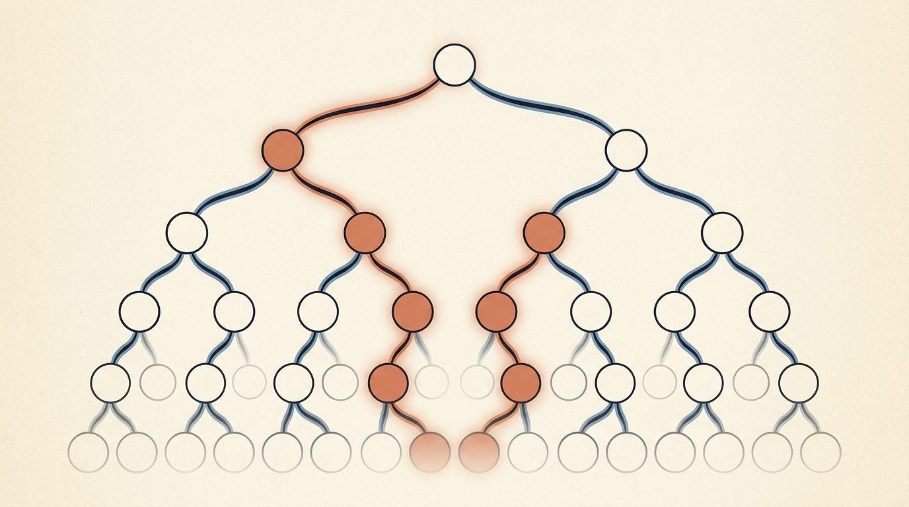
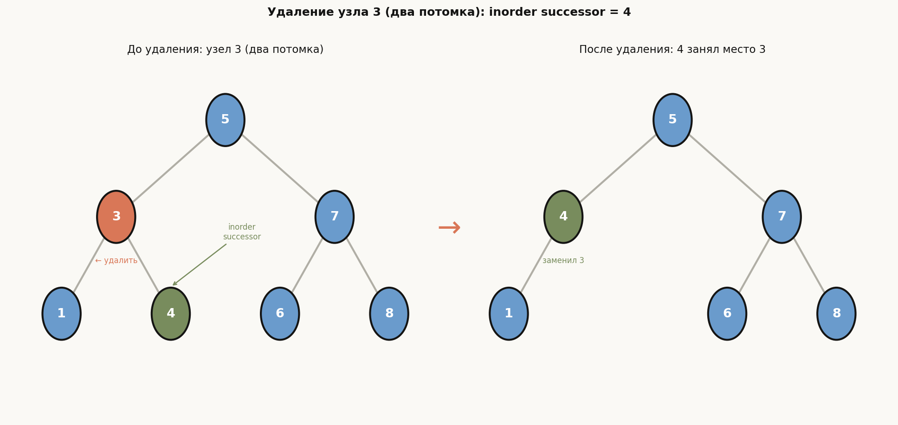
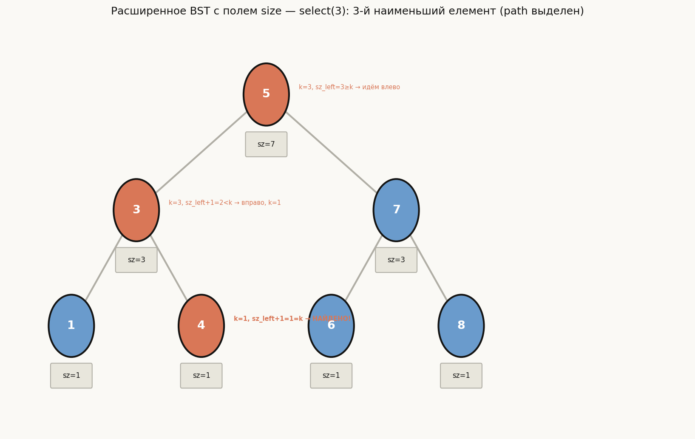

# Лекция 13: Деревья поиска и порядковые статистики в дереве



Сортировка за $O(n \log n)$ — уже знакомый инструмент. Но что если элементы поступают в онлайн-режиме, и после каждой вставки или удаления нам нужно найти $k$-й наименьший элемент? Массив здесь не поможет: каждая вставка за $O(n)$ слишком дорога. Двоичное дерево поиска (BST) решает эту задачу элегантно: все операции — поиск, вставка, удаление — выполняются за $O(h)$, где $h$ — высота дерева. Ключевой вопрос: как контролировать $h$? Ответ — сбалансированные деревья, гарантирующие $h = O(\log n)$. Наконец, добавив одно дополнительное поле `size` в каждый узел, мы получаем порядковые статистики: $k$-й наименьший и ранг произвольного элемента за $O(\log n)$. Этот материал — основа стандартных контейнеров `std::map` и `std::set`, которые используются в промышленном программировании ежедневно.

Главная линия лекции:

$$
\text{BST: поиск/вставка/удаление за } O(h) \;\to\; \text{Балансировка (AVL, RB): } h = O(\log n) \;\to\; \text{Порядковые статистики: } k\text{-й за } O(\log n)
$$

**Как читать эту лекцию:**
- Разделы 1–5: база — определение BST и все операции, включая обход; изучите с карандашом, трассируя пример на [5, 3, 7, 1, 4, 6, 8]
- Раздел 6: понять, почему без балансировки дерево вырождается — это мотивация для раздела 7
- Раздел 7: AVL-дерево достаточно понять на уровне «что делает каждая ротация», полный код реализации ротаций приведён
- Раздел 8: самый важный для ШАД — разобрать алгоритмы select и rank пошагово по примеру

---

## План

1. Двоичное дерево поиска — определение и свойства
2. Поиск в BST
3. Вставка в BST
4. Удаление из BST
5. Inorder-обход и BST-сортировка
6. Проблема вырождения и анализ высоты
7. Сбалансированные деревья поиска (AVL, Red-Black)
8. Порядковые статистики в дереве поиска
9. Типичные ошибки
10. Что важно для поступления в ШАД
11. Итог
12. Вопросы для самопроверки

---

## 1. Двоичное дерево поиска — определение и свойства

**Определение.** Двоичное дерево поиска (BST, Binary Search Tree) — это двоичное дерево, в котором для каждого узла $v$ выполняется **свойство BST**:

- все ключи в левом поддереве $v$ строго меньше ключа $v$,
- все ключи в правом поддереве $v$ строго больше ключа $v$.

Свойство распространяется рекурсивно: не только непосредственные потомки, но **все** узлы левого поддерева меньше, и **все** узлы правого поддерева больше.

**Высота дерева** $h$ — длина наидлиннейшего пути от корня до листа. Все основные операции работают за $O(h)$.

**Пример.** Вставим последовательно [5, 3, 7, 1, 4, 6, 8]:

```
        5          ← корень
      /   \
    3       7
   / \     / \
  1   4   6   8
```

Проверка свойства BST в корне: все ключи левого поддерева {1, 3, 4} < 5 < все ключи правого {6, 7, 8}. Проверьте самостоятельно для узлов 3 и 7.

![BST из [5, 3, 7, 1, 4, 6, 8]](assets/bst_tree.png)

**Структура узла на C++:**

```cpp
struct Node {
    int key;
    Node* left;
    Node* right;
    Node(int k) : key(k), left(nullptr), right(nullptr) {}
};
```

---

## 2. Поиск в BST

**Алгоритм.** Начинаем с корня. На каждом шаге:
- если узел пустой (`nullptr`) — элемент не найден;
- если `key == node->key` — найден;
- если `key < node->key` — рекурсируем в левое поддерево;
- если `key > node->key` — рекурсируем в правое поддерево.

**Сложность:** $O(h)$ — за один проход от корня до листа.

**Пример.** Ищем ключ 6 в дереве выше. Путь: 5 (6 > 5, идём вправо) → 7 (6 < 7, идём влево) → 6 (найден). Три сравнения.

```cpp
// Рекурсивный поиск
Node* search(Node* root, int key) {
    if (root == nullptr || root->key == key)
        return root;
    if (key < root->key)
        return search(root->left, key);
    return search(root->right, key);
}

// Итеративный поиск — предпочтительнее на практике
Node* searchIter(Node* root, int key) {
    while (root != nullptr && root->key != key) {
        if (key < root->key)
            root = root->left;
        else
            root = root->right;
    }
    return root;  // nullptr если не найден, иначе указатель на узел
}
```

---

## 3. Вставка в BST

**Алгоритм.** Выполняем поиск позиции для нового ключа (как в обычном поиске). Когда достигаем `nullptr` — создаём новый лист.

**Сложность:** $O(h)$.

**Пример.** Вставим 4 в дерево {5, 3, 7, 1}: 4 < 5 (влево) → 4 > 3 (вправо) → `nullptr` — создаём узел 4 как правого потомка узла 3.

```cpp
Node* insert(Node* root, int key) {
    if (root == nullptr)
        return new Node(key);  // нашли позицию — создаём лист
    if (key < root->key)
        root->left = insert(root->left, key);
    else if (key > root->key)
        root->right = insert(root->right, key);
    // key == root->key: дубликаты игнорируем (или обрабатываем иначе)
    return root;
}
```

**Важно:** порядок вставки полностью определяет структуру дерева. Вставка [5, 3, 7, 1, 4, 6, 8] даёт сбалансированное дерево высотой 2. Вставка [1, 2, 3, 4, 5, 6, 7, 8] даст вырожденное дерево высотой 7 (см. раздел 6).

---

## 4. Удаление из BST

Удаление — самая сложная операция BST. Три случая:

**Случай 1: узел — лист** (нет потомков). Просто удаляем узел, заменяем указатель на `nullptr`.

**Случай 2: один потомок**. Заменяем удаляемый узел его единственным потомком.

**Случай 3: два потомка**. Нельзя просто удалить — нарушится структура. Решение:
1. Найти **inorder successor** (симметричный преемник) — наименьший элемент в *правом* поддереве (крайний левый узел правого поддерева).
2. Заменить ключ удаляемого узла ключом inorder successor.
3. Удалить inorder successor из правого поддерева (у него не более одного потомка — правого).

**Пример.** Удаляем 3 из дерева {5, 3, 7, 1, 4, 6, 8}. Узел 3 имеет двух потомков (1 и 4). Inorder successor = 4 (левый узел в правом поддереве узла 3; у 4 нет левого потомка). Заменяем ключ 3 → 4, удаляем старый узел 4. Результат:

```
        5
      /   \
    4       7
   /       / \
  1       6   8
```



```cpp
// Вспомогательная функция: минимальный узел в поддереве
Node* minNode(Node* root) {
    while (root->left != nullptr)
        root = root->left;
    return root;
}

Node* remove(Node* root, int key) {
    if (root == nullptr) return nullptr;

    if (key < root->key)
        root->left = remove(root->left, key);
    else if (key > root->key)
        root->right = remove(root->right, key);
    else {
        // Нашли узел для удаления
        if (root->left == nullptr) {
            // Случай 1 и 2: нет левого потомка
            Node* tmp = root->right;
            delete root;
            return tmp;
        }
        if (root->right == nullptr) {
            // Случай 2: нет правого потомка
            Node* tmp = root->left;
            delete root;
            return tmp;
        }
        // Случай 3: два потомка — берём inorder successor
        Node* successor = minNode(root->right);
        root->key = successor->key;  // копируем ключ преемника
        root->right = remove(root->right, successor->key);  // удаляем преемника
    }
    return root;
}
```

---

## 5. Inorder-обход и BST-сортировка

**Определение.** Inorder-обход (симметричный обход) посещает узлы в порядке: левое поддерево → корень → правое поддерево.

**Ключевое свойство:** inorder-обход BST выдаёт элементы в **отсортированном** (возрастающем) порядке.

**Доказательство (по индукции по высоте):** Для дерева высоты 0 (один лист) — очевидно. Для произвольного дерева: по свойству BST, все элементы левого поддерева < корень < все элементы правого. Inorder-обход сначала выдаёт отсортированное левое поддерево (по индукции), затем корень, затем отсортированное правое поддерево. Объединение трёх возрастающих блоков с корнем между ними — снова возрастающая последовательность.

**Пример.** Inorder для {5, 3, 7, 1, 4, 6, 8}: 1 → 3 → 4 → 5 → 6 → 7 → 8.

**Сложность:** $O(n)$ — каждый узел посещается ровно один раз.

```cpp
#include <vector>
#include <stack>

// Рекурсивный inorder
void inorder(Node* root, std::vector<int>& result) {
    if (root == nullptr) return;
    inorder(root->left, result);
    result.push_back(root->key);
    inorder(root->right, result);
}

// Итеративный inorder (стек явный)
void inorderIter(Node* root, std::vector<int>& result) {
    std::stack<Node*> st;
    Node* curr = root;
    while (curr != nullptr || !st.empty()) {
        // Идём как можно левее
        while (curr != nullptr) {
            st.push(curr);
            curr = curr->left;
        }
        // Обрабатываем верхний узел
        curr = st.top(); st.pop();
        result.push_back(curr->key);
        // Переходим в правое поддерево
        curr = curr->right;
    }
}
```

**BST-сортировка.** Вставить $n$ элементов в BST ($O(n \log n)$ в среднем) + inorder-обход ($O(n)$) = сортировка за $O(n \log n)$ в среднем. Это эквивалентно Quick-Sort: порядок вставок определяет структуру дерева так же, как выбор пивотов в Quick-Sort.

---

## 6. Проблема вырождения и анализ высоты

**Худший случай: вырождение в список.** Если элементы вставляются в отсортированном порядке [1, 2, 3, 4, 5], BST вырождается:

```
1
 \
  2
   \
    3
     \
      4
       \
        5
```

Высота $h = n - 1$. Все операции — $O(n)$. Дерево превращается в связный список.

**Средний случай: случайные перестановки.** Если $n$ различных ключей вставляются в случайном порядке, ожидаемая высота равна $h = O(\log n)$. Точнее:

$$
\mathbb{E}[h] \approx 2 \ln n \approx 1{,}39 \log_2 n
$$

Доказательство аналогично анализу Quick-Sort: каждый элемент с одинаковой вероятностью становится «пивотом» при вставке.

**Итог:** без специальных мер высота BST не гарантирована. Для гарантии $O(\log n)$ нужна **балансировка**.

---

## 7. Сбалансированные деревья поиска

### 7.1 AVL-дерево

**Определение (Адельсон-Вельский и Ландис, 1962).** AVL-дерево — BST, в котором для каждого узла выполняется:

$$
|\text{height}(\text{left}) - \text{height}(\text{right})| \leq 1
$$

Это инвариант, который поддерживается при каждой операции вставки и удаления.

**Высота AVL-дерева:** $h = O(\log n)$. Конкретно: $h \leq 1{,}44 \log_2(n + 2) - 0{,}33$.

**Вращения (ротации)** — локальные перестройки дерева, восстанавливающие баланс без нарушения свойства BST.

**Левое вращение (Left Rotation)** вокруг узла $x$:

```
    x                y
   / \              / \
  A   y    →      x   C
     / \          / \
    B   C        A   B
```

Узел $y$ (правый потомок $x$) становится новым корнем. $x$ становится левым потомком $y$. Поддерево $B$ (левое поддерево $y$) переходит в правые потомки $x$.

**Правое вращение** — симметрично.

**Двойные вращения** используются для случаев Left-Right и Right-Left:
- Left-Right: сначала левое вращение вокруг потомка, затем правое вращение вокруг узла.
- Right-Left: сначала правое вращение вокруг потомка, затем левое вращение вокруг узла.

```cpp
struct AVLNode {
    int key, height;
    AVLNode* left;
    AVLNode* right;
    AVLNode(int k) : key(k), height(1), left(nullptr), right(nullptr) {}
};

int avlHeight(AVLNode* node) {
    return node ? node->height : 0;
}

void updateHeight(AVLNode* node) {
    if (node)
        node->height = 1 + std::max(avlHeight(node->left), avlHeight(node->right));
}

int balanceFactor(AVLNode* node) {
    return node ? avlHeight(node->left) - avlHeight(node->right) : 0;
}

// Левое вращение вокруг x
AVLNode* rotateLeft(AVLNode* x) {
    AVLNode* y  = x->right;
    AVLNode* T2 = y->left;
    y->left  = x;
    x->right = T2;
    updateHeight(x);
    updateHeight(y);
    return y;  // новый корень
}

// Правое вращение вокруг y
AVLNode* rotateRight(AVLNode* y) {
    AVLNode* x  = y->left;
    AVLNode* T2 = x->right;
    x->right = y;
    y->left  = T2;
    updateHeight(y);
    updateHeight(x);
    return x;  // новый корень
}

// Восстановление баланса после вставки/удаления
AVLNode* balance(AVLNode* node) {
    updateHeight(node);
    int bf = balanceFactor(node);

    if (bf > 1) {  // левый перевес
        if (balanceFactor(node->left) < 0)
            node->left = rotateLeft(node->left);  // Left-Right
        return rotateRight(node);
    }
    if (bf < -1) {  // правый перевес
        if (balanceFactor(node->right) > 0)
            node->right = rotateRight(node->right);  // Right-Left
        return rotateLeft(node);
    }
    return node;  // уже сбалансирован
}
```

**Вставка в AVL:** BST-вставка + вызов `balance()` на обратном пути рекурсии. Каждая вставка требует не более одного (или двойного) вращения.

### 7.2 Красно-чёрное дерево

**Красно-чёрное дерево (Red-Black Tree, RB-tree)** — самобалансирующееся BST, каждый узел которого покрашен в красный или чёрный цвет. Пять свойств гарантируют:

$$
h \leq 2 \cdot \log_2(n + 1)
$$

Это также $O(\log n)$, но с чуть большей константой, чем у AVL. Вставка/удаление требуют не более $O(\log n)$ перекрасок и не более 3 вращений.

**Применение:** `std::map` и `std::set` в стандартной библиотеке C++ реализованы на основе красно-чёрных деревьев. Используйте их вместо написания собственного BST в конкурентном программировании:

```cpp
#include <map>
#include <set>

std::set<int> s;
s.insert(5);    // O(log n)
s.erase(3);     // O(log n)
s.count(7);     // O(log n), 0 или 1
auto it = s.lower_bound(4);  // первый элемент >= 4, O(log n)
```

---

## 8. Порядковые статистики в дереве поиска

Стандартное BST умеет искать элемент по ключу, но не умеет отвечать: «какой элемент стоит $k$-м по возрастанию?». Решение — **расширенное дерево (augmented BST)**: добавим в каждый узел поле `size` — размер его поддерева.

**Инвариант:**

$$
\text{node->size} = \text{sz(node->left)} + \text{sz(node->right)} + 1
$$

где $\text{sz}(\text{nullptr}) = 0$.

**Поле `size` означает:** «сколько узлов в поддереве с корнем в данном узле».

```cpp
struct AugNode {
    int key, size;
    AugNode* left;
    AugNode* right;
    AugNode(int k) : key(k), size(1), left(nullptr), right(nullptr) {}
};

int sz(AugNode* node) {
    return node ? node->size : 0;
}

void updateSize(AugNode* node) {
    if (node)
        node->size = 1 + sz(node->left) + sz(node->right);
}

// Вставка с обновлением size
AugNode* insertAug(AugNode* root, int key) {
    if (root == nullptr) return new AugNode(key);
    if (key < root->key)
        root->left = insertAug(root->left, key);
    else if (key > root->key)
        root->right = insertAug(root->right, key);
    updateSize(root);  // обновляем на обратном пути
    return root;
}
```

### 8.1 Алгоритм Select: k-й наименьший элемент

**Идея:** в узле $v$ с полем `size`:
- в левом поддереве ровно `sz(v->left)` элементов, все меньше $v$.
- $v$ сам является `sz(v->left) + 1`-м наименьшим в своём поддереве.

**Алгоритм Select($v$, $k$)** (1-индексация):

$$
\text{Select}(v, k) =
\begin{cases}
\text{Select}(v\text{.left},\; k) & \text{если } k \leq \text{sz}(v\text{.left}) \\
v & \text{если } k = \text{sz}(v\text{.left}) + 1 \\
\text{Select}(v\text{.right},\; k - \text{sz}(v\text{.left}) - 1) & \text{если } k > \text{sz}(v\text{.left}) + 1
\end{cases}
$$

**Сложность:** $O(h) = O(\log n)$ для сбалансированного дерева.

**Пример.** Найдём 3-й наименьший в дереве {5(sz=7), 3(sz=3), 7(sz=3), 1(sz=1), 4(sz=1), 6(sz=1), 8(sz=1)}.

- Узел 5: `sz(left)=3`. $k=3 \leq 3$ → идём влево, $k=3$.
- Узел 3: `sz(left)=1`. $k=3 > 1+1=2$ → идём вправо, $k = 3-1-1=1$.
- Узел 4: `sz(left)=0`. $k=1 = 0+1$ → **найден!** Ответ: 4.



```cpp
// Select: k-й наименьший (1-индексация)
AugNode* select(AugNode* root, int k) {
    if (root == nullptr) return nullptr;
    int leftSize = sz(root->left);
    if (leftSize + 1 == k)
        return root;              // текущий узел — ответ
    if (k <= leftSize)
        return select(root->left, k);
    return select(root->right, k - leftSize - 1);
}
```

### 8.2 Алгоритм Rank: позиция элемента

**Rank($v$, key)** — порядковый номер элемента с данным ключом в отсортированном порядке (1-индексация).

**Алгоритм:**
- если `key == v->key`: ранг = `sz(v->left) + 1`
- если `key < v->key`: рекурсируем влево
- если `key > v->key`: ранг = `sz(v->left) + 1 + Rank(v->right, key)`

**Сложность:** $O(h) = O(\log n)$.

```cpp
// Rank: позиция ключа key в дереве (1-индексация)
int rank(AugNode* root, int key) {
    if (root == nullptr) return 0;
    if (key == root->key)
        return sz(root->left) + 1;
    if (key < root->key)
        return rank(root->left, key);
    return sz(root->left) + 1 + rank(root->right, key);
}
```

### 8.3 Поддержание size при удалении

При удалении узла нужно обновить `size` у всех предков: на обратном пути рекурсии вызвать `updateSize(root)`.

```cpp
AugNode* removeAug(AugNode* root, int key) {
    if (root == nullptr) return nullptr;
    if (key < root->key)
        root->left = removeAug(root->left, key);
    else if (key > root->key)
        root->right = removeAug(root->right, key);
    else {
        if (root->left == nullptr) { AugNode* tmp = root->right; delete root; return tmp; }
        if (root->right == nullptr) { AugNode* tmp = root->left; delete root; return tmp; }
        AugNode* succ = root->right;
        while (succ->left) succ = succ->left;
        root->key = succ->key;
        root->right = removeAug(root->right, succ->key);
    }
    updateSize(root);  // обязательно обновляем size на обратном пути!
    return root;
}
```

### 8.4 Применение: CountInRange

С помощью Rank легко посчитать количество элементов в диапазоне $[a, b]$:

$$
\text{CountInRange}(a, b) = \text{Rank}(b) - \text{Rank}(a) + [\text{a существует в дереве}]
$$

Или рекурсивно за $O(\log n)$, спускаясь по дереву.

---

## 9. Типичные ошибки

**Ошибка 1: проверять только прямых потомков при вставке.**
Например: «ключ 5, его левый потомок 3, правый потомок 7 — BST». Но если добавить 2 не в левое поддерево узла 3, а напрямую как правый потомок 3 равного 8 — свойство BST нарушено на уровне корня, хотя локально (вокруг узла 3) всё выглядит нормально. Всегда проверяйте инвариант для **всего поддерева**, а не только для непосредственных потомков.

**Ошибка 2: забыть случай двух потомков при удалении.**
Распространённая реализация: «если у удаляемого узла два потомка, просто удаляю его». Это ломает BST. Нужно найти inorder successor (или inorder predecessor), скопировать его ключ и удалить именно его.

**Ошибка 3: не обновлять `size` при удалении.**
В расширенном дереве легко забыть вызвать `updateSize()` на обратном пути рекурсии при удалении. В результате `size` устаревает, и `select`/`rank` дают неверные ответы. Правило: каждый раз, когда структура поддерева меняется — обновляйте `size` на пути от изменённого узла к корню.

**Ошибка 4: inorder successor — не обязательно правый потомок.**
Inorder successor — это **наименьший** узел в правом поддереве, то есть крайний левый узел правого поддерева. Если у правого потомка есть левый потомок, то inorder successor — не правый потомок, а его левый «наследник».

**Ошибка 5: ожидаемая высота O(log n) — только для случайного порядка вставок.**
Заявление «BST работает за $O(\log n)$» без уточнения — неточно. Гарантия $O(\log n)$ есть только у **сбалансированных** деревьев (AVL, RB). Для обычного BST справедливо: $O(\log n)$ **в среднем** при случайных вставках, $O(n)$ в худшем случае.

**Ошибка 6: конкурировать с `std::map` своей реализацией.**
На экзаменах и соревнованиях `std::map`/`std::set` — готовые O(log n)-структуры. Писать BST с нуля имеет смысл только когда нужно расширенное дерево (с `size`, `lazy propagation`, etc.), которого стандартная библиотека не предоставляет.

---

## 10. Что важно для поступления в ШАД

- Знать определение BST и уметь проверять, является ли данное дерево BST
- Уметь трассировать поиск, вставку и удаление (особенно случай двух потомков) вручную на конкретных примерах
- Понимать, что inorder-обход BST = отсортированная последовательность, и уметь доказать это
- Знать итеративную реализацию inorder-обхода (через явный стек)
- Объяснять разницу между ожидаемым $O(\log n)$ для случайного BST и гарантированным $O(\log n)$ для AVL/RB
- Знать принцип AVL-ротаций: понимать, что такое левое и правое вращение, и в каких случаях применяются двойные ротации
- Уметь реализовать расширенное дерево с полем `size` и алгоритмы `select` и `rank`
- Понимать, что `std::map` и `std::set` — это RB-деревья с гарантией $O(\log n)$
- Уметь оценить сложность операций как функцию высоты $h$, а затем подставить $h = O(\log n)$ для сбалансированного случая

---

## 11. Итог

Двоичное дерево поиска — фундаментальная динамическая структура данных, поддерживающая поиск, вставку и удаление за $O(h)$. Ключевая проблема — вырождение при отсортированном вводе ($h = n$); AVL-дерево решает её, поддерживая инвариант баланса через ротации и гарантируя $h = O(\log n)$. Красно-чёрные деревья используют чуть более слабый инвариант, но проще в реализации удаления — именно поэтому они лежат в основе `std::map` и `std::set`. Добавление поля `size` в каждый узел превращает BST в мощный инструмент для порядковых статистик: алгоритмы `select(k)` и `rank(x)` работают за $O(\log n)$, спускаясь по дереву и пересчитывая позицию на каждом шаге.

---

## 12. Вопросы для самопроверки

1. Является ли следующее дерево BST? Корень = 10, левый потомок = 8, правый потомок = 12, левый потомок 12 = 6. Почему нет?
2. Каков путь поиска ключа 9 в BST {5, 3, 7, 1, 4, 6, 8}? Сколько сравнений?
3. В каком порядке нужно вставить элементы [1..7], чтобы получить BST минимальной высоты?
4. Опишите все три случая удаления из BST. Что происходит, если у удаляемого узла два потомка и у его правого потомка нет левого потомка?
5. Докажите, что inorder-обход BST всегда выдаёт отсортированную последовательность.
6. Почему итеративный inorder-обход использует стек? Что хранится на стеке в каждый момент выполнения?
7. Нарисуйте вырожденный BST для входа [3, 5, 7, 9] и для входа [9, 7, 5, 3]. Какова высота каждого?
8. Что такое AVL-инвариант? Приведите пример дерева, нарушающего его, и покажите, какое вращение его восстановит.
9. В расширенном BST с `size`: чему равно `size` корня дерева из 10 узлов? Чему равно `size` листа?
10. Как работает `select(root, k)` для $k = 1$? Как для $k = \text{root.size}$? Докажите правильность без рекурсии.
11. Посчитайте ранг элемента 6 в дереве {5, 3, 7, 1, 4, 6, 8} с помощью алгоритма `rank`. Трассируйте все рекурсивные вызовы.
12. Почему в функции `removeAug` вызов `updateSize(root)` должен стоять **после** рекурсивного удаления, а не до?
