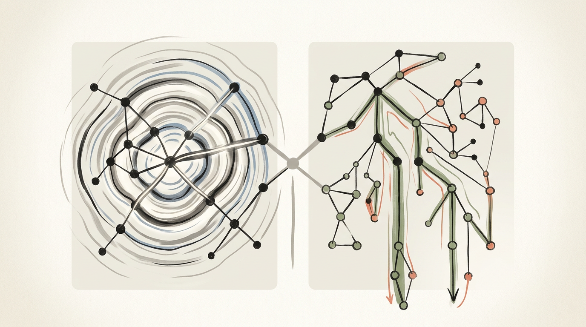
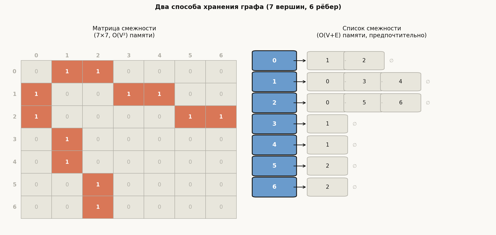
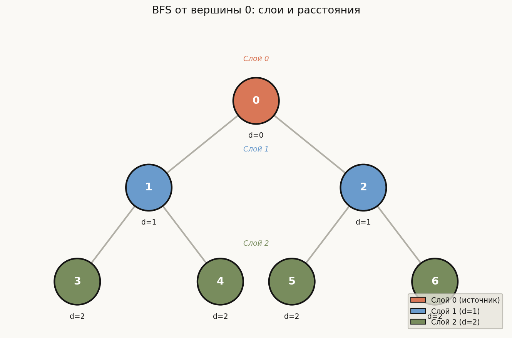
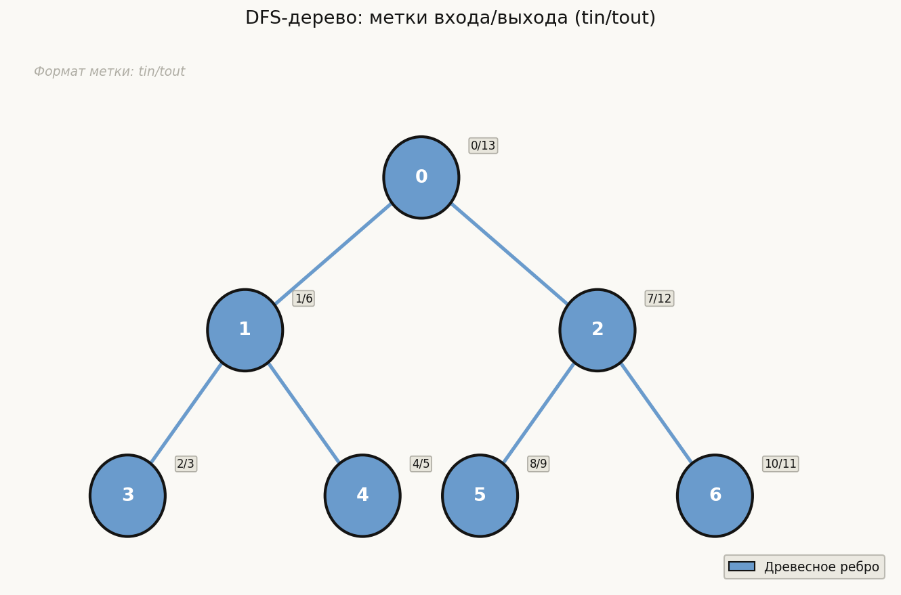
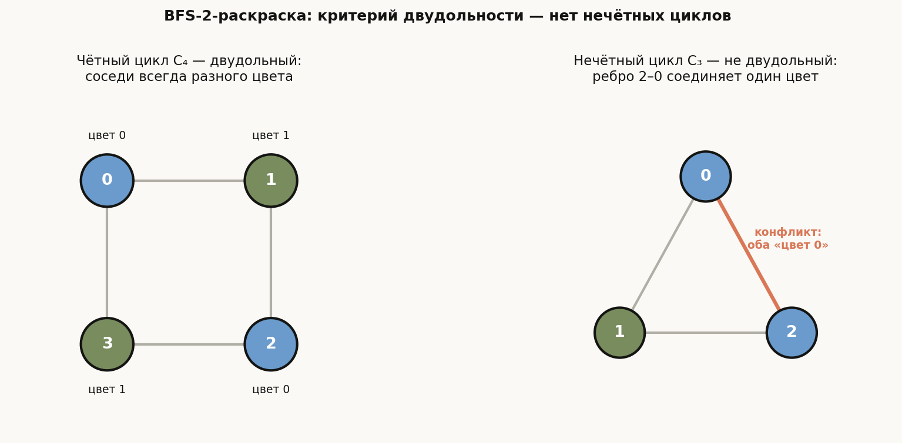

# Лекция 14: Обходы графа: BFS и DFS



Графы — универсальный язык для описания структур с отношениями: дорожные сети, зависимости задач, социальные связи, состояния вычислительного процесса. Два алгоритма обхода — BFS (обход в ширину) и DFS (обход в глубину) — образуют фундамент всей алгоритмики на графах. На их базе строятся поиск кратчайших путей, проверка двудольности, топологическая сортировка, нахождение компонент связности, мостов и точек сочленения. Без уверенного владения обоими обходами невозможно решить ни одну серьёзную задачу на графах — а таких задач в вступительном испытании ШАД всегда несколько.

**Главная линия лекции:**

$$
\text{Представление графа} \;\to\; \text{BFS (слои, кратч. путь)} \;\to\; \text{DFS (метки времени, классификация рёбер)} \;\to\; \text{Применения}
$$

**Как читать эту лекцию:**

- Разберите представление графа в памяти — оно влияет на сложность всех алгоритмов.
- Реализуйте BFS самостоятельно с нуля, проверьте на примере из раздела 2.
- Реализуйте DFS рекурсивно и итеративно, убедитесь, что метки `tin`/`tout` совпадают с примером.
- Разберите классификацию рёбер — именно она нужна для определения цикличности и топосортировки.
- Задачи из qa.md решайте сначала без подсказок.

---

## План

1. Граф — определения и представления
2. BFS — обход в ширину
3. DFS — обход в глубину
4. Временны́е метки DFS и классификация рёбер
5. Применения BFS: кратчайшие пути, компоненты связности, двудольность
6. Применения DFS: циклы, компоненты, preview топосортировки
7. Типичные ошибки
8. Что важно для поступления в ШАД
9. Итог
10. Вопросы для самопроверки

---

## 1. Граф — определения и представления

**Определение.** Граф $G = (V, E)$ состоит из множества вершин $V$ и множества рёбер $E \subseteq V \times V$.

- **Неориентированный граф:** ребро $\{u, v\}$ не имеет направления; $(u,v)$ и $(v,u)$ — одно и то же.
- **Ориентированный (directed) граф (орграф):** ребро $(u,v)$ идёт из $u$ в $v$, но не обратно.
- **Взвешенный граф:** каждому ребру сопоставлен вес $w(u,v) \in \mathbb{R}$.

**Степени вершины.** В неориентированном графе степень $\deg(v)$ — число рёбер, инцидентных $v$. В орграфе:
- $\deg^+(v)$ — out-degree (число исходящих рёбер),
- $\deg^-(v)$ — in-degree (число входящих рёбер).

**Лемма о рукопожатиях:**

$$
\sum_{v \in V} \deg(v) = 2|E|
$$

Для орграфа: $\sum_{v} \deg^+(v) = \sum_{v} \deg^-(v) = |E|$.

---

### Представления графа в памяти

**Список смежности** — массив из $n$ векторов, где `adj[u]` содержит всех соседей вершины $u$.

- Память: $O(V + E)$.
- Проверка наличия ребра $(u,v)$: $O(\deg(u))$.
- Перебор соседей вершины $u$: $O(\deg(u))$.
- **Предпочтительное представление** для разреженных графов (большинство задач ШАД).

```cpp
#include <bits/stdc++.h>
using namespace std;

int main() {
    int n, m;
    cin >> n >> m;                       // n вершин, m рёбер
    vector<vector<int>> adj(n);          // adj[u] — список соседей u (0-indexed)

    for (int i = 0; i < m; ++i) {
        int u, v;
        cin >> u >> v;
        --u; --v;                        // перевод в 0-индексацию
        adj[u].push_back(v);
        adj[v].push_back(u);             // для неориентированного; убрать для орграфа
    }
    return 0;
}
```

**Матрица смежности** — двумерный массив $A[n][n]$, где $A[u][v] = 1$ если ребро $(u,v)$ существует.

- Память: $O(V^2)$ — неприемлемо для $n > 10^4$.
- Проверка наличия ребра: $O(1)$.
- Перебор соседей: $O(V)$ даже при малой степени.
- Применяется при плотных графах ($|E| \approx V^2$) и для небольших $n$.



---

**Пример.** Граф на 7 вершинах с рёбрами: 0-1, 0-2, 1-3, 1-4, 2-5, 2-6.

Список смежности:
```
adj[0] = {1, 2}
adj[1] = {0, 3, 4}
adj[2] = {0, 5, 6}
adj[3] = {1}
adj[4] = {1}
adj[5] = {2}
adj[6] = {2}
```

Матрица смежности $7 \times 7$: единицы на позициях $(0,1),(1,0),(0,2),(2,0),\ldots$ — всё остальное нули.

---

## 2. BFS — обход в ширину

**Идея.** BFS посещает вершины в порядке возрастания расстояния от источника. Используется очередь (FIFO): сначала обрабатываем все вершины на расстоянии 1, потом на расстоянии 2 и т.д.

**Алгоритм:**

1. Поместить источник $s$ в очередь, пометить посещённым: `visited[s] = true`, `dist[s] = 0`.
2. Пока очередь не пуста:
   a. Извлечь вершину $u$.
   b. Для каждого соседа $v$ вершины $u$: если $v$ не посещён, пометить и добавить в очередь с `dist[v] = dist[u] + 1`.

**Сложность:** $O(V + E)$ по времени и памяти.

**Свойство.** BFS вычисляет **кратчайший путь** (минимальное число рёбер) от $s$ до каждой достижимой вершины в **невзвешенном** графе.

**BFS-дерево.** Ребро $(u,v)$ становится **древесным**, если $v$ впервые открыта при обработке $u$. Все не-древесные рёбра BFS-дерева соединяют вершины одного или соседних слоёв (но не прыгают через слой).

```cpp
#include <bits/stdc++.h>
using namespace std;

// BFS от источника s; заполняет массив dist[].
// dist[v] = -1 означает "недостижима".
vector<int> bfs(const vector<vector<int>>& adj, int s) {
    int n = adj.size();
    vector<int> dist(n, -1);
    queue<int> q;
    dist[s] = 0;
    q.push(s);

    while (!q.empty()) {
        int u = q.front();
        q.pop();
        for (int v : adj[u]) {
            if (dist[v] == -1) {        // v не посещена
                dist[v] = dist[u] + 1;
                q.push(v);
            }
        }
    }
    return dist;
}
```



---

**Пример.** Граф: 0-1, 0-2, 1-3, 1-4, 2-5, 2-6. BFS от вершины 0:

| Шаг | Очередь | Обрабатываем | Открываем | dist |
|-----|---------|-------------|-----------|------|
| 1 | [0] | 0 | 1(d=1), 2(d=1) | dist[0]=0 |
| 2 | [1,2] | 1 | 3(d=2), 4(d=2) | dist[1]=1 |
| 3 | [2,3,4] | 2 | 5(d=2), 6(d=2) | dist[2]=1 |
| 4 | [3,4,5,6] | 3,4,5,6 | — | dist[3..6]=2 |

Итог: `dist = [0, 1, 1, 2, 2, 2, 2]`.

---

## 3. DFS — обход в глубину

**Идея.** DFS идёт как можно глубже по текущему пути, возвращаясь только когда все соседи посещены. Реализуется рекурсией (неявный стек) или явным стеком.

**Алгоритм (рекурсивный):**

1. Пометить текущую вершину посещённой.
2. Для каждого соседа $v$: если $v$ не посещён — рекурсивно вызвать DFS($v$).

**Сложность:** $O(V + E)$.

**DFS-лес.** Если граф несвязный, DFS из одной вершины обходит только её компоненту. Чтобы обойти весь граф, запускают DFS от каждой непосещённой вершины — результат называется **DFS-лесом** (несколько деревьев).

```cpp
#include <bits/stdc++.h>
using namespace std;

// Рекурсивный DFS
void dfs(const vector<vector<int>>& adj, int u, vector<bool>& visited) {
    visited[u] = true;
    for (int v : adj[u]) {
        if (!visited[v]) {
            dfs(adj, v, visited);
        }
    }
}

// Обход всего графа (несвязный граф)
void dfs_all(const vector<vector<int>>& adj) {
    int n = adj.size();
    vector<bool> visited(n, false);
    for (int s = 0; s < n; ++s) {
        if (!visited[s]) {
            dfs(adj, s, visited);
        }
    }
}
```

```cpp
// Итеративный DFS (явный стек)
void dfs_iterative(const vector<vector<int>>& adj, int s) {
    int n = adj.size();
    vector<bool> visited(n, false);
    stack<int> st;
    st.push(s);

    while (!st.empty()) {
        int u = st.top();
        st.pop();
        if (visited[u]) continue;
        visited[u] = true;
        // Добавляем в обратном порядке, чтобы левый сосед обрабатывался первым
        for (int i = adj[u].size() - 1; i >= 0; --i) {
            int v = adj[u][i];
            if (!visited[v]) {
                st.push(v);
            }
        }
    }
}
```

**Важно:** итеративный DFS с явным стеком даёт тот же порядок посещения, что и рекурсивный, только при обратном добавлении соседей. Рекурсивный вариант удобнее для вычисления `tin`/`tout`.

---

**Пример.** DFS от вершины 0 на том же графе (0-1, 0-2, 1-3, 1-4, 2-5, 2-6):

Порядок посещения: 0 → 1 → 3 → (backtrack) → 4 → (backtrack) → (backtrack) → 2 → 5 → (backtrack) → 6.

Порядок: 0, 1, 3, 4, 2, 5, 6.

---

## 4. Временны́е метки DFS и классификация рёбер

Введём глобальный таймер `timer` и для каждой вершины $v$:

- $\text{tin}[v]$ — момент **входа** в $v$ (DFS начинает обрабатывать $v$).
- $\text{tout}[v]$ — момент **выхода** из $v$ (DFS завершает обработку $v$ и всех её потомков).

**Ключевое свойство (вложенность интервалов):**

$$
u \text{ — предок } v \;\Longleftrightarrow\; \text{tin}[u] < \text{tin}[v] < \text{tout}[v] < \text{tout}[u]
$$

Интервалы $[\text{tin}, \text{tout}]$ для двух вершин либо вложены (предок-потомок), либо не пересекаются.

```cpp
#include <bits/stdc++.h>
using namespace std;

int timer_val = 0;
vector<int> tin, tout;
vector<bool> visited;

void dfs_time(const vector<vector<int>>& adj, int u) {
    visited[u] = true;
    tin[u] = timer_val++;
    for (int v : adj[u]) {
        if (!visited[v]) {
            dfs_time(adj, v);
        }
    }
    tout[u] = timer_val++;
}

void compute_times(const vector<vector<int>>& adj) {
    int n = adj.size();
    tin.assign(n, -1);
    tout.assign(n, -1);
    visited.assign(n, false);
    timer_val = 0;
    for (int s = 0; s < n; ++s) {
        if (!visited[s]) {
            dfs_time(adj, s);
        }
    }
}
```

---

### Классификация рёбер в орграфе

При DFS в **ориентированном** графе каждое ребро $(u, v)$ принадлежит ровно одной категории:

| Тип | Условие | Значение |
|-----|---------|----------|
| **Древесное** (tree edge) | $v$ не посещена при обработке $(u,v)$ | Ребро DFS-дерева |
| **Обратное** (back edge) | $v$ — предок $u$, т.е. $v$ открыта, но не закрыта | Указывает на **цикл** |
| **Прямое** (forward edge) | $v$ — потомок $u$, уже закрыта: $\text{tin}[u] < \text{tin}[v]$ | Идёт «вниз» по дереву, но не по дереву |
| **Перекрёстное** (cross edge) | $v$ закрыта, $\text{tin}[v] < \text{tin}[u]$ | Идёт между разными поддеревьями |

$$
\text{back edge} \;\Leftrightarrow\; v \text{ посещена и } \text{tout}[v] = -1 \text{ (ещё в стеке)}
$$

Для неориентированного графа существуют только **древесные** и **обратные** рёбра.



На рисунке — DFS-дерево для графа из раздела 1 (он сам является деревом, поэтому все рёбра древесные). Возле каждой вершины метка в формате `tin/tout`: один общий таймер увеличивается и при входе, и при выходе. Проверьте свойство вложенности: интервал вершины 1 — $[1, 6]$ — целиком содержит интервалы её потомков 3 ($[2,3]$) и 4 ($[4,5]$), но не пересекается с интервалом вершины 2 — $[7, 12]$.

---

**Пример.** Орграф: 0→1, 0→2, 1→3, 3→0, 2→4. DFS от вершины 0:

```
DFS(0): tin[0]=0
  DFS(1): tin[1]=1
    DFS(3): tin[3]=2
      ребро 3→0: 0 открыта (tout=-1) → ОБРАТНОЕ (цикл!)
    tout[3]=3
  tout[1]=4
  DFS(2): tin[2]=5
    DFS(4): tin[4]=6, tout[4]=7
  tout[2]=8
tout[0]=9
```

Цикл обнаружен: 0 → 1 → 3 → 0.

---

## 5. Применения BFS

### 5.1 Кратчайший путь в невзвешенном графе

BFS от источника $s$ заполняет массив `dist[]` кратчайшими расстояниями. Для восстановления пути храним массив `parent[]`:

```cpp
#include <bits/stdc++.h>
using namespace std;

// Кратчайший путь от s до t (невзвешенный граф)
vector<int> shortest_path(const vector<vector<int>>& adj, int s, int t) {
    int n = adj.size();
    vector<int> dist(n, -1);
    vector<int> parent(n, -1);
    queue<int> q;
    dist[s] = 0;
    q.push(s);

    while (!q.empty()) {
        int u = q.front();
        q.pop();
        for (int v : adj[u]) {
            if (dist[v] == -1) {
                dist[v] = dist[u] + 1;
                parent[v] = u;
                q.push(v);
            }
        }
    }

    if (dist[t] == -1) return {};        // t недостижима
    vector<int> path;
    for (int v = t; v != -1; v = parent[v]) {
        path.push_back(v);
    }
    reverse(path.begin(), path.end());
    return path;
}
```

### 5.2 Компоненты связности

Запускаем BFS от каждой непосещённой вершины — каждый запуск открывает ровно одну компоненту:

```cpp
int count_components(const vector<vector<int>>& adj) {
    int n = adj.size();
    vector<bool> visited(n, false);
    int count = 0;
    for (int s = 0; s < n; ++s) {
        if (!visited[s]) {
            ++count;
            queue<int> q;
            q.push(s);
            visited[s] = true;
            while (!q.empty()) {
                int u = q.front(); q.pop();
                for (int v : adj[u]) {
                    if (!visited[v]) {
                        visited[v] = true;
                        q.push(v);
                    }
                }
            }
        }
    }
    return count;
}
```

### 5.3 Проверка двудольности (2-раскраска)

Граф **двудольный** если его вершины можно разбить на два множества $L$ и $R$ так, что все рёбра идут между $L$ и $R$ (ни одного ребра внутри части).

**Критерий Кёнига:** граф двудольный тогда и только тогда, когда не содержит нечётных циклов.

**Алгоритм:** BFS-2-раскраска. Красим источник в цвет 0, соседей — в цвет 1, их соседей — обратно в 0 и т.д. Если встречаем ребро между вершинами одного цвета — граф не двудольный.

```cpp
#include <bits/stdc++.h>
using namespace std;

// Возвращает true, если граф двудольный
bool is_bipartite(const vector<vector<int>>& adj) {
    int n = adj.size();
    vector<int> color(n, -1);

    for (int s = 0; s < n; ++s) {
        if (color[s] != -1) continue;    // компонента уже обработана
        queue<int> q;
        color[s] = 0;
        q.push(s);

        while (!q.empty()) {
            int u = q.front(); q.pop();
            for (int v : adj[u]) {
                if (color[v] == -1) {
                    color[v] = 1 - color[u];   // противоположный цвет
                    q.push(v);
                } else if (color[v] == color[u]) {
                    return false;              // одинаковый цвет → не двудольный
                }
            }
        }
    }
    return true;
}
```

**Пример.** Четырёхцикл 0-1-2-3-0: двудольный ($L=\{0,2\}$, $R=\{1,3\}$). Треугольник 0-1-2-0: нечётный цикл → не двудольный.



Слева — чётный цикл $C_4$: чередование цветов вдоль цикла замыкается без конфликта, все рёбра соединяют вершины разных цветов — граф двудольный. Справа — треугольник $C_3$: чередуя цвета вдоль пути $0 \to 1 \to 2$, получаем вершины 0 и 2 одного цвета, а ребро 2–0 (выделено оранжевым) их соединяет. Любая 2-раскраска нечётного цикла неизбежно даёт такое «одноцветное» ребро — именно этот конфликт обнаруживает алгоритм и возвращает `false`.

---

## 6. Применения DFS

### 6.1 Обнаружение цикла

В **орграфе** цикл существует тогда и только тогда, когда DFS обнаруживает **обратное ребро** (back edge). Признак: сосед $v$ уже открыт (`visited[v] = true`), но ещё не закрыт (`tout[v] = -1`).

В **неориентированном** графе: любое ребро к уже посещённой вершине (кроме родителя в DFS-дереве) — обратное → цикл.

```cpp
// Определение цикла в орграфе через DFS
bool has_cycle_directed(const vector<vector<int>>& adj, int u,
                        vector<int>& color) {
    // color: 0=не посещён, 1=в стеке (серый), 2=завершён (чёрный)
    color[u] = 1;
    for (int v : adj[u]) {
        if (color[v] == 1) return true;    // back edge → цикл
        if (color[v] == 0 && has_cycle_directed(adj, v, color)) return true;
    }
    color[u] = 2;
    return false;
}

bool has_cycle(const vector<vector<int>>& adj) {
    int n = adj.size();
    vector<int> color(n, 0);
    for (int s = 0; s < n; ++s) {
        if (color[s] == 0 && has_cycle_directed(adj, s, color)) return true;
    }
    return false;
}
```

### 6.2 Топологическая сортировка (preview)

В **ориентированном ациклическом графе (DAG)** топологический порядок — такой линейный порядок вершин, что для каждого ребра $(u,v)$ вершина $u$ стоит раньше $v$.

**Алгоритм через DFS:** после завершения обработки вершины добавляем её в начало результирующего списка (в стек). После обхода всего графа стек даёт топологический порядок.

```cpp
void topo_dfs(const vector<vector<int>>& adj, int u,
              vector<bool>& visited, vector<int>& order) {
    visited[u] = true;
    for (int v : adj[u]) {
        if (!visited[v]) {
            topo_dfs(adj, v, visited, order);
        }
    }
    order.push_back(u);    // добавляем после обработки всех потомков
}

vector<int> topological_sort(const vector<vector<int>>& adj) {
    int n = adj.size();
    vector<bool> visited(n, false);
    vector<int> order;
    for (int s = 0; s < n; ++s) {
        if (!visited[s]) {
            topo_dfs(adj, s, visited, order);
        }
    }
    reverse(order.begin(), order.end());
    return order;
}
```

### 6.3 Мосты и точки сочленения (preview)

DFS позволяет найти **мосты** (рёбра, удаление которых разъединяет граф) и **точки сочленения** (вершины, удаление которых разъединяет граф) за $O(V+E)$ с помощью значений `tin[v]` и функции `low[v]` — минимального `tin`, достижимого из поддерева $v$ по одному обратному ребру. Эти алгоритмы — тема следующей лекции.

---

## 7. Типичные ошибки

**1. Забыть пометить вершину как посещённую до добавления в очередь.**
Если помечать только при извлечении из очереди, одна вершина может быть добавлена несколько раз, что приведёт к $O(V \cdot E)$ вместо $O(V+E)$ и неверным расстояниям.

```cpp
// НЕПРАВИЛЬНО:
if (dist[v] == -1) {
    q.push(v);           // добавили, но не пометили!
}
// ... потом v будет добавлена ещё раз другим соседом

// ПРАВИЛЬНО:
if (dist[v] == -1) {
    dist[v] = dist[u] + 1;  // пометили сразу
    q.push(v);
}
```

**2. Использовать стек вместо очереди в BFS.**
Стек превратит BFS в DFS. Очередь (FIFO) — обязательна для BFS. В C++ используйте `std::queue`, не `std::stack`.

**3. Не учитывать несвязность графа.**
Запуская BFS или DFS от единственной вершины, можно пропустить компоненты, не связанные с источником. Всегда запускайте обход в цикле по всем вершинам.

**4. В неориентированном графе принимать ребро к родителю за обратное.**
В **неориентированном** графе при рекурсивном DFS нужно не считать обратным ребром ребро к непосредственному родителю (`parent[u]`). Но при дублировании рёбер (мультиграф) нужно передавать индекс ребра, а не номер родителя.

**5. Переполнение стека при глубокой рекурсии.**
Рекурсивный DFS на графе с $n = 10^5$ вершин создаёт стек глубиной $10^5$ и вызывает `stack overflow`. Для больших графов используйте итеративный DFS или увеличивайте размер стека (не переносимо). На соревнованиях часто нужен итеративный вариант.

**6. Неправильная классификация рёбер в неориентированном графе.**
В неориентированном графе не существует прямых и перекрёстных рёбер — только древесные и обратные. Не пытайтесь применять четырёхстороннюю классификацию к неориентированным графам.

**7. Индексация с единицы без пересчёта.**
В условии задачи вершины нумеруются с 1, а в коде массив 0-indexed — несоответствие ведёт к выходу за границы. Всегда пересчитывайте: `--u; --v;` после считывания.

---

## 8. Что важно для поступления в ШАД

- Уметь реализовать BFS с массивом `dist[]` и `parent[]` «с нуля» без заглядывания в шпаргалку.
- Уметь реализовать рекурсивный DFS с метками `tin`/`tout`; понимать, что означает вложенность интервалов.
- Знать классификацию рёбер в орграфе и уметь определить тип ребра по значениям `tin`/`tout`.
- Понимать, почему BFS даёт кратчайший путь в невзвешенном графе (аргумент через слои).
- Уметь проверить граф на двудольность через BFS-2-раскраску и объяснить критерий нечётных циклов.
- Распознать признак цикла в орграфе по обратному ребру при DFS.
- Оценивать сложность: $O(V+E)$ для обоих обходов при списке смежности.
- Знать разницу между связностью неориентированного графа и сильной связностью орграфа.
- Уметь реализовать топологическую сортировку через DFS (добавление в стек при выходе).
- Переходить от рекурсивного DFS к итеративному при угрозе переполнения стека.

---

## 9. Итог

BFS и DFS — два базовых алгоритма обхода графа, оба работающие за $O(V+E)$. BFS обходит граф слоями от источника и вычисляет кратчайшие расстояния в невзвешенных графах; его версия с 2-раскраской проверяет двудольность. DFS погружается в глубину, порождая DFS-лес с метками входа `tin` и выхода `tout`; вложенность этих интервалов позволяет классифицировать рёбра, обнаруживать циклы (по обратным рёбрам) и строить топологическую сортировку. Оба алгоритма работают как для связных, так и для несвязных графов при запуске в цикле по всем вершинам. Выбор представления графа (список смежности $O(V+E)$ против матрицы смежности $O(V^2)$) определяет реальную сложность: для разреженных графов всегда используйте список смежности.

---

## 10. Вопросы для самопроверки

1. Какова сложность BFS и DFS по времени и памяти при хранении графа в виде списка смежности? При хранении в виде матрицы смежности?

2. Почему BFS гарантирует кратчайший путь в невзвешенном графе, а DFS — нет? Приведите пример графа, где DFS найдёт неоптимальный путь.

3. Что произойдёт, если в реализации BFS помечать вершину как посещённую не при добавлении в очередь, а при извлечении из неё? Приведите конкретный граф, где это даст неверный ответ.

4. Как определить, является ли граф двудольным? Что мешает треугольнику 0-1-2-0 быть двудольным?

5. В орграфе при DFS вершина $v$ серая (открыта, но не закрыта). Вы находитесь в вершине $u$ и видите ребро $(u,v)$. Что это за тип ребра и что оно означает для структуры графа?

6. Дан граф с $n=10^6$ вершинами и $m=10^6$ рёбрами. Рекурсивный DFS вызывает `stack overflow`. Как решить проблему? Напишите схему итеративного DFS.

7. Как восстановить кратчайший путь от $s$ до $t$ после BFS? Что хранить в дополнительном массиве?

8. Как найти количество компонент связности в неориентированном графе с помощью BFS/DFS? Можно ли использовать для этого только BFS?

9. Докажите следующее свойство меток времени: вершина $u$ является предком вершины $v$ в DFS-дереве тогда и только тогда, когда $\text{tin}[u] < \text{tin}[v]$ и $\text{tout}[v] < \text{tout}[u]$.

10. Опишите алгоритм топологической сортировки DAG через DFS. Почему добавление вершины при выходе из DFS (а не при входе) даёт правильный порядок?

11. Является ли граф с рёбрами 0-1, 1-2, 2-3, 3-4, 4-0 двудольным? Проведите BFS-2-раскраску вручную.

12. Чем отличается обнаружение цикла в ориентированном и неориентированном графах через DFS? Почему в неориентированном нужно игнорировать ребро к родителю?
