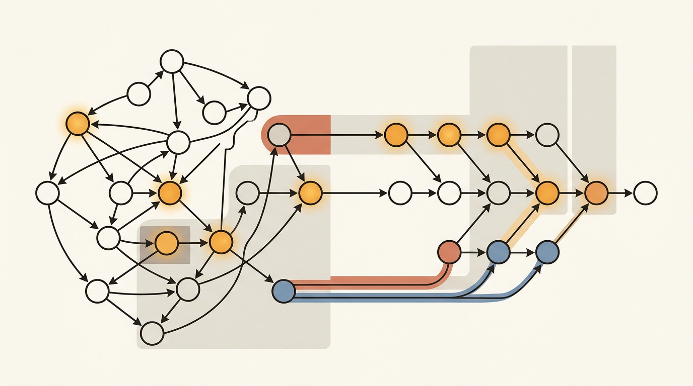
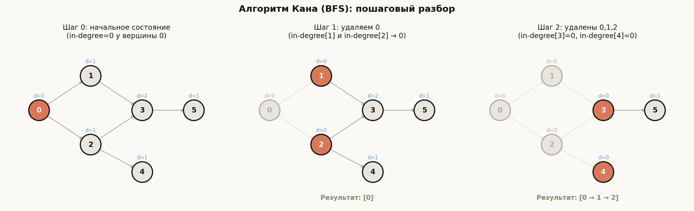
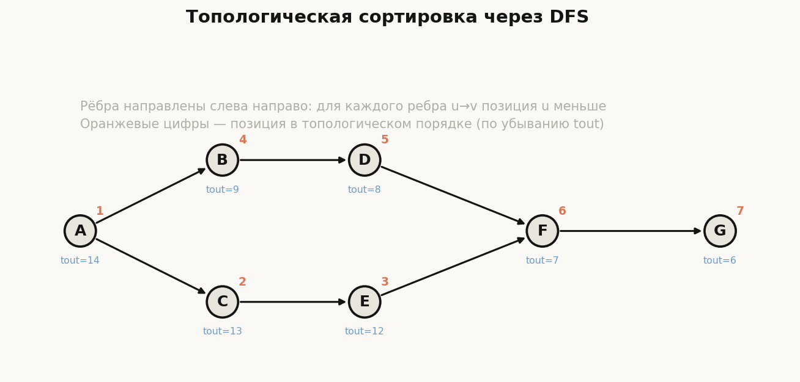
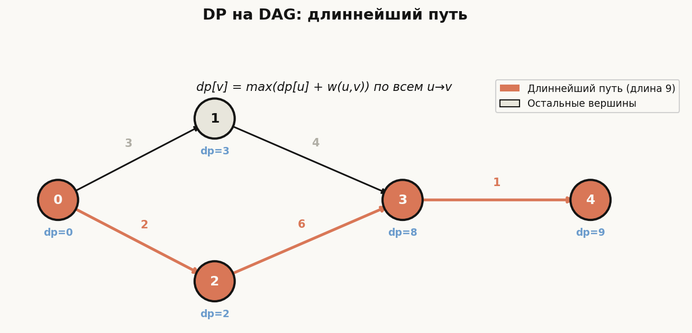

# Лекция 15: Топологическая сортировка и проверка на ацикличность



Среди всех задач на графах топологическая сортировка занимает особое место: она превращает абстрактные зависимости в конкретный порядок действий. Именно этот алгоритм стоит за системами сборки кода (make, bazel), менеджерами пакетов (apt, pip), планировщиками учебных планов и электронными таблицами. Без понимания DAG и топологического порядка невозможно грамотно рассуждать о программах с зависимостями, а динамическое программирование на DAG — один из самых мощных инструментов для задач оптимизации. В ШАД этот материал является обязательным: как самостоятельная тема и как фундамент для задач на DP и анализ графов.

Главная линия лекции:

$$
\text{DAG} \to \text{Топологический порядок (DFS / Kahn)} \to \text{DP на DAG}
$$

**Как читать эту лекцию:**
- Начните с определения DAG и убедитесь, что понимаете, почему цикл делает топологическую сортировку невозможной.
- Разберите DFS-алгоритм вместе с доказательством корректности — это основа для понимания «обратных рёбер».
- Алгоритм Кана изучите как альтернативный взгляд через степени вершин.
- Раздел о DP на DAG — практически важнейший: именно он объясняет, зачем вообще нужна топологическая сортировка.
- Пройдите все разобранные примеры вручную, прежде чем смотреть код.

---

## План

1. DAG — ориентированный ациклический граф
2. Топологическая сортировка — определение
3. Алгоритм через DFS с определением цикла
4. Алгоритм Кана (BFS-подход)
5. Доказательство корректности DFS-топологической сортировки
6. Динамическое программирование на DAG
7. Применения топологической сортировки
8. Типичные ошибки
9. Что важно для поступления в ШАД
10. Итог
11. Вопросы для самопроверки

---

## 1. DAG — ориентированный ациклический граф

**Определение.** Ориентированный граф называется *ациклическим* (DAG, Directed Acyclic Graph), если в нём нет ни одного направленного цикла — то есть нет последовательности рёбер $v_0 \to v_1 \to \cdots \to v_k = v_0$.

**Интуиция.** Представьте зависимости между задачами: задача B зависит от A, задача C зависит от B. Если при этом A зависит от C, возникает цикл — и ни одну из задач нельзя выполнить первой. DAG — это граф, в котором таких тупиков нет.

**Примеры DAG в реальной жизни:**

| Вершины | Рёбра | Смысл |
|---|---|---|
| Файлы исходного кода | A → B: файл A включает B | Граф зависимостей сборки |
| Учебные курсы | A → B: курс A — предшественник B | Учебный план |
| Пакеты Python | A → B: пакет A требует B | Разрешение зависимостей |
| Ячейки таблицы | A → B: ячейка A использует значение B | Электронные таблицы |

**Ключевое свойство.** Топологический порядок существует тогда и только тогда, когда граф является DAG.

*Доказательство необходимости.* Если в графе есть цикл $v_0 \to v_1 \to \cdots \to v_0$, то в топологическом порядке $v_0$ должна стоять до $v_1$, $v_1$ — до $v_2$, ..., а $v_{k-1}$ — до $v_0$. Противоречие — цикл замкнут.

*Доказательство достаточности.* Построительное — через DFS-алгоритм в разделе 3.

```cpp
// Пример: построение графа зависимостей курсов
// 0: Математика, 1: Алгебра, 2: Анализ, 3: Линейная алгебра, 4: Теорвер
// Ребро u -> v означает "курс u является предшественником v"
#include <vector>
int main() {
    int n = 5;
    std::vector<std::vector<int>> adj(n);
    adj[0].push_back(1); // Математика -> Алгебра
    adj[0].push_back(2); // Математика -> Анализ
    adj[1].push_back(3); // Алгебра -> Линейная алгебра
    adj[2].push_back(4); // Анализ -> Теорвер
    adj[3].push_back(4); // Линейная алгебра -> Теорвер
    // Граф не содержит цикла — это DAG
}
```

---

## 2. Топологическая сортировка — определение

**Определение.** *Топологическая сортировка* ориентированного графа — это линейный порядок всех вершин такой, что для каждого ребра $u \to v$ вершина $u$ стоит в этом порядке раньше вершины $v$.

**Формально.** Это биекция $\pi: V \to \{1, 2, \ldots, |V|\}$ такая, что для всех рёбер $(u, v) \in E$ выполняется $\pi(u) < \pi(v)$.

**Важные замечания:**
- Топологическая сортировка существует тогда и только тогда, когда граф является DAG.
- Она может быть **неединственной**: если нет ребра между вершинами $u$ и $v$, их можно расставить в любом порядке.
- У DAG с $n$ вершинами может быть от 1 до $n!$ различных топологических сортировок.

**Пример неединственности.** Граф с вершинами $\{A, B, C\}$ и ребром $A \to C$. Оба порядка $[A, B, C]$ и $[B, A, C]$ являются корректными топологическими сортировками.

$$
\text{Для ребра } u \to v: \quad \pi(u) < \pi(v)
$$

---

## 3. Алгоритм через DFS с обнаружением цикла

**Идея.** Запустим обход в глубину (DFS). Когда мы *завершаем* обработку вершины (выходим из неё), добавляем её в начало результирующего списка (или запоминаем время выхода $t_{out}$, а потом сортируем по убыванию $t_{out}$).

**Почему это работает?** Если $u \to v$ — ребро, то DFS завершит обработку $v$ раньше, чем завершит обработку $u$. Значит, $t_{out}[v] < t_{out}[u]$, и при сортировке по убыванию $u$ окажется раньше $v$. Подробное доказательство — в разделе 5.

**Обнаружение цикла.** Во время DFS каждая вершина находится в одном из трёх состояний:
- `WHITE` (0) — не посещена.
- `GRAY` (1) — посещена, но обработка ещё не завершена (находится в стеке рекурсии).
- `BLACK` (2) — обработка завершена.

Если при обходе ребра $u \to v$ мы обнаруживаем, что $v$ серая (`GRAY`), значит, мы нашли *обратное ребро* (back edge) — ребро, ведущее к предку в дереве DFS. Это означает наличие цикла.

**Сложность:** $O(V + E)$ — каждая вершина и каждое ребро обрабатываются ровно один раз.

```cpp
#include <vector>
#include <iostream>

const int WHITE = 0, GRAY = 1, BLACK = 2;

int n;
std::vector<std::vector<int>> adj;
std::vector<int> color;
std::vector<int> topo_order;
bool has_cycle;

void dfs(int v) {
    color[v] = GRAY;
    for (int to : adj[v]) {
        if (color[to] == GRAY) {
            // Обратное ребро — цикл!
            has_cycle = true;
            return;
        }
        if (color[to] == WHITE) {
            dfs(to);
            if (has_cycle) return;
        }
    }
    color[v] = BLACK;
    topo_order.push_back(v); // добавляем в конец, потом развернём
}

// Возвращает топологический порядок или пустой вектор при наличии цикла
std::vector<int> topological_sort_dfs(int num_vertices,
                                      const std::vector<std::vector<int>>& graph) {
    n = num_vertices;
    adj = graph;
    color.assign(n, WHITE);
    has_cycle = false;
    topo_order.clear();

    for (int v = 0; v < n && !has_cycle; ++v) {
        if (color[v] == WHITE) {
            dfs(v);
        }
    }

    if (has_cycle) return {};
    // Результат в обратном порядке времён выхода
    std::reverse(topo_order.begin(), topo_order.end());
    return topo_order;
}

int main() {
    // Граф зависимостей компиляции:
    // 0(main.cpp) -> 1(utils.h), 2(io.h)
    // 1(utils.h) -> 3(types.h)
    // 2(io.h) -> 3(types.h), 4(stdio.h)
    // 3(types.h) -> 5(base.h)
    int num_v = 6;
    std::vector<std::vector<int>> g(num_v);
    g[0] = {1, 2};
    g[1] = {3};
    g[2] = {3, 4};
    g[3] = {5};

    auto order = topological_sort_dfs(num_v, g);

    if (order.empty()) {
        std::cout << "Граф содержит цикл!\n";
    } else {
        std::cout << "Топологический порядок: ";
        for (int v : order) std::cout << v << " ";
        std::cout << "\n";
        // Вывод: 0 2 4 1 3 5 (один из возможных порядков)
    }
}
```

**Разбор примера.** Рассмотрим граф зависимостей компиляции с вершинами `{main.cpp, utils.h, io.h, types.h, stdio.h, base.h}` (пронумерованы 0–5):

| Шаг | Действие | Стек (серые вершины) | topo_order |
|---|---|---|---|
| 1 | dfs(0): красим в GRAY | {0} | [] |
| 2 | dfs(1): красим в GRAY | {0,1} | [] |
| 3 | dfs(3): красим в GRAY | {0,1,3} | [] |
| 4 | dfs(5): красим в GRAY | {0,1,3,5} | [] |
| 5 | Выходим из 5 → BLACK | {0,1,3} | [5] |
| 6 | Выходим из 3 → BLACK | {0,1} | [5,3] |
| 7 | Выходим из 1 → BLACK | {0} | [5,3,1] |
| 8 | dfs(2): красим в GRAY | {0,2} | [5,3,1] |
| 9 | 3 уже BLACK — пропускаем | {0,2} | [5,3,1] |
| 10 | dfs(4): → BLACK | {0,2} | [5,3,1,4] |
| 11 | Выходим из 2 → BLACK | {0} | [5,3,1,4,2] |
| 12 | Выходим из 0 → BLACK | {} | [5,3,1,4,2,0] |

После разворота: `[0, 2, 4, 1, 3, 5]` — корректный топологический порядок.

---

## 4. Алгоритм Кана (BFS-подход)

**Идея.** Вершина, у которой нет входящих рёбер (in-degree = 0), может идти первой в топологическом порядке. После её удаления некоторые другие вершины получают in-degree = 0 — их тоже можно добавить. Повторяем до конца.

**Алгоритм Кана (1962):**
1. Вычислить in-degree для каждой вершины.
2. Поместить все вершины с in-degree = 0 в очередь.
3. Пока очередь не пуста:
   - Извлечь вершину $u$, добавить в результат.
   - Для каждого соседа $v$ уменьшить in-degree[$v$] на 1.
   - Если in-degree[$v$] = 0, добавить $v$ в очередь.
4. Если результат содержит менее $V$ вершин — в графе есть цикл.

**Обнаружение цикла.** Вершины в цикле никогда не получат in-degree = 0, поэтому они не попадут в результат. Если `result.size() < n`, граф не является DAG.

**Преимущества перед DFS:**
- Проще для понимания и отладки.
- Естественно поддерживает пошаговую визуализацию.
- Легче адаптировать для лексикографически минимальной сортировки (использовать `priority_queue` вместо `queue`).

**Сложность:** $O(V + E)$.

```cpp
#include <vector>
#include <queue>
#include <iostream>

// Возвращает топологический порядок или пустой вектор при наличии цикла
std::vector<int> topological_sort_kahn(int n,
                                        const std::vector<std::vector<int>>& adj) {
    std::vector<int> in_degree(n, 0);

    // Шаг 1: подсчёт входящих степеней
    for (int u = 0; u < n; ++u)
        for (int v : adj[u])
            in_degree[v]++;

    // Шаг 2: очередь вершин с in-degree = 0
    std::queue<int> q;
    for (int v = 0; v < n; ++v)
        if (in_degree[v] == 0)
            q.push(v);

    std::vector<int> result;

    // Шаг 3: BFS-обход
    while (!q.empty()) {
        int u = q.front();
        q.pop();
        result.push_back(u);

        for (int v : adj[u]) {
            in_degree[v]--;
            if (in_degree[v] == 0)
                q.push(v);
        }
    }

    // Шаг 4: проверка на цикл
    if ((int)result.size() < n) return {};
    return result;
}

int main() {
    int n = 6;
    std::vector<std::vector<int>> adj(n);
    adj[0] = {1, 2};
    adj[1] = {3};
    adj[2] = {3, 4};
    adj[3] = {5};

    auto order = topological_sort_kahn(n, adj);

    if (order.empty()) {
        std::cout << "Граф содержит цикл!\n";
    } else {
        std::cout << "Топологический порядок (Кан): ";
        for (int v : order) std::cout << v << " ";
        std::cout << "\n";
        // Вывод: 0 1 2 3 4 5 (один из возможных)
    }
}
```

**Пошаговый разбор алгоритма Кана** на том же примере (рёбра: 0→1, 0→2, 1→3, 2→3, 2→4, 3→5; начальные in-degree = [0, 1, 1, 2, 1, 1]):

| Шаг | Извлекаем | Действие | in-degree после | Очередь после | Результат |
|---|---|---|---|---|---|
| 0 | — | в очередь попадает 0 (единственная с in-degree=0) | [0,1,1,2,1,1] | {0} | [] |
| 1 | 0 | in-deg[1]→0, in-deg[2]→0; обе в очередь | [0,0,0,2,1,1] | {1,2} | [0] |
| 2 | 1 | in-deg[3]: 2→1 (ещё не ноль) | [0,0,0,1,1,1] | {2} | [0,1] |
| 3 | 2 | in-deg[3]→0, in-deg[4]→0; обе в очередь | [0,0,0,0,0,1] | {3,4} | [0,1,2] |
| 4 | 3 | in-deg[5]→0; в очередь | [0,0,0,0,0,0] | {4,5} | [0,1,2,3] |
| 5 | 4 | исходящих рёбер нет | [0,0,0,0,0,0] | {5} | [0,1,2,3,4] |
| 6 | 5 | исходящих рёбер нет | [0,0,0,0,0,0] | {} | [0,1,2,3,4,5] |

Итоговый результат: `[0, 1, 2, 3, 4, 5]`. Обратите внимание на шаг 2: вершина 3 не добавляется в очередь, пока не обработаны **оба** её предшественника (1 и 2) — in-degree работает как счётчик невыполненных зависимостей.



На диаграмме — три состояния того же графа. Синяя метка `d=...` над вершиной — её текущий in-degree, оранжевые вершины лежат в очереди, серые уже извлечены и добавлены в результат. Видно главный механизм: удаление вершины 0 «открывает» вершины 1 и 2 (их in-degree падает до нуля), а вершина 3 становится доступной только после удаления обоих предшественников.

---

## 5. Доказательство корректности DFS-топологической сортировки

**Утверждение.** Если $u \to v$ — ребро в DAG, то $t_{out}[u] > t_{out}[v]$.

**Доказательство.** Рассмотрим момент, когда DFS обрабатывает ребро $u \to v$:

**Случай 1: вершина $v$ ещё не посещена (WHITE).** DFS входит в $v$ и полностью завершает её обработку до того, как вернётся к $u$. Следовательно, $t_{out}[v] < t_{out}[u]$. ✓

**Случай 2: вершина $v$ уже завершена (BLACK).** Тогда $t_{out}[v]$ уже присвоено, а $t_{out}[u]$ ещё нет. Значит, $t_{out}[v] < t_{out}[u]$. ✓

**Случай 3: вершина $v$ серая (GRAY).** Это означало бы, что $v$ — предок $u$ в дереве DFS, то есть существует путь $v \to \cdots \to u$. Вместе с ребром $u \to v$ это образует цикл. Но мы работаем с DAG — противоречие. Случай 3 невозможен в DAG.

**Следствие.** Сортировка вершин по убыванию $t_{out}$ даёт корректный топологический порядок: для каждого ребра $u \to v$ имеем $t_{out}[u] > t_{out}[v]$, то есть $u$ стоит раньше $v$. $\blacksquare$

$$
u \to v \implies t_{out}[u] > t_{out}[v] \implies u \text{ стоит раньше } v
$$



На рисунке — DAG из 7 вершин после DFS из вершины $A$ (соседи перебираются в алфавитном порядке). Синие метки — времена выхода $t_{out}$, оранжевые цифры — позиция вершины в топологическом порядке, полученном сортировкой по убыванию $t_{out}$: $A(14), C(13), E(12), B(9), D(8), F(7), G(6)$. Проверьте утверждение теоремы на любом ребре: например, для $D \to F$ имеем $t_{out}[D] = 8 > 7 = t_{out}[F]$, поэтому $D$ стоит раньше $F$. Заметьте: вершина $C$ получает позицию 2, хотя DFS зашёл в неё позже, чем в $B$, — важен именно момент **выхода**, а не входа.

---

## 6. Динамическое программирование на DAG

**Зачем нужна топологическая сортировка для DP?** При вычислении $dp[v]$ нам нужны значения $dp[u]$ для всех предшественников $u$ вершины $v$. Если обрабатывать вершины в топологическом порядке, каждый предшественник уже обработан к моменту вычисления $dp[v]$.

**Задача: длиннейший путь в DAG.**

$$
dp[v] = \max_{u \to v} \bigl(dp[u] + w(u, v)\bigr)
$$

Для вершин-истоков (без входящих рёбер): $dp[v] = 0$.

Ответ: $\max_v dp[v]$.

**Почему это нельзя решить для произвольного графа?** В общем ориентированном графе с циклами длиннейший путь не определён (путь может быть бесконечным). В DAG — всегда конечен.

**Сложность:** $O(V + E)$ — один проход по топологическому порядку.

```cpp
#include <vector>
#include <algorithm>
#include <iostream>

// Используем топологическую сортировку из раздела 4 (Кан)
std::vector<int> topological_sort_kahn(int n,
                                        const std::vector<std::vector<std::pair<int,int>>>& adj) {
    std::vector<int> in_degree(n, 0);
    for (int u = 0; u < n; ++u)
        for (auto [v, w] : adj[u])
            in_degree[v]++;

    std::queue<int> q;
    for (int v = 0; v < n; ++v)
        if (in_degree[v] == 0)
            q.push(v);

    std::vector<int> order;
    while (!q.empty()) {
        int u = q.front(); q.pop();
        order.push_back(u);
        for (auto [v, w] : adj[u]) {
            if (--in_degree[v] == 0)
                q.push(v);
        }
    }
    return order;
}

int longest_path_dag(int n,
                     const std::vector<std::vector<std::pair<int,int>>>& adj) {
    auto order = topological_sort_kahn(n, adj);

    std::vector<int> dp(n, 0);  // dp[v] = длина длиннейшего пути до v

    for (int u : order) {
        for (auto [v, w] : adj[u]) {
            dp[v] = std::max(dp[v], dp[u] + w);
        }
    }

    return *std::max_element(dp.begin(), dp.end());
}

int main() {
    // DAG: 0->1(w=3), 0->2(w=2), 1->3(w=4), 2->3(w=6), 3->4(w=1)
    // Длиннейший путь: 0->2->3->4 с длиной 2+6+1 = 9
    int n = 5;
    std::vector<std::vector<std::pair<int,int>>> adj(n);
    adj[0] = {{1,3}, {2,2}};
    adj[1] = {{3,4}};
    adj[2] = {{3,6}};
    adj[3] = {{4,1}};

    std::cout << "Длиннейший путь: " << longest_path_dag(n, adj) << "\n";
    // Вывод: 9
}
```



Это граф из примера в коде выше. Под каждой вершиной — итоговое значение $dp[v]$: длина длиннейшего пути, заканчивающегося в $v$. Порядок вычисления топологический: $dp[0]=0$ (исток), $dp[1] = 0+3 = 3$, $dp[2] = 0+2 = 2$, затем $dp[3] = \max(dp[1]+4,\; dp[2]+6) = \max(7, 8) = 8$ — максимум берётся по **всем** входящим рёбрам, и к этому моменту оба предшественника уже посчитаны. Наконец $dp[4] = 8+1 = 9$. Оранжевым выделен сам оптимальный путь $0 \to 2 \to 3 \to 4$; его можно восстановить, идя от вершины с максимальным $dp$ назад по рёбрам, на которых достигался максимум.
- Кратчайший путь с отрицательными весами (Bellman-Ford не нужен!).
- Количество путей из источника в сток.
- Количество путей длины ровно $k$.
- Максимальный независимый набор вершин.

---

## 7. Применения топологической сортировки

**Системы сборки.** `make`, `bazel`, `cmake` строят граф зависимостей между файлами и задачами, затем выполняют их в топологическом порядке. Если обнаружен цикл — сборка завершается с ошибкой «circular dependency».

**Разрешение зависимостей пакетов.** `apt`, `pip`, `npm` при установке пакета строят топологический порядок его зависимостей. Установка идёт от листьев к корню — сначала пакеты без зависимостей.

**Учебные планы и расписание.** Университетские курсы с prerequisite-отношениями образуют DAG. Топологическая сортировка даёт корректный порядок прохождения курсов.

**Вычисление в электронных таблицах.** Ячейки, зависящие от других ячеек, образуют граф. Excel/Google Sheets вычисляет значения в топологическом порядке и выдаёт ошибку `#REF!` при обнаружении цикла.

**Моделирование событий.** В симуляциях «событие A должно произойти до B» задаёт DAG. Топологический порядок гарантирует корректную последовательность моделирования.

**Компиляция выражений.** Компиляторы используют DAG для представления промежуточного кода (IR). Топологическая сортировка определяет порядок вычисления подвыражений.

---

## 8. Типичные ошибки

**Ошибка 1: Запуск топологической сортировки на неориентированном графе.**
В неориентированном графе каждое ребро является одновременно «прямым» и «обратным», поэтому DFS всегда найдёт «цикл». Топологическая сортировка определена только для ориентированных графов.

```cpp
// НЕВЕРНО: попытка топо-сортировки неориентированного графа
// Если adj[u] содержит v и adj[v] содержит u — это не цикл DAG,
// а неориентированное ребро. Нужно различать тип графа.
```

**Ошибка 2: Добавление вершины в результат при входе, а не при выходе из DFS.**
Распространённое заблуждение — добавлять вершину в топологический порядок, когда мы её *посещаем*, а не когда *завершаем* обработку. Корректно: добавление происходит в момент выхода (после обработки всех соседей).

```cpp
// НЕВЕРНО:
void dfs(int v) {
    visited[v] = true;
    topo_order.push_back(v); // Добавляем при ВХОДЕ — ошибка!
    for (int to : adj[v]) {
        if (!visited[to]) dfs(to);
    }
}

// ВЕРНО:
void dfs(int v) {
    visited[v] = true;
    for (int to : adj[v]) {
        if (!visited[to]) dfs(to);
    }
    topo_order.push_back(v); // Добавляем при ВЫХОДЕ
}
```

**Ошибка 3: Забыть развернуть список после DFS.**
DFS добавляет вершины в порядке *убывания* времени выхода (последняя завершённая — первая в списке). Для получения топологического порядка список нужно развернуть (`std::reverse`), или заранее вставлять в начало (`push_front` / `deque`).

**Ошибка 4: Не проверять наличие цикла в алгоритме Кана.**
Алгоритм Кана завершится корректно даже при наличии цикла — просто вернёт неполный результат. Необходимо проверить, что `result.size() == n`. Это частая ошибка при реализации.

```cpp
// Не забыть проверить!
if ((int)result.size() < n) {
    // Граф содержит цикл — result некорректен
}
```

**Ошибка 5: Применение DP до топологической сортировки.**
Если вычислять $dp[v]$ в произвольном порядке, а не в топологическом, значение $dp[u]$ для предшественника $u$ вершины $v$ может быть ещё не вычислено. Результат будет неверным.

**Ошибка 6: Использование `bool visited[]` вместо трёхцветной раскраски.**
При обнаружении цикла простой флаг `visited` недостаточен: вершина с `visited=true` могла уже завершить обработку (BLACK) или всё ещё находиться в стеке (GRAY). Только GRAY-вершина при повторном посещении означает цикл. Ошибочное использование `visited` даст ложные срабатывания.

---

## 9. Что важно для поступления в ШАД

**Ключевые знания и умения:**

- **Определения.** Точно определить DAG, топологический порядок, back edge. Объяснить, почему топологическая сортировка невозможна при наличии цикла.

- **Оба алгоритма.** Уметь реализовать DFS-подход и алгоритм Кана, знать разницу в принципах их работы. На экзамене могут спросить любой из них.

- **Доказательство корректности.** Разобрать три случая для ребра $u \to v$ в DFS — это стандартный вопрос на понимание алгоритмов.

- **DP на DAG.** Уметь записать рекуррентность и объяснить, почему топологический порядок гарантирует корректность. Задачи на длиннейший/кратчайший путь в DAG очень популярны.

- **Сложность.** $O(V + E)$ для обоих алгоритмов — уметь обосновать.

- **Практические задачи.** Задачи типа «определить, является ли граф DAG», «найти порядок выполнения задач», «найти длиннейший путь» встречаются в заданиях ШАД и Codeforces.

**Типичные вопросы на собеседовании:**
- Чем DAG отличается от произвольного ориентированного графа?
- Почему DFS добавляет вершины в обратном порядке?
- Что означает back edge и как его обнаружить?
- Как модифицировать алгоритм Кана для вывода лексикографически минимальной топологической сортировки?
- Как подсчитать количество различных топологических сортировок?

---

## 10. Итог

Топологическая сортировка — фундаментальный алгоритм для работы с ориентированными ациклическими графами. Два основных подхода — DFS с фиксацией времён выхода и алгоритм Кана через BFS — дают одинаковый результат за время $O(V + E)$, но с разными преимуществами: DFS естественно обнаруживает back edges, а Кан проще для понимания и визуализации.

Главная практическая ценность топологической сортировки — она превращает DAG в линейный порядок, при котором каждый предшественник вершины уже обработан. Это открывает путь к эффективному динамическому программированию: задачи о длиннейших и кратчайших путях, подсчёт путей, оптимизация на DAG — все они решаются за $O(V + E)$ благодаря топологическому порядку. Понимание этих алгоритмов необходимо как для поступления в ШАД, так и для решения широкого класса задач в программировании.

---

## 11. Вопросы для самопроверки

1. Может ли ориентированный граф без петель содержать цикл? Приведите пример или объясните, почему нет.

2. Граф задан рёбрами: $1 \to 2$, $2 \to 3$, $3 \to 1$, $1 \to 4$. Является ли он DAG? Обоснуйте ответ.

3. Нарисуйте DAG с 5 вершинами, у которого ровно 3 различные топологические сортировки. Перечислите их.

4. Объясните разницу между WHITE/GRAY/BLACK вершинами в DFS. Почему для обнаружения цикла достаточно проверять только GRAY-вершины?

5. Алгоритм Кана вернул список из 4 вершин для графа из 6 вершин. Что это означает? Сколько вершин участвует в цикле (минимум)?

6. Докажите, что если $u \to v$ — ребро в DAG, то в DFS-дереве не может быть ситуации, когда $v$ серая (GRAY) при обходе из $u$.

7. Как модифицировать алгоритм Кана, чтобы он возвращал лексикографически минимальную топологическую сортировку? Какова сложность модифицированного алгоритма?

8. DAG с $n$ вершинами и $n-1$ рёбрами, образующий цепь $1 \to 2 \to \cdots \to n$. Сколько у него топологических сортировок? А если к этой цепи добавить ребро $1 \to n$?

9. Напишите алгоритм подсчёта числа путей от вершины $s$ до вершины $t$ в DAG. Какова его сложность?

10. Объясните, почему алгоритм Беллмана-Форда не нужен для нахождения кратчайшего пути в DAG с отрицательными весами рёбер. Напишите альтернативный $O(V+E)$ алгоритм.

11. Граф зависимостей пакетов содержит цикл. Что сделает `pip install` в такой ситуации? Как обнаружение цикла реализовано в реальных менеджерах пакетов?

12. Докажите, что у любого DAG с $n > 0$ вершинами существует хотя бы одна вершина с in-degree = 0 (исток). Как это утверждение используется в алгоритме Кана?
