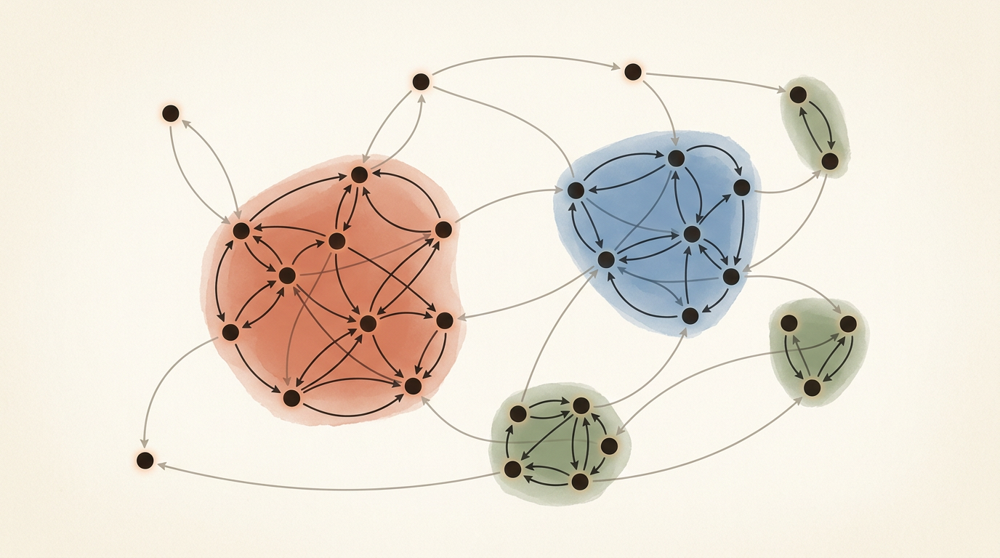

# Лекция 16: Сильно связные компоненты



Направленные графы повсюду: зависимости между модулями, гиперссылки в вебе, транзакции в базе данных. Ключевой вопрос — **какие вершины образуют замкнутые группы взаимодостижимости?** Сильно связные компоненты (SCC) дают ответ: это максимальные множества вершин, между любыми двумя из которых существует путь в обоих направлениях. Сжав каждую SCC в одну «суперпершину», мы получаем конденсацию — DAG, с которым работать принципиально проще. На вступительных экзаменах ШАД SCC появляются в задачах на 2-SAT, обнаружение циклов и анализ достижимости в орграфах.

Главная линия лекции:

$$
\text{Орграф } G \;\to\; \text{Нахождение SCC (Косарайю / Тарьян)} \;\to\; \text{Конденсация (DAG)} \;\to\; \text{Топологический порядок конденсации}
$$

**Как читать эту лекцию:**
- Сначала разберитесь с определением сильной связности и мысленно проверьте его на маленьких примерах.
- Изучите алгоритм Косарайю: он интуитивен и удобен для первого знакомства.
- Затем переходите к Тарьяну: один проход DFS, чуть сложнее, но без реверсирования графа.
- После каждого алгоритма самостоятельно прогоните трассировку на графе из 8 вершин из раздела примеров.
- Раздел «Применения» читайте как мотивацию: 2-SAT — одна из любимых тем ШАД.

---

## План

1. Сильная связность
2. Конденсация графа
3. Алгоритм Косарайю
4. Алгоритм Тарьяна
5. Сравнение алгоритмов
6. Конденсация и топологический порядок
7. Применения
8. Типичные ошибки
9. Что важно для поступления в ШАД
10. Итог
11. Вопросы для самопроверки

---

## 1. Сильная связность

**Определение.** Вершина $v$ *достижима* из вершины $u$ в орграфе $G$, если существует путь $u \to \cdots \to v$.

**Определение.** Вершины $u$ и $v$ называются *сильно связными* ($u \sim v$), если $u$ достижима из $v$ И $v$ достижима из $u$.

Отношение $\sim$ является отношением эквивалентности:
- *рефлексивность*: $u \sim u$ (тривиальный цикл длины 0),
- *симметричность*: $u \sim v \Rightarrow v \sim u$,
- *транзитивность*: $u \sim v,\; v \sim w \Rightarrow u \sim w$.

**Определение.** *Сильно связная компонента (SCC)* — класс эквивалентности по отношению $\sim$.

Иными словами, SCC — это максимальное по включению множество вершин $S$ такое, что для любых $u, v \in S$ существует путь $u \to v$ И путь $v \to u$.

**Важные факты:**
- Каждая вершина принадлежит ровно одной SCC.
- SCC, состоящая из одной вершины без петли — *тривиальная SCC*.
- Цикл $v_1 \to v_2 \to \cdots \to v_k \to v_1$ гарантирует, что все $v_i$ принадлежат одной SCC.

**Пример для разбора.** Рассмотрим орграф на 8 вершинах:

```
Рёбра: 0→1, 1→2, 2→0,   (SCC A = {0,1,2})
       3→1, 3→2, 4→3,
       4→5, 5→4,          (SCC B = {4,5})
       6→7, 7→6,          (SCC C = {6,7})
       2→3, 5→6, 3→6
```

Вершина 3 достижима из SCC A (через $2 \to 3$), но из вершины 3 нет пути обратно в 0, 1 или 2. Значит, вершина 3 — отдельная тривиальная SCC D = {3}.

Итого: **4 компоненты** — A={0,1,2}, B={4,5}, C={6,7}, D={3}.

---

## 2. Конденсация графа

**Определение.** *Конденсация* $G^{SCC}$ орграфа $G$ — это граф, в котором:
- Каждый узел соответствует одной SCC орграфа $G$.
- Ребро $SCC_i \to SCC_j$ существует тогда и только тогда, когда $i \neq j$ и в $G$ есть хотя бы одно ребро $u \to v$ с $u \in SCC_i$, $v \in SCC_j$.

**Теорема.** Конденсация любого орграфа — это DAG (directed acyclic graph, ориентированный ациклический граф).

*Доказательство.* Предположим, в конденсации есть цикл $SCC_i \to \cdots \to SCC_j \to \cdots \to SCC_i$. Тогда из любой вершины $SCC_i$ достижима любая вершина $SCC_j$ и обратно — они должны быть в одной SCC. Противоречие с максимальностью.

**Зачем это нужно?**
- Задачи достижимости в орграфе сводятся к задачам на DAG.
- DAG допускает топологическую сортировку — можно обрабатывать компоненты в порядке зависимостей.
- 2-SAT сводится к нахождению SCC и проверке достижимости в конденсации.

Для нашего примера конденсация:

$$
D(=\{3\}) \;\to\; A(=\{0,1,2\}) \;\gets\; \text{нет},\quad A \to D \to B \to C
$$

Точнее: A → D → B → C (DAG из 4 узлов).

---

## 3. Алгоритм Косарайю

**Идея.** Два прохода DFS. Сложность $O(V + E)$.

**Интуиция.** Если в исходном графе $G$ вершина $u$ может достичь $v$, то в транспонированном (обращённом) графе $G^T$ вершина $v$ может достичь $u$. SCCs симметричны при транспонировании: они те же самые множества вершин. Обходя $G^T$ в порядке убывания времени завершения из $G$, мы «подхватываем» ровно одну SCC за один DFS.

**Алгоритм:**

1. **Проход 1:** Запустить DFS на $G$. При *выходе* из вершины — добавить её в стек `order`.
2. **Проход 2:** Построить $G^T$ (транспонированный граф). Последовательно брать вершины из `order` (с вершины стека). Если вершина не посещена — запустить DFS на $G^T$; все вершины, достигнутые из неё — одна SCC.

**Трассировка на примере (8 вершин):**

Рёбра $G$: 0→1, 1→2, 2→0, 3→1, 3→2, 4→3, 4→5, 5→4, 6→7, 7→6, 2→3, 5→6, 3→6.

Проход 1 (DFS по $G$, стартуем из 0, потом 3, потом 4, 6 по порядку):
- DFS(0): 0→1→2→0 (цикл), tout: 2=1, 1=2, 0=3; затем из 2 идём в 3, из 3 в 6, из 6 в 7...
- Порядок завершения (стек снизу вверх): 7, 6, 3, 2, 1, 0, 5, 4 (порядок может варьироваться)
- Упрощённо: сначала завершаются «внутренние», потом «внешние».

Проход 2 (DFS по $G^T$):
- Берём вершину 4 (с вершины стека): DFS(4) в $G^T$ находит {4, 5} → SCC B.
- Берём вершину 0: DFS(0) в $G^T$ находит {0, 1, 2} → SCC A.
- Берём вершину 3: DFS(3) в $G^T$ находит {3} → SCC D.
- Берём вершину 6: DFS(6) в $G^T$ находит {6, 7} → SCC C.

**Реализация на C++:**

```cpp
#include <bits/stdc++.h>
using namespace std;

const int MAXN = 100005;
vector<int> g[MAXN];   // исходный граф
vector<int> gt[MAXN];  // транспонированный граф
bool visited[MAXN];
int comp[MAXN];        // номер SCC для каждой вершины
vector<int> order;     // порядок по убыванию tout

void dfs1(int v) {
    visited[v] = true;
    for (int u : g[v]) {
        if (!visited[u]) dfs1(u);
    }
    order.push_back(v); // добавляем при выходе
}

void dfs2(int v, int c) {
    comp[v] = c;
    for (int u : gt[v]) {
        if (comp[u] == -1) dfs2(u, c);
    }
}

int main() {
    ios::sync_with_stdio(false);
    cin.tie(nullptr);

    int n, m;
    cin >> n >> m;

    for (int i = 0; i < m; i++) {
        int u, v;
        cin >> u >> v;
        g[u].push_back(v);
        gt[v].push_back(u); // ребро в транспонированном графе
    }

    // Проход 1: DFS на G
    fill(visited, visited + n, false);
    for (int i = 0; i < n; i++) {
        if (!visited[i]) dfs1(i);
    }

    // Проход 2: DFS на G^T в порядке убывания tout
    fill(comp, comp + n, -1);
    int num_scc = 0;
    for (int i = n - 1; i >= 0; i--) {
        int v = order[i];
        if (comp[v] == -1) {
            dfs2(v, num_scc++);
        }
    }

    cout << "Number of SCCs: " << num_scc << "\n";
    for (int i = 0; i < n; i++) {
        cout << "Vertex " << i << " -> SCC " << comp[i] << "\n";
    }

    return 0;
}
```

**Корректность.** Ключевое наблюдение: SCC с наибольшим $t_{out}$ (корень последнего дерева DFS в проходе 1) является «источником» в конденсации. В $G^T$ из неё нет исходящих рёбер в другие SCC, поэтому DFS в $G^T$ из этой вершины не «убежит» в чужую компоненту.

---

## 4. Алгоритм Тарьяна

**Идея.** Один проход DFS. Сложность $O(V + E)$.

**Ключевые понятия:**
- $disc[v]$ — время входа в вершину $v$ (discovery time).
- $low[v]$ — минимальное значение $disc$, достижимое из поддерева $v$ через одно «нестандартное» ребро (обратное или перекрёстное в DFS-дереве, ведущее к вершине на стеке).
- **Стек:** активные вершины текущего пути DFS.
- $onStack[v]$ — флаг: вершина $v$ на стеке.

**Обновление $low[v]$:**
- При переходе по дереву $v \to u$: после рекурсии $low[v] = \min(low[v], low[u])$.
- При обнаружении ребра $v \to u$, где $u$ уже на стеке: $low[v] = \min(low[v], disc[u])$.

**Условие корня SCC:** вершина $v$ является *корнем* SCC, если после обработки всех её соседей $low[v] = disc[v]$. В этот момент выталкиваем вершины со стека до $v$ включительно — они образуют одну SCC.

**Трассировка на том же графе (выборочно):**

Стартуем из вершины 0:
- `dfs(0)`: disc[0]=0, low[0]=0, стек=[0]
  - `dfs(1)`: disc[1]=1, low[1]=1, стек=[0,1]
    - `dfs(2)`: disc[2]=2, low[2]=2, стек=[0,1,2]
      - ребро 2→0: 0 на стеке → low[2]=min(2,0)=0
      - ребро 2→3: переходим по дереву
        - `dfs(3)`: disc[3]=3, low[3]=3, стек=[0,1,2,3]
          - ребро 3→1: 1 на стеке → low[3]=min(3,1)=1
          - ... (обработали всех соседей)
          - low[3]=1 ≠ disc[3]=3 → не корень
        - low[2]=min(0,low[3])=min(0,1)=0
      - low[2]=0 ≠ disc[2]=2 → не корень
    - low[1]=min(1,low[2])=min(1,0)=0
    - low[1]=0 ≠ disc[1]=1 → не корень
  - low[0]=min(0,low[1])=0
  - low[0]=0 == disc[0]=0 → **корень SCC!** Выталкиваем: 3, 2, 1, 0

Стоп — в этом месте важен порядок. Вершина 3 уже «связана» с остальными через low, но её SCC определяется именно моментом pop'а. В нашем примере вершина 3 уходит в {0,1,2,3}? Нет — зависит от конкретного порядка обхода. Давайте скорректируем: при правильном порядке обхода SCC {0,1,2} и {3} разделятся, потому что у вершины 3 нет обратного пути к {0,1,2}.

**Полная реализация на C++:**

```cpp
#include <bits/stdc++.h>
using namespace std;

const int MAXN = 100005;
vector<int> g[MAXN];
int disc[MAXN], low[MAXN], comp[MAXN];
bool onStack[MAXN];
stack<int> stk;
int timer_val = 0, num_scc = 0;

void dfs(int v) {
    disc[v] = low[v] = timer_val++;
    stk.push(v);
    onStack[v] = true;

    for (int u : g[v]) {
        if (disc[u] == -1) {
            // Ребро дерева
            dfs(u);
            low[v] = min(low[v], low[u]);
        } else if (onStack[u]) {
            // Обратное ребро или перекрёстное к стековой вершине
            low[v] = min(low[v], disc[u]);
        }
    }

    // Проверяем, является ли v корнем SCC
    if (low[v] == disc[v]) {
        while (true) {
            int u = stk.top();
            stk.pop();
            onStack[u] = false;
            comp[u] = num_scc;
            if (u == v) break;
        }
        num_scc++;
    }
}

int main() {
    ios::sync_with_stdio(false);
    cin.tie(nullptr);

    int n, m;
    cin >> n >> m;

    for (int i = 0; i < m; i++) {
        int u, v;
        cin >> u >> v;
        g[u].push_back(v);
    }

    fill(disc, disc + n, -1);
    fill(comp, comp + n, -1);
    fill(onStack, onStack + n, false);

    for (int i = 0; i < n; i++) {
        if (disc[i] == -1) dfs(i);
    }

    cout << "Number of SCCs: " << num_scc << "\n";
    for (int i = 0; i < n; i++) {
        cout << "Vertex " << i << " -> SCC " << comp[i] << "\n";
    }

    return 0;
}
```

**Важная деталь:** в алгоритме Тарьяна используется $disc[u]$, а не $low[u]$, при обновлении через ребро к вершине на стеке. Использование $low[u]$ в этом месте дало бы неверный результат (это частая ошибка!).

---

## 5. Сравнение алгоритмов

| Характеристика | Косарайю | Тарьян |
|---|---|---|
| Проходов DFS | 2 | 1 |
| Нужен обращённый граф | Да | Нет |
| Память (доп.) | $O(V)$ стек, $O(V+E)$ для $G^T$ | $O(V)$ стек |
| Сложность | $O(V+E)$ | $O(V+E)$ |
| Простота реализации | Выше | Чуть ниже (сложнее low[]) |
| Порядок SCC | «Источники» последними | «Стоки» первыми (по порядку нумерации) |

**Когда что выбирать:**
- Для обучения и понимания — **Косарайю**: две независимые DFS, логика прозрачна.
- Для практики (конкурсы, когда важна компактность) — **Тарьян**: один проход.
- Если граф задан неявно или нельзя хранить обращённый — **Тарьян**.

---

## 6. Конденсация и топологический порядок

После нахождения SCC строим конденсацию и применяем топологическую сортировку.

**Алгоритм построения конденсации:**
1. Найти SCC (любым методом), пронумеровать их 0, 1, ..., k-1.
2. Для каждого ребра $u \to v$ исходного графа: если $comp[u] \neq comp[v]$, добавить ребро $comp[u] \to comp[v]$ в конденсацию (дедуплицировать).
3. Применить топологическую сортировку (BFS/Kahn или DFS) к конденсации.

**Полный C++ код:**

```cpp
#include <bits/stdc++.h>
using namespace std;

// --- Нахождение SCC (Тарьян) ---
vector<int> g[100005];
int disc[100005], low[100005], comp[100005];
bool onStack[100005];
stack<int> stk;
int timer_val = 0, num_scc = 0;

void dfs(int v) {
    disc[v] = low[v] = timer_val++;
    stk.push(v);
    onStack[v] = true;
    for (int u : g[v]) {
        if (disc[u] == -1) {
            dfs(u);
            low[v] = min(low[v], low[u]);
        } else if (onStack[u]) {
            low[v] = min(low[v], disc[u]);
        }
    }
    if (low[v] == disc[v]) {
        while (true) {
            int u = stk.top(); stk.pop();
            onStack[u] = false;
            comp[u] = num_scc;
            if (u == v) break;
        }
        num_scc++;
    }
}

// --- Топологическая сортировка конденсации (алгоритм Кана) ---
void build_and_toposort(int n) {
    // Построение конденсации
    set<pair<int,int>> cond_edges_set;
    for (int v = 0; v < n; v++) {
        for (int u : g[v]) {
            if (comp[v] != comp[u]) {
                cond_edges_set.insert({comp[v], comp[u]});
            }
        }
    }

    vector<vector<int>> dag(num_scc);
    vector<int> indegree(num_scc, 0);
    for (auto [a, b] : cond_edges_set) {
        dag[a].push_back(b);
        indegree[b]++;
    }

    // Алгоритм Кана (BFS)
    queue<int> q;
    for (int i = 0; i < num_scc; i++) {
        if (indegree[i] == 0) q.push(i);
    }

    vector<int> topo_order;
    while (!q.empty()) {
        int v = q.front(); q.pop();
        topo_order.push_back(v);
        for (int u : dag[v]) {
            if (--indegree[u] == 0) q.push(u);
        }
    }

    cout << "Topological order of condensation:\n";
    for (int c : topo_order) cout << c << " ";
    cout << "\n";
}

int main() {
    ios::sync_with_stdio(false);
    cin.tie(nullptr);

    int n, m;
    cin >> n >> m;
    for (int i = 0; i < m; i++) {
        int u, v; cin >> u >> v;
        g[u].push_back(v);
    }

    fill(disc, disc + n, -1);
    fill(comp, comp + n, -1);
    fill(onStack, onStack + n, false);
    for (int i = 0; i < n; i++) {
        if (disc[i] == -1) dfs(i);
    }

    build_and_toposort(n);
    return 0;
}
```

**Топологический порядок конденсации для нашего примера:**
- SCC: A={0,1,2}=0, D={3}=1, B={4,5}=2, C={6,7}=3
- Рёбра DAG: 0→1, 1→2, 2→3 (A→D→B→C — нет, нужно проверить, что B→C действительно есть ребро 5→6)
- Топологический порядок: A, D, B, C (или B перед A, если нет ребра A→B напрямую; зависит от конкретного графа)

---

## 7. Применения

### 7.1. Задача 2-SAT

Дано булевское выражение в конъюнктивной нормальной форме (КНФ), каждая клауза содержит ровно 2 литерала:

$$
(x_1 \lor \lnot x_2) \land (\lnot x_1 \lor x_3) \land (x_2 \lor x_3)
$$

**Редукция к SCC:**
- Для каждой переменной $x_i$ создать 2 вершины: $x_i$ и $\lnot x_i$.
- Клаузу $(a \lor b)$ заменить двумя импликациями: $\lnot a \to b$ и $\lnot b \to a$.
- Найти SCC в полученном графе.
- Если для какой-то переменной $x_i$ и $\lnot x_i$ попали в одну SCC — решения нет.
- Иначе: $x_i = \text{true}$, если в топологическом порядке конденсации $\lnot x_i$ идёт раньше $x_i$.

### 7.2. Обнаружение дедлоков

В системе процессов ребро $P_i \to R_j$ означает «$P_i$ ждёт ресурс $R_j$». SCC размера > 1 означает дедлок.

### 7.3. Анализ веб-графа

Вершины-страницы, рёбра-гиперссылки. SCC — «ядро» веба (giant strongly connected component). Применяется в алгоритмах ранжирования (PageRank).

### 7.4. Оптимизация запросов в СУБД

Зависимости между транзакциями — если есть SCC размера > 1, возможен deadlock транзакций.

---

## 8. Типичные ошибки

1. **Использование $low[u]$ вместо $disc[u]$ при обновлении через стековую вершину (Тарьян).**
   При ребре $v \to u$, где $u$ уже на стеке, правильно писать `low[v] = min(low[v], disc[u])`. Если написать `low[v] = min(low[v], low[u])`, то несколько независимых SCC могут слиться в одну — это классический источник WA.

2. **Игнорирование изолированных вершин при запуске DFS.**
   Нужно запускать DFS из каждой непосещённой вершины, иначе изолированные вершины (тривиальные SCC) будут пропущены.

3. **Некорректная проверка «вершина на стеке» в Тарьяне.**
   Вершина может быть уже посещена (disc != -1), но не на стеке (уже вытолкнута как часть другой SCC). Обновление $low[]$ через такую вершину ошибочно. Обязательно проверять флаг `onStack[u]`.

4. **Забывание дедупликации рёбер конденсации.**
   Если между двумя SCC несколько рёбер — в конденсации должно быть одно. Без дедупликации степени входа считаются неверно, топологическая сортировка ломается.

5. **Переполнение стека при рекурсивной DFS на больших графах.**
   При $n \sim 10^5$ и цепочечном графе глубина рекурсии достигает $10^5$. Решение: итеративная DFS или увеличение стека (`ulimit -s unlimited` / явный стек в коде).

6. **Неправильный порядок проходов в Косарайю.**
   Порядок второго прохода — строго от последнего завершённого в первом проходе к первому. Часто путают направление итерации по вектору `order`.

---

## 9. Что важно для поступления в ШАД

- **Уметь объяснить корректность алгоритма Косарайю:** почему именно обращённый граф и порядок по убыванию $t_{out}$?
- **Знать отличие $disc$ от $low$ в Тарьяне:** уметь вручную проследить изменение $low[]$ на маленьком примере.
- **Понимать, что конденсация всегда DAG** и уметь строить её за $O(V+E)$.
- **2-SAT через SCC** — одна из самых частых прикладных задач. Нужно уметь строить импликационный граф и интерпретировать результат.
- **Сложность $O(V+E)$** — оба алгоритма линейные. На экзамене могут спросить, почему.
- **Итеративная DFS:** в задачах с $n \sim 10^6$ рекурсивная DFS упадёт по стеку. Знайте, как написать итеративную версию.
- **Топологический порядок конденсации:** умейте определить источники и стоки конденсации — это нужно для задач на 2-SAT и достижимость.

---

## 10. Итог

Сильно связные компоненты разбивают орграф на максимальные «замкнутые» подграфы, внутри которых все вершины взаимодостижимы. Два классических алгоритма — Косарайю (два обхода DFS) и Тарьян (один обход DFS) — оба работают за $O(V+E)$ и гарантированно находят все SCC. Сжимая SCC в суперпершины, мы получаем конденсацию — DAG, который допускает топологическую сортировку и значительно упрощает задачи на достижимость.

Практическая ценность SCC выходит далеко за пределы теоретических задач: 2-SAT, обнаружение дедлоков, анализ веб-графа — везде в основе лежит нахождение сильно связных компонент. Именно поэтому этот алгоритм занимает центральное место как в академическом курсе алгоритмов, так и в задачах вступительного экзамена ШАД.

---

## 11. Вопросы для самопроверки

1. Дан орграф: $0 \to 1$, $1 \to 2$, $2 \to 1$, $0 \to 3$. Найдите все SCC. Какова конденсация?

2. Почему конденсация любого орграфа является DAG? Докажите от противного.

3. Объясните, почему в алгоритме Косарайю мы используем именно обращённый граф $G^T$ для второго прохода, а не снова $G$.

4. В алгоритме Тарьяна при обновлении $low[v]$ через ребро $v \to u$: почему мы берём $disc[u]$, а не $low[u]$, когда $u$ на стеке? Придумайте контрпример, где использование $low[u]$ даёт неверный ответ.

5. Напишите псевдокод итеративной версии DFS для алгоритма Тарьяна.

6. Граф задан матрицей смежности $n \times n$. Какова сложность нахождения SCC? Можно ли обойтись без транспонирования?

7. Как 2-SAT сводится к задаче нахождения SCC? Запишите импликационный граф для формулы $(x_1 \lor x_2) \land (\lnot x_1 \lor x_3) \land (\lnot x_2 \lor \lnot x_3)$.

8. Сколько SCC может быть в турнире (полном ориентированном графе на $n$ вершинах)? Что можно сказать о структуре конденсации турнира?

9. Вершину называют «мостовой», если её удаление увеличивает число SCC. Верно ли, что любая вершина с $\deg_{out} = 0$ в конденсации — «мостовая»? Обоснуйте.

10. Дан орграф с $n = 10^6$ вершинами. Какую реализацию DFS вы выберете и почему? Какие оптимизации памяти важны при таком $n$?

11. Могут ли два разных запуска алгоритма Тарьяна на одном графе (с разными порядками перебора вершин) дать разные номера SCC? Разные составы SCC?

12. Как определить «источники» и «стоки» конденсации без явного построения конденсационного DAG, используя только массив $comp[]$ и список рёбер исходного графа?
