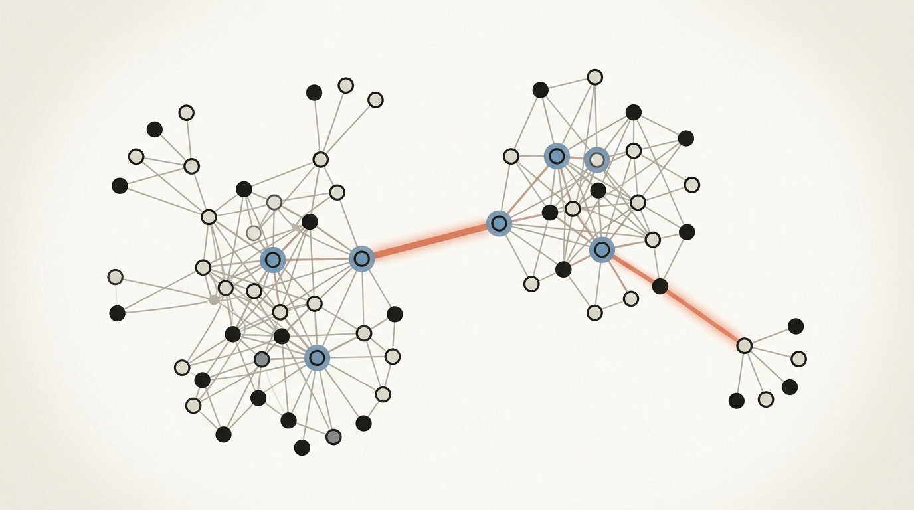
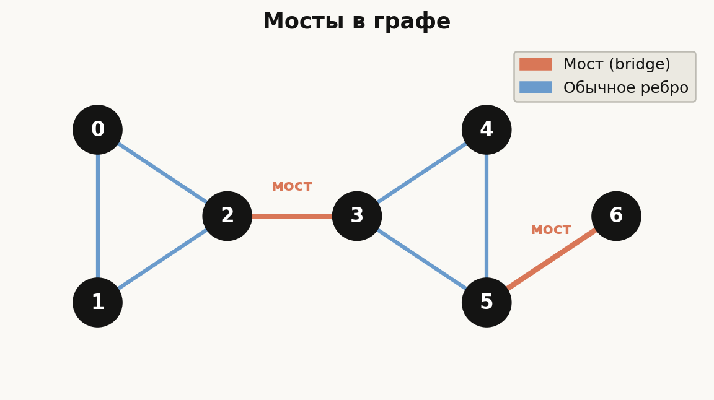
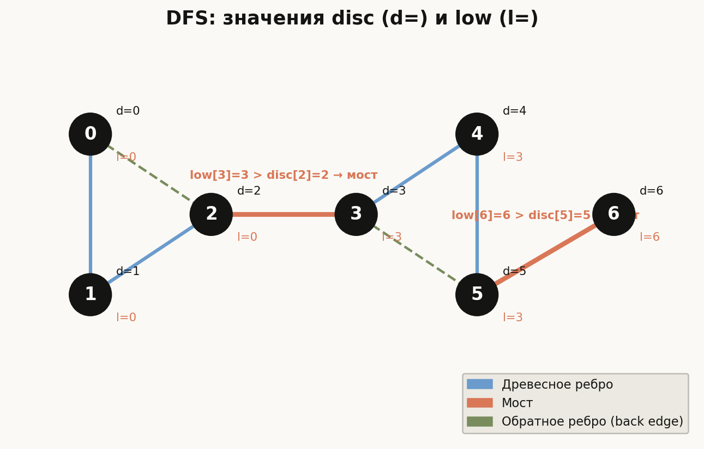
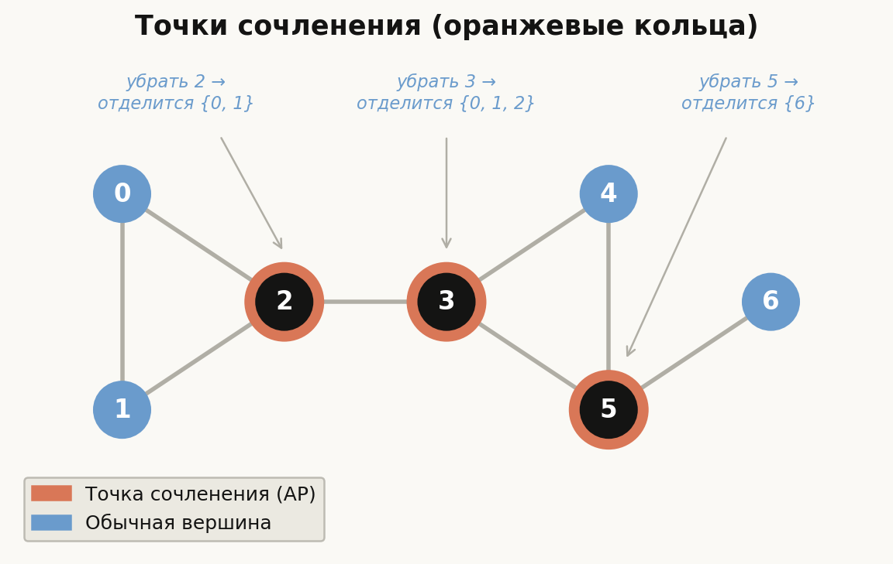
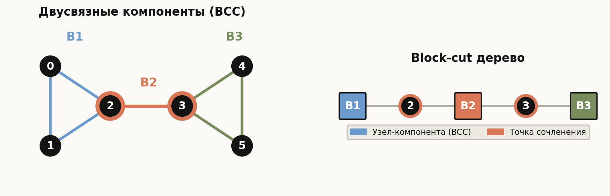

# Лекция 17: Мосты и точки сочленения



Представьте телекоммуникационную сеть из сотен серверов. Один кабель выходит из строя — и часть сети отказывает. Один узел перегревается — и трафик перераспределить некуда. Вопрос «где самое слабое место системы?» — это и есть вопрос о мостах и точках сочленения. **Мост** — ребро, удаление которого увеличивает число связных компонент. **Точка сочленения** — вершина, удаление которой делает то же самое. Оба объекта находятся за один проход поиска в глубину (DFS) с помощью алгоритма Тарьяна, и именно этот алгоритм ШАД проверяет в задачах на надёжность сетей, анализ дорог и двусвязность. Лекция опирается на базовый DFS из Лекции 14 и конденсацию графа из Лекции 16.

Главная линия лекции:

$$
\text{Граф } G \;\to\; \text{DFS: } \mathit{disc}[\,],\, \mathit{low}[\,] \;\to\; \text{Мосты} \;\to\; \text{Точки сочленения} \;\to\; \text{Двусвязные компоненты}
$$

**Как читать эту лекцию:**
- Начните с Раздела 1 — убедитесь, что интуиция понятия «убрать ребро/вершину» кристально ясна.
- Раздел 2 — ключевое: выучите формулу для $\mathit{low}[v]$ как мантру перед тем, как читать алгоритм.
- Разделы 3–4 содержат полный C++-код; прогоните трассировку вручную на примере из 6 вершин.
- Раздел 5 (двусвязные компоненты) — более продвинутый материал, читайте после освоения основ.
- Раздел «Типичные ошибки» обязателен: именно там прячутся баги в задачах ШАД.

---

## План

1. Определения
2. Ключевое наблюдение: времена обнаружения и функция low
3. Мосты — алгоритм
4. Точки сочленения — алгоритм
5. Двусвязные компоненты
6. Практические применения
7. Типичные ошибки
8. Что важно для поступления в ШАД
9. Итог
10. Вопросы для самопроверки

---

## 1. Определения

**Определение (мост).** Ребро $(u, v)$ неориентированного связного графа $G = (V, E)$ называется *мостом*, если граф $G' = (V, E \setminus \{(u,v)\})$ несвязен, то есть число связных компонент увеличивается.

**Определение (точка сочленения).** Вершина $v$ называется *точкой сочленения* (или *шарниром*, *cut vertex*), если граф $G' = (V \setminus \{v\},\, E \setminus \{\text{рёбра, инцидентные } v\})$ несвязен.

**Интуиция.** Мост — «критический канал связи»: потеря единственного пути. Точка сочленения — «критический узел»: вся связность зависит от него.

**Важные факты:**
- Граф без мостов не обязательно двусвязен (граф может содержать точки сочленения).
- Конец моста является точкой сочленения тогда и только тогда, когда его степень не меньше 2. Висячая вершина моста ничего не «держит»: в графе $K_2$ из одного ребра мост есть, а точек сочленения нет.
- Точка сочленения необязательно является концом моста: она может «держать» несколько циклов.

**Пример.** Рассмотрим граф:

```
0 — 1
|   |
2 — 3 — 4
        |
        5 — 6
```

Рёбра: {0-1, 0-2, 1-3, 2-3, 3-4, 4-5, 5-6}.

- Мосты: {3-4}, {4-5}, {5-6} — каждое из этих рёбер единственное, оно соединяет свои части графа.
- Точки сочленения: 3, 4, 5 — удаление любой из них отсоединит хвост.
- Рёбра {0-1, 0-2, 1-3, 2-3} образуют цикл, потому ни одно из них не является мостом.



Ещё один пример — граф, который станет сквозным для всей лекции: треугольник $\{0,1,2\}$, треугольник $\{3,4,5\}$, ребро $2$–$3$ между ними и висячая вершина $6$, подвешенная к $5$. Оранжевым выделены оба моста: ребро $2$–$3$ (единственная «перемычка» между треугольниками) и ребро $5$–$6$ (единственный путь к висячей вершине). Синие рёбра лежат на циклах: удаление любого из них оставляет обходной путь по своему треугольнику, поэтому мостами они не являются.

---

## 2. Ключевое наблюдение: времена обнаружения и функция low

Оба алгоритма (мосты и точки сочленения) выполняются за **один DFS** с помощью двух массивов.

**$\mathit{disc}[v]$** — время обнаружения вершины $v$ в DFS (глобальный счётчик, увеличивается при каждом входе в новую вершину).

**$\mathit{low}[v]$** — минимальное время обнаружения, достижимое из поддерева DFS-дерева с корнем в $v$ через не более чем одно *обратное ребро* (back edge).

$$
\mathit{low}[v] = \min\!\Bigl(
    \mathit{disc}[v],\;
    \min_{(v,w)\text{ — обратное}} \mathit{disc}[w],\;
    \min_{(v,c)\text{ — древесное}} \mathit{low}[c]
\Bigr)
$$

**Физический смысл:** $\mathit{low}[v]$ показывает, насколько «высоко» (к корню DFS-дерева) может подняться вершина $v$ и всё её поддерево, используя обратные рёбра. Если $\mathit{low}[v]$ мало — поддерево хорошо «привязано» к предкам в обход стандартных рёбер.

**Трассировка на примере.** Граф: вершины 0..5, рёбра {0-1, 1-2, 2-0, 2-3, 3-4, 4-5, 5-3}.

DFS от вершины 0 (один из возможных порядков):

```
Входим в 0: disc[0]=0, low[0]=0
  Входим в 1: disc[1]=1, low[1]=1
    Входим в 2: disc[2]=2, low[2]=2
      Видим обратное ребро (2,0): low[2] = min(2, disc[0]) = 0
      Входим в 3: disc[3]=3, low[3]=3
        Входим в 4: disc[4]=4, low[4]=4
          Входим в 5: disc[5]=5, low[5]=5
            Видим обратное ребро (5,3): low[5] = min(5, disc[3]) = 3
          Выход из 5: low[4] = min(4, low[5]) = 3
        Выход из 4: low[3] = min(3, low[4]) = 3
      Выход из 3: low[2] = min(0, low[3]) = 0
    Выход из 2: low[1] = min(1, low[2]) = 0
  Выход из 1: low[0] = min(0, low[1]) = 0
```

Итог:

| Вершина | disc | low |
|---------|------|-----|
| 0 | 0 | 0 |
| 1 | 1 | 0 |
| 2 | 2 | 0 |
| 3 | 3 | 3 |
| 4 | 4 | 3 |
| 5 | 5 | 3 |

Заметим: $\mathit{low}[3] = 3 = \mathit{disc}[3]$, то есть вершина 3 и её поддерево не «видят» вершины выше 3 — отсюда ребро (2,3) будет мостом.

Ещё одна тонкость формулы: для обратного ребра $(v, w)$ берётся именно $\mathit{disc}[w]$, а не $\mathit{low}[w]$. Обратное ребро даёт гарантированный путь только *в саму* вершину $w$, а не туда, куда «умеет подниматься» $w$: путь из $w$ в $\mathit{low}[w]$ может проходить через само поддерево $v$ — и тогда после удаления ребра он исчезнет. Подробнее — в разделе «Типичные ошибки».



На рисунке — тот же граф, дополненный висячей вершиной 6 (ребро 5–6). У каждой вершины подписаны два числа: $d$ — время обнаружения $\mathit{disc}$, $l$ — значение $\mathit{low}$. Зелёные пунктирные стрелки — обратные рёбра (2→0 и 5→3): именно они «протаскивают» маленькие значения $\mathit{disc}$ вниз по поддереву, поэтому $\mathit{low}$ вершин 1 и 2 равно 0, а вершин 4 и 5 равно 3. Оранжевым выделены рёбра, для которых критерий $\mathit{low}[v] > \mathit{disc}[u]$ выполняется, — это и есть мосты (2,3) и (5,6).

---

## 3. Мосты — алгоритм

**Критерий.** Ребро $(u, v)$ (где $v$ — ребёнок $u$ в DFS-дереве) является мостом тогда и только тогда, когда:

$$
\mathit{low}[v] > \mathit{disc}[u]
$$

**Смысл:** поддерево $v$ не имеет обратных рёбер, ведущих к $u$ или его предкам. Единственный путь из поддерева $v$ наружу — через ребро $(u, v)$.

**Реализация на C++:**

```cpp
#include <bits/stdc++.h>
using namespace std;

const int MAXN = 1e5 + 5;
vector<int> adj[MAXN];
int disc[MAXN], low[MAXN], timer_val = 0;
bool visited[MAXN];
vector<pair<int,int>> bridges;

void dfs(int u, int parent) {
    visited[u] = true;
    disc[u] = low[u] = timer_val++;

    for (int v : adj[u]) {
        if (!visited[v]) {
            // Древесное ребро
            dfs(v, u);
            low[u] = min(low[u], low[v]);

            // Критерий моста
            if (low[v] > disc[u]) {
                bridges.push_back({u, v});
            }
        } else if (v != parent) {
            // Обратное ребро (не родительское)
            low[u] = min(low[u], disc[v]);
        }
    }
}

int main() {
    int n, m;
    cin >> n >> m;
    for (int i = 0; i < m; i++) {
        int u, v;
        cin >> u >> v;
        adj[u].push_back(v);
        adj[v].push_back(u);
    }
    for (int i = 0; i < n; i++) {
        if (!visited[i]) dfs(i, -1);
    }
    cout << "Bridges:\n";
    for (auto [u, v] : bridges) {
        cout << u << " - " << v << "\n";
    }
}
```

**Трассировка поиска мостов.** На примере {0-1, 1-2, 2-0, 2-3, 3-4, 4-5, 5-3}:

- Ребро (1, 2): $\mathit{low}[2] = 0 \leq \mathit{disc}[1] = 1$ — **не мост**.
- Ребро (2, 3): $\mathit{low}[3] = 3 > \mathit{disc}[2] = 2$ — **мост!**
- Ребро (3, 4): $\mathit{low}[4] = 3 \leq \mathit{disc}[3] = 3$ — **не мост**.
- Ребро (4, 5): $\mathit{low}[5] = 3 \leq \mathit{disc}[4] = 4$ — **не мост**.

Единственный мост: **{2–3}**. Это соответствует интуиции: удаление ребра 2–3 отделяет треугольник {3,4,5} от треугольника {0,1,2}.

**Кратные рёбра.** Если между $u$ и $v$ несколько рёбер, то «обратным» считается лишь второе и последующие, а не родительское. Правильная обработка: хранить индекс ребра и передавать его в DFS, проверять `edge_id != parent_edge_id`.

---

## 4. Точки сочленения — алгоритм

Удаление вершины $u$ разбивает граф тогда, когда хотя бы один «ребёнок» $u$ в DFS-дереве не имеет пути обратно «выше» $u$ через обратные рёбра.

**Критерий (два случая):**

**Случай 1 (корень DFS-дерева).** Корень $r$ является точкой сочленения тогда и только тогда, когда он имеет $\geq 2$ дочерних вершин в DFS-дереве.

**Случай 2 (не корень).** Вершина $u$ (не корень) является точкой сочленения тогда и только тогда, когда существует дочерняя вершина $v$ такая, что:

$$
\mathit{low}[v] \geq \mathit{disc}[u]
$$

**Смысл:** поддерево $v$ не может обойти $u$ через обратные рёбра. Заметьте: для мостов условие строгое ($>$), для точек сочленения — нестрогое ($\geq$): даже если $\mathit{low}[v] = \mathit{disc}[u]$, единственная «точка входа» в поддерево $v$ снаружи — это $u$ (через $u$ и обратное ребро к $u$, а не к предку $u$).

**Реализация на C++ (расширение кода из раздела 3):**

```cpp
#include <bits/stdc++.h>
using namespace std;

const int MAXN = 1e5 + 5;
vector<int> adj[MAXN];
int disc[MAXN], low[MAXN], timer_val = 0;
bool visited[MAXN], is_ap[MAXN];
vector<pair<int,int>> bridges;

void dfs(int u, int parent) {
    visited[u] = true;
    disc[u] = low[u] = timer_val++;
    int children = 0;

    for (int v : adj[u]) {
        if (!visited[v]) {
            children++;
            dfs(v, u);
            low[u] = min(low[u], low[v]);

            // Мост
            if (low[v] > disc[u]) {
                bridges.push_back({u, v});
            }
            // Точка сочленения (не корень)
            if (parent != -1 && low[v] >= disc[u]) {
                is_ap[u] = true;
            }
        } else if (v != parent) {
            low[u] = min(low[u], disc[v]);
        }
    }
    // Точка сочленения (корень)
    if (parent == -1 && children >= 2) {
        is_ap[u] = true;
    }
}

int main() {
    int n, m;
    cin >> n >> m;
    for (int i = 0; i < m; i++) {
        int u, v;
        cin >> u >> v;
        adj[u].push_back(v);
        adj[v].push_back(u);
    }
    for (int i = 0; i < n; i++) {
        if (!visited[i]) dfs(i, -1);
    }
    cout << "Articulation points: ";
    for (int i = 0; i < n; i++) {
        if (is_ap[i]) cout << i << " ";
    }
    cout << "\nBridges:\n";
    for (auto [u, v] : bridges) cout << u << " - " << v << "\n";
}
```

**Трассировка поиска точек сочленения.** На примере {0-1, 1-2, 2-0, 2-3, 3-4, 4-5, 5-3}:

- Вершина 0: корень, children=1 → **не точка сочленения**.
- Вершина 2: parent=1, ребёнок 3, $\mathit{low}[3]=3 \geq \mathit{disc}[2]=2$ → **точка сочленения**.
- Вершина 3: parent=2, ребёнок 4, $\mathit{low}[4]=3 \geq \mathit{disc}[3]=3$ → **точка сочленения**.

Точки сочленения: **{2, 3}**. Интуиция: удаление 2 отсоединяет треугольник {3,4,5}; удаление 3 отсоединяет от него вершину 2 (и {0,1}).



На рисунке — расширенный вариант того же графа (добавлена висячая вершина 6 с ребром 5–6). Точки сочленения помечены оранжевыми кольцами: их стало три — {2, 3, 5}. Вершины 2 и 3 держат «перемычку» между треугольниками, а вершина 5 стала точкой сочленения именно из-за висячей вершины: удаление 5 отрезает {6} от остального графа. Это хорошая проверка интуиции: подвесив к любой вершине «лист», вы автоматически превращаете её в точку сочленения (критерий: для листа $w$ выполняется $\mathit{low}[w] = \mathit{disc}[w] \geq \mathit{disc}[u]$).

---

## 5. Двусвязные компоненты

**Определение.** Граф называется *двусвязным* (biconnected), если он связен и не содержит точек сочленения. Эквивалентно: между любыми двумя вершинами существует хотя бы два вершинно-независимых пути.

**Теорема (разложение).** Любой граф однозначно разбивается на максимальные двусвязные подграфы — *двусвязные компоненты* (*biconnected components*, BCC). Два BCC могут пересекаться не более чем в одной вершине (и эта вершина — точка сочленения).

**Block-cut дерево.** Создаём новый граф:
- Узел для каждого BCC (обозначим $B_i$).
- Узел для каждой точки сочленения ($v$).
- Ребро $(B_i, v)$, если точка сочленения $v$ принадлежит BCC $B_i$.

Получаем дерево (или лес), которое называется *block-cut tree*. Оно описывает «скелет» двусвязности графа.

**Нахождение BCC через стек рёбер:**

```cpp
#include <bits/stdc++.h>
using namespace std;

const int MAXN = 1e5 + 5;
vector<int> adj[MAXN];
int disc[MAXN], low[MAXN], timer_val = 0;
bool visited[MAXN];
stack<pair<int,int>> stk;
vector<vector<pair<int,int>>> bccs;

void dfs(int u, int parent) {
    visited[u] = true;
    disc[u] = low[u] = timer_val++;

    for (int v : adj[u]) {
        if (!visited[v]) {
            stk.push({u, v});
            dfs(v, u);
            low[u] = min(low[u], low[v]);

            // Поддерево v не поднимается выше u — рёбра поверх (u,v)
            // на стеке образуют законченную BCC. Для корня условие
            // выполняется для КАЖДОГО ребёнка (disc[root] минимален),
            // и каждый ребёнок корня закрывает свою компоненту.
            if (low[v] >= disc[u]) {
                vector<pair<int,int>> bcc;
                while (stk.top() != make_pair(u, v)) {
                    bcc.push_back(stk.top());
                    stk.pop();
                }
                bcc.push_back(stk.top());
                stk.pop();
                bccs.push_back(bcc);
            }
        } else if (v != parent && disc[v] < disc[u]) {
            stk.push({u, v});
            low[u] = min(low[u], disc[v]);
        }
    }
}
```

**Пример.** Граф: {0-1, 1-2, 2-0, 2-3, 3-4, 4-5, 5-3}.

BCC 1: рёбра {0-1, 1-2, 2-0} — треугольник, двусвязен.
BCC 2: ребро {2-3} — мост, является собственным BCC из одного ребра.
BCC 3: рёбра {3-4, 4-5, 5-3} — треугольник, двусвязен.

Block-cut дерево: $B_1 - 2 - B_2 - 3 - B_3$ (где 2 и 3 — точки сочленения).



Слева на рисунке — исходный граф, рёбра раскрашены по компонентам: синий треугольник $B_1 = \{0,1,2\}$, оранжевый мост $B_2 = \{2\text{–}3\}$ (BCC из одного ребра) и зелёный треугольник $B_3 = \{3,4,5\}$. Справа — его block-cut дерево: квадраты — узлы-компоненты, кружки — точки сочленения 2 и 3. Обратите внимание, как точка сочленения «расщепляется»: вершина 2 принадлежит сразу двум BCC ($B_1$ и $B_2$), поэтому в дереве она соединена с обоими. Именно так BCC пересекаются: не более чем по одной вершине, и эта вершина — точка сочленения.

---

## 6. Практические применения

**Надёжность сетей.** В телекоммуникационной сети найти ребро-мост означает найти «единственный канал», потеря которого разрывает связь. Администратор резервирует именно эти каналы.

**Дорожная сеть.** Мосты — критические дороги, потеря которых изолирует районы. Точки сочленения — перекрёстки или пункты, блокировка которых отрезает части города.

**Укрепление сети до рёберной двусвязности.** Классическая задача: сколько рёбер нужно добавить, чтобы в графе не осталось мостов? Ответ: сжать рёберно-двусвязные компоненты в вершины (получится дерево — *дерево мостов*, bridge tree), посчитать в нём число листьев $L$; ответ равен $\lceil L/2 \rceil$ — листья соединяются попарно.

**Запросы о мостах на пути.** После сжатия рёберно-двусвязных компонент граф превращается в дерево, где каждое ребро — мост. Запрос «сколько мостов на пути между $u$ и $v$?» становится запросом о расстоянии в дереве и решается за $O(\log n)$ через LCA.

**Биоинформатика.** Мосты в графах белковых взаимодействий — «узкие места» биологических цепочек.

**Задача планирования.** В сетях зависимостей (задачи, зависящие от других задач) точки сочленения — критические промежуточные шаги.

---

## 7. Типичные ошибки

**Ошибка 1: Передача родителя как числа при кратных рёбрах.**
Если между $u$ и $v$ два и более рёбер, передача `parent = u` не позволяет отличить «родительское ребро» от второго ребра к тому же родителю. Второе ребро — не обратное в обычном смысле. Решение: передавать `parent_edge_id` (индекс ребра), а не `parent_vertex`.

```cpp
// Неправильно при мультиграфе:
} else if (v != parent) { low[u] = min(low[u], disc[v]); }

// Правильно: нумеруем рёбра и передаём parent_edge
void dfs(int u, int parent_edge) {
    for (auto [v, eid] : adj[u]) {
        if (eid == parent_edge) continue;
        // ...
    }
}
```

**Ошибка 2: Неверный критерий точки сочленения для корня.**
Корень DFS-дерева является точкой сочленения, только если у него два и более дочерних поддерева. Условие `low[v] >= disc[root]` всегда истинно для корня (у него нет предков выше), поэтому его применять нельзя.

**Ошибка 3: Путаница `>` и `>=` в критериях.**
- Мост: `low[v] > disc[u]` (строго).
- Точка сочленения (не корень): `low[v] >= disc[u]` (нестрого).

Перепутать знаки — частая ошибка, дающая неверные ответы на тестах с циклами.

**Ошибка 4: Использование `low[v] > disc[u]` при уже посещённой вершине.**
При вычислении `low[u]` для уже посещённой соседней вершины $v$ нужно использовать `disc[v]`, а не `low[v]`. Использование `low[v]` (т. н. «минимальный low обратного соседа») ломает инвариант для некоторых графов.

```cpp
// Ошибка:
} else if (v != parent) { low[u] = min(low[u], low[v]); }  // low[v], не disc[v]!

// Правильно:
} else if (v != parent) { low[u] = min(low[u], disc[v]); }
```

**Ошибка 5: Не учитывать несвязный граф.**
Алгоритм надо запускать для всех несвязных компонент. Цикл `for (int i = 0; i < n; i++) if (!visited[i]) dfs(i, -1)` обязателен.

**Ошибка 6: Не инициализировать `timer_val`.**
Глобальная переменная-счётчик должна быть единой для всего графа, не сбрасываться между компонентами.

---

## 8. Что важно для поступления в ШАД

- **Знать оба критерия наизусть:** $\mathit{low}[v] > \mathit{disc}[u]$ для мостов и $\mathit{low}[v] \geq \mathit{disc}[u]$ для точек сочленения (не корень). Объяснить, почему знаки разные.
- **Уметь вручную прогнать DFS:** для графа из 5–8 вершин заполнить таблицу `disc[]` и `low[]`, выявить мосты и точки сочленения.
- **Корректно обработать кратные рёбра:** передавать индекс ребра, а не вершину-родителя.
- **Понимать block-cut tree:** уметь построить его для заданного графа, объяснить, что такое BCC и как они пересекаются в точках сочленения.
- **Знать сложность:** $O(V + E)$ для всего алгоритма.
- **Связь с надёжностью:** сформулировать, что мост — единственный путь между двумя частями графа, а двусвязный граф — граф без «слабых мест» (ни мостов, ни точек сочленения).
- **Граничные случаи:** изолированная вершина, граф-дерево (все рёбра — мосты, все внутренние вершины — точки сочленения), полный граф (нет ни мостов, ни точек сочленения при $n \geq 3$).

---

## 9. Итог

Алгоритм Тарьяна для нахождения мостов и точек сочленения — элегантный пример того, как одного прохода DFS достаточно для решения задачи, требующей глубокого понимания структуры графа. Ключевая идея — массив $\mathit{low}[v]$, кодирующий «насколько высоко» может «подпрыгнуть» поддерево через обратные рёбра. Мост нашли, когда поддерево не может выбраться наружу вообще ($\mathit{low}[v] > \mathit{disc}[u]$), точку сочленения — когда не может обойти конкретную вершину ($\mathit{low}[v] \geq \mathit{disc}[u]$).

Оба алгоритма работают за $O(V + E)$ и являются фундаментом для более сложных структур: двусвязных компонент, block-cut дерева и динамической связности. Понимание этих алгоритмов открывает доступ к широкому классу задач о надёжности и устойчивости сетей — темам, регулярно встречающимся на вступительных экзаменах ШАД.

---

## 10. Вопросы для самопроверки

1. Чем отличается мост от точки сочленения? Может ли граф иметь точки сочленения без мостов?

2. Что такое $\mathit{low}[v]$? Запишите формулу и объясните каждое слагаемое на русском языке.

3. Почему для мостов используется строгое неравенство $\mathit{low}[v] > \mathit{disc}[u]$, а для точек сочленения нестрогое $\mathit{low}[v] \geq \mathit{disc}[u]$?

4. Постройте граф из 6 вершин, в котором ровно один мост и ровно одна точка сочленения. Прогоните алгоритм вручную.

5. Как правильно обрабатывать кратные рёбра в алгоритме поиска мостов? Что сломается, если передавать `parent` как номер вершины?

6. Является ли корень DFS-дерева точкой сочленения, если у него одно дочернее поддерево? Два дочерних поддерева? Объясните почему.

7. Что такое двусвязная компонента (BCC)? Чем она отличается от связной компоненты?

8. Что такое block-cut дерево? Нарисуйте block-cut дерево для графа из примера раздела 5.

9. Граф является деревом (без циклов). Сколько в нём мостов? Сколько точек сочленения? Каковы они?

10. Почему в обновлении `low[u]` для уже посещённого соседа $v$ нужно брать $\mathit{disc}[v]$, а не $\mathit{low}[v]$? Приведите пример графа, где использование $\mathit{low}[v]$ даст неверный ответ.

11. Какова асимптотика алгоритма Тарьяна для поиска мостов и точек сочленения? Почему он линеен?

12. В полном графе $K_n$ при $n \geq 3$: есть ли мосты? Есть ли точки сочленения? При каком $n$ они появятся?
