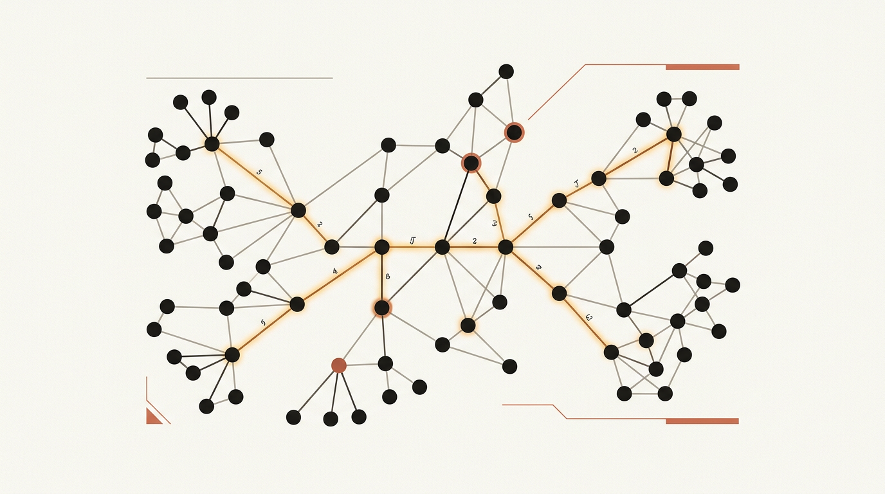
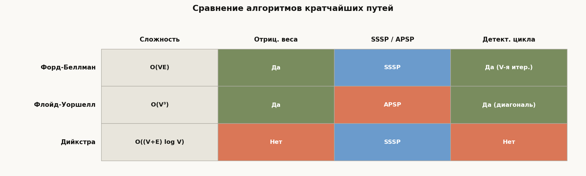

# Лекция 18: Кратчайшие пути в графах



Поиск кратчайшего пути — одна из центральных задач теории графов и практической алгоритмики. Навигаторы, маршрутизаторы, логистические системы, компиляторы с анализом зависимостей — все они опираются на алгоритмы, которые рассматриваются в этой лекции. В отличие от обходов BFS и DFS, здесь рёбра имеют веса, и простой счётчик шагов уже не работает. Задача усложняется, когда веса могут быть отрицательными: появляется угроза отрицательных циклов, превращающих понятие «кратчайшего пути» в бессмыслицу. Лекция строится на понятии **релаксации** — единой операции, которая лежит в основе всех трёх алгоритмов. Различаются они лишь порядком применения релаксаций, и именно это определяет их сложность и область применимости.

Главная линия лекции:

$$
\text{Релаксация} \to \text{Форд-Беллман} \to \text{Флойд-Уоршелл} \to \text{Дийкстра}
$$

**Как читать эту лекцию:**

- Раздел 2 (релаксация) — фундамент; остальные разделы ссылаются на него
- Разделы 3–5 — три алгоритма; каждый содержит полный код на C++ и трассировку на примере
- Раздел 6 — таблица сравнения поможет быстро выбрать нужный алгоритм на экзамене
- Типичные ошибки и вопросы для самопроверки — обязательны перед вступительным экзаменом

---

## План

1. Постановка задачи: SSSP и APSP
2. Релаксация — базовая операция
3. Алгоритм Форда-Беллмана
4. Алгоритм Флойда-Уоршелла
5. Алгоритм Дийкстры
6. Сравнение алгоритмов
7. Типичные ошибки
8. Что важно для поступления в ШАД
9. Итог
10. Вопросы для самопроверки

---

## 1. Постановка задачи: SSSP и APSP

**Определение.** Дан взвешенный ориентированный граф $G = (V, E)$ с функцией весов $w: E \to \mathbb{R}$. **Длина пути** $p = v_0 \to v_1 \to \cdots \to v_k$ равна сумме весов рёбер:

$$
w(p) = \sum_{i=1}^{k} w(v_{i-1}, v_i)
$$

**Кратчайший путь** из $u$ в $v$ — путь с минимальной длиной. Расстояние $\delta(u, v)$ равно $+\infty$, если $v$ недостижима из $u$, и $-\infty$, если существует отрицательный цикл на пути из $u$ в $v$.

**Два варианта задачи:**

- **SSSP (Single-Source Shortest Paths)** — от одной вершины-источника $s$ найти кратчайшие пути до всех остальных вершин.
- **APSP (All-Pairs Shortest Paths)** — для каждой пары вершин $(i, j)$ найти $\delta(i, j)$.

**Отрицательные циклы.** Если на пути из $s$ в $v$ есть цикл с отрицательным суммарным весом, то, проходя по нему сколько угодно раз, можно уменьшать длину пути до $-\infty$. В таком случае задача не имеет смысла, и алгоритм обязан это обнаружить.

**Пример графа (для всей лекции — 5 вершин):**

```
Вершины: 0, 1, 2, 3, 4
Рёбра (u → v, вес):
  0 → 1, вес  6
  0 → 2, вес  7
  1 → 2, вес  8
  1 → 3, вес  5
  1 → 4, вес -4
  2 → 3, вес -3
  2 → 4, вес  9
  3 → 1, вес -2
  4 → 0, вес  2
  4 → 3, вес  7
```

Источник: $s = 0$. Ожидаемые расстояния: $\delta(0,0)=0,\ \delta(0,1)=2,\ \delta(0,2)=7,\ \delta(0,3)=4,\ \delta(0,4)=-2$.

---

## 2. Релаксация — базовая операция

**Определение.** Пусть `dist[v]` — текущая оценка расстояния от источника $s$ до $v$. Изначально:

$$
\text{dist}[s] = 0, \quad \text{dist}[v] = +\infty \text{ для всех } v \neq s
$$

**Операция релаксации** ребра $(u, v)$ с весом $w$:

$$
\text{Relax}(u, v, w): \quad \text{если } \text{dist}[u] + w < \text{dist}[v], \text{ то } \text{dist}[v] \leftarrow \text{dist}[u] + w
$$

Интуиция: мы проверяем, нельзя ли добраться до $v$ быстрее, если пройти через $u$. Если да — обновляем оценку.

**Ключевое свойство.** После достаточного числа релаксаций все `dist[v]` сойдутся к истинным расстояниям $\delta(s, v)$ (при отсутствии отрицательных циклов). Три алгоритма ниже различаются только ответом на вопрос: **в каком порядке и сколько раз применять релаксации?**

```cpp
// Базовая операция релаксации
void relax(int u, int v, long long w, vector<long long>& dist) {
    if (dist[u] != LLONG_MAX && dist[u] + w < dist[v]) {
        dist[v] = dist[u] + w;
    }
}
```

---

## 3. Алгоритм Форда-Беллмана

### Идея

Кратчайший путь без отрицательных циклов содержит не более $V - 1$ рёбер (иначе путь проходит через одну вершину дважды — есть цикл). Значит, достаточно выполнить $V - 1$ итераций, на каждой из которых расслаблять **все** рёбра. После $k$-й итерации `dist[v]` содержит длину кратчайшего пути, использующего не более $k$ рёбер.

**Сложность:** $O(VE)$ по времени, $O(V)$ по памяти.

**Детектирование отрицательного цикла:** если после $V - 1$ итераций хоть одна релаксация ещё срабатывает — в графе есть отрицательный цикл.

### Код на C++

```cpp
#include <bits/stdc++.h>
using namespace std;

struct Edge { int u, v; long long w; };

// Возвращает вектор dist[] или пустой вектор при отрицательном цикле
vector<long long> bellman_ford(int n, const vector<Edge>& edges, int src) {
    const long long INF = LLONG_MAX / 2;
    vector<long long> dist(n, INF);
    dist[src] = 0;

    // V-1 итераций релаксации всех рёбер
    for (int iter = 0; iter < n - 1; ++iter) {
        bool updated = false;
        for (const auto& e : edges) {
            if (dist[e.u] < INF && dist[e.u] + e.w < dist[e.v]) {
                dist[e.v] = dist[e.u] + e.w;
                updated = true;
            }
        }
        if (!updated) break; // ранняя остановка
    }

    // V-я итерация: проверка на отрицательный цикл
    for (const auto& e : edges) {
        if (dist[e.u] < INF && dist[e.u] + e.w < dist[e.v]) {
            return {}; // отрицательный цикл
        }
    }
    return dist;
}
```

### Пример трассировки

Граф из раздела 1, источник $s = 0$, 5 вершин, поэтому $V - 1 = 4$ итерации.

Рёбра в порядке обхода: $(0,1,6),\ (0,2,7),\ (1,2,8),\ (1,3,5),\ (1,4,-4),\ (2,3,-3),\ (2,4,9),\ (3,1,-2),\ (4,0,2),\ (4,3,7)$.

| Итерация | dist[0] | dist[1] | dist[2] | dist[3] | dist[4] |
|:--------:|:-------:|:-------:|:-------:|:-------:|:-------:|
| Начало   | 0       | ∞       | ∞       | ∞       | ∞       |
| 1        | 0       | 6       | 7       | 11      | 2       |
| 2        | 0       | 2       | 7       | 4       | -2      |
| 3        | 0       | 2       | 7       | 4       | -2      |
| 4        | 0       | 2       | 7       | 4       | -2      |

На итерации 2 ребро $(3,1,-2)$ обновляет $\text{dist}[1] = 4 + (-2) = 2$, а ребро $(1,4,-4)$ — $\text{dist}[4] = 2 + (-4) = -2$. На итерациях 3 и 4 изменений нет — алгоритм сошёлся.

**Когда использовать:** граф с отрицательными рёбрами (но без отрицательных циклов), или когда нужно обнаружить отрицательный цикл.

---

## 4. Алгоритм Флойда-Уоршелла

### Идея

Решает задачу APSP (все пары) за $O(V^3)$. Ключевая идея — **динамическое программирование по промежуточным вершинам**.

Пусть $d[k][i][j]$ — длина кратчайшего пути из $i$ в $j$, в котором промежуточными могут быть только вершины $\{0, 1, \ldots, k-1\}$.

**Начальное состояние** ($k = 0$, промежуточных вершин нет):

$$
d[0][i][j] = \begin{cases} 0 & \text{если } i = j \\ w(i, j) & \text{если ребро } (i,j) \text{ существует} \\ +\infty & \text{иначе} \end{cases}
$$

**Переход:**

$$
d[k][i][j] = \min\bigl(d[k-1][i][j],\; d[k-1][i][k-1] + d[k-1][k-1][j]\bigr)
$$

Смысл: либо кратчайший путь не проходит через вершину $k-1$ (первый аргумент), либо проходит — тогда он состоит из пути $i \to k-1$ и пути $k-1 \to j$.

На практике измерение $k$ убирают, работая на месте — корректность гарантируется структурой рекуррентности.

**Детектирование отрицательного цикла:** если $\text{dist}[i][i] < 0$ после алгоритма, то $i$ лежит на отрицательном цикле.

### Код на C++

```cpp
#include <bits/stdc++.h>
using namespace std;

const long long INF = 1e18;

// dist[i][j] — матрица расстояний, next[i][j] — следующая вершина для пути i->j
void floyd_warshall(int n, vector<vector<long long>>& dist,
                    vector<vector<int>>& nxt) {
    // Инициализация next[][] для восстановления пути
    for (int i = 0; i < n; ++i)
        for (int j = 0; j < n; ++j)
            nxt[i][j] = (dist[i][j] < INF) ? j : -1;

    // Основной цикл: k — промежуточная вершина
    for (int k = 0; k < n; ++k) {
        for (int i = 0; i < n; ++i) {
            for (int j = 0; j < n; ++j) {
                if (dist[i][k] < INF && dist[k][j] < INF &&
                    dist[i][k] + dist[k][j] < dist[i][j]) {
                    dist[i][j] = dist[i][k] + dist[k][j];
                    nxt[i][j] = nxt[i][k];
                }
            }
        }
    }
    // Детектирование отрицательного цикла: dist[i][i] < 0
}

// Восстановление пути из i в j
vector<int> reconstruct_path(int i, int j,
                             const vector<vector<int>>& nxt) {
    if (nxt[i][j] == -1) return {}; // нет пути
    vector<int> path = {i};
    while (i != j) {
        i = nxt[i][j];
        path.push_back(i);
    }
    return path;
}
```

### Пример трассировки (4 вершины)

Граф: $0 \to 1$ (вес 3), $0 \to 3$ (вес 7), $1 \to 0$ (вес 8), $1 \to 2$ (вес 2), $2 \to 0$ (вес 5), $2 \to 3$ (вес 1), $3 \to 0$ (вес 2).

Начальная матрица `dist` (∞ = нет ребра):

|   | 0 | 1 | 2 | 3 |
|---|---|---|---|---|
| 0 | 0 | 3 | ∞ | 7 |
| 1 | 8 | 0 | 2 | ∞ |
| 2 | 5 | ∞ | 0 | 1 |
| 3 | 2 | ∞ | ∞ | 0 |

После $k = 0$ (промежуточная вершина 0): обновляется $d[1][2]$: нет улучшения через 0; $d[3][1] = d[3][0] + d[0][1] = 2 + 3 = 5$.

После $k = 1$ (промежуточная вершина 1): $d[0][2] = d[0][1] + d[1][2] = 3 + 2 = 5$.

После $k = 2$ (промежуточная вершина 2): $d[0][3] = d[0][2] + d[2][3] = 5 + 1 = 6$; $d[1][3] = d[1][2] + d[2][3] = 2 + 1 = 3$.

После $k = 3$ (промежуточная вершина 3): $d[0][0] = \min(0, d[0][3] + d[3][0]) = \min(0, 6 + 2) = 0$; $d[2][0] = \min(5, d[2][3] + d[3][0]) = \min(5, 1 + 2) = 3$.

Итоговая матрица:

|   | 0 | 1 | 2 | 3 |
|---|---|---|---|---|
| 0 | 0 | 3 | 5 | 6 |
| 1 | 8 | 0 | 2 | 3 |
| 2 | 3 | 6 | 0 | 1 |
| 3 | 2 | 5 | 7 | 0 |

**Когда использовать:** задача APSP на небольшом плотном графе ($V \lesssim 500$), допустимы отрицательные веса без отрицательных циклов.

---

## 5. Алгоритм Дийкстры

### Идея

Решает SSSP для графов с **неотрицательными** весами. Жадный алгоритм: на каждом шаге выбираем непосещённую вершину с минимальным `dist[]` и «закрепляем» её (settle). После закрепления вершины её расстояние уже не изменится.

**Корректность.** Пусть $v$ — вершина с минимальным `dist[v]` среди незакреплённых. Докажем, что `dist[v]` уже финально. Любой другой путь $s \to \cdots \to u \to \cdots \to v$ проходит через некоторую незакреплённую вершину $u$, у которой `dist[u] >= dist[v]`. Поскольку все веса неотрицательны, дальнейшее продвижение только увеличит длину — улучшить `dist[v]` невозможно.

**Почему не работает с отрицательными рёбрами:** если после закрепления $v$ есть ребро $(v, u, w)$ с $w < 0$, то через $v$ можно получить более короткий путь до $u$, чем уже закреплённый — алгоритм пропустит это обновление.

**Сложность с двоичной кучей:** $O((V + E) \log V)$.

### Код на C++

```cpp
#include <bits/stdc++.h>
using namespace std;

using ll = long long;
using pli = pair<ll, int>;

vector<ll> dijkstra(int n, const vector<vector<pair<int,ll>>>& adj, int src) {
    const ll INF = LLONG_MAX / 2;
    vector<ll> dist(n, INF);
    dist[src] = 0;

    // min-heap: (расстояние, вершина)
    priority_queue<pli, vector<pli>, greater<pli>> pq;
    pq.push({0, src});

    while (!pq.empty()) {
        auto [d, u] = pq.top(); pq.pop();

        // Устаревшая запись в куче — пропускаем
        if (d > dist[u]) continue;

        for (auto [v, w] : adj[u]) {
            if (dist[u] + w < dist[v]) {
                dist[v] = dist[u] + w;
                pq.push({dist[v], v});
            }
        }
    }
    return dist;
}
```

### Пример трассировки (6 вершин)

Граф: $0 \to 1$ (2), $0 \to 2$ (4), $1 \to 2$ (1), $1 \to 3$ (7), $2 \to 4$ (3), $3 \to 5$ (1), $4 \to 3$ (2), $4 \to 5$ (5), источник $s = 0$.

| Шаг | Закрепляем | dist[0] | dist[1] | dist[2] | dist[3] | dist[4] | dist[5] | Очередь |
|-----|-----------|---------|---------|---------|---------|---------|---------|---------|
| Нач.| —         | 0       | ∞       | ∞       | ∞       | ∞       | ∞       | {(0,0)} |
| 1   | 0         | 0       | 2       | 4       | ∞       | ∞       | ∞       | {(2,1),(4,2)} |
| 2   | 1         | 0       | 2       | 3       | 9       | ∞       | ∞       | {(3,2),(4,2),(9,3)} |
| 3   | 2         | 0       | 2       | 3       | 9       | 6       | ∞       | {(4,2)→устар.,(6,4),(9,3)} |
| 4   | 4         | 0       | 2       | 3       | 8       | 6       | 11      | {(8,3),(9,3),(11,5)} |
| 5   | 3         | 0       | 2       | 3       | 8       | 6       | 9       | {(9,3)→устар.,(9,5),(11,5)} |
| 6   | 5         | 0       | 2       | 3       | 8       | 6       | 9       | пусто |

Ответ: расстояния от 0 до вершин — $[0, 2, 3, 8, 6, 9]$.

**Когда использовать:** SSSP на графе с неотрицательными весами, нужна максимальная скорость.

---

## 6. Сравнение алгоритмов



| Алгоритм | Сложность | Отриц. веса | Отриц. циклы | SSSP / APSP |
|---|---|---|---|---|
| Форд-Беллман | $O(VE)$ | Да | Обнаруживает | SSSP |
| Флойд-Уоршелл | $O(V^3)$ | Да | Обнаруживает | APSP |
| Дийкстра | $O((V+E)\log V)$ | Нет | Нет | SSSP |

**Правило выбора:**

- Есть отрицательные веса → **Форд-Беллман** (SSSP) или **Флойд-Уоршелл** (APSP).
- Граф разреженный, все веса неотрицательны → **Дийкстра** (быстрее всего).
- Нужны все пары, граф небольшой ($V \leq 500$) → **Флойд-Уоршелл** (три строки кода).
- Нужно обнаружить отрицательный цикл → оба: Форд-Беллман (V-я итерация) или Флойд-Уоршелл (диагональ).

---

## 7. Типичные ошибки

**Ошибка 1: Применение Дийкстры к графу с отрицательными рёбрами.**

Алгоритм закрепляет вершины жадно и не пересматривает закреплённые. Отрицательное ребро может дать путь, который «улучшает» уже закреплённое расстояние — результат будет неверным без единого предупреждения.

**Ошибка 2: Переполнение при сложении INF + w.**

Если `dist[u]` инициализирован как `INT_MAX` или `1e18`, прибавление к нему любого числа вызовет переполнение. Всегда проверяйте `dist[u] != INF` перед релаксацией или используйте `LLONG_MAX / 2`.

**Ошибка 3: Неверный счёт итераций в Форде-Беллмане.**

Правильно $V - 1$ итерация, где $V$ — число вершин. Ошибка: запустить $E$ итераций или $V$ итераций (тогда последняя «проверочная» не выполняется, и цикл не обнаруживается).

**Ошибка 4: Пропуск диагонали при детектировании цикла в Флойде-Уоршелле.**

После алгоритма нужно проверять `dist[i][i] < 0` для каждой вершины, а не только `dist[i][j] < 0` для $i \neq j$.

**Ошибка 5: Неправильная инициализация матрицы в Флойде-Уоршелле.**

Диагональ должна быть 0 ($d[i][i] = 0$), остальные — $+\infty$. Если ребро $(i,j)$ существует, `dist[i][j] = w(i,j)`. Частая ошибка: установить `dist[i][j] = INF` для всех пар включая диагональ.

**Ошибка 6: Использование устаревших записей в куче Дийкстры.**

В реализации с `priority_queue` одна вершина может быть добавлена несколько раз с разными расстояниями. Без проверки `if (d > dist[u]) continue;` алгоритм обработает устаревшие записи и даст неверный результат или работает медленнее.

---

## 8. Что важно для поступления в ШАД

- Уметь записать и объяснить операцию релаксации; понимать, что все три алгоритма — это разные порядки релаксаций
- Знать сложности: $O(VE)$, $O(V^3)$, $O((V+E)\log V)$ и аргументировать их
- Уметь детектировать отрицательный цикл обоими способами (V-я итерация, диагональ матрицы)
- Чётко формулировать, почему Дийкстра требует неотрицательных весов, и приводить контрпример
- Писать корректный код на C++ для каждого из трёх алгоритмов без подсказок
- Восстанавливать сам путь (через массив `prev[]` или `next[][]`), а не только его длину
- Различать SSSP и APSP; знать, когда Флойд-Уоршелл предпочтительнее Дийкстры, запущенной из каждой вершины
- Выполнять пошаговую трассировку алгоритмов на малых графах за конечное время

---

## 9. Итог

Задача кратчайших путей распадается на два класса: от одного источника (SSSP) и между всеми парами (APSP). В основе всех алгоритмов лежит единая операция релаксации — попытка улучшить оценку расстояния, используя новый путь. Форд-Беллман просто и надёжно перебирает все рёбра $V - 1$ раз, работает с отрицательными весами и умеет детектировать отрицательные циклы; его сложность $O(VE)$ — плата за универсальность. Флойд-Уоршелл решает APSP тремя вложенными циклами за $O(V^3)$ и прекрасно подходит для плотных графов небольшого размера. Дийкстра — самый быстрый из трёх при условии неотрицательных весов: жадный выбор ближайшей вершины с приоритетной очередью даёт $O((V+E)\log V)$. Умение выбирать нужный алгоритм, обосновывать его корректность и корректно реализовывать — обязательный навык для поступления в ШАД.

---

## 10. Вопросы для самопроверки

1. Что такое релаксация ребра? Запишите псевдокод операции `Relax(u, v, w)`.
2. Почему в алгоритме Форда-Беллмана достаточно $V - 1$ итерации? Что гарантирует это число?
3. Как алгоритм Форда-Беллмана обнаруживает отрицательный цикл? Что происходит на $V$-й итерации?
4. Запишите рекуррентность Флойда-Уоршелла и объясните смысл каждого слагаемого.
5. Почему во Флойде-Уоршелле достаточно одной матрицы (а не трёхмерного массива)?
6. Как по диагонали матрицы расстояний после Флойда-Уоршелла определить наличие отрицательного цикла?
7. Объясните жадную идею алгоритма Дийкстры: почему после закрепления вершины её расстояние не меняется?
8. Приведите конкретный пример графа с отрицательным ребром, на котором Дийкстра даёт неверный ответ.
9. Какова сложность Дийкстры с двоичной кучей, с фибоначчиевой? В чём разница на практике?
10. Когда выгоднее запустить Дийкстру из каждой вершины, а когда — один раз Флойда-Уоршелла?
11. Как модифицировать код Форда-Беллмана / Дийкстры, чтобы восстанавливать сам путь, а не только его длину?
12. Что произойдёт, если в граф с неотрицательными рёбрами добавить одно ребро с отрицательным весом и запустить Дийкстру?
