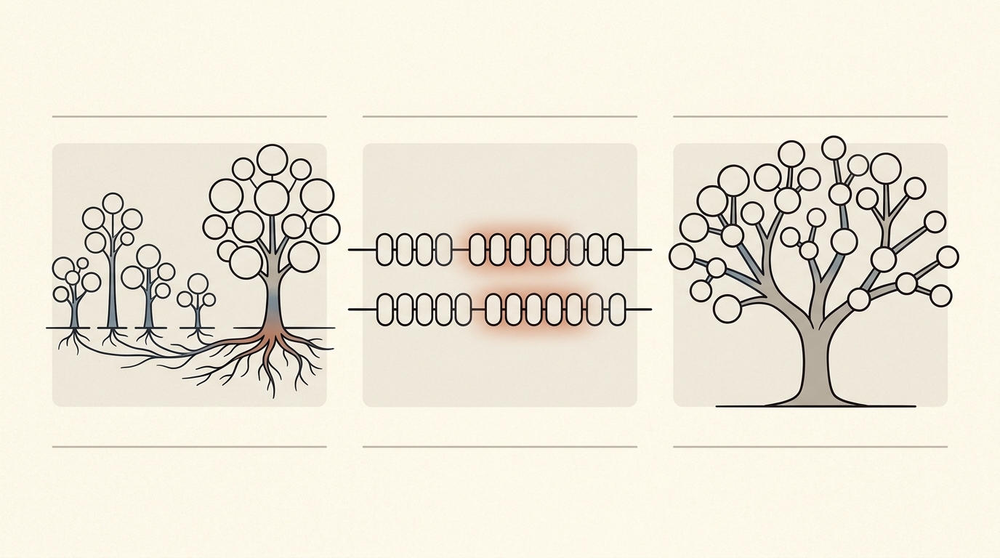

# Лекция 19: СНМ, КМП и префиксное дерево



Три темы этой лекции объединяет одна идея: **хранить информацию о структуре задачи в компактной форме, чтобы избежать лишней работы**. Система непересекающихся множеств (СНМ, DSU) заменяет явный перебор компонент графа на почти мгновенные запросы к лесу деревьев. Алгоритм Кнута–Морриса–Пратта (КМП) находит образец в тексте за линейное время, никогда не пересматривая уже проверенные символы. Префиксное дерево (бор, trie) структурирует словарь строк так, что поиск занимает время, пропорциональное длине слова, а не размеру словаря. Все три структуры входят в базовый арсенал участника олимпиад и часто появляются на вступительных экзаменах ШАД.

Главная линия лекции:

$$
\text{СНМ (Union-Find)} \;\to\; \text{КМП (prefix function + search)} \;\to\; \text{Бор (Trie)} \;\to\; \text{Aho-Corasick}
$$

**Как читать эту лекцию:**
- Раздел 1–4: СНМ — начните с наивной реализации, затем добавьте обе оптимизации и проверьте трассировку на примере.
- Раздел 5–6: КМП — сначала разберитесь с вычислением префикс-функции, затем поймите, как она используется при поиске.
- Раздел 7: Бор — реализуйте вставку и поиск на бумаге прежде, чем смотреть код.
- Разделы «Типичные ошибки» и «Вопросы для самопроверки» — обязательны перед экзаменом.

---

## План

1. СНМ — постановка задачи
2. Реализация леса
3. Оптимизации СНМ: ранги и сжатие пути
4. Применения СНМ
5. Префикс-функция
6. Алгоритм КМП
7. Бор (Trie, префиксное дерево)
8. Типичные ошибки
9. Что важно для поступления в ШАД
10. Итог
11. Вопросы для самопроверки

---

## 1. СНМ — постановка задачи

**Определение.** *Система непересекающихся множеств* (СНМ, Union-Find, DSU) — структура данных, которая поддерживает разбиение конечного множества $\{1, \ldots, n\}$ на попарно непересекающихся подмножества и выполняет операции:

- $\texttt{MakeSet}(x)$ — создать singleton-множество $\{x\}$.
- $\texttt{Find}(x)$ — вернуть *представителя* (корень) множества, которому принадлежит $x$.
- $\texttt{Union}(x, y)$ — объединить множества, содержащие $x$ и $y$.

**Ключевое свойство.** $\texttt{Find}(x) = \texttt{Find}(y)$ тогда и только тогда, когда $x$ и $y$ принадлежат одному множеству.

**Пример.** Пусть $n = 6$. Изначально: $\{1\}, \{2\}, \{3\}, \{4\}, \{5\}, \{6\}$.

После $\texttt{Union}(1,2)$: $\{1,2\}, \{3\}, \{4\}, \{5\}, \{6\}$.
После $\texttt{Union}(3,4)$: $\{1,2\}, \{3,4\}, \{5\}, \{6\}$.
После $\texttt{Union}(1,3)$: $\{1,2,3,4\}, \{5\}, \{6\}$.

Теперь $\texttt{Find}(2) = \texttt{Find}(4)$ — они в одном множестве.

---

## 2. Реализация леса

Каждый элемент хранит ссылку на *родителя*. Корень множества является сам себе родителем: $\texttt{parent}[r] = r$.

**MakeSet:** $\texttt{parent}[x] = x$.

**Find:** идём по родителям до корня.

**Union:** находим оба корня; один делаем родителем другого.

```cpp
#include <vector>
using namespace std;

struct DSU {
    vector<int> parent;

    DSU(int n) : parent(n) {
        for (int i = 0; i < n; i++) parent[i] = i;
    }

    int find(int x) {
        while (parent[x] != x) x = parent[x];
        return x;
    }

    void unite(int x, int y) {
        x = find(x); y = find(y);
        if (x != y) parent[x] = y;
    }
};
```

**Трассировка — наивный лес.** $n=6$, изначально $\texttt{parent}=[0,1,2,3,4,5]$.

| Операция | parent[] |
|---|---|
| unite(0,1) | [1,1,2,3,4,5] |
| unite(2,3) | [1,1,3,3,4,5] |
| unite(0,2) | find(0)=1, find(2)=3 → parent[1]=3 → [1,3,3,3,4,5] |
| unite(3,4) | find(3)=3, find(4)=4 → parent[3]=4 → [1,3,3,4,4,5] |

При цепочке $0 \to 1 \to 2 \to \cdots \to n-1$ Find работает за $O(n)$.

---

## 3. Оптимизации СНМ: ранги и сжатие пути

### 3.1 Объединение по рангу

Каждому корню сопоставим *ранг* — верхнюю оценку высоты его поддерева. При объединении корень с **меньшим** рангом присоединяется к корню с **большим** рангом. При равных рангах любой становится дочерним, ранг другого увеличивается на 1.

**Следствие.** Высота дерева не превышает $O(\log n)$, то есть Find за $O(\log n)$ в худшем случае.

### 3.2 Сжатие пути

При выполнении Find все узлы на пути от $x$ до корня *перевешиваются* непосредственно под корень.

```cpp
int find(int x) {
    if (parent[x] != x) parent[x] = find(parent[x]);
    return parent[x];
}
```

### 3.3 Полная реализация с обеими оптимизациями

```cpp
#include <vector>
using namespace std;

struct DSU {
    vector<int> parent, rank_;

    DSU(int n) : parent(n), rank_(n, 0) {
        for (int i = 0; i < n; i++) parent[i] = i;
    }

    int find(int x) {
        if (parent[x] != x)
            parent[x] = find(parent[x]);  // сжатие пути
        return parent[x];
    }

    bool unite(int x, int y) {
        x = find(x); y = find(y);
        if (x == y) return false;
        if (rank_[x] < rank_[y]) swap(x, y);
        parent[y] = x;                    // y под x
        if (rank_[x] == rank_[y]) rank_[x]++;
        return true;
    }

    bool same(int x, int y) { return find(x) == find(y); }
};
```

**Сложность.** При использовании обеих оптимизаций амортизированная стоимость каждой операции — $O(\alpha(n))$, где $\alpha$ — обратная функция Аккермана. Практически $\alpha(n) \le 4$ для любого разумного $n$, то есть операции работают за **константное время**.

**Трассировка сжатия пути.** Пусть parent = [1, 2, 3, 3] (цепочка $0 \to 1 \to 2 \to 3$).

Вызов $\texttt{find}(0)$:
- $\texttt{find}(0) \to \texttt{find}(1) \to \texttt{find}(2) \to \texttt{find}(3) = 3$
- Обратный ход: parent[2]=3, parent[1]=3, parent[0]=3
- После: parent = [3, 3, 3, 3] — «звезда» с корнем 3.

---

## 4. Применения СНМ

### 4.1 Алгоритм Крускала (MST)

Минимальное остовное дерево: сортируем рёбра по весу, добавляем ребро $(u,v)$, если $u$ и $v$ в разных компонентах.

```cpp
#include <vector>
#include <algorithm>
using namespace std;

struct Edge { int u, v, w; };

int kruskal(int n, vector<Edge>& edges) {
    sort(edges.begin(), edges.end(), [](const Edge& a, const Edge& b){
        return a.w < b.w;
    });
    DSU dsu(n);
    int total = 0, count = 0;
    for (auto& e : edges) {
        if (dsu.unite(e.u, e.v)) {
            total += e.w;
            count++;
            if (count == n - 1) break;
        }
    }
    return total;  // вес MST
}
```

**Сложность:** $O(E \log E + E \cdot \alpha(V))$ — доминирует сортировка.

### 4.2 Другие применения

- **Компоненты связности** в онлайн-режиме: добавляем рёбра одно за другим, отвечаем на запросы «в одной ли компоненте?»
- **Обнаружение циклов** в неориентированном графе: цикл есть тогда и только тогда, когда добавляемое ребро $(u,v)$ имеет $\texttt{Find}(u) = \texttt{Find}(v)$.
- **Offline LCA**: алгоритм Тарьяна для нахождения LCA за один DFS использует СНМ.
- **Динамическая связность** (offline): техника «разделяй и властвуй» по времени с откатом СНМ по рангу (без сжатия пути).

---

## 5. Префикс-функция

**Определение.** Для строки $s$ длины $n$ *префикс-функция* — массив $\pi$ длины $n$, где

$$
\pi[i] = \max\{k \mid 0 \le k < i+1,\; s[0..k-1] = s[i-k+1..i]\}
$$

То есть $\pi[i]$ — длина наибольшего *собственного* префикса строки $s[0..i]$, который одновременно является её суффиксом. По определению $\pi[0] = 0$.

**Пример.** $s = \texttt{ABABCABAB}$, $n = 9$.

| $i$ | $s[0..i]$ | Наибольший собственный префикс=суффикс | $\pi[i]$ |
|---|---|---|---|
| 0 | A | — | 0 |
| 1 | AB | — | 0 |
| 2 | ABA | A | 1 |
| 3 | ABAB | AB | 2 |
| 4 | ABABC | — | 0 |
| 5 | ABABCA | A | 1 |
| 6 | ABABCAB | AB | 2 |
| 7 | ABABCABA | ABA | 3 |
| 8 | ABABCABAB | ABAB | 4 |

**Алгоритм вычисления за $O(n)$:**

Ключевое наблюдение: если $\pi[i] = k > 0$, то $\pi[i-1]$ — следующий кандидат. Мы «откатываемся» через цепочку значений $k, \pi[k-1], \pi[\pi[k-1]-1], \ldots$ до тех пор, пока не найдём совпадение или не достигнем 0.

```cpp
#include <string>
#include <vector>
using namespace std;

vector<int> prefix_function(const string& s) {
    int n = s.size();
    vector<int> pi(n, 0);
    for (int i = 1; i < n; i++) {
        int k = pi[i - 1];
        while (k > 0 && s[i] != s[k]) k = pi[k - 1];
        if (s[i] == s[k]) k++;
        pi[i] = k;
    }
    return pi;
}
```

**Почему $O(n)$?** Переменная $k$ за всё время работы увеличивается не более чем на $n$ (каждый шаг внешнего цикла прибавляет не более 1), а значит суммарно она уменьшается тоже не более чем на $n$. Все откаты в while вместе — $O(n)$.

---

## 6. Алгоритм КМП

**Задача.** Дан текст $T$ длины $m$ и образец $P$ длины $n$. Найти все вхождения $P$ в $T$ за $O(m + n)$.

**Идея.** Строим «сконкатенированную» строку $P + \texttt{\$} + T$ (разделитель $\texttt{\$}$ не встречается в $P$ и $T$) и вычисляем для неё префикс-функцию. Позиция $i$ в $T$ является началом вхождения $P$ тогда и только тогда, когда $\pi[n+1+i+n-1] = n$.

Либо — эквивалентный и более прозрачный способ: сканируем $T$ с состоянием $j$ (текущая длина совпадения с $P$). На каждом шаге:
- Если $T[i] = P[j]$: $j$++, проверяем полное вхождение ($j = n$).
- Если несовпадение и $j > 0$: $j = \pi[j-1]$ (прыжок по префикс-функции).
- Иначе: $j = 0$, переходим к следующему $T[i]$.

```cpp
#include <string>
#include <vector>
using namespace std;

vector<int> kmp_search(const string& text, const string& pat) {
    vector<int> pi = prefix_function(pat);
    vector<int> result;
    int j = 0;
    for (int i = 0; i < (int)text.size(); i++) {
        while (j > 0 && text[i] != pat[j]) j = pi[j - 1];
        if (text[i] == pat[j]) j++;
        if (j == (int)pat.size()) {
            result.push_back(i - j + 1);  // начало вхождения
            j = pi[j - 1];
        }
    }
    return result;
}
```

**Трассировка.** $P = \texttt{ABABC}$, $T = \texttt{ABABABABC}$.

$\pi_P = [0, 0, 1, 2, 0]$.

| $i$ (в T) | T[i] | $j$ (до) | совпадение? | $j$ (после) |
|---|---|---|---|---|
| 0 | A | 0 | A=A ✓ | 1 |
| 1 | B | 1 | B=B ✓ | 2 |
| 2 | A | 2 | A=A ✓ | 3 |
| 3 | B | 3 | B=B ✓ | 4 |
| 4 | A | 4 | A≠C ✗, j=π[3]=2; A=A ✓ | 3 |
| 5 | B | 3 | B=B ✓ | 4 |
| 6 | A | 4 | A≠C ✗, j=π[3]=2; A=A ✓ | 3 |
| 7 | B | 3 | B=B ✓ | 4 |
| 8 | C | 4 | C=C ✓ | 5 → вхождение на позиции 4 |

Вхождение найдено на позиции $8 - 5 + 1 = 4$.

**Сложность:** $O(|P| + |T|)$ — ни один символ текста не просматривается дважды.

---

## 7. Бор (Trie, префиксное дерево)

**Определение.** *Бор* — корневое дерево, в котором:
- Каждое ребро помечено символом.
- Путь от корня до узла $v$ задаёт некоторый префикс.
- Узлы, соответствующие конце слова, помечены как *терминальные*.

**Вставка** слова $s$: идём по символам $s$, создавая новые узлы там, где их нет. Последний узел помечаем терминальным.

**Поиск** слова $s$: идём по символам $s$; если в какой-то момент нужного ребра нет — слово отсутствует. Если дошли до конца $s$ и узел терминальный — слово найдено.

**Пример.** Вставим слова `["car", "cart", "cat", "dog", "dot"]`:

```
root
├── c
│   └── a
│       ├── r  [*]           "car"
│       │   └── t  [*]       "cart"
│       └── t  [*]           "cat"
└── d
    └── o
        ├── g  [*]           "dog"
        └── t  [*]           "dot"
```

Поиск `"car"`: root → c → a → r (терминальный) → найдено.
Поиск `"cap"`: root → c → a → нет ребра `p` → не найдено.

### Реализация на C++

```cpp
#include <string>
#include <unordered_map>
using namespace std;

struct TrieNode {
    unordered_map<char, TrieNode*> children;
    bool is_end = false;
};

struct Trie {
    TrieNode* root;

    Trie() : root(new TrieNode()) {}

    void insert(const string& s) {
        TrieNode* cur = root;
        for (char c : s) {
            if (!cur->children.count(c))
                cur->children[c] = new TrieNode();
            cur = cur->children[c];
        }
        cur->is_end = true;
    }

    bool search(const string& s) const {
        TrieNode* cur = root;
        for (char c : s) {
            if (!cur->children.count(c)) return false;
            cur = cur->children[c];
        }
        return cur->is_end;
    }

    bool starts_with(const string& prefix) const {
        TrieNode* cur = root;
        for (char c : prefix) {
            if (!cur->children.count(c)) return false;
            cur = cur->children[c];
        }
        return true;
    }
};
```

**Вариант с массивом** (алфавит строчных латинских букв, быстрее):

```cpp
struct TrieNode {
    int children[26];
    bool is_end;
    TrieNode() : is_end(false) { fill(children, children + 26, -1); }
};

struct Trie {
    vector<TrieNode> nodes;

    Trie() { nodes.emplace_back(); }

    void insert(const string& s) {
        int cur = 0;
        for (char c : s) {
            int idx = c - 'a';
            if (nodes[cur].children[idx] == -1) {
                nodes[cur].children[idx] = nodes.size();
                nodes.emplace_back();
            }
            cur = nodes[cur].children[idx];
        }
        nodes[cur].is_end = true;
    }

    bool search(const string& s) const {
        int cur = 0;
        for (char c : s) {
            int idx = c - 'a';
            if (nodes[cur].children[idx] == -1) return false;
            cur = nodes[cur].children[idx];
        }
        return nodes[cur].is_end;
    }
};
```

**Сложность:**
- Вставка и поиск: $O(|s|)$.
- Память: $O(\text{сумма длин всех слов} \times |\Sigma|)$ в варианте с массивами; с `unordered_map` — $O(\text{сумма длин})$ узлов, но с большими константами.

### Применения бора

- **Автодополнение**: найти все слова с данным префиксом (обход поддерева).
- **Наибольший общий префикс (LCP)**: идём по бору до первого разветвления.
- **Проверка орфографии** и словари.
- **IP-маршрутизация** (prefix matching по бинарному представлению IP).
- **Алгоритм Aho-Corasick**: бор + КМП-подобные суффиксные ссылки для поиска нескольких образцов за $O(|T| + \sum|P_i| + \text{число вхождений})$.

---

## 8. Типичные ошибки

**Ошибка 1. Сжатие пути без объединения по рангу (или наоборот).**
Сжатие пути отдельно даёт $O(\log n)$, объединение по рангу отдельно — тоже $O(\log n)$. Только вместе они дают $O(\alpha(n))$. На больших входных данных разница ощутима.

**Ошибка 2. Объединение по высоте вместо ранга.**
После сжатия пути реальная высота дерева меняется, поэтому отслеживать её точно невозможно. Ранг — это *верхняя оценка* высоты, и он никогда не уменьшается. Именно поэтому корректен ранг, а не высота.

**Ошибка 3. Неверная инициализация $\pi$ в КМП.**
$\pi[0] = 0$ всегда. Ошибка — начинать внешний цикл с $i = 0$ (индекс 0 уже обработан), а не с $i = 1$.

**Ошибка 4. Забыть вычесть 1 при откате $j = \pi[j-1]$.**
При несовпадении мы используем $\pi[j-1]$, а не $\pi[j]$. Путаница между «текущей длиной совпадения» и «текущим индексом» — источник трудноуловимых ошибок.

**Ошибка 5. В боре — утечка памяти при использовании `new`.**
Реализация с массивом `nodes` (вектор узлов) избегает ручного управления памятью. Если используется `new`, нужен деструктор с рекурсивным удалением.

**Ошибка 6. Не помечать узел терминальным при вставке.**
Если `is_end` не выставлен, поиск вернёт `false` для слова, которое реально вставлено. Типичная опечатка: помечать родителя последнего символа вместо самого последнего узла.

**Ошибка 7. Разделитель в КМП не является уникальным.**
При конкатенации $P + \texttt{\$} + T$ символ `\$` должен гарантированно не встречаться ни в $P$, ни в $T$. Если это не так, алгоритм даст ложные вхождения через границу разделителя.

---

## 9. Что важно для поступления в ШАД

- **СНМ**: уметь писать DSU с обеими оптимизациями по памяти и объяснять, почему амортизированная сложность — $O(\alpha(n))$.
- **Алгоритм Крускала**: знать, как DSU используется для построения MST; уметь реализовать полный алгоритм.
- **Префикс-функция**: вычислять $\pi$ вручную на конкретной строке (это часто выносят в задание).
- **КМП**: понимать переход $j = \pi[j-1]$ при несовпадении и уметь найти все вхождения образца в тексте.
- **Бор**: вставка, поиск, подсчёт числа слов с заданным префиксом. Задачи на подсчёт XOR максимума через бинарный бор.
- **Aho-Corasick**: знать идею (бор + суффиксные ссылки), понимать построение за $O(\sum|P_i| \cdot |\Sigma|)$.
- **Анализ сложности**: обосновывать почему КМП работает за $O(n)$ (монотонность переменной $j$).

---

## 10. Итог

Три структуры данных этой лекции иллюстрируют мощь **заблаговременной обработки**: СНМ предобрабатывает разбиение элементов так, что запросы выполняются почти мгновенно; КМП предобрабатывает образец через префикс-функцию и никогда не возвращается назад по тексту; бор предобрабатывает словарь так, что любой запрос по строке занимает время, пропорциональное длине строки. Понимание этих структур открывает путь к более сложным алгоритмам: Aho-Corasick для многопаттернного поиска, суффиксные массивы и суффиксные деревья для полного анализа строк, LCT (Link-Cut Trees) как обобщение DSU для динамических деревьев.

---

## 11. Вопросы для самопроверки

1. Что такое представитель (корень) множества в СНМ? Гарантировано ли, что у двух различных множеств разные представители?
2. Объясните, почему объединение по рангу ограничивает высоту дерева $O(\log n)$. Покажите пример, когда без ранга дерево вырождается в цепочку.
3. Что происходит с рангами узлов при сжатии пути? Почему ранг не уменьшается?
4. Вычислите префикс-функцию для строки `s = "AABAABAAB"` вручную, шаг за шагом.
5. В алгоритме КМП при несовпадении $T[i] \ne P[j]$ мы делаем $j = \pi[j-1]$, а не $j = j - 1$. Объясните, что при этом мы «не упускаем» потенциальных вхождений.
6. Докажите, что переменная $j$ в КМП за всё время работы увеличивается не более чем на $|T|$, откуда следует линейность алгоритма.
7. Найдите все вхождения образца `"ABA"` в текст `"ABAABABAAB"` с помощью КМП (выпишите трассировку).
8. Что будет, если в бор вставить одно и то же слово дважды? Изменится ли структура дерева?
9. Как с помощью бора подсчитать количество слов из словаря, которые начинаются с заданного префикса?
10. Опишите идею алгоритма Aho-Corasick: что добавляется к бору и как это позволяет искать несколько образцов одновременно?
11. Приведите задачу на бинарный бор (например, максимальный XOR в массиве) и объясните, как она сводится к поиску в боре.
12. В задаче про онлайн-компоненты связности: как с помощью СНМ за $O((V + E)\alpha(V))$ обработать $E$ запросов на добавление рёбра и $Q$ запросов «в одной ли компоненте $u$ и $v$»?
